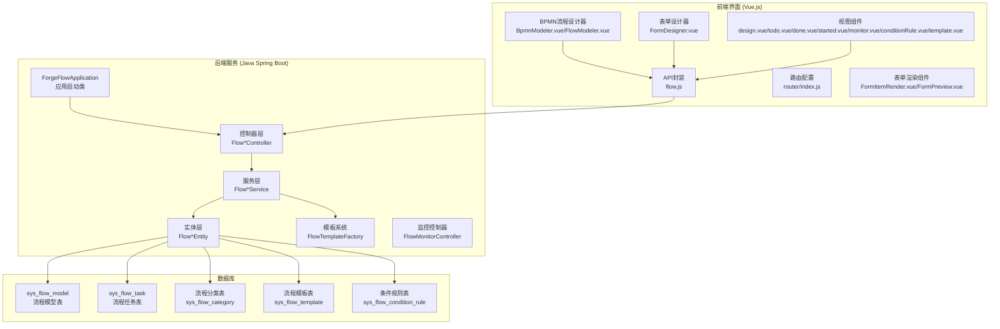
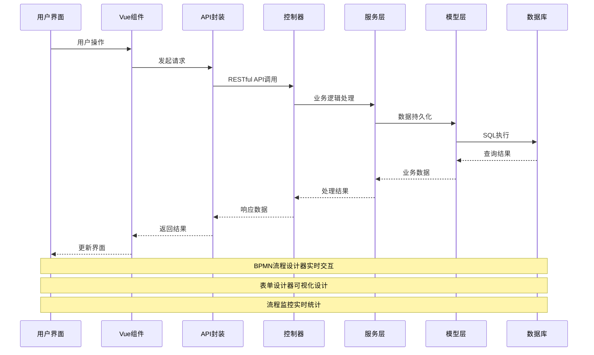
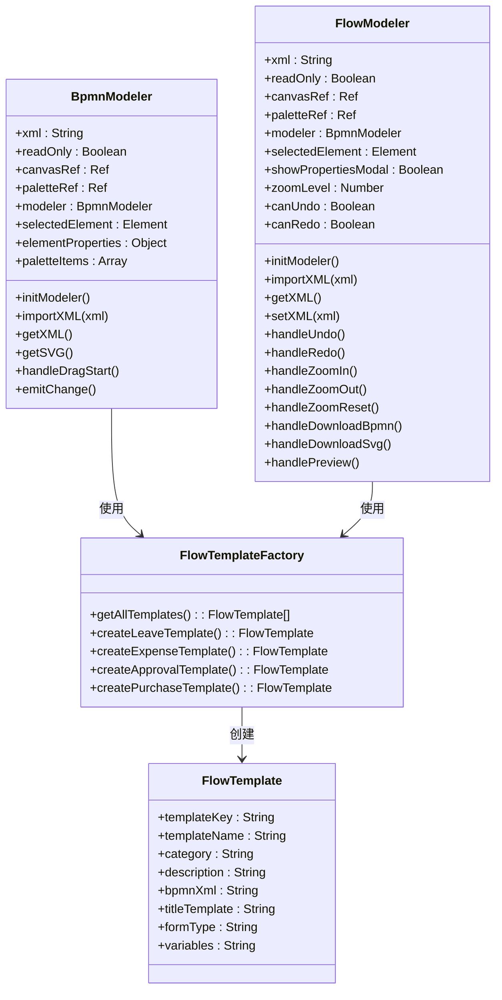
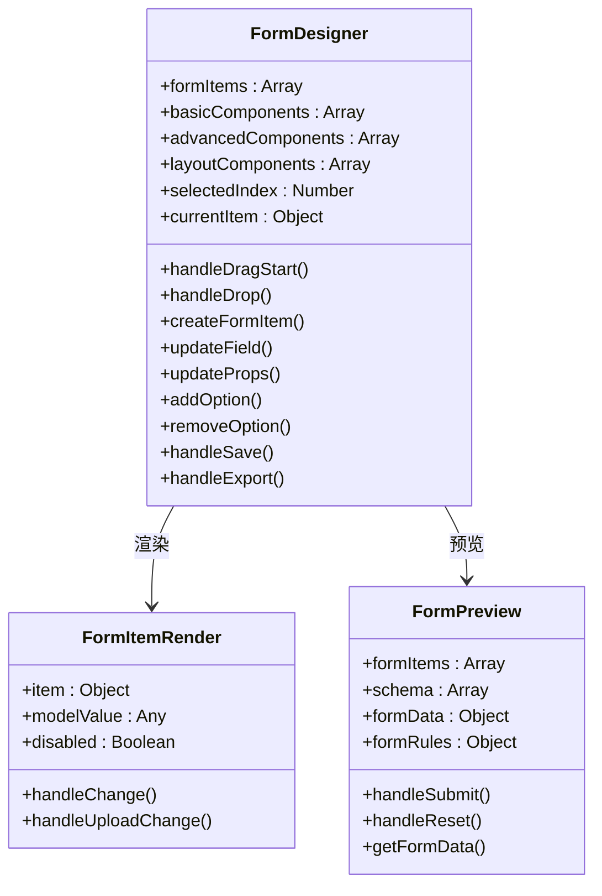
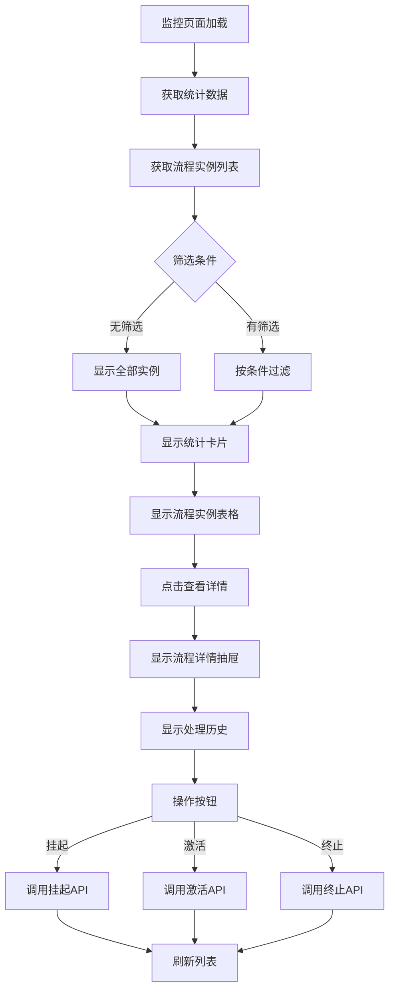
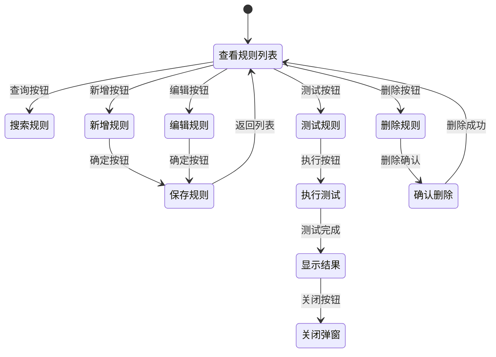
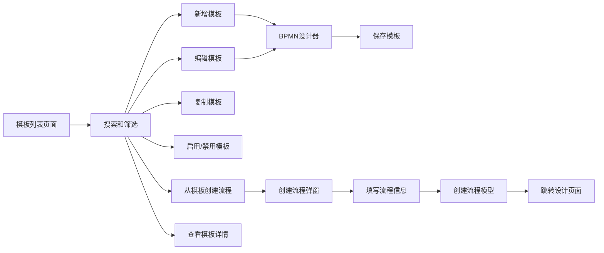
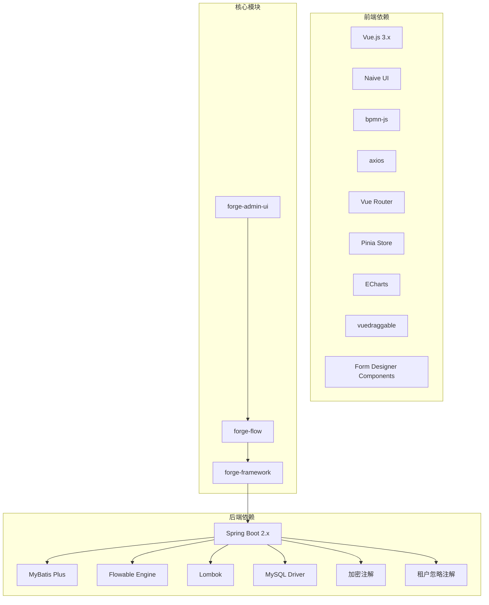
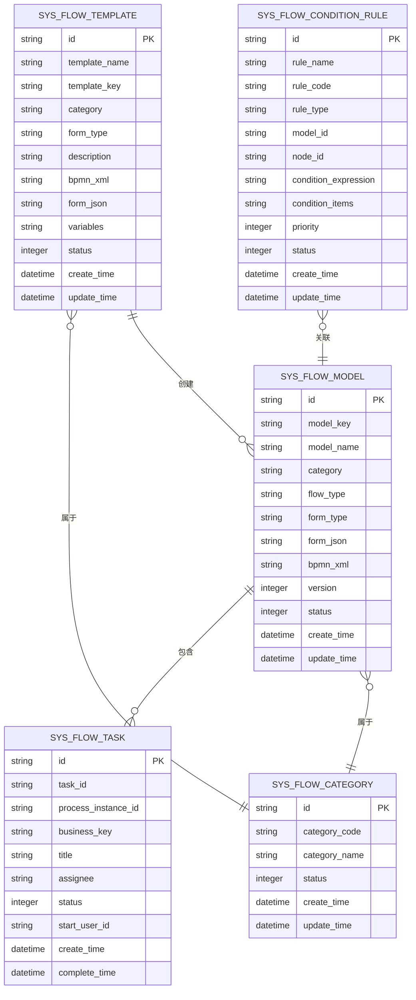
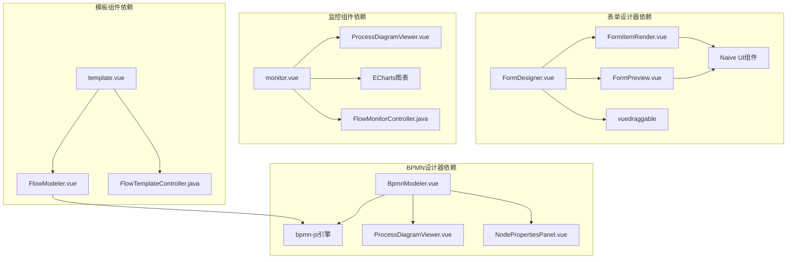

# 前端工作流组件

<cite>
**本文档引用的文件**
- [FlowInstanceController.java](file://forge/forge-flow/src/main/java/com/mdframe/forge/flow/controller/FlowInstanceController.java)
- [FlowModelController.java](file://forge/forge-flow/src/main/java/com/mdframe/forge/flow/controller/FlowModelController.java)
- [FlowTaskController.java](file://forge/forge-flow/src/main/java/com/mdframe/forge/flow/controller/FlowTaskController.java)
- [FlowTemplateController.java](file://forge/forge-flow/src/main/java/com/mdframe/forge/flow/controller/FlowTemplateController.java)
- [FlowCategoryController.java](file://forge/forge-flow/src/main/java/com/mdframe/forge/flow/controller/FlowCategoryController.java)
- [FlowMonitorController.java](file://forge/forge-flow/src/main/java/com/mdframe/forge/flow/controller/FlowMonitorController.java)
- [design.vue](file://forge-admin-ui/src/views/flow/design.vue)
- [todo.vue](file://forge-admin-ui/src/views/flow/todo.vue)
- [done.vue](file://forge-admin-ui/src/views/flow/done.vue)
- [started.vue](file://forge-admin-ui/src/views/flow/started.vue)
- [monitor.vue](file://forge-admin-ui/src/views/flow/monitor.vue)
- [conditionRule.vue](file://forge-admin-ui/src/views/flow/conditionRule.vue)
- [template.vue](file://forge-admin-ui/src/views/flow/template.vue)
- [flow.js](file://forge-admin-ui/src/api/flow.js)
- [BpmnModeler.vue](file://forge-admin-ui/src/components/bpmn/BpmnModeler.vue)
- [FlowModeler.vue](file://forge-admin-ui/src/components/bpmn/FlowModeler.vue)
- [ForgeFlowApplication.java](file://forge/forge-flow/src/main/java/com/mdframe/forge/flow/ForgeFlowApplication.java)
- [FlowModel.java](file://forge/forge-framework/forge-plugin-parent/forge-plugin-flow/src/main/java/com/mdframe/forge/starter/flow/entity/FlowModel.java)
- [FlowTask.java](file://forge/forge-framework/forge-plugin-parent/forge-plugin-flow/src/main/java/com/mdframe/forge/starter/flow/entity/FlowTask.java)
- [FlowTemplate.java](file://forge/forge-framework/forge-plugin-parent/forge-plugin-flow/src/main/java/com/mdframe/forge/starter/flow/template/FlowTemplate.java)
- [FlowTemplateFactory.java](file://forge/forge-framework/forge-plugin-parent/forge-plugin-flow/src/main/java/com/mdframe/forge/starter/flow/template/FlowTemplateFactory.java)
- [FormDesigner.vue](file://forge-admin-ui/src/components/form-designer/FormDesigner.vue)
- [FormItemRender.vue](file://forge-admin-ui/src/components/form-designer/FormItemRender.vue)
- [FormPreview.vue](file://forge-admin-ui/src/components/form-designer/FormPreview.vue)
</cite>

## 更新摘要
**所做更改**
- 新增条件规则视图组件的详细分析
- 新增流程监控视图组件的详细分析
- 新增流程模板视图组件的详细分析
- 新增表单设计器组件的详细分析
- 更新核心组件章节以包含所有新增组件
- 更新架构概览以反映完整的组件生态系统
- 新增组件间的依赖关系分析
- 更新API接口设计以包含新增的监控和模板接口

## 目录
1. [简介](#简介)
2. [项目结构](#项目结构)
3. [核心组件](#核心组件)
4. [架构概览](#架构概览)
5. [详细组件分析](#详细组件分析)
6. [依赖关系分析](#依赖关系分析)
7. [性能考虑](#性能考虑)
8. [故障排除指南](#故障排除指南)
9. [结论](#结论)

## 简介

前端工作流组件是基于 Spring Boot 和 Vue.js 构建的企业级工作流管理系统。该系统采用前后端分离架构，后端使用 Java Spring Boot 框架提供 RESTful API 接口，前端使用 Vue.js + Naive UI 构建用户界面，集成 BPMN 2.0 流程设计器和完整的表单设计器系统。

系统主要包含以下核心功能模块：
- 流程模型管理：支持流程设计、部署、版本控制
- 流程任务管理：待办、已办、发起的流程跟踪
- 流程实例管理：流程启动、终止、变量管理
- 流程模板系统：内置多种 OA 流程模板
- 流程分类管理：流程分类维护和权限控制
- 条件规则管理：动态条件规则配置和测试
- 流程监控：实时流程状态监控和统计分析
- 表单设计器：可视化表单设计和预览

## 项目结构



**图表来源**
- [ForgeFlowApplication.java:12-18](file://forge/forge-flow/src/main/java/com/mdframe/forge/flow/ForgeFlowApplication.java#L12-L18)
- [BpmnModeler.vue:1-606](file://forge-admin-ui/src/components/bpmn/BpmnModeler.vue#L1-L606)
- [FlowModeler.vue:1-571](file://forge-admin-ui/src/components/bpmn/FlowModeler.vue#L1-L571)
- [FormDesigner.vue:1-743](file://forge-admin-ui/src/components/form-designer/FormDesigner.vue#L1-L743)

**章节来源**
- [ForgeFlowApplication.java:1-20](file://forge/forge-flow/src/main/java/com/mdframe/forge/flow/ForgeFlowApplication.java#L1-L20)
- [FlowModelController.java:1-112](file://forge/forge-flow/src/main/java/com/mdframe/forge/flow/controller/FlowModelController.java#L1-L112)

## 核心组件

### 后端控制器层

系统采用分层架构设计，每个功能模块都有对应的控制器：

1. **FlowInstanceController** - 流程实例管理
   - 发起流程、终止流程、删除流程实例
   - 查询流程状态、管理流程变量

2. **FlowTaskController** - 流程任务管理
   - 待办任务、已办任务、发起的流程
   - 任务审批、转办、撤回、催办

3. **FlowModelController** - 流程模型管理
   - 模型创建、更新、删除
   - 模型部署、启用/禁用

4. **FlowTemplateController** - 流程模板管理
   - 模板列表、模板详情
   - 从模板创建流程模型
   - 模板启用/禁用、复制功能

5. **FlowCategoryController** - 流程分类管理
   - 分类 CRUD 操作
   - 启用/禁用分类

6. **FlowMonitorController** - 流程监控管理
   - 流程监控统计数据
   - 流程实例列表查询
   - 流程实例详情获取

### 前端组件层

1. **BPMN流程设计器**
   - **BpmnModeler.vue** - 基础BPMN流程设计器
     - 集成 bpmn-js 流程引擎
     - 支持拖拽式流程设计
     - 实时预览和导出功能
   - **FlowModeler.vue** - 流程模型设计器
     - 集成 Flowable 引擎
     - 支持流程模型的完整生命周期管理

2. **表单设计器系统**
   - **FormDesigner.vue** - 可视化表单设计器
     - 拖拽式组件设计
     - 实时预览和导出
     - 完整的表单配置功能
   - **FormItemRender.vue** - 表单组件渲染器
     - 支持80+种表单组件
     - 动态表单渲染
     - 校验规则支持
   - **FormPreview.vue** - 表单预览组件
     - 实时表单预览
     - 数据绑定和验证
     - 提交和重置功能

3. **流程视图组件**
   - **design.vue** - 流程设计页面
   - **todo.vue** - 待办任务页面
   - **done.vue** - 已办任务页面
   - **started.vue** - 发起的流程页面
   - **monitor.vue** - 流程监控页面
   - **conditionRule.vue** - 条件规则管理页面
   - **template.vue** - 流程模板管理页面

4. **API 封装层**
   - 统一的 HTTP 请求封装
   - 错误处理和响应格式化

**章节来源**
- [FlowInstanceController.java:14-105](file://forge/forge-flow/src/main/java/com/mdframe/forge/flow/controller/FlowInstanceController.java#L14-L105)
- [FlowTaskController.java:19-189](file://forge/forge-flow/src/main/java/com/mdframe/forge/flow/controller/FlowTaskController.java#L19-L189)
- [FlowModelController.java:14-112](file://forge/forge-flow/src/main/java/com/mdframe/forge/flow/controller/FlowModelController.java#L14-L112)
- [FlowTemplateController.java:25-141](file://forge/forge-flow/src/main/java/com/mdframe/forge/flow/controller/FlowTemplateController.java#L25-L141)
- [FlowMonitorController.java:38-250](file://forge/forge-flow/src/main/java/com/mdframe/forge/flow/controller/FlowMonitorController.java#L38-L250)

## 架构概览



**图表来源**
- [flow.js:1-469](file://forge-admin-ui/src/api/flow.js#L1-L469)
- [FlowTaskController.java:29-189](file://forge/forge-flow/src/main/java/com/mdframe/forge/flow/controller/FlowTaskController.java#L29-L189)
- [FlowMonitorController.java:48-250](file://forge/forge-flow/src/main/java/com/mdframe/forge/flow/controller/FlowMonitorController.java#L48-L250)

系统采用的技术栈：
- **后端**: Spring Boot 2.x + MyBatis Plus + Flowable
- **前端**: Vue.js 3.x + TypeScript + Naive UI + ECharts
- **数据库**: MySQL (通过 MyBatis Plus ORM)
- **流程引擎**: Flowable BPMN 2.0 引擎
- **构建工具**: Maven (后端) + Vite (前端)
- **图表库**: ECharts 用于监控数据可视化

## 详细组件分析

### BPMN流程设计器组件



**图表来源**
- [BpmnModeler.vue:168-491](file://forge-admin-ui/src/components/bpmn/BpmnModeler.vue#L168-L491)
- [FlowModeler.vue:1-571](file://forge-admin-ui/src/components/bpmn/FlowModeler.vue#L1-L571)
- [FlowTemplateFactory.java:12-25](file://forge/forge-framework/forge-plugin-parent/forge-plugin-flow/src/main/java/com/mdframe/forge/starter/flow/template/FlowTemplateFactory.java#L12-L25)
- [FlowTemplate.java:9-52](file://forge/forge-framework/forge-plugin-parent/forge-plugin-flow/src/main/java/com/mdframe/forge/starter/flow/template/FlowTemplate.java#L9-L52)

#### 设计器特性

1. **工具栏功能**
   - 撤销/重做操作
   - 缩放控制 (放大/缩小/适应屏幕)
   - 导入导出功能 (BPMN/XML/SVG)

2. **元素面板**
   - 流程元素拖拽 (开始事件、结束事件、用户任务等)
   - 自定义图标显示
   - 响应式布局

3. **属性面板**
   - 元素属性编辑
   - 用户任务审批人设置
   - 服务任务实现类型配置
   - 网关条件设置

4. **模板系统集成**
   - 内置 OA 流程模板
   - 快速创建流程模型
   - 标准化的 BPMN 结构

**章节来源**
- [BpmnModeler.vue:1-606](file://forge-admin-ui/src/components/bpmn/BpmnModeler.vue#L1-L606)
- [FlowModeler.vue:1-571](file://forge-admin-ui/src/components/bpmn/FlowModeler.vue#L1-L571)
- [FlowTemplateFactory.java:18-85](file://forge/forge-framework/forge-plugin-parent/forge-plugin-flow/src/main/java/com/mdframe/forge/starter/flow/template/FlowTemplateFactory.java#L18-L85)

### 表单设计器组件



**图表来源**
- [FormDesigner.vue:326-565](file://forge-admin-ui/src/components/form-designer/FormDesigner.vue#L326-L565)
- [FormItemRender.vue:299-344](file://forge-admin-ui/src/components/form-designer/FormItemRender.vue#L299-L344)
- [FormPreview.vue:29-151](file://forge-admin-ui/src/components/form-designer/FormPreview.vue#L29-L151)

#### 表单设计器特性

1. **组件面板**
   - 基础字段组件：输入框、文本域、数字输入等
   - 高级字段组件：文件上传、富文本、级联选择等
   - 布局组件：分割线、标题、描述文本等

2. **设计区域**
   - 拖拽式组件添加
   - 实时预览功能
   - 组件属性配置

3. **属性面板**
   - 基础属性：字段名、标签、默认值等
   - 组件特有属性：输入框长度、下拉选项等
   - 校验规则配置

4. **预览功能**
   - 实时表单预览
   - 数据绑定和验证
   - 提交和重置操作

**章节来源**
- [FormDesigner.vue:1-743](file://forge-admin-ui/src/components/form-designer/FormDesigner.vue#L1-L743)
- [FormItemRender.vue:1-361](file://forge-admin-ui/src/components/form-designer/FormItemRender.vue#L1-L361)
- [FormPreview.vue:1-164](file://forge-admin-ui/src/components/form-designer/FormPreview.vue#L1-L164)

### 流程监控组件



**图表来源**
- [monitor.vue:298-418](file://forge-admin-ui/src/views/flow/monitor.vue#L298-L418)
- [FlowMonitorController.java:48-214](file://forge/forge-flow/src/main/java/com/mdframe/forge/flow/controller/FlowMonitorController.java#L48-L214)

#### 监控功能特性

1. **统计面板**
   - 运行中流程实例数量
   - 待办任务数量
   - 今日完成流程数量
   - 超时任务数量

2. **实例监控**
   - 流程实例列表展示
   - 发起人、当前节点、处理人显示
   - 状态标识和运行时长计算

3. **图表分析**
   - 任务处理趋势图
   - 流程分布统计图
   - 实时数据可视化

4. **操作功能**
   - 流程实例详情查看
   - 流程图弹窗显示
   - 流程状态操作（挂起、激活、终止）

**章节来源**
- [monitor.vue:1-525](file://forge-admin-ui/src/views/flow/monitor.vue#L1-L525)
- [FlowMonitorController.java:38-250](file://forge/forge-flow/src/main/java/com/mdframe/forge/flow/controller/FlowMonitorController.java#L38-L250)

### 条件规则管理组件



**图表来源**
- [conditionRule.vue:325-496](file://forge-admin-ui/src/views/flow/conditionRule.vue#L325-L496)

#### 条件规则特性

1. **规则管理**
   - 规则名称、编码、类型配置
   - 关联流程和节点设置
   - 优先级和状态管理

2. **条件表达式**
   - SpEL表达式支持
   - 条件项组合
   - 实时测试功能

3. **数据字段**
   - 支持多种数据类型
   - 操作符选择
   - 值输入和验证

4. **操作功能**
   - 规则增删改查
   - 批量操作
   - 测试验证

**章节来源**
- [conditionRule.vue:1-526](file://forge-admin-ui/src/views/flow/conditionRule.vue#L1-L526)

### 流程模板管理组件



**图表来源**
- [template.vue:385-578](file://forge-admin-ui/src/views/flow/template.vue#L385-L578)

#### 模板管理特性

1. **模板管理**
   - 模板列表展示和搜索
   - 分类、状态筛选
   - 模板启用/禁用管理

2. **BPMN设计器集成**
   - 内置流程设计功能
   - 实时XML生成
   - 模板保存和更新

3. **模板操作**
   - 新增、编辑、删除模板
   - 复制模板功能
   - 从模板快速创建流程

4. **流程创建**
   - 从模板创建流程模型
   - 自动生成流程Key
   - 跳转到设计页面

**章节来源**
- [template.vue:1-594](file://forge-admin-ui/src/views/flow/template.vue#L1-L594)
- [FlowTemplateController.java:25-141](file://forge/forge-flow/src/main/java/com/mdframe/forge/flow/controller/FlowTemplateController.java#L25-L141)

### API 接口设计

```mermaid
graph LR
subgraph "流程任务接口"
A[/api/flow/task/todo<br/>我的待办任务]
B[/api/flow/task/done<br/>我的已办任务]
C[/api/flow/task/started<br/>我发起的流程]
D[/api/flow/task/candidate<br/>候选任务]
E[/api/flow/task/claim<br/>签收任务]
F[/api/flow/task/approve<br/>审批通过]
G[/api/flow/task/reject<br/>审批驳回]
end
subgraph "流程实例接口"
H[/api/flow/instance/start/{modelKey}<br/>发起流程]
I[/api/flow/instance/status/{businessKey}<br/>获取状态]
J[/api/flow/instance/terminate/{businessKey}<br/>终止流程]
K[/api/flow/instance/variables/{businessKey}<br/>流程变量]
end
subgraph "流程模型接口"
L[/api/flow/model/page<br/>模型分页]
M[/api/flow/model/{id}<br/>模型详情]
N[/api/flow/model/{id}/deploy<br/>部署模型]
O[/api/flow/model/{id}/disable<br/>禁用模型]
end
subgraph "流程模板接口"
P[/api/flow/template/page<br/>模板分页]
Q[/api/flow/template/enabled<br/>启用模板列表]
R[/api/flow/template/{id}<br/>模板详情]
S[/api/flow/template/{id}/enable<br/>启用模板]
T[/api/flow/template/{id}/disable<br/>禁用模板]
U[/api/flow/template/createModel/{templateKey}<br/>从模板创建流程]
end
subgraph "流程监控接口"
V[/api/flow/monitor/statistics<br/>监控统计]
W[/api/flow/monitor/instances<br/>实例列表]
X[/api/flow/monitor/instance/{id}<br/>实例详情]
end
subgraph "条件规则接口"
Y[/api/flow/conditionRule/page<br/>规则分页]
Z[/api/flow/conditionRule/test<br/>测试规则]
end
```

**图表来源**
- [flow.js:1-469](file://forge-admin-ui/src/api/flow.js#L1-L469)

**章节来源**
- [flow.js:1-469](file://forge-admin-ui/src/api/flow.js#L1-L469)
- [FlowTemplateController.java:25-141](file://forge/forge-flow/src/main/java/com/mdframe/forge/flow/controller/FlowTemplateController.java#L25-L141)
- [FlowMonitorController.java:38-250](file://forge/forge-flow/src/main/java/com/mdframe/forge/flow/controller/FlowMonitorController.java#L38-L250)

## 依赖关系分析



**图表来源**
- [ForgeFlowApplication.java:12-18](file://forge/forge-flow/src/main/java/com/mdframe/forge/flow/ForgeFlowApplication.java#L12-L18)
- [BpmnModeler.vue:170-175](file://forge-admin-ui/src/components/bpmn/BpmnModeler.vue#L170-L175)
- [FormDesigner.vue:308-311](file://forge-admin-ui/src/components/form-designer/FormDesigner.vue#L308-L311)

### 数据模型关系



**图表来源**
- [FlowModel.java:11-110](file://forge/forge-framework/forge-plugin-parent/forge-plugin-flow/src/main/java/com/mdframe/forge/starter/flow/entity/FlowModel.java#L11-L110)
- [FlowTask.java:11-153](file://forge/forge-framework/forge-plugin-parent/forge-plugin-flow/src/main/java/com/mdframe/forge/starter/flow/entity/FlowTask.java#L11-L153)
- [FlowTemplate.java:9-52](file://forge/forge-framework/forge-plugin-parent/forge-plugin-flow/src/main/java/com/mdframe/forge/starter/flow/template/FlowTemplate.java#L9-L52)

**章节来源**
- [FlowModel.java:1-110](file://forge/forge-framework/forge-plugin-parent/forge-plugin-flow/src/main/java/com/mdframe/forge/starter/flow/entity/FlowModel.java#L1-L110)
- [FlowTask.java:1-153](file://forge/forge-framework/forge-plugin-parent/forge-plugin-flow/src/main/java/com/mdframe/forge/starter/flow/entity/FlowTask.java#L1-L153)

### 组件间依赖关系



**图表来源**
- [monitor.vue:182-182](file://forge-admin-ui/src/views/flow/monitor.vue#L182-L182)
- [template.vue:167-167](file://forge-admin-ui/src/views/flow/template.vue#L167-L167)
- [FormDesigner.vue:309-311](file://forge-admin-ui/src/components/form-designer/FormDesigner.vue#L309-L311)

## 性能考虑

### 前端性能优化

1. **组件懒加载**
   - 路由级别的组件按需加载
   - 减少初始包体积

2. **虚拟滚动**
   - 大数据量表格使用虚拟滚动
   - 提升渲染性能

3. **缓存策略**
   - 分类数据本地缓存
   - 避免重复 API 调用

4. **图片优化**
   - 流程图采用 Blob URL
   - 按需加载和释放内存

5. **表单设计器优化**
   - 组件渲染按需进行
   - 属性面板懒加载
   - 大数据量表单的性能优化

6. **监控图表优化**
   - ECharts实例复用
   - 图表数据增量更新
   - 避免频繁重绘

### 后端性能优化

1. **数据库优化**
   - 合理的索引设计
   - 分页查询避免全表扫描

2. **连接池配置**
   - 连接池大小调优
   - 连接超时设置

3. **缓存机制**
   - 流程模板缓存
   - 分类数据缓存
   - 监控统计数据缓存

4. **加密性能**
   - API加解密优化
   - 租户隔离性能考虑

## 故障排除指南

### 常见问题及解决方案

1. **流程设计器无法加载**
   - 检查 bpmn-js 依赖是否正确引入
   - 确认网络连接正常
   - 验证浏览器兼容性

2. **表单设计器组件异常**
   - 检查 vuedraggable 依赖
   - 验证组件属性配置
   - 确认表单schema格式正确

3. **监控页面数据不更新**
   - 检查 Flowable 引擎状态
   - 验证数据库连接
   - 确认监控数据缓存配置

4. **模板创建失败**
   - 检查模板BPMN XML格式
   - 验证流程模型Key唯一性
   - 确认模板分类配置

5. **条件规则测试失败**
   - 检查SpEL表达式语法
   - 验证测试数据格式
   - 确认规则关联流程正确

6. **API调用错误**
   - 检查加密注解配置
   - 验证租户隔离设置
   - 确认权限配置正确

**章节来源**
- [BpmnModeler.vue:310-319](file://forge-admin-ui/src/components/bpmn/BpmnModeler.vue#L310-L319)
- [FormDesigner.vue:540-548](file://forge-admin-ui/src/components/form-designer/FormDesigner.vue#L540-L548)
- [monitor.vue:380-418](file://forge-admin-ui/src/views/flow/monitor.vue#L380-L418)
- [conditionRule.vue:474-496](file://forge-admin-ui/src/views/flow/conditionRule.vue#L474-L496)

## 结论

前端工作流组件是一个功能完整、架构清晰的企业级工作流管理系统。系统采用现代化的技术栈，提供了完整的流程生命周期管理能力和丰富的可视化设计工具。

### 主要优势

1. **技术先进性**
   - 基于 BPMN 2.0 标准的流程引擎
   - 响应式设计的前端界面
   - 模块化的系统架构
   - 完整的表单设计器系统

2. **功能完整性**
   - 覆盖工作流管理的全流程
   - 内置多种 OA 流程模板
   - 灵活的流程定制能力
   - 实时的流程监控和统计
   - 动态的条件规则配置

3. **用户体验**
   - 直观的拖拽式流程设计
   - 实时的流程状态跟踪
   - 可视化的表单设计
   - 移动端友好的界面设计

4. **开发效率**
   - 组件化设计提高开发效率
   - 完善的API接口文档
   - 丰富的示例和模板
   - 易于扩展的架构设计

### 发展建议

1. **增强智能化功能**
   - 添加AI驱动的流程优化建议
   - 完善智能表单填充功能
   - 增强条件规则的智能推荐

2. **扩展集成能力**
   - 支持更多第三方系统集成
   - 提供更丰富的API接口
   - 增强微服务架构支持

3. **提升性能表现**
   - 优化大数据量场景下的性能
   - 增强系统的可扩展性
   - 完善缓存和性能监控

4. **完善监控体系**
   - 添加更详细的流程执行监控
   - 增强日志记录和分析功能
   - 完善告警和通知机制

该系统为企业数字化转型提供了强有力的技术支撑，能够有效提升业务流程的自动化水平和管理效率。通过持续的功能完善和技术升级，该系统将成为企业工作流管理的最佳解决方案。