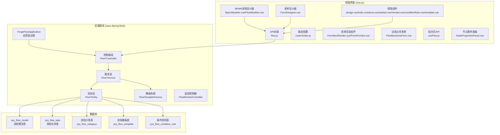
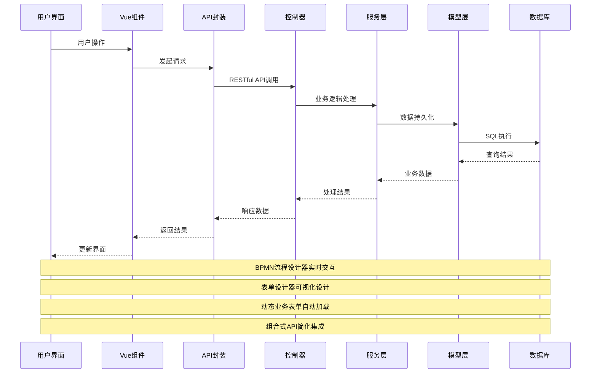
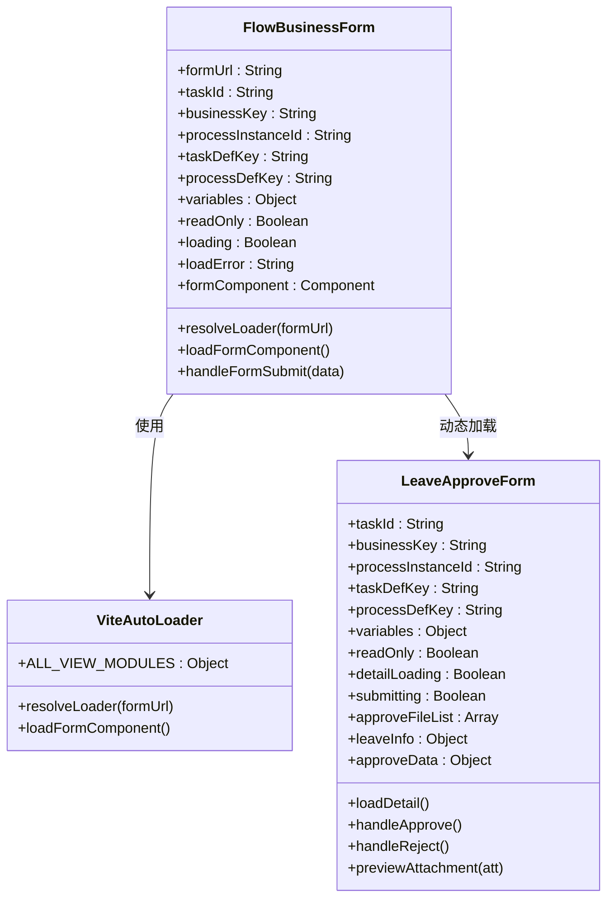
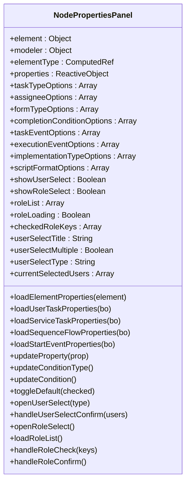
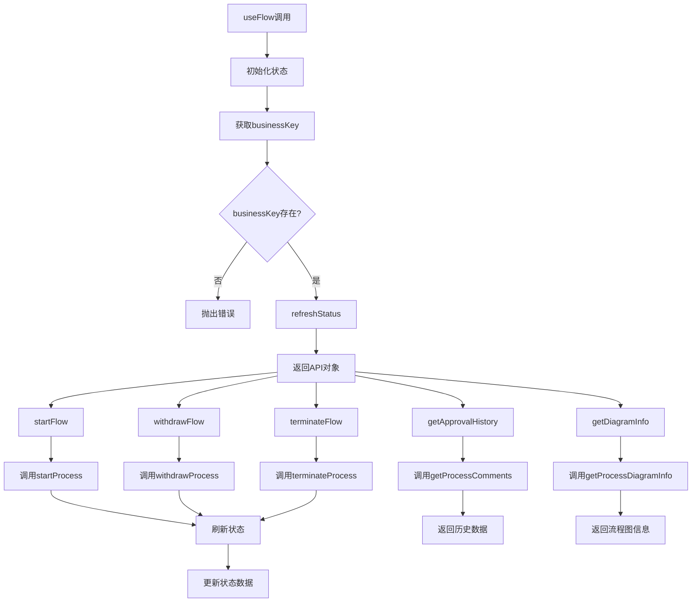
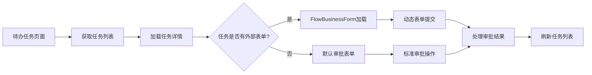
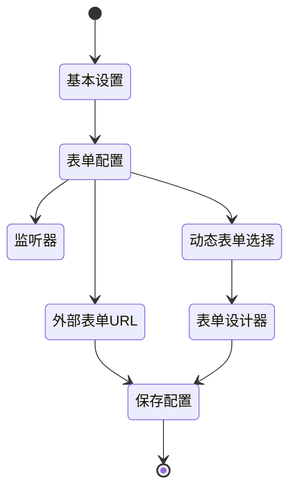
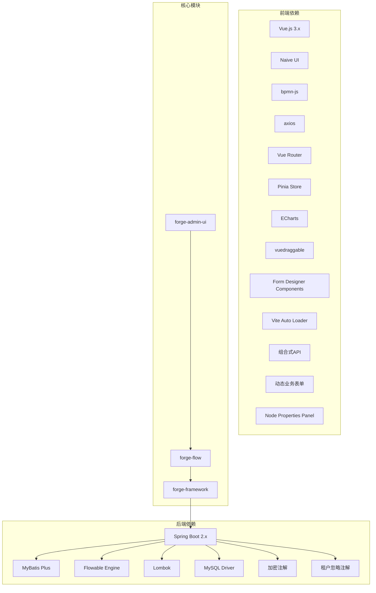
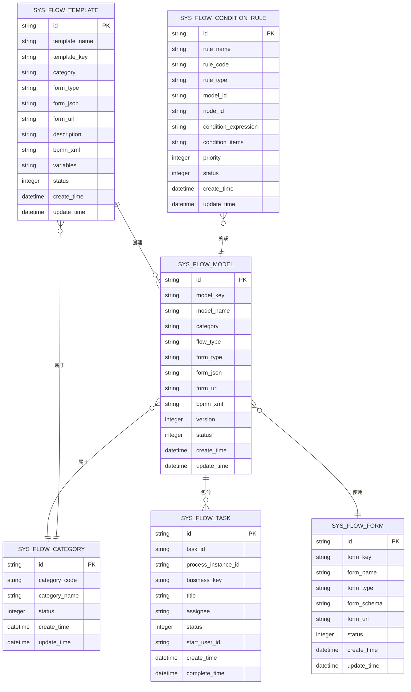
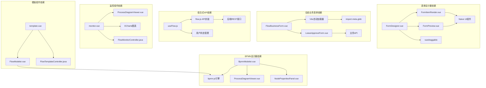

# 前端工作流组件

<cite>
**本文档引用的文件**
- [FlowInstanceController.java](file://forge/forge-flow/src/main/java/com/mdframe/forge/flow/controller/FlowInstanceController.java)
- [FlowModelController.java](file://forge/forge-flow/src/main/java/com/mdframe/forge/flow/controller/FlowModelController.java)
- [FlowTaskController.java](file://forge/forge-flow/src/main/java/com/mdframe/forge/flow/controller/FlowTaskController.java)
- [FlowTemplateController.java](file://forge/forge-flow/src/main/java/com/mdframe/forge/flow/controller/FlowTemplateController.java)
- [FlowCategoryController.java](file://forge/forge-flow/src/main/java/com/mdframe/forge/flow/controller/FlowCategoryController.java)
- [FlowMonitorController.java](file://forge/forge-flow/src/main/java/com/mdframe/forge/flow/controller/FlowMonitorController.java)
- [design.vue](file://forge-admin-ui/src/views/flow/design.vue)
- [todo.vue](file://forge-admin-ui/src/views/flow/todo.vue)
- [done.vue](file://forge-admin-ui/src/views/flow/done.vue)
- [started.vue](file://forge-admin-ui/src/views/flow/started.vue)
- [monitor.vue](file://forge-admin-ui/src/views/flow/monitor.vue)
- [conditionRule.vue](file://forge-admin-ui/src/views/flow/conditionRule.vue)
- [template.vue](file://forge-admin-ui/src/views/flow/template.vue)
- [flow.js](file://forge-admin-ui/src/api/flow.js)
- [BpmnModeler.vue](file://forge-admin-ui/src/components/bpmn/BpmnModeler.vue)
- [FlowModeler.vue](file://forge-admin-ui/src/components/bpmn/FlowModeler.vue)
- [NodePropertiesPanel.vue](file://forge-admin-ui/src/components/bpmn/NodePropertiesPanel.vue)
- [FlowBusinessForm.vue](file://forge-admin-ui/src/components/common/FlowBusinessForm.vue)
- [useFlow.js](file://forge-admin-ui/src/composables/useFlow.js)
- [LeaveApproveForm.vue](file://forge-admin-ui/src/views/leave/LeaveApproveForm.vue)
- [ForgeFlowApplication.java](file://forge/forge-flow/src/main/java/com/mdframe/forge/flow/ForgeFlowApplication.java)
- [FlowModel.java](file://forge/forge-framework/forge-plugin-parent/forge-plugin-flow/src/main/java/com/mdframe/forge/starter/flow/entity/FlowModel.java)
- [FlowTask.java](file://forge/forge-framework/forge-plugin-parent/forge-plugin-flow/src/main/java/com/mdframe/forge/starter/flow/entity/FlowTask.java)
- [FlowTemplate.java](file://forge/forge-framework/forge-plugin-parent/forge-plugin-flow/src/main/java/com/mdframe/forge/starter/flow/template/FlowTemplate.java)
- [FlowTemplateFactory.java](file://forge/forge-framework/forge-plugin-parent/forge-plugin-flow/src/main/java/com/mdframe/forge/starter/flow/template/FlowTemplateFactory.java)
- [FormDesigner.vue](file://forge-admin-ui/src/components/form-designer/FormDesigner.vue)
- [FormItemRender.vue](file://forge-admin-ui/src/components/form-designer/FormItemRender.vue)
- [FormPreview.vue](file://forge-admin-ui/src/components/form-designer/FormPreview.vue)
</cite>

## 更新摘要
**所做更改**
- 新增动态业务表单组件的详细分析
- 增强NodePropertiesPanel的序列流条件配置功能
- 新增useFlow组合式API的详细说明
- 更新流程任务视图以包含外部表单支持
- 新增流程模型设计视图的表单配置功能
- 更新API接口设计以包含新的表单相关接口
- 新增业务表单自动加载机制的分析

## 目录
1. [简介](#简介)
2. [项目结构](#项目结构)
3. [核心组件](#核心组件)
4. [架构概览](#架构概览)
5. [详细组件分析](#详细组件分析)
6. [依赖关系分析](#依赖关系分析)
7. [性能考虑](#性能考虑)
8. [故障排除指南](#故障排除指南)
9. [结论](#结论)

## 简介

前端工作流组件是基于 Spring Boot 和 Vue.js 构建的企业级工作流管理系统。该系统采用前后端分离架构，后端使用 Java Spring Boot 框架提供 RESTful API 接口，前端使用 Vue.js + Naive UI 构建用户界面，集成 BPMN 2.0 流程设计器和完整的表单设计器系统。

系统主要包含以下核心功能模块：
- 流程模型管理：支持流程设计、部署、版本控制
- 流程任务管理：待办、已办、发起的流程跟踪
- 流程实例管理：流程启动、终止、变量管理
- 流程模板系统：内置多种 OA 流程模板
- 流程分类管理：流程分类维护和权限控制
- 条件规则管理：动态条件规则配置和测试
- 流程监控：实时流程状态监控和统计分析
- 表单设计器：可视化表单设计和预览
- 动态业务表单：支持外部表单URL和自动加载
- 组合式API：简化业务流程集成

## 项目结构



**图表来源**
- [ForgeFlowApplication.java:12-18](file://forge/forge-flow/src/main/java/com/mdframe/forge/flow/ForgeFlowApplication.java#L12-L18)
- [BpmnModeler.vue:1-606](file://forge-admin-ui/src/components/bpmn/BpmnModeler.vue#L1-L606)
- [FlowModeler.vue:1-571](file://forge-admin-ui/src/components/bpmn/FlowModeler.vue#L1-L571)
- [FormDesigner.vue:1-743](file://forge-admin-ui/src/components/form-designer/FormDesigner.vue#L1-L743)
- [FlowBusinessForm.vue:1-174](file://forge-admin-ui/src/components/common/FlowBusinessForm.vue#L1-L174)
- [useFlow.js:1-342](file://forge-admin-ui/src/composables/useFlow.js#L1-L342)

**章节来源**
- [ForgeFlowApplication.java:1-20](file://forge/forge-flow/src/main/java/com/mdframe/forge/flow/ForgeFlowApplication.java#L1-L20)
- [FlowModelController.java:1-112](file://forge/forge-flow/src/main/java/com/mdframe/forge/flow/controller/FlowModelController.java#L1-L112)

## 核心组件

### 后端控制器层

系统采用分层架构设计，每个功能模块都有对应的控制器：

1. **FlowInstanceController** - 流程实例管理
   - 发起流程、终止流程、删除流程实例
   - 查询流程状态、管理流程变量

2. **FlowTaskController** - 流程任务管理
   - 待办任务、已办任务、发起的流程
   - 任务审批、转办、撤回、催办

3. **FlowModelController** - 流程模型管理
   - 模型创建、更新、删除
   - 模型部署、启用/禁用

4. **FlowTemplateController** - 流程模板管理
   - 模板列表、模板详情
   - 从模板创建流程模型
   - 模板启用/禁用、复制功能

5. **FlowCategoryController** - 流程分类管理
   - 分类 CRUD 操作
   - 启用/禁用分类

6. **FlowMonitorController** - 流程监控管理
   - 流程监控统计数据
   - 流程实例列表查询
   - 流程实例详情获取

### 前端组件层

1. **BPMN流程设计器**
   - **BpmnModeler.vue** - 基础BPMN流程设计器
     - 集成 bpmn-js 流程引擎
     - 支持拖拽式流程设计
     - 实时预览和导出功能
   - **FlowModeler.vue** - 流程模型设计器
     - 集成 Flowable 引擎
     - 支持流程模型的完整生命周期管理
   - **NodePropertiesPanel.vue** - 节点属性面板
     - 增强的序列流条件配置
     - 默认路径切换功能
     - 完整的节点属性编辑

2. **表单设计器系统**
   - **FormDesigner.vue** - 可视化表单设计器
     - 拖拽式组件设计
     - 实时预览和导出
     - 完整的表单配置功能
   - **FormItemRender.vue** - 表单组件渲染器
     - 支持80+种表单组件
     - 动态表单渲染
     - 校验规则支持
   - **FormPreview.vue** - 表单预览组件
     - 实时表单预览
     - 数据绑定和验证
     - 提交和重置功能

3. **动态业务表单系统**
   - **FlowBusinessForm.vue** - 动态业务表单组件
     - 自动加载业务表单组件
     - 支持外部表单URL
     - Vite自动扫描机制
   - **LeaveApproveForm.vue** - 请假审批表单示例
     - 完整的业务表单实现
     - 申请详情展示
     - 审批操作处理

4. **组合式API系统**
   - **useFlow.js** - 业务流程集成Composable
     - 简化业务流程集成
     - 状态管理和计算属性
     - 核心流程操作方法

5. **流程视图组件**
   - **design.vue** - 流程设计页面
     - 表单配置集成
     - 动态表单选择
     - 外部表单URL设置
   - **todo.vue** - 待办任务页面
     - 外部表单支持
     - 动态表单加载
     - 审批操作集成
   - **其他视图组件** - 已办、发起、监控、条件规则、模板管理页面

6. **API 封装层**
   - 统一的 HTTP 请求封装
   - 错误处理和响应格式化
   - 新增表单相关API接口

**章节来源**
- [FlowInstanceController.java:14-105](file://forge/forge-flow/src/main/java/com/mdframe/forge/flow/controller/FlowInstanceController.java#L14-L105)
- [FlowTaskController.java:19-189](file://forge/forge-flow/src/main/java/com/mdframe/forge/flow/controller/FlowTaskController.java#L19-L189)
- [FlowModelController.java:14-112](file://forge/forge-flow/src/main/java/com/mdframe/forge/flow/controller/FlowModelController.java#L14-L112)
- [FlowTemplateController.java:25-141](file://forge/forge-flow/src/main/java/com/mdframe/forge/flow/controller/FlowTemplateController.java#L25-L141)
- [FlowMonitorController.java:38-250](file://forge/forge-flow/src/main/java/com/mdframe/forge/flow/controller/FlowMonitorController.java#L38-L250)

## 架构概览



**图表来源**
- [flow.js:1-481](file://forge-admin-ui/src/api/flow.js#L1-L481)
- [FlowTaskController.java:29-189](file://forge/forge-flow/src/main/java/com/mdframe/forge/flow/controller/FlowTaskController.java#L29-L189)
- [FlowMonitorController.java:48-250](file://forge/forge-flow/src/main/java/com/mdframe/forge/flow/controller/FlowMonitorController.java#L48-L250)
- [FlowBusinessForm.vue:122-150](file://forge-admin-ui/src/components/common/FlowBusinessForm.vue#L122-L150)
- [useFlow.js:19-250](file://forge-admin-ui/src/composables/useFlow.js#L19-L250)

系统采用的技术栈：
- **后端**: Spring Boot 2.x + MyBatis Plus + Flowable
- **前端**: Vue.js 3.x + TypeScript + Naive UI + ECharts + Vite
- **数据库**: MySQL (通过 MyBatis Plus ORM)
- **流程引擎**: Flowable BPMN 2.0 引擎
- **构建工具**: Maven (后端) + Vite (前端)
- **图表库**: ECharts 用于监控数据可视化

## 详细组件分析

### 动态业务表单组件



**图表来源**
- [FlowBusinessForm.vue:43-158](file://forge-admin-ui/src/components/common/FlowBusinessForm.vue#L43-L158)
- [LeaveApproveForm.vue:146-297](file://forge-admin-ui/src/views/leave/LeaveApproveForm.vue#L146-L297)

#### 动态业务表单特性

1. **自动加载机制**
   - 利用 Vite 的 import.meta.glob 自动扫描 @/views 下的所有 .vue 文件
   - formUrl 即为组件相对路径（去掉 /src/views 前缀和 .vue 后缀）
   - 支持大小写不敏感匹配和去查询参数匹配
   - 新增业务表单无需任何配置，只需将组件放到 @/views 下对应目录即可

2. **表单URL配置**
   - 支持外部表单URL配置（formType=external）
   - 动态表单JSON配置（formType=dynamic）
   - 无表单模式（formType=none）

3. **加载状态管理**
   - 加载中状态显示
   - 加载失败错误提示
   - 自动重试机制
   - 组件缓存优化

4. **业务表单示例**
   - LeaveApproveForm 完整的业务表单实现
   - 申请详情只读展示
   - 审批操作处理
   - 附件上传和预览

**章节来源**
- [FlowBusinessForm.vue:1-174](file://forge-admin-ui/src/components/common/FlowBusinessForm.vue#L1-L174)
- [LeaveApproveForm.vue:1-351](file://forge-admin-ui/src/views/leave/LeaveApproveForm.vue#L1-L351)

### 增强的NodePropertiesPanel组件



**图表来源**
- [NodePropertiesPanel.vue:474-1330](file://forge-admin-ui/src/components/bpmn/NodePropertiesPanel.vue#L474-L1330)

#### 序列流条件配置增强

1. **条件类型支持**
   - 表达式条件（expression）
   - 脚本条件（script）
   - 自动清空相关配置

2. **脚本语言支持**
   - JavaScript
   - Groovy
   - JUEL
   - 语言格式自动检测

3. **默认路径功能**
   - 切换默认路径设置
   - 自动更新源节点的 default 属性
   - 支持取消默认路径

4. **用户任务增强**
   - 指定审批人、候选用户、候选组三种模式
   - 自定义表达式支持
   - 用户选择弹窗集成
   - 角色选择功能

**章节来源**
- [NodePropertiesPanel.vue:367-421](file://forge-admin-ui/src/components/bpmn/NodePropertiesPanel.vue#L367-L421)
- [NodePropertiesPanel.vue:1218-1272](file://forge-admin-ui/src/components/bpmn/NodePropertiesPanel.vue#L1218-L1272)

### useFlow组合式API



**图表来源**
- [useFlow.js:19-250](file://forge-admin-ui/src/composables/useFlow.js#L19-L250)

#### useFlow API特性

1. **状态管理**
   - 流程状态数据管理
   - 加载状态控制
   - 提交状态控制
   - 只读状态保护

2. **计算属性**
   - flowStatus - 当前流程状态
   - isRunning - 是否在运行中
   - isFinished - 是否已完成
   - canStart - 是否可以发起
   - canWithdraw - 是否可以撤回
   - statusText - 状态文本
   - statusTagType - 状态标签类型

3. **核心方法**
   - startFlow - 发起流程
   - withdrawFlow - 撤回流程
   - terminateFlow - 终止流程
   - refreshStatus - 刷新状态
   - getApprovalHistory - 获取审批历史
   - getDiagramInfo - 获取流程图信息

4. **useFlowTask API**
   - approve - 审批通过
   - reject - 审批驳回
   - delegate - 转办
   - claim - 签收

**章节来源**
- [useFlow.js:1-342](file://forge-admin-ui/src/composables/useFlow.js#L1-L342)

### 流程任务视图增强



**图表来源**
- [todo.vue:148-200](file://forge-admin-ui/src/views/flow/todo.vue#L148-L200)

#### 外部表单支持

1. **表单类型检测**
   - 自动检测任务表单类型
   - 支持动态表单和外部表单
   - 无表单模式降级处理

2. **动态表单加载**
   - FlowBusinessForm 组件自动加载
   - Vite自动扫描机制
   - 表单URL配置支持
   - 加载状态和错误处理

3. **审批操作集成**
   - 外部表单提交事件处理
   - 标准审批流程保持不变
   - 表单数据传递和处理

**章节来源**
- [todo.vue:148-200](file://forge-admin-ui/src/views/flow/todo.vue#L148-L200)
- [FlowBusinessForm.vue:122-150](file://forge-admin-ui/src/components/common/FlowBusinessForm.vue#L122-L150)

### 流程模型设计视图增强



**图表来源**
- [design.vue:75-163](file://forge-admin-ui/src/views/flow/design.vue#L75-L163)

#### 表单配置功能

1. **表单类型选择**
   - 动态表单（基于JSON Schema）
   - 外部表单（URL链接）
   - 无表单模式

2. **动态表单管理**
   - 选择已有表单
   - 设计新表单
   - 预览表单字段
   - 清除表单配置

3. **外部表单配置**
   - 输入表单URL
   - 支持相对路径和绝对路径
   - 自动验证URL格式

**章节来源**
- [design.vue:75-163](file://forge-admin-ui/src/views/flow/design.vue#L75-L163)

### API 接口设计增强

```mermaid
graph LR
subgraph "流程任务接口"
A[/api/flow/task/todo<br/>我的待办任务]
B[/api/flow/task/done<br/>我的已办任务]
C[/api/flow/task/started<br/>我发起的流程]
D[/api/flow/task/candidate<br/>候选任务]
E[/api/flow/task/claim<br/>签收任务]
F[/api/flow/task/approve<br/>审批通过]
G[/api/flow/task/reject<br/>审批驳回]
H[/api/flow/task/form/{taskId}<br/>获取任务表单信息]
I[/api/flow/task/withdraw<br/>撤回流程]
end
subgraph "流程实例接口"
J[/api/flow/instance/start/{modelKey}<br/>发起流程]
K[/api/flow/instance/status/{businessKey}<br/>获取状态]
L[/api/flow/instance/terminate/{businessKey}<br/>终止流程]
M[/api/flow/instance/variables/{businessKey}<br/>流程变量]
N[/api/flow/instance/{businessKey}<br/>删除流程实例]
end
subgraph "流程模型接口"
O[/api/flow/model/page<br/>模型分页]
P[/api/flow/model/{id}<br/>模型详情]
Q[/api/flow/model/{id}/deploy<br/>部署模型]
R[/api/flow/model/{id}/disable<br/>禁用模型]
S[/api/flow/model/{id}/suspend<br/>挂起模型]
T[/api/flow/model/{id}/activate<br/>激活模型]
U[/api/flow/model/{id}/copy<br/>复制模型]
end
subgraph "表单定义接口"
V[/api/flow/form/page<br/>表单分页]
W[/api/flow/form/enabled<br/>启用表单列表]
X[/api/flow/form/{id}<br/>表单详情]
Y[/api/flow/form/{id}/enable<br/>启用表单]
Z[/api/flow/form/{id}/disable<br/>禁用表单]
AA[/api/flow/form/{id}/copy<br/>复制表单]
AB[/api/flow/form/key/{formKey}<br/>根据Key获取表单]
AC[/api/flow/form/{id}/preview<br/>预览表单]
end
```

**图表来源**
- [flow.js:1-481](file://forge-admin-ui/src/api/flow.js#L1-L481)

**章节来源**
- [flow.js:1-481](file://forge-admin-ui/src/api/flow.js#L1-L481)

## 依赖关系分析



**图表来源**
- [ForgeFlowApplication.java:12-18](file://forge/forge-flow/src/main/java/com/mdframe/forge/flow/ForgeFlowApplication.java#L12-L18)
- [BpmnModeler.vue:170-175](file://forge-admin-ui/src/components/bpmn/BpmnModeler.vue#L170-L175)
- [FormDesigner.vue:308-311](file://forge-admin-ui/src/components/form-designer/FormDesigner.vue#L308-L311)
- [FlowBusinessForm.vue:87](file://forge-admin-ui/src/components/common/FlowBusinessForm.vue#L87)
- [useFlow.js:10-12](file://forge-admin-ui/src/composables/useFlow.js#L10-L12)

### 数据模型关系



**图表来源**
- [FlowModel.java:11-110](file://forge/forge-framework/forge-plugin-parent/forge-plugin-flow/src/main/java/com/mdframe/forge/starter/flow/entity/FlowModel.java#L11-L110)
- [FlowTask.java:11-153](file://forge/forge-framework/forge-plugin-parent/forge-plugin-flow/src/main/java/com/mdframe/forge/starter/flow/entity/FlowTask.java#L11-L153)
- [FlowTemplate.java:9-52](file://forge/forge-framework/forge-plugin-parent/forge-plugin-flow/src/main/java/com/mdframe/forge/starter/flow/template/FlowTemplate.java#L9-L52)

**章节来源**
- [FlowModel.java:1-110](file://forge/forge-framework/forge-plugin-parent/forge-plugin-flow/src/main/java/com/mdframe/forge/starter/flow/entity/FlowModel.java#L1-L110)
- [FlowTask.java:1-153](file://forge/forge-framework/forge-plugin-parent/forge-plugin-flow/src/main/java/com/mdframe/forge/starter/flow/entity/FlowTask.java#L1-L153)

### 组件间依赖关系增强



**图表来源**
- [FlowBusinessForm.vue:87](file://forge-admin-ui/src/components/common/FlowBusinessForm.vue#L87)
- [useFlow.js:10-12](file://forge-admin-ui/src/composables/useFlow.js#L10-L12)
- [monitor.vue:182-182](file://forge-admin-ui/src/views/flow/monitor.vue#L182-L182)
- [template.vue:167-167](file://forge-admin-ui/src/views/flow/template.vue#L167-L167)
- [FormDesigner.vue:309-311](file://forge-admin-ui/src/components/form-designer/FormDesigner.vue#L309-L311)

## 性能考虑

### 前端性能优化增强

1. **动态业务表单优化**
   - 组件懒加载和缓存
   - Vite自动扫描优化
   - 加载状态和错误处理
   - 组件卸载时的资源清理

2. **组合式API优化**
   - 状态响应式更新
   - 计算属性缓存
   - 异步操作并发控制
   - 用户状态共享

3. **BPMN设计器性能**
   - 节点属性面板按需渲染
   - 序列流条件配置优化
   - 大规模流程图渲染优化
   - 内存使用监控

4. **表单设计器优化**
   - 组件渲染按需进行
   - 属性面板懒加载
   - 大数据量表单的性能优化
   - 拖拽操作性能优化

5. **监控图表优化**
   - ECharts实例复用
   - 图表数据增量更新
   - 避免频繁重绘
   - 数据缓存策略

6. **API调用优化**
   - 请求去重和缓存
   - 批量操作支持
   - 错误重试机制
   - 网络状态监控

### 后端性能优化

1. **数据库优化**
   - 合理的索引设计
   - 分页查询避免全表扫描
   - 表单定义缓存
   - 流程状态缓存

2. **连接池配置**
   - 连接池大小调优
   - 连接超时设置
   - 缓存机制优化

3. **缓存机制增强**
   - 流程模板缓存
   - 分类数据缓存
   - 监控统计数据缓存
   - 表单定义缓存

4. **加密性能**
   - API加解密优化
   - 租户隔离性能考虑
   - 组合式API状态缓存

## 故障排除指南

### 常见问题及解决方案

1. **动态业务表单加载失败**
   - 检查表单URL格式和可用性
   - 验证Vite自动扫描配置
   - 确认组件路径正确
   - 检查表单组件导出格式

2. **NodePropertiesPanel功能异常**
   - 检查Flowable引擎状态
   - 验证序列流条件配置
   - 确认节点类型支持
   - 检查属性面板依赖

3. **useFlow API调用错误**
   - 验证businessKey格式
   - 检查流程状态
   - 确认用户权限
   - 验证流程模型Key

4. **流程设计器无法加载**
   - 检查 bpmn-js 依赖是否正确引入
   - 确认网络连接正常
   - 验证浏览器兼容性

5. **表单设计器组件异常**
   - 检查 vuedraggable 依赖
   - 验证组件属性配置
   - 确认表单schema格式正确

6. **监控页面数据不更新**
   - 检查 Flowable 引擎状态
   - 验证数据库连接
   - 确认监控数据缓存配置

7. **模板创建失败**
   - 检查模板BPMN XML格式
   - 验证流程模型Key唯一性
   - 确认模板分类配置

8. **条件规则测试失败**
   - 检查SpEL表达式语法
   - 验证测试数据格式
   - 确认规则关联流程正确

**章节来源**
- [FlowBusinessForm.vue:130-149](file://forge-admin-ui/src/components/common/FlowBusinessForm.vue#L130-L149)
- [NodePropertiesPanel.vue:1232-1272](file://forge-admin-ui/src/components/bpmn/NodePropertiesPanel.vue#L1232-L1272)
- [useFlow.js:86-102](file://forge-admin-ui/src/composables/useFlow.js#L86-L102)
- [BpmnModeler.vue:310-319](file://forge-admin-ui/src/components/bpmn/BpmnModeler.vue#L310-L319)
- [FormDesigner.vue:540-548](file://forge-admin-ui/src/components/form-designer/FormDesigner.vue#L540-L548)
- [monitor.vue:380-418](file://forge-admin-ui/src/views/flow/monitor.vue#L380-L418)
- [conditionRule.vue:474-496](file://forge-admin-ui/src/views/flow/conditionRule.vue#L474-L496)

## 结论

前端工作流组件经过本次更新，新增了动态业务表单组件、增强的NodePropertiesPanel和useFlow组合式API，进一步提升了系统的灵活性和易用性。系统采用现代化的技术栈，提供了完整的流程生命周期管理能力和丰富的可视化设计工具。

### 主要优势

1. **技术先进性**
   - 基于 BPMN 2.0 标准的流程引擎
   - 响应式设计的前端界面
   - 模块化的系统架构
   - 完整的表单设计器系统
   - Vite自动加载机制
   - 组合式API简化集成

2. **功能完整性**
   - 覆盖工作流管理的全流程
   - 内置多种 OA 流程模板
   - 灵活的流程定制能力
   - 实时的流程状态跟踪
   - 动态业务表单支持
   - 增强的节点属性配置
   - 简化的业务流程集成

3. **用户体验**
   - 直观的拖拽式流程设计
   - 实时的流程状态跟踪
   - 可视化的表单设计
   - 自动化的业务表单加载
   - 简洁的API调用体验
   - 移动端友好的界面设计

4. **开发效率**
   - 组件化设计提高开发效率
   - 完善的API接口文档
   - 丰富的示例和模板
   - 易于扩展的架构设计
   - 自动化的表单加载机制
   - 简化的业务集成方案

### 发展建议

1. **增强智能化功能**
   - 添加AI驱动的流程优化建议
   - 完善智能表单填充功能
   - 增强条件规则的智能推荐
   - 智能业务表单识别

2. **扩展集成能力**
   - 支持更多第三方系统集成
   - 提供更丰富的API接口
   - 增强微服务架构支持
   - 统一的业务表单标准

3. **提升性能表现**
   - 优化大数据量场景下的性能
   - 增强系统的可扩展性
   - 完善缓存和性能监控
   - 动态业务表单预加载

4. **完善监控体系**
   - 添加更详细的流程执行监控
   - 增强日志记录和分析功能
   - 完善告警和通知机制
   - 实时业务表单使用统计

5. **增强安全性**
   - 表单访问权限控制
   - 动态表单安全验证
   - API调用安全审计
   - 组合式API权限管理

该系统为企业数字化转型提供了强有力的技术支撑，能够有效提升业务流程的自动化水平和管理效率。通过持续的功能完善和技术升级，该系统将成为企业工作流管理的最佳解决方案。