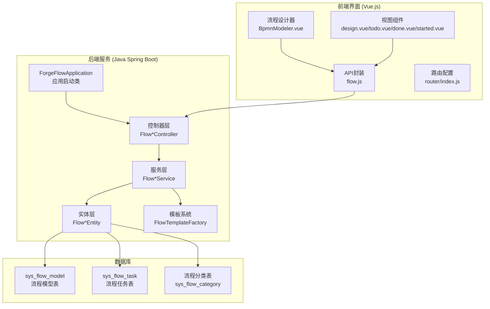
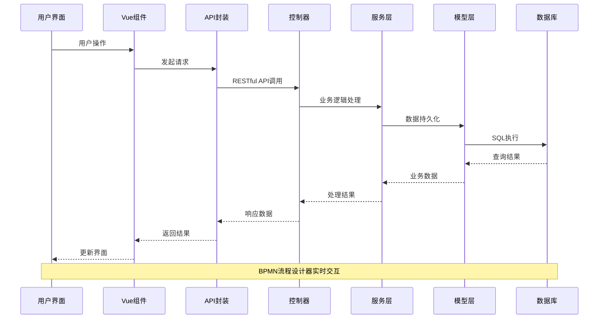
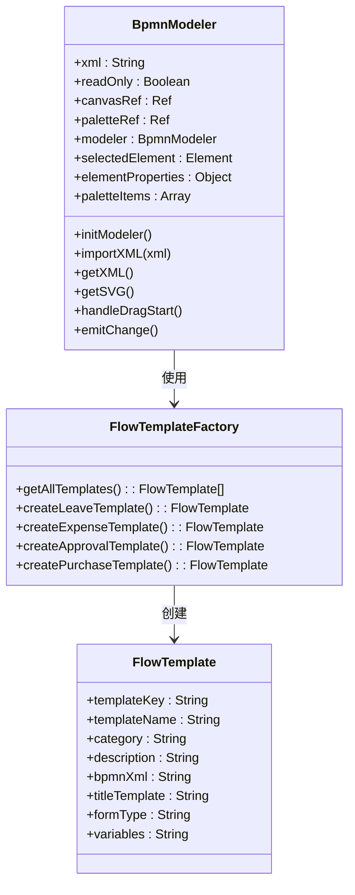
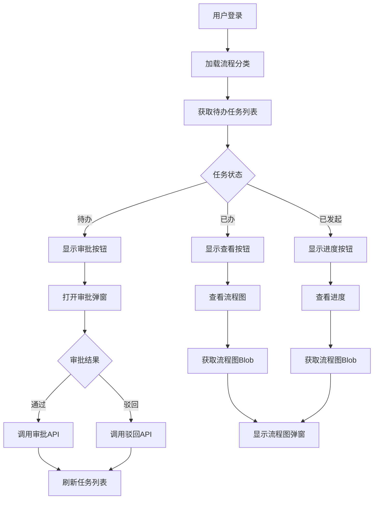
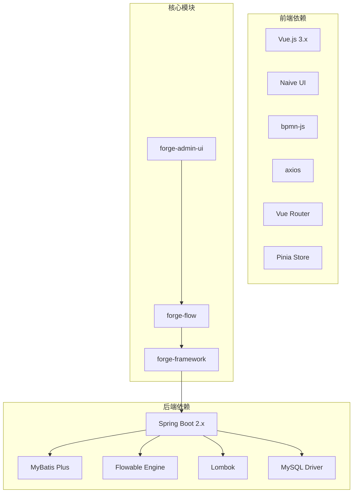
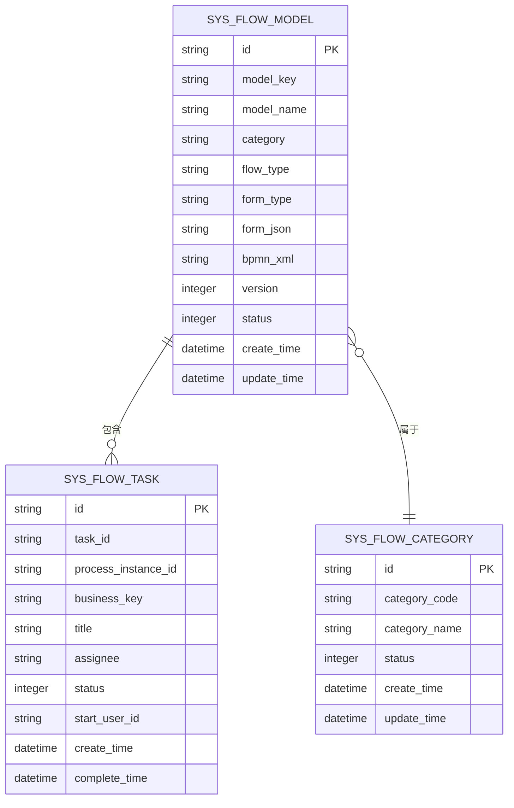

# 前端工作流组件

<cite>
**本文档引用的文件**
- [FlowInstanceController.java](file://forge/forge-flow/src/main/java/com/mdframe/forge/flow/controller/FlowInstanceController.java)
- [FlowModelController.java](file://forge/forge-flow/src/main/java/com/mdframe/forge/flow/controller/FlowModelController.java)
- [FlowTaskController.java](file://forge/forge-flow/src/main/java/com/mdframe/forge/flow/controller/FlowTaskController.java)
- [FlowTemplateController.java](file://forge/forge-flow/src/main/java/com/mdframe/forge/flow/controller/FlowTemplateController.java)
- [FlowCategoryController.java](file://forge/forge-flow/src/main/java/com/mdframe/forge/flow/controller/FlowCategoryController.java)
- [design.vue](file://forge-admin-ui/src/views/flow/design.vue)
- [todo.vue](file://forge-admin-ui/src/views/flow/todo.vue)
- [done.vue](file://forge-admin-ui/src/views/flow/done.vue)
- [started.vue](file://forge-admin-ui/src/views/flow/started.vue)
- [flow.js](file://forge-admin-ui/src/api/flow.js)
- [BpmnModeler.vue](file://forge-admin-ui/src/components/bpmn/BpmnModeler.vue)
- [ForgeFlowApplication.java](file://forge/forge-flow/src/main/java/com/mdframe/forge/flow/ForgeFlowApplication.java)
- [FlowModel.java](file://forge/forge-framework/forge-plugin-parent/forge-plugin-flow/src/main/java/com/mdframe/forge/starter/flow/entity/FlowModel.java)
- [FlowTask.java](file://forge/forge-framework/forge-plugin-parent/forge-plugin-flow/src/main/java/com/mdframe/forge/starter/flow/entity/FlowTask.java)
- [FlowTemplate.java](file://forge/forge-framework/forge-plugin-parent/forge-plugin-flow/src/main/java/com/mdframe/forge/starter/flow/template/FlowTemplate.java)
- [FlowTemplateFactory.java](file://forge/forge-framework/forge-plugin-parent/forge-plugin-flow/src/main/java/com/mdframe/forge/starter/flow/template/FlowTemplateFactory.java)
</cite>

## 目录
1. [简介](#简介)
2. [项目结构](#项目结构)
3. [核心组件](#核心组件)
4. [架构概览](#架构概览)
5. [详细组件分析](#详细组件分析)
6. [依赖关系分析](#依赖关系分析)
7. [性能考虑](#性能考虑)
8. [故障排除指南](#故障排除指南)
9. [结论](#结论)

## 简介

前端工作流组件是基于 Spring Boot 和 Vue.js 构建的企业级工作流管理系统。该系统采用前后端分离架构，后端使用 Java Spring Boot 框架提供 RESTful API 接口，前端使用 Vue.js + Naive UI 构建用户界面，集成 BPMN 2.0 流程设计器。

系统主要包含以下核心功能模块：
- 流程模型管理：支持流程设计、部署、版本控制
- 流程任务管理：待办、已办、发起的流程跟踪
- 流程实例管理：流程启动、终止、变量管理
- 流程模板系统：内置多种 OA 流程模板
- 流程分类管理：流程分类维护和权限控制

## 项目结构



**图表来源**
- [ForgeFlowApplication.java:12-18](file://forge/forge-flow/src/main/java/com/mdframe/forge/flow/ForgeFlowApplication.java#L12-L18)
- [BpmnModeler.vue:1-636](file://forge-admin-ui/src/components/bpmn/BpmnModeler.vue#L1-L636)
- [FlowModel.java:11-110](file://forge/forge-framework/forge-plugin-parent/forge-plugin-flow/src/main/java/com/mdframe/forge/starter/flow/entity/FlowModel.java#L11-L110)

**章节来源**
- [ForgeFlowApplication.java:1-20](file://forge/forge-flow/src/main/java/com/mdframe/forge/flow/ForgeFlowApplication.java#L1-L20)
- [FlowModelController.java:1-112](file://forge/forge-flow/src/main/java/com/mdframe/forge/flow/controller/FlowModelController.java#L1-L112)

## 核心组件

### 后端控制器层

系统采用分层架构设计，每个功能模块都有对应的控制器：

1. **FlowInstanceController** - 流程实例管理
   - 发起流程、终止流程、删除流程实例
   - 查询流程状态、管理流程变量

2. **FlowTaskController** - 流程任务管理
   - 待办任务、已办任务、发起的流程
   - 任务审批、转办、撤回、催办

3. **FlowModelController** - 流程模型管理
   - 模型创建、更新、删除
   - 模型部署、启用/禁用

4. **FlowTemplateController** - 流程模板管理
   - 模板列表、模板详情
   - 从模板创建流程模型

5. **FlowCategoryController** - 流程分类管理
   - 分类 CRUD 操作
   - 启用/禁用分类

### 前端组件层

1. **BpmnModeler.vue** - BPMN 流程设计器
   - 集成 bpmn-js 流程引擎
   - 支持拖拽式流程设计
   - 实时预览和导出功能

2. **流程视图组件**
   - **design.vue** - 流程设计页面
   - **todo.vue** - 待办任务页面
   - **done.vue** - 已办任务页面
   - **started.vue** - 发起的流程页面

3. **API 封装层**
   - 统一的 HTTP 请求封装
   - 错误处理和响应格式化

**章节来源**
- [FlowInstanceController.java:14-105](file://forge/forge-flow/src/main/java/com/mdframe/forge/flow/controller/FlowInstanceController.java#L14-L105)
- [FlowTaskController.java:19-189](file://forge/forge-flow/src/main/java/com/mdframe/forge/flow/controller/FlowTaskController.java#L19-L189)
- [FlowModelController.java:14-112](file://forge/forge-flow/src/main/java/com/mdframe/forge/flow/controller/FlowModelController.java#L14-L112)

## 架构概览



**图表来源**
- [flow.js:1-293](file://forge-admin-ui/src/api/flow.js#L1-L293)
- [FlowTaskController.java:29-189](file://forge/forge-flow/src/main/java/com/mdframe/forge/flow/controller/FlowTaskController.java#L29-L189)

系统采用的技术栈：
- **后端**: Spring Boot 2.x + MyBatis Plus + Flowable
- **前端**: Vue.js 3.x + TypeScript + Naive UI
- **数据库**: MySQL (通过 MyBatis Plus ORM)
- **流程引擎**: Flowable BPMN 2.0 引擎
- **构建工具**: Maven (后端) + Vite (前端)

## 详细组件分析

### BPMN 流程设计器组件



**图表来源**
- [BpmnModeler.vue:168-491](file://forge-admin-ui/src/components/bpmn/BpmnModeler.vue#L168-L491)
- [FlowTemplateFactory.java:12-25](file://forge/forge-framework/forge-plugin-parent/forge-plugin-flow/src/main/java/com/mdframe/forge/starter/flow/template/FlowTemplateFactory.java#L12-L25)
- [FlowTemplate.java:9-52](file://forge/forge-framework/forge-plugin-parent/forge-plugin-flow/src/main/java/com/mdframe/forge/starter/flow/template/FlowTemplate.java#L9-L52)

#### 设计器特性

1. **工具栏功能**
   - 撤销/重做操作
   - 缩放控制 (放大/缩小/适应屏幕)
   - 导出功能 (BPMN/XML/SVG)

2. **元素面板**
   - 流程元素拖拽 (开始事件、结束事件、用户任务等)
   - 自定义图标显示
   - 响应式布局

3. **属性面板**
   - 元素属性编辑
   - 用户任务审批人设置
   - 服务任务实现类型配置
   - 网关条件设置

4. **模板系统集成**
   - 内置 OA 流程模板
   - 快速创建流程模型
   - 标准化的 BPMN 结构

**章节来源**
- [BpmnModeler.vue:1-636](file://forge-admin-ui/src/components/bpmn/BpmnModeler.vue#L1-L636)
- [FlowTemplateFactory.java:18-85](file://forge/forge-framework/forge-plugin-parent/forge-plugin-flow/src/main/java/com/mdframe/forge/starter/flow/template/FlowTemplateFactory.java#L18-L85)

### 流程任务管理组件



**图表来源**
- [todo.vue:202-328](file://forge-admin-ui/src/views/flow/todo.vue#L202-L328)
- [done.vue:153-226](file://forge-admin-ui/src/views/flow/done.vue#L153-L226)
- [started.vue:144-217](file://forge-admin-ui/src/views/flow/started.vue#L144-L217)

#### 任务状态管理

系统支持多种任务状态：
- **待办任务** (0): 用户可处理的任务
- **已签收** (1): 用户已签收但未处理
- **已通过** (2): 审批通过
- **已驳回** (3): 审批驳回
- **已转办** (4): 任务转交给其他用户
- **已委派** (5): 任务委派给其他用户
- **已撤回** (6): 流程被发起人撤回

**章节来源**
- [todo.vue:1-328](file://forge-admin-ui/src/views/flow/todo.vue#L1-L328)
- [done.vue:1-226](file://forge-admin-ui/src/views/flow/done.vue#L1-L226)
- [started.vue:1-217](file://forge-admin-ui/src/views/flow/started.vue#L1-L217)

### API 接口设计

```mermaid
graph LR
subgraph "流程任务接口"
A[/api/flow/task/todo<br/>我的待办任务]
B[/api/flow/task/done<br/>我的已办任务]
C[/api/flow/task/started<br/>我发起的流程]
D[/api/flow/task/candidate<br/>候选任务]
E[/api/flow/task/claim<br/>签收任务]
F[/api/flow/task/approve<br/>审批通过]
G[/api/flow/task/reject<br/>审批驳回]
end
subgraph "流程实例接口"
H[/api/flow/instance/start/{modelKey}<br/>发起流程]
I[/api/flow/instance/status/{businessKey}<br/>获取状态]
J[/api/flow/instance/terminate/{businessKey}<br/>终止流程]
K[/api/flow/instance/variables/{businessKey}<br/>流程变量]
end
subgraph "流程模型接口"
L[/api/flow/model/page<br/>模型分页]
M[/api/flow/model/{id}<br/>模型详情]
N[/api/flow/model/{id}/deploy<br/>部署模型]
O[/api/flow/model/{id}/disable<br/>禁用模型]
end
subgraph "流程模板接口"
P[/api/flow/template/list<br/>模板列表]
Q[/api/flow/template/create/{templateKey}<br/>从模板创建]
R[/api/flow/template/{templateKey}<br/>模板详情]
end
```

**图表来源**
- [flow.js:1-293](file://forge-admin-ui/src/api/flow.js#L1-L293)

**章节来源**
- [flow.js:1-293](file://forge-admin-ui/src/api/flow.js#L1-L293)

## 依赖关系分析



**图表来源**
- [ForgeFlowApplication.java:12-18](file://forge/forge-flow/src/main/java/com/mdframe/forge/flow/ForgeFlowApplication.java#L12-L18)
- [BpmnModeler.vue:170-175](file://forge-admin-ui/src/components/bpmn/BpmnModeler.vue#L170-L175)

### 数据模型关系



**图表来源**
- [FlowModel.java:11-110](file://forge/forge-framework/forge-plugin-parent/forge-plugin-flow/src/main/java/com/mdframe/forge/starter/flow/entity/FlowModel.java#L11-L110)
- [FlowTask.java:11-153](file://forge/forge-framework/forge-plugin-parent/forge-plugin-flow/src/main/java/com/mdframe/forge/starter/flow/entity/FlowTask.java#L11-L153)

**章节来源**
- [FlowModel.java:1-110](file://forge/forge-framework/forge-plugin-parent/forge-plugin-flow/src/main/java/com/mdframe/forge/starter/flow/entity/FlowModel.java#L1-L110)
- [FlowTask.java:1-153](file://forge/forge-framework/forge-plugin-parent/forge-plugin-flow/src/main/java/com/mdframe/forge/starter/flow/entity/FlowTask.java#L1-L153)

## 性能考虑

### 前端性能优化

1. **组件懒加载**
   - 路由级别的组件按需加载
   - 减少初始包体积

2. **虚拟滚动**
   - 大数据量表格使用虚拟滚动
   - 提升渲染性能

3. **缓存策略**
   - 分类数据本地缓存
   - 避免重复 API 调用

4. **图片优化**
   - 流程图采用 Blob URL
   - 按需加载和释放内存

### 后端性能优化

1. **数据库优化**
   - 合理的索引设计
   - 分页查询避免全表扫描

2. **连接池配置**
   - 连接池大小调优
   - 连接超时设置

3. **缓存机制**
   - 流程模板缓存
   - 分类数据缓存

## 故障排除指南

### 常见问题及解决方案

1. **流程设计器无法加载**
   - 检查 bpmn-js 依赖是否正确引入
   - 确认网络连接正常
   - 验证浏览器兼容性

2. **任务列表为空**
   - 检查用户权限配置
   - 验证流程是否已部署
   - 确认用户角色设置

3. **流程图显示异常**
   - 检查 BPMN XML 格式
   - 验证流程定义完整性
   - 确认 Flowable 引擎状态

4. **审批操作失败**
   - 检查任务状态是否为待办
   - 验证用户是否有审批权限
   - 确认流程变量配置正确

**章节来源**
- [BpmnModeler.vue:310-319](file://forge-admin-ui/src/components/bpmn/BpmnModeler.vue#L310-L319)
- [todo.vue:262-289](file://forge-admin-ui/src/views/flow/todo.vue#L262-L289)

## 结论

前端工作流组件是一个功能完整、架构清晰的企业级工作流管理系统。系统采用现代化的技术栈，提供了完整的流程生命周期管理能力。

### 主要优势

1. **技术先进性**
   - 基于 BPMN 2.0 标准的流程引擎
   - 响应式设计的前端界面
   - 模块化的系统架构

2. **功能完整性**
   - 覆盖工作流管理的全流程
   - 内置多种 OA 流程模板
   - 灵活的流程定制能力

3. **用户体验**
   - 直观的拖拽式流程设计
   - 实时的流程状态跟踪
   - 移动端友好的界面设计

### 发展建议

1. **增强监控能力**
   - 添加流程执行监控
   - 完善日志记录系统

2. **扩展集成能力**
   - 支持更多第三方系统集成
   - 提供更丰富的 API 接口

3. **提升性能表现**
   - 优化大数据量场景下的性能
   - 增强系统的可扩展性

该系统为企业数字化转型提供了强有力的技术支撑，能够有效提升业务流程的自动化水平和管理效率。