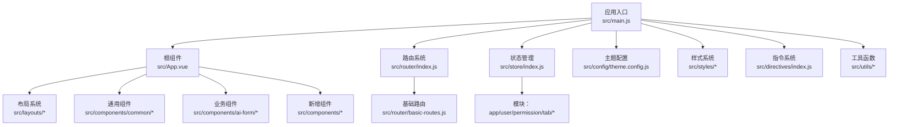
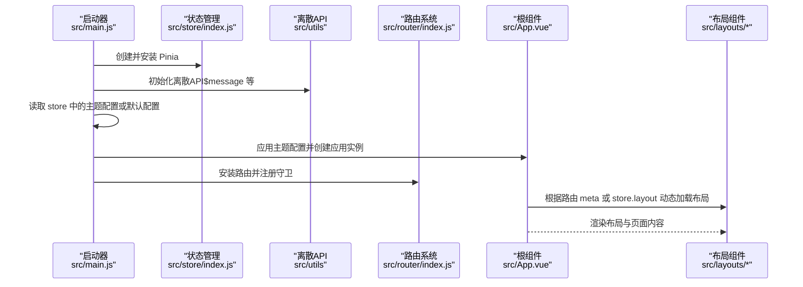
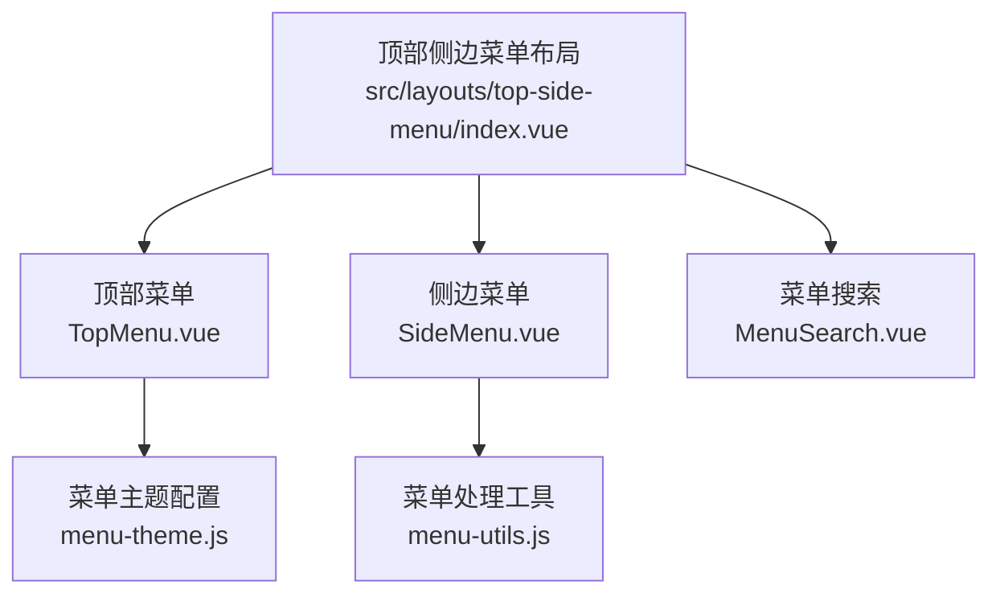
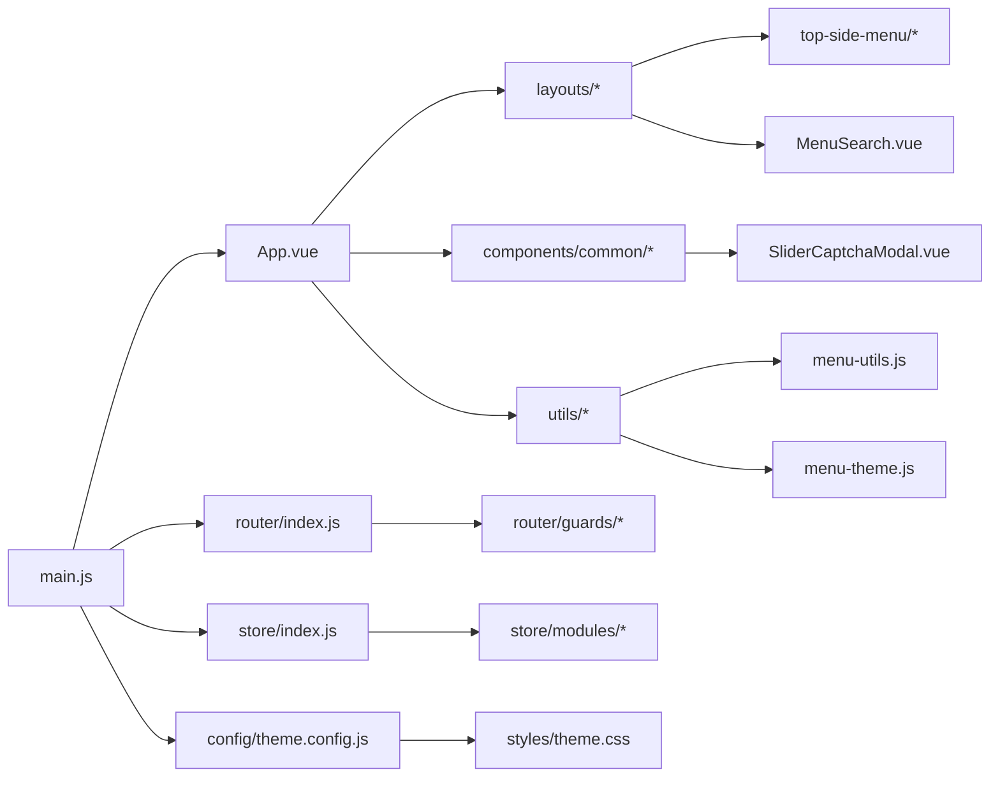

# 前端框架详解

<cite>
**本文引用的文件**   
- [package.json](file://forge-admin-ui/package.json)
- [vite.config.js](file://forge-admin-ui/vite.config.js)
- [main.js](file://forge-admin-ui/src/main.js)
- [App.vue](file://forge-admin-ui/src/App.vue)
- [settings.js](file://forge-admin-ui/src/settings.js)
- [router/index.js](file://forge-admin-ui/src/router/index.js)
- [store/index.js](file://forge-admin-ui/src/store/index.js)
- [config/theme.config.js](file://forge-admin-ui/src/config/theme.config.js)
- [layouts/normal/index.vue](file://forge-admin-ui/src/layouts/normal/index.vue)
- [layouts/top-side-menu/index.vue](file://forge-admin-ui/src/layouts/top-side-menu/index.vue)
- [layouts/top-side-menu/components/TopMenu.vue](file://forge-admin-ui/src/layouts/top-side-menu/components/TopMenu.vue)
- [layouts/top-side-menu/components/SideMenu.vue](file://forge-admin-ui/src/layouts/top-side-menu/components/SideMenu.vue)
- [layouts/components/MenuSearch.vue](file://forge-admin-ui/src/layouts/components/MenuSearch.vue)
- [components/SliderCaptchaModal.vue](file://forge-admin-ui/src/components/SliderCaptchaModal.vue)
- [components/common/LayoutSetting.vue](file://forge-admin-ui/src/components/common/LayoutSetting.vue)
- [store/modules/app.js](file://forge-admin-ui/src/store/modules/app.js)
- [store/modules/user.js](file://forge-admin-ui/src/store/modules/user.js)
- [components/ai-form/AiCrudPage.vue](file://forge-admin-ui/src/components/ai-form/AiCrudPage.vue)
- [styles/theme.css](file://forge-admin-ui/src/styles/theme.css)
- [directives/index.js](file://forge-admin-ui/src/directives/index.js)
- [utils/menu-utils.js](file://forge-admin-ui/src/utils/menu-utils.js)
- [utils/menu-theme.js](file://forge-admin-ui/src/utils/menu-theme.js)
</cite>

## 更新摘要
**变更内容**   
- 新增顶部侧边菜单布局系统，支持顶部一级菜单与左侧二级菜单的双层导航
- 新增菜单搜索组件，提供强大的键盘快捷键搜索功能
- 新增滑块验证码模态框，增强系统的安全验证能力
- 新增菜单主题配置工具和菜单处理工具函数
- 更新布局系统以支持新的导航模式

## 目录
1. [引言](#引言)
2. [项目结构](#项目结构)
3. [核心组件](#核心组件)
4. [架构总览](#架构总览)
5. [详细组件分析](#详细组件分析)
6. [新增组件详解](#新增组件详解)
7. [依赖关系分析](#依赖关系分析)
8. [性能考量](#性能考量)
9. [故障排查指南](#故障排查指南)
10. [结论](#结论)
11. [附录](#附录)

## 引言
本文件面向希望基于 Forge 前端框架快速搭建企业级管理界面的开发者与架构师。文档围绕 Vue 3 + Naive UI 的前端架构展开，系统性阐述应用入口配置、路由系统设计、状态管理模式；深入解析 UI 组件库的使用方法、自定义组件开发与样式系统配置；覆盖响应式设计、主题定制、国际化支持等工程化实践；并提供组件开发规范、代码组织结构与构建优化策略，帮助团队高效落地高质量前端产品。

**最新更新**：框架现已支持顶部侧边菜单布局、智能菜单搜索和滑块验证码等高级功能，显著提升了用户体验和安全性。

## 项目结构
Forge 前端采用"功能域 + 层次化"混合组织方式，核心目录包括：
- src/api：接口封装与 Mock
- src/assets：图标、图片资源
- src/components：通用组件与业务组件（含 AI 表单、上传、字典、滑块验证码等）
- src/composables：组合式工具函数
- src/config：主题与白名单等配置
- src/directives：指令系统（权限、加载、复制、预览、水印）
- src/layouts：多布局模板（普通、顶部菜单、全屏、简洁、空布局、顶部侧边菜单等）
- src/plugins：插件扩展（如响应式字体统一）
- src/router：路由定义与守卫
- src/store：Pinia 状态管理（模块化）
- src/styles：全局样式、主题变量、混入与响应式变量
- src/utils：HTTP、存储、加密、工具类（含菜单处理工具）
- src/views：页面视图（首页、登录、系统管理、演示等）

**图表来源**
- [main.js:15-36](file://forge-admin-ui/src/main.js#L15-L36)
- [App.vue:31-67](file://forge-admin-ui/src/App.vue#L31-L67)
- [router/index.js:1-18](file://forge-admin-ui/src/router/index.js#L1-L18)
- [store/index.js:4-8](file://forge-admin-ui/src/store/index.js#L4-L8)
- [config/theme.config.js:105-163](file://forge-admin-ui/src/config/theme.config.js#L105-L163)
- [styles/theme.css:6-50](file://forge-admin-ui/src/styles/theme.css#L6-L50)

**章节来源**
- [main.js:1-37](file://forge-admin-ui/src/main.js#L1-L37)
- [vite.config.js:13-85](file://forge-admin-ui/vite.config.js#L13-L85)

## 核心组件
- 应用入口与启动流程：负责初始化 Pinia、注册 Naive UI 离散 API、挂载指令、应用主题、初始化路由并挂载根组件。
- 根组件与布局：通过 n-config-provider 提供语言与主题上下文，动态按路由 meta 或 store 中的 layout 加载布局组件，支持 KeepAlive 缓存与标签页缓存。
- 主题系统：集中配置主题色、Header、顶部菜单、侧边菜单等，通过 CSS 变量与 applyThemeConfig 应用到全局样式。
- 路由系统：支持 Hash 与 History 模式切换，内置页面加载、标题、权限、标签页等守卫。
- 状态管理：以 Pinia 为核心，模块化管理应用、用户、权限、路由、标签页、租户等状态，并持久化关键状态。
- 指令系统：提供权限、加载、复制、预览、水印等指令，统一业务交互与安全控制。
- 样式系统：以 UnoCSS 作为原子化工具，配合 SCSS 变量与 CSS 变量，实现主题与响应式适配。
- **新增** 菜单系统：支持顶部侧边菜单布局、智能菜单搜索和菜单主题配置。

**章节来源**
- [main.js:15-36](file://forge-admin-ui/src/main.js#L15-L36)
- [App.vue:31-118](file://forge-admin-ui/src/App.vue#L31-L118)
- [config/theme.config.js:9-98](file://forge-admin-ui/src/config/theme.config.js#L9-L98)
- [router/index.js:5-12](file://forge-admin-ui/src/router/index.js#L5-L12)
- [store/index.js:4-10](file://forge-admin-ui/src/store/index.js#L4-L10)
- [directives/index.js:19-37](file://forge-admin-ui/src/directives/index.js#L19-L37)

## 架构总览
下图展示了从应用启动到页面渲染的关键调用链路，体现入口初始化、主题应用、路由挂载与布局渲染的协作关系。

**图表来源**
- [main.js:15-36](file://forge-admin-ui/src/main.js#L15-L36)
- [router/index.js:14-17](file://forge-admin-ui/src/router/index.js#L14-L17)
- [App.vue:40-67](file://forge-admin-ui/src/App.vue#L40-L67)

## 详细组件分析

### 应用入口与启动流程
- 初始化顺序：先创建应用实例，再安装 Pinia 并启用持久化插件；随后初始化 Naive UI 的离散 API；挂载指令；应用主题；最后安装路由并挂载根组件。
- 主题应用：从 store 获取主题配置，若不存在则回退到默认配置；通过 applyThemeConfig 将主题映射到 CSS 变量。
- 国际化：在根组件 n-config-provider 上设置 zhCN 语言与日期本地化。

**章节来源**
- [main.js:15-36](file://forge-admin-ui/src/main.js#L15-L36)
- [App.vue:2-8](file://forge-admin-ui/src/App.vue#L2-L8)

### 根组件与布局系统
- 动态布局：通过 Map 缓存已加载的布局组件，避免重复加载导致闪烁；根据路由 meta 或 store.layout 决定当前布局。
- 加载态：当路由守卫未完成或菜单数据未加载时显示全局加载状态。
- KeepAlive 与标签页缓存：根据 tabStore.cacheViews 决定缓存哪些页面组件。
- 响应式字体：初始化响应式字体并监听主题变化，动态更新 Naive UI 主题的字体大小。

**章节来源**
- [App.vue:40-99](file://forge-admin-ui/src/App.vue#L40-L99)

### 主题配置与样式系统
- 主题配置：defaultThemeConfig 提供 Header、顶部菜单、侧边菜单等在明/暗两套风格下的完整配置；applyThemeConfig 将配置映射为 CSS 变量。
- 样式变量：styles/theme.css 通过 CSS 变量驱动全局样式，包括 Header、顶部菜单、侧边菜单、按钮、表单、分页器等。
- 响应式字体：通过响应式字体工具更新 --font-scale，联动 Naive UI 字体大小。

**章节来源**
- [config/theme.config.js:9-98](file://forge-admin-ui/src/config/theme.config.js#L9-L98)
- [config/theme.config.js:105-163](file://forge-admin-ui/src/config/theme.config.js#L105-L163)
- [styles/theme.css:6-50](file://forge-admin-ui/src/styles/theme.css#L6-L50)

### 路由系统设计
- 路由创建：支持 Hash 与 History 模式，滚动行为统一归零。
- 守卫体系：包含页面加载、标题、权限、标签页等守卫，保障用户体验与安全。
- 基础路由：由 basic-routes.js 统一管理，便于扩展与维护。

**章节来源**
- [router/index.js:5-12](file://forge-admin-ui/src/router/index.js#L5-L12)

### 状态管理模式
- Pinia 安装：在入口安装 Pinia 并启用持久化插件，提升用户体验。
- 模块划分：app、user、permission、router、tab、tenant 等模块职责清晰。
- app 模块：管理布局、主题色、暗色模式、路由守卫完成状态、Naive 主题覆盖与持久化键值。
- user 模块：兼容多种用户信息结构，提供丰富的 getter 与 setter，支持数据权限与角色权限。

**章节来源**
- [store/index.js:4-10](file://forge-admin-ui/src/store/index.js#L4-L10)
- [store/modules/app.js:7-90](file://forge-admin-ui/src/store/modules/app.js#L7-L90)
- [store/modules/user.js:23-118](file://forge-admin-ui/src/store/modules/user.js#L23-L118)

### 指令系统
- 权限指令：根据当前路由按钮集合动态隐藏无权限按钮。
- 加载指令：提供全局加载服务，统一业务加载态。
- 复制、预览、水印：提升交互体验与数据安全。

**章节来源**
- [directives/index.js:8-37](file://forge-admin-ui/src/directives/index.js#L8-L37)

### 布局组件与设置面板
- 布局组件：normal 布局采用玻璃态设计，包含侧边栏与主内容区，支持折叠与响应式适配。
- 布局设置：通过 LayoutSetting 弹窗提供布局切换预览，支持多布局一键切换。
- **新增** 顶部侧边菜单布局：支持顶部一级菜单与左侧二级菜单的双层导航系统。

**章节来源**
- [layouts/normal/index.vue:1-192](file://forge-admin-ui/src/layouts/normal/index.vue#L1-L192)
- [components/common/LayoutSetting.vue:1-176](file://forge-admin-ui/src/components/common/LayoutSetting.vue#L1-L176)

### UI 组件库与自定义组件
- Naive UI：在根组件 n-config-provider 中统一提供语言、主题与主题覆盖。
- 自定义组件：AI 表单组件体系（AiForm、AiTable、AiSearch 等）提供完整的 CRUD 能力，支持弹窗/抽屉两种编辑模式、批量导入导出、表格工具栏与插槽扩展。
- 图标与样式：UnoCSS 提供原子化样式，结合动态图标与 SVG 图标集，满足企业级界面设计需求。
- **新增** 滑块验证码组件：提供安全验证功能，支持多种验证状态和动画效果。

**章节来源**
- [App.vue:2-8](file://forge-admin-ui/src/App.vue#L2-L8)
- [components/ai-form/AiCrudPage.vue:10-200](file://forge-admin-ui/src/components/ai-form/AiCrudPage.vue#L10-L200)
- [components/SliderCaptchaModal.vue:1-396](file://forge-admin-ui/src/components/SliderCaptchaModal.vue#L1-L396)

### 构建与工程化
- Vite 插件：Vue、Vue JSX、UnoCSS、自动导入、组件自动注册（Naive UI）、Vue DevTools、路由警告移除、自定义页面路径与图标插件。
- 路径别名：@ 指向 src，~ 指向项目根目录。
- CSS 预处理：SCSS 全局注入 variables.scss。
- 开发服务器：端口、代理（HTTP 与 WebSocket）、真实 URL 记录。
- 构建优化：chunkSize 警告阈值调整。

**章节来源**
- [vite.config.js:13-85](file://forge-admin-ui/vite.config.js#L13-L85)

## 新增组件详解

### 顶部侧边菜单布局系统

#### 布局架构
顶部侧边菜单布局系统提供了全新的导航体验，结合了顶部一级菜单和左侧二级菜单的优势：

**图表来源**
- [layouts/top-side-menu/index.vue:1-146](file://forge-admin-ui/src/layouts/top-side-menu/index.vue#L1-L146)
- [layouts/top-side-menu/components/TopMenu.vue:1-213](file://forge-admin-ui/src/layouts/top-side-menu/components/TopMenu.vue#L1-L213)
- [layouts/top-side-menu/components/SideMenu.vue:1-238](file://forge-admin-ui/src/layouts/top-side-menu/components/SideMenu.vue#L1-L238)
- [layouts/components/MenuSearch.vue:1-643](file://forge-admin-ui/src/layouts/components/MenuSearch.vue#L1-L643)

#### 顶部菜单组件
顶部菜单组件实现了智能的一级菜单导航：

- **智能激活状态**：根据当前路由自动识别并激活对应的顶级菜单
- **模块类型处理**：支持 module 和 menu 两种类型的菜单项
- **外部链接处理**：提供外链打开和内嵌打开的选择对话框
- **主题配置**：动态应用菜单主题覆盖配置

#### 侧边菜单组件
侧边菜单组件提供了完整的二级菜单导航：

- **父子关系同步**：根据顶部菜单的选中状态自动更新侧边菜单
- **路径前缀匹配**：支持隐藏页面和二级页面的路径匹配
- **图标渲染**：统一使用 IconRenderer 组件进行图标渲染
- **外部链接处理**：与顶部菜单相同的外链处理机制

#### 菜单搜索组件
菜单搜索组件提供了强大的键盘快捷键搜索功能：

- **全局快捷键**：支持 Ctrl+K 快速打开搜索弹窗
- **实时搜索**：支持按菜单名称和路径进行实时搜索
- **键盘导航**：支持上下箭头键选择，Enter 键确认
- **最近访问**：记录用户的最近访问菜单，提供快速访问
- **高亮显示**：搜索关键词在结果中高亮显示

#### 菜单主题配置
菜单主题配置工具提供了灵活的主题定制能力：

- **CSS 变量支持**：从 CSS 变量获取主题颜色配置
- **水平模式适配**：专门针对水平模式的菜单主题配置
- **动态主题切换**：支持明暗主题下的不同颜色配置

#### 菜单处理工具
菜单处理工具提供了完整的菜单数据处理能力：

- **顶级菜单处理**：直接返回所有顶级菜单项，保持原有结构
- **菜单数据扁平化**：将嵌套菜单数据转换为适合显示的格式
- **唯一ID生成**：为菜单项生成唯一的 ID 和 key
- **图标处理**：统一处理菜单图标，支持字符串和函数两种形式

**章节来源**
- [layouts/top-side-menu/index.vue:1-146](file://forge-admin-ui/src/layouts/top-side-menu/index.vue#L1-L146)
- [layouts/top-side-menu/components/TopMenu.vue:1-213](file://forge-admin-ui/src/layouts/top-side-menu/components/TopMenu.vue#L1-L213)
- [layouts/top-side-menu/components/SideMenu.vue:1-238](file://forge-admin-ui/src/layouts/top-side-menu/components/SideMenu.vue#L1-L238)
- [layouts/components/MenuSearch.vue:1-643](file://forge-admin-ui/src/layouts/components/MenuSearch.vue#L1-L643)
- [utils/menu-utils.js:1-170](file://forge-admin-ui/src/utils/menu-utils.js#L1-L170)
- [utils/menu-theme.js:1-43](file://forge-admin-ui/src/utils/menu-theme.js#L1-L43)

### 滑块验证码模态框

#### 功能特性
滑块验证码模态框提供了完整的安全验证功能：

- **多种验证状态**：支持空闲、成功、失败三种状态显示
- **动画效果**：验证成功和失败时提供流畅的动画过渡
- **状态覆盖层**：在验证过程中显示状态覆盖层，提升用户体验
- **暗色主题适配**：完全支持暗色主题，颜色自动适配
- **可配置参数**：支持宽度、高度、精度等参数配置

#### 技术实现
- **第三方库集成**：使用 vue3-slide-verify 库实现滑块验证功能
- **事件处理**：提供成功、失败、刷新等事件回调
- **状态管理**：内部管理验证状态，支持重置和关闭操作
- **样式覆盖**：深度覆盖第三方库的默认样式

#### 使用场景
- **登录保护**：防止机器人登录和暴力破解
- **敏感操作**：对删除、修改等敏感操作进行二次验证
- **安全审计**：记录验证过程，便于安全审计

**章节来源**
- [components/SliderCaptchaModal.vue:1-396](file://forge-admin-ui/src/components/SliderCaptchaModal.vue#L1-L396)

## 依赖关系分析
- 入口依赖：main.js 依赖 store、router、theme.config、App.vue 与样式文件。
- 根组件依赖：App.vue 依赖布局、指令、store、国际化与响应式字体。
- 主题依赖：theme.config.js 与 styles/theme.css 形成"配置 → CSS 变量 → 样式"的闭环。
- 路由依赖：router/index.js 依赖 basic-routes 与 guards。
- 状态依赖：store/index.js 依赖各模块，模块间通过 store 实例共享状态。
- 指令依赖：directives/index.js 依赖路由与各模块指令实现。
- **新增** 菜单系统依赖：新增的菜单组件依赖工具函数和主题配置。

**图表来源**
- [main.js:15-36](file://forge-admin-ui/src/main.js#L15-L36)
- [router/index.js:1-18](file://forge-admin-ui/src/router/index.js#L1-L18)
- [store/index.js:4-10](file://forge-admin-ui/src/store/index.js#L4-L10)
- [config/theme.config.js:105-163](file://forge-admin-ui/src/config/theme.config.js#L105-L163)
- [styles/theme.css:6-50](file://forge-admin-ui/src/styles/theme.css#L6-L50)
- [utils/menu-utils.js:1-170](file://forge-admin-ui/src/utils/menu-utils.js#L1-L170)
- [utils/menu-theme.js:1-43](file://forge-admin-ui/src/utils/menu-theme.js#L1-L43)

**章节来源**
- [main.js:15-36](file://forge-admin-ui/src/main.js#L15-L36)
- [router/index.js:1-18](file://forge-admin-ui/src/router/index.js#L1-L18)
- [store/index.js:4-10](file://forge-admin-ui/src/store/index.js#L4-L10)

## 性能考量
- 持久化状态：Pinia 持久化插件减少刷新后的状态丢失，提升用户体验。
- KeepAlive 与标签页缓存：仅缓存必要页面，降低重复渲染成本。
- 动态布局加载：使用 Map 缓存布局组件，避免重复异步加载导致的闪烁与抖动。
- 响应式字体：统一字体缩放，减少多处字体计算开销。
- 构建优化：合理设置 chunkSize 警告阈值，结合按需引入与自动组件注册，减小包体积。
- 代理与 WebSocket：统一代理配置，减少跨域与连接开销。
- **新增** 菜单搜索优化：使用防抖和虚拟滚动技术，提升大量菜单的搜索性能。

## 故障排查指南
- 路由守卫未完成导致页面空白：检查 appStore.routeGuardCompleted 状态与路由守卫逻辑。
- 主题不生效：确认 theme.config.js 的 applyThemeConfig 是否被正确调用，CSS 变量是否被覆盖。
- 权限按钮不显示：检查当前路由 meta.btns 与指令绑定值是否一致。
- 加载态异常：确认用户登录状态、菜单数据加载状态与路由守卫完成状态三者之间的条件判断。
- 布局切换无效：确认 LayoutSetting 的布局选择与路由 meta 的优先级关系。
- **新增** 菜单搜索失效：检查菜单数据是否正确加载，搜索关键词是否为空，键盘事件是否被正确绑定。
- **新增** 顶部菜单不显示：确认菜单数据结构是否正确，processTopMenus 函数是否正常工作。
- **新增** 滑块验证码不显示：检查第三方库是否正确安装，样式是否被正确覆盖。

**章节来源**
- [App.vue:69-90](file://forge-admin-ui/src/App.vue#L69-L90)
- [config/theme.config.js:105-163](file://forge-admin-ui/src/config/theme.config.js#L105-L163)
- [directives/index.js:8-17](file://forge-admin-ui/src/directives/index.js#L8-L17)
- [layouts/components/MenuSearch.vue:302-320](file://forge-admin-ui/src/layouts/components/MenuSearch.vue#L302-L320)
- [layouts/top-side-menu/components/TopMenu.vue:117-205](file://forge-admin-ui/src/layouts/top-side-menu/components/TopMenu.vue#L117-L205)

## 结论
Forge 前端框架以 Vue 3 + Naive UI 为基础，结合 Pinia 状态管理、UnoCSS 原子化样式与完善的指令系统，形成一套可扩展、可定制的企业级管理界面解决方案。通过集中主题配置、动态布局与路由守卫体系，框架在保证开发效率的同时兼顾了性能与可维护性。

**最新改进**：新增的顶部侧边菜单布局系统、智能菜单搜索功能和滑块验证码组件，显著提升了用户体验和安全性。这些功能的集成体现了框架在用户体验优化和安全防护方面的持续改进。

建议团队遵循本文档的组件开发规范与工程化实践，在此基础上快速迭代高质量产品。

## 附录
- 组件开发规范
  - 组件命名：采用语义化命名，避免缩写；业务组件置于 components/ai-form 等子目录。
  - 插槽设计：提供常用插槽（如 toolbar、table-*、form-*），保持扩展性。
  - 样式隔离：优先使用 scoped 样式与 CSS 变量，避免全局污染。
  - 响应式适配：遵循现有媒体查询与响应式变量，确保移动端体验一致。
  - **新增** 菜单组件规范：遵循菜单数据结构规范，使用统一的图标渲染组件。
- 代码组织结构
  - 按功能域划分：views、components、layouts、store、router、utils、styles。
  - 配置集中：settings.js、theme.config.js、vite.config.js 统一管理。
  - **新增** 工具函数分离：菜单处理、主题配置等工具函数独立管理。
- 构建优化策略
  - 按需引入：结合自动导入与组件自动注册，减少冗余依赖。
  - 分包策略：利用 Vite 的代码分割与缓存策略，优化首屏加载。
  - 代理与缓存：合理配置代理与静态资源缓存，提升开发与生产效率。
  - **新增** 第三方库优化：合理使用第三方库，注意包体积和性能影响。
- **新增** 菜单系统最佳实践
  - 菜单数据结构：遵循统一的菜单数据结构，确保兼容性。
  - 主题配置：使用统一的主题配置工具，确保视觉一致性。
  - 性能优化：对于大量菜单数据，考虑使用虚拟滚动和懒加载技术。
  - 用户体验：提供清晰的导航反馈和状态提示，提升用户操作体验。