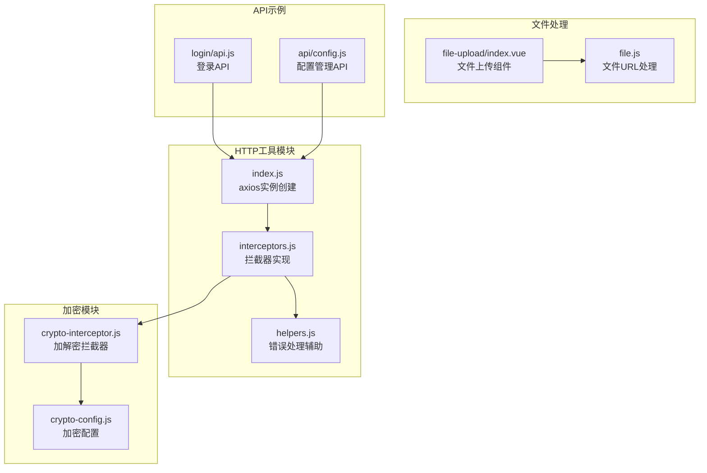
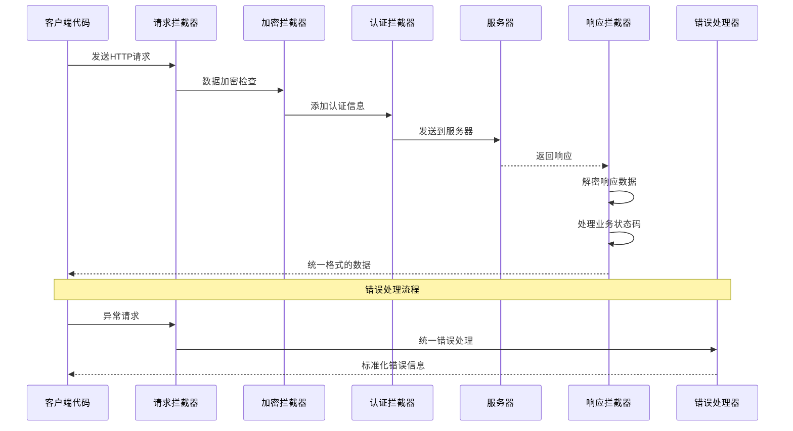
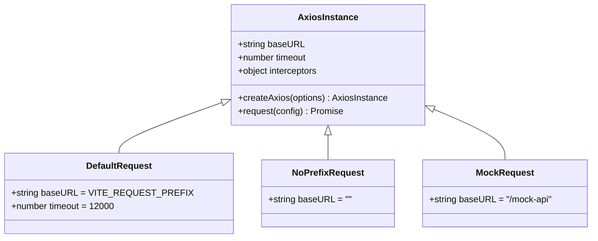
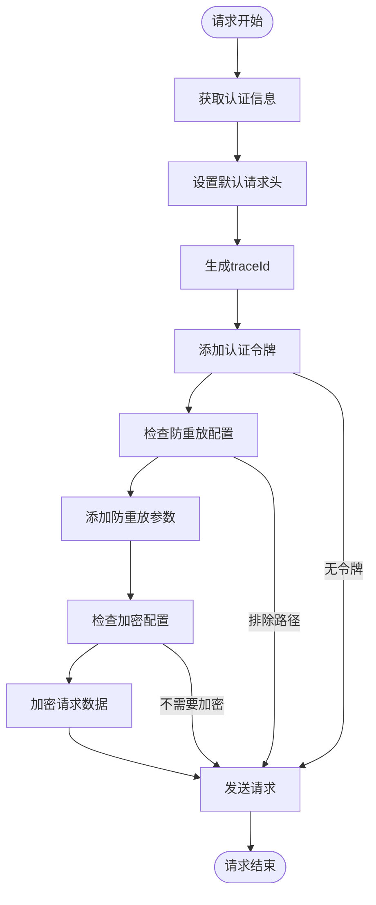
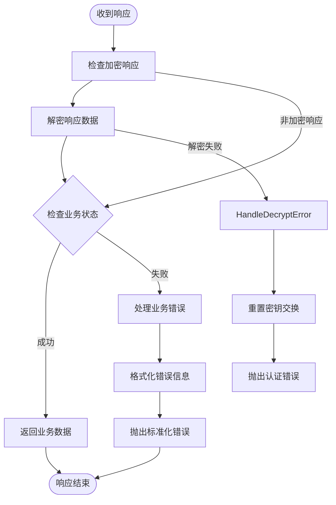
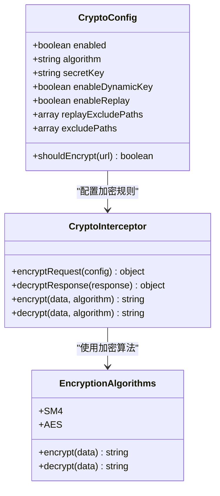
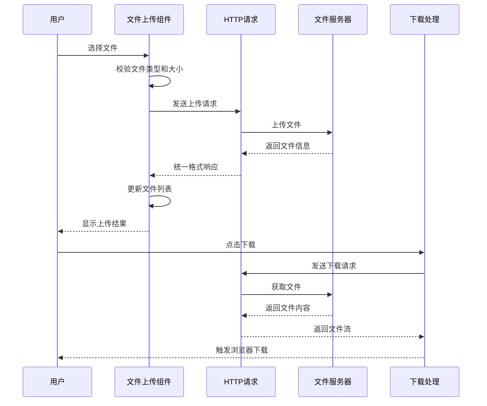
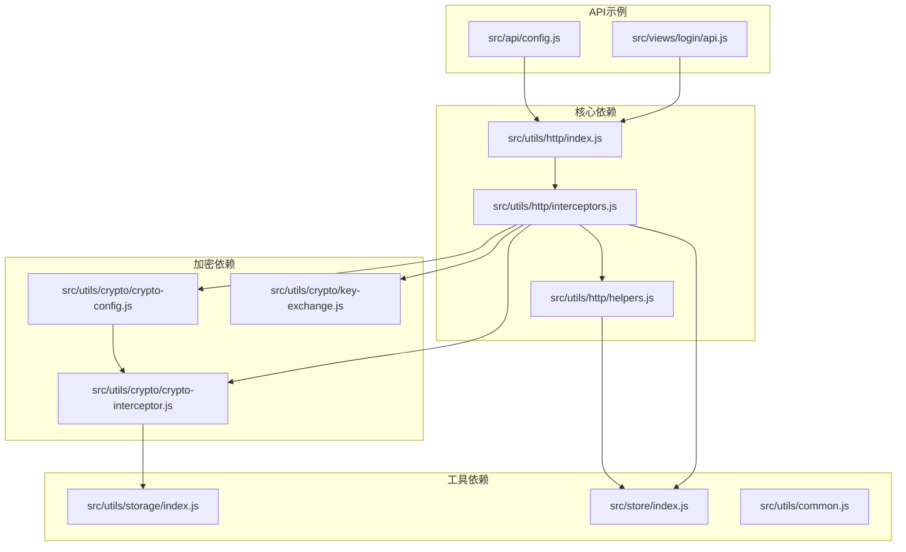
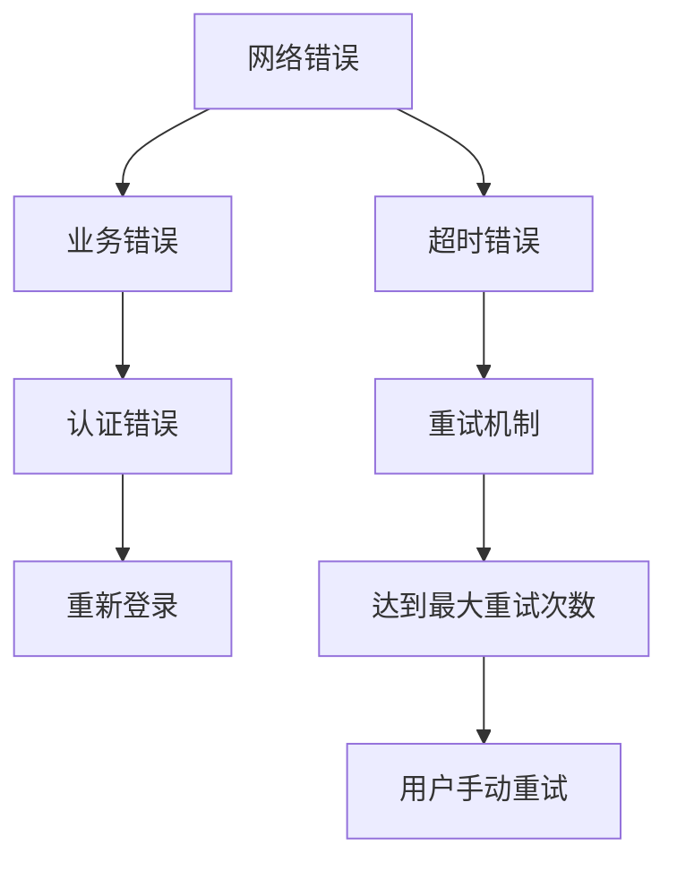

# HTTP请求工具

<cite>
**本文档引用的文件**
- [src/utils/http/index.js](file://forge-admin-ui/src/utils/http/index.js)
- [src/utils/http/interceptors.js](file://forge-admin-ui/src/utils/http/interceptors.js)
- [src/utils/http/helpers.js](file://forge-admin-ui/src/utils/http/helpers.js)
- [src/utils/crypto/crypto-interceptor.js](file://forge-admin-ui/src/utils/crypto/crypto-interceptor.js)
- [src/utils/crypto/crypto-config.js](file://forge-admin-ui/src/utils/crypto/crypto-config.js)
- [src/utils/file.js](file://forge-admin-ui/src/utils/file.js)
- [src/components/file-upload/index.vue](file://forge-admin-ui/src/components/file-upload/index.vue)
- [src/views/login/api.js](file://forge-admin-ui/src/views/login/api.js)
- [src/api/config.js](file://forge-admin-ui/src/api/config.js)
- [.env.development](file://forge-admin-ui/.env.development)
- [.env.production](file://forge-admin-ui/.env.production)
</cite>

## 目录
1. [简介](#简介)
2. [项目结构](#项目结构)
3. [核心组件](#核心组件)
4. [架构概览](#架构概览)
5. [详细组件分析](#详细组件分析)
6. [依赖关系分析](#依赖关系分析)
7. [性能考虑](#性能考虑)
8. [故障排除指南](#故障排除指南)
9. [结论](#结论)
10. [附录](#附录)

## 简介
本文件详细介绍Forge项目前端的HTTP请求工具实现，包括axios实例配置、请求拦截器和响应拦截器的工作机制。文档涵盖请求前缀处理、超时配置、错误统一处理策略、请求头设置、认证令牌传递、响应数据格式化等核心功能。同时提供RESTful API调用示例、文件上传下载处理、进度监控实现，以及网络异常处理、重试机制、并发请求控制的最佳实践。

## 项目结构
HTTP请求工具位于前端项目forge-admin-ui的utils/http目录下，采用模块化设计，主要包含以下文件：



**图表来源**
- [src/utils/http/index.js](file://forge-admin-ui/src/utils/http/index.js#L1-L26)
- [src/utils/http/interceptors.js](file://forge-admin-ui/src/utils/http/interceptors.js#L1-L165)
- [src/utils/crypto/crypto-interceptor.js](file://forge-admin-ui/src/utils/crypto/crypto-interceptor.js#L1-L132)

**章节来源**
- [src/utils/http/index.js](file://forge-admin-ui/src/utils/http/index.js#L1-L26)
- [src/utils/http/interceptors.js](file://forge-admin-ui/src/utils/http/interceptors.js#L1-L165)

## 核心组件
HTTP请求工具由三个核心组件构成：

### Axios实例创建器
系统提供了三种不同用途的axios实例：
- **默认请求实例**：带有基础URL前缀，适用于大多数API调用
- **无前缀请求实例**：专门用于登录等不需要前缀的请求
- **Mock请求实例**：用于开发环境的模拟API调用

### 拦截器系统
实现了完整的请求和响应拦截器链，包括：
- 请求拦截器：处理认证令牌、防重放参数、数据加密
- 响应拦截器：统一错误处理、数据解密、业务状态码处理

### 错误处理机制
提供统一的错误处理策略，支持业务错误和网络错误的分类处理。

**章节来源**
- [src/utils/http/index.js](file://forge-admin-ui/src/utils/http/index.js#L4-L26)
- [src/utils/http/interceptors.js](file://forge-admin-ui/src/utils/http/interceptors.js#L15-L113)

## 架构概览
HTTP请求工具采用拦截器模式实现，形成完整的请求处理流水线：



**图表来源**
- [src/utils/http/interceptors.js](file://forge-admin-ui/src/utils/http/interceptors.js#L115-L165)
- [src/utils/crypto/crypto-interceptor.js](file://forge-admin-ui/src/utils/crypto/crypto-interceptor.js#L65-L94)

## 详细组件分析

### Axios实例配置
系统通过createAxios函数创建多个axios实例，每个实例都有特定的配置：



**图表来源**
- [src/utils/http/index.js](file://forge-admin-ui/src/utils/http/index.js#L4-L26)

#### 配置特性
- **基础URL前缀**：从环境变量VITE_REQUEST_PREFIX获取
- **超时设置**：默认12秒超时时间
- **实例分离**：针对不同场景创建专用实例

**章节来源**
- [src/utils/http/index.js](file://forge-admin-ui/src/utils/http/index.js#L4-L26)
- [.env.development](file://forge-admin-ui/.env.development#L5-L6)
- [.env.production](file://forge-admin-ui/.env.production#L10-L10)

### 请求拦截器实现
请求拦截器负责在请求发送前进行必要的处理：



**图表来源**
- [src/utils/http/interceptors.js](file://forge-admin-ui/src/utils/http/interceptors.js#L118-L160)
- [src/utils/crypto/crypto-interceptor.js](file://forge-admin-ui/src/utils/crypto/crypto-interceptor.js#L65-L94)

#### 关键功能
- **认证令牌管理**：自动添加Bearer令牌到Authorization头
- **防重放保护**：为敏感接口添加时间戳和随机数
- **数据加密**：对请求体进行加密处理
- **追踪标识**：生成唯一的traceId便于问题排查

**章节来源**
- [src/utils/http/interceptors.js](file://forge-admin-ui/src/utils/http/interceptors.js#L118-L160)
- [src/utils/crypto/crypto-interceptor.js](file://forge-admin-ui/src/utils/crypto/crypto-interceptor.js#L65-L94)

### 响应拦截器实现
响应拦截器负责处理服务器响应并进行统一格式化：



**图表来源**
- [src/utils/http/interceptors.js](file://forge-admin-ui/src/utils/http/interceptors.js#L21-L71)
- [src/utils/crypto/crypto-interceptor.js](file://forge-admin-ui/src/utils/crypto/crypto-interceptor.js#L101-L129)

#### 错误处理策略
- **解密错误检测**：自动检测密钥过期并重置
- **业务错误处理**：将业务状态码转换为用户友好的消息
- **网络错误处理**：统一处理网络连接问题
- **认证错误处理**：自动触发重新登录流程

**章节来源**
- [src/utils/http/interceptors.js](file://forge-admin-ui/src/utils/http/interceptors.js#L21-L110)
- [src/utils/http/helpers.js](file://forge-admin-ui/src/utils/http/helpers.js#L4-L60)

### 加密配置系统
系统实现了完整的数据加密和解密机制：



**图表来源**
- [src/utils/crypto/crypto-config.js](file://forge-admin-ui/src/utils/crypto/crypto-config.js#L4-L23)
- [src/utils/crypto/crypto-interceptor.js](file://forge-admin-ui/src/utils/crypto/crypto-interceptor.js#L21-L57)

#### 加密特性
- **算法支持**：支持SM4和AES两种对称加密算法
- **动态密钥**：支持运行时密钥更新
- **路径过滤**：可配置需要加密的接口路径
- **自动加密**：根据配置自动对请求数据进行加密

**章节来源**
- [src/utils/crypto/crypto-config.js](file://forge-admin-ui/src/utils/crypto/crypto-config.js#L4-L79)
- [src/utils/crypto/crypto-interceptor.js](file://forge-admin-ui/src/utils/crypto/crypto-interceptor.js#L1-L132)

### 文件上传下载处理
系统提供了完整的文件处理能力：



**图表来源**
- [src/components/file-upload/index.vue](file://forge-admin-ui/src/components/file-upload/index.vue#L282-L340)
- [src/utils/file.js](file://forge-admin-ui/src/utils/file.js#L12-L66)

#### 文件处理特性
- **多格式支持**：支持多种文件类型的上传和下载
- **大小限制**：可配置单个文件和总文件大小限制
- **类型验证**：自动验证文件扩展名
- **进度监控**：提供上传进度反馈
- **URL生成**：自动生成可访问的文件URL

**章节来源**
- [src/components/file-upload/index.vue](file://forge-admin-ui/src/components/file-upload/index.vue#L1-L469)
- [src/utils/file.js](file://forge-admin-ui/src/utils/file.js#L1-L92)

## 依赖关系分析



**图表来源**
- [src/utils/http/index.js](file://forge-admin-ui/src/utils/http/index.js#L1-L3)
- [src/utils/http/interceptors.js](file://forge-admin-ui/src/utils/http/interceptors.js#L1-L5)

### 关键依赖关系
- **拦截器依赖**：interceptors.js依赖helpers.js进行错误处理
- **加密依赖**：crypto-interceptor.js依赖crypto-config.js进行配置
- **认证依赖**：所有拦截器依赖store进行认证状态管理
- **API依赖**：具体API调用依赖通用HTTP工具

**章节来源**
- [src/utils/http/interceptors.js](file://forge-admin-ui/src/utils/http/interceptors.js#L1-L5)
- [src/utils/crypto/crypto-interceptor.js](file://forge-admin-ui/src/utils/crypto/crypto-interceptor.js#L1-L4)

## 性能考虑
HTTP请求工具在设计时充分考虑了性能优化：

### 超时配置
- **默认超时**：12秒，平衡响应速度和网络稳定性
- **可配置性**：支持在具体请求中覆盖默认超时设置

### 连接复用
- **实例复用**：通过axios实例复用HTTP连接
- **拦截器缓存**：避免重复创建拦截器实例

### 数据处理优化
- **按需加密**：只对需要的接口进行数据加密
- **智能缓存**：利用浏览器缓存机制减少重复请求

## 故障排除指南

### 常见问题诊断
1. **认证失败**：检查Authorization头是否正确设置
2. **解密错误**：确认密钥是否过期，检查密钥交换流程
3. **网络超时**：调整timeout配置或检查服务器响应时间
4. **文件上传失败**：验证文件大小和类型限制

### 错误处理流程
系统提供多层次的错误处理机制：



**图表来源**
- [src/utils/http/helpers.js](file://forge-admin-ui/src/utils/http/helpers.js#L6-L25)

**章节来源**
- [src/utils/http/helpers.js](file://forge-admin-ui/src/utils/http/helpers.js#L4-L60)

## 结论
Forge项目的HTTP请求工具通过模块化设计实现了高度可配置和可扩展的请求处理机制。系统不仅提供了完整的请求和响应拦截器链，还集成了数据加密、认证管理和文件处理等功能。通过合理的错误处理策略和性能优化，该工具能够满足复杂企业应用的HTTP通信需求。

## 附录

### RESTful API调用示例
系统提供了多种API调用方式：

#### 基础API调用
```javascript
// GET请求
const users = await request({
  url: '/api/users',
  method: 'get',
  params: { page: 1, size: 10 }
})

// POST请求
const newUser = await request({
  url: '/api/users',
  method: 'post',
  data: { name: 'John', email: 'john@example.com' }
})
```

#### 登录API示例
```javascript
// 登录请求（不需要令牌）
const loginData = await request.post('/auth/login', credentials, { 
  needToken: false 
})

// 获取用户信息
const userInfo = await request.get('/auth/userInfo')
```

**章节来源**
- [src/views/login/api.js](file://forge-admin-ui/src/views/login/api.js#L4-L24)
- [src/api/config.js](file://forge-admin-ui/src/api/config.js#L1-L142)

### 环境配置
系统支持多环境配置，通过环境变量控制请求行为：

#### 开发环境配置
- **请求前缀**：/dev-api
- **代理目标**：http://127.0.0.1:8080/
- **端口**：3000

#### 生产环境配置
- **请求前缀**：/cbc-server
- **静态资源路径**：/workbench-web
- **路由前缀**：/workbench-web

**章节来源**
- [.env.development](file://forge-admin-ui/.env.development#L5-L15)
- [.env.production](file://forge-admin-ui/.env.production#L9-L13)