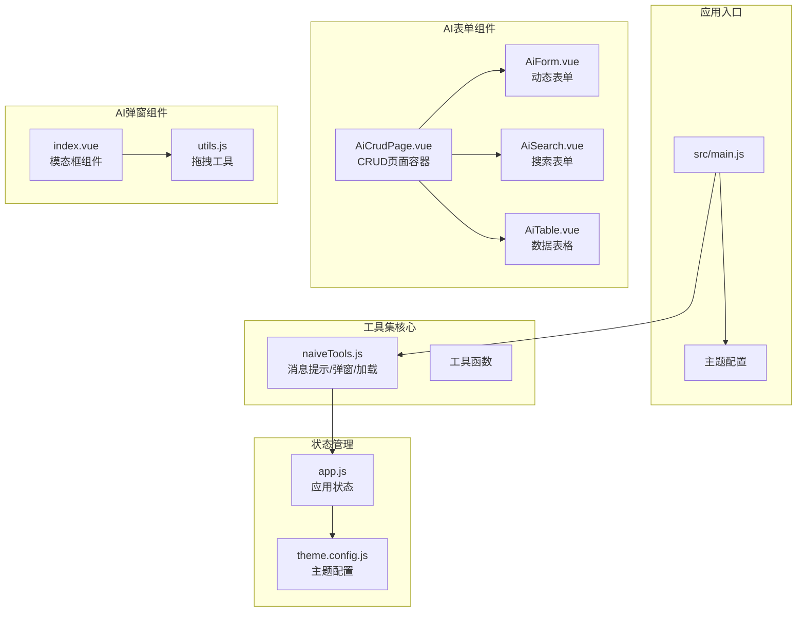
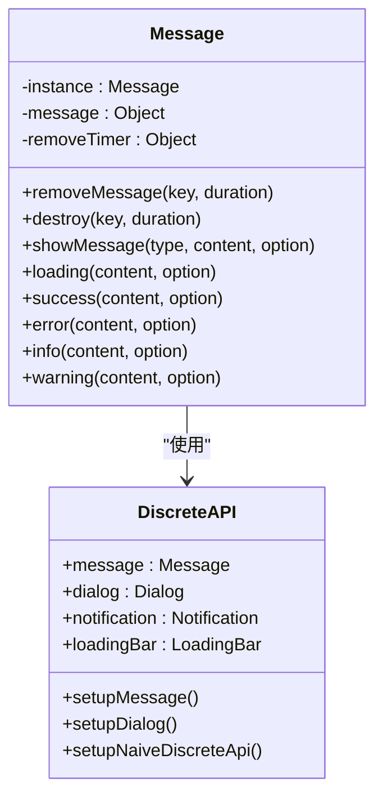
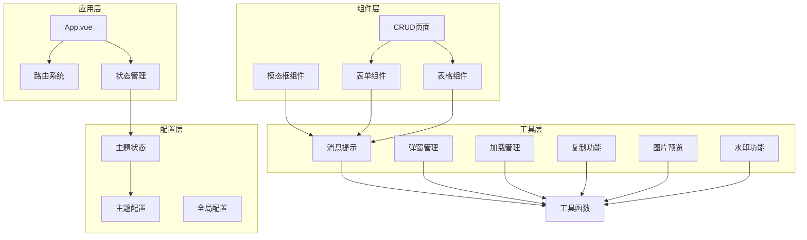
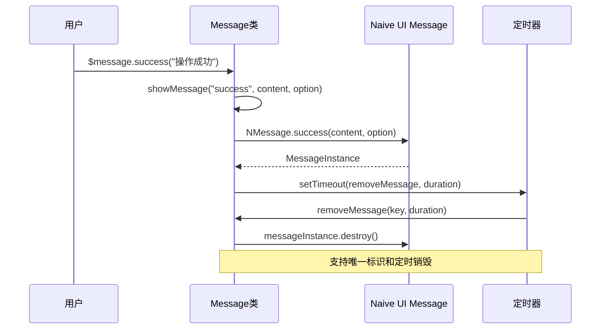
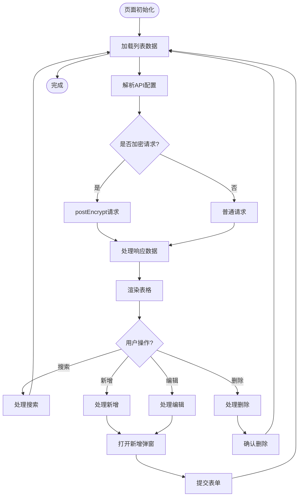
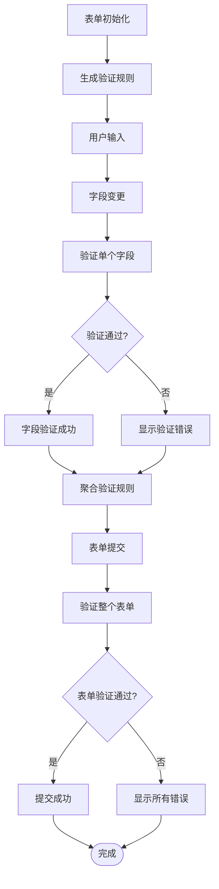
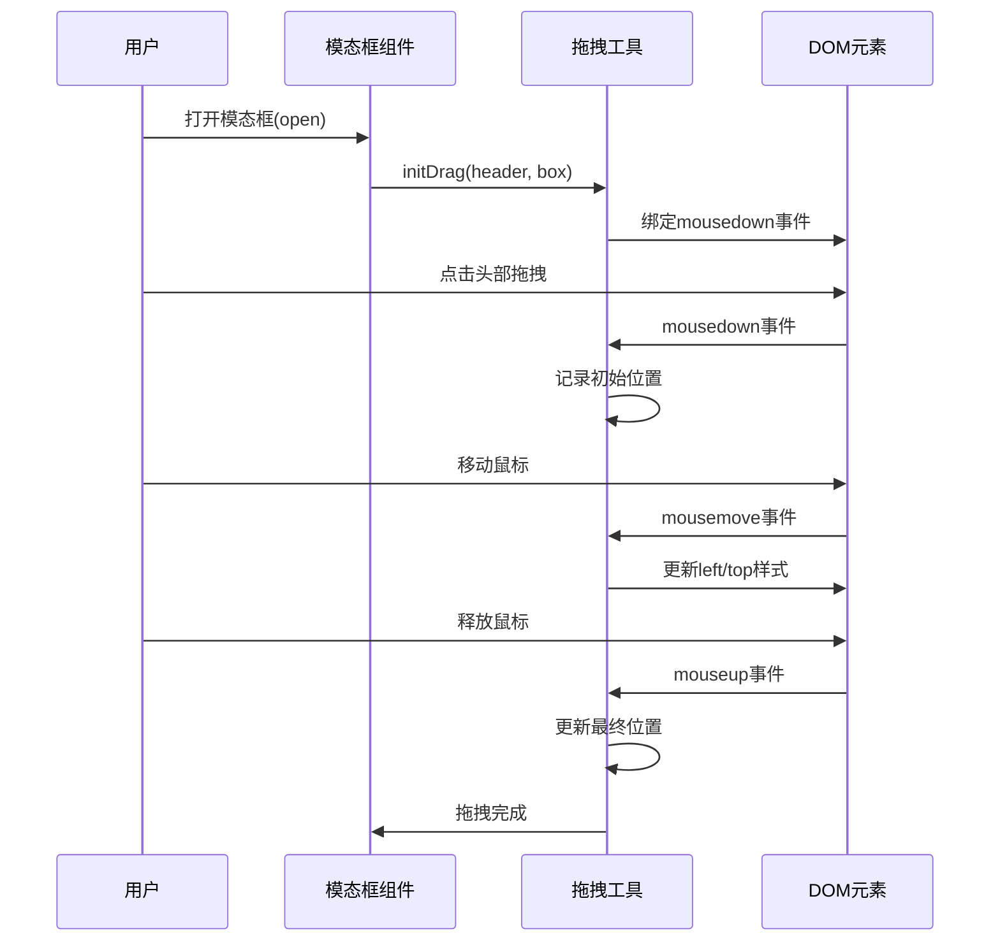
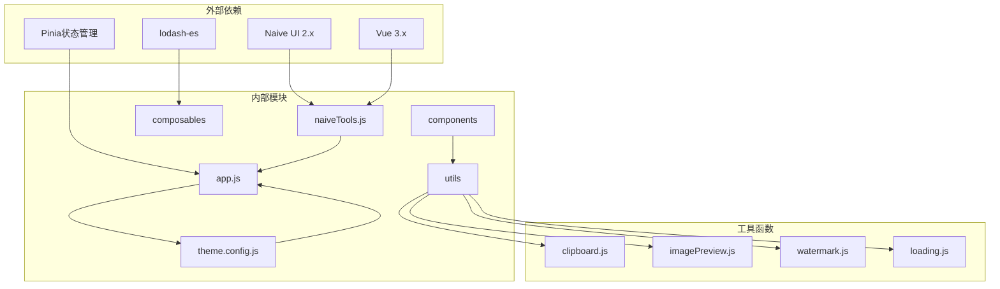

# NaiveUI工具集

<cite>
**本文档引用的文件**
- [forge-admin-ui/src/utils/naiveTools.js](file://forge-admin-ui/src/utils/naiveTools.js)
- [forge-admin-ui/src/components/ai-form/AiCrudPage.vue](file://forge-admin-ui/src/components/ai-form/AiCrudPage.vue)
- [forge-admin-ui/src/components/ai-form/AiTable.vue](file://forge-admin-ui/src/components/ai-form/AiTable.vue)
- [forge-admin-ui/src/components/ai-form/AiForm.vue](file://forge-admin-ui/src/components/ai-form/AiForm.vue)
- [forge-admin-ui/src/components/ai-form/AiSearch.vue](file://forge-admin-ui/src/components/ai-form/AiSearch.vue)
- [forge-admin-ui/src/components/ai-modal/index.vue](file://forge-admin-ui/src/components/ai-modal/index.vue)
- [forge-admin-ui/src/components/ai-modal/utils.js](file://forge-admin-ui/src/components/ai-modal/utils.js)
- [forge-admin-ui/src/composables/useForm.js](file://forge-admin-ui/src/composables/useForm.js)
- [forge-admin-ui/src/composables/useModal.js](file://forge-admin-ui/src/composables/useModal.js)
- [forge-admin-ui/src/store/modules/app.js](file://forge-admin-ui/src/store/modules/app.js)
- [forge-admin-ui/src/config/theme.config.js](file://forge-admin-ui/src/config/theme.config.js)
- [forge-admin-ui/src/main.js](file://forge-admin-ui/src/main.js)
- [forge-admin-ui/docs/UTILITIES_GUIDE.md](file://forge-admin-ui/docs/UTILITIES_GUIDE.md)
- [forge-admin-ui/docs/THEME_CONFIG.md](file://forge-admin-ui/docs/THEME_CONFIG.md)
- [forge-admin-ui/QUICK_START_THEME.md](file://forge-admin-ui/QUICK_START_THEME.md)
</cite>

## 目录
1. [简介](#简介)
2. [项目结构](#项目结构)
3. [核心组件](#核心组件)
4. [架构概览](#架构概览)
5. [详细组件分析](#详细组件分析)
6. [依赖关系分析](#依赖关系分析)
7. [性能考虑](#性能考虑)
8. [故障排除指南](#故障排除指南)
9. [结论](#结论)
10. [附录](#附录)

## 简介

NaiveUI工具集是基于Vue 3和Naive UI组件库构建的一套企业级UI工具集，专注于提供完整的CRUD解决方案、表单验证、弹窗管理和消息提示等常用功能。该工具集通过深度封装Naive UI组件，实现了高度可复用、可定制化的UI解决方案。

主要特性包括：
- **完整的CRUD页面解决方案**：集成了搜索、表格、新增、编辑、删除、导入导出等功能
- **强大的表单系统**：支持JSON配置驱动的动态表单渲染
- **灵活的消息提示系统**：基于Naive UI Discrete API的增强版消息提示
- **现代化的主题配置**：支持暗色模式、可视化主题配置面板
- **丰富的工具集**：包含复制、图片预览、水印、全屏Loading等实用工具

## 项目结构



**图表来源**
- [forge-admin-ui/src/main.js](file://forge-admin-ui/src/main.js#L15-L37)
- [forge-admin-ui/src/utils/naiveTools.js](file://forge-admin-ui/src/utils/naiveTools.js#L101-L121)
- [forge-admin-ui/src/components/ai-form/AiCrudPage.vue](file://forge-admin-ui/src/components/ai-form/AiCrudPage.vue#L1-L50)

**章节来源**
- [forge-admin-ui/src/main.js](file://forge-admin-ui/src/main.js#L1-L37)
- [forge-admin-ui/src/utils/naiveTools.js](file://forge-admin-ui/src/utils/naiveTools.js#L1-L156)

## 核心组件

### 消息提示系统

消息提示系统是对Naive UI Discrete API的增强封装，提供了单例模式管理、定时销毁、唯一标识等功能。



**图表来源**
- [forge-admin-ui/src/utils/naiveTools.js](file://forge-admin-ui/src/utils/naiveTools.js#L9-L82)
- [forge-admin-ui/src/utils/naiveTools.js](file://forge-admin-ui/src/utils/naiveTools.js#L101-L121)

### CRUD页面组件

AiCrudPage是整个工具集的核心组件，提供了完整的CRUD页面解决方案：

- **搜索区域**：基于AiSearch组件的搜索表单
- **表格区域**：基于AiTable组件的数据表格
- **表单区域**：基于AiForm组件的动态表单
- **弹窗管理**：支持Modal和Drawer两种弹窗模式

**章节来源**
- [forge-admin-ui/src/components/ai-form/AiCrudPage.vue](file://forge-admin-ui/src/components/ai-form/AiCrudPage.vue#L1-L254)

### 表单系统

表单系统采用JSON配置驱动的方式，支持多种字段类型和复杂的验证规则：

- **字段类型**：input、textarea、select、radio、checkbox、date等40+种类型
- **验证规则**：内置required规则，支持自定义验证规则
- **布局系统**：基于Naive UI Grid的栅格布局
- **动态渲染**：支持v-if条件显示、插槽渲染等高级功能

**章节来源**
- [forge-admin-ui/src/components/ai-form/AiForm.vue](file://forge-admin-ui/src/components/ai-form/AiForm.vue#L1-L343)
- [forge-admin-ui/src/components/ai-form/config.js](file://forge-admin-ui/src/components/ai-form/config.js#L1-L316)

### 弹窗管理系统

AI模态框组件提供了比原生Naive UI更丰富的功能：

- **拖拽功能**：支持鼠标拖拽移动
- **生命周期钩子**：完整的open、close、ok、cancel生命周期
- **异步操作**：支持确认按钮的loading状态管理
- **插槽系统**：完整的头部、内容、底部插槽支持

**章节来源**
- [forge-admin-ui/src/components/ai-modal/index.vue](file://forge-admin-ui/src/components/ai-modal/index.vue#L1-L441)
- [forge-admin-ui/src/components/ai-modal/utils.js](file://forge-admin-ui/src/components/ai-modal/utils.js#L1-L151)

## 架构概览



**图表来源**
- [forge-admin-ui/src/main.js](file://forge-admin-ui/src/main.js#L15-L37)
- [forge-admin-ui/src/utils/naiveTools.js](file://forge-admin-ui/src/utils/naiveTools.js#L101-L121)
- [forge-admin-ui/src/store/modules/app.js](file://forge-admin-ui/src/store/modules/app.js#L1-L91)

## 详细组件分析

### 消息提示组件分析

消息提示系统通过单例模式确保同一时间只有一个消息实例，同时支持定时销毁和唯一标识管理。



**图表来源**
- [forge-admin-ui/src/utils/naiveTools.js](file://forge-admin-ui/src/utils/naiveTools.js#L34-L78)

**章节来源**
- [forge-admin-ui/src/utils/naiveTools.js](file://forge-admin-ui/src/utils/naiveTools.js#L9-L82)

### CRUD页面流程分析

CRUD页面组件展示了完整的数据操作流程：



**图表来源**
- [forge-admin-ui/src/components/ai-form/AiCrudPage.vue](file://forge-admin-ui/src/components/ai-form/AiCrudPage.vue#L543-L642)
- [forge-admin-ui/src/components/ai-form/AiCrudPage.vue](file://forge-admin-ui/src/components/ai-form/AiCrudPage.vue#L705-L769)

**章节来源**
- [forge-admin-ui/src/components/ai-form/AiCrudPage.vue](file://forge-admin-ui/src/components/ai-form/AiCrudPage.vue#L492-L769)

### 表单验证流程

表单验证系统提供了完整的验证流程管理：



**图表来源**
- [forge-admin-ui/src/components/ai-form/AiForm.vue](file://forge-admin-ui/src/components/ai-form/AiForm.vue#L192-L206)
- [forge-admin-ui/src/components/ai-form/AiForm.vue](file://forge-admin-ui/src/components/ai-form/AiForm.vue#L304-L311)

**章节来源**
- [forge-admin-ui/src/components/ai-form/AiForm.vue](file://forge-admin-ui/src/components/ai-form/AiForm.vue#L186-L343)

### 弹窗拖拽功能

AI模态框的拖拽功能通过鼠标事件监听实现：



**图表来源**
- [forge-admin-ui/src/components/ai-modal/utils.js](file://forge-admin-ui/src/components/ai-modal/utils.js#L46-L150)
- [forge-admin-ui/src/components/ai-modal/index.vue](file://forge-admin-ui/src/components/ai-modal/index.vue#L279-L295)

**章节来源**
- [forge-admin-ui/src/components/ai-modal/utils.js](file://forge-admin-ui/src/components/ai-modal/utils.js#L1-L151)
- [forge-admin-ui/src/components/ai-modal/index.vue](file://forge-admin-ui/src/components/ai-modal/index.vue#L279-L386)

## 依赖关系分析



**图表来源**
- [forge-admin-ui/src/utils/naiveTools.js](file://forge-admin-ui/src/utils/naiveTools.js#L1-L8)
- [forge-admin-ui/src/store/modules/app.js](file://forge-admin-ui/src/store/modules/app.js#L1-L6)

**章节来源**
- [forge-admin-ui/src/utils/naiveTools.js](file://forge-admin-ui/src/utils/naiveTools.js#L1-L156)
- [forge-admin-ui/src/store/modules/app.js](file://forge-admin-ui/src/store/modules/app.js#L1-L91)

## 性能考虑

### 组件复用策略

1. **单一职责原则**：每个组件只负责特定的功能领域
2. **配置驱动**：通过props和配置对象实现高度可配置性
3. **插槽系统**：提供灵活的扩展点，避免硬编码
4. **组合式API**：使用Vue 3 Composition API提高代码复用性

### 渲染优化

1. **虚拟滚动**：表格组件支持大数据量的虚拟滚动
2. **懒加载**：弹窗和模态框采用按需加载
3. **防抖节流**：搜索和表单输入支持防抖处理
4. **计算属性缓存**：大量使用computed确保响应式数据缓存

### 内存管理

1. **定时器清理**：消息提示组件自动清理定时器
2. **事件监听器**：组件销毁时自动移除事件监听
3. **单例模式**：避免重复创建相同类型的实例
4. **垃圾回收**：及时清理不再使用的对象引用

## 故障排除指南

### 常见问题及解决方案

#### 消息提示不显示

**问题描述**：调用`$message.success()`但消息不显示

**可能原因**：
1. Naive UI Discrete API未正确初始化
2. 消息实例已被销毁
3. 标识符冲突

**解决方案**：
```javascript
// 确保在应用启动时初始化
import { setupNaiveDiscreteApi } from '@/utils'

// 检查消息实例是否存在
if (window.$message) {
  window.$message.success('操作成功')
}

// 使用唯一标识符
window.$message.success('操作成功', { key: 'unique-key' })
```

#### 表单验证失效

**问题描述**：表单验证规则不生效

**可能原因**：
1. 字段配置错误
2. 验证规则格式不正确
3. 表单实例未正确初始化

**解决方案**：
```javascript
// 检查字段配置
const schema = [
  {
    field: 'username',
    label: '用户名',
    type: 'input',
    required: true, // 确保required为true
    rules: [
      {
        required: true,
        message: '请输入用户名',
        trigger: ['blur', 'change']
      }
    ]
  }
]

// 手动验证
formRef.value.validate()
  .then(() => {
    console.log('验证通过')
  })
  .catch(() => {
    console.log('验证失败')
  })
```

#### 弹窗拖拽异常

**问题描述**：模态框无法拖拽或拖拽异常

**可能原因**：
1. 拖拽元素未正确绑定
2. CSS样式冲突
3. 事件监听器重复绑定

**解决方案**：
```javascript
// 确保拖拽元素存在
const header = document.querySelector('.modal-header')
const box = document.querySelector('.modal-box')

if (header && box) {
  initDrag(header, box)
}

// 检查CSS样式
.modal-header {
  cursor: move !important;
}

// 避免重复绑定事件
if (!box.dataset.dragInitialized) {
  initDrag(header, box)
  box.dataset.dragInitialized = true
}
```

**章节来源**
- [forge-admin-ui/docs/UTILITIES_GUIDE.md](file://forge-admin-ui/docs/UTILITIES_GUIDE.md#L446-L480)

## 结论

NaiveUI工具集通过深度封装和精心设计，为Vue 3项目提供了完整的UI解决方案。其核心优势包括：

1. **高度可复用性**：通过配置驱动和组合式API实现代码复用
2. **强大功能**：涵盖CRUD、表单、弹窗、消息提示等企业级需求
3. **灵活定制**：支持主题配置、样式覆盖、国际化等定制需求
4. **性能优化**：通过虚拟滚动、懒加载、缓存等技术提升性能
5. **开发体验**：提供完整的TypeScript支持和开发工具链

该工具集不仅满足了当前项目的需求，也为未来的功能扩展和技术演进奠定了坚实基础。

## 附录

### 主题配置最佳实践

1. **使用预设主题**：优先使用官方提供的预设主题
2. **渐进式调整**：从小处着手，逐步调整颜色和字体大小
3. **暗色模式适配**：为暗色模式提供专门的配置
4. **一致性原则**：保持品牌色彩和设计风格的一致性

### 国际化支持

工具集支持多语言环境，通过以下方式实现：

- **消息提示国际化**：支持多语言的消息提示
- **组件本地化**：表格、表单等组件的本地化支持
- **日期时间格式化**：支持不同地区的日期时间格式
- **数字格式化**：支持不同地区的数字格式

### 无障碍访问

工具集遵循WCAG 2.1标准，提供以下无障碍功能：

- **键盘导航**：完整的键盘操作支持
- **屏幕阅读器**：语义化的HTML结构
- **高对比度**：支持高对比度模式
- **焦点管理**：正确的焦点顺序和可见性