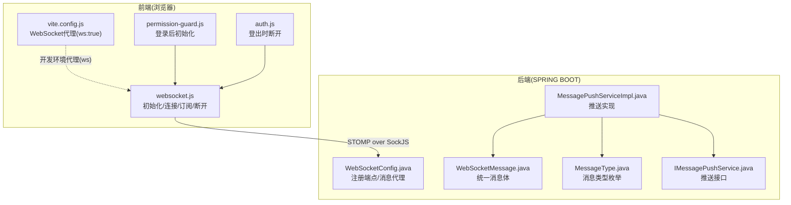
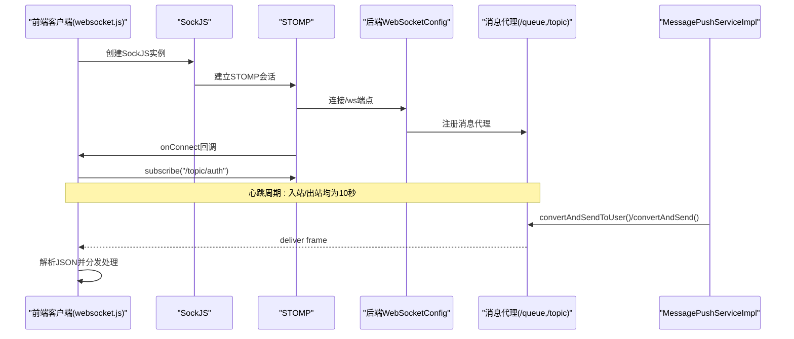
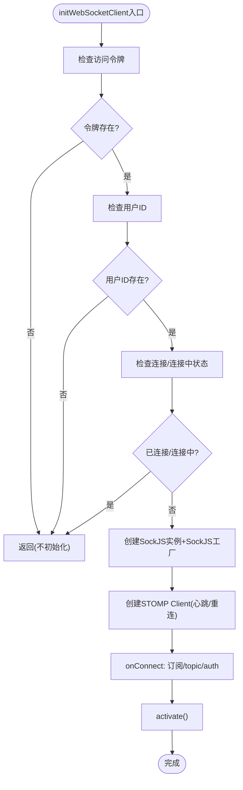
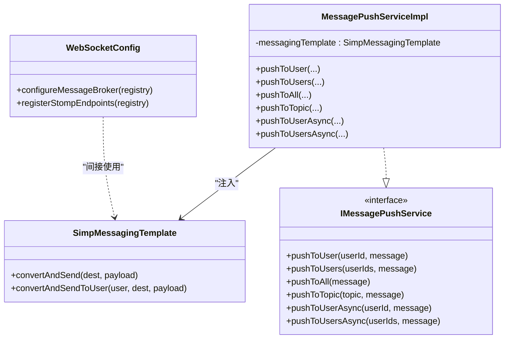
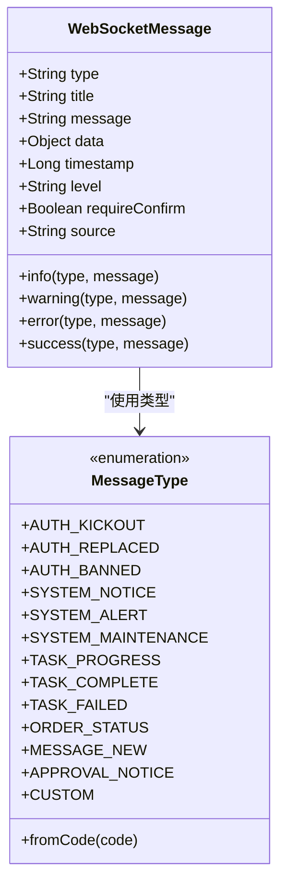
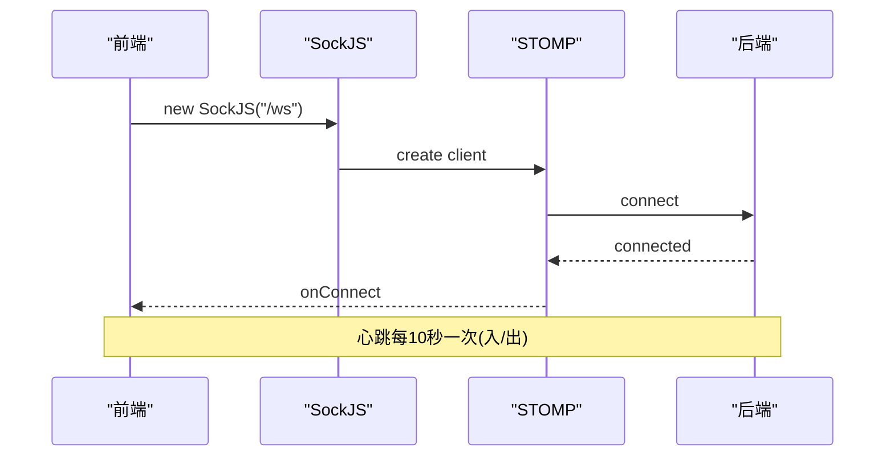
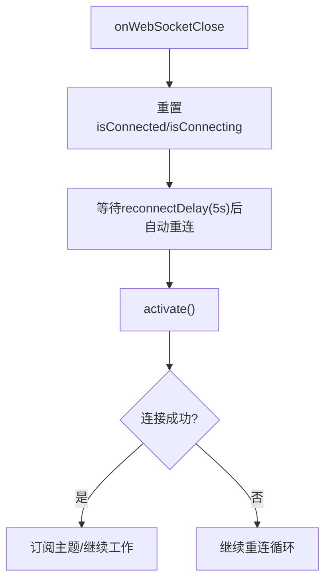
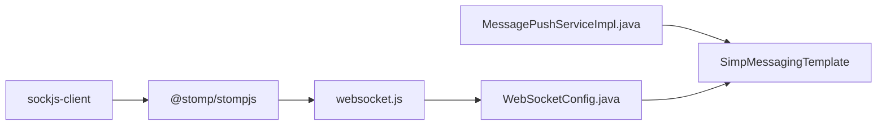

# WebSocket通信工具

<cite>
**本文引用的文件**
- [websocket.js](file://forge-admin-ui/src/utils/websocket.js)
- [permission-guard.js](file://forge-admin-ui/src/router/guards/permission-guard.js)
- [auth.js](file://forge-admin-ui/src/store/modules/auth.js)
- [vite.config.js](file://forge-admin-ui/vite.config.js)
- [WebSocketConfig.java](file://forge/forge-framework/forge-starter-parent/forge-starter-websocket/src/main/java/com/mdframe/forge/starter/websocket/config/WebSocketConfig.java)
- [WebSocketMessage.java](file://forge/forge-framework/forge-starter-parent/forge-starter-websocket/src/main/java/com/mdframe/forge/starter/websocket/domain/WebSocketMessage.java)
- [MessageType.java](file://forge/forge-framework/forge-starter-parent/forge-starter-websocket/src/main/java/com/mdframe/forge/starter/websocket/enums/MessageType.java)
- [IMessagePushService.java](file://forge/forge-framework/forge-starter-parent/forge-starter-websocket/src/main/java/com/mdframe/forge/starter/websocket/service/IMessagePushService.java)
- [MessagePushServiceImpl.java](file://forge/forge-framework/forge-starter-parent/forge-starter-websocket/src/main/java/com/mdframe/forge/starter/websocket/service/impl/MessagePushServiceImpl.java)
</cite>

## 目录
1. [简介](#简介)
2. [项目结构](#项目结构)
3. [核心组件](#核心组件)
4. [架构总览](#架构总览)
5. [详细组件分析](#详细组件分析)
6. [依赖关系分析](#依赖关系分析)
7. [性能考虑](#性能考虑)
8. [故障排查指南](#故障排查指南)
9. [结论](#结论)
10. [附录](#附录)

## 简介
本文件面向实时通信场景，系统性梳理Forge项目的WebSocket通信工具，覆盖连接管理、消息收发、状态监控、心跳与断线重连、消息格式化与事件处理、错误恢复机制，并给出最佳实践、性能优化与安全防护建议。前端采用SokcJS+STOMP协议，后端基于Spring Boot WebSocket消息代理，提供点对点(queue)与广播(topic)两种消息通道。

## 项目结构
- 前端位于 forge-admin-ui，负责WebSocket客户端初始化、连接状态管理、消息订阅与处理。
- 后端位于 forge/forge-framework/forge-starter-parent/forge-starter-websocket，提供WebSocket配置、消息模型、消息推送服务接口与实现。

**图表来源**
- [websocket.js](file://forge-admin-ui/src/utils/websocket.js#L1-L150)
- [vite.config.js](file://forge-admin-ui/vite.config.js#L72-L78)
- [permission-guard.js](file://forge-admin-ui/src/router/guards/permission-guard.js#L156-L157)
- [auth.js](file://forge-admin-ui/src/store/modules/auth.js#L62-L63)
- [WebSocketConfig.java](file://forge/forge-framework/forge-starter-parent/forge-starter-websocket/src/main/java/com/mdframe/forge/starter/websocket/config/WebSocketConfig.java#L1-L45)
- [WebSocketMessage.java](file://forge/forge-framework/forge-starter-parent/forge-starter-websocket/src/main/java/com/mdframe/forge/starter/websocket/domain/WebSocketMessage.java#L1-L99)
- [MessageType.java](file://forge/forge-framework/forge-starter-parent/forge-starter-websocket/src/main/java/com/mdframe/forge/starter/websocket/enums/MessageType.java#L1-L110)
- [IMessagePushService.java](file://forge/forge-framework/forge-starter-parent/forge-starter-websocket/src/main/java/com/mdframe/forge/starter/websocket/service/IMessagePushService.java#L1-L67)
- [MessagePushServiceImpl.java](file://forge/forge-framework/forge-starter-parent/forge-starter-websocket/src/main/java/com/mdframe/forge/starter/websocket/service/impl/MessagePushServiceImpl.java#L1-L111)

**章节来源**
- [websocket.js](file://forge-admin-ui/src/utils/websocket.js#L1-L150)
- [vite.config.js](file://forge-admin-ui/vite.config.js#L72-L78)
- [permission-guard.js](file://forge-admin-ui/src/router/guards/permission-guard.js#L156-L157)
- [auth.js](file://forge-admin-ui/src/store/modules/auth.js#L62-L63)
- [WebSocketConfig.java](file://forge/forge-framework/forge-starter-parent/forge-starter-websocket/src/main/java/com/mdframe/forge/starter/websocket/config/WebSocketConfig.java#L1-L45)
- [WebSocketMessage.java](file://forge/forge-framework/forge-starter-parent/forge-starter-websocket/src/main/java/com/mdframe/forge/starter/websocket/domain/WebSocketMessage.java#L1-L99)
- [MessageType.java](file://forge/forge-framework/forge-starter-parent/forge-starter-websocket/src/main/java/com/mdframe/forge/starter/websocket/enums/MessageType.java#L1-L110)
- [IMessagePushService.java](file://forge/forge-framework/forge-starter-parent/forge-starter-websocket/src/main/java/com/mdframe/forge/starter/websocket/service/IMessagePushService.java#L1-L67)
- [MessagePushServiceImpl.java](file://forge/forge-framework/forge-starter-parent/forge-starter-websocket/src/main/java/com/mdframe/forge/starter/websocket/service/impl/MessagePushServiceImpl.java#L1-L111)

## 核心组件
- 前端WebSocket客户端工具：负责初始化连接、心跳、订阅主题、消息解析与错误处理；提供断开连接能力。
- 后端WebSocket配置：启用消息代理、注册/ws端点并启用SockJS回退。
- 消息模型与类型：统一消息体字段与消息类型枚举，便于前后端约定。
- 消息推送服务：提供点对点、广播、主题推送及异步推送能力。

**章节来源**
- [websocket.js](file://forge-admin-ui/src/utils/websocket.js#L1-L150)
- [WebSocketConfig.java](file://forge/forge-framework/forge-starter-parent/forge-starter-websocket/src/main/java/com/mdframe/forge/starter/websocket/config/WebSocketConfig.java#L1-L45)
- [WebSocketMessage.java](file://forge/forge-framework/forge-starter-parent/forge-starter-websocket/src/main/java/com/mdframe/forge/starter/websocket/domain/WebSocketMessage.java#L1-L99)
- [MessageType.java](file://forge/forge-framework/forge-starter-parent/forge-starter-websocket/src/main/java/com/mdframe/forge/starter/websocket/enums/MessageType.java#L1-L110)
- [IMessagePushService.java](file://forge/forge-framework/forge-starter-parent/forge-starter-websocket/src/main/java/com/mdframe/forge/starter/websocket/service/IMessagePushService.java#L1-L67)
- [MessagePushServiceImpl.java](file://forge/forge-framework/forge-starter-parent/forge-starter-websocket/src/main/java/com/mdframe/forge/starter/websocket/service/impl/MessagePushServiceImpl.java#L1-L111)

## 架构总览
前端通过SockJS连接后端/ws端点，使用STOMP协议订阅/topic/auth主题；后端启用消息代理，支持点对点(/queue)与广播(/topic)。消息推送服务封装了向用户、多用户、广播、主题的发送逻辑。

**图表来源**
- [websocket.js](file://forge-admin-ui/src/utils/websocket.js#L28-L76)
- [WebSocketConfig.java](file://forge/forge-framework/forge-starter-parent/forge-starter-websocket/src/main/java/com/mdframe/forge/starter/websocket/config/WebSocketConfig.java#L38-L44)
- [MessagePushServiceImpl.java](file://forge/forge-framework/forge-starter-parent/forge-starter-websocket/src/main/java/com/mdframe/forge/starter/websocket/service/impl/MessagePushServiceImpl.java#L32-L96)

## 详细组件分析

### 前端WebSocket客户端工具
- 初始化与连接
  - 仅在具备访问令牌且已获取用户ID时初始化；避免重复初始化。
  - 开发环境优先使用后端同源/ws端点，必要时解析代理目标生成绝对URL。
  - 使用SockJS工厂创建连接，启用XHR流式传输与轮询以提升兼容性。
  - 配置STOMP心跳(入/出均为10秒)与重连延迟(5秒)，静默调试。
  - 连接成功后订阅/topic/auth主题，解析JSON并交由消息处理器。
- 断开连接
  - 关闭STOMP会话并清理状态，确保下次可重新初始化。
- 消息处理
  - 支持按用户过滤：若消息携带目标用户ID且与当前用户不一致则忽略。
  - 统一通知：根据消息级别调用全局UI通知；默认级别为info。
  - 认证相关消息：强制下线、账号被顶、封禁等触发登出清理流程。

**图表来源**
- [websocket.js](file://forge-admin-ui/src/utils/websocket.js#L13-L76)

**章节来源**
- [websocket.js](file://forge-admin-ui/src/utils/websocket.js#L1-L150)

### 后端WebSocket配置与消息代理
- 端点注册
  - 注册/ws端点，允许跨域模式，启用SockJS回退以增强兼容性。
- 消息代理
  - 启用简单消息代理，支持点对点(/queue)与广播(/topic)。
  - 应用消息前缀为/app，用户目的地前缀为/user。
- 自动装配
  - 通过Spring自动配置导入WebSocketConfig，无需额外XML配置。

**图表来源**
- [WebSocketConfig.java](file://forge/forge-framework/forge-starter-parent/forge-starter-websocket/src/main/java/com/mdframe/forge/starter/websocket/config/WebSocketConfig.java#L1-L45)
- [IMessagePushService.java](file://forge/forge-framework/forge-starter-parent/forge-starter-websocket/src/main/java/com/mdframe/forge/starter/websocket/service/IMessagePushService.java#L1-L67)
- [MessagePushServiceImpl.java](file://forge/forge-framework/forge-starter-parent/forge-starter-websocket/src/main/java/com/mdframe/forge/starter/websocket/service/impl/MessagePushServiceImpl.java#L1-L111)

**章节来源**
- [WebSocketConfig.java](file://forge/forge-framework/forge-starter-parent/forge-starter-websocket/src/main/java/com/mdframe/forge/starter/websocket/config/WebSocketConfig.java#L1-L45)
- [IMessagePushService.java](file://forge/forge-framework/forge-starter-parent/forge-starter-websocket/src/main/java/com/mdframe/forge/starter/websocket/service/IMessagePushService.java#L1-L67)
- [MessagePushServiceImpl.java](file://forge/forge-framework/forge-starter-parent/forge-starter-websocket/src/main/java/com/mdframe/forge/starter/websocket/service/impl/MessagePushServiceImpl.java#L1-L111)

### 消息模型与类型
- 统一消息体字段：类型、标题、内容、数据、时间戳、级别、是否需确认、来源等。
- 快捷构建方法：提供info/warning/error/success四类便捷构造。
- 消息类型枚举：涵盖认证、系统通知、任务、业务通知等常用类型，并支持自定义类型。

**图表来源**
- [WebSocketMessage.java](file://forge/forge-framework/forge-starter-parent/forge-starter-websocket/src/main/java/com/mdframe/forge/starter/websocket/domain/WebSocketMessage.java#L1-L99)
- [MessageType.java](file://forge/forge-framework/forge-starter-parent/forge-starter-websocket/src/main/java/com/mdframe/forge/starter/websocket/enums/MessageType.java#L1-L110)

**章节来源**
- [WebSocketMessage.java](file://forge/forge-framework/forge-starter-parent/forge-starter-websocket/src/main/java/com/mdframe/forge/starter/websocket/domain/WebSocketMessage.java#L1-L99)
- [MessageType.java](file://forge/forge-framework/forge-starter-parent/forge-starter-websocket/src/main/java/com/mdframe/forge/starter/websocket/enums/MessageType.java#L1-L110)

### 连接建立流程与心跳检测
- 建立流程
  - 前端在路由守卫中获取用户信息后初始化客户端；SockJS创建连接，STOMP激活会话。
  - 后端注册/ws端点并启用消息代理，STOMP握手成功即视为连接建立。
- 心跳检测
  - 前端心跳入/出均为10秒；若长时间无心跳将触发重连。
  - 后端默认心跳由Spring WebSocket配置管理，通常与STOMP心跳保持一致。

**图表来源**
- [websocket.js](file://forge-admin-ui/src/utils/websocket.js#L39-L47)
- [WebSocketConfig.java](file://forge/forge-framework/forge-starter-parent/forge-starter-websocket/src/main/java/com/mdframe/forge/starter/websocket/config/WebSocketConfig.java#L38-L44)

**章节来源**
- [websocket.js](file://forge-admin-ui/src/utils/websocket.js#L39-L47)
- [WebSocketConfig.java](file://forge/forge-framework/forge-starter-parent/forge-starter-websocket/src/main/java/com/mdframe/forge/starter/websocket/config/WebSocketConfig.java#L38-L44)

### 断线重连策略
- 前端
  - STOMP客户端配置重连延迟为5秒；连接关闭回调将重置连接状态。
  - 建议在应用生命周期关键节点(如页面可见性变化、网络状态变化)触发重连。
- 后端
  - Spring WebSocket默认具备断线恢复能力；结合消息代理可保证消息可达性。

**图表来源**
- [websocket.js](file://forge-admin-ui/src/utils/websocket.js#L70-L76)

**章节来源**
- [websocket.js](file://forge-admin-ui/src/utils/websocket.js#L70-L76)

### 消息格式化、事件处理与错误恢复
- 消息格式化
  - 后端统一使用WebSocketMessage作为消息载体，确保字段一致性。
  - 推送前自动补全时间戳，避免空值导致的异常。
- 事件处理
  - 前端订阅/topic/auth，解析JSON后按消息类型分发；认证相关消息触发登出清理。
  - 支持按用户过滤，避免非目标用户收到消息。
- 错误恢复
  - STOMP错误回调记录错误信息；连接关闭回调重置状态。
  - 登出时主动断开连接，防止资源泄露。

**章节来源**
- [websocket.js](file://forge-admin-ui/src/utils/websocket.js#L56-L76)
- [MessagePushServiceImpl.java](file://forge/forge-framework/forge-starter-parent/forge-starter-websocket/src/main/java/com/mdframe/forge/starter/websocket/service/impl/MessagePushServiceImpl.java#L32-L96)

### 客户端连接池管理与消息队列处理
- 连接池管理
  - 前端当前实现为单连接模型，未见连接池抽象；建议在高并发场景引入连接池或按用户/主题分组管理连接。
- 消息队列处理
  - 后端通过消息代理实现队列化处理；点对点消息投递至/queue/messages，广播至/topic/*。
  - 异步推送接口使用@Async注解，降低业务线程阻塞风险。

**章节来源**
- [MessagePushServiceImpl.java](file://forge/forge-framework/forge-starter-parent/forge-starter-websocket/src/main/java/com/mdframe/forge/starter/websocket/service/impl/MessagePushServiceImpl.java#L99-L110)

## 依赖关系分析
- 前端依赖
  - sockjs-client与@stomp/stompjs用于STOMP over SockJS通信。
  - 开发环境通过Vite代理转发/ws到后端，ws:true开启WebSocket代理。
- 后端依赖
  - Spring WebSocket与消息代理；SimpMessagingTemplate用于消息发送。
  - 自动配置导入WebSocketConfig，简化部署。

**图表来源**
- [websocket.js](file://forge-admin-ui/src/utils/websocket.js#L1-L3)
- [vite.config.js](file://forge-admin-ui/vite.config.js#L72-L78)
- [WebSocketConfig.java](file://forge/forge-framework/forge-starter-parent/forge-starter-websocket/src/main/java/com/mdframe/forge/starter/websocket/config/WebSocketConfig.java#L1-L45)
- [MessagePushServiceImpl.java](file://forge/forge-framework/forge-starter-parent/forge-starter-websocket/src/main/java/com/mdframe/forge/starter/websocket/service/impl/MessagePushServiceImpl.java#L1-L111)

**章节来源**
- [websocket.js](file://forge-admin-ui/src/utils/websocket.js#L1-L3)
- [vite.config.js](file://forge-admin-ui/vite.config.js#L72-L78)
- [WebSocketConfig.java](file://forge/forge-framework/forge-starter-parent/forge-starter-websocket/src/main/java/com/mdframe/forge/starter/websocket/config/WebSocketConfig.java#L1-L45)
- [MessagePushServiceImpl.java](file://forge/forge-framework/forge-starter-parent/forge-starter-websocket/src/main/java/com/mdframe/forge/starter/websocket/service/impl/MessagePushServiceImpl.java#L1-L111)

## 性能考虑
- 心跳与重连
  - 合理的心跳间隔(当前10秒)可平衡保活与带宽占用；在网络波动较大时适当缩短重连延迟。
- 消息体积
  - 控制消息体大小，避免频繁序列化/反序列化带来的GC压力。
- 广播与点对点
  - 广播应谨慎使用，优先采用点对点或主题订阅，减少无效消费。
- 异步推送
  - 使用异步推送接口降低同步阻塞，提高吞吐量。
- 前端连接复用
  - 在多页面或多主题场景下，避免重复订阅相同主题，减少带宽与CPU消耗。

## 故障排查指南
- 连接失败
  - 检查后端/ws端点是否可用，确认SockJS回退传输是否启用。
  - 查看前端STOMP错误回调与控制台日志。
- 心跳超时
  - 核对心跳配置(入/出)是否一致；排查网络代理是否影响长连接。
- 消息未达
  - 确认订阅的主题是否正确；检查消息目的地前缀(/queue,/topic,/user)。
- 登出后仍接收消息
  - 确认登出时是否调用断开连接；检查前端是否仍在订阅。
- 开发环境代理
  - 确认Vite代理配置ws:true，避免WebSocket握手失败。

**章节来源**
- [websocket.js](file://forge-admin-ui/src/utils/websocket.js#L66-L76)
- [vite.config.js](file://forge-admin-ui/vite.config.js#L72-L78)
- [auth.js](file://forge-admin-ui/src/store/modules/auth.js#L62-L63)

## 结论
Forge项目的WebSocket通信工具以SockJS+STOMP为基础，前后端协同实现了稳定的心跳、可靠的断线重连、灵活的消息订阅与统一的消息格式。通过消息代理与推送服务，系统支持点对点、广播与主题三种消息通道。建议在生产环境中进一步完善连接池、消息队列与安全策略，持续优化性能与可靠性。

## 附录
- 最佳实践
  - 在路由守卫中初始化连接，在登出时断开连接。
  - 使用统一消息体与类型枚举，确保前后端契约清晰。
  - 广播优先级低于点对点，避免不必要的广播风暴。
- 安全防护
  - 后端启用跨域白名单与鉴权；前端避免在不受信任的域名间共享凭证。
  - 对敏感消息进行脱敏与权限校验，确保仅目标用户可接收。