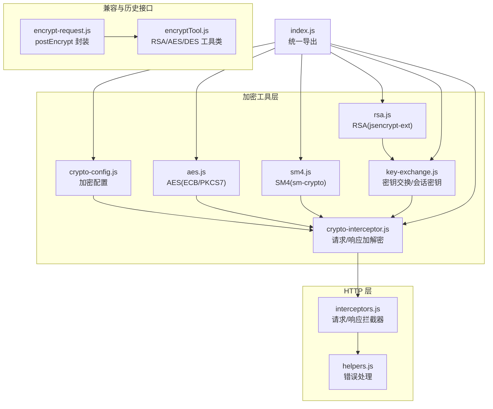
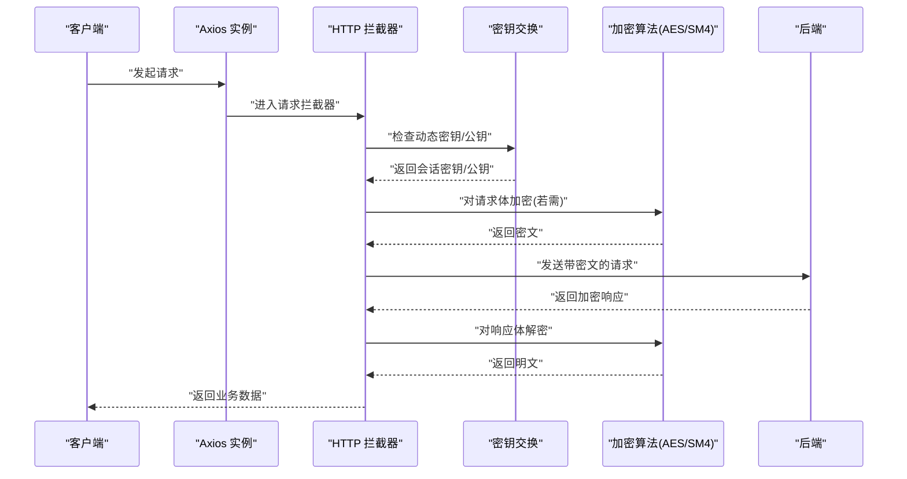
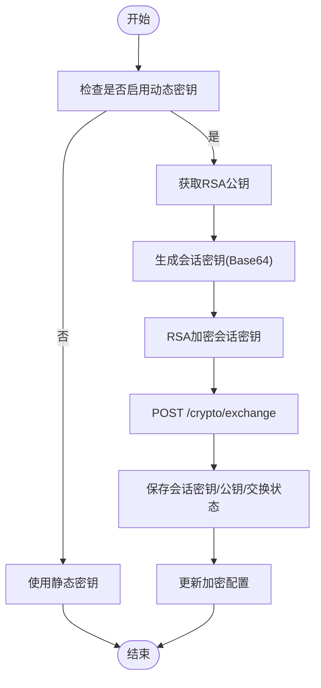

# 加密解密工具

<cite>
**本文引用的文件**
- [index.js](file://forge-admin-ui/src/utils/crypto/index.js)
- [aes.js](file://forge-admin-ui/src/utils/crypto/aes.js)
- [rsa.js](file://forge-admin-ui/src/utils/crypto/rsa.js)
- [sm4.js](file://forge-admin-ui/src/utils/crypto/sm4.js)
- [key-exchange.js](file://forge-admin-ui/src/utils/crypto/key-exchange.js)
- [crypto-interceptor.js](file://forge-admin-ui/src/utils/crypto/crypto-interceptor.js)
- [crypto-config.js](file://forge-admin-ui/src/utils/crypto/crypto-config.js)
- [interceptors.js](file://forge-admin-ui/src/utils/http/interceptors.js)
- [helpers.js](file://forge-admin-ui/src/utils/http/helpers.js)
- [encrypt-request.js](file://forge-admin-ui/src/utils/encrypt-request.js)
- [encryptTool.js](file://forge-admin-ui/src/utils/encryptTool.js)
- [package.json](file://forge-admin-ui/package.json)
</cite>

## 目录
1. [简介](#简介)
2. [项目结构](#项目结构)
3. [核心组件](#核心组件)
4. [架构总览](#架构总览)
5. [详细组件分析](#详细组件分析)
6. [依赖关系分析](#依赖关系分析)
7. [性能考虑](#性能考虑)
8. [故障排查指南](#故障排查指南)
9. [结论](#结论)
10. [附录](#附录)

## 简介
本文件系统性梳理并解读该加密解密工具的前端实现，覆盖以下能力与场景：
- 对称加密：AES（ECB/PKCS7）、SM4（基于 sm-crypto）
- 非对称加密：RSA（基于 jsencrypt-ext）
- 密钥交换机制：RSA 公钥拉取、会话密钥生成、密钥上送与持久化
- 会话密钥管理：动态密钥启用/禁用、密钥状态恢复与重置
- 加密字段标识：请求体统一包装 data/algorithm
- 请求加密拦截器与响应解密处理器：自动判断路径、加密/解密、错误处理
- API 加解密配置：算法选择、路径白黑名单、防重放参数
- 客户端密钥管理：localStorage 存储、初始化与重置
- 安全传输协议：RSA 登录加密、防重放头注入、统一错误处理
- 性能优化建议：算法选择、批量请求合并、缓存公钥与会话密钥
- 安全性评估：密钥轮换策略、密钥生命周期、错误降级与告警
- 兼容性与历史接口：RSA/AES/DES 工具类与旧版加密请求封装

## 项目结构
前端加密相关代码集中在 forge-admin-ui/src/utils/crypto 与 forge-admin-ui/src/utils/http 下，形成“配置-算法-拦截器-HTTP拦截器”的分层架构；同时保留了兼容性的 RSA/AES/DES 工具类与旧版加密请求封装。

图表来源
- [index.js](file://forge-admin-ui/src/utils/crypto/index.js#L1-L17)
- [crypto-config.js](file://forge-admin-ui/src/utils/crypto/crypto-config.js#L1-L79)
- [aes.js](file://forge-admin-ui/src/utils/crypto/aes.js#L1-L44)
- [rsa.js](file://forge-admin-ui/src/utils/crypto/rsa.js#L1-L38)
- [sm4.js](file://forge-admin-ui/src/utils/crypto/sm4.js#L1-L65)
- [key-exchange.js](file://forge-admin-ui/src/utils/crypto/key-exchange.js#L1-L265)
- [crypto-interceptor.js](file://forge-admin-ui/src/utils/crypto/crypto-interceptor.js#L1-L132)
- [interceptors.js](file://forge-admin-ui/src/utils/http/interceptors.js#L1-L165)
- [helpers.js](file://forge-admin-ui/src/utils/http/helpers.js#L1-L61)
- [encrypt-request.js](file://forge-admin-ui/src/utils/encrypt-request.js#L1-L56)
- [encryptTool.js](file://forge-admin-ui/src/utils/encryptTool.js#L1-L92)

章节来源
- [index.js](file://forge-admin-ui/src/utils/crypto/index.js#L1-L17)
- [interceptors.js](file://forge-admin-ui/src/utils/http/interceptors.js#L1-L165)

## 核心组件
- 加密配置 crypto-config.js：集中管理算法、密钥、动态密钥开关、路径白黑名单、防重放策略
- 对称算法 aes.js/sm4.js：提供对称加解密封装，统一输出 Base64 密文
- 非对称算法 rsa.js：提供 RSA 加解密封装，支持公钥/私钥设置
- 密钥交换 key-exchange.js：拉取公钥、生成会话密钥、RSA 加密后上送、持久化与状态管理
- 请求/响应拦截器 crypto-interceptor.js：根据配置对请求体加密、对响应体解密
- HTTP 拦截器 interceptors.js：注入防重放头、调用加密拦截器、统一错误处理
- 兼容与历史接口：encrypt-request.js 与 encryptTool.js，提供旧版加密请求与多算法工具

章节来源
- [crypto-config.js](file://forge-admin-ui/src/utils/crypto/crypto-config.js#L1-L79)
- [aes.js](file://forge-admin-ui/src/utils/crypto/aes.js#L1-L44)
- [sm4.js](file://forge-admin-ui/src/utils/crypto/sm4.js#L1-L65)
- [rsa.js](file://forge-admin-ui/src/utils/crypto/rsa.js#L1-L38)
- [key-exchange.js](file://forge-admin-ui/src/utils/crypto/key-exchange.js#L1-L265)
- [crypto-interceptor.js](file://forge-admin-ui/src/utils/crypto/crypto-interceptor.js#L1-L132)
- [interceptors.js](file://forge-admin-ui/src/utils/http/interceptors.js#L1-L165)
- [encrypt-request.js](file://forge-admin-ui/src/utils/encrypt-request.js#L1-L56)
- [encryptTool.js](file://forge-admin-ui/src/utils/encryptTool.js#L1-L92)

## 架构总览
整体流程分为“请求阶段”和“响应阶段”，均由 HTTP 拦截器驱动，内部通过加密拦截器与密钥交换服务协同工作。

图表来源
- [interceptors.js](file://forge-admin-ui/src/utils/http/interceptors.js#L115-L160)
- [crypto-interceptor.js](file://forge-admin-ui/src/utils/crypto/crypto-interceptor.js#L65-L94)
- [key-exchange.js](file://forge-admin-ui/src/utils/crypto/key-exchange.js#L126-L195)
- [crypto-interceptor.js](file://forge-admin-ui/src/utils/crypto/crypto-interceptor.js#L101-L129)

## 详细组件分析

### 加密配置与路径规则
- 配置项包括：是否启用加密、默认算法（SM4/AES）、密钥、动态密钥开关、防重放开关及路径白黑名单
- 路径匹配采用通配符模式，支持 includePaths/includePaths 精细控制
- 防重放默认开启，对特定路径（如验证码、公钥/交换接口）自动排除

章节来源
- [crypto-config.js](file://forge-admin-ui/src/utils/crypto/crypto-config.js#L1-L79)

### AES 对称加密
- 模式：ECB
- 填充：PKCS7
- 密钥：Base64 编码的 16 字节密钥
- 输入/输出：字符串明文与 Base64 密文

章节来源
- [aes.js](file://forge-admin-ui/src/utils/crypto/aes.js#L1-L44)

### SM4 国密算法
- 使用 sm-crypto 库进行加密/解密
- 内部以十六进制密文形式存储，对外提供 Base64 编解码转换
- 密钥：16 字节十六进制字符串（可通过 Base64 解码为 Hex）

章节来源
- [sm4.js](file://forge-admin-ui/src/utils/crypto/sm4.js#L1-L65)

### RSA 非对称加密
- 使用 jsencrypt-ext 进行公钥/私钥设置与加解密
- 用于登录密码加密、会话密钥的 RSA 加密上送
- 错误处理：加密/解密失败抛出明确错误

章节来源
- [rsa.js](file://forge-admin-ui/src/utils/crypto/rsa.js#L1-L38)

### 密钥交换与会话密钥管理
- 启动/登录后初始化密钥交换
- 流程：拉取 RSA 公钥 → 生成 Base64 会话密钥 → RSA 加密会话密钥 → 上送后端 → 保存至本地存储并更新加密配置
- 状态管理：内存状态 + localStorage 持久化；支持重置与恢复
- 并发保护：避免重复交换；超时等待机制

图表来源
- [key-exchange.js](file://forge-admin-ui/src/utils/crypto/key-exchange.js#L237-L244)
- [key-exchange.js](file://forge-admin-ui/src/utils/crypto/key-exchange.js#L126-L195)

章节来源
- [key-exchange.js](file://forge-admin-ui/src/utils/crypto/key-exchange.js#L1-L265)

### 请求加密拦截器
- 自动判断是否加密：依据 URL 路径匹配与配置开关
- 加密对象：请求体为 JSON 时进行加密，并将 data 与 algorithm 字段写入
- 算法选择：SM4 或 AES，密钥按配置解析
- 异常：密钥缺失、加密失败时记录日志并跳过加密

章节来源
- [crypto-interceptor.js](file://forge-admin-ui/src/utils/crypto/crypto-interceptor.js#L65-L94)

### 响应解密处理器
- 识别加密响应：响应体包含 data 与 algorithm 字段
- 解密：根据 algorithm 选择对应算法解密
- 错误处理：针对解密异常（如填充/密钥错误）抛出特定错误，交由 HTTP 拦截器处理

章节来源
- [crypto-interceptor.js](file://forge-admin-ui/src/utils/crypto/crypto-interceptor.js#L101-L129)

### HTTP 拦截器与防重放
- 请求阶段：注入 traceId；根据配置注入 X-Timestamp 与 X-Nonce；调用请求加密拦截器
- 响应阶段：先解密响应，再统一错误处理；检测 DECRYPT_ERROR 时触发密钥重置与提示
- 错误处理：区分网络错误、业务错误与解密错误，统一提示与引导登出

章节来源
- [interceptors.js](file://forge-admin-ui/src/utils/http/interceptors.js#L115-L160)
- [interceptors.js](file://forge-admin-ui/src/utils/http/interceptors.js#L21-L71)
- [helpers.js](file://forge-admin-ui/src/utils/http/helpers.js#L1-L61)

### 兼容与历史接口
- encrypt-request.js：提供 postEncrypt 封装，内部使用 EncryptTool 对数据进行 RSA 加密/解密
- encryptTool.js：内置 RSA/AES/DES 静态密钥，提供统一封装，便于迁移与兼容

章节来源
- [encrypt-request.js](file://forge-admin-ui/src/utils/encrypt-request.js#L1-L56)
- [encryptTool.js](file://forge-admin-ui/src/utils/encryptTool.js#L1-L92)

## 依赖关系分析
- 加密算法依赖：
  - AES/SM4：crypto-js、sm-crypto
  - RSA：jsencrypt-ext
- 拦截器依赖：
  - axios 实例
  - 加密配置与密钥交换服务
- 工具类依赖：
  - crypto-js、jsencrypt-ext、sm-crypto

章节来源
- [package.json](file://forge-admin-ui/package.json#L13-L42)

## 性能考虑
- 算法选择
  - SM4 在浏览器侧性能更优，适合高频请求
  - AES/SM4 建议统一使用 CBC 模式并配合随机 IV（当前实现为 ECB，注意安全性权衡）
- 批量请求合并
  - 将多个小请求合并为单次请求，减少握手与加密开销
- 缓存与复用
  - 缓存 RSA 公钥与会话密钥，避免重复拉取与生成
  - 防重放参数仅在必要路径注入，减少额外头部
- 错误降级
  - 解密失败时快速失败并提示，避免阻塞主流程

## 故障排查指南
- “加密密钥未设置”
  - 检查是否启用动态密钥、是否完成密钥交换、localStorage 是否有会话密钥
- “RSA 加密失败/解密失败”
  - 校验公钥/私钥格式与长度；确认数据长度不超过 RSA 模长限制
- “响应解密失败（填充/密钥错误）”
  - 触发 DECRYPT_ERROR，系统会自动重置密钥并提示重新操作
- “防重放参数导致接口异常”
  - 检查 replayExcludePaths 与目标接口路径是否匹配

章节来源
- [crypto-interceptor.js](file://forge-admin-ui/src/utils/crypto/crypto-interceptor.js#L23-L25)
- [crypto-interceptor.js](file://forge-admin-ui/src/utils/crypto/crypto-interceptor.js#L117-L122)
- [interceptors.js](file://forge-admin-ui/src/utils/http/interceptors.js#L30-L42)

## 结论
该加密解密工具以“配置驱动 + 拦截器自动化”的方式实现了 AES/SM4 对称加密与 RSA 非对称加密的统一接入，结合动态密钥交换与防重放机制，满足了前后端安全通信的需求。建议在生产环境中进一步完善密钥轮换策略、引入 CBC/随机 IV 等更强的安全实践，并持续监控与优化加密性能。

## 附录

### API 加解密配置清单
- enabled：是否启用加密
- algorithm：默认算法（SM4/AES）
- secretKey：Base64 密钥（动态密钥模式下由密钥交换设置）
- enableDynamicKey：是否启用动态密钥
- enableReplay：是否启用防重放
- replayIncludePaths/replayExcludePaths：防重放路径规则
- includePaths/excludePaths：加密路径规则

章节来源
- [crypto-config.js](file://forge-admin-ui/src/utils/crypto/crypto-config.js#L4-L23)

### 客户端密钥管理要点
- 会话密钥与公钥持久化于 localStorage
- 应用启动时自动恢复密钥状态
- 登出或解密错误时重置密钥交换状态

章节来源
- [key-exchange.js](file://forge-admin-ui/src/utils/crypto/key-exchange.js#L26-L76)
- [key-exchange.js](file://forge-admin-ui/src/utils/crypto/key-exchange.js#L216-L229)

### 安全传输协议实现细节
- 登录密码使用 RSA 公钥加密
- 请求注入 traceId、X-Timestamp、X-Nonce 防重放参数
- 统一错误处理与登出引导

章节来源
- [key-exchange.js](file://forge-admin-ui/src/utils/crypto/key-exchange.js#L252-L264)
- [interceptors.js](file://forge-admin-ui/src/utils/http/interceptors.js#L135-L154)
- [helpers.js](file://forge-admin-ui/src/utils/http/helpers.js#L6-L25)

### 密钥轮换策略（技术建议）
- 周期性刷新会话密钥（例如每 8 小时）
- 后端颁发短期会话密钥并在响应头中携带有效期
- 客户端监听到期事件主动触发密钥交换
- 记录密钥轮换日志，异常时回滚并提示用户

### 与后端交互的关键接口
- GET /crypto/public-key：获取 RSA 公钥
- POST /crypto/exchange：上送 RSA 加密的会话密钥

章节来源
- [key-exchange.js](file://forge-admin-ui/src/utils/crypto/key-exchange.js#L98-L118)
- [key-exchange.js](file://forge-admin-ui/src/utils/crypto/key-exchange.js#L167-L170)