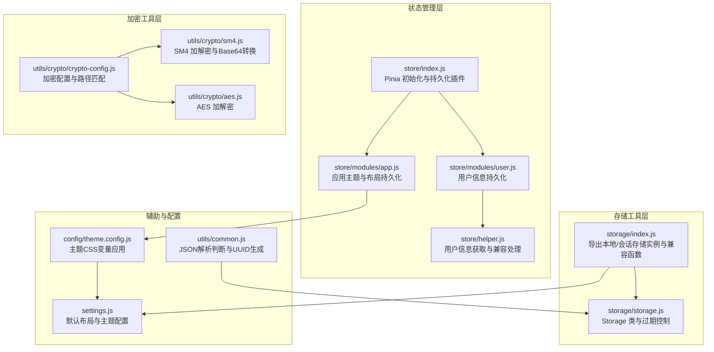
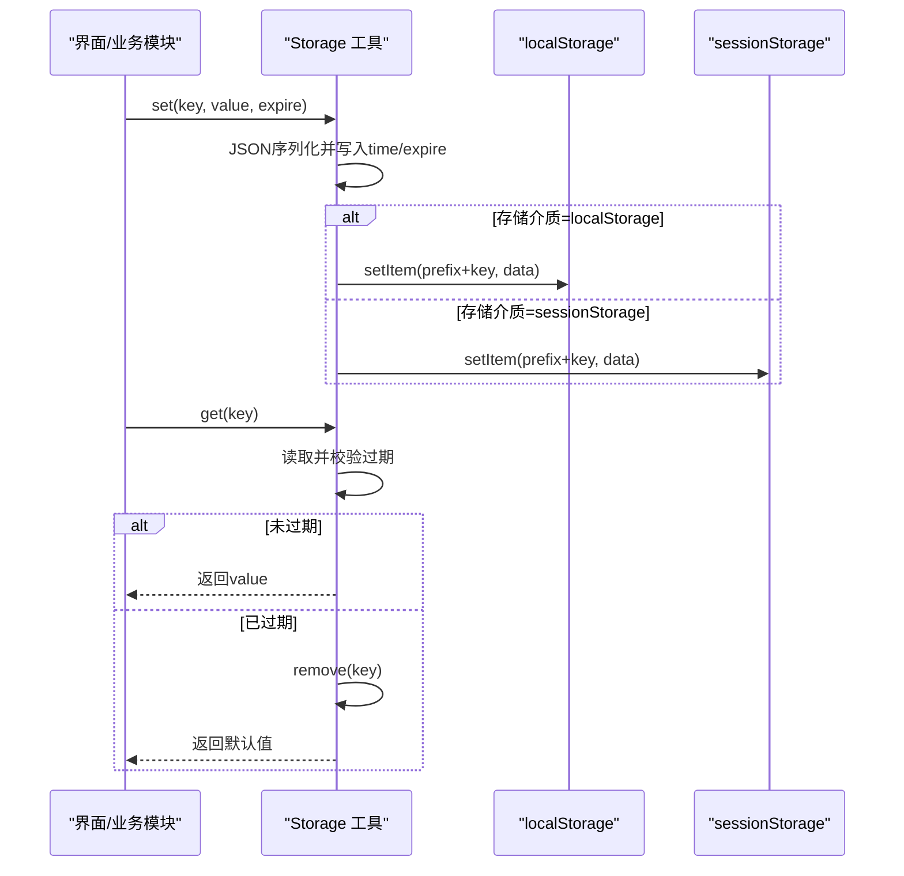
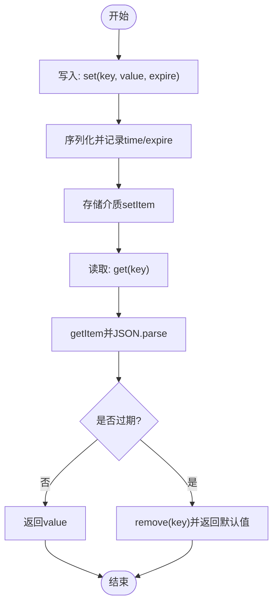
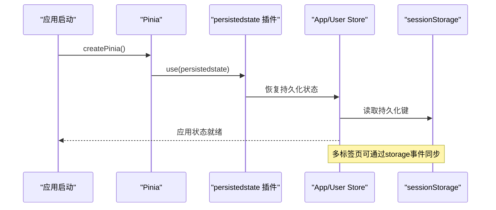
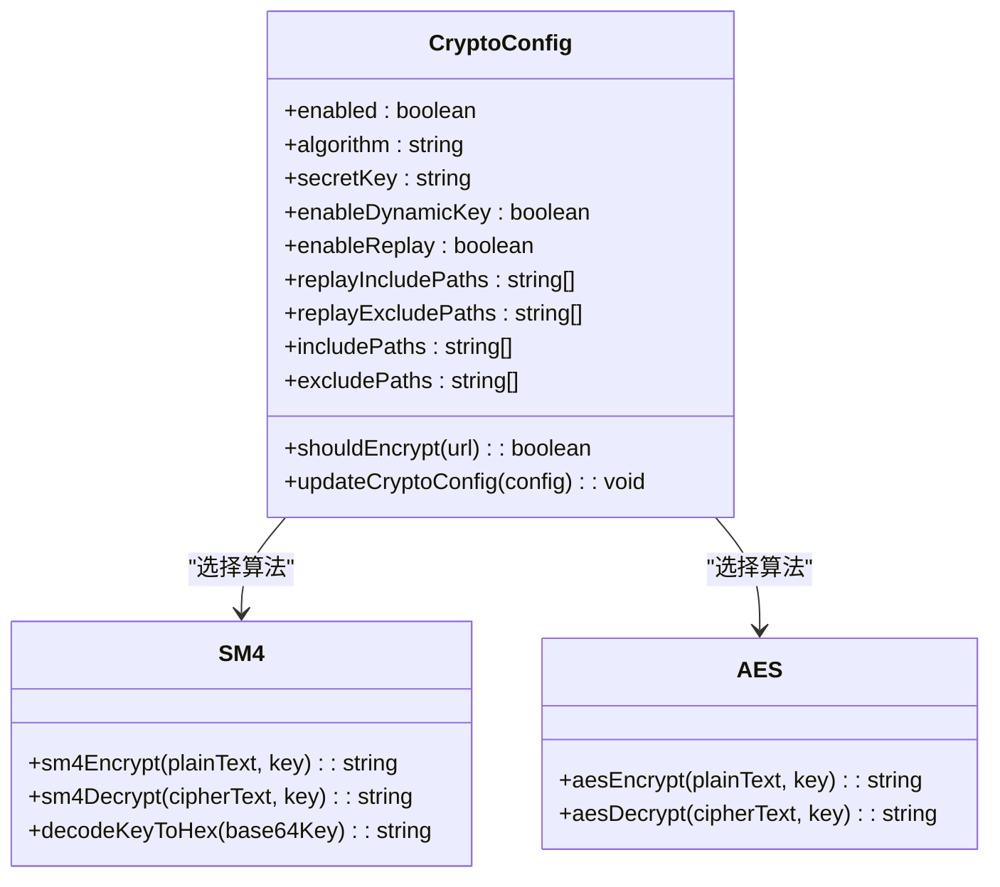
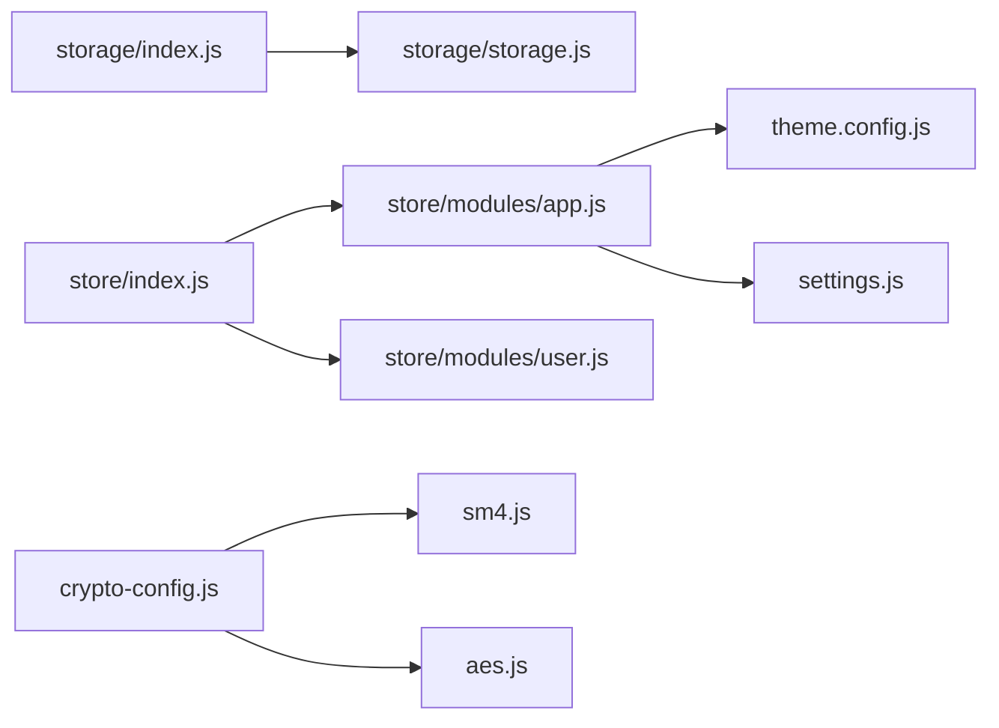

# 存储管理工具

<cite>
**本文引用的文件**
- [storage/index.js](file://forge-admin-ui/src/utils/storage/index.js)
- [storage/storage.js](file://forge-admin-ui/src/utils/storage/storage.js)
- [store/index.js](file://forge-admin-ui/src/store/index.js)
- [store/modules/app.js](file://forge-admin-ui/src/store/modules/app.js)
- [store/modules/user.js](file://forge-admin-ui/src/store/modules/user.js)
- [store/helper.js](file://forge-admin-ui/src/store/helper.js)
- [settings.js](file://forge-admin-ui/src/settings.js)
- [theme.config.js](file://forge-admin-ui/src/config/theme.config.js)
- [crypto-config.js](file://forge-admin-ui/src/utils/crypto/crypto-config.js)
- [sm4.js](file://forge-admin-ui/src/utils/crypto/sm4.js)
- [aes.js](file://forge-admin-ui/src/utils/crypto/aes.js)
- [common.js](file://forge-admin-ui/src/utils/common.js)
- [CACHE_MANAGEMENT_README.md](file://CACHE_MANAGEMENT_README.md)
</cite>

## 目录
1. [简介](#简介)
2. [项目结构](#项目结构)
3. [核心组件](#核心组件)
4. [架构总览](#架构总览)
5. [详细组件分析](#详细组件分析)
6. [依赖关系分析](#依赖关系分析)
7. [性能考量](#性能考量)
8. [故障排查指南](#故障排查指南)
9. [结论](#结论)
10. [附录](#附录)

## 简介
本文件面向“存储管理工具”的技术文档，聚焦于前端本地存储与会话存储的统一接口设计、数据序列化与过期时间管理、持久化策略、跨标签页同步、空间清理机制，以及在用户偏好设置、临时数据缓存、认证信息存储场景下的最佳实践。同时涵盖存储安全、隐私保护与数据迁移的技术实现思路。

## 项目结构
本项目的存储能力主要集中在前端工程的工具与状态管理模块中：
- 存储工具层：提供 localStorage/sessionStorage 的统一封装与过期控制
- 状态管理层：基于 Pinia 的持久化存储，支持应用主题、用户信息等关键状态
- 加密工具层：提供多种对称加密算法与密钥交换流程，用于敏感数据的安全存储
- 辅助工具层：通用方法如 JSON 解析判断、UUID 生成等，支撑存储与安全策略

图表来源
- [storage/index.js](file://forge-admin-ui/src/utils/storage/index.js#L1-L66)
- [storage/storage.js](file://forge-admin-ui/src/utils/storage/storage.js#L1-L59)
- [store/index.js](file://forge-admin-ui/src/store/index.js#L1-L11)
- [store/modules/app.js](file://forge-admin-ui/src/store/modules/app.js#L1-L91)
- [store/modules/user.js](file://forge-admin-ui/src/store/modules/user.js#L1-L118)
- [store/helper.js](file://forge-admin-ui/src/store/helper.js#L1-L57)
- [settings.js](file://forge-admin-ui/src/settings.js#L1-L75)
- [theme.config.js](file://forge-admin-ui/src/config/theme.config.js#L1-L164)
- [crypto-config.js](file://forge-admin-ui/src/utils/crypto/crypto-config.js#L1-L79)
- [sm4.js](file://forge-admin-ui/src/utils/crypto/sm4.js#L1-L65)
- [aes.js](file://forge-admin-ui/src/utils/crypto/aes.js#L1-L44)
- [common.js](file://forge-admin-ui/src/utils/common.js#L1-L116)

章节来源
- [storage/index.js](file://forge-admin-ui/src/utils/storage/index.js#L1-L66)
- [storage/storage.js](file://forge-admin-ui/src/utils/storage/storage.js#L1-L59)
- [store/index.js](file://forge-admin-ui/src/store/index.js#L1-L11)
- [store/modules/app.js](file://forge-admin-ui/src/store/modules/app.js#L1-L91)
- [store/modules/user.js](file://forge-admin-ui/src/store/modules/user.js#L1-L118)
- [store/helper.js](file://forge-admin-ui/src/store/helper.js#L1-L57)
- [settings.js](file://forge-admin-ui/src/settings.js#L1-L75)
- [theme.config.js](file://forge-admin-ui/src/config/theme.config.js#L1-L164)
- [crypto-config.js](file://forge-admin-ui/src/utils/crypto/crypto-config.js#L1-L79)
- [sm4.js](file://forge-admin-ui/src/utils/crypto/sm4.js#L1-L65)
- [aes.js](file://forge-admin-ui/src/utils/crypto/aes.js#L1-L44)
- [common.js](file://forge-admin-ui/src/utils/common.js#L1-L116)

## 核心组件
- 统一存储接口
  - 通过工厂函数创建本地/会话存储实例，支持自定义前缀与存储介质
  - 提供兼容性函数，便于直接使用原生 localStorage/sessionStorage
- Storage 类与过期控制
  - 写入时序列化并携带写入时间与过期时间戳
  - 读取时校验过期并自动清理过期项
- Pinia 持久化状态
  - 应用主题与布局、用户信息等关键状态持久化至 sessionStorage 或自定义存储
  - 通过插件与 store 配置实现跨刷新保持
- 加密与安全
  - 加密配置集中管理，支持路径白/黑名单与动态密钥
  - 提供 SM4/AES 等加解密工具与 Base64/Hex 转换

章节来源
- [storage/index.js](file://forge-admin-ui/src/utils/storage/index.js#L1-L66)
- [storage/storage.js](file://forge-admin-ui/src/utils/storage/storage.js#L1-L59)
- [store/index.js](file://forge-admin-ui/src/store/index.js#L1-L11)
- [store/modules/app.js](file://forge-admin-ui/src/store/modules/app.js#L85-L89)
- [store/modules/user.js](file://forge-admin-ui/src/store/modules/user.js#L114-L117)
- [crypto-config.js](file://forge-admin-ui/src/utils/crypto/crypto-config.js#L1-L79)
- [sm4.js](file://forge-admin-ui/src/utils/crypto/sm4.js#L1-L65)
- [aes.js](file://forge-admin-ui/src/utils/crypto/aes.js#L1-L44)

## 架构总览
存储体系由三层构成：
- 工具层：统一的本地/会话存储封装与过期管理
- 状态层：Pinia 持久化，承载用户偏好与主题配置
- 安全层：加密配置与加解密工具，保障敏感数据安全

图表来源
- [storage/storage.js](file://forge-admin-ui/src/utils/storage/storage.js#L13-L45)
- [storage/index.js](file://forge-admin-ui/src/utils/storage/index.js#L8-L25)

## 详细组件分析

### 组件A：统一存储接口与过期控制
- 设计要点
  - 通过工厂函数创建 Storage 实例，支持 prefixKey 与 storage 选项
  - 写入时携带时间戳与过期时间；读取时进行过期校验并自动清理
  - 提供兼容函数，直接使用原生存储 API
- 关键流程
  - 写入：序列化 + 时间戳 + 过期时间 → setItem
  - 读取：getItem → JSON.parse → 过期判断 → 返回或清理
  - 清理：remove/clear

图表来源
- [storage/storage.js](file://forge-admin-ui/src/utils/storage/storage.js#L13-L45)

章节来源
- [storage/index.js](file://forge-admin-ui/src/utils/storage/index.js#L1-L66)
- [storage/storage.js](file://forge-admin-ui/src/utils/storage/storage.js#L1-L59)

### 组件B：Pinia 持久化状态与跨标签页同步
- 设计要点
  - 通过插件初始化 Pinia 并启用持久化
  - 应用 store 将布局、主题、主色等关键状态持久化至 sessionStorage
  - 用户 store 通过持久化配置保存用户信息
- 跨标签页同步
  - 通过监听 storage 事件可在多标签页间感知存储变化（需在业务中显式订阅）

图表来源
- [store/index.js](file://forge-admin-ui/src/store/index.js#L1-L11)
- [store/modules/app.js](file://forge-admin-ui/src/store/modules/app.js#L85-L89)
- [store/modules/user.js](file://forge-admin-ui/src/store/modules/user.js#L114-L117)

章节来源
- [store/index.js](file://forge-admin-ui/src/store/index.js#L1-L11)
- [store/modules/app.js](file://forge-admin-ui/src/store/modules/app.js#L1-L91)
- [store/modules/user.js](file://forge-admin-ui/src/store/modules/user.js#L1-L118)

### 组件C：加密配置与加解密工具
- 设计要点
  - 加密配置集中管理，支持启用/禁用、算法选择、动态密钥、防重放与路径匹配
  - 提供 SM4/AES 的加解密实现，以及 Base64/Hex 转换工具
- 最佳实践
  - 对敏感数据（如令牌、用户标识）采用加密存储
  - 使用动态密钥与防重放策略提升安全性

图表来源
- [crypto-config.js](file://forge-admin-ui/src/utils/crypto/crypto-config.js#L1-L79)
- [sm4.js](file://forge-admin-ui/src/utils/crypto/sm4.js#L1-L65)
- [aes.js](file://forge-admin-ui/src/utils/crypto/aes.js#L1-L44)

章节来源
- [crypto-config.js](file://forge-admin-ui/src/utils/crypto/crypto-config.js#L1-L79)
- [sm4.js](file://forge-admin-ui/src/utils/crypto/sm4.js#L1-L65)
- [aes.js](file://forge-admin-ui/src/utils/crypto/aes.js#L1-L44)

### 组件D：主题与布局配置的持久化
- 设计要点
  - 默认主题配置集中管理，支持明/暗色模式
  - 应用 store 将主题配置持久化，结合 CSS 变量实现动态主题切换
- 最佳实践
  - 将用户偏好的主题设置与布局偏好持久化，提升用户体验一致性

章节来源
- [settings.js](file://forge-admin-ui/src/settings.js#L1-L75)
- [theme.config.js](file://forge-admin-ui/src/config/theme.config.js#L1-L164)
- [store/modules/app.js](file://forge-admin-ui/src/store/modules/app.js#L1-L91)

## 依赖关系分析
- 存储工具依赖
  - storage/index.js 依赖 storage/storage.js 提供的 Storage 类
  - storage/index.js 通过环境变量 VITE_TENANT 生成前缀，避免多租户冲突
- 状态管理依赖
  - store/index.js 初始化 Pinia 并启用持久化插件
  - app/user store 通过 persist 配置选择存储介质与键名
- 安全依赖
  - 加密配置与加解密工具相互协作，路径匹配决定是否加密
  - Base64/Hex 转换为密钥与数据传输提供桥梁

图表来源
- [storage/index.js](file://forge-admin-ui/src/utils/storage/index.js#L1-L66)
- [storage/storage.js](file://forge-admin-ui/src/utils/storage/storage.js#L1-L59)
- [store/index.js](file://forge-admin-ui/src/store/index.js#L1-L11)
- [store/modules/app.js](file://forge-admin-ui/src/store/modules/app.js#L1-L91)
- [store/modules/user.js](file://forge-admin-ui/src/store/modules/user.js#L1-L118)
- [crypto-config.js](file://forge-admin-ui/src/utils/crypto/crypto-config.js#L1-L79)
- [sm4.js](file://forge-admin-ui/src/utils/crypto/sm4.js#L1-L65)
- [aes.js](file://forge-admin-ui/src/utils/crypto/aes.js#L1-L44)
- [theme.config.js](file://forge-admin-ui/src/config/theme.config.js#L1-L164)
- [settings.js](file://forge-admin-ui/src/settings.js#L1-L75)

章节来源
- [storage/index.js](file://forge-admin-ui/src/utils/storage/index.js#L1-L66)
- [storage/storage.js](file://forge-admin-ui/src/utils/storage/storage.js#L1-L59)
- [store/index.js](file://forge-admin-ui/src/store/index.js#L1-L11)
- [store/modules/app.js](file://forge-admin-ui/src/store/modules/app.js#L1-L91)
- [store/modules/user.js](file://forge-admin-ui/src/store/modules/user.js#L1-L118)
- [crypto-config.js](file://forge-admin-ui/src/utils/crypto/crypto-config.js#L1-L79)
- [sm4.js](file://forge-admin-ui/src/utils/crypto/sm4.js#L1-L65)
- [aes.js](file://forge-admin-ui/src/utils/crypto/aes.js#L1-L44)
- [theme.config.js](file://forge-admin-ui/src/config/theme.config.js#L1-L164)
- [settings.js](file://forge-admin-ui/src/settings.js#L1-L75)

## 性能考量
- 存储容量与序列化
  - JSON 序列化与反序列化存在 CPU 开销，建议对大对象分片或延迟序列化
  - localStorage/sessionStorage 容量通常受限于浏览器策略，建议定期清理过期与无效数据
- 过期管理
  - 读取时即时校验过期并清理，避免累积无效数据
  - 对高频读取场景可引入内存缓存（需注意与持久化的一致性）
- 持久化策略
  - 非关键状态可使用 sessionStorage，减少持久化压力
  - 关键偏好与主题配置使用 sessionStorage 以降低磁盘占用
- 跨标签页同步
  - 使用 storage 事件监听实现跨标签页状态同步，但需避免重复触发与死循环

## 故障排查指南
- 存储读取异常
  - 现象：读取返回 null 或报错
  - 排查：检查 key 前缀是否一致、是否过期、JSON 解析是否合法
  - 参考：过期清理逻辑与错误捕获
- 持久化失效
  - 现象：刷新后偏好设置丢失
  - 排查：确认持久化插件是否启用、存储介质是否正确、键名是否一致
- 跨标签页不同步
  - 现象：修改一个标签页的状态，另一个标签页未更新
  - 排查：确认是否监听 storage 事件并正确处理
- 加密相关问题
  - 现象：加密/解密失败或密钥不匹配
  - 排查：核对算法配置、密钥格式（Base64/Hex）、路径匹配规则

章节来源
- [storage/storage.js](file://forge-admin-ui/src/utils/storage/storage.js#L27-L45)
- [store/index.js](file://forge-admin-ui/src/store/index.js#L1-L11)
- [store/modules/app.js](file://forge-admin-ui/src/store/modules/app.js#L85-L89)
- [store/modules/user.js](file://forge-admin-ui/src/store/modules/user.js#L114-L117)
- [crypto-config.js](file://forge-admin-ui/src/utils/crypto/crypto-config.js#L44-L70)

## 结论
本存储管理工具通过统一的存储接口、完善的过期控制、Pinia 持久化与加密安全体系，实现了用户偏好、主题配置与敏感数据的安全可靠管理。结合跨标签页同步与清理机制，能够在保证性能的同时满足多样化的业务需求。

## 附录

### 最佳实践清单
- 用户偏好设置保存
  - 使用 sessionStorage 持久化布局、主题、主色等偏好
  - 键名加入租户前缀，避免多系统冲突
- 临时数据缓存
  - 使用带过期时间的本地存储，避免无限增长
  - 对大对象采用分片或延迟序列化
- 认证信息存储
  - 敏感令牌与标识采用加密存储
  - 结合动态密钥与防重放策略
- 存储安全与隐私
  - 严格控制可加密路径范围，避免泄露非必要数据
  - 定期轮换密钥，最小化密钥暴露面
- 数据迁移
  - 通过统一的前缀与版本号策略，实现跨版本的数据迁移
  - 迁移过程中保留历史数据，提供回滚路径

### 相关文档与参考
- Redis 缓存管理功能使用说明（后端缓存管理）
  - 参考：[CACHE_MANAGEMENT_README.md](file://CACHE_MANAGEMENT_README.md#L1-L190)

章节来源
- [CACHE_MANAGEMENT_README.md](file://CACHE_MANAGEMENT_README.md#L1-L190)