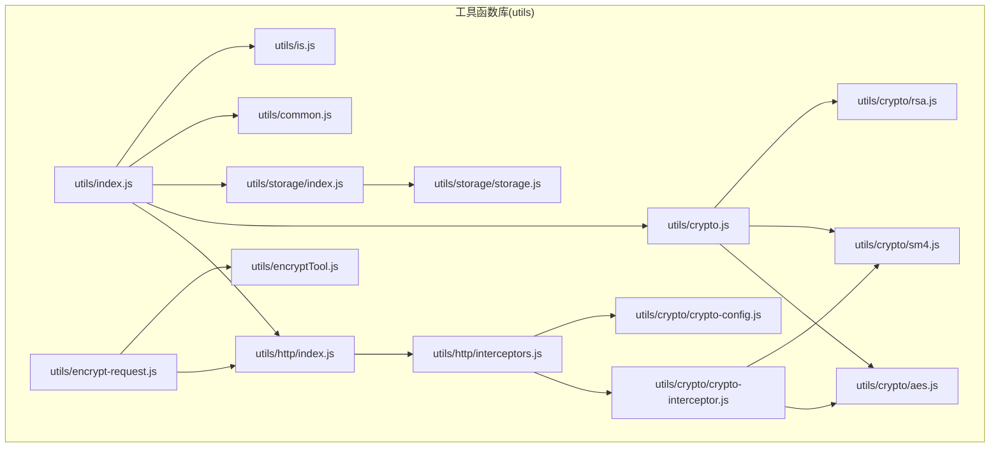
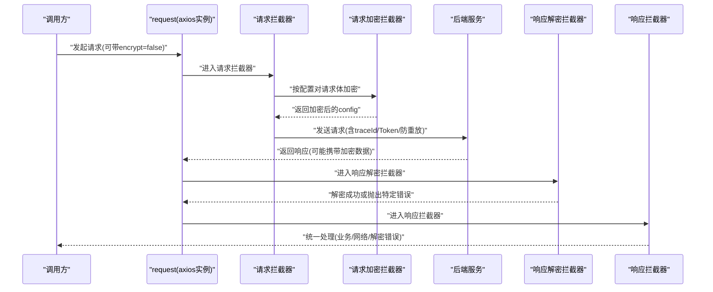
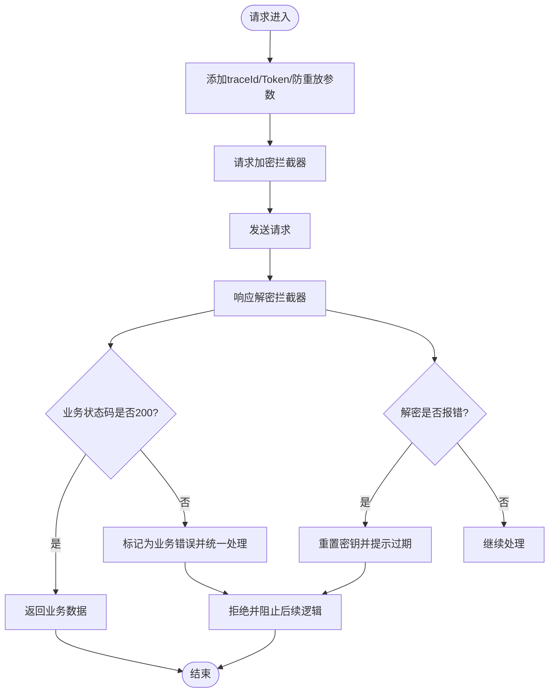
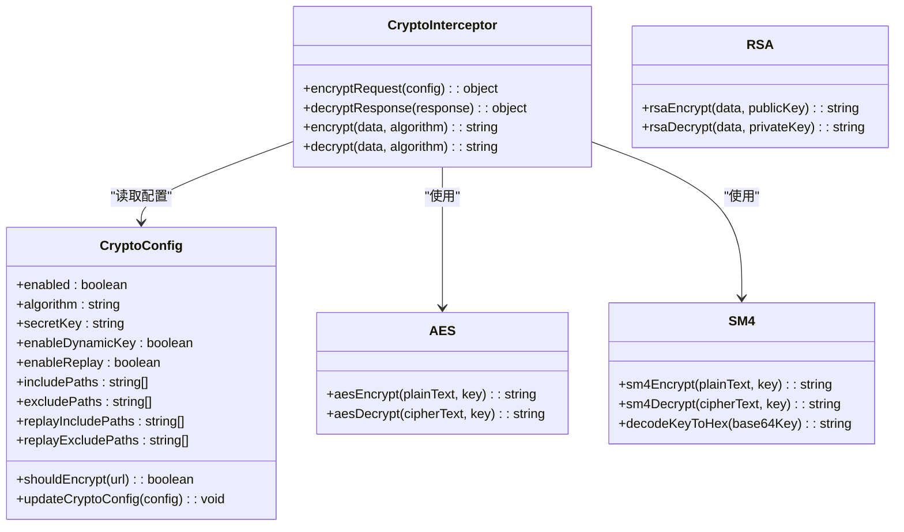
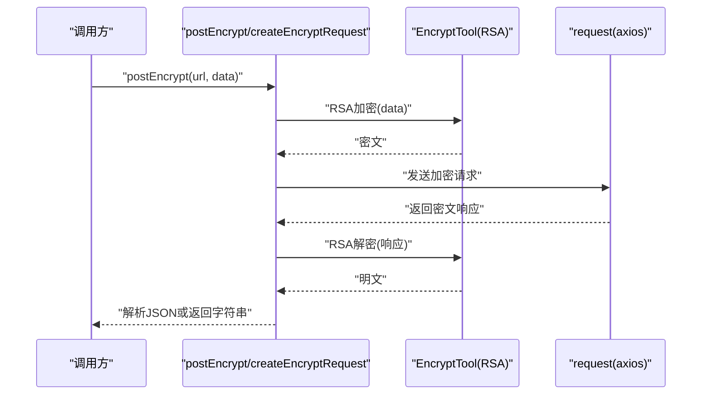
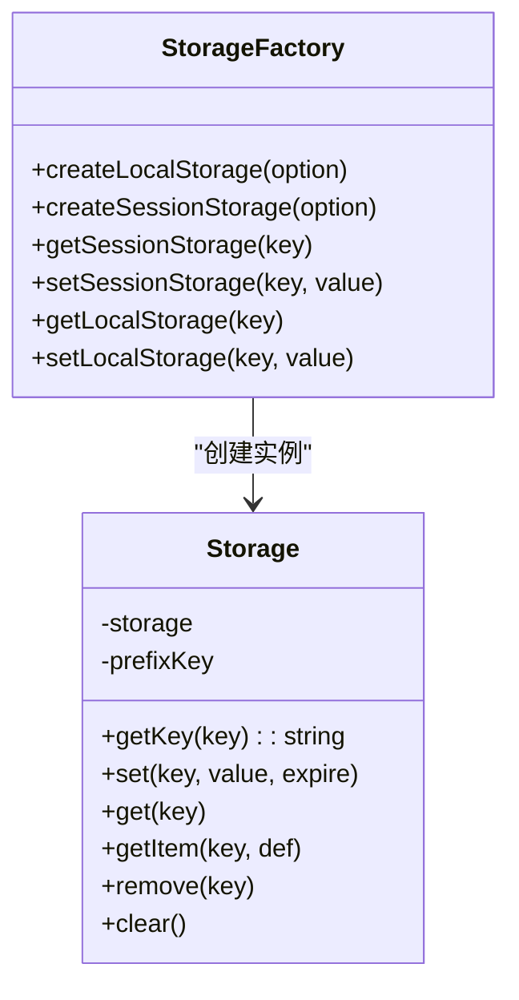
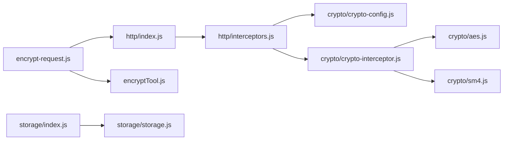

# 工具函数库

<cite>
**本文引用的文件**
- [utils/index.js](file://forge-admin-ui/src/utils/index.js)
- [utils/common.js](file://forge-admin-ui/src/utils/common.js)
- [utils/is.js](file://forge-admin-ui/src/utils/is.js)
- [utils/crypto.js](file://forge-admin-ui/src/utils/crypto.js)
- [utils/crypto/crypto-interceptor.js](file://forge-admin-ui/src/utils/crypto/crypto-interceptor.js)
- [utils/crypto/crypto-config.js](file://forge-admin-ui/src/utils/crypto/crypto-config.js)
- [utils/crypto/aes.js](file://forge-admin-ui/src/utils/crypto/aes.js)
- [utils/crypto/sm4.js](file://forge-admin-ui/src/utils/crypto/sm4.js)
- [utils/crypto/rsa.js](file://forge-admin-ui/src/utils/crypto/rsa.js)
- [utils/encryptTool.js](file://forge-admin-ui/src/utils/encryptTool.js)
- [utils/encrypt-request.js](file://forge-admin-ui/src/utils/encrypt-request.js)
- [utils/http/index.js](file://forge-admin-ui/src/utils/http/index.js)
- [utils/http/interceptors.js](file://forge-admin-ui/src/utils/http/interceptors.js)
- [utils/storage/index.js](file://forge-admin-ui/src/utils/storage/index.js)
- [utils/storage/storage.js](file://forge-admin-ui/src/utils/storage/storage.js)
</cite>

## 目录
1. [简介](#简介)
2. [项目结构](#项目结构)
3. [核心组件](#核心组件)
4. [架构总览](#架构总览)
5. [详细组件分析](#详细组件分析)
6. [依赖关系分析](#依赖关系分析)
7. [性能考量](#性能考量)
8. [故障排查指南](#故障排查指南)
9. [结论](#结论)
10. [附录](#附录)

## 简介
本文件系统性梳理 Forge 前端工具函数库，覆盖以下主题：
- HTTP 请求封装与拦截器：axios 实例创建、请求/响应拦截、统一错误处理、加密请求流程
- 加密解密工具：SM4/AES/RSA 算法封装、动态密钥与密钥交换、请求/响应加解密
- 存储管理工具：本地存储、会话存储、带过期时间的通用存储封装
- 公共工具函数：日期格式化、节流/防抖、UUID、尺寸监听、类型判断等
- 最佳实践与扩展指南：如何新增工具函数、如何优化性能与安全性

## 项目结构
工具函数库位于前端工程的 utils 目录，采用“按功能域分层”的组织方式：
- utils/index.js：统一导出所有工具模块，便于集中导入
- utils/http：HTTP 请求封装与拦截器
- utils/crypto：加密解密工具与配置
- utils/storage：本地/会话存储封装
- utils/common、utils/is：通用工具与类型判断
- utils/encrypt-request、utils/encryptTool：传统加密请求与通用加解密工具

图表来源
- [utils/index.js](file://forge-admin-ui/src/utils/index.js#L1-L13)
- [utils/http/index.js](file://forge-admin-ui/src/utils/http/index.js#L1-L26)
- [utils/http/interceptors.js](file://forge-admin-ui/src/utils/http/interceptors.js#L1-L165)
- [utils/crypto.js](file://forge-admin-ui/src/utils/crypto.js#L1-L120)
- [utils/crypto/crypto-config.js](file://forge-admin-ui/src/utils/crypto/crypto-config.js#L1-L79)
- [utils/crypto/crypto-interceptor.js](file://forge-admin-ui/src/utils/crypto/crypto-interceptor.js#L1-L132)
- [utils/crypto/aes.js](file://forge-admin-ui/src/utils/crypto/aes.js#L1-L44)
- [utils/crypto/sm4.js](file://forge-admin-ui/src/utils/crypto/sm4.js#L1-L65)
- [utils/crypto/rsa.js](file://forge-admin-ui/src/utils/crypto/rsa.js#L1-L38)
- [utils/encryptTool.js](file://forge-admin-ui/src/utils/encryptTool.js#L1-L92)
- [utils/encrypt-request.js](file://forge-admin-ui/src/utils/encrypt-request.js#L1-L56)
- [utils/storage/index.js](file://forge-admin-ui/src/utils/storage/index.js#L1-L66)
- [utils/storage/storage.js](file://forge-admin-ui/src/utils/storage/storage.js#L1-L59)

章节来源
- [utils/index.js](file://forge-admin-ui/src/utils/index.js#L1-L13)

## 核心组件
- HTTP 请求与拦截器
  - 创建 axios 实例，支持自定义 baseURL、超时等
  - 请求拦截：自动注入 traceId、Authorization、防重放参数、请求体加密
  - 响应拦截：统一解密、业务错误与网络错误分类处理、提示策略
- 加密解密工具
  - SM4/AES/RSA 算法封装；支持 Base64 密钥与 Hex 密钥转换
  - 动态密钥与密钥交换：通过配置控制是否启用、包含/排除路径
  - 请求/响应加解密拦截器：按路径规则选择性加密，失败时抛出特定错误
- 存储管理
  - 本地/会话存储工厂：带租户前缀，避免多系统冲突
  - 通用存储类：支持过期时间、JSON 序列化、异常兜底
- 公共工具
  - 日期格式化、节流/防抖、sleep、ResizeObserver、UUID、类型判断、URL/外部链接判断等

章节来源
- [utils/http/index.js](file://forge-admin-ui/src/utils/http/index.js#L1-L26)
- [utils/http/interceptors.js](file://forge-admin-ui/src/utils/http/interceptors.js#L1-L165)
- [utils/crypto.js](file://forge-admin-ui/src/utils/crypto.js#L1-L120)
- [utils/crypto/crypto-interceptor.js](file://forge-admin-ui/src/utils/crypto/crypto-interceptor.js#L1-L132)
- [utils/crypto/crypto-config.js](file://forge-admin-ui/src/utils/crypto/crypto-config.js#L1-L79)
- [utils/crypto/aes.js](file://forge-admin-ui/src/utils/crypto/aes.js#L1-L44)
- [utils/crypto/sm4.js](file://forge-admin-ui/src/utils/crypto/sm4.js#L1-L65)
- [utils/crypto/rsa.js](file://forge-admin-ui/src/utils/crypto/rsa.js#L1-L38)
- [utils/storage/index.js](file://forge-admin-ui/src/utils/storage/index.js#L1-L66)
- [utils/storage/storage.js](file://forge-admin-ui/src/utils/storage/storage.js#L1-L59)
- [utils/common.js](file://forge-admin-ui/src/utils/common.js#L1-L116)
- [utils/is.js](file://forge-admin-ui/src/utils/is.js#L1-L120)

## 架构总览
下图展示从前端发起请求到后端响应的整体链路，包括加密配置、请求加密、响应解密与统一错误处理。

图表来源
- [utils/http/index.js](file://forge-admin-ui/src/utils/http/index.js#L1-L26)
- [utils/http/interceptors.js](file://forge-admin-ui/src/utils/http/interceptors.js#L118-L165)
- [utils/crypto/crypto-interceptor.js](file://forge-admin-ui/src/utils/crypto/crypto-interceptor.js#L65-L132)
- [utils/crypto/crypto-config.js](file://forge-admin-ui/src/utils/crypto/crypto-config.js#L44-L70)

## 详细组件分析

### HTTP 请求封装与拦截器
- axios 实例创建
  - 默认配置：baseURL 来源于环境变量，超时 12s
  - 提供 request/noPrefixRequest/mockRequest 三种实例
- 请求拦截器
  - 注入 traceId、Authorization、防重放参数（时间戳与随机数）
  - 按配置对请求体进行加密
- 响应拦截器
  - 先尝试解密响应，再根据 code 判定业务成功/失败
  - 对解密错误进行特殊处理（如密钥过期），并阻止后续逻辑
  - 统一错误处理：区分业务错误与网络错误，支持提示策略

图表来源
- [utils/http/interceptors.js](file://forge-admin-ui/src/utils/http/interceptors.js#L118-L165)
- [utils/crypto/crypto-interceptor.js](file://forge-admin-ui/src/utils/crypto/crypto-interceptor.js#L65-L132)

章节来源
- [utils/http/index.js](file://forge-admin-ui/src/utils/http/index.js#L1-L26)
- [utils/http/interceptors.js](file://forge-admin-ui/src/utils/http/interceptors.js#L1-L165)

### 加密解密工具与配置
- 加密配置
  - enabled：是否启用加密
  - algorithm：SM4/AES
  - secretKey：Base64 密钥（动态密钥模式下由密钥交换服务设置）
  - enableDynamicKey、enableReplay：动态密钥与防重放开关
  - includePaths/excludePaths、replayIncludePaths/replayExcludePaths：路径规则（支持通配符）
- 请求/响应加解密
  - encryptRequest：对请求体进行 SM4/AES 加密，失败时记录日志
  - decryptResponse：对响应体进行 SM4/AES 解密，若因填充/密钥问题失败，抛出特定错误
- 算法实现
  - AES：ECB/PKCS7
  - SM4：基于 hex/Base64 的编解码转换
  - RSA：基于 jsencrypt-ext 的公钥加密与私钥解密

图表来源
- [utils/crypto/crypto-config.js](file://forge-admin-ui/src/utils/crypto/crypto-config.js#L1-L79)
- [utils/crypto/crypto-interceptor.js](file://forge-admin-ui/src/utils/crypto/crypto-interceptor.js#L1-L132)
- [utils/crypto/aes.js](file://forge-admin-ui/src/utils/crypto/aes.js#L1-L44)
- [utils/crypto/sm4.js](file://forge-admin-ui/src/utils/crypto/sm4.js#L1-L65)
- [utils/crypto/rsa.js](file://forge-admin-ui/src/utils/crypto/rsa.js#L1-L38)

章节来源
- [utils/crypto.js](file://forge-admin-ui/src/utils/crypto.js#L1-L120)
- [utils/crypto/crypto-config.js](file://forge-admin-ui/src/utils/crypto/crypto-config.js#L1-L79)
- [utils/crypto/crypto-interceptor.js](file://forge-admin-ui/src/utils/crypto/crypto-interceptor.js#L1-L132)
- [utils/crypto/aes.js](file://forge-admin-ui/src/utils/crypto/aes.js#L1-L44)
- [utils/crypto/sm4.js](file://forge-admin-ui/src/utils/crypto/sm4.js#L1-L65)
- [utils/crypto/rsa.js](file://forge-admin-ui/src/utils/crypto/rsa.js#L1-L38)

### 传统加密请求与通用加解密工具
- 传统加密请求
  - 以 RSA 对请求体进行加密，再通过 request 发送
  - 响应侧对密文进行 RSA 解密，支持 JSON 解析
- 通用加解密工具
  - 支持 RSA/AES/DES 的统一封装，内置密钥常量
  - 提供 encrypt/decrypt 统一入口

图表来源
- [utils/encrypt-request.js](file://forge-admin-ui/src/utils/encrypt-request.js#L1-L56)
- [utils/encryptTool.js](file://forge-admin-ui/src/utils/encryptTool.js#L1-L92)

章节来源
- [utils/encrypt-request.js](file://forge-admin-ui/src/utils/encrypt-request.js#L1-L56)
- [utils/encryptTool.js](file://forge-admin-ui/src/utils/encryptTool.js#L1-L92)

### 存储管理工具
- 存储工厂
  - createLocalStorage/createSessionStorage：基于 prefixKey 与 storage 实例创建
  - lStorage/sStorage：默认实例（带租户前缀）
- 通用存储类
  - Storage：封装 set/get/getItem/remove/clear
  - 支持过期时间：expire 单位秒，到期自动移除
  - 异常兜底：解析失败或过期时清理并返回默认值

图表来源
- [utils/storage/storage.js](file://forge-admin-ui/src/utils/storage/storage.js#L1-L59)
- [utils/storage/index.js](file://forge-admin-ui/src/utils/storage/index.js#L1-L66)

章节来源
- [utils/storage/index.js](file://forge-admin-ui/src/utils/storage/index.js#L1-L66)
- [utils/storage/storage.js](file://forge-admin-ui/src/utils/storage/storage.js#L1-L59)

### 公共工具函数
- 日期与格式化：formatDateTime/formatDate
- 函数节流/防抖：throttle/debounce
- 异步辅助：sleep
- 观察器：useResize
- 类型判断：is/isDef/isUndef/isNull/isArray/isObject/isString/isNumber/isBoolean/isDate/isRegExp/isFunction/isPromise/isElement/isWindow/isNullOrUndef/isNullOrWhitespace/isEmpty/ifNull/isUrl/isExternal
- 其他：canParseToJson/generateUUID

章节来源
- [utils/common.js](file://forge-admin-ui/src/utils/common.js#L1-L116)
- [utils/is.js](file://forge-admin-ui/src/utils/is.js#L1-L120)

## 依赖关系分析
- 模块耦合
  - http/interceptors 依赖 crypto/crypto-interceptor 与 crypto/crypto-config
  - encrypt-request 依赖 http/index 与 encryptTool
  - storage/index 依赖 storage/storage
- 外部依赖
  - axios、crypto-js、sm-crypto、jsencrypt-ext、dayjs、md5 等
- 可能的循环依赖
  - 当前结构清晰，无明显循环依赖迹象

图表来源
- [utils/http/index.js](file://forge-admin-ui/src/utils/http/index.js#L1-L26)
- [utils/http/interceptors.js](file://forge-admin-ui/src/utils/http/interceptors.js#L1-L165)
- [utils/crypto/crypto-interceptor.js](file://forge-admin-ui/src/utils/crypto/crypto-interceptor.js#L1-L132)
- [utils/crypto/crypto-config.js](file://forge-admin-ui/src/utils/crypto/crypto-config.js#L1-L79)
- [utils/encrypt-request.js](file://forge-admin-ui/src/utils/encrypt-request.js#L1-L56)
- [utils/encryptTool.js](file://forge-admin-ui/src/utils/encryptTool.js#L1-L92)
- [utils/storage/index.js](file://forge-admin-ui/src/utils/storage/index.js#L1-L66)
- [utils/storage/storage.js](file://forge-admin-ui/src/utils/storage/storage.js#L1-L59)

## 性能考量
- 请求拦截器中的加密/解密为 CPU 密集操作，建议：
  - 仅对必要接口启用加密（通过 includePaths/excludePaths 控制）
  - 合理设置超时时间，避免长时间阻塞
  - 对大对象请求体进行压缩或分片（视后端支持）
- 存储层
  - 避免频繁序列化/反序列化大对象，必要时拆分键
  - 利用过期时间减少无效数据占用
- 工具函数
  - 节流/防抖适用于高频事件（滚动、输入），合理设置等待时间
  - ResizeObserver 仅在需要时观察，及时释放

## 故障排查指南
- 解密失败/密钥过期
  - 现象：响应拦截器抛出特定错误，界面提示“安全会话已过期”
  - 处理：重置密钥交换，引导用户重新操作
- 网络错误
  - 现象：无 response，统一提示网络连接失败
  - 处理：检查网络、代理、跨域与后端可用性
- 业务错误
  - 现象：data.code 非 200，统一走业务错误处理
  - 处理：根据 code/message 提示用户或进行路由跳转
- 加密请求异常
  - 现象：RSA 加解密失败或 SM4/AES 解密填充错误
  - 处理：确认密钥格式、算法一致性与服务端密钥交换流程

章节来源
- [utils/http/interceptors.js](file://forge-admin-ui/src/utils/http/interceptors.js#L21-L110)
- [utils/crypto/crypto-interceptor.js](file://forge-admin-ui/src/utils/crypto/crypto-interceptor.js#L101-L129)

## 结论
该工具函数库围绕“安全、稳定、易用”设计：
- 通过配置化的加密策略与拦截器，实现透明的请求/响应加解密
- 以统一的错误处理机制提升用户体验与可观测性
- 以工厂与类封装提供一致的存储体验
- 以公共工具函数提升开发效率与代码质量

## 附录
- 扩展开发指南
  - 新增工具函数：在对应目录下新建文件，遵循现有命名与导出规范，优先考虑复用已有工具（如 is、common）
  - 新增加密算法：在 crypto 目录新增算法文件，完善配置与拦截器分支
  - 新增存储策略：在 storage 目录扩展，保持与现有 Storage 类一致的 API
- 最佳实践
  - 优先使用 request/noPrefixRequest/mockRequest，避免重复创建实例
  - 通过 crypto-config 精准控制加密范围，避免对静态资源与鉴权接口过度加密
  - 使用节流/防抖优化高频交互，使用过期存储降低内存占用
- 安全建议
  - 密钥管理：避免硬编码密钥，优先通过动态密钥交换获取
  - 防重放：开启 X-Timestamp 与 X-Nonce，严格控制排除路径
  - 日志与监控：对加密/解密异常进行告警，便于快速定位问题