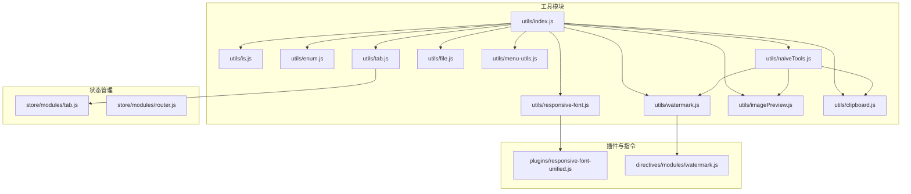
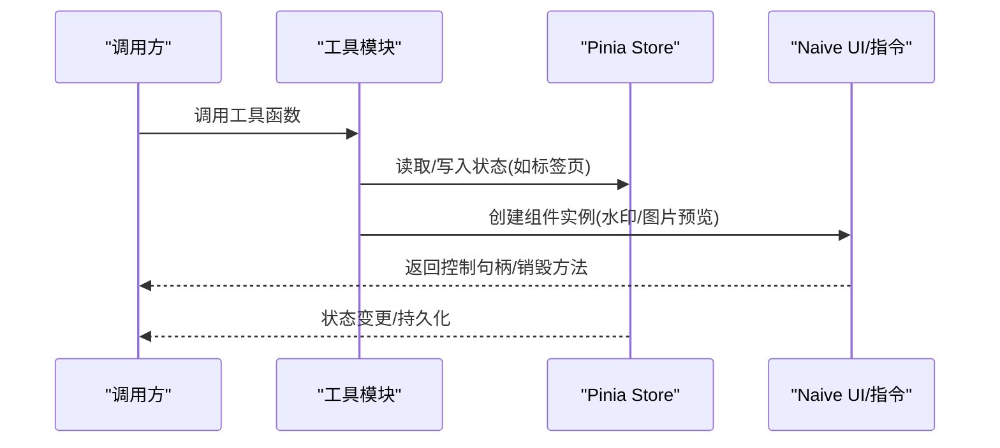
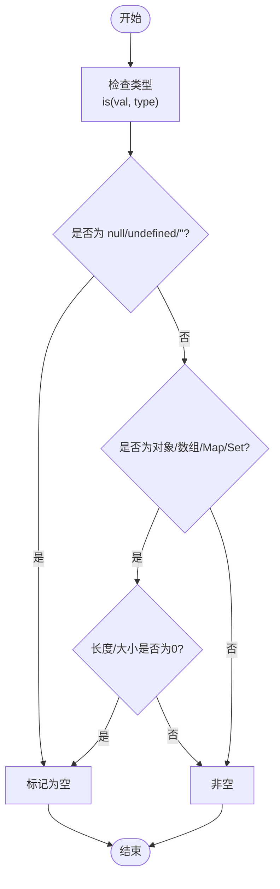
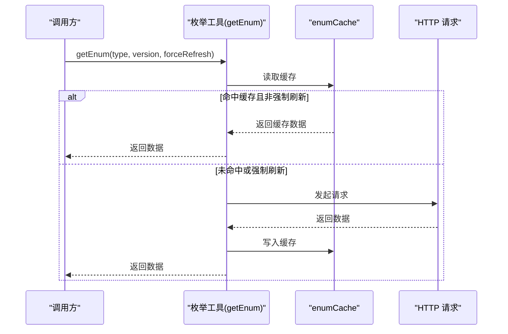
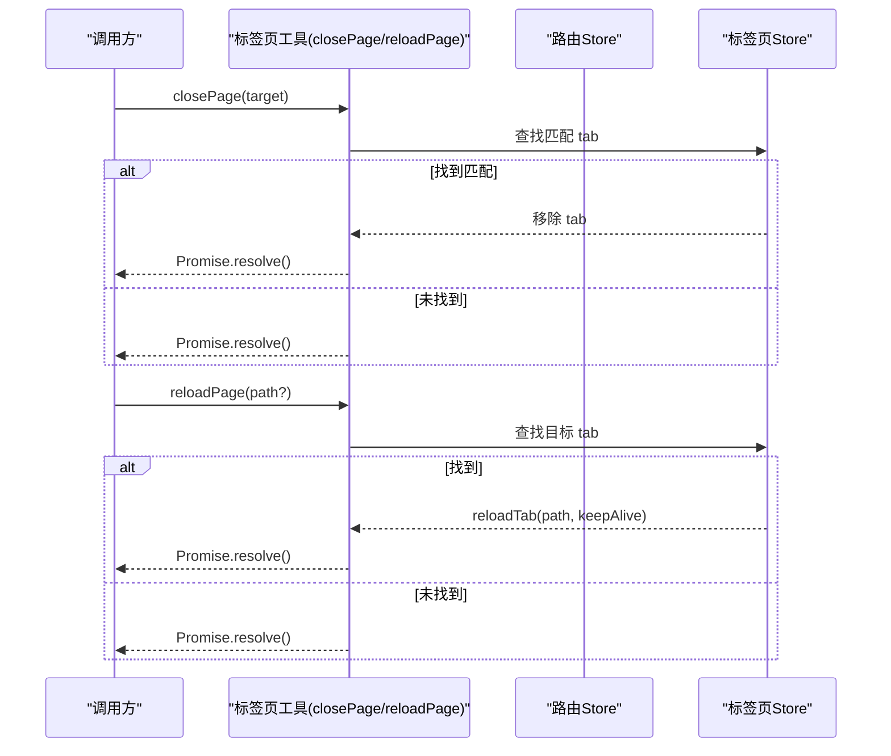
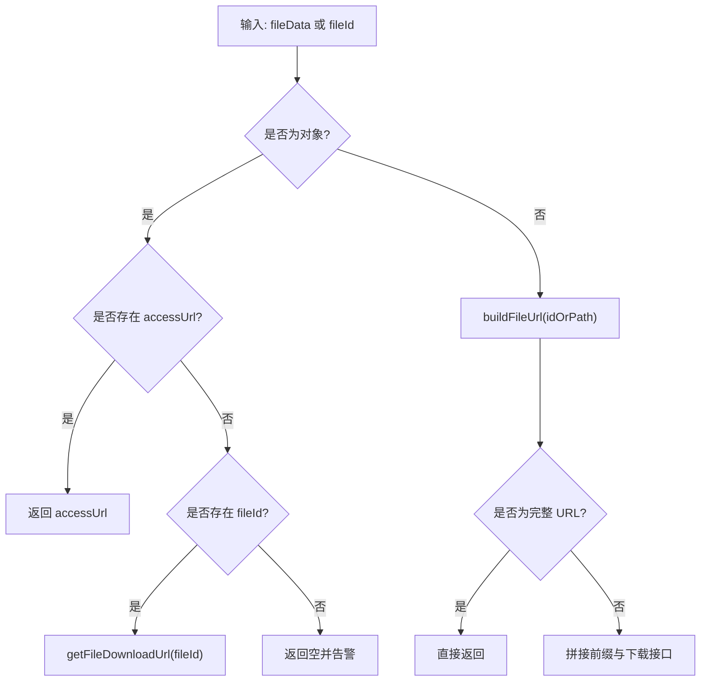
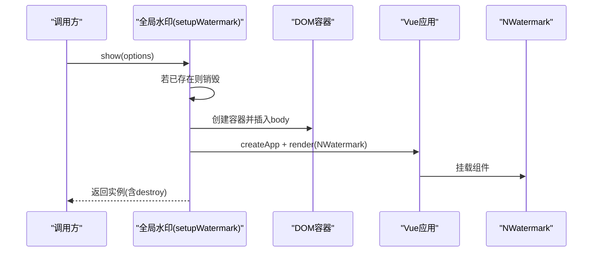
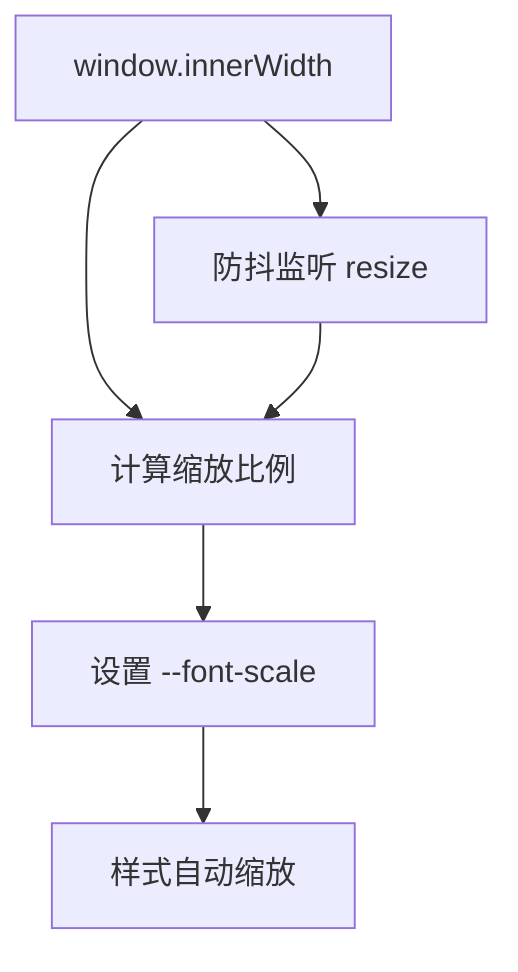
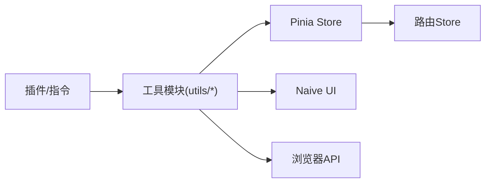

# 通用工具函数

<cite>
**本文引用的文件**
- [utils/index.js](file://forge-admin-ui/src/utils/index.js)
- [utils/common.js](file://forge-admin-ui/src/utils/common.js)
- [utils/is.js](file://forge-admin-ui/src/utils/is.js)
- [utils/enum.js](file://forge-admin-ui/src/utils/enum.js)
- [utils/tab.js](file://forge-admin-ui/src/utils/tab.js)
- [utils/file.js](file://forge-admin-ui/src/utils/file.js)
- [utils/watermark.js](file://forge-admin-ui/src/utils/watermark.js)
- [utils/responsive-font.js](file://forge-admin-ui/src/utils/responsive-font.js)
- [utils/menu-utils.js](file://forge-admin-ui/src/utils/menu-utils.js)
- [utils/imagePreview.js](file://forge-admin-ui/src/utils/imagePreview.js)
- [utils/clipboard.js](file://forge-admin-ui/src/utils/clipboard.js)
- [utils/naiveTools.js](file://forge-admin-ui/src/utils/naiveTools.js)
- [plugins/responsive-font-unified.js](file://forge-admin-ui/src/plugins/responsive-font-unified.js)
- [directives/modules/watermark.js](file://forge-admin-ui/src/directives/modules/watermark.js)
- [store/modules/tab.js](file://forge-admin-ui/src/store/modules/tab.js)
- [store/modules/router.js](file://forge-admin-ui/src/store/modules/router.js)
</cite>

## 目录
1. [简介](#简介)
2. [项目结构](#项目结构)
3. [核心组件](#核心组件)
4. [架构总览](#架构总览)
5. [详细组件分析](#详细组件分析)
6. [依赖分析](#依赖分析)
7. [性能考虑](#性能考虑)
8. [故障排查指南](#故障排查指南)
9. [结论](#结论)
10. [附录](#附录)

## 简介
本文件系统性梳理 Forge 前端工程中的通用工具函数与实用模块，覆盖以下主题：
- 数据类型判断与空值处理
- 枚举转换与缓存管理
- 标签页生命周期与导航控制
- 文件访问与图片预览
- 水印生成与指令封装
- 响应式字体适配与 UnoCSS 插件集成
- 菜单工具函数与图标渲染
- 剪贴板操作与全局离线 API 封装
- 设计模式、性能优化、兼容性策略
- 使用示例、扩展指南、测试与错误处理建议

## 项目结构
通用工具函数主要位于前端工程的工具目录，采用按功能域分组的组织方式：
- 工具入口聚合：统一导出各模块
- 业务工具：类型判断、枚举、标签页、文件、水印、响应式字体、菜单、图片预览、剪贴板、Naive UI 离线封装
- 插件与指令：UnoCSS 响应式字体插件、v-watermark 指令
- 状态管理：标签页 Store 与路由 Store

图表来源
- [utils/index.js](file://forge-admin-ui/src/utils/index.js#L1-L13)
- [utils/enum.js](file://forge-admin-ui/src/utils/enum.js#L1-L225)
- [utils/tab.js](file://forge-admin-ui/src/utils/tab.js#L1-L226)
- [utils/file.js](file://forge-admin-ui/src/utils/file.js#L1-L92)
- [utils/watermark.js](file://forge-admin-ui/src/utils/watermark.js#L1-L132)
- [utils/responsive-font.js](file://forge-admin-ui/src/utils/responsive-font.js#L1-L56)
- [utils/menu-utils.js](file://forge-admin-ui/src/utils/menu-utils.js#L1-L170)
- [utils/imagePreview.js](file://forge-admin-ui/src/utils/imagePreview.js#L1-L128)
- [utils/clipboard.js](file://forge-admin-ui/src/utils/clipboard.js#L1-L67)
- [utils/naiveTools.js](file://forge-admin-ui/src/utils/naiveTools.js#L1-L156)
- [plugins/responsive-font-unified.js](file://forge-admin-ui/src/plugins/responsive-font-unified.js#L1-L149)
- [directives/modules/watermark.js](file://forge-admin-ui/src/directives/modules/watermark.js#L1-L129)
- [store/modules/tab.js](file://forge-admin-ui/src/store/modules/tab.js#L1-L174)
- [store/modules/router.js](file://forge-admin-ui/src/store/modules/router.js#L1-L19)

章节来源
- [utils/index.js](file://forge-admin-ui/src/utils/index.js#L1-L13)

## 核心组件
- 数据类型判断与空值处理：提供严格类型判断、空值检测、URL/外部链接识别、客户端/服务端环境判断等基础能力
- 枚举管理：统一获取、批量获取、缓存、查询标签/值映射、清理缓存
- 标签页工具：关闭单个/多个、关闭其他/左右、刷新、关闭全部、路径匹配与前缀匹配
- 文件工具：统一构建访问/下载 URL、图片预览 URL（含缩略图参数）
- 水印工具：全局水印与指令水印，支持文本/图片、尺寸/间距/旋转/层级/可选
- 响应式字体：基于 CSS 变量与窗口监听，结合 UnoCSS 预设实现自动缩放
- 菜单工具：菜单数据扁平化、图标渲染、活跃菜单查找、菜单项检索
- 图片预览：基于 Naive UI ImageGroup 的轻量预览，支持单张/多张与初始索引
- 剪贴板：现代 Clipboard API 优先，回退 execCommand，统一全局封装
- Naive UI 离线封装：全局 discrete API 注入，消息、对话框、通知、加载条、复制、图片预览、水印、首页路径

章节来源
- [utils/is.js](file://forge-admin-ui/src/utils/is.js#L1-L120)
- [utils/enum.js](file://forge-admin-ui/src/utils/enum.js#L1-L225)
- [utils/tab.js](file://forge-admin-ui/src/utils/tab.js#L1-L226)
- [utils/file.js](file://forge-admin-ui/src/utils/file.js#L1-L92)
- [utils/watermark.js](file://forge-admin-ui/src/utils/watermark.js#L1-L132)
- [utils/responsive-font.js](file://forge-admin-ui/src/utils/responsive-font.js#L1-L56)
- [utils/menu-utils.js](file://forge-admin-ui/src/utils/menu-utils.js#L1-L170)
- [utils/imagePreview.js](file://forge-admin-ui/src/utils/imagePreview.js#L1-L128)
- [utils/clipboard.js](file://forge-admin-ui/src/utils/clipboard.js#L1-L67)
- [utils/naiveTools.js](file://forge-admin-ui/src/utils/naiveTools.js#L1-L156)

## 架构总览
通用工具函数围绕“单一职责、组合复用”的设计原则构建，通过统一入口导出，配合 Pinia Store 与指令/插件扩展，形成从底层工具到上层 UI 的完整链路。

图表来源
- [utils/tab.js](file://forge-admin-ui/src/utils/tab.js#L1-L226)
- [store/modules/tab.js](file://forge-admin-ui/src/store/modules/tab.js#L1-L174)
- [utils/watermark.js](file://forge-admin-ui/src/utils/watermark.js#L1-L132)
- [utils/imagePreview.js](file://forge-admin-ui/src/utils/imagePreview.js#L1-L128)
- [utils/naiveTools.js](file://forge-admin-ui/src/utils/naiveTools.js#L1-L156)

## 详细组件分析

### 数据类型判断与空值处理
- 设计要点
  - 基于 Object.prototype.toString 的严格类型判断
  - 空值/空集合/空字符串/空白字符的统一处理
  - URL/外部链接正则校验
  - 客户端/服务端环境探测
- 性能与兼容
  - O(1) 类型判断；空值检测对数组/Map/Set/Object 分支处理
  - 正则表达式用于 URL 校验，避免额外依赖
- 使用建议
  - 优先使用 isNull/isUndef/isNullOrWhitespace 进行输入校验
  - 使用 ifNull 提供默认值，减少分支判断

图表来源
- [utils/is.js](file://forge-admin-ui/src/utils/is.js#L1-L120)

章节来源
- [utils/is.js](file://forge-admin-ui/src/utils/is.js#L1-L120)

### 枚举转换与缓存管理
- 功能特性
  - 支持 v1/v2 两套接口，自动格式化为统一结构
  - 内置响应式缓存，支持强制刷新、批量获取、清空缓存
  - 提供 label/value 查询与缓存状态检查
- 错误处理
  - 请求异常时记录错误并返回空数组，避免重复请求
  - 空结果也缓存空数组，防止重复拉取
- 使用示例
  - 单个枚举：getEnum('USER_CERT', 'v1', false)
  - 批量枚举：batchGetEnum([{ type: 'USER_CERT', version: 'v1' }, 'USER_EDU'])
  - 查询标签：getEnumLabel('USER_CERT', '1')

图表来源
- [utils/enum.js](file://forge-admin-ui/src/utils/enum.js#L35-L81)

章节来源
- [utils/enum.js](file://forge-admin-ui/src/utils/enum.js#L1-L225)

### 标签页管理
- 能力范围
  - 关闭单个/多个、关闭其他/左右、关闭全部、刷新当前/指定
  - 路径精确匹配与前缀匹配，支持带查询参数的页面
  - 与 Pinia Tab Store 协作，持久化到 sessionStorage
- 设计模式
  - 函数式 API：对外暴露纯函数，内部通过 Store 访问路由与状态
  - Promise 化：所有操作返回 Promise，便于链式调用
- 典型流程
  - 关闭当前页：根据当前路由定位 tab，removeTab 并跳转
  - 关闭多个：map + Promise.all 并行关闭
  - 刷新：reloadTab 支持 keepAlive 场景的临时移除与恢复

图表来源
- [utils/tab.js](file://forge-admin-ui/src/utils/tab.js#L36-L158)
- [store/modules/tab.js](file://forge-admin-ui/src/store/modules/tab.js#L1-L174)
- [store/modules/router.js](file://forge-admin-ui/src/store/modules/router.js#L1-L19)

章节来源
- [utils/tab.js](file://forge-admin-ui/src/utils/tab.js#L1-L226)
- [store/modules/tab.js](file://forge-admin-ui/src/store/modules/tab.js#L1-L174)
- [store/modules/router.js](file://forge-admin-ui/src/store/modules/router.js#L1-L19)

### 文件处理与图片预览
- 文件 URL 生成
  - 支持字符串 fileId、对象 accessUrl/fileId/filePath
  - 自动拼接 VITE_REQUEST_PREFIX 与下载接口
- 图片预览 URL
  - 在基础 URL 上追加 width/height/mode 参数
- 图片预览
  - 基于 Naive UI NImageGroup/NImage
  - 通过隐藏元素触发点击，自动关闭后清理 DOM

图表来源
- [utils/file.js](file://forge-admin-ui/src/utils/file.js#L12-L54)

章节来源
- [utils/file.js](file://forge-admin-ui/src/utils/file.js#L1-L92)
- [utils/imagePreview.js](file://forge-admin-ui/src/utils/imagePreview.js#L1-L128)

### 水印生成与指令封装
- 全局水印
  - createWatermark：创建固定容器，挂载 NWatermark，返回 destroy 方法
  - setupWatermark：全局 show/hide/update，单例管理
- 指令水印
  - v-watermark：为元素添加相对定位水印，WeakMap 管理实例，支持字符串/对象配置
  - 自动销毁与更新，避免内存泄漏

图表来源
- [utils/watermark.js](file://forge-admin-ui/src/utils/watermark.js#L25-L86)
- [directives/modules/watermark.js](file://forge-admin-ui/src/directives/modules/watermark.js#L24-L96)

章节来源
- [utils/watermark.js](file://forge-admin-ui/src/utils/watermark.js#L1-L132)
- [directives/modules/watermark.js](file://forge-admin-ui/src/directives/modules/watermark.js#L1-L129)

### 响应式字体适配与 UnoCSS 插件
- 前端逻辑
  - 计算字体缩放比例，设置 --font-scale CSS 变量
  - 防抖监听窗口 resize，动态更新缩放
- UnoCSS 插件
  - 预设静态规则与动态规则，统一 text-* / leading-* 响应式尺寸
  - 提供快捷短名，如 responsive-h1/responsive-text 等

图表来源
- [utils/responsive-font.js](file://forge-admin-ui/src/utils/responsive-font.js#L10-L30)
- [plugins/responsive-font-unified.js](file://forge-admin-ui/src/plugins/responsive-font-unified.js#L8-L146)

章节来源
- [utils/responsive-font.js](file://forge-admin-ui/src/utils/responsive-font.js#L1-L56)
- [plugins/responsive-font-unified.js](file://forge-admin-ui/src/plugins/responsive-font-unified.js#L1-L149)

### 菜单工具函数
- 功能点
  - 生成唯一 ID、处理顶级菜单、扁平化菜单、图标渲染、活跃菜单查找、菜单项检索
- 设计要点
  - 递归处理子菜单，确保每项具备唯一 key/label/icon/path
  - IconRenderer 统一图标渲染，支持字符串与函数两种形态

章节来源
- [utils/menu-utils.js](file://forge-admin-ui/src/utils/menu-utils.js#L1-L170)

### 剪贴板操作
- 兼容策略
  - 优先使用 navigator.clipboard（需安全上下文）
  - 回退至 textarea + execCommand
- 全局封装
  - setupMessage 提供统一消息提示
  - $copy 暴露全局复制方法，带成功/失败提示

章节来源
- [utils/clipboard.js](file://forge-admin-ui/src/utils/clipboard.js#L1-L67)
- [utils/naiveTools.js](file://forge-admin-ui/src/utils/naiveTools.js#L1-L156)

## 依赖分析
- 模块耦合
  - 工具模块之间低耦合，通过统一入口导出
  - 标签页工具依赖 Pinia Store 与路由 Store
  - Naive UI 离线封装集中注入全局 API
- 外部依赖
  - dayjs、naive-ui、unocss
  - 浏览器原生 API：Clipboard、ResizeObserver、MutationObserver

图表来源
- [utils/naiveTools.js](file://forge-admin-ui/src/utils/naiveTools.js#L101-L121)
- [store/modules/tab.js](file://forge-admin-ui/src/store/modules/tab.js#L1-L174)
- [plugins/responsive-font-unified.js](file://forge-admin-ui/src/plugins/responsive-font-unified.js#L1-L149)

章节来源
- [utils/naiveTools.js](file://forge-admin-ui/src/utils/naiveTools.js#L1-L156)
- [store/modules/tab.js](file://forge-admin-ui/src/store/modules/tab.js#L1-L174)

## 性能考虑
- 防抖与节流
  - 窗口 resize 使用防抖，降低频繁计算
  - 高频交互场景建议使用 throttle/debounce
- 缓存策略
  - 枚举缓存避免重复请求；空结果也缓存，减少网络波动影响
  - 标签页持久化到 sessionStorage，提升体验
- DOM 与实例管理
  - 水印与图片预览在销毁时及时卸载与清理，避免内存泄漏
- CSS 变量与 UnoCSS
  - 通过 CSS 变量与预设规则减少运行时计算，提升渲染性能

## 故障排查指南
- 枚举获取失败
  - 检查接口返回格式与版本参数；确认缓存是否被错误清空
  - 使用 hasEnumCache 检查缓存状态
- 标签页关闭无效
  - 确认传入路径是否与 tab.path 精确匹配或前缀匹配
  - 检查路由是否可用与 currentRoute 是否存在
- 水印不显示
  - 全屏水印需保证容器插入 body；指令水印需确保元素定位上下文
  - 检查 zIndex 与 pointer-events 配置
- 响应式字体不生效
  - 确认 initResponsiveFont 已调用且 CSS 变量设置成功
  - UnoCSS 预设是否正确引入
- 剪贴板失败
  - 确认 isSecureContext（HTTPS + 同源）；检查浏览器兼容性

章节来源
- [utils/enum.js](file://forge-admin-ui/src/utils/enum.js#L76-L80)
- [utils/tab.js](file://forge-admin-ui/src/utils/tab.js#L40-L76)
- [utils/watermark.js](file://forge-admin-ui/src/utils/watermark.js#L42-L53)
- [utils/responsive-font.js](file://forge-admin-ui/src/utils/responsive-font.js#L44-L54)
- [utils/clipboard.js](file://forge-admin-ui/src/utils/clipboard.js#L10-L41)

## 结论
本通用工具集以“可组合、可扩展、可维护”为目标，覆盖从前端基础能力到业务常用工具的完整链路。通过统一入口导出、Pinia Store 协作、指令与插件扩展，以及完善的错误处理与性能优化策略，能够有效提升开发效率与用户体验。

## 附录
- 使用示例与最佳实践
  - 枚举：优先使用 getEnum，必要时批量获取；通过 getEnumLabel/getEnumValue 做双向映射
  - 标签页：关闭多个使用 Promise.all；刷新时注意 keepAlive 场景
  - 文件：优先使用对象传参，确保 accessUrl/fileId 至少一项
  - 水印：全局水印用于全站保护，指令水印用于局部区域
  - 响应式字体：在应用启动时初始化，结合 UnoCSS 快捷类使用
  - 菜单：统一使用 processMenuData 处理，确保唯一 key 与图标渲染
  - 剪贴板：优先使用全局 $copy，失败时提供兜底提示
- 扩展开发指南
  - 新增工具函数遵循单一职责，尽量无副作用
  - 对外暴露清晰的参数与返回值，提供必要的类型注释
  - 对可能失败的操作提供错误日志与兜底行为
  - 对高频操作进行防抖/节流或缓存优化
- 测试方法
  - 单元测试：针对纯函数（如 is.js、enum.js）编写边界用例
  - 集成测试：模拟 Store 与指令环境，验证标签页/水印/预览流程
  - 兼容性测试：在不同浏览器与 HTTPS/HTTP 环境下验证剪贴板与水印行为
- 版本兼容性说明
  - Clipboard API 需要安全上下文；低版本浏览器回退 execCommand
  - ResizeObserver/MutationObserver 在现代浏览器中广泛支持
  - UnoCSS 预设需与构建工具版本兼容