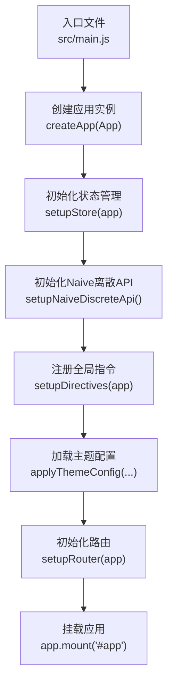
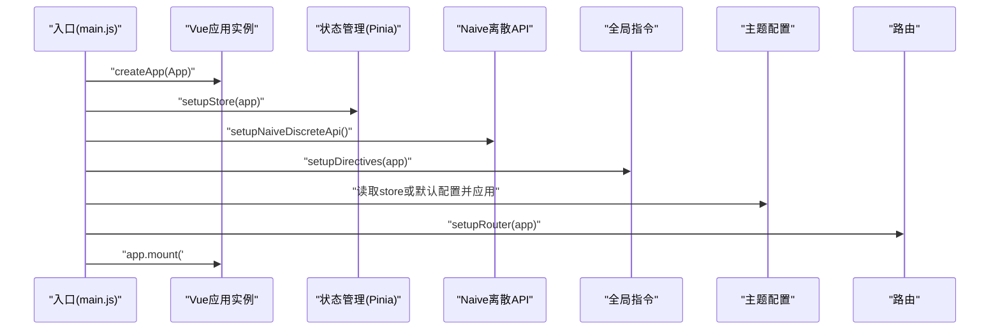
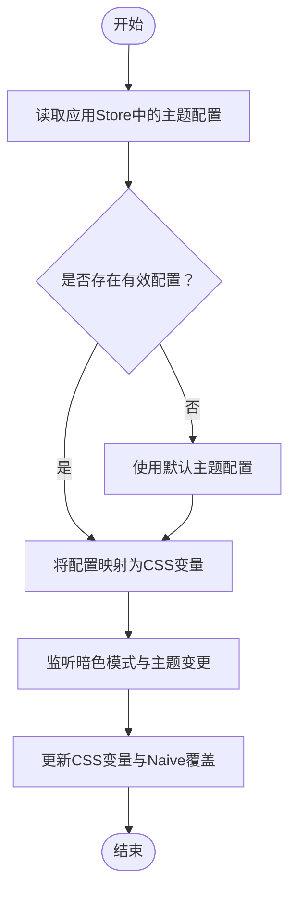
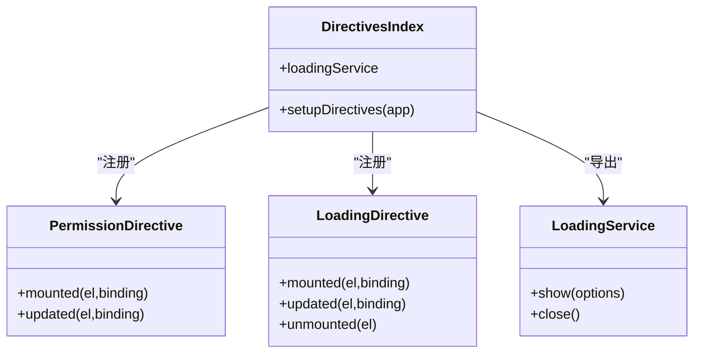
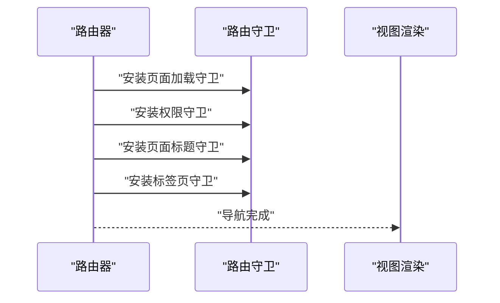
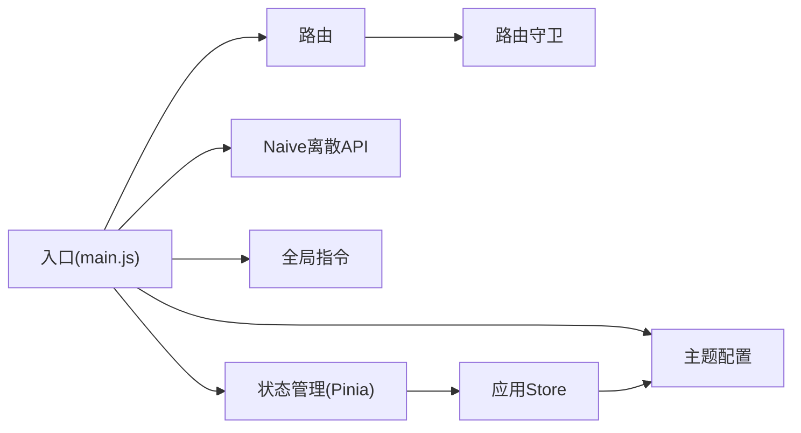

# 应用入口与初始化

<cite>
**本文档引用的文件**
- [main.js](file://forge-admin-ui/src/main.js)
- [store/index.js](file://forge-admin-ui/src/store/index.js)
- [router/index.js](file://forge-admin-ui/src/router/index.js)
- [directives/index.js](file://forge-admin-ui/src/directives/index.js)
- [config/theme.config.js](file://forge-admin-ui/src/config/theme.config.js)
- [store/modules/app.js](file://forge-admin-ui/src/store/modules/app.js)
- [router/guards/index.js](file://forge-admin-ui/src/router/guards/index.js)
- [utils/naiveTools.js](file://forge-admin-ui/src/utils/naiveTools.js)
- [styles/theme.css](file://forge-admin-ui/src/styles/theme.css)
- [App.vue](file://forge-admin-ui/src/App.vue)
- [settings.js](file://forge-admin-ui/src/settings.js)
- [vite.config.js](file://forge-admin-ui/vite.config.js)
- [package.json](file://forge-admin-ui/package.json)
</cite>

## 目录
1. [简介](#简介)
2. [项目结构](#项目结构)
3. [核心组件](#核心组件)
4. [架构总览](#架构总览)
5. [详细组件分析](#详细组件分析)
6. [依赖关系分析](#依赖关系分析)
7. [性能考虑](#性能考虑)
8. [故障排查指南](#故障排查指南)
9. [结论](#结论)
10. [附录](#附录)

## 简介
本文件聚焦Forge前端应用入口的技术文档，围绕应用初始化流程展开，重点解析main.js中的初始化步骤、setupStore、setupRouter、setupDirectives等初始化函数的作用与执行顺序；详解主题配置加载机制与样式系统初始化过程；并提供启动性能优化建议与错误处理策略，同时给出扩展应用初始化逻辑的实际示例路径。

## 项目结构
Forge前端采用Vite+Vue3+Naive UI生态，入口位于src/main.js，通过异步引导函数bootstrap串起应用初始化主流程。核心初始化顺序如下：
- 创建Vue应用实例
- 初始化Pinia状态管理（setupStore）
- 初始化Naive UI离散API（setupNaiveDiscreteApi）
- 注册全局指令（setupDirectives）
- 加载主题配置（读取store或默认配置，应用到CSS变量）
- 初始化路由（setupRouter）
- 挂载应用

图表来源
- [main.js](file://forge-admin-ui/src/main.js#L15-L34)

章节来源
- [main.js](file://forge-admin-ui/src/main.js#L1-L37)
- [vite.config.js](file://forge-admin-ui/vite.config.js#L1-L86)

## 核心组件
- 应用入口与引导
  - 文件路径：[main.js](file://forge-admin-ui/src/main.js#L15-L34)
  - 职责：统一编排应用初始化流程，保证依赖顺序正确，如先初始化Store再初始化Naive离散API，再注册指令，最后初始化路由。
- 状态管理初始化
  - 文件路径：[store/index.js](file://forge-admin-ui/src/store/index.js#L4-L8)
  - 职责：创建Pinia实例并启用持久化插件，注入到应用。
- 路由初始化
  - 文件路径：[router/index.js](file://forge-admin-ui/src/router/index.js#L14-L17)
  - 职责：创建路由器并注册路由守卫。
- 全局指令初始化
  - 文件路径：[directives/index.js](file://forge-admin-ui/src/directives/index.js#L19-L34)
  - 职责：注册权限、加载、复制、预览、水印等指令，并将全局loading服务挂载到全局属性。
- 主题配置与样式系统
  - 文件路径：[config/theme.config.js](file://forge-admin-ui/src/config/theme.config.js#L105-L163)
  - 职责：将主题配置映射为CSS变量，驱动样式系统。
  - 文件路径：[styles/theme.css](file://forge-admin-ui/src/styles/theme.css#L6-L50)
  - 职责：以CSS变量为基础，定义各组件样式。
  - 文件路径：[store/modules/app.js](file://forge-admin-ui/src/store/modules/app.js#L50-L73)
  - 职责：维护主题配置与暗色模式状态，提供更新接口。
- Naive UI离散API初始化
  - 文件路径：[utils/naiveTools.js](file://forge-admin-ui/src/utils/naiveTools.js#L101-L121)
  - 职责：基于应用主题与覆盖配置创建离散API，挂载到window全局。
- 应用根组件与布局
  - 文件路径：[App.vue](file://forge-admin-ui/src/App.vue#L1-L29)
  - 职责：配置Naive UI主题与语言环境，按路由动态加载布局组件，控制加载态与KeepAlive缓存。

章节来源
- [main.js](file://forge-admin-ui/src/main.js#L15-L34)
- [store/index.js](file://forge-admin-ui/src/store/index.js#L4-L8)
- [router/index.js](file://forge-admin-ui/src/router/index.js#L14-L17)
- [directives/index.js](file://forge-admin-ui/src/directives/index.js#L19-L34)
- [config/theme.config.js](file://forge-admin-ui/src/config/theme.config.js#L105-L163)
- [styles/theme.css](file://forge-admin-ui/src/styles/theme.css#L6-L50)
- [store/modules/app.js](file://forge-admin-ui/src/store/modules/app.js#L50-L73)
- [utils/naiveTools.js](file://forge-admin-ui/src/utils/naiveTools.js#L101-L121)
- [App.vue](file://forge-admin-ui/src/App.vue#L1-L29)

## 架构总览
应用初始化的时序如下：

图表来源
- [main.js](file://forge-admin-ui/src/main.js#L15-L34)
- [store/index.js](file://forge-admin-ui/src/store/index.js#L4-L8)
- [utils/naiveTools.js](file://forge-admin-ui/src/utils/naiveTools.js#L101-L121)
- [directives/index.js](file://forge-admin-ui/src/directives/index.js#L19-L34)
- [config/theme.config.js](file://forge-admin-ui/src/config/theme.config.js#L105-L163)
- [router/index.js](file://forge-admin-ui/src/router/index.js#L14-L17)

## 详细组件分析

### 应用初始化流程与执行顺序
- 初始化顺序要点
  - 必须先初始化Store，因为后续的setupNaiveDiscreteApi需要读取应用主题与覆盖配置。
  - Naive离散API需在指令注册之前完成，确保$loading等全局能力可用。
  - 主题配置应在路由初始化之前应用，保证路由切换时样式一致。
  - 最后初始化路由并挂载应用。
- 关键路径参考
  - [入口引导函数](file://forge-admin-ui/src/main.js#L15-L34)
  - [Store初始化](file://forge-admin-ui/src/store/index.js#L4-L8)
  - [Naive离散API初始化](file://forge-admin-ui/src/utils/naiveTools.js#L101-L121)
  - [指令注册](file://forge-admin-ui/src/directives/index.js#L19-L34)
  - [主题配置应用](file://forge-admin-ui/src/config/theme.config.js#L105-L163)
  - [路由初始化](file://forge-admin-ui/src/router/index.js#L14-L17)

章节来源
- [main.js](file://forge-admin-ui/src/main.js#L15-L34)
- [store/index.js](file://forge-admin-ui/src/store/index.js#L4-L8)
- [utils/naiveTools.js](file://forge-admin-ui/src/utils/naiveTools.js#L101-L121)
- [directives/index.js](file://forge-admin-ui/src/directives/index.js#L19-L34)
- [config/theme.config.js](file://forge-admin-ui/src/config/theme.config.js#L105-L163)
- [router/index.js](file://forge-admin-ui/src/router/index.js#L14-L17)

### 主题配置加载机制与样式系统
- 主题配置来源
  - 优先从应用Store中读取，若为空则回退到默认配置。
  - Store内部维护默认主题配置与暗色模式状态，并提供更新接口。
- 样式系统初始化
  - 将主题配置映射为CSS变量，供样式文件使用。
  - 根组件监听主题变化，动态更新CSS变量与Naive UI主题覆盖。
- 关键路径参考
  - [入口中主题应用](file://forge-admin-ui/src/main.js#L26-L30)
  - [默认主题配置](file://forge-admin-ui/src/config/theme.config.js#L9-L98)
  - [CSS变量映射](file://forge-admin-ui/src/config/theme.config.js#L105-L163)
  - [CSS变量定义](file://forge-admin-ui/src/styles/theme.css#L6-L50)
  - [Store主题更新接口](file://forge-admin-ui/src/store/modules/app.js#L50-L73)
  - [根组件主题监听](file://forge-admin-ui/src/App.vue#L112-L117)

图表来源
- [main.js](file://forge-admin-ui/src/main.js#L26-L30)
- [config/theme.config.js](file://forge-admin-ui/src/config/theme.config.js#L105-L163)
- [store/modules/app.js](file://forge-admin-ui/src/store/modules/app.js#L50-L73)
- [App.vue](file://forge-admin-ui/src/App.vue#L112-L117)

章节来源
- [main.js](file://forge-admin-ui/src/main.js#L26-L30)
- [config/theme.config.js](file://forge-admin-ui/src/config/theme.config.js#L9-L98)
- [styles/theme.css](file://forge-admin-ui/src/styles/theme.css#L6-L50)
- [store/modules/app.js](file://forge-admin-ui/src/store/modules/app.js#L50-L73)
- [App.vue](file://forge-admin-ui/src/App.vue#L112-L117)

### 全局指令体系
- 指令清单与职责
  - 权限指令：基于当前路由按钮权限集合过滤DOM节点。
  - 加载指令：为元素提供局部遮罩加载效果。
  - 复制指令：快速复制文本内容。
  - 预览指令：图片预览能力。
  - 水印指令：为元素添加水印。
- 关键路径参考
  - [指令注册与导出](file://forge-admin-ui/src/directives/index.js#L19-L34)
  - [权限指令实现](file://forge-admin-ui/src/directives/modules/hasPermi.js#L7-L41)
  - [加载指令与服务](file://forge-admin-ui/src/directives/modules/loading.js#L9-L49)

图表来源
- [directives/index.js](file://forge-admin-ui/src/directives/index.js#L19-L34)
- [directives/modules/hasPermi.js](file://forge-admin-ui/src/directives/modules/hasPermi.js#L7-L41)
- [directives/modules/loading.js](file://forge-admin-ui/src/directives/modules/loading.js#L9-L49)

章节来源
- [directives/index.js](file://forge-admin-ui/src/directives/index.js#L19-L34)
- [directives/modules/hasPermi.js](file://forge-admin-ui/src/directives/modules/hasPermi.js#L7-L41)
- [directives/modules/loading.js](file://forge-admin-ui/src/directives/modules/loading.js#L9-L49)

### 路由初始化与守卫
- 路由初始化
  - 基于基础路由表创建路由器，支持Hash与History两种历史记录模式。
  - 注入路由守卫，统一处理页面加载、权限、标题与标签页逻辑。
- 关键路径参考
  - [路由器创建与初始化](file://forge-admin-ui/src/router/index.js#L5-L17)
  - [路由守卫装配](file://forge-admin-ui/src/router/guards/index.js#L6-L11)

图表来源
- [router/index.js](file://forge-admin-ui/src/router/index.js#L5-L17)
- [router/guards/index.js](file://forge-admin-ui/src/router/guards/index.js#L6-L11)

章节来源
- [router/index.js](file://forge-admin-ui/src/router/index.js#L5-L17)
- [router/guards/index.js](file://forge-admin-ui/src/router/guards/index.js#L6-L11)

### Naive UI离散API初始化
- 初始化时机
  - 在Store初始化之后、指令注册之前完成，确保$loading等全局能力可用。
- 初始化内容
  - 基于应用Store的主题与覆盖配置创建离散API，挂载到window全局。
  - 包含消息、对话框、通知、加载条、复制、图片预览、水印等能力。
- 关键路径参考
  - [离散API初始化](file://forge-admin-ui/src/utils/naiveTools.js#L101-L121)
  - [全局能力挂载](file://forge-admin-ui/src/utils/naiveTools.js#L112-L119)

章节来源
- [utils/naiveTools.js](file://forge-admin-ui/src/utils/naiveTools.js#L101-L121)

### 根组件与布局系统
- 根组件职责
  - 配置Naive UI语言与主题，动态加载布局组件，控制加载态与KeepAlive缓存。
  - 监听路由与布局变化，按需渲染对应布局。
- 关键路径参考
  - [根组件模板与逻辑](file://forge-admin-ui/src/App.vue#L1-L29)
  - [布局动态加载](file://forge-admin-ui/src/App.vue#L43-L52)
  - [加载态控制](file://forge-admin-ui/src/App.vue#L69-L90)
  - [响应式字体初始化](file://forge-admin-ui/src/App.vue#L102-L110)

章节来源
- [App.vue](file://forge-admin-ui/src/App.vue#L1-L29)

## 依赖关系分析
- 入口对子系统的依赖
  - 先依赖Store，再依赖Naive离散API，然后依赖指令，再依赖主题配置，最后依赖路由。
- 外部依赖
  - Vue3、Pinia、Naive UI、Vue Router、UnoCSS等。
- 关键路径参考
  - [入口依赖声明](file://forge-admin-ui/src/main.js#L1-L13)
  - [构建配置插件](file://forge-admin-ui/vite.config.js#L19-L38)
  - [依赖声明](file://forge-admin-ui/package.json#L13-L41)

图表来源
- [main.js](file://forge-admin-ui/src/main.js#L1-L13)
- [router/index.js](file://forge-admin-ui/src/router/index.js#L14-L17)
- [router/guards/index.js](file://forge-admin-ui/src/router/guards/index.js#L6-L11)
- [store/index.js](file://forge-admin-ui/src/store/index.js#L4-L8)
- [store/modules/app.js](file://forge-admin-ui/src/store/modules/app.js#L50-L73)
- [utils/naiveTools.js](file://forge-admin-ui/src/utils/naiveTools.js#L101-L121)

章节来源
- [main.js](file://forge-admin-ui/src/main.js#L1-L13)
- [vite.config.js](file://forge-admin-ui/vite.config.js#L19-L38)
- [package.json](file://forge-admin-ui/package.json#L13-L41)

## 性能考虑
- 资源加载顺序
  - 将Store与Naive离散API前置，减少后续阶段的等待时间。
  - 主题配置尽早应用，避免首次渲染样式抖动。
- 按需与懒加载
  - 布局组件采用异步加载与缓存，避免重复加载导致的闪烁与性能损耗。
  - KeepAlive结合标签页缓存策略，减少重复渲染成本。
- 构建与打包
  - Vite配置中已开启chunk大小警告阈值，便于发现大体积模块。
- 关键路径参考
  - [布局异步加载与缓存](file://forge-admin-ui/src/App.vue#L43-L52)
  - [KeepAlive缓存策略](file://forge-admin-ui/src/App.vue#L96-L99)
  - [构建配置](file://forge-admin-ui/vite.config.js#L81-L83)

章节来源
- [App.vue](file://forge-admin-ui/src/App.vue#L43-L52)
- [App.vue](file://forge-admin-ui/src/App.vue#L96-L99)
- [vite.config.js](file://forge-admin-ui/vite.config.js#L81-L83)

## 故障排查指南
- 指令权限失效
  - 现象：按钮被移除或权限校验异常。
  - 排查：确认用户权限数据已加载；检查路由meta.btns结构；核对指令绑定值。
  - 参考路径：[权限指令实现](file://forge-admin-ui/src/directives/modules/hasPermi.js#L7-L41)
- 全局加载遮罩不可见
  - 现象：调用$loading或loadingService无效。
  - 排查：确认Naive离散API已在Store初始化后完成；检查body滚动锁定逻辑。
  - 参考路径：[离散API初始化](file://forge-admin-ui/src/utils/naiveTools.js#L101-L121)、[加载服务实现](file://forge-admin-ui/src/directives/modules/loading.js#L9-L49)
- 主题样式未生效
  - 现象：Header、菜单颜色未按配置变化。
  - 排查：确认主题配置已应用至CSS变量；检查暗色模式状态；验证Store主题更新接口调用。
  - 参考路径：[主题配置应用](file://forge-admin-ui/src/config/theme.config.js#L105-L163)、[Store主题更新](file://forge-admin-ui/src/store/modules/app.js#L50-L73)
- 路由切换异常
  - 现象：页面空白或导航失败。
  - 排查：检查路由守卫是否全部安装；确认基础路由表存在；核对history模式配置。
  - 参考路径：[路由器创建](file://forge-admin-ui/src/router/index.js#L5-L12)、[守卫装配](file://forge-admin-ui/src/router/guards/index.js#L6-L11)

章节来源
- [directives/modules/hasPermi.js](file://forge-admin-ui/src/directives/modules/hasPermi.js#L7-L41)
- [utils/naiveTools.js](file://forge-admin-ui/src/utils/naiveTools.js#L101-L121)
- [directives/modules/loading.js](file://forge-admin-ui/src/directives/modules/loading.js#L9-L49)
- [config/theme.config.js](file://forge-admin-ui/src/config/theme.config.js#L105-L163)
- [store/modules/app.js](file://forge-admin-ui/src/store/modules/app.js#L50-L73)
- [router/index.js](file://forge-admin-ui/src/router/index.js#L5-L12)
- [router/guards/index.js](file://forge-admin-ui/src/router/guards/index.js#L6-L11)

## 结论
Forge前端应用入口通过严格的初始化顺序与清晰的模块边界，实现了从状态管理、UI能力、指令系统到路由与主题样式的完整初始化闭环。遵循本文档的初始化顺序与最佳实践，可确保应用启动稳定、性能优良，并具备良好的可扩展性。

## 附录

### 扩展应用初始化逻辑示例（路径指引）
- 在入口中新增第三方SDK初始化
  - 示例路径：[入口引导函数](file://forge-admin-ui/src/main.js#L15-L34)
- 在Store中新增模块
  - 示例路径：[Store初始化](file://forge-admin-ui/src/store/index.js#L4-L8)
  - 示例路径：[应用Store模块](file://forge-admin-ui/src/store/modules/app.js#L7-L91)
- 在指令系统中新增自定义指令
  - 示例路径：[指令注册入口](file://forge-admin-ui/src/directives/index.js#L19-L34)
  - 示例路径：[加载指令实现](file://forge-admin-ui/src/directives/modules/loading.js#L52-L105)
- 在主题配置中新增变量
  - 示例路径：[默认主题配置](file://forge-admin-ui/src/config/theme.config.js#L9-L98)
  - 示例路径：[CSS变量映射](file://forge-admin-ui/src/config/theme.config.js#L105-L163)
  - 示例路径：[CSS变量定义](file://forge-admin-ui/src/styles/theme.css#L6-L50)
- 在路由中新增守卫
  - 示例路径：[守卫装配](file://forge-admin-ui/src/router/guards/index.js#L6-L11)
  - 示例路径：[路由器创建](file://forge-admin-ui/src/router/index.js#L5-L12)