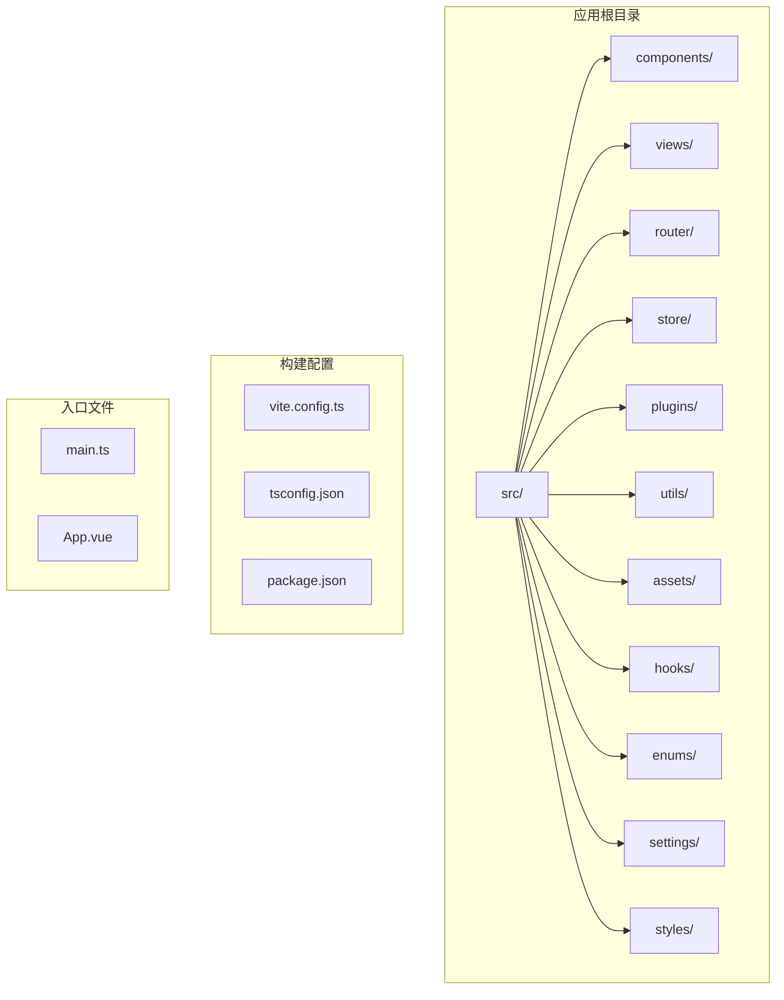
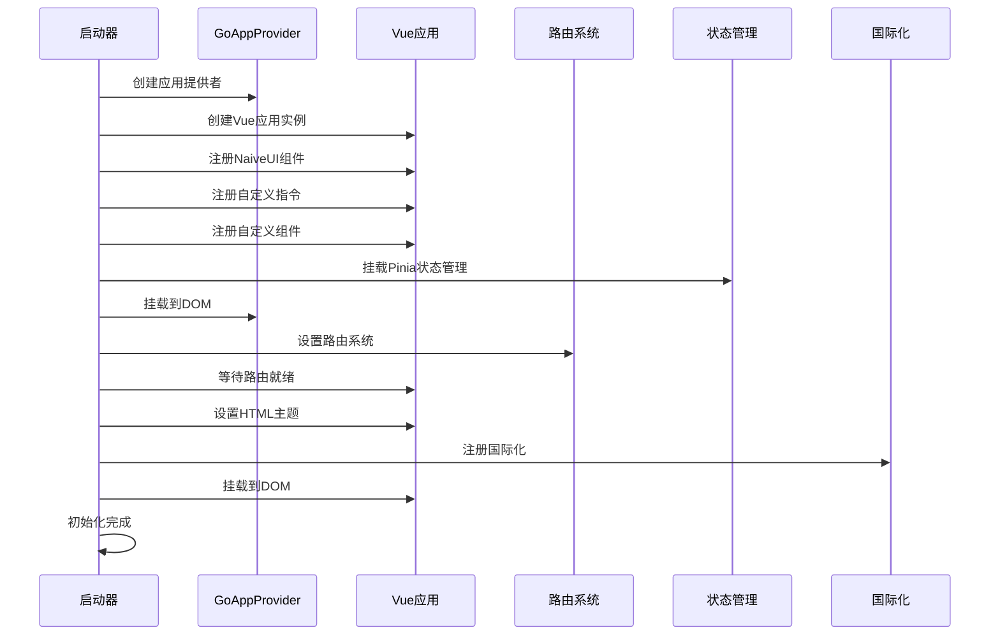
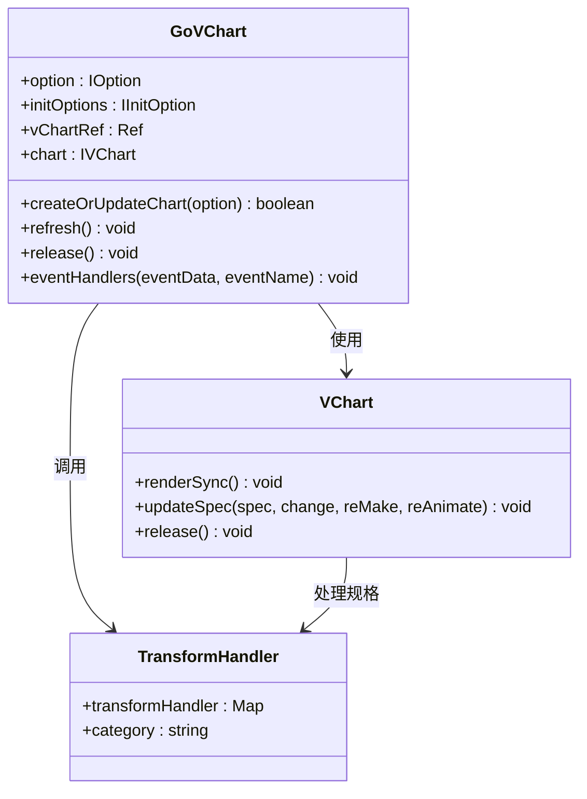
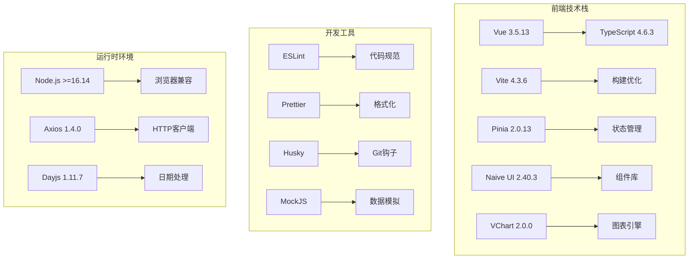
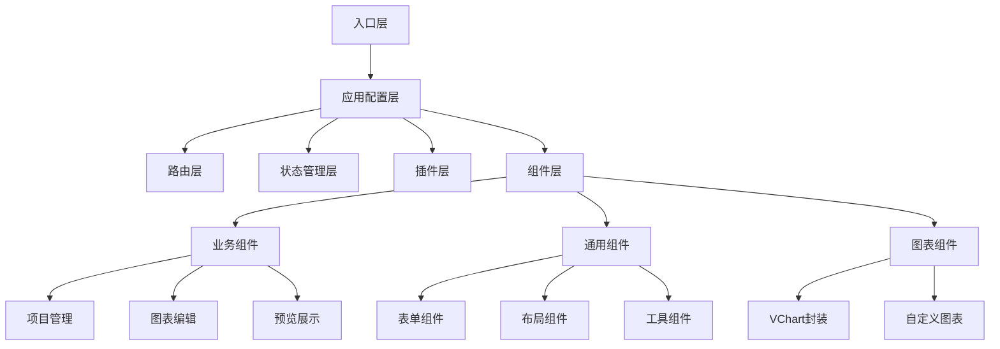
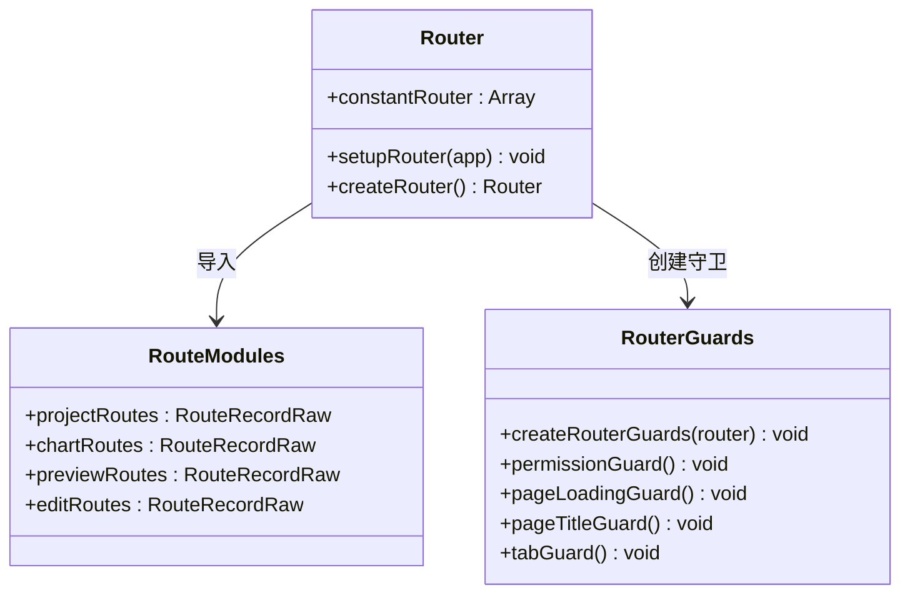
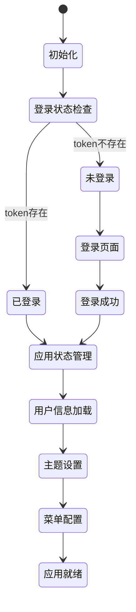
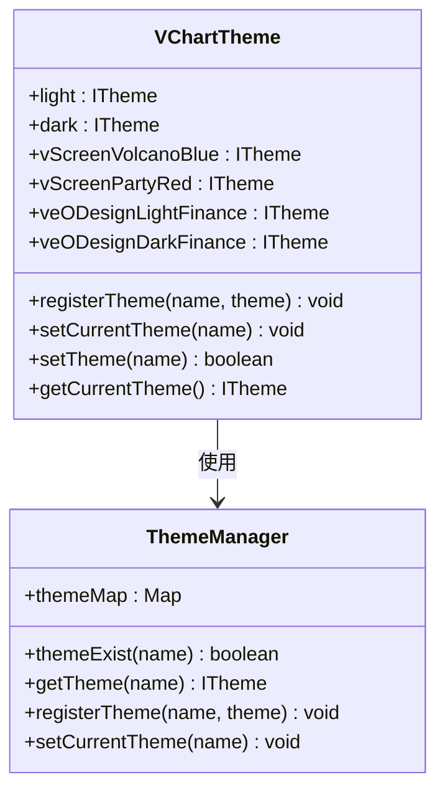
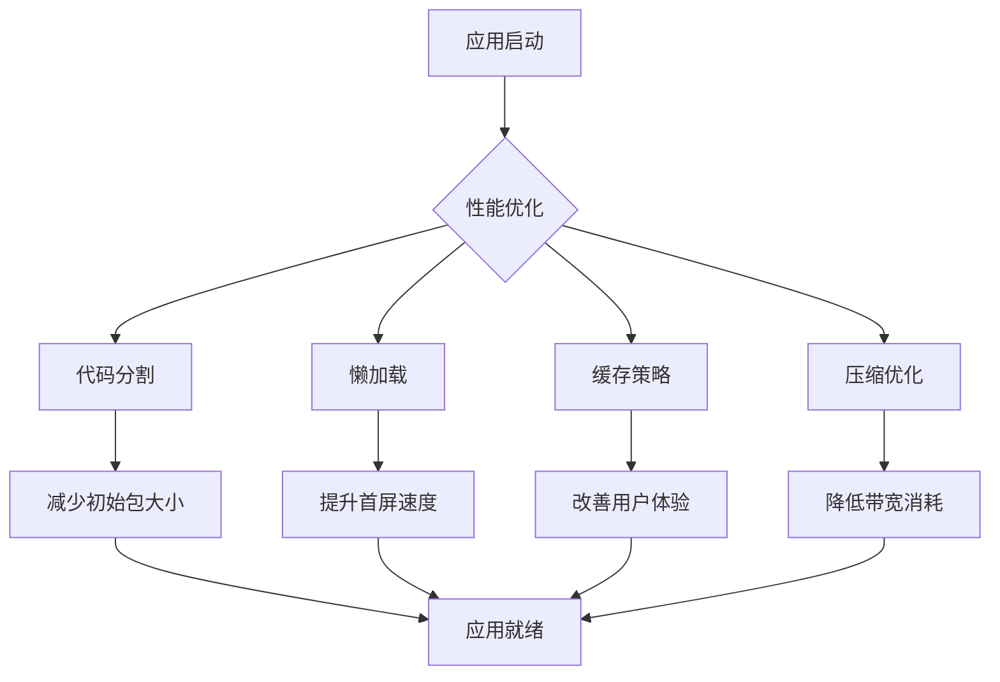

# forge-report 前端模块

<cite>
**本文档引用的文件**
- [package.json](file://forge-report-ui/package.json)
- [main.ts](file://forge-report-ui/src/main.ts)
- [vite.config.ts](file://forge-report-ui/vite.config.ts)
- [tsconfig.json](file://forge-report-ui/tsconfig.json)
- [App.vue](file://forge-report-ui/src/App.vue)
- [router/index.ts](file://forge-report-ui/src/router/index.ts)
- [store/index.ts](file://forge-report-ui/src/store/index.ts)
- [plugins/index.ts](file://forge-report-ui/src/plugins/index.ts)
- [components/GoVChart/index.vue](file://forge-report-ui/src/components/GoVChart/index.vue)
- [hooks/useVCharts.hook.ts](file://forge-report-ui/src/hooks/useVCharts.hook.ts)
- [utils/index.ts](file://forge-report-ui/src/utils/index.ts)
</cite>

## 目录
1. [简介](#简介)
2. [项目结构](#项目结构)
3. [核心组件](#核心组件)
4. [架构概览](#架构概览)
5. [详细组件分析](#详细组件分析)
6. [依赖分析](#依赖分析)
7. [性能考虑](#性能考虑)
8. [故障排除指南](#故障排除指南)
9. [结论](#结论)

## 简介

forge-report 前端模块是基于 Vue 3 和 TypeScript 构建的企业级报表可视化平台。该模块专注于提供强大的数据可视化能力，集成了 VChart 图表引擎、Vue 3 组件系统和现代化的开发工具链。

该项目采用模块化架构设计，支持多种图表类型、主题切换、国际化以及丰富的交互功能。通过使用 Vite 作为构建工具，提供了快速的开发体验和高效的生产构建。

## 项目结构

forge-report 前端模块遵循现代化的 Vue 3 应用程序结构，主要分为以下几个核心目录：



**图表来源**
- [main.ts:1-68](file://forge-report-ui/src/main.ts#L1-L68)
- [vite.config.ts:1-113](file://forge-report-ui/vite.config.ts#L1-L113)
- [tsconfig.json:1-26](file://forge-report-ui/tsconfig.json#L1-L26)

**章节来源**
- [main.ts:1-68](file://forge-report-ui/src/main.ts#L1-L68)
- [vite.config.ts:1-113](file://forge-report-ui/vite.config.ts#L1-L113)
- [tsconfig.json:1-26](file://forge-report-ui/tsconfig.json#L1-L26)

## 核心组件

### 应用初始化流程

应用启动采用异步初始化模式，确保所有插件和服务正确加载：



**图表来源**
- [main.ts:25-62](file://forge-report-ui/src/main.ts#L25-L62)

### 图表渲染引擎

项目采用 VChart 作为核心图表渲染引擎，提供了丰富的图表类型和交互能力：



**图表来源**
- [components/GoVChart/index.vue:10-251](file://forge-report-ui/src/components/GoVChart/index.vue#L10-L251)

**章节来源**
- [main.ts:25-62](file://forge-report-ui/src/main.ts#L25-L62)
- [components/GoVChart/index.vue:10-251](file://forge-report-ui/src/components/GoVChart/index.vue#L10-L251)

## 架构概览

### 技术栈架构



**图表来源**
- [package.json:16-54](file://forge-report-ui/package.json#L16-L54)
- [package.json:55-91](file://forge-report-ui/package.json#L55-L91)

### 应用架构模式

应用采用模块化的架构设计，主要包含以下核心层次：



**图表来源**
- [main.ts:25-62](file://forge-report-ui/src/main.ts#L25-L62)
- [router/index.ts:31-43](file://forge-report-ui/src/router/index.ts#L31-L43)

**章节来源**
- [package.json:16-91](file://forge-report-ui/package.json#L16-L91)
- [router/index.ts:31-43](file://forge-report-ui/src/router/index.ts#L31-L43)

## 详细组件分析

### 路由系统

路由系统采用模块化设计，支持动态路由和路由守卫：



**图表来源**
- [router/index.ts:1-45](file://forge-report-ui/src/router/index.ts#L1-L45)

### 状态管理系统

状态管理采用 Pinia 架构，提供类型安全的状态管理：



**图表来源**
- [store/index.ts:1-11](file://forge-report-ui/src/store/index.ts#L1-L11)

### 图表主题系统

VChart 主题系统提供了丰富的主题选择和自定义能力：



**图表来源**
- [hooks/useVCharts.hook.ts:38-145](file://forge-report-ui/src/hooks/useVCharts.hook.ts#L38-L145)

**章节来源**
- [router/index.ts:1-45](file://forge-report-ui/src/router/index.ts#L1-L45)
- [store/index.ts:1-11](file://forge-report-ui/src/store/index.ts#L1-L11)
- [hooks/useVCharts.hook.ts:38-145](file://forge-report-ui/src/hooks/useVCharts.hook.ts#L38-L145)

## 依赖分析

### 核心依赖关系

```mermaid
graph LR
subgraph "运行时依赖"
A[vue@^3.5.13] --> B[应用框架]
C[naive-ui@2.40.3] --> D[UI组件库]
E[pinia@^2.0.13] --> F[状态管理]
F --> G[持久化存储]
H[@visactor/vchart@^2.0.0] --> I[图表引擎]
J[axios@^1.4.0] --> K[HTTP客户端]
L[dayjs@^1.11.7] --> M[日期处理]
end
subgraph "开发依赖"
N[vite@4.3.6] --> O[构建工具]
P[typescript@4.6.3] --> Q[类型检查]
R[eslint@^8.12.0] --> S[代码规范]
T[prettier@^2.6.2] --> U[代码格式化]
V[sass@1.49.11] --> W[样式预处理]
end
subgraph "工具依赖"
X[husky@^8.0.1] --> Y[Git钩子]
Z[mockjs@^1.1.0] --> AA[数据模拟]
BB[commitlint@^17.0.2] --> CC[提交规范]
end
```

**图表来源**
- [package.json:16-54](file://forge-report-ui/package.json#L16-L54)
- [package.json:55-91](file://forge-report-ui/package.json#L55-L91)

### 构建配置分析

项目使用 Vite 进行构建，配置了多项优化策略：

| 配置项 | 值 | 用途 |
|--------|-----|------|
| `base` | `/` | 应用基础路径 |
| `port` | `3021` | 开发服务器端口 |
| `target` | `es2020` | 编译目标 |
| `outDir` | `OUTPUT_DIR` | 输出目录 |
| `chunkSizeWarningLimit` | `chunkSizeWarningLimit` | 分块大小警告阈值 |

**章节来源**
- [package.json:16-91](file://forge-report-ui/package.json#L16-L91)
- [vite.config.ts:13-112](file://forge-report-ui/vite.config.ts#L13-L112)

## 性能考虑

### 构建优化策略

项目采用了多项性能优化措施：

1. **代码分割**: 自动进行代码分割，减少初始包大小
2. **Tree Shaking**: 通过 ES6 模块系统实现无用代码删除
3. **压缩优化**: 启用 Gzip 压缩和 Brotli 压缩
4. **懒加载**: 路由级别的组件懒加载
5. **缓存策略**: 静态资源长期缓存

### 运行时性能优化



## 故障排除指南

### 常见问题诊断

1. **图表不显示问题**
   - 检查 VChart 实例是否正确创建
   - 验证数据格式是否符合要求
   - 确认容器元素是否有尺寸

2. **主题切换异常**
   - 检查主题名称是否在主题映射中
   - 验证主题文件是否正确导入
   - 确认主题注册顺序

3. **路由跳转问题**
   - 检查路由配置是否正确
   - 验证路由守卫逻辑
   - 确认权限验证流程

### 开发调试技巧

- 使用浏览器开发者工具检查网络请求
- 在控制台输出关键变量值
- 利用 Vue DevTools 调试组件状态
- 检查构建日志中的警告信息

## 结论

forge-report 前端模块是一个功能完整、架构清晰的企业级报表可视化平台。通过采用现代化的技术栈和最佳实践，该模块提供了优秀的开发体验和用户体验。

主要特点包括：
- 基于 Vue 3 的现代化架构
- 强大的 VChart 图表引擎集成
- 完善的主题和国际化支持
- 高效的构建和优化策略
- 丰富的组件生态系统

该模块为后续的功能扩展和维护奠定了良好的基础，适合在企业环境中部署和使用。