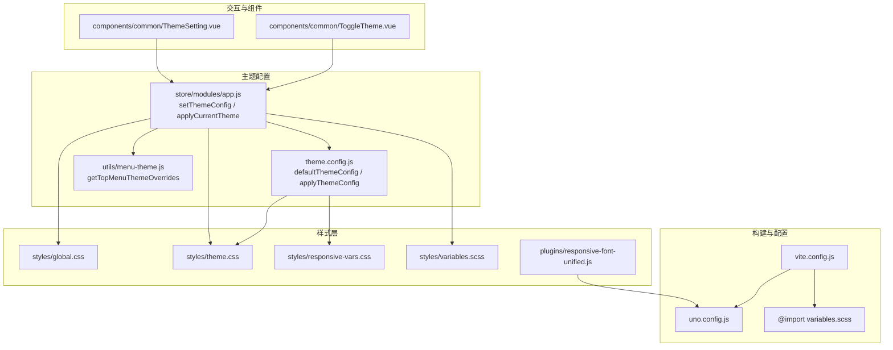
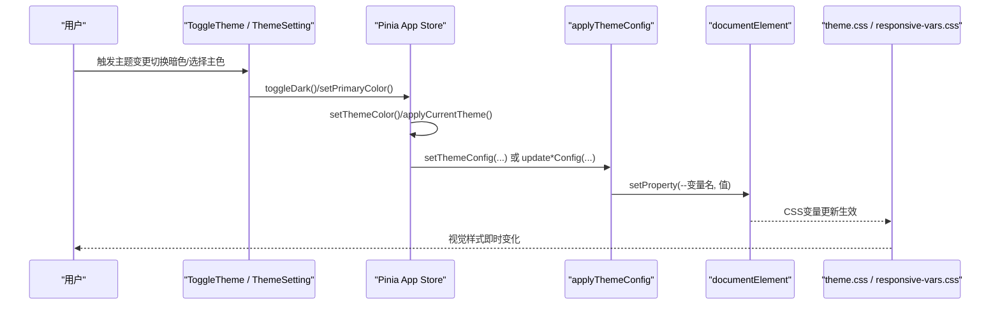
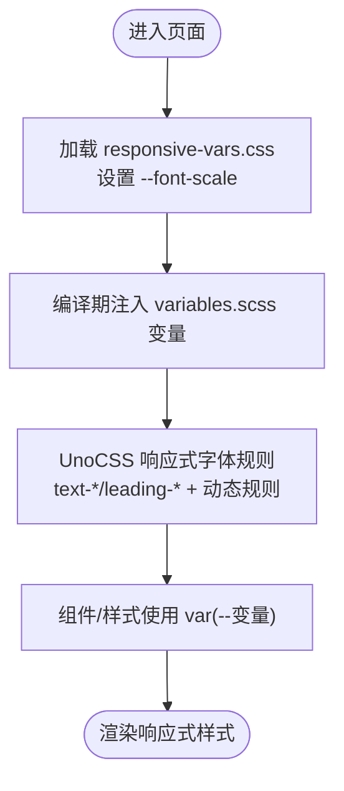
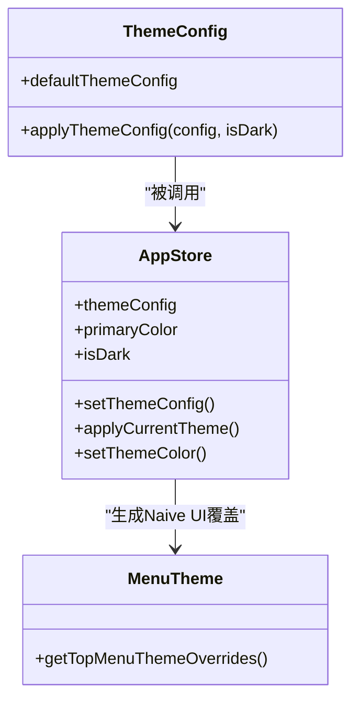
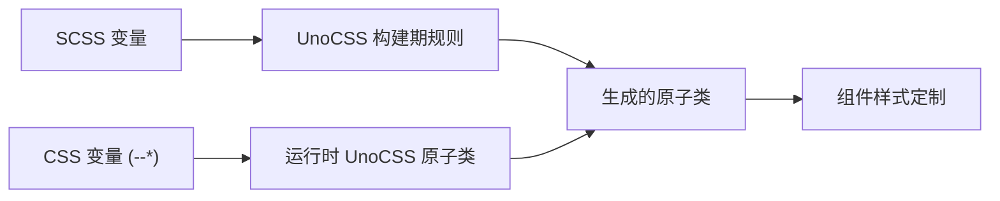
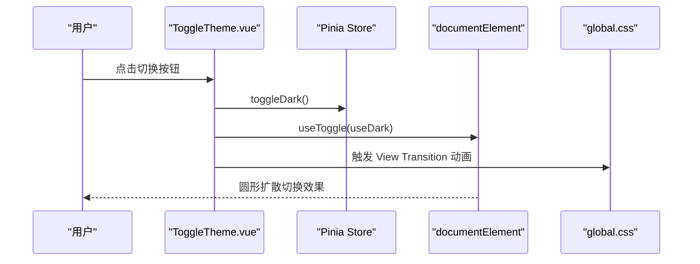
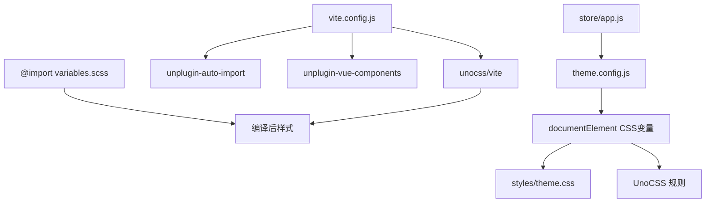

# 样式系统与主题

<cite>
**本文引用的文件**
- [theme.css](file://forge-admin-ui/src/styles/theme.css)
- [variables.scss](file://forge-admin-ui/src/styles/variables.scss)
- [theme.config.js](file://forge-admin-ui/src/config/theme.config.js)
- [uno.config.js](file://forge-admin-ui/uno.config.js)
- [vite.config.js](file://forge-admin-ui/vite.config.js)
- [ToggleTheme.vue](file://forge-admin-ui/src/components/common/ToggleTheme.vue)
- [ThemeSetting.vue](file://forge-admin-ui/src/components/common/ThemeSetting.vue)
- [app.js](file://forge-admin-ui/src/store/modules/app.js)
- [menu-theme.js](file://forge-admin-ui/src/utils/menu-theme.js)
- [global.css](file://forge-admin-ui/src/styles/global.css)
- [responsive-vars.css](file://forge-admin-ui/src/styles/responsive-vars.css)
- [responsive-font-unified.js](file://forge-admin-ui/src/plugins/responsive-font-unified.js)
- [THEME_CONFIG.md](file://forge-admin-ui/docs/THEME_CONFIG.md)
- [UTILITIES_GUIDE.md](file://forge-admin-ui/docs/UTILITIES_GUIDE.md)
</cite>

## 目录
1. [简介](#简介)
2. [项目结构](#项目结构)
3. [核心组件](#核心组件)
4. [架构总览](#架构总览)
5. [详细组件分析](#详细组件分析)
6. [依赖关系分析](#依赖关系分析)
7. [性能考虑](#性能考虑)
8. [故障排查指南](#故障排查指南)
9. [结论](#结论)
10. [附录](#附录)

## 简介
本文件面向Forge前端样式系统的综合技术文档，围绕CSS变量系统、主题配置机制、响应式设计实现展开；深入解析Uno CSS原子化工具的使用方法、样式覆盖策略与组件样式定制；说明深色主题切换机制、动态主题配置与主题变量管理；并提供样式开发规范、命名约定、组件样式最佳实践，以及样式性能优化与浏览器兼容性处理建议。

## 项目结构
Forge前端UI采用Vue 3 + Vite + UnoCSS + Pinia的现代化前端栈，样式体系由SCSS变量、CSS自定义属性、UnoCSS原子类与Pinia状态共同驱动，形成“配置-变量-样式-组件”的闭环。

**图表来源**
- [vite.config.js](file://forge-admin-ui/vite.config.js#L1-L86)
- [uno.config.js](file://forge-admin-ui/uno.config.js#L1-L54)
- [theme.config.js](file://forge-admin-ui/src/config/theme.config.js#L1-L164)
- [app.js](file://forge-admin-ui/src/store/modules/app.js#L1-L91)
- [menu-theme.js](file://forge-admin-ui/src/utils/menu-theme.js#L1-L43)
- [global.css](file://forge-admin-ui/src/styles/global.css#L1-L84)
- [theme.css](file://forge-admin-ui/src/styles/theme.css#L1-L259)
- [responsive-vars.css](file://forge-admin-ui/src/styles/responsive-vars.css#L1-L63)
- [variables.scss](file://forge-admin-ui/src/styles/variables.scss#L1-L42)
- [responsive-font-unified.js](file://forge-admin-ui/src/plugins/responsive-font-unified.js#L1-L149)
- [ToggleTheme.vue](file://forge-admin-ui/src/components/common/ToggleTheme.vue#L1-L47)
- [ThemeSetting.vue](file://forge-admin-ui/src/components/common/ThemeSetting.vue#L1-L27)

**章节来源**
- [vite.config.js](file://forge-admin-ui/vite.config.js#L1-L86)
- [uno.config.js](file://forge-admin-ui/uno.config.js#L1-L54)
- [theme.config.js](file://forge-admin-ui/src/config/theme.config.js#L1-L164)
- [app.js](file://forge-admin-ui/src/store/modules/app.js#L1-L91)
- [menu-theme.js](file://forge-admin-ui/src/utils/menu-theme.js#L1-L43)
- [global.css](file://forge-admin-ui/src/styles/global.css#L1-L84)
- [theme.css](file://forge-admin-ui/src/styles/theme.css#L1-L259)
- [responsive-vars.css](file://forge-admin-ui/src/styles/responsive-vars.css#L1-L63)
- [variables.scss](file://forge-admin-ui/src/styles/variables.scss#L1-L42)
- [responsive-font-unified.js](file://forge-admin-ui/src/plugins/responsive-font-unified.js#L1-L149)
- [ToggleTheme.vue](file://forge-admin-ui/src/components/common/ToggleTheme.vue#L1-L47)
- [ThemeSetting.vue](file://forge-admin-ui/src/components/common/ThemeSetting.vue#L1-L27)

## 核心组件
- 主题配置中心：defaultThemeConfig定义默认主题参数，applyThemeConfig将配置映射为CSS变量，驱动全局样式。
- 状态管理：Pinia Store集中管理布局、主题色、暗色模式、Naive UI主题覆盖与持久化。
- UnoCSS原子化：通过preset、shortcuts、rules与响应式字体插件，提供一致且高性能的样式能力。
- 响应式变量：CSS变量与媒体查询结合，实现随屏幕宽度的字体缩放。
- 组件交互：主题切换按钮与主题设置面板，提供即时反馈与过渡动画。

**章节来源**
- [theme.config.js](file://forge-admin-ui/src/config/theme.config.js#L1-L164)
- [app.js](file://forge-admin-ui/src/store/modules/app.js#L1-L91)
- [uno.config.js](file://forge-admin-ui/uno.config.js#L1-L54)
- [responsive-vars.css](file://forge-admin-ui/src/styles/responsive-vars.css#L1-L63)
- [ToggleTheme.vue](file://forge-admin-ui/src/components/common/ToggleTheme.vue#L1-L47)
- [ThemeSetting.vue](file://forge-admin-ui/src/components/common/ThemeSetting.vue#L1-L27)

## 架构总览
主题系统的核心流程如下：

**图表来源**
- [ToggleTheme.vue](file://forge-admin-ui/src/components/common/ToggleTheme.vue#L1-L47)
- [ThemeSetting.vue](file://forge-admin-ui/src/components/common/ThemeSetting.vue#L1-L27)
- [app.js](file://forge-admin-ui/src/store/modules/app.js#L1-L91)
- [theme.config.js](file://forge-admin-ui/src/config/theme.config.js#L100-L164)
- [theme.css](file://forge-admin-ui/src/styles/theme.css#L1-L259)
- [responsive-vars.css](file://forge-admin-ui/src/styles/responsive-vars.css#L1-L63)

## 详细组件分析

### CSS变量系统与响应式设计
- 响应式字体变量：通过CSS变量与媒体查询，按屏幕宽度设置缩放比例，再由UnoCSS与样式层统一乘以缩放因子，实现全局字体缩放。
- SCSS变量：定义主色、语义色、圆角、阴影、间距与断点，供编译期使用。
- 样式层映射：theme.css将CSS变量映射到具体组件样式，如Header、顶部菜单、侧边菜单等。

**图表来源**
- [responsive-vars.css](file://forge-admin-ui/src/styles/responsive-vars.css#L1-L63)
- [variables.scss](file://forge-admin-ui/src/styles/variables.scss#L1-L42)
- [responsive-font-unified.js](file://forge-admin-ui/src/plugins/responsive-font-unified.js#L1-L149)
- [uno.config.js](file://forge-admin-ui/uno.config.js#L1-L54)

**章节来源**
- [responsive-vars.css](file://forge-admin-ui/src/styles/responsive-vars.css#L1-L63)
- [variables.scss](file://forge-admin-ui/src/styles/variables.scss#L1-L42)
- [responsive-font-unified.js](file://forge-admin-ui/src/plugins/responsive-font-unified.js#L1-L149)
- [uno.config.js](file://forge-admin-ui/uno.config.js#L1-L54)
- [theme.css](file://forge-admin-ui/src/styles/theme.css#L1-L259)

### 主题配置机制与动态主题
- 默认主题：defaultThemeConfig集中定义Header、顶部菜单、侧边菜单的明/暗两套配置。
- 动态应用：applyThemeConfig将配置映射为CSS变量，自动选择明/暗模式对应配置。
- 状态同步：Pinia Store维护主题配置与主色，setThemeColor同时更新Naive UI主题覆盖与CSS变量。
- 菜单覆盖：menu-theme.js读取CSS变量，生成Naive UI菜单的主题覆盖对象，确保组件与全局样式一致。

**图表来源**
- [theme.config.js](file://forge-admin-ui/src/config/theme.config.js#L1-L164)
- [app.js](file://forge-admin-ui/src/store/modules/app.js#L1-L91)
- [menu-theme.js](file://forge-admin-ui/src/utils/menu-theme.js#L1-L43)

**章节来源**
- [theme.config.js](file://forge-admin-ui/src/config/theme.config.js#L1-L164)
- [app.js](file://forge-admin-ui/src/store/modules/app.js#L1-L91)
- [menu-theme.js](file://forge-admin-ui/src/utils/menu-theme.js#L1-L43)

### Uno CSS原子化工具与样式覆盖
- 预设与快捷方式：presetWind3提供基础原子类，presetAttributify支持属性化写法，presetIcons集成图标系统，presetRemToPx辅助单位换算。
- 响应式字体：responsive-font-unified插件生成大量text-*/leading-*规则，兼顾静态命中与动态扩展。
- 主题色映射：uno.config.js将CSS变量映射为UnoCSS颜色别名，配合shortcuts实现auto-bg/auto-bg-hover等跨明暗模式的自动适配。
- 样式覆盖策略：通过CSS变量与UnoCSS规则的组合，避免重复定义，提升可维护性与性能。

**图表来源**
- [uno.config.js](file://forge-admin-ui/uno.config.js#L1-L54)
- [responsive-font-unified.js](file://forge-admin-ui/src/plugins/responsive-font-unified.js#L1-L149)
- [theme.css](file://forge-admin-ui/src/styles/theme.css#L1-L259)

**章节来源**
- [uno.config.js](file://forge-admin-ui/uno.config.js#L1-L54)
- [responsive-font-unified.js](file://forge-admin-ui/src/plugins/responsive-font-unified.js#L1-L149)
- [theme.css](file://forge-admin-ui/src/styles/theme.css#L1-L259)

### 深色主题切换机制与过渡动画
- 切换逻辑：ToggleTheme.vue使用@vueuse/core的useDark与useToggle，结合Pinia Store切换isDark状态。
- 视觉过渡：利用View Transition API与CSS伪元素::view-transition-old/new(root)，实现从旧主题到新主题的圆形扩散过渡。
- 样式适配：global.css中针对过渡动画的关键帧与z-index进行适配，确保明/暗主题层级正确。

**图表来源**
- [ToggleTheme.vue](file://forge-admin-ui/src/components/common/ToggleTheme.vue#L1-L47)
- [app.js](file://forge-admin-ui/src/store/modules/app.js#L1-L91)
- [global.css](file://forge-admin-ui/src/styles/global.css#L68-L84)

**章节来源**
- [ToggleTheme.vue](file://forge-admin-ui/src/components/common/ToggleTheme.vue#L1-L47)
- [app.js](file://forge-admin-ui/src/store/modules/app.js#L1-L91)
- [global.css](file://forge-admin-ui/src/styles/global.css#L1-L84)

### 组件样式定制与最佳实践
- 统一入口：通过CSS变量与UnoCSS原子类统一管理组件样式，减少重复定义。
- 响应式优先：优先使用UnoCSS响应式前缀与responsive-font-unified生成的规则，保证在不同设备下的阅读体验。
- 明/暗模式一致性：通过shortcuts与CSS变量，确保auto-bg、auto-bg-hover等在不同模式下保持一致的视觉语言。
- 性能优先：使用UnoCSS的safelist与预设规则，避免运行时大量计算；合理拆分样式文件，按需引入。

**章节来源**
- [uno.config.js](file://forge-admin-ui/uno.config.js#L1-L54)
- [responsive-font-unified.js](file://forge-admin-ui/src/plugins/responsive-font-unified.js#L1-L149)
- [theme.css](file://forge-admin-ui/src/styles/theme.css#L1-L259)

## 依赖关系分析
- 构建链路：vite.config.js启用Unocss插件与AutoImport/Components解析，使UnoCSS与组件自动导入无缝衔接。
- 样式链路：SCSS变量通过additionalData注入，UnoCSS规则与CSS变量共同作用于组件样式。
- 主题链路：Pinia Store驱动applyThemeConfig，后者将配置写入documentElement，最终由CSS变量与UnoCSS规则生效。

**图表来源**
- [vite.config.js](file://forge-admin-ui/vite.config.js#L1-L86)
- [uno.config.js](file://forge-admin-ui/uno.config.js#L1-L54)
- [app.js](file://forge-admin-ui/src/store/modules/app.js#L1-L91)
- [theme.config.js](file://forge-admin-ui/src/config/theme.config.js#L1-L164)
- [theme.css](file://forge-admin-ui/src/styles/theme.css#L1-L259)

**章节来源**
- [vite.config.js](file://forge-admin-ui/vite.config.js#L1-L86)
- [uno.config.js](file://forge-admin-ui/uno.config.js#L1-L54)
- [app.js](file://forge-admin-ui/src/store/modules/app.js#L1-L91)
- [theme.config.js](file://forge-admin-ui/src/config/theme.config.js#L1-L164)
- [theme.css](file://forge-admin-ui/src/styles/theme.css#L1-L259)

## 性能考虑
- UnoCSS按需生成：通过presets与safelist控制生成规模，避免无用规则膨胀。
- 静态+动态规则：responsive-font-unified预生成高频规则，降低运行时计算成本。
- CSS变量驱动：通过documentElement写入变量，避免重排与重绘的样式抖动。
- 缓存与持久化：Pinia Store对主题配置与布局状态进行sessionStorage持久化，减少初始化开销。
- 构建优化：Vite配置chunkSizeWarningLimit与代理配置，提升开发体验与构建稳定性。

[本节为通用性能建议，无需特定文件引用]

## 故障排查指南
- 主题未生效
  - 检查Pinia Store是否调用setThemeConfig或applyCurrentTheme。
  - 确认applyThemeConfig是否正确写入CSS变量。
  - 核对theme.css中对应选择器是否匹配组件结构。
- 暗色模式异常
  - 确认isDark状态与headerDark/topMenuDark/sideMenuDark配置是否齐全。
  - 检查global.css中的View Transition相关样式是否被覆盖。
- UnoCSS规则不生效
  - 确认类名符合UnoCSS命名规范与前缀（如mdi-/fa-/ai-）。
  - 检查safelist与动态规则是否覆盖目标类名。
- 响应式字体异常
  - 确认responsive-vars.css的媒体查询顺序与--font-scale值。
  - 检查responsive-font-unified插件是否正确注册。

**章节来源**
- [app.js](file://forge-admin-ui/src/store/modules/app.js#L1-L91)
- [theme.config.js](file://forge-admin-ui/src/config/theme.config.js#L1-L164)
- [theme.css](file://forge-admin-ui/src/styles/theme.css#L1-L259)
- [global.css](file://forge-admin-ui/src/styles/global.css#L1-L84)
- [uno.config.js](file://forge-admin-ui/uno.config.js#L1-L54)
- [responsive-vars.css](file://forge-admin-ui/src/styles/responsive-vars.css#L1-L63)
- [responsive-font-unified.js](file://forge-admin-ui/src/plugins/responsive-font-unified.js#L1-L149)

## 结论
Forge前端样式系统以CSS变量为核心，结合UnoCSS原子化与Pinia状态管理，实现了高可维护、高性能、强一致性的主题与样式体系。通过响应式变量与预设规则，系统在多设备环境下提供一致的阅读体验；通过明/暗模式与主题切换的流畅过渡，提升了用户体验。建议在后续迭代中持续完善主题预设、扩展组件样式库，并加强样式规范与自动化校验。

[本节为总结性内容，无需特定文件引用]

## 附录

### 样式开发规范与命名约定
- CSS变量命名：使用语义化前缀（如--layout-/--top-menu-/--side-menu-），避免硬编码颜色与尺寸。
- UnoCSS类名：优先使用原子类与shortcuts，必要时使用组件局部样式覆盖。
- SCSS变量：集中定义主色、语义色、圆角、阴影、间距与断点，避免散落定义。
- 响应式：优先使用UnoCSS响应式前缀与responsive-font-unified生成的规则。

**章节来源**
- [theme.css](file://forge-admin-ui/src/styles/theme.css#L1-L259)
- [uno.config.js](file://forge-admin-ui/uno.config.js#L1-L54)
- [variables.scss](file://forge-admin-ui/src/styles/variables.scss#L1-L42)
- [responsive-font-unified.js](file://forge-admin-ui/src/plugins/responsive-font-unified.js#L1-L149)

### 主题配置参考与使用示例
- 可视化配置：通过ThemeSetting.vue选择主色，点击应用主题保存至Store。
- 代码配置：在theme.config.js中修改defaultThemeConfig或使用预设主题。
- 程序化更新：通过appStore.updateHeaderConfig/updateTopMenuConfig/updateSideMenuConfig按需更新。

**章节来源**
- [THEME_CONFIG.md](file://forge-admin-ui/docs/THEME_CONFIG.md#L1-L266)
- [ThemeSetting.vue](file://forge-admin-ui/src/components/common/ThemeSetting.vue#L1-L27)
- [app.js](file://forge-admin-ui/src/store/modules/app.js#L1-L91)
- [theme.config.js](file://forge-admin-ui/src/config/theme.config.js#L1-L164)