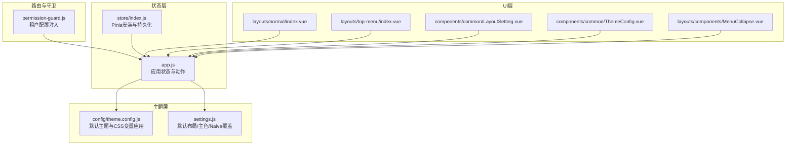
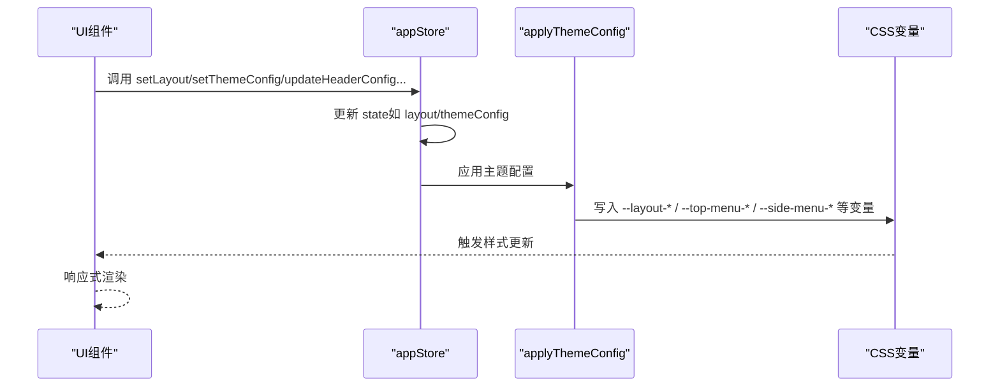
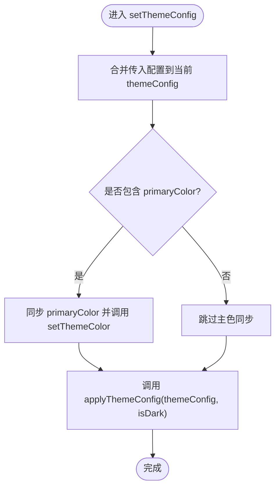
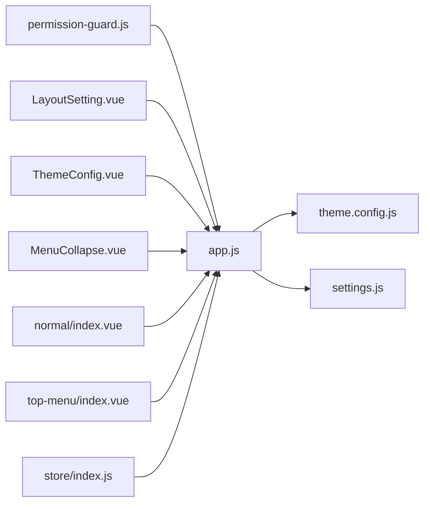

# 应用状态管理

<cite>
**本文引用的文件**
- [app.js](file://forge-admin-ui/src/store/modules/app.js)
- [index.js（store）](file://forge-admin-ui/src/store/index.js)
- [settings.js](file://forge-admin-ui/src/settings.js)
- [theme.config.js](file://forge-admin-ui/src/config/theme.config.js)
- [main.js](file://forge-admin-ui/src/main.js)
- [permission-guard.js](file://forge-admin-ui/src/router/guards/permission-guard.js)
- [LayoutSetting.vue](file://forge-admin-ui/src/components/common/LayoutSetting.vue)
- [ThemeConfig.vue](file://forge-admin-ui/src/components/common/ThemeConfig.vue)
- [MenuCollapse.vue](file://forge-admin-ui/src/layouts/components/MenuCollapse.vue)
- [normal/index.vue](file://forge-admin-ui/src/layouts/normal/index.vue)
- [top-menu/index.vue](file://forge-admin-ui/src/layouts/top-menu/index.vue)
- [storage.js](file://forge-admin-ui/src/utils/storage/storage.js)
</cite>

## 目录
1. [简介](#简介)
2. [项目结构](#项目结构)
3. [核心组件](#核心组件)
4. [架构总览](#架构总览)
5. [详细组件分析](#详细组件分析)
6. [依赖关系分析](#依赖关系分析)
7. [性能考量](#性能考量)
8. [故障排查指南](#故障排查指南)
9. [结论](#结论)
10. [附录](#附录)

## 简介
本文件聚焦于前端应用状态管理模块，系统性解析 app.js 中的应用配置状态管理，涵盖主题配置、布局设置、语言切换（概念性说明）、菜单折叠状态等能力。文档将从数据结构设计、actions 方法实现、状态持久化与默认值、状态同步机制等方面进行深入剖析，并提供可视化图示、使用示例与最佳实践建议。

## 项目结构
应用状态管理位于 Pinia Store 的 modules 目录中，配合路由守卫、主题配置工具与多个 UI 组件协同工作：
- store/modules/app.js：定义应用状态与动作，负责主题、布局、菜单折叠等配置
- store/index.js：安装 Pinia 并启用持久化插件
- config/theme.config.js：默认主题配置与 CSS 变量应用函数
- settings.js：默认布局、默认主色、Naive UI 主题覆盖等默认值
- router/guards/permission-guard.js：在鉴权流程中应用租户主题与布局
- components/common/LayoutSetting.vue、ThemeConfig.vue：布局与主题配置的交互入口
- layouts/normal/index.vue、layouts/top-menu/index.vue：布局组件消费 appStore 状态
- utils/storage/storage.js：通用存储封装（可扩展持久化策略）

图表来源
- [app.js](file://forge-admin-ui/src/store/modules/app.js#L1-L91)
- [index.js（store）](file://forge-admin-ui/src/store/index.js#L1-L11)
- [theme.config.js](file://forge-admin-ui/src/config/theme.config.js#L1-L164)
- [settings.js](file://forge-admin-ui/src/settings.js#L1-L75)
- [permission-guard.js](file://forge-admin-ui/src/router/guards/permission-guard.js#L1-L547)
- [LayoutSetting.vue](file://forge-admin-ui/src/components/common/LayoutSetting.vue#L1-L176)
- [ThemeConfig.vue](file://forge-admin-ui/src/components/common/ThemeConfig.vue#L1-L285)
- [MenuCollapse.vue](file://forge-admin-ui/src/layouts/components/MenuCollapse.vue#L1-L16)
- [normal/index.vue](file://forge-admin-ui/src/layouts/normal/index.vue#L1-L192)
- [top-menu/index.vue](file://forge-admin-ui/src/layouts/top-menu/index.vue#L1-L48)

章节来源
- [app.js](file://forge-admin-ui/src/store/modules/app.js#L1-L91)
- [index.js（store）](file://forge-admin-ui/src/store/index.js#L1-L11)
- [settings.js](file://forge-admin-ui/src/settings.js#L1-L75)

## 核心组件
- 应用状态模块（app.js）
  - 状态字段：collapsed（菜单折叠）、isDark（暗色模式）、layout（布局类型）、primaryColor（主色）、naiveThemeOverrides（Naive UI 主题覆盖）、selectedTopMenuId（顶部菜单选中项）、themeConfig（完整主题配置）、routeGuardCompleted（路由守卫完成标记）、persist 配置（sessionStorage 持久化）
  - 动作方法：switchCollapsed、setCollapsed、toggleDark、setLayout、setPrimaryColor、setThemeColor、setSelectedTopMenuId、setThemeConfig、updateHeaderConfig、updateTopMenuConfig、updateSideMenuConfig、applyCurrentTheme、setRouteGuardCompleted、updateNaiveThemeOverrides
- 主题配置（theme.config.js）
  - defaultThemeConfig：包含 header、headerDark、topMenu、topMenuDark、sideMenu、sideMenuDark 等完整配置
  - applyThemeConfig：将主题配置映射为 CSS 变量，支持明暗模式
- 默认设置（settings.js）
  - defaultLayout、defaultPrimaryColor、naiveThemeOverrides、layoutSettings、layoutSettingVisible
- 路由守卫（permission-guard.js）
  - 在鉴权阶段合并租户主题配置并应用到 appStore
- UI 组件
  - LayoutSetting.vue：布局切换弹窗
  - ThemeConfig.vue：主题配置抽屉
  - MenuCollapse.vue：菜单折叠按钮
  - normal/index.vue、top-menu/index.vue：消费 appStore 状态渲染布局

章节来源
- [app.js](file://forge-admin-ui/src/store/modules/app.js#L7-L91)
- [theme.config.js](file://forge-admin-ui/src/config/theme.config.js#L9-L164)
- [settings.js](file://forge-admin-ui/src/settings.js#L21-L75)
- [LayoutSetting.vue](file://forge-admin-ui/src/components/common/LayoutSetting.vue#L1-L176)
- [ThemeConfig.vue](file://forge-admin-ui/src/components/common/ThemeConfig.vue#L1-L285)
- [MenuCollapse.vue](file://forge-admin-ui/src/layouts/components/MenuCollapse.vue#L1-L16)
- [normal/index.vue](file://forge-admin-ui/src/layouts/normal/index.vue#L1-L192)
- [top-menu/index.vue](file://forge-admin-ui/src/layouts/top-menu/index.vue#L1-L48)

## 架构总览
应用状态管理采用“状态集中、动作解耦、主题统一”的设计：
- 状态集中在 appStore，通过 actions 修改状态并触发主题与布局同步
- 主题配置通过 applyThemeConfig 统一写入 CSS 变量，实现全局样式更新
- 路由守卫在登录后合并租户配置，保证多租户场景下的个性化主题与布局
- UI 组件通过 useAppStore 订阅状态变化，实现响应式渲染

图表来源
- [app.js](file://forge-admin-ui/src/store/modules/app.js#L18-L84)
- [theme.config.js](file://forge-admin-ui/src/config/theme.config.js#L105-L163)

章节来源
- [app.js](file://forge-admin-ui/src/store/modules/app.js#L18-L84)
- [theme.config.js](file://forge-admin-ui/src/config/theme.config.js#L105-L163)

## 详细组件分析

### 应用状态模块（app.js）
- 数据结构设计
  - 状态键：collapsed、isDark、layout、primaryColor、naiveThemeOverrides、selectedTopMenuId、themeConfig、routeGuardCompleted
  - 默认值来源：import.meta.env.VITE_DEFAULT_LAYOUT、defaultLayout、defaultPrimaryColor、naiveThemeOverrides、defaultThemeConfig
  - 持久化：persist 配置 pick 了 collapsed、layout、primaryColor、naiveThemeOverrides、themeConfig，存储于 sessionStorage，键名包含租户标识
- 动作方法
  - 菜单折叠：switchCollapsed、setCollapsed
  - 明暗主题：toggleDark
  - 布局切换：setLayout
  - 主色与主题：setPrimaryColor、setThemeColor（生成 Arco 主色系并写入 CSS 变量与 Naive 覆盖）
  - 主题配置：setThemeConfig（深度合并 themeConfig，必要时同步 primaryColor 并调用 applyThemeConfig）、updateHeaderConfig/updateTopMenuConfig/updateSideMenuConfig（按模块局部更新并应用）
  - 路由守卫状态：setRouteGuardCompleted
  - Naive 覆盖：updateNaiveThemeOverrides
- 状态同步机制
  - setThemeConfig 会同步 themeConfig.primaryColor 到 primaryColor，并调用 setThemeColor 生成 Arco 色板，同时调用 applyThemeConfig 将配置映射为 CSS 变量
  - applyCurrentTheme 直接应用当前 themeConfig 与 isDark
- getter 计算属性
  - 当前代码未定义 getters；如需扩展，可在 store 中添加 computed 属性以派生状态（例如基于 layout 与 isDark 的组合状态）

图表来源
- [app.js](file://forge-admin-ui/src/store/modules/app.js#L50-L58)

章节来源
- [app.js](file://forge-admin-ui/src/store/modules/app.js#L7-L91)

### 主题配置（theme.config.js）
- 默认主题配置
  - 包含 header/headerDark、topMenu/topMenuDark、sideMenu/sideMenuDark 的完整键值
  - 支持明暗模式差异配置
- 应用主题
  - 将配置映射为 CSS 变量（如 --primary-color、--layout-header-bg-color 等）
  - 支持字体大小、菜单宽度、图标颜色等细粒度控制
- 与 appStore 的协作
  - appStore.actions 调用 applyThemeConfig，实现主题即时生效

章节来源
- [theme.config.js](file://forge-admin-ui/src/config/theme.config.js#L9-L164)

### 默认设置（settings.js）
- defaultLayout：默认布局类型
- defaultPrimaryColor：默认主色
- naiveThemeOverrides：Naive UI 主题覆盖初始值
- layoutSettings：布局选项清单
- 作用：为 appStore.state 提供默认值来源

章节来源
- [settings.js](file://forge-admin-ui/src/settings.js#L21-L75)

### 路由守卫（permission-guard.js）
- 租户配置注入
  - 读取租户配置（systemLayout、systemTheme、browserTitle、browserIcon、themeConfig）
  - 合并默认主题配置与租户配置，生成最终 themeConfig
  - 应用布局与主题到 appStore
- 路由守卫完成标记
  - setRouteGuardCompleted(true) 标记守卫流程完成，避免重复执行

章节来源
- [permission-guard.js](file://forge-admin-ui/src/router/guards/permission-guard.js#L9-L82)
- [permission-guard.js](file://forge-admin-ui/src/router/guards/permission-guard.js#L84-L547)

### UI 组件与状态联动
- 布局设置（LayoutSetting.vue）
  - 通过点击事件调用 appStore.setLayout 切换布局
- 主题配置（ThemeConfig.vue）
  - 本地维护 localConfig，实时调用 appStore.setThemeConfig 同步
  - 支持应用、重置、导出配置
- 菜单折叠（MenuCollapse.vue）
  - 调用 appStore.switchCollapsed 切换折叠状态
- 布局组件（normal/index.vue、top-menu/index.vue）
  - 直接读取 appStore.collapsed、appStore.layout 等状态驱动渲染

章节来源
- [LayoutSetting.vue](file://forge-admin-ui/src/components/common/LayoutSetting.vue#L14-L143)
- [ThemeConfig.vue](file://forge-admin-ui/src/components/common/ThemeConfig.vue#L212-L284)
- [MenuCollapse.vue](file://forge-admin-ui/src/layouts/components/MenuCollapse.vue#L4-L8)
- [normal/index.vue](file://forge-admin-ui/src/layouts/normal/index.vue#L7-L29)
- [top-menu/index.vue](file://forge-admin-ui/src/layouts/top-menu/index.vue#L4-L46)

## 依赖关系分析
- appStore 依赖
  - theme.config.js：应用主题配置
  - settings.js：默认值来源
  - permission-guard.js：在鉴权阶段注入租户主题与布局
- UI 组件依赖
  - LayoutSetting.vue、ThemeConfig.vue、MenuCollapse.vue 依赖 appStore
  - 布局组件依赖 appStore 的布局与折叠状态
- 存储依赖
  - store/index.js 启用持久化插件，appStore.persist 使用 sessionStorage

图表来源
- [app.js](file://forge-admin-ui/src/store/modules/app.js#L1-L91)
- [theme.config.js](file://forge-admin-ui/src/config/theme.config.js#L1-L164)
- [settings.js](file://forge-admin-ui/src/settings.js#L1-L75)
- [permission-guard.js](file://forge-admin-ui/src/router/guards/permission-guard.js#L1-L547)
- [LayoutSetting.vue](file://forge-admin-ui/src/components/common/LayoutSetting.vue#L1-L176)
- [ThemeConfig.vue](file://forge-admin-ui/src/components/common/ThemeConfig.vue#L1-L285)
- [MenuCollapse.vue](file://forge-admin-ui/src/layouts/components/MenuCollapse.vue#L1-L16)
- [normal/index.vue](file://forge-admin-ui/src/layouts/normal/index.vue#L1-L192)
- [top-menu/index.vue](file://forge-admin-ui/src/layouts/top-menu/index.vue#L1-L48)
- [index.js（store）](file://forge-admin-ui/src/store/index.js#L1-L11)

章节来源
- [index.js（store）](file://forge-admin-ui/src/store/index.js#L1-L11)

## 性能考量
- 主题应用成本
  - applyThemeConfig 一次性写入大量 CSS 变量，建议在配置变更时批量更新，避免频繁细粒度调用
- 状态持久化
  - sessionStorage 体积有限，建议仅持久化必要的轻量状态（如 collapsed、layout、primaryColor、themeConfig），避免存储大对象
- 路由守卫
  - 避免在守卫中进行重复的配置合并与主题应用，可通过 setRouteGuardCompleted 防止重复执行

## 故障排查指南
- 主题未生效
  - 检查 appStore.setThemeConfig 是否被调用，确认 themeConfig 结构完整
  - 确认 applyThemeConfig 已被调用且 isDark 与配置一致
- 布局切换无效
  - 检查 LayoutSetting.vue 是否调用 appStore.setLayout
  - 确认路由守卫未覆盖 appStore.layout（租户配置优先级更高）
- 菜单折叠状态不同步
  - 检查 MenuCollapse.vue 是否调用 appStore.switchCollapsed
  - 确认 normal/index.vue、top-menu/index.vue 是否读取 appStore.collapsed
- 路由守卫导致的异常
  - 检查 permission-guard.js 中 setRouteGuardCompleted 的调用时机，避免阻塞导航

章节来源
- [ThemeConfig.vue](file://forge-admin-ui/src/components/common/ThemeConfig.vue#L232-L242)
- [LayoutSetting.vue](file://forge-admin-ui/src/components/common/LayoutSetting.vue#L14-L143)
- [MenuCollapse.vue](file://forge-admin-ui/src/layouts/components/MenuCollapse.vue#L4-L8)
- [permission-guard.js](file://forge-admin-ui/src/router/guards/permission-guard.js#L84-L547)

## 结论
app.js 通过集中式状态管理实现了主题、布局、菜单折叠等核心配置的统一控制。结合 theme.config.js 的 CSS 变量映射与路由守卫的租户配置注入，形成了高内聚、低耦合的状态体系。建议在后续迭代中补充 getters 以派生常用状态，并持续优化主题应用与持久化的性能表现。

## 附录

### 状态持久化配置与默认值
- 持久化键：`${VITE_TENANT || 'default'}_app`
- 持久化存储：sessionStorage
- 持久化字段：collapsed、layout、primaryColor、naiveThemeOverrides、themeConfig
- 默认值来源：settings.js 的 defaultLayout、defaultPrimaryColor、naiveThemeOverrides、defaultThemeConfig

章节来源
- [app.js](file://forge-admin-ui/src/store/modules/app.js#L85-L89)
- [settings.js](file://forge-admin-ui/src/settings.js#L21-L75)

### 实际使用示例（步骤说明）
- 切换布局
  - 在 LayoutSetting.vue 中点击对应布局按钮，调用 appStore.setLayout
- 切换菜单折叠
  - 在 MenuCollapse.vue 点击按钮，调用 appStore.switchCollapsed
- 自定义主题
  - 在 ThemeConfig.vue 中修改颜色与字体，实时调用 appStore.setThemeConfig 应用
- 多租户主题
  - 在 permission-guard.js 中合并租户配置并调用 appStore.setThemeConfig

章节来源
- [LayoutSetting.vue](file://forge-admin-ui/src/components/common/LayoutSetting.vue#L14-L143)
- [MenuCollapse.vue](file://forge-admin-ui/src/layouts/components/MenuCollapse.vue#L4-L8)
- [ThemeConfig.vue](file://forge-admin-ui/src/components/common/ThemeConfig.vue#L232-L242)
- [permission-guard.js](file://forge-admin-ui/src/router/guards/permission-guard.js#L9-L82)

### 最佳实践
- 仅持久化必要状态，避免 sessionStorage 滥用
- 在主题变更时统一通过 setThemeConfig 或 update*Config 方法，减少分散调用
- 使用 setRouteGuardCompleted 标记守卫完成，防止重复执行
- 保持 themeConfig 结构一致性，便于深度合并与覆盖