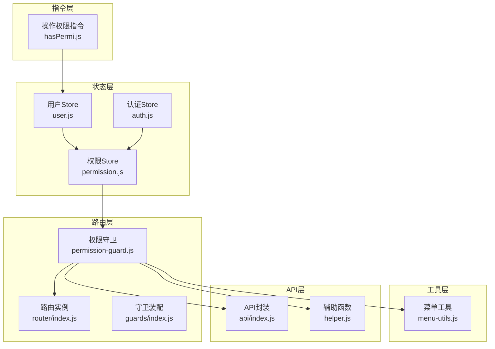
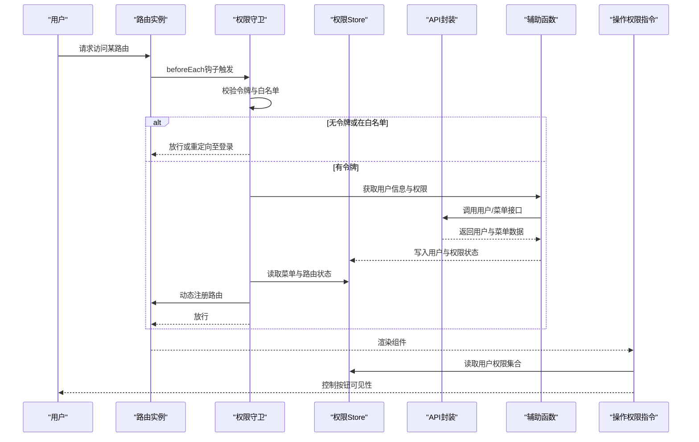
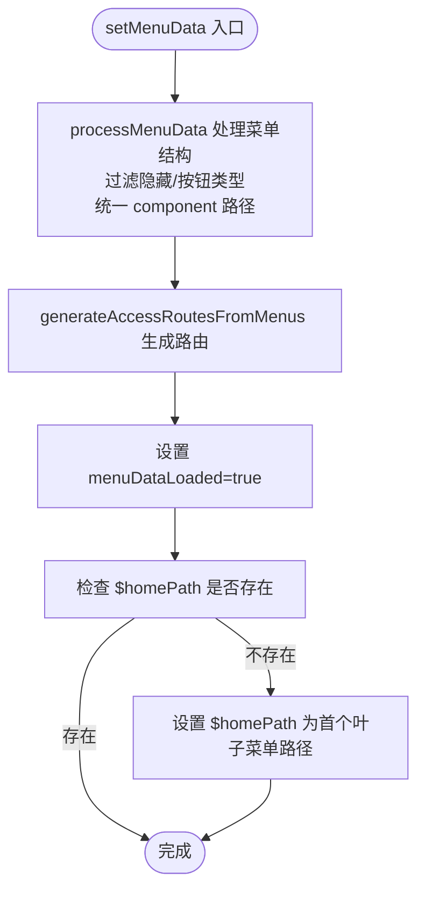
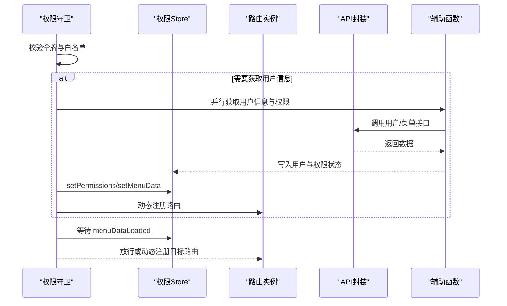
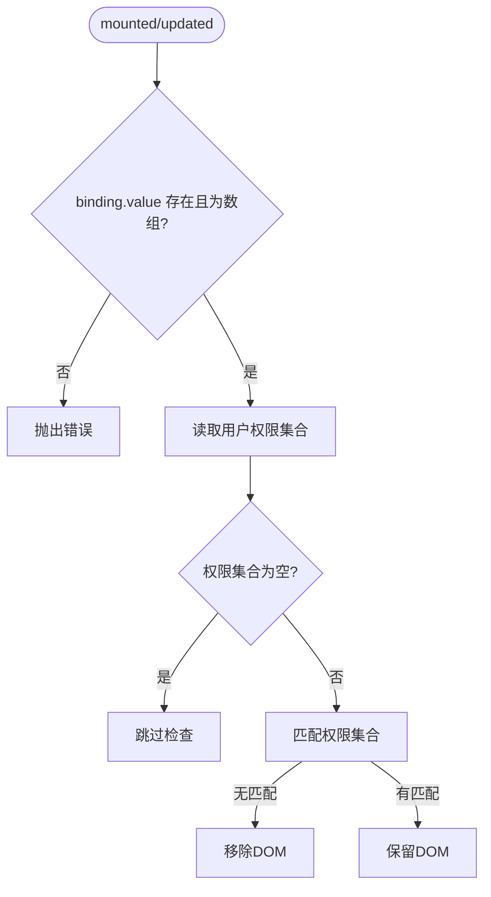
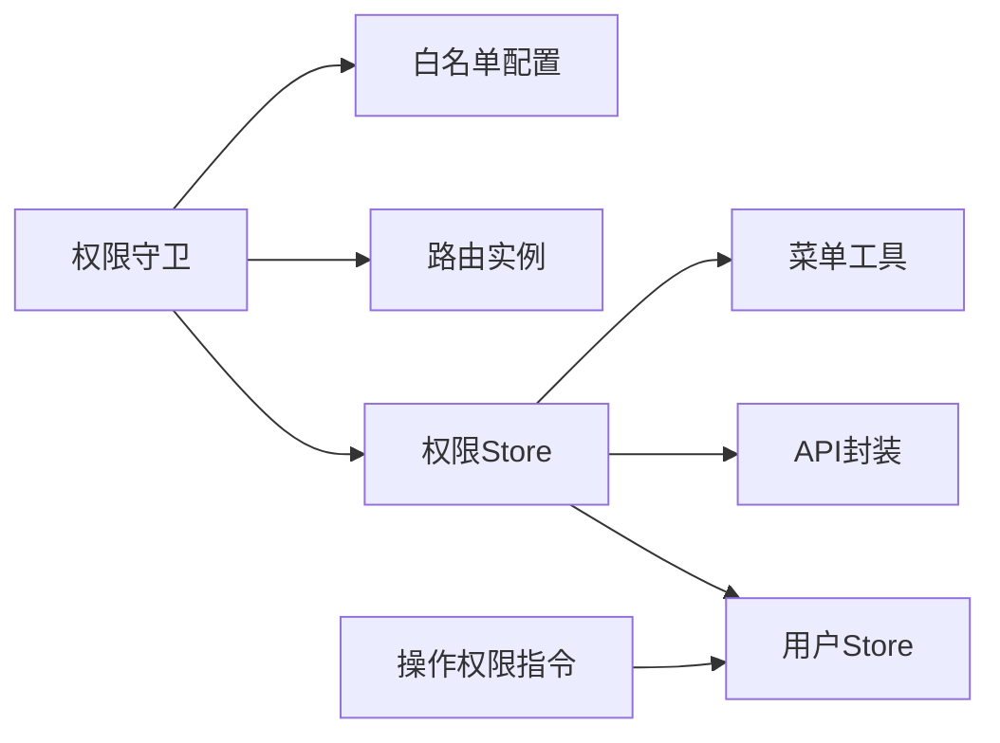

# 权限状态管理

<cite>
**本文档引用的文件**
- [permission.js](file://forge-admin-ui/src/store/modules/permission.js)
- [permission-guard.js](file://forge-admin-ui/src/router/guards/permission-guard.js)
- [menu-utils.js](file://forge-admin-ui/src/utils/menu-utils.js)
- [auth.js](file://forge-admin-ui/src/store/modules/auth.js)
- [hasPermi.js](file://forge-admin-ui/src/directives/modules/hasPermi.js)
- [index.js](file://forge-admin-ui/src/api/index.js)
- [helper.js](file://forge-admin-ui/src/store/helper.js)
- [whitelist.config.js](file://forge-admin-ui/src/config/whitelist.config.js)
- [index.js](file://forge-admin-ui/src/router/index.js)
- [index.js](file://forge-admin-ui/src/router/guards/index.js)
- [user.js](file://forge-admin-ui/src/store/modules/user.js)
- [settings.js](file://forge-admin-ui/src/settings.js)
</cite>

## 目录
1. [简介](#简介)
2. [项目结构](#项目结构)
3. [核心组件](#核心组件)
4. [架构总览](#架构总览)
5. [详细组件分析](#详细组件分析)
6. [依赖关系分析](#依赖关系分析)
7. [性能考虑](#性能考虑)
8. [故障排除指南](#故障排除指南)
9. [结论](#结论)
10. [附录](#附录)

## 简介
本文件系统性梳理并解析权限状态管理模块的技术实现，重点围绕前端权限状态管理的核心文件 permission.js，全面阐述菜单权限、按钮权限、路由权限与操作权限的管理机制；深入解析权限数据的获取、缓存与验证流程；说明权限状态与路由守卫的协同工作方式、动态菜单生成与权限控制实现；最后提供权限状态扩展开发指南、权限配置最佳实践以及性能优化建议。

## 项目结构
权限状态管理涉及多个层面：
- 状态层：Pinia Store 中的权限状态（accessRoutes、permissions、menus、menuDataLoaded）
- 路由层：路由守卫基于权限状态进行动态注册与校验
- 指令层：基于用户权限的按钮级可见性控制
- 工具层：菜单数据处理与转换工具
- API 层：用户信息与菜单数据的获取接口

**图表来源**
- [permission.js](file://forge-admin-ui/src/store/modules/permission.js#L5-L269)
- [permission-guard.js](file://forge-admin-ui/src/router/guards/permission-guard.js#L84-L547)
- [user.js](file://forge-admin-ui/src/store/modules/user.js#L23-L118)
- [auth.js](file://forge-admin-ui/src/store/modules/auth.js#L6-L78)
- [hasPermi.js](file://forge-admin-ui/src/directives/modules/hasPermi.js#L7-L41)
- [menu-utils.js](file://forge-admin-ui/src/utils/menu-utils.js#L1-L170)
- [index.js](file://forge-admin-ui/src/api/index.js#L1-L24)
- [helper.js](file://forge-admin-ui/src/store/helper.js#L1-L57)
- [index.js](file://forge-admin-ui/src/router/index.js#L1-L18)
- [index.js](file://forge-admin-ui/src/router/guards/index.js#L1-L11)

**章节来源**
- [permission.js](file://forge-admin-ui/src/store/modules/permission.js#L1-L269)
- [permission-guard.js](file://forge-admin-ui/src/router/guards/permission-guard.js#L1-L547)
- [user.js](file://forge-admin-ui/src/store/modules/user.js#L1-L118)
- [auth.js](file://forge-admin-ui/src/store/modules/auth.js#L1-L78)
- [hasPermi.js](file://forge-admin-ui/src/directives/modules/hasPermi.js#L1-L41)
- [menu-utils.js](file://forge-admin-ui/src/utils/menu-utils.js#L1-L170)
- [index.js](file://forge-admin-ui/src/api/index.js#L1-L24)
- [helper.js](file://forge-admin-ui/src/store/helper.js#L1-L57)
- [index.js](file://forge-admin-ui/src/router/index.js#L1-L18)
- [index.js](file://forge-admin-ui/src/router/guards/index.js#L1-L11)

## 核心组件
- 权限Store（permission.js）：维护 accessRoutes、permissions、menus、menuDataLoaded 等状态，负责菜单数据处理、路由生成与动态注册。
- 权限守卫（permission-guard.js）：在路由切换前进行令牌校验、用户信息与权限获取、菜单数据加载、动态路由注册与校验。
- 用户Store（user.js）：维护用户信息、角色与权限集合，为指令与守卫提供权限依据。
- 认证Store（auth.js）：维护访问令牌与登录状态，提供登出与重置逻辑。
- 操作权限指令（hasPermi.js）：基于用户权限集合控制DOM元素的显示/隐藏。
- 菜单工具（menu-utils.js）：提供菜单数据扁平化、图标渲染、活动菜单定位等工具能力。
- API封装（api/index.js）与辅助函数（helper.js）：统一用户信息与菜单数据的获取入口。
- 路由与守卫装配（router/index.js、guards/index.js）：初始化路由与装配多类守卫。

**章节来源**
- [permission.js](file://forge-admin-ui/src/store/modules/permission.js#L5-L269)
- [permission-guard.js](file://forge-admin-ui/src/router/guards/permission-guard.js#L84-L547)
- [user.js](file://forge-admin-ui/src/store/modules/user.js#L23-L118)
- [auth.js](file://forge-admin-ui/src/store/modules/auth.js#L6-L78)
- [hasPermi.js](file://forge-admin-ui/src/directives/modules/hasPermi.js#L7-L41)
- [menu-utils.js](file://forge-admin-ui/src/utils/menu-utils.js#L1-L170)
- [index.js](file://forge-admin-ui/src/api/index.js#L1-L24)
- [helper.js](file://forge-admin-ui/src/store/helper.js#L1-L57)
- [index.js](file://forge-admin-ui/src/router/index.js#L1-L18)
- [index.js](file://forge-admin-ui/src/router/guards/index.js#L1-L11)

## 架构总览
权限状态管理采用“状态驱动 + 路由守卫 + 指令控制”的三层架构：
- 状态驱动：权限Store集中管理菜单与路由状态，提供统一的数据源。
- 路由守卫：在进入任意路由前，完成令牌校验、用户与权限获取、菜单加载、动态路由注册与校验。
- 指令控制：在组件层面基于用户权限控制按钮与操作的可见性。

**图表来源**
- [permission-guard.js](file://forge-admin-ui/src/router/guards/permission-guard.js#L84-L547)
- [permission.js](file://forge-admin-ui/src/store/modules/permission.js#L5-L269)
- [index.js](file://forge-admin-ui/src/api/index.js#L1-L24)
- [helper.js](file://forge-admin-ui/src/store/helper.js#L1-L57)
- [hasPermi.js](file://forge-admin-ui/src/directives/modules/hasPermi.js#L7-L41)

## 详细组件分析

### 权限Store（permission.js）
- 状态定义
  - accessRoutes：动态生成的可用路由集合
  - permissions：权限集合（含菜单、按钮、API等）
  - menus：菜单树结构（经处理后的前端格式）
  - menuDataLoaded：菜单数据加载完成标志
- 关键动作
  - setPermissions：从权限集合中筛选菜单类型，生成菜单项并排序
  - setMenuData：接收后端菜单数据，处理为前端格式，生成 accessRoutes，并设置加载完成标志
  - generateAccessRoutesFromMenus：从菜单树生成路由定义（含外链处理、keepAlive、redirect 等元信息）
  - processMenuData：适配 UserResourceTreeVO 菜单结构，过滤隐藏与按钮类型，统一 component 路径，生成 meta 信息
  - getMenuItem/generateRoute：兼容旧版菜单生成逻辑，支持外链与按钮元信息提取
  - resetPermission：重置权限状态
- 设计要点
  - 菜单与路由解耦：menus 用于展示，accessRoutes 用于注册
  - 外链支持：通过 isExternal 识别并替换为 iframe 组件
  - homePath 自动回退：若未找到指定首页路径，自动选择首个叶子菜单路径

**图表来源**
- [permission.js](file://forge-admin-ui/src/store/modules/permission.js#L24-L71)
- [permission.js](file://forge-admin-ui/src/store/modules/permission.js#L133-L204)
- [permission.js](file://forge-admin-ui/src/store/modules/permission.js#L79-L130)

**章节来源**
- [permission.js](file://forge-admin-ui/src/store/modules/permission.js#L5-L269)

### 权限守卫（permission-guard.js）
- 核心流程
  - 令牌校验与白名单放行
  - 无用户信息时并行获取用户信息与权限，写入用户Store与本地缓存，加载租户配置，设置权限Store，获取并设置菜单数据
  - 动态注册路由：扫描已存在的组件，注册有效路由；对缺失组件的路由注册 404 路由
  - 目标路由未注册时，尝试根据路径与菜单树匹配 title 与 parentKey，动态注册
  - 等待菜单数据加载完成（最多5秒），确保后续校验有效
- 关键特性
  - 密钥交换前置：在请求加密接口前完成密钥交换
  - 动态路由注册：支持外链、iframe、keepAlive、redirect 等元信息
  - 路由等待机制：通过 menuDataLoaded 与轮询确保菜单数据就绪
  - 父级菜单推断：对隐藏页面通过路径前缀与关键词匹配推断父级 key

**图表来源**
- [permission-guard.js](file://forge-admin-ui/src/router/guards/permission-guard.js#L84-L547)
- [permission.js](file://forge-admin-ui/src/store/modules/permission.js#L14-L30)
- [index.js](file://forge-admin-ui/src/api/index.js#L12-L19)
- [helper.js](file://forge-admin-ui/src/store/helper.js#L5-L57)

**章节来源**
- [permission-guard.js](file://forge-admin-ui/src/router/guards/permission-guard.js#L84-L547)

### 操作权限指令（hasPermi.js）
- 功能：根据用户权限集合判断 DOM 是否显示
- 行为：
  - 若权限集合为空，跳过检查（避免初始化时误删）
  - 支持通配符“**”与数组权限匹配
  - 不满足权限时移除对应 DOM
- 注意：指令读取的是用户Store中的数据权限集合

**图表来源**
- [hasPermi.js](file://forge-admin-ui/src/directives/modules/hasPermi.js#L7-L41)
- [user.js](file://forge-admin-ui/src/store/modules/user.js#L73-L88)

**章节来源**
- [hasPermi.js](file://forge-admin-ui/src/directives/modules/hasPermi.js#L1-L41)
- [user.js](file://forge-admin-ui/src/store/modules/user.js#L1-L118)

### 菜单工具（menu-utils.js）
- 能力：
  - processTopMenus：处理顶级菜单，生成唯一 key 与 label，支持图标渲染
  - processMenuData：扁平化菜单结构，过滤 subapp 类型，生成适合显示的菜单树
  - findActiveTopMenu：根据当前路由查找活跃顶级菜单
  - findMenuItem：按 key 查找菜单项
- 用途：为界面渲染与导航提供稳定的菜单数据结构

**章节来源**
- [menu-utils.js](file://forge-admin-ui/src/utils/menu-utils.js#L1-L170)

### API封装与辅助函数
- API封装（api/index.js）：统一用户信息与菜单数据接口，支持 Mock 与真实环境切换
- 辅助函数（helper.js）：getUserInfo/getPermissions 将后端返回标准化为前端可用结构

**章节来源**
- [index.js](file://forge-admin-ui/src/api/index.js#L1-L24)
- [helper.js](file://forge-admin-ui/src/store/helper.js#L1-L57)

### 路由与守卫装配
- 路由初始化（router/index.js）：创建路由实例并装配守卫
- 守卫装配（guards/index.js）：顺序装配页面加载、权限、标题、标签页等守卫

**章节来源**
- [index.js](file://forge-admin-ui/src/router/index.js#L1-L18)
- [index.js](file://forge-admin-ui/src/router/guards/index.js#L1-L11)

## 依赖关系分析
- 权限Store 依赖：
  - 用户Store：读取用户权限集合
  - API封装与辅助函数：获取用户信息与菜单数据
  - 菜单工具：菜单数据处理
- 权限守卫 依赖：
  - 权限Store：读取菜单与路由状态
  - 路由实例：动态注册路由
  - 白名单配置：放行特定路由
- 操作权限指令 依赖：
  - 用户Store：读取权限集合

**图表来源**
- [permission.js](file://forge-admin-ui/src/store/modules/permission.js#L1-L269)
- [permission-guard.js](file://forge-admin-ui/src/router/guards/permission-guard.js#L1-L547)
- [user.js](file://forge-admin-ui/src/store/modules/user.js#L1-L118)
- [index.js](file://forge-admin-ui/src/api/index.js#L1-L24)
- [menu-utils.js](file://forge-admin-ui/src/utils/menu-utils.js#L1-L170)
- [whitelist.config.js](file://forge-admin-ui/src/config/whitelist.config.js#L1-L10)
- [hasPermi.js](file://forge-admin-ui/src/directives/modules/hasPermi.js#L1-L41)

**章节来源**
- [permission.js](file://forge-admin-ui/src/store/modules/permission.js#L1-L269)
- [permission-guard.js](file://forge-admin-ui/src/router/guards/permission-guard.js#L1-L547)
- [user.js](file://forge-admin-ui/src/store/modules/user.js#L1-L118)
- [index.js](file://forge-admin-ui/src/api/index.js#L1-L24)
- [menu-utils.js](file://forge-admin-ui/src/utils/menu-utils.js#L1-L170)
- [whitelist.config.js](file://forge-admin-ui/src/config/whitelist.config.js#L1-L10)
- [hasPermi.js](file://forge-admin-ui/src/directives/modules/hasPermi.js#L1-L41)

## 性能考虑
- 动态路由注册优化
  - 使用 import.meta.glob 预扫描组件，减少运行时查找成本
  - 仅注册存在组件或具备子路由的路由，避免无效注册
- 菜单数据处理
  - processMenuData 与 generateAccessRoutesFromMenus 采用一次遍历与排序，避免重复计算
  - 外链与 iframe 组件复用，减少组件实例化开销
- 路由守卫等待
  - 通过 menuDataLoaded 与轮询等待菜单数据加载完成，避免阻塞主线程
- 指令性能
  - hasPermi 在权限集合为空时跳过检查，避免频繁 DOM 操作
- 缓存策略
  - 用户信息与权限通过本地存储持久化，减少重复请求
  - 路由注册结果可复用，避免重复注册

[本节为通用性能建议，无需具体文件分析]

## 故障排除指南
- 路由无法注册
  - 症状：目标路由未注册导致 404
  - 排查：确认组件路径是否正确、是否存在于 import.meta.glob 扫描范围内
  - 参考：权限守卫中动态注册逻辑与 404 回退
- 菜单不显示或首页异常
  - 症状：$homePath 指向不存在的路由
  - 排查：检查 setMenuData 中 homePath 自动回退逻辑是否生效
  - 参考：权限Store 中 homePath 检查与回退逻辑
- 权限指令不生效
  - 症状：按钮始终不可见
  - 排查：确认用户Store中权限集合是否为空、指令绑定值是否为数组
  - 参考：操作权限指令的权限匹配逻辑
- 密钥交换失败
  - 症状：加密接口请求报错
  - 排查：确认权限守卫中 initKeyExchange 是否在请求前执行
  - 参考：权限守卫中密钥交换前置逻辑

**章节来源**
- [permission-guard.js](file://forge-admin-ui/src/router/guards/permission-guard.js#L163-L345)
- [permission.js](file://forge-admin-ui/src/store/modules/permission.js#L31-L71)
- [hasPermi.js](file://forge-admin-ui/src/directives/modules/hasPermi.js#L7-L41)

## 结论
该权限状态管理模块通过“状态驱动 + 路由守卫 + 指令控制”的架构实现了菜单、按钮、路由与操作的全栈权限控制。权限Store集中管理菜单与路由状态，权限守卫在路由切换前完成令牌校验、用户与权限获取、菜单加载与动态路由注册，操作权限指令在组件层面实现按钮级控制。整体设计具备良好的扩展性与可维护性，适合在复杂业务场景中持续演进。

[本节为总结性内容，无需具体文件分析]

## 附录

### 权限状态扩展开发指南
- 新增菜单类型支持
  - 在权限Store中扩展 processMenuData 的过滤条件，新增资源类型处理逻辑
  - 在 generateAccessRoutesFromMenus 中补充对应类型的路由生成规则
- 新增权限校验维度
  - 在用户Store中扩展权限集合字段，如 API 权限、数据权限
  - 在 hasPermi 指令中增加新的校验分支
- 动态路由增强
  - 在权限守卫中增加对特殊路由（如嵌套路由、异步组件）的支持
  - 优化动态注册逻辑，支持懒加载与缓存

**章节来源**
- [permission.js](file://forge-admin-ui/src/store/modules/permission.js#L133-L204)
- [permission-guard.js](file://forge-admin-ui/src/router/guards/permission-guard.js#L163-L345)
- [user.js](file://forge-admin-ui/src/store/modules/user.js#L73-L88)
- [hasPermi.js](file://forge-admin-ui/src/directives/modules/hasPermi.js#L7-L41)

### 权限配置最佳实践
- 菜单与路由一致性
  - 菜单 path 与路由 path 保持一致，避免动态注册时的路径不匹配
- 权限标识规范
  - 按模块命名空间划分权限标识（如 system:user:list），便于指令与后端校验
- 组件路径规范
  - 统一使用 /src/views/ 前缀，确保动态注册时组件路径正确
- 外链与 iframe
  - 明确区分外链与内链，合理使用 keepAlive 与 redirect 元信息
- 菜单可见性控制
  - 使用 visible 与 menuStatus 字段控制菜单显示状态，避免冗余菜单

**章节来源**
- [permission.js](file://forge-admin-ui/src/store/modules/permission.js#L133-L204)
- [permission-guard.js](file://forge-admin-ui/src/router/guards/permission-guard.js#L163-L345)

### 性能优化方案
- 路由注册优化
  - 使用 import.meta.glob 预扫描组件，减少运行时查找
  - 对已注册路由进行缓存，避免重复注册
- 菜单数据处理
  - 采用单次遍历与排序，减少重复计算
  - 对外链与 iframe 组件进行复用
- 路由守卫等待
  - 通过 menuDataLoaded 与轮询等待，避免阻塞主线程
- 指令性能
  - 在权限集合为空时跳过检查，减少 DOM 操作

**章节来源**
- [permission-guard.js](file://forge-admin-ui/src/router/guards/permission-guard.js#L163-L345)
- [permission.js](file://forge-admin-ui/src/store/modules/permission.js#L133-L204)
- [hasPermi.js](file://forge-admin-ui/src/directives/modules/hasPermi.js#L7-L41)