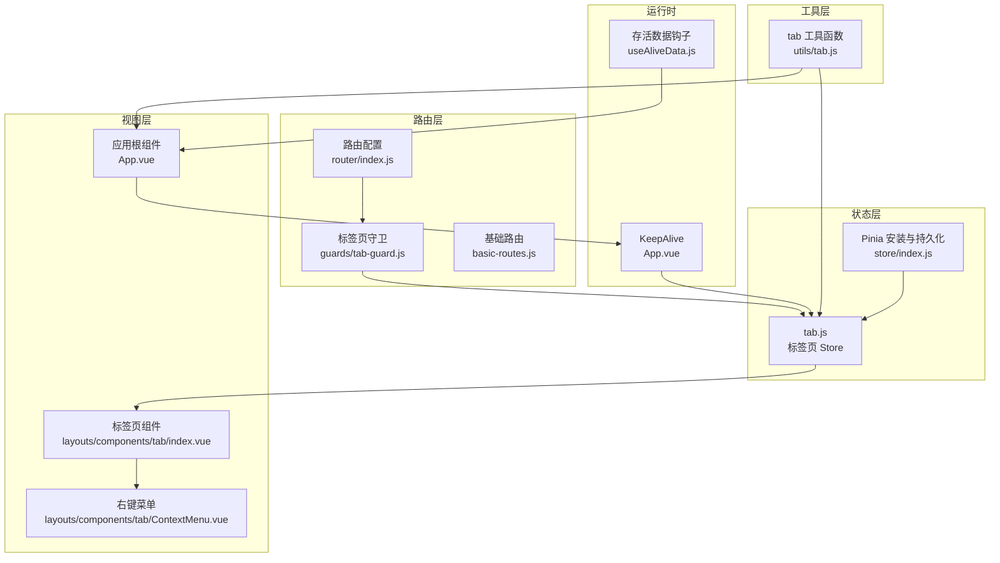
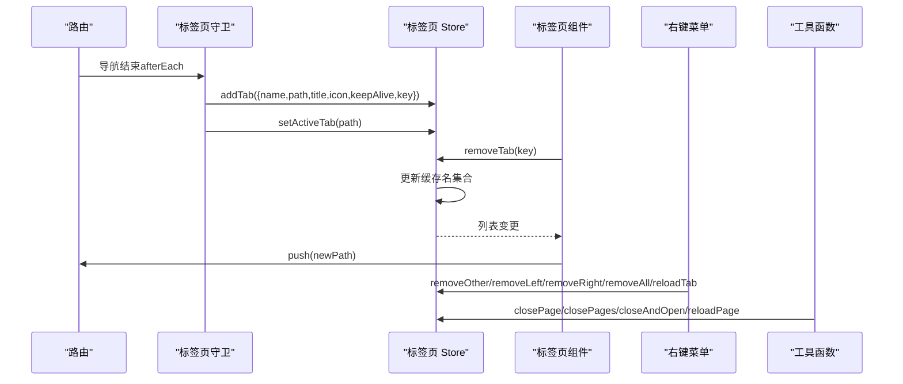
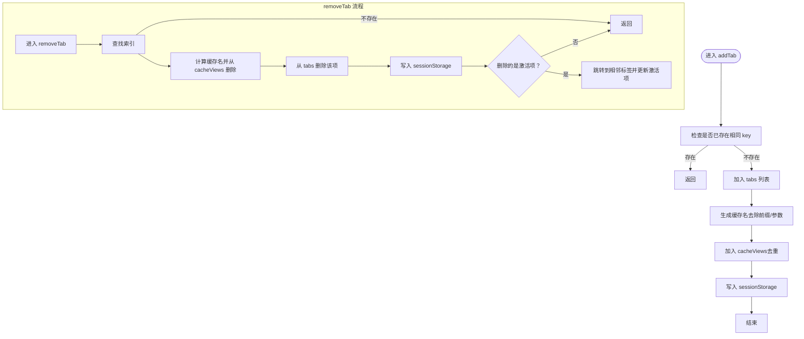
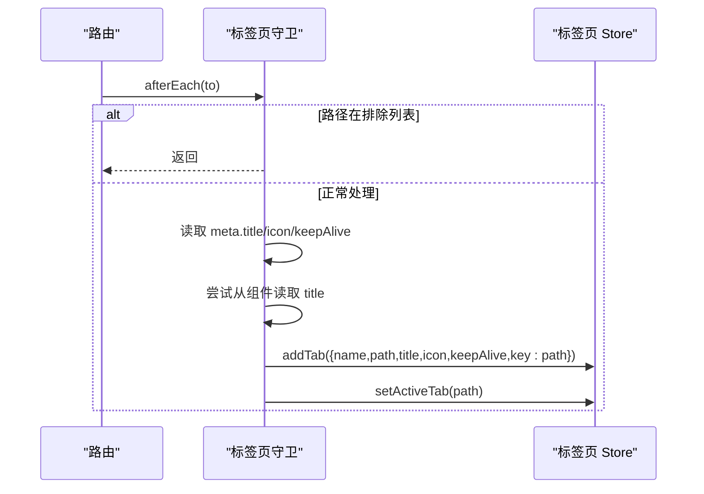
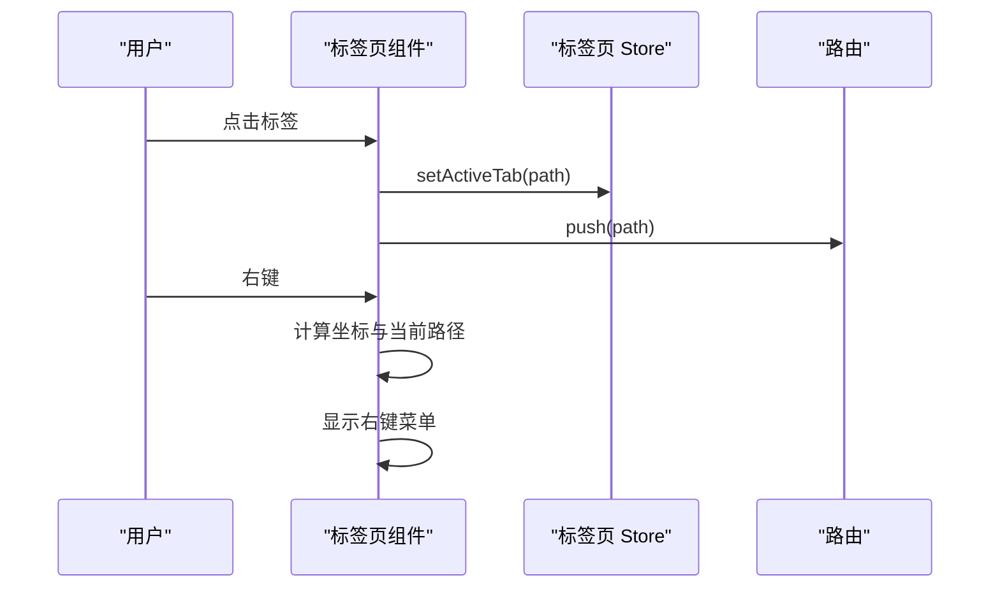
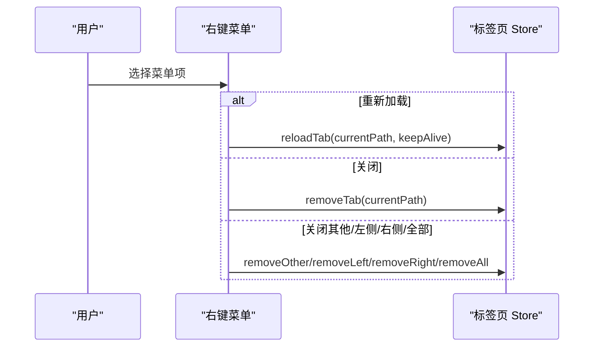
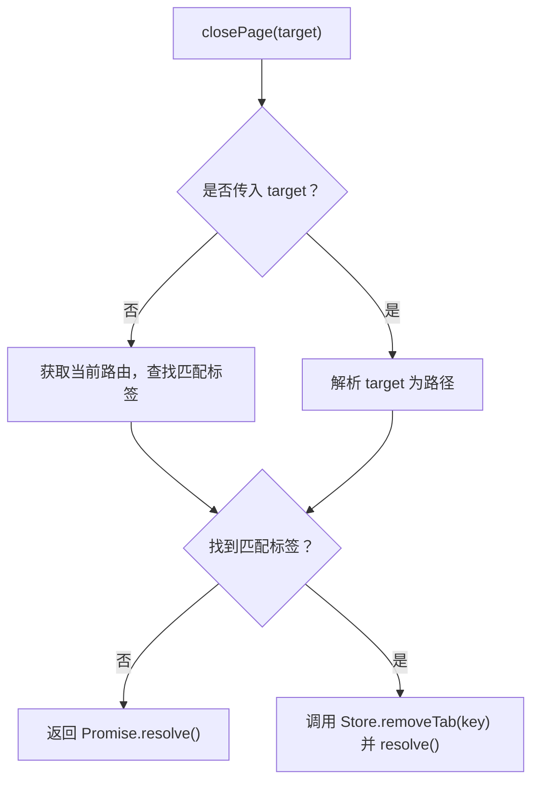
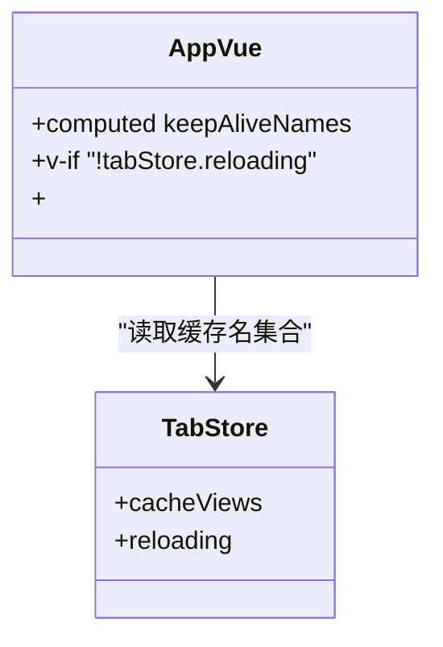
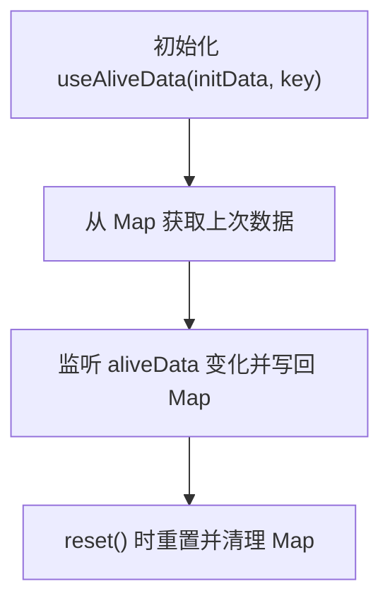
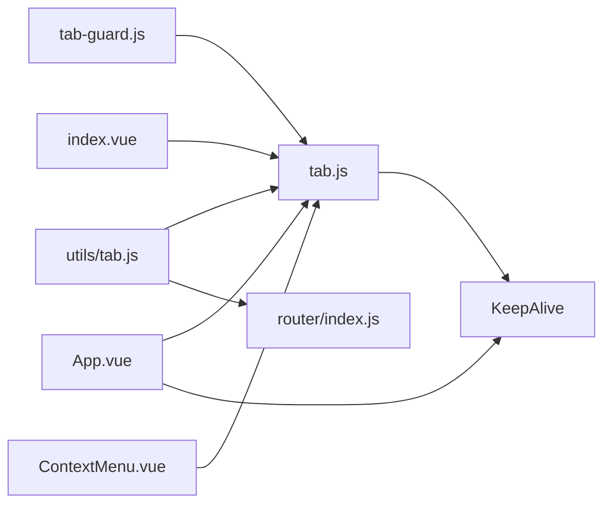

# 标签页状态管理

<cite>
**本文引用的文件**
- [tab.js](file://forge-admin-ui/src/store/modules/tab.js)
- [tab 工具函数](file://forge-admin-ui/src/utils/tab.js)
- [标签页守卫](file://forge-admin-ui/src/router/guards/tab-guard.js)
- [标签页组件](file://forge-admin-ui/src/layouts/components/tab/index.vue)
- [标签页右键菜单](file://forge-admin-ui/src/layouts/components/tab/ContextMenu.vue)
- [应用根组件](file://forge-admin-ui/src/App.vue)
- [路由守卫入口](file://forge-admin-ui/src/router/guards/index.js)
- [路由配置](file://forge-admin-ui/src/router/index.js)
- [路由基础配置](file://forge-admin-ui/src/router/basic-routes.js)
- [Pinia 安装与持久化](file://forge-admin-ui/src/store/index.js)
- [存活数据钩子](file://forge-admin-ui/src/composables/useAliveData.js)
</cite>

## 目录
1. [简介](#简介)
2. [项目结构](#项目结构)
3. [核心组件](#核心组件)
4. [架构总览](#架构总览)
5. [详细组件分析](#详细组件分析)
6. [依赖关系分析](#依赖关系分析)
7. [性能考量](#性能考量)
8. [故障排查指南](#故障排查指南)
9. [结论](#结论)
10. [附录：扩展与优化建议](#附录扩展与优化建议)

## 简介
本文件围绕前端工程中的“标签页状态管理”模块进行系统化技术文档整理，重点覆盖以下方面：
- 标签页列表、激活状态、缓存管理、关闭策略
- 标签页生命周期管理、keep-alive 缓存机制、状态同步
- 标签页与页面组件的配合方式、操作事件处理
- 内存优化策略与扩展开发指南
- 用户体验优化建议

## 项目结构
标签页状态管理涉及的核心文件分布如下：
- 状态层：Pinia Store 中的标签页模块与持久化配置
- 路由层：路由守卫负责标签页的创建与去重
- 视图层：标签页 UI 组件与右键菜单
- 工具层：标签页操作工具函数（关闭、刷新、批量关闭等）
- 运行时：应用根组件通过 KeepAlive 与缓存名集合实现缓存控制

图表来源
- [tab.js](file://forge-admin-ui/src/store/modules/tab.js#L1-L174)
- [Pinia 安装与持久化](file://forge-admin-ui/src/store/index.js#L1-L11)
- [标签页守卫](file://forge-admin-ui/src/router/guards/tab-guard.js#L1-L41)
- [路由配置](file://forge-admin-ui/src/router/index.js#L1-L18)
- [路由基础配置](file://forge-admin-ui/src/router/basic-routes.js#L1-L86)
- [标签页组件](file://forge-admin-ui/src/layouts/components/tab/index.vue#L1-L94)
- [标签页右键菜单](file://forge-admin-ui/src/layouts/components/tab/ContextMenu.vue#L1-L131)
- [应用根组件](file://forge-admin-ui/src/App.vue#L1-L150)
- [tab 工具函数](file://forge-admin-ui/src/utils/tab.js#L1-L226)
- [存活数据钩子](file://forge-admin-ui/src/composables/useAliveData.js#L1-L22)

章节来源
- [tab.js](file://forge-admin-ui/src/store/modules/tab.js#L1-L174)
- [标签页守卫](file://forge-admin-ui/src/router/guards/tab-guard.js#L1-L41)
- [标签页组件](file://forge-admin-ui/src/layouts/components/tab/index.vue#L1-L94)
- [标签页右键菜单](file://forge-admin-ui/src/layouts/components/tab/ContextMenu.vue#L1-L131)
- [应用根组件](file://forge-admin-ui/src/App.vue#L1-L150)
- [tab 工具函数](file://forge-admin-ui/src/utils/tab.js#L1-L226)
- [Pinia 安装与持久化](file://forge-admin-ui/src/store/index.js#L1-L11)
- [路由配置](file://forge-admin-ui/src/router/index.js#L1-L18)
- [路由基础配置](file://forge-admin-ui/src/router/basic-routes.js#L1-L86)
- [存活数据钩子](file://forge-admin-ui/src/composables/useAliveData.js#L1-L22)

## 核心组件
- 标签页 Store（tab.js）：维护标签页列表、激活项、缓存名集合、刷新状态，并提供增删改查与批量关闭等动作。
- 标签页守卫（tab-guard.js）：在路由跳转后自动创建/更新标签页，避免重复添加，记录标题、图标、keepAlive 等元信息。
- 标签页 UI 组件（index.vue）：展示标签页、处理点击与关闭、弹出右键菜单。
- 右键菜单（ContextMenu.vue）：提供刷新、关闭、关闭其他、关闭左右侧、关闭全部等上下文操作。
- 标签页工具函数（utils/tab.js）：对外暴露关闭单个/多个、关闭并打开、刷新、关闭其他/左右/全部等 API。
- 应用根组件（App.vue）：通过 KeepAlive 的 include 动态绑定缓存名集合，结合 Store 的缓存名列表实现按需缓存。

章节来源
- [tab.js](file://forge-admin-ui/src/store/modules/tab.js#L1-L174)
- [标签页守卫](file://forge-admin-ui/src/router/guards/tab-guard.js#L1-L41)
- [标签页组件](file://forge-admin-ui/src/layouts/components/tab/index.vue#L1-L94)
- [标签页右键菜单](file://forge-admin-ui/src/layouts/components/tab/ContextMenu.vue#L1-L131)
- [tab 工具函数](file://forge-admin-ui/src/utils/tab.js#L1-L226)
- [应用根组件](file://forge-admin-ui/src/App.vue#L1-L150)

## 架构总览
标签页状态管理采用“路由守卫驱动 + Pinia 状态 + KeepAlive 缓存”的架构：
- 路由守卫负责在每次导航后创建/更新标签页，避免重复；同时从路由元信息中提取标题、图标、keepAlive 等。
- Store 维护标签页列表与激活项，并生成缓存名集合；关闭标签时同步更新缓存名集合。
- UI 组件负责交互与上下文菜单；工具函数提供便捷 API。
- 应用根组件通过 KeepAlive 的 include 绑定缓存名集合，实现按标签页粒度的缓存控制。

图表来源
- [标签页守卫](file://forge-admin-ui/src/router/guards/tab-guard.js#L1-L41)
- [tab.js](file://forge-admin-ui/src/store/modules/tab.js#L1-L174)
- [标签页组件](file://forge-admin-ui/src/layouts/components/tab/index.vue#L1-L94)
- [标签页右键菜单](file://forge-admin-ui/src/layouts/components/tab/ContextMenu.vue#L1-L131)
- [tab 工具函数](file://forge-admin-ui/src/utils/tab.js#L1-L226)

## 详细组件分析

### 标签页 Store（tab.js）
- 状态字段
  - tabs：标签页列表，包含 name、path、title、icon、keepAlive、key 等
  - activeTab：当前激活的标签页 key
  - cacheViews：按路径规则转换后的缓存名集合（如 /system/user → system-user），用于 KeepAlive include
  - reloading：刷新过程中的中间态，避免渲染闪烁
- 关键行为
  - addTab：去重后加入列表，同时生成缓存名并写入缓存集合
  - removeTab：删除对应标签并同步缓存名集合；若删除的是激活项，自动跳转到相邻标签
  - removeOther/removeLeft/removeRight：按范围过滤标签并重建缓存名集合
  - removeAll：清空标签与缓存名集合，跳转首页
  - reloadTab：当目标页面为 keepAlive 时，临时移除其 keepAlive 属性以触发重新渲染，随后恢复
  - 持久化：仅持久化 tabs 字段到 sessionStorage，键名包含租户标识
- 复杂度与性能
  - 列表查找与更新主要为 O(n)，在标签数量可控范围内性能可接受
  - 缓存名集合与标签列表同步，避免冗余缓存占用内存

图表来源
- [tab.js](file://forge-admin-ui/src/store/modules/tab.js#L26-L66)
- [tab.js](file://forge-admin-ui/src/store/modules/tab.js#L141-L164)

章节来源
- [tab.js](file://forge-admin-ui/src/store/modules/tab.js#L1-L174)

### 标签页守卫（tab-guard.js）
- 职责
  - 导航结束后创建标签页，避免重复
  - 从路由元信息与组件默认导出中读取标题，兼容异步组件
  - 记录 icon、keepAlive 等元信息
  - 设置激活项为当前路径
- 关键点
  - 排除特定路径（如 404、403、登录页）
  - 使用 path 作为 key，保证唯一性
  - 避免重复添加相同 path 的标签

图表来源
- [标签页守卫](file://forge-admin-ui/src/router/guards/tab-guard.js#L1-L41)

章节来源
- [标签页守卫](file://forge-admin-ui/src/router/guards/tab-guard.js#L1-L41)

### 标签页 UI 组件（index.vue）
- 功能
  - 展示标签页列表，支持可关闭（当标签数大于 1）
  - 点击切换激活项并跳转
  - 右键弹出上下文菜单
- 交互
  - 通过 Store 的 removeTab 实现关闭
  - 通过 Store 的 setActiveTab 与路由 push 实现切换

图表来源
- [标签页组件](file://forge-admin-ui/src/layouts/components/tab/index.vue#L1-L94)

章节来源
- [标签页组件](file://forge-admin-ui/src/layouts/components/tab/index.vue#L1-L94)

### 标签页右键菜单（ContextMenu.vue）
- 功能
  - 提供“重新加载、关闭、关闭其他、关闭左侧、关闭右侧、关闭全部”
  - 根据当前激活项与标签数量动态禁用部分选项
- 与 Store 的交互
  - 调用 Store 的 removeOther/removeLeft/removeRight/removeAll/reloadTab 等动作
  - 通过路由元信息判断目标页面是否为 keepAlive

图表来源
- [标签页右键菜单](file://forge-admin-ui/src/layouts/components/tab/ContextMenu.vue#L1-L131)

章节来源
- [标签页右键菜单](file://forge-admin-ui/src/layouts/components/tab/ContextMenu.vue#L1-L131)

### 标签页工具函数（utils/tab.js）
- 对外 API
  - closePage：关闭单个标签（支持字符串路径或对象）
  - closePages：批量关闭
  - closeAndOpen：关闭旧标签并打开新标签
  - reloadPage：刷新当前或指定标签
  - closeOtherPages/closeLeftPages/closeRightPages/closeAllPages：按范围或全部关闭
- 设计要点
  - 支持精确匹配与前缀匹配（便于处理带查询参数的路径）
  - 与 Store 和路由协同工作，保证状态一致性

图表来源
- [tab 工具函数](file://forge-admin-ui/src/utils/tab.js#L36-L77)

章节来源
- [tab 工具函数](file://forge-admin-ui/src/utils/tab.js#L1-L226)

### 应用根组件与 KeepAlive（App.vue）
- KeepAlive 控制
  - 通过 computed 将 keepAliveNames 绑定为 Store 的 cacheViews
  - 在标签页刷新期间（reloading）禁用 KeepAlive，避免闪烁
- 布局与主题
  - 动态加载布局组件，减少布局切换闪烁
  - 主题与响应式字体配置

图表来源
- [应用根组件](file://forge-admin-ui/src/App.vue#L95-L99)
- [应用根组件](file://forge-admin-ui/src/App.vue#L20-L22)
- [tab.js](file://forge-admin-ui/src/store/modules/tab.js#L141-L164)

章节来源
- [应用根组件](file://forge-admin-ui/src/App.vue#L1-L150)
- [tab.js](file://forge-admin-ui/src/store/modules/tab.js#L1-L174)

### 存活数据钩子（useAliveData.js）
- 作用
  - 在页面切换或标签关闭时，保持关键数据在组件实例间传递
  - 通过 Map 记录上次数据并在新实例中恢复
- 适用场景
  - 表单编辑、搜索条件、分页状态等需要跨标签页保留的数据

图表来源
- [存活数据钩子](file://forge-admin-ui/src/composables/useAliveData.js#L1-L22)

章节来源
- [存活数据钩子](file://forge-admin-ui/src/composables/useAliveData.js#L1-L22)

## 依赖关系分析
- 路由守卫依赖 Store 创建标签页，Store 依赖路由实例进行跳转
- UI 组件依赖 Store 进行状态读写，右键菜单直接调用 Store 动作
- 工具函数封装了常用操作，内部统一调用 Store 与路由
- KeepAlive 依赖 Store 的缓存名集合，实现按标签页粒度的缓存控制

图表来源
- [标签页守卫](file://forge-admin-ui/src/router/guards/tab-guard.js#L1-L41)
- [tab.js](file://forge-admin-ui/src/store/modules/tab.js#L1-L174)
- [标签页组件](file://forge-admin-ui/src/layouts/components/tab/index.vue#L1-L94)
- [标签页右键菜单](file://forge-admin-ui/src/layouts/components/tab/ContextMenu.vue#L1-L131)
- [tab 工具函数](file://forge-admin-ui/src/utils/tab.js#L1-L226)
- [路由配置](file://forge-admin-ui/src/router/index.js#L1-L18)
- [应用根组件](file://forge-admin-ui/src/App.vue#L1-L150)

章节来源
- [路由守卫入口](file://forge-admin-ui/src/router/guards/index.js#L1-L11)
- [路由配置](file://forge-admin-ui/src/router/index.js#L1-L18)
- [路由基础配置](file://forge-admin-ui/src/router/basic-routes.js#L1-L86)
- [Pinia 安装与持久化](file://forge-admin-ui/src/store/index.js#L1-L11)

## 性能考量
- 标签页数量控制
  - 通过“关闭其他/左侧/右侧/全部”限制标签数量，降低 DOM 与缓存压力
- 缓存策略
  - 仅对 keepAlive 的页面进行缓存，避免非必要组件缓存
  - 通过 cacheViews 精准控制缓存集合，减少内存占用
- 刷新流程
  - 刷新时设置 reloading，禁用 KeepAlive，避免闪烁与重复渲染
- 数据持久化
  - 仅持久化 tabs，避免存储过多状态，提升启动速度

[本节为通用性能建议，无需列出具体文件来源]

## 故障排查指南
- 标签页重复出现
  - 检查守卫是否正确使用 path 作为 key，避免同路径重复添加
  - 确认路由元信息中 title/icon/keepAlive 是否正确设置
- 标签页关闭后未跳转
  - 确认 removeTab 后是否执行了路由 push 与 setActiveTab
  - 检查是否删除的是激活项，应自动跳转到相邻标签
- 刷新无效或闪烁
  - 确认 reloadTab 是否正确处理 keepAlive 场景
  - 检查 App.vue 中 reloading 条件与 KeepAlive 的组合
- 右键菜单不可用
  - 检查当前标签数量与激活项状态，部分菜单项会根据条件禁用
- 缓存未生效
  - 确认 cacheViews 是否包含目标页面的缓存名
  - 检查页面是否声明 keepAlive 或在路由 meta 中设置

章节来源
- [标签页守卫](file://forge-admin-ui/src/router/guards/tab-guard.js#L1-L41)
- [tab.js](file://forge-admin-ui/src/store/modules/tab.js#L42-L66)
- [应用根组件](file://forge-admin-ui/src/App.vue#L20-L22)
- [标签页右键菜单](file://forge-admin-ui/src/layouts/components/tab/ContextMenu.vue#L1-L131)

## 结论
该标签页状态管理模块通过路由守卫驱动、Pinia 状态管理与 KeepAlive 缓存三者协同，实现了：
- 标签页生命周期的自动化管理
- 精准的缓存控制与内存优化
- 丰富的关闭策略与刷新机制
- 与页面组件的无缝配合与良好的用户体验

[本节为总结性内容，无需列出具体文件来源]

## 附录：扩展与优化建议
- 扩展点
  - 标签页排序与拖拽：在 UI 层增加拖拽交互，Store 中维护顺序字段
  - 标签页分组与标签页组：支持按模块或业务线分组，提供组内关闭与切换
  - 标签页预加载：在用户即将访问的路径上提前生成标签与缓存
  - 标签页图标与颜色：支持自定义图标与颜色，增强识别度
- 用户体验优化
  - 右键菜单快捷键：支持键盘快捷键快速执行常用操作
  - 标签页滚动与吸附：支持横向滚动与标签吸附，避免遮挡
  - 标签页提示：对长时间未操作的标签页提供提示或自动回收
- 内存与性能
  - 限制最大标签数，超过阈值自动回收最旧标签
  - 对非 keepAlive 页面提供“仅缓存数据不缓存组件”的策略（结合 useAliveData）

[本节为通用建议，无需列出具体文件来源]