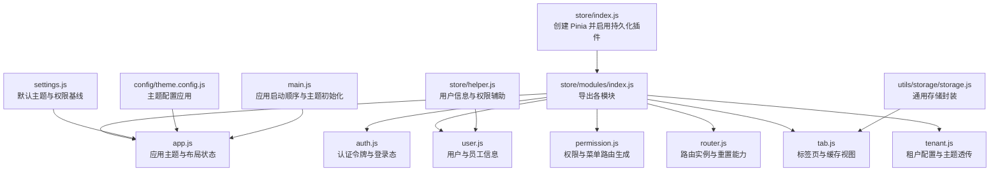
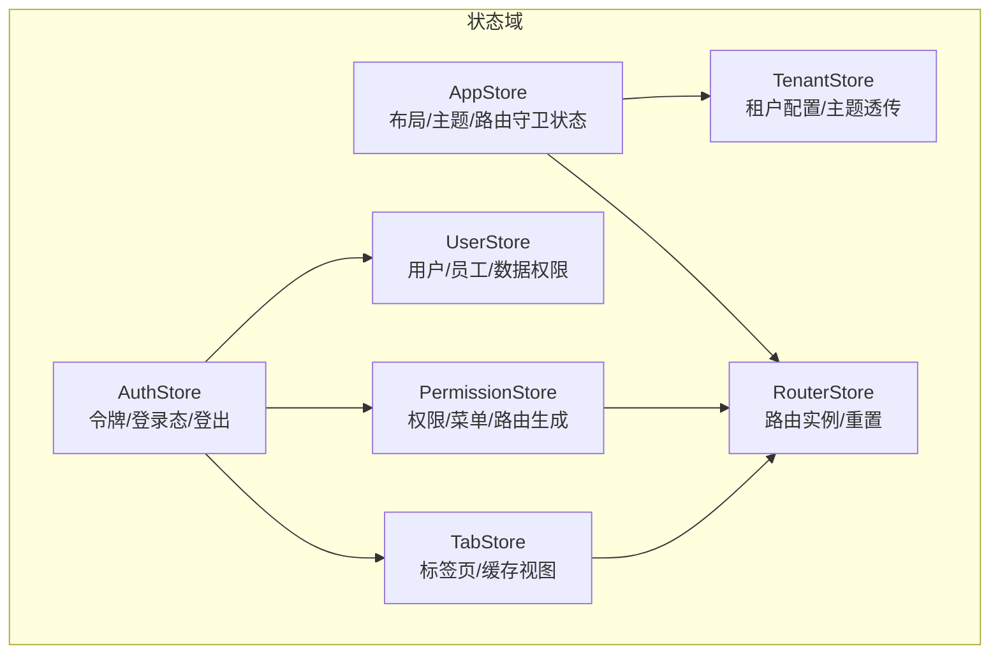
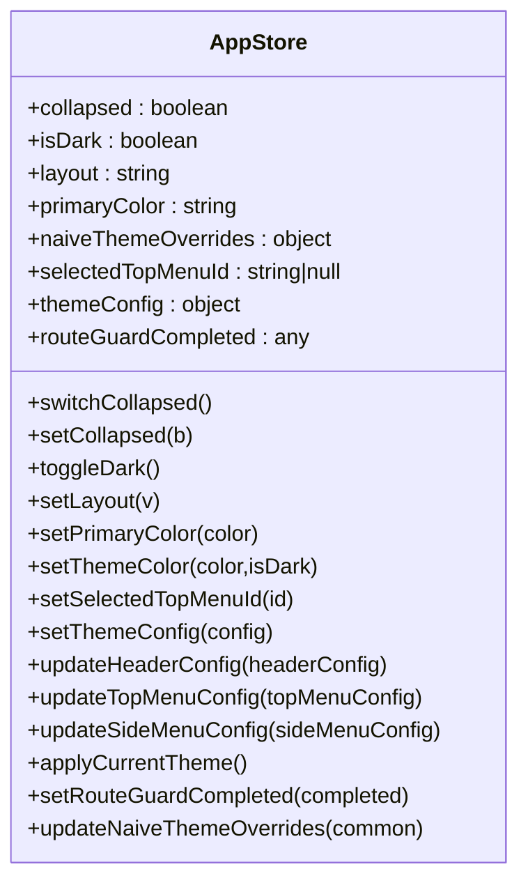
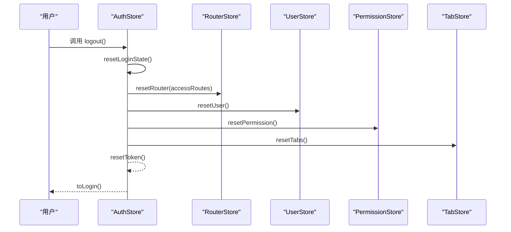
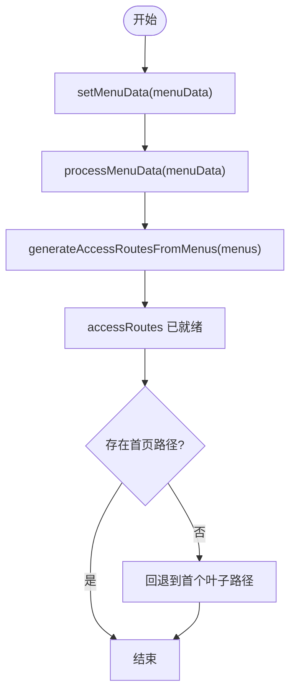
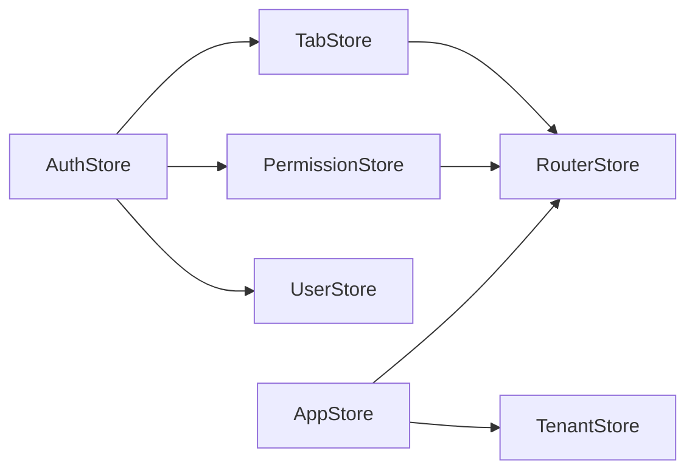

# 状态管理

<cite>
**本文引用的文件**
- [forge-admin-ui/src/store/index.js](file://forge-admin-ui/src/store/index.js)
- [forge-admin-ui/src/store/modules/index.js](file://forge-admin-ui/src/store/modules/index.js)
- [forge-admin-ui/src/store/modules/app.js](file://forge-admin-ui/src/store/modules/app.js)
- [forge-admin-ui/src/store/modules/auth.js](file://forge-admin-ui/src/store/modules/auth.js)
- [forge-admin-ui/src/store/modules/user.js](file://forge-admin-ui/src/store/modules/user.js)
- [forge-admin-ui/src/store/modules/permission.js](file://forge-admin-ui/src/store/modules/permission.js)
- [forge-admin-ui/src/store/modules/router.js](file://forge-admin-ui/src/store/modules/router.js)
- [forge-admin-ui/src/store/modules/tab.js](file://forge-admin-ui/src/store/modules/tab.js)
- [forge-admin-ui/src/store/modules/tenant.js](file://forge-admin-ui/src/store/modules/tenant.js)
- [forge-admin-ui/src/store/helper.js](file://forge-admin-ui/src/store/helper.js)
- [forge-admin-ui/src/settings.js](file://forge-admin-ui/src/settings.js)
- [forge-admin-ui/src/config/theme.config.js](file://forge-admin-ui/src/config/theme.config.js)
- [forge-admin-ui/src/utils/storage/storage.js](file://forge-admin-ui/src/utils/storage/storage.js)
- [forge-admin-ui/src/main.js](file://forge-admin-ui/src/main.js)
</cite>

## 目录
1. [引言](#引言)
2. [项目结构](#项目结构)
3. [核心组件](#核心组件)
4. [架构总览](#架构总览)
5. [详细组件分析](#详细组件分析)
6. [依赖关系分析](#依赖关系分析)
7. [性能考量](#性能考量)
8. [故障排查指南](#故障排查指南)
9. [结论](#结论)
10. [附录](#附录)

## 引言
本文件系统性梳理 Forge 前端基于 Pinia 的状态管理架构，覆盖 store 模块划分、状态结构设计、action 实现与使用方式；深入解析应用状态、用户状态、权限状态、路由状态等核心模块；说明状态持久化策略、状态同步机制与异步处理；并提供最佳实践、性能优化建议与调试技巧，以及扩展开发指南。

## 项目结构
Forge 前端采用按功能域划分的 store 模块组织方式，入口集中于 store/index.js，模块导出统一通过 modules/index.js 聚合，便于按需引入与组合使用。

图表来源
- [forge-admin-ui/src/store/index.js](file://forge-admin-ui/src/store/index.js#L1-L11)
- [forge-admin-ui/src/store/modules/index.js](file://forge-admin-ui/src/store/modules/index.js#L1-L8)
- [forge-admin-ui/src/store/modules/app.js](file://forge-admin-ui/src/store/modules/app.js#L1-L91)
- [forge-admin-ui/src/store/modules/auth.js](file://forge-admin-ui/src/store/modules/auth.js#L1-L78)
- [forge-admin-ui/src/store/modules/user.js](file://forge-admin-ui/src/store/modules/user.js#L1-L118)
- [forge-admin-ui/src/store/modules/permission.js](file://forge-admin-ui/src/store/modules/permission.js#L1-L269)
- [forge-admin-ui/src/store/modules/router.js](file://forge-admin-ui/src/store/modules/router.js#L1-L19)
- [forge-admin-ui/src/store/modules/tab.js](file://forge-admin-ui/src/store/modules/tab.js#L1-L174)
- [forge-admin-ui/src/store/modules/tenant.js](file://forge-admin-ui/src/store/modules/tenant.js#L1-L83)
- [forge-admin-ui/src/store/helper.js](file://forge-admin-ui/src/store/helper.js#L1-L57)
- [forge-admin-ui/src/settings.js](file://forge-admin-ui/src/settings.js#L1-L75)
- [forge-admin-ui/src/config/theme.config.js](file://forge-admin-ui/src/config/theme.config.js#L1-L164)
- [forge-admin-ui/src/utils/storage/storage.js](file://forge-admin-ui/src/utils/storage/storage.js#L1-L59)
- [forge-admin-ui/src/main.js](file://forge-admin-ui/src/main.js#L1-L37)

章节来源
- [forge-admin-ui/src/store/index.js](file://forge-admin-ui/src/store/index.js#L1-L11)
- [forge-admin-ui/src/store/modules/index.js](file://forge-admin-ui/src/store/modules/index.js#L1-L8)

## 核心组件
- Pinia 容器与持久化
  - 在 store/index.js 中创建 Pinia 并安装持久化插件，统一注入应用。
  - 各模块通过自身定义的 persist 配置选择 sessionStorage 或内存状态。
- 模块聚合导出
  - modules/index.js 将 app、auth、permission、router、tab、tenant、user 等模块集中导出，便于按需引入。
- 辅助工具
  - helper.js 提供 getUserInfo、getPermissions 等异步辅助方法，解耦业务与状态。

章节来源
- [forge-admin-ui/src/store/index.js](file://forge-admin-ui/src/store/index.js#L1-L11)
- [forge-admin-ui/src/store/modules/index.js](file://forge-admin-ui/src/store/modules/index.js#L1-L8)
- [forge-admin-ui/src/store/helper.js](file://forge-admin-ui/src/store/helper.js#L1-L57)

## 架构总览
Forge 前端状态管理围绕“应用态 + 认证态 + 用户态 + 权限态 + 路由态 + 标签页态 + 租户态”构建，形成清晰的职责边界与交互关系。

图表来源
- [forge-admin-ui/src/store/modules/app.js](file://forge-admin-ui/src/store/modules/app.js#L1-L91)
- [forge-admin-ui/src/store/modules/auth.js](file://forge-admin-ui/src/store/modules/auth.js#L1-L78)
- [forge-admin-ui/src/store/modules/user.js](file://forge-admin-ui/src/store/modules/user.js#L1-L118)
- [forge-admin-ui/src/store/modules/permission.js](file://forge-admin-ui/src/store/modules/permission.js#L1-L269)
- [forge-admin-ui/src/store/modules/router.js](file://forge-admin-ui/src/store/modules/router.js#L1-L19)
- [forge-admin-ui/src/store/modules/tab.js](file://forge-admin-ui/src/store/modules/tab.js#L1-L174)
- [forge-admin-ui/src/store/modules/tenant.js](file://forge-admin-ui/src/store/modules/tenant.js#L1-L83)

## 详细组件分析

### 应用状态模块（AppStore）
- 职责
  - 管理布局、主题色、暗色模式、顶部菜单选中态、Naive UI 主题覆盖、路由守卫完成标记等。
- 关键状态
  - collapsed、isDark、layout、primaryColor、naiveThemeOverrides、selectedTopMenuId、themeConfig、routeGuardCompleted。
- 关键动作
  - 切换折叠、设置折叠、切换暗色、设置布局、设置主色并生成主题变量、设置主题配置并应用、更新头部/顶部/侧边菜单配置、应用当前主题、设置路由守卫完成状态、更新 Naive 主题覆盖。
- 持久化
  - 使用 sessionStorage，pick 选定字段，key 带租户前缀，避免多租户冲突。
- 与主题系统联动
  - 通过 generate 生成色阶，写入 CSS 变量；applyThemeConfig 将配置映射到 --layout-header-*、--top-menu-*、--side-menu-* 等变量。

图表来源
- [forge-admin-ui/src/store/modules/app.js](file://forge-admin-ui/src/store/modules/app.js#L7-L91)
- [forge-admin-ui/src/config/theme.config.js](file://forge-admin-ui/src/config/theme.config.js#L105-L163)

章节来源
- [forge-admin-ui/src/store/modules/app.js](file://forge-admin-ui/src/store/modules/app.js#L1-L91)
- [forge-admin-ui/src/config/theme.config.js](file://forge-admin-ui/src/config/theme.config.js#L1-L164)
- [forge-admin-ui/src/settings.js](file://forge-admin-ui/src/settings.js#L21-L31)

### 认证状态模块（AuthStore）
- 职责
  - 维护访问令牌、用户信息、员工信息；提供请求头生成器；支持登录跳转、角色切换、登出与全量状态重置。
- 关键状态
  - accessToken、userInfo、staffInfo。
- 关键 getter
  - getAuthHeaders：根据令牌动态生成 Authorization 头。
- 关键动作
  - setToken：设置令牌（兼容新旧结构）。
  - resetToken：重置自身状态。
  - toLogin：跳转登录页并携带当前路由参数。
  - switchCurrentRole：重置登录态后设置新令牌。
  - resetLoginState：重置用户、路由、权限、标签页、WebSocket、令牌与密钥交换。
  - logout：调用 resetLoginState 后跳转登录。
- 持久化
  - 未显式 pick 字段，默认持久化全部；key 带租户前缀。

图表来源
- [forge-admin-ui/src/store/modules/auth.js](file://forge-admin-ui/src/store/modules/auth.js#L37-L72)
- [forge-admin-ui/src/store/modules/router.js](file://forge-admin-ui/src/store/modules/router.js#L7-L11)
- [forge-admin-ui/src/store/modules/user.js](file://forge-admin-ui/src/store/modules/user.js#L110-L112)
- [forge-admin-ui/src/store/modules/permission.js](file://forge-admin-ui/src/store/modules/permission.js#L264-L266)
- [forge-admin-ui/src/store/modules/tab.js](file://forge-admin-ui/src/store/modules/tab.js#L165-L167)

章节来源
- [forge-admin-ui/src/store/modules/auth.js](file://forge-admin-ui/src/store/modules/auth.js#L1-L78)

### 用户状态模块（UserStore）
- 职责
  - 存储用户与员工信息、数据权限；提供多种派生 getter（如 userId、username、realName、avatar、roles、permissions 等），兼容旧版结构。
- 关键状态
  - userInfo、staffInfo、dataPermission。
- 关键 getter
  - 用户标识、姓名、头像、邮箱电话、用户类型、管理员标识、租户管理员标识、员工信息、数据权限、角色与权限集合。
- 关键动作
  - setUser：接收完整用户对象或兼容旧结构，自动解析 staffInfo 与 dataPermission。
  - resetUser：重置状态。
- 持久化
  - 未显式 pick 字段，默认持久化全部；key 带租户前缀。

章节来源
- [forge-admin-ui/src/store/modules/user.js](file://forge-admin-ui/src/store/modules/user.js#L1-L118)

### 权限状态模块（PermissionStore）
- 职责
  - 维护权限集合、菜单树、生成 accessRoutes；支持从新菜单结构（UserResourceTreeVO）转换为前端路由；维护菜单数据加载状态。
- 关键状态
  - accessRoutes、permissions、menus、menuDataLoaded。
- 关键动作
  - setPermissions：从权限集合映射菜单并排序。
  - setMenuData：处理新菜单结构，生成 menus 与 accessRoutes，并设置菜单数据加载完成标记；若未找到首页路径则回退到首个叶子路径。
  - resetMenuDataLoaded：重置菜单数据加载状态。
  - generateAccessRoutesFromMenus：从菜单数据生成路由数组（含 keepAlive、redirect、perms 等元信息）。
  - processMenuData：将后端资源树转换为前端菜单结构（过滤按钮与隐藏项、统一 component 路径、设置 meta 与排序）。
  - transformMenusForSidebar：直接返回处理后的菜单（简化版）。
  - getMenuItem/generateRoute：生成单个菜单项对应的路由。
  - resetPermission：重置状态。
- 与路由集成
  - 生成的 accessRoutes 交由 RouterStore.resetRouter 执行移除操作，实现动态路由重置。

图表来源
- [forge-admin-ui/src/store/modules/permission.js](file://forge-admin-ui/src/store/modules/permission.js#L23-L71)
- [forge-admin-ui/src/store/modules/permission.js](file://forge-admin-ui/src/store/modules/permission.js#L132-L204)
- [forge-admin-ui/src/store/modules/permission.js](file://forge-admin-ui/src/store/modules/permission.js#L78-L130)

章节来源
- [forge-admin-ui/src/store/modules/permission.js](file://forge-admin-ui/src/store/modules/permission.js#L1-L269)

### 路由状态模块（RouterStore）
- 职责
  - 暴露 router、route 实例与 resetRouter 能力，用于动态移除已注册路由。
- 关键动作
  - resetRouter：遍历 accessRoutes，对已存在的路由名称执行移除。

章节来源
- [forge-admin-ui/src/store/modules/router.js](file://forge-admin-ui/src/store/modules/router.js#L1-L19)

### 标签页状态模块（TabStore）
- 职责
  - 维护标签页列表、活动标签、页面刷新状态与缓存视图列表；提供增删改查与批量清理操作；支持标签页刷新。
- 关键状态
  - tabs、activeTab、reloading、cacheViews。
- 关键动作
  - setTabs/addTab/removeTab/removeOther/removeLeft/removeRight/removeAll/reloadTab/resetTabs。
  - removeTab/removeOther/removeLeft/removeRight：在删除标签时同步更新 cacheViews。
  - reloadTab：对 keepAlive 页面进行临时移除再恢复，触发重新渲染。
- 持久化
  - 使用 sessionStorage，pick 仅 tabs 字段，key 带租户前缀。

章节来源
- [forge-admin-ui/src/store/modules/tab.js](file://forge-admin-ui/src/store/modules/tab.js#L1-L174)

### 租户状态模块（TenantStore）
- 职责
  - 加载并持有租户配置（系统名、Logo、浏览器标题/图标、布局、主题、版权等），并提供主题配置解析 getter。
- 关键 getter
  - systemName、systemLogo、browserTitle、browserIcon、systemLayout、systemTheme、systemIntro、copyrightInfo、themeConfig（字符串或对象解析）。
- 关键动作
  - loadTenantConfig：支持传入租户 ID 或从用户信息推断；成功时写入 config。
  - clearTenantConfig：清空配置。
- 持久化
  - 使用 sessionStorage，pick 仅 config 字段，key 带租户前缀。

章节来源
- [forge-admin-ui/src/store/modules/tenant.js](file://forge-admin-ui/src/store/modules/tenant.js#L1-L83)

### 辅助模块（helper.js）
- 职责
  - 提供 getUserInfo：适配新旧用户接口返回结构，统一输出标准字段集；提供 getPermissions：返回基础权限集合（兼容旧逻辑）。
- 与用户模块协作
  - 在登录后调用 setUser 之前，先通过 getUserInfo 获取标准化用户信息。

章节来源
- [forge-admin-ui/src/store/helper.js](file://forge-admin-ui/src/store/helper.js#L1-L57)
- [forge-admin-ui/src/settings.js](file://forge-admin-ui/src/settings.js#L1-L19)

## 依赖关系分析
- 模块内聚与耦合
  - AppStore 与 TenantStore 通过主题配置联动；AuthStore 在登出/切换角色时协调 UserStore、PermissionStore、TabStore、RouterStore 与 WebSocket/密钥交换状态。
  - PermissionStore 生成 accessRoutes 并交由 RouterStore 执行移除；TabStore 与 RouterStore 协同维护标签页与路由跳转。
- 外部依赖
  - @arco-design/color 用于生成主题色阶；@vueuse/core 提供 useDark、hyphenate；pinia-plugin-persistedstate 提供持久化能力；Naive UI 主题覆盖。
- 潜在循环依赖
  - 模块间通过 store 导入延迟（动态 import）避免循环；例如 TenantStore 在运行时按需导入 UserStore。

图表来源
- [forge-admin-ui/src/store/modules/auth.js](file://forge-admin-ui/src/store/modules/auth.js#L2-L6)
- [forge-admin-ui/src/store/modules/permission.js](file://forge-admin-ui/src/store/modules/permission.js#L1-L2)
- [forge-admin-ui/src/store/modules/router.js](file://forge-admin-ui/src/store/modules/router.js#L3-L5)
- [forge-admin-ui/src/store/modules/tab.js](file://forge-admin-ui/src/store/modules/tab.js#L1-L5)
- [forge-admin-ui/src/store/modules/app.js](file://forge-admin-ui/src/store/modules/app.js#L1-L6)
- [forge-admin-ui/src/store/modules/tenant.js](file://forge-admin-ui/src/store/modules/tenant.js#L1-L3)

## 性能考量
- 状态拆分与按需读取
  - 将布局、主题、路由、标签页、租户等状态分离，避免无关状态变更引发的 UI 重渲染。
- 持久化粒度控制
  - 仅对必要字段持久化（如 TabStore 的 tabs、TenantStore 的 config），减少存储体积与序列化开销。
- 动态路由与缓存视图
  - TabStore 在标签页增删时同步维护 cacheViews，避免无效缓存累积；reloadTab 对 keepAlive 页面进行最小化刷新。
- 主题计算与 CSS 变量
  - 主题色通过 generate 一次性计算并写入 CSS 变量，避免重复计算；applyThemeConfig 分层应用不同布局的主题配置。
- 异步与重置
  - 登出/切换角色时，先 reset 再 replace 路由，避免中间态闪烁；WebSocket 与密钥交换状态同步清理，降低副作用。

## 故障排查指南
- 登录后仍提示未登录
  - 检查 AuthStore.setToken 是否正确设置 accessToken；确认 getAuthHeaders 是否被拦截器使用。
- 菜单不显示或路由未生成
  - 检查 PermissionStore.setMenuData 是否正确传入菜单数据；确认 resourceType 与 visible/menustatus 过滤条件；验证 generateAccessRoutesFromMenus 是否生成有效路由。
- 标签页无法关闭或刷新异常
  - 检查 TabStore.removeTab/removeOther/removeLeft/removeRight 是否同步更新 cacheViews；对 keepAlive 页面使用 reloadTab 触发重新渲染。
- 主题不生效或切换暗色失败
  - 检查 AppStore.setThemeColor 是否调用 generate 并写入 CSS 变量；确认 applyThemeConfig 的 isDark 参数与主题配置是否匹配。
- 租户配置未应用
  - 检查 TenantStore.loadTenantConfig 是否成功返回并写入 config；确认 themeConfig 解析是否为合法 JSON 或对象。
- 调试技巧
  - 使用浏览器开发者工具的 Vuex/Pinia 面板观察状态变化；在关键 action（如 setToken、setUser、setMenuData、reloadTab）处设置断点；利用持久化键（带租户前缀）在本地存储中核对状态快照。

章节来源
- [forge-admin-ui/src/store/modules/auth.js](file://forge-admin-ui/src/store/modules/auth.js#L12-L25)
- [forge-admin-ui/src/store/modules/permission.js](file://forge-admin-ui/src/store/modules/permission.js#L14-L30)
- [forge-admin-ui/src/store/modules/tab.js](file://forge-admin-ui/src/store/modules/tab.js#L141-L164)
- [forge-admin-ui/src/store/modules/app.js](file://forge-admin-ui/src/store/modules/app.js#L34-L58)
- [forge-admin-ui/src/store/modules/tenant.js](file://forge-admin-ui/src/store/modules/tenant.js#L48-L75)

## 结论
Forge 前端以 Pinia 为核心，围绕应用、认证、用户、权限、路由、标签页与租户七大状态域构建了高内聚、低耦合的状态管理体系。通过合理的持久化策略、主题系统联动与动态路由生成，实现了良好的用户体验与可维护性。遵循本文的最佳实践与优化建议，可在复杂场景下保持状态管理的稳定性与性能。

## 附录

### 状态持久化策略
- 存储介质
  - sessionStorage：AppStore、TabStore、TenantStore（pick 限定字段）。
  - 内存：AuthStore、UserStore（未显式 pick，但可通过 reset 控制生命周期）。
- 键命名规则
  - 以 VITE_TENANT 为前缀，避免多租户冲突；模块内部 key 与 pick 字段一致。
- 生命周期
  - 登出/切换角色时，AuthStore 调用各模块 reset 方法，确保状态与存储一致性。

章节来源
- [forge-admin-ui/src/store/modules/app.js](file://forge-admin-ui/src/store/modules/app.js#L85-L89)
- [forge-admin-ui/src/store/modules/tab.js](file://forge-admin-ui/src/store/modules/tab.js#L169-L173)
- [forge-admin-ui/src/store/modules/tenant.js](file://forge-admin-ui/src/store/modules/tenant.js#L77-L81)
- [forge-admin-ui/src/store/modules/auth.js](file://forge-admin-ui/src/store/modules/auth.js#L49-L68)

### 状态同步机制
- 主题同步
  - AppStore.setThemeConfig 与 update*Config 方法调用 applyThemeConfig，将配置映射至 CSS 变量，实现全局样式同步。
- 路由同步
  - PermissionStore 生成 accessRoutes，RouterStore.resetRouter 移除旧路由，保证路由表与菜单/权限一致。
- 标签页同步
  - TabStore 在增删改操作时同步 cacheViews，确保 KeepAlive 行为与 UI 一致。

章节来源
- [forge-admin-ui/src/store/modules/app.js](file://forge-admin-ui/src/store/modules/app.js#L50-L73)
- [forge-admin-ui/src/store/modules/permission.js](file://forge-admin-ui/src/store/modules/permission.js#L78-L130)
- [forge-admin-ui/src/store/modules/router.js](file://forge-admin-ui/src/store/modules/router.js#L7-L11)
- [forge-admin-ui/src/store/modules/tab.js](file://forge-admin-ui/src/store/modules/tab.js#L33-L60)

### 异步状态处理
- 用户信息与权限
  - helper.js 提供 getUserInfo/getPermissions，统一返回结构，供 UserStore/PermissionStore 使用。
- 租户配置
  - TenantStore.loadTenantConfig 支持从用户信息推断租户 ID，异步加载后写入 config。
- 登录流程
  - 登录成功后设置令牌与用户信息，随后生成路由与菜单，最后跳转目标页。

章节来源
- [forge-admin-ui/src/store/helper.js](file://forge-admin-ui/src/store/helper.js#L5-L56)
- [forge-admin-ui/src/store/modules/tenant.js](file://forge-admin-ui/src/store/modules/tenant.js#L49-L75)
- [forge-admin-ui/src/store/modules/auth.js](file://forge-admin-ui/src/store/modules/auth.js#L27-L48)

### 最佳实践
- 状态拆分
  - 将布局、主题、路由、标签页、租户等状态独立模块，避免跨域耦合。
- 动作幂等
  - reset* 方法应保证可重复调用的安全性；登出/切换角色时统一调用 reset 与清理。
- 持久化最小化
  - 仅持久化必要字段，避免冗余存储；对大对象使用 pick 精准控制。
- 主题与路由联动
  - 主题变更通过 CSS 变量驱动，避免强制刷新；路由变更通过 resetRouter 精确移除。
- 调试与可观测
  - 在关键动作设置断点；使用浏览器状态面板观察状态变化；对异常分支记录日志。

### 扩展开发指南
- 新增模块
  - 在 store/modules 下新增模块文件，使用 defineStore 定义 state/actions/getters/persist；在 modules/index.js 导出；在需要的地方通过 import 使用。
- 状态联动
  - 若需与其他模块联动，优先通过 getter 读取，必要时在 action 中调用其他模块的 reset/set 方法。
- 持久化策略
  - 明确 pick 字段与存储介质；对多租户场景统一加前缀；避免持久化敏感信息。
- 主题与布局
  - 通过 AppStore.update*Config 与 applyThemeConfig 统一管理主题；确保与 Naive UI 主题覆盖一致。
- 路由与菜单
  - 通过 PermissionStore.processMenuData/generateAccessRoutesFromMenus 生成路由；使用 RouterStore.resetRouter 精确移除。