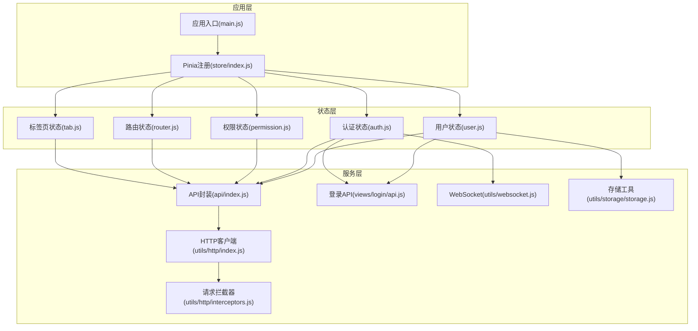
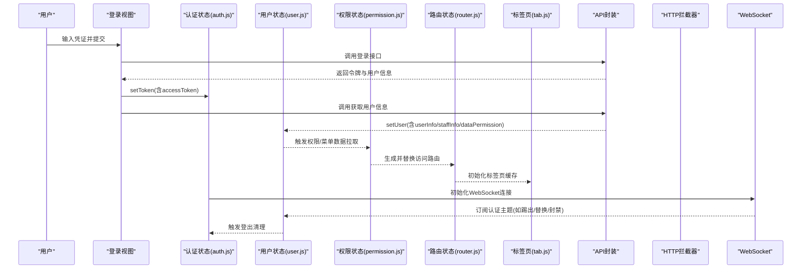
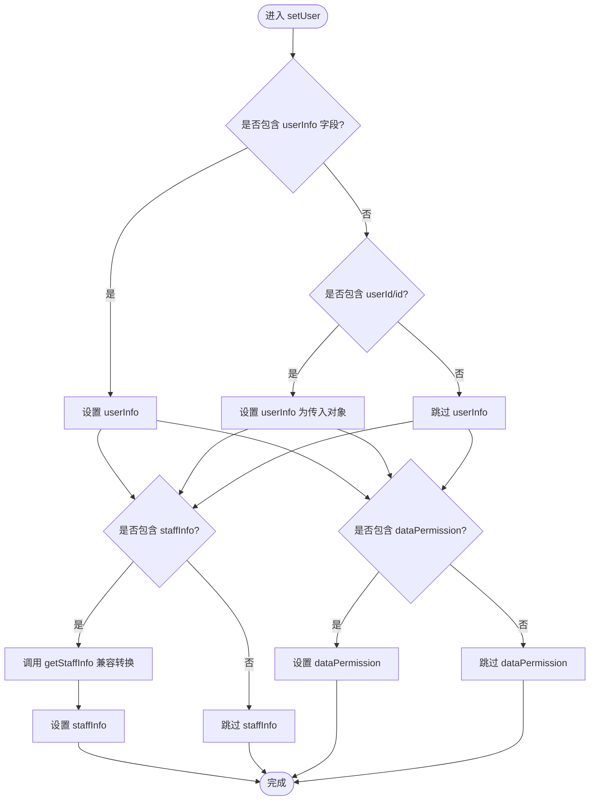
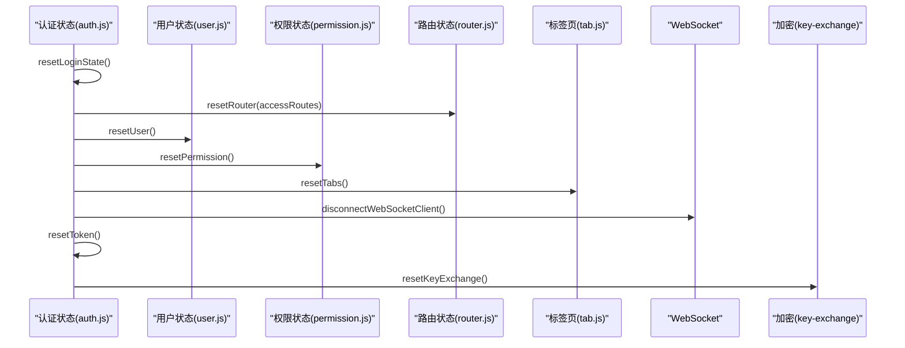
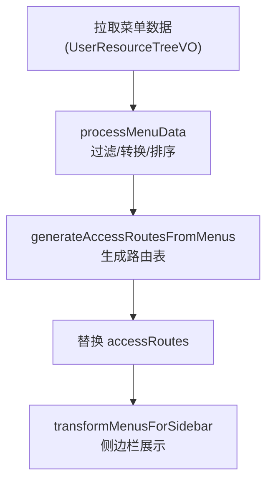
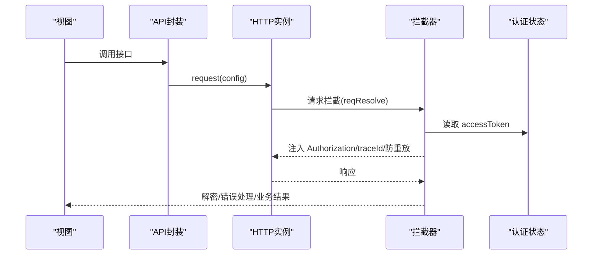
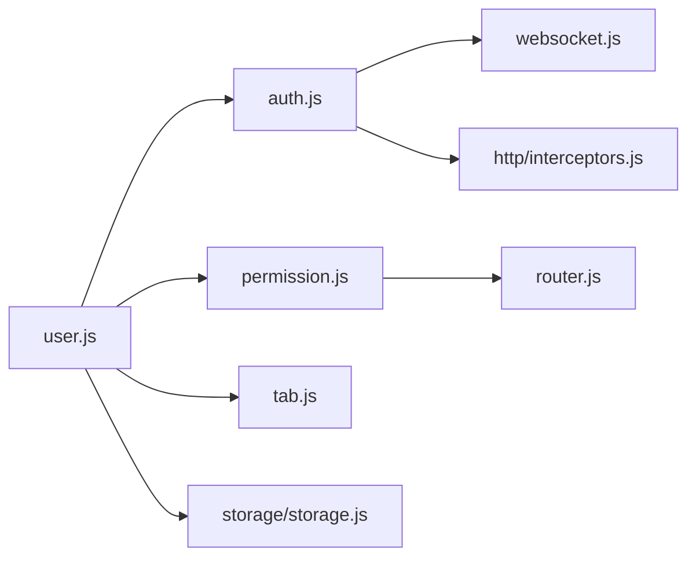

# 用户状态管理

<cite>
**本文引用的文件**
- [forge-admin-ui/src/store/modules/user.js](file://forge-admin-ui/src/store/modules/user.js)
- [forge-admin-ui/src/store/modules/auth.js](file://forge-admin-ui/src/store/modules/auth.js)
- [forge-admin-ui/src/store/modules/permission.js](file://forge-admin-ui/src/store/modules/permission.js)
- [forge-admin-ui/src/store/modules/router.js](file://forge-admin-ui/src/store/modules/router.js)
- [forge-admin-ui/src/store/modules/tab.js](file://forge-admin-ui/src/store/modules/tab.js)
- [forge-admin-ui/src/store/index.js](file://forge-admin-ui/src/store/index.js)
- [forge-admin-ui/src/api/index.js](file://forge-admin-ui/src/api/index.js)
- [forge-admin-ui/src/views/login/api.js](file://forge-admin-ui/src/views/login/api.js)
- [forge-admin-ui/src/utils/http/index.js](file://forge-admin-ui/src/utils/http/index.js)
- [forge-admin-ui/src/utils/http/interceptors.js](file://forge-admin-ui/src/utils/http/interceptors.js)
- [forge-admin-ui/src/utils/websocket.js](file://forge-admin-ui/src/utils/websocket.js)
- [forge-admin-ui/src/utils/storage/storage.js](file://forge-admin-ui/src/utils/storage/storage.js)
- [forge-admin-ui/src/main.js](file://forge-admin-ui/src/main.js)
</cite>

## 目录
1. [简介](#简介)
2. [项目结构](#项目结构)
3. [核心组件](#核心组件)
4. [架构总览](#架构总览)
5. [详细组件分析](#详细组件分析)
6. [依赖关系分析](#依赖关系分析)
7. [性能考量](#性能考量)
8. [故障排查指南](#故障排查指南)
9. [结论](#结论)
10. [附录](#附录)

## 简介
本文件聚焦于用户状态管理模块的技术文档，围绕前端 Pinia Store 中的用户状态模块 user.js 展开，系统性解析以下能力：
- 用户基本信息、角色权限、部门组织、岗位信息的数据模型与映射
- 用户数据的获取、更新、持久化与缓存策略
- 与认证、权限、路由、标签页、WebSocket 等模块的集成方式
- 数据同步机制与状态更新触发条件
- 扩展开发建议与性能优化实践

## 项目结构
用户状态管理位于前端工程的 Pinia Store 子模块中，配合 HTTP 请求、拦截器、WebSocket、持久化插件等共同构成完整的用户态生命周期。

**图表来源**
- [forge-admin-ui/src/store/modules/user.js](file://forge-admin-ui/src/store/modules/user.js#L1-L118)
- [forge-admin-ui/src/store/modules/auth.js](file://forge-admin-ui/src/store/modules/auth.js#L1-L78)
- [forge-admin-ui/src/store/modules/permission.js](file://forge-admin-ui/src/store/modules/permission.js#L1-L269)
- [forge-admin-ui/src/store/modules/router.js](file://forge-admin-ui/src/store/modules/router.js#L1-L19)
- [forge-admin-ui/src/store/modules/tab.js](file://forge-admin-ui/src/store/modules/tab.js#L1-L174)
- [forge-admin-ui/src/store/index.js](file://forge-admin-ui/src/store/index.js#L1-L11)
- [forge-admin-ui/src/api/index.js](file://forge-admin-ui/src/api/index.js#L1-L24)
- [forge-admin-ui/src/views/login/api.js](file://forge-admin-ui/src/views/login/api.js#L1-L25)
- [forge-admin-ui/src/utils/http/index.js](file://forge-admin-ui/src/utils/http/index.js#L1-L26)
- [forge-admin-ui/src/utils/http/interceptors.js](file://forge-admin-ui/src/utils/http/interceptors.js#L1-L165)
- [forge-admin-ui/src/utils/websocket.js](file://forge-admin-ui/src/utils/websocket.js#L1-L150)
- [forge-admin-ui/src/utils/storage/storage.js](file://forge-admin-ui/src/utils/storage/storage.js#L1-L59)
- [forge-admin-ui/src/main.js](file://forge-admin-ui/src/main.js#L1-L37)

**章节来源**
- [forge-admin-ui/src/store/modules/user.js](file://forge-admin-ui/src/store/modules/user.js#L1-L118)
- [forge-admin-ui/src/store/index.js](file://forge-admin-ui/src/store/index.js#L1-L11)
- [forge-admin-ui/src/main.js](file://forge-admin-ui/src/main.js#L1-L37)

## 核心组件
- 用户状态模块(user.js)
  - 状态：userInfo、staffInfo、dataPermission
  - Getter：用户标识、姓名、头像、邮箱、手机号、管理员标识、租户管理员标识、员工ID/名称/区号/序列号、角色/权限集合、数据权限
  - Action：setUser、resetUser；支持持久化键名动态拼接
- 认证状态模块(auth.js)
  - 状态：accessToken、userInfo、staffInfo
  - Getter：生成认证头
  - Action：setToken、toLogin、switchCurrentRole、resetLoginState、logout
- 权限状态模块(permission.js)
  - 状态：accessRoutes、permissions、menus、menuDataLoaded
  - Action：setPermissions、setMenuData、generateAccessRoutesFromMenus、processMenuData、resetPermission
- 路由状态模块(router.js)
  - 功能：提供 router 实例与 resetRouter 能力
- 标签页状态模块(tab.js)
  - 状态：tabs、activeTab、reloading、cacheViews
  - Action：addTab/removeTab/removeOther/removeLeft/removeRight/removeAll/reloadTab/resetTabs；支持 sessionStorage 持久化
- API 封装与登录API
  - api/index.js：统一获取用户信息、菜单、登出、租户配置
  - views/login/api.js：登录、验证码、短信验证码、登录配置、获取用户信息
- HTTP 客户端与拦截器
  - utils/http/index.js：创建 axios 实例与别名
  - utils/http/interceptors.js：统一请求/响应拦截、鉴权头注入、加密/解密、防重放参数、错误处理
- WebSocket 工具
  - utils/websocket.js：基于 SockJS/Stomp 初始化连接、订阅认证主题、处理服务端推送消息
- 存储工具
  - utils/storage/storage.js：带过期时间的存储封装

**章节来源**
- [forge-admin-ui/src/store/modules/user.js](file://forge-admin-ui/src/store/modules/user.js#L23-L118)
- [forge-admin-ui/src/store/modules/auth.js](file://forge-admin-ui/src/store/modules/auth.js#L6-L78)
- [forge-admin-ui/src/store/modules/permission.js](file://forge-admin-ui/src/store/modules/permission.js#L5-L269)
- [forge-admin-ui/src/store/modules/router.js](file://forge-admin-ui/src/store/modules/router.js#L3-L19)
- [forge-admin-ui/src/store/modules/tab.js](file://forge-admin-ui/src/store/modules/tab.js#L8-L174)
- [forge-admin-ui/src/api/index.js](file://forge-admin-ui/src/api/index.js#L1-L24)
- [forge-admin-ui/src/views/login/api.js](file://forge-admin-ui/src/views/login/api.js#L1-L25)
- [forge-admin-ui/src/utils/http/index.js](file://forge-admin-ui/src/utils/http/index.js#L1-L26)
- [forge-admin-ui/src/utils/http/interceptors.js](file://forge-admin-ui/src/utils/http/interceptors.js#L1-L165)
- [forge-admin-ui/src/utils/websocket.js](file://forge-admin-ui/src/utils/websocket.js#L1-L150)
- [forge-admin-ui/src/utils/storage/storage.js](file://forge-admin-ui/src/utils/storage/storage.js#L1-L59)

## 架构总览
用户状态管理贯穿“登录—获取用户信息—构建权限路由—建立WebSocket—持久化—标签页缓存”的完整链路。下图展示关键交互：

**图表来源**
- [forge-admin-ui/src/views/login/api.js](file://forge-admin-ui/src/views/login/api.js#L1-L25)
- [forge-admin-ui/src/store/modules/auth.js](file://forge-admin-ui/src/store/modules/auth.js#L26-L72)
- [forge-admin-ui/src/store/modules/user.js](file://forge-admin-ui/src/store/modules/user.js#L90-L112)
- [forge-admin-ui/src/store/modules/permission.js](file://forge-admin-ui/src/store/modules/permission.js#L23-L71)
- [forge-admin-ui/src/store/modules/router.js](file://forge-admin-ui/src/store/modules/router.js#L7-L11)
- [forge-admin-ui/src/store/modules/tab.js](file://forge-admin-ui/src/store/modules/tab.js#L26-L41)
- [forge-admin-ui/src/utils/websocket.js](file://forge-admin-ui/src/utils/websocket.js#L13-L76)
- [forge-admin-ui/src/api/index.js](file://forge-admin-ui/src/api/index.js#L5-L19)
- [forge-admin-ui/src/utils/http/interceptors.js](file://forge-admin-ui/src/utils/http/interceptors.js#L118-L160)

## 详细组件分析

### 用户状态模块(user.js)
- 数据模型与兼容性
  - 支持两种用户信息结构：新结构（userInfo 字段）与旧结构（直接传入用户对象或包含 staffInfo/dataPermission 的对象）
  - 员工信息兼容策略：优先从 oaStaffInfo/uacStaffInfo 中抽取字段，回退到 staffInfo 或原始用户对象
  - 关键字段映射：员工ID、区号(eparchyCode)、所在部门编码(departId)、城市码(cityCode)、角色ID(roleId)等
- Getter 设计
  - 用户标识：优先使用 userId，其次 id
  - 昵称/真实姓名：优先 realName，否则 nickName
  - 头像：优先 userInfo.avatar，否则 staffInfo.avatar
  - 管理员与租户管理员标识：兼容 admin/isAdmin 与 tenantAdmin/isTenantAdmin
  - 角色/权限：roles/roleIds/permissions/apiPermissions，兼容多种后端返回形态
- Action 行为
  - setUser：根据传参设置 userInfo、staffInfo、dataPermission，并对 staffInfo 进行兼容转换
  - resetUser：重置为初始状态
- 持久化
  - 通过 Pinia 插件持久化，键名包含租户前缀，便于多租户隔离

**图表来源**
- [forge-admin-ui/src/store/modules/user.js](file://forge-admin-ui/src/store/modules/user.js#L90-L112)
- [forge-admin-ui/src/store/modules/user.js](file://forge-admin-ui/src/store/modules/user.js#L2-L22)

**章节来源**
- [forge-admin-ui/src/store/modules/user.js](file://forge-admin-ui/src/store/modules/user.js#L23-L118)

### 认证状态模块(auth.js)
- 作用
  - 维护 accessToken 并生成 Authorization 头
  - 提供 toLogin、switchCurrentRole、resetLoginState、logout 等登录态管理动作
- 与用户状态的协作
  - 在 resetLoginState 中调用 resetUser、resetRouter、resetPermission、resetTabs，并断开 WebSocket、重置密钥交换
- 与 HTTP 拦截器的联动
  - 拦截器读取 accessToken 注入请求头，保障后续接口调用具备鉴权

**图表来源**
- [forge-admin-ui/src/store/modules/auth.js](file://forge-admin-ui/src/store/modules/auth.js#L49-L68)
- [forge-admin-ui/src/utils/websocket.js](file://forge-admin-ui/src/utils/websocket.js#L81-L92)
- [forge-admin-ui/src/utils/crypto/index.js](file://forge-admin-ui/src/utils/crypto/index.js#L9-L16)

**章节来源**
- [forge-admin-ui/src/store/modules/auth.js](file://forge-admin-ui/src/store/modules/auth.js#L6-L78)

### 权限状态模块(permission.js)
- 作用
  - 从菜单数据生成路由表，维护 accessRoutes、permissions、menus
  - 处理新接口返回的 UserResourceTreeVO 结构，转换为前端菜单树
- 与用户状态的衔接
  - 用户信息变更后，通常触发菜单数据拉取与路由重建
- 与路由状态的协作
  - 通过 resetRouter 与 generateAccessRoutesFromMenus 替换应用路由

**图表来源**
- [forge-admin-ui/src/store/modules/permission.js](file://forge-admin-ui/src/store/modules/permission.js#L23-L130)
- [forge-admin-ui/src/store/modules/permission.js](file://forge-admin-ui/src/store/modules/permission.js#L132-L204)

**章节来源**
- [forge-admin-ui/src/store/modules/permission.js](file://forge-admin-ui/src/store/modules/permission.js#L5-L269)

### 路由状态模块(router.js)
- 作用
  - 提供 router 实例与 resetRouter 能力，用于在用户切换或登出时清理动态路由
- 与权限状态的协作
  - resetRouter 接收 accessRoutes，逐项移除已注册路由

**章节来源**
- [forge-admin-ui/src/store/modules/router.js](file://forge-admin-ui/src/store/modules/router.js#L3-L19)

### 标签页状态模块(tab.js)
- 作用
  - 维护标签页列表与激活项，支持增删改查与刷新
  - 自动维护缓存视图列表 cacheViews，结合 keepAlive 控制页面缓存
- 持久化
  - 使用 sessionStorage 持久化 tabs，键名包含租户前缀

**章节来源**
- [forge-admin-ui/src/store/modules/tab.js](file://forge-admin-ui/src/store/modules/tab.js#L8-L174)

### API 与 HTTP 拦截器
- API 封装
  - 统一用户信息、菜单、登出、租户配置等接口调用
  - 登录视图提供登录、验证码、短信验证码、登录配置、获取用户信息等接口
- HTTP 拦截器
  - 注入 Authorization 头、traceId、防重放参数
  - 统一解密响应、错误处理、业务错误提示
  - 与加密模块协同，处理密钥过期场景

**图表来源**
- [forge-admin-ui/src/api/index.js](file://forge-admin-ui/src/api/index.js#L5-L23)
- [forge-admin-ui/src/views/login/api.js](file://forge-admin-ui/src/views/login/api.js#L4-L23)
- [forge-admin-ui/src/utils/http/index.js](file://forge-admin-ui/src/utils/http/index.js#L4-L26)
- [forge-admin-ui/src/utils/http/interceptors.js](file://forge-admin-ui/src/utils/http/interceptors.js#L118-L160)

**章节来源**
- [forge-admin-ui/src/api/index.js](file://forge-admin-ui/src/api/index.js#L1-L24)
- [forge-admin-ui/src/views/login/api.js](file://forge-admin-ui/src/views/login/api.js#L1-L25)
- [forge-admin-ui/src/utils/http/index.js](file://forge-admin-ui/src/utils/http/index.js#L1-L26)
- [forge-admin-ui/src/utils/http/interceptors.js](file://forge-admin-ui/src/utils/http/interceptors.js#L1-L165)

### WebSocket 集成
- 初始化条件
  - 需要 accessToken 且用户 ID 存在，避免在登录流程中提前初始化
- 主题订阅
  - 认证相关广播主题(/topic/auth)，处理踢出、替换、封禁等事件
- 消息分发
  - 根据目标用户过滤消息，统一通过 $message 展示
  - 遇到认证相关事件自动触发登出清理流程

**章节来源**
- [forge-admin-ui/src/utils/websocket.js](file://forge-admin-ui/src/utils/websocket.js#L13-L149)

## 依赖关系分析
- 模块耦合
  - user.js 与 auth.js：用户信息变更常伴随认证状态变化；auth.js 在登出/切换角色时重置 user.js
  - user.js 与 permission.js：用户信息包含角色/权限，驱动菜单与路由生成
  - user.js 与 router.js：权限模块生成路由后由 router.js 替换
  - user.js 与 tab.js：路由切换时更新标签页与缓存视图
  - auth.js 与 websocket.js：认证状态变化触发 WebSocket 初始化/断开
- 外部依赖
  - HTTP 拦截器依赖认证状态注入 Authorization 头
  - 存储工具提供带过期时间的持久化能力，支撑用户态跨会话恢复

**图表来源**
- [forge-admin-ui/src/store/modules/user.js](file://forge-admin-ui/src/store/modules/user.js#L1-L118)
- [forge-admin-ui/src/store/modules/auth.js](file://forge-admin-ui/src/store/modules/auth.js#L1-L78)
- [forge-admin-ui/src/store/modules/permission.js](file://forge-admin-ui/src/store/modules/permission.js#L1-L269)
- [forge-admin-ui/src/store/modules/router.js](file://forge-admin-ui/src/store/modules/router.js#L1-L19)
- [forge-admin-ui/src/store/modules/tab.js](file://forge-admin-ui/src/store/modules/tab.js#L1-L174)
- [forge-admin-ui/src/utils/http/interceptors.js](file://forge-admin-ui/src/utils/http/interceptors.js#L1-L165)
- [forge-admin-ui/src/utils/websocket.js](file://forge-admin-ui/src/utils/websocket.js#L1-L150)
- [forge-admin-ui/src/utils/storage/storage.js](file://forge-admin-ui/src/utils/storage/storage.js#L1-L59)

**章节来源**
- [forge-admin-ui/src/store/modules/user.js](file://forge-admin-ui/src/store/modules/user.js#L1-L118)
- [forge-admin-ui/src/store/modules/auth.js](file://forge-admin-ui/src/store/modules/auth.js#L1-L78)
- [forge-admin-ui/src/store/modules/permission.js](file://forge-admin-ui/src/store/modules/permission.js#L1-L269)
- [forge-admin-ui/src/store/modules/router.js](file://forge-admin-ui/src/store/modules/router.js#L1-L19)
- [forge-admin-ui/src/store/modules/tab.js](file://forge-admin-ui/src/store/modules/tab.js#L1-L174)
- [forge-admin-ui/src/utils/http/interceptors.js](file://forge-admin-ui/src/utils/http/interceptors.js#L1-L165)
- [forge-admin-ui/src/utils/websocket.js](file://forge-admin-ui/src/utils/websocket.js#L1-L150)
- [forge-admin-ui/src/utils/storage/storage.js](file://forge-admin-ui/src/utils/storage/storage.js#L1-L59)

## 性能考量
- 状态粒度与计算复杂度
  - user.js 的 getter 为纯读取与简单映射，时间复杂度 O(1)，开销极低
  - permission.js 的菜单处理涉及树形结构遍历与排序，复杂度 O(n log n) 级别，建议在数据量较大时采用分页/懒加载策略
- 缓存与持久化
  - user.js 使用 pinia-plugin-persistedstate，键名包含租户前缀，避免跨租户污染
  - tab.js 使用 sessionStorage 持久化标签页，减少频繁切换的重复渲染
  - storage/storage.js 提供带过期时间的存储封装，适用于短期缓存
- 网络与安全
  - HTTP 拦截器统一注入 Authorization 与防重放参数，减少重复鉴权与重放风险
  - 响应解密与错误处理集中化，降低业务代码分支复杂度
- WebSocket
  - 仅在具备 accessToken 且用户 ID 存在时初始化，避免无效连接
  - 心跳与重连机制降低断线概率，提升实时消息可靠性

[本节为通用性能建议，无需特定文件引用]

## 故障排查指南
- 登录后无法进入系统
  - 检查认证状态是否正确设置 accessToken
  - 确认用户信息是否成功 setUser，尤其是 staffInfo 的兼容转换
  - 核对菜单数据拉取与路由生成流程
- WebSocket 无法接收消息
  - 确认 accessToken 与 userId 是否存在
  - 检查 /topic/auth 订阅是否建立
  - 查看 STOMP 错误回调与连接状态
- 接口报错或解密失败
  - 检查拦截器是否正确注入 Authorization
  - 密钥过期时会触发重置，需重新登录
- 页面刷新后状态丢失
  - 确认 pinia-plugin-persistedstate 是否启用
  - 检查租户前缀与键名是否一致

**章节来源**
- [forge-admin-ui/src/store/modules/auth.js](file://forge-admin-ui/src/store/modules/auth.js#L26-L72)
- [forge-admin-ui/src/store/modules/user.js](file://forge-admin-ui/src/store/modules/user.js#L90-L112)
- [forge-admin-ui/src/store/modules/permission.js](file://forge-admin-ui/src/store/modules/permission.js#L23-L71)
- [forge-admin-ui/src/utils/websocket.js](file://forge-admin-ui/src/utils/websocket.js#L13-L76)
- [forge-admin-ui/src/utils/http/interceptors.js](file://forge-admin-ui/src/utils/http/interceptors.js#L21-L71)

## 结论
用户状态管理模块通过清晰的状态划分、兼容的用户信息结构、完善的持久化与安全机制，实现了从登录到路由构建、标签页缓存、WebSocket 实时通知的全链路闭环。其设计兼顾可扩展性与性能，为后续在角色权限、部门组织、岗位信息等方面的扩展提供了良好基础。

## 附录

### 用户状态与系统其他模块的集成清单
- 登录流程
  - 登录视图调用登录 API，设置认证状态，随后获取用户信息并写入用户状态
- 权限与路由
  - 用户状态变更后，权限模块生成路由并替换现有路由
- 标签页与缓存
  - 路由切换时更新标签页与缓存视图列表
- 实时通信
  - 认证状态变化触发 WebSocket 初始化，订阅认证主题并处理服务端推送

**章节来源**
- [forge-admin-ui/src/views/login/api.js](file://forge-admin-ui/src/views/login/api.js#L1-L25)
- [forge-admin-ui/src/store/modules/auth.js](file://forge-admin-ui/src/store/modules/auth.js#L26-L72)
- [forge-admin-ui/src/store/modules/permission.js](file://forge-admin-ui/src/store/modules/permission.js#L23-L130)
- [forge-admin-ui/src/store/modules/tab.js](file://forge-admin-ui/src/store/modules/tab.js#L26-L41)
- [forge-admin-ui/src/utils/websocket.js](file://forge-admin-ui/src/utils/websocket.js#L13-L76)

### 用户状态扩展开发建议
- 新增字段
  - 在 user.js 的 state 中新增字段，并在 getters/actions 中补充对应逻辑
  - 若为部门/岗位相关，建议与 staffInfo 字段保持一致的兼容策略
- 数据同步
  - 通过 API 封装统一拉取，避免分散在各处
  - 在认证状态切换或登出时，确保相关状态被重置
- 性能优化
  - 对大体量菜单/权限数据采用分页/懒加载
  - 合理使用 sessionStorage 与 localStorage，避免阻塞主线程
- 安全加固
  - 严格遵循拦截器的安全参数注入与解密流程
  - 对敏感字段进行脱敏展示与传输

[本节为通用开发建议，无需特定文件引用]