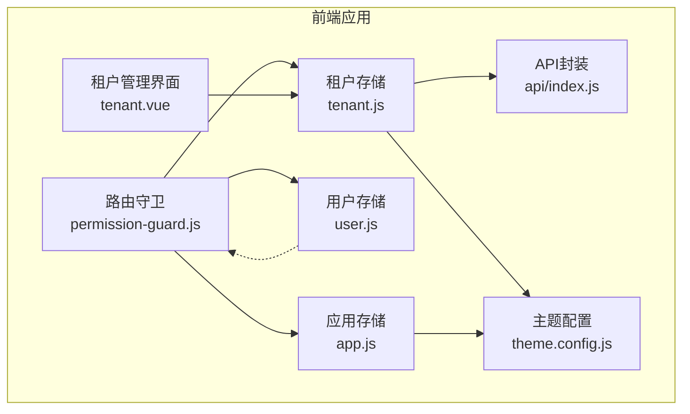
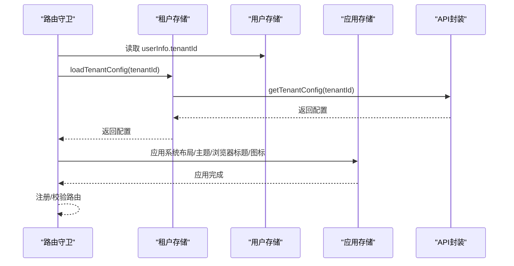
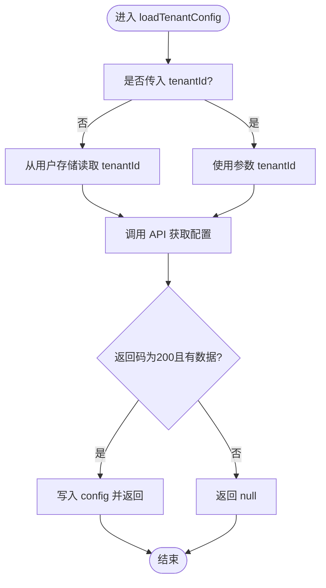
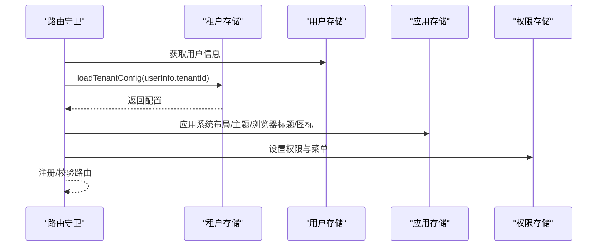
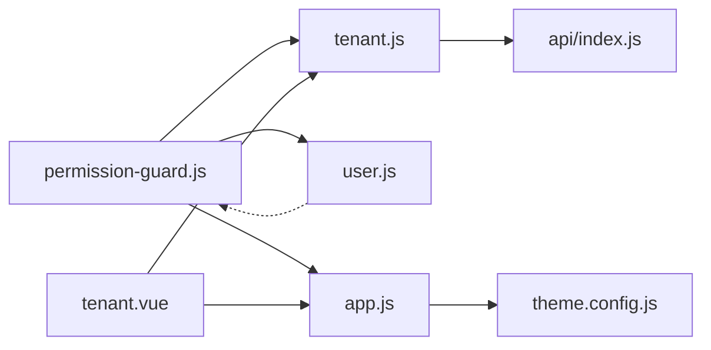

# 租户状态管理

<cite>
**本文引用的文件**
- [forge-admin-ui/src/store/modules/tenant.js](file://forge-admin-ui/src/store/modules/tenant.js)
- [forge-admin-ui/src/store/modules/user.js](file://forge-admin-ui/src/store/modules/user.js)
- [forge-admin-ui/src/store/modules/app.js](file://forge-admin-ui/src/store/modules/app.js)
- [forge-admin-ui/src/router/guards/permission-guard.js](file://forge-admin-ui/src/router/guards/permission-guard.js)
- [forge-admin-ui/src/config/theme.config.js](file://forge-admin-ui/src/config/theme.config.js)
- [forge-admin-ui/src/views/system/tenant.vue](file://forge-admin-ui/src/views/system/tenant.vue)
- [forge-admin-ui/src/api/index.js](file://forge-admin-ui/src/api/index.js)
- [forge-admin-ui/.env](file://forge-admin-ui/.env)
</cite>

## 目录
1. [简介](#简介)
2. [项目结构](#项目结构)
3. [核心组件](#核心组件)
4. [架构总览](#架构总览)
5. [详细组件分析](#详细组件分析)
6. [依赖关系分析](#依赖关系分析)
7. [性能考量](#性能考量)
8. [故障排查指南](#故障排查指南)
9. [结论](#结论)
10. [附录](#附录)

## 简介
本文件面向“租户状态管理”模块，围绕前端 Pinia 租户存储（tenant.js）展开，系统性解析多租户状态的数据结构、租户切换流程、租户配置与主题应用、数据隔离与持久化策略，并给出与系统其他模块的集成方式、性能优化建议以及扩展开发指南与最佳实践。

## 项目结构
本模块位于前端工程的 store 层，配合路由守卫、主题配置与系统租户管理界面协同工作，形成“配置获取—应用—持久化—切换”的闭环。

图表来源
- [forge-admin-ui/src/store/modules/tenant.js](file://forge-admin-ui/src/store/modules/tenant.js#L1-L83)
- [forge-admin-ui/src/store/modules/user.js](file://forge-admin-ui/src/store/modules/user.js#L1-L118)
- [forge-admin-ui/src/store/modules/app.js](file://forge-admin-ui/src/store/modules/app.js#L1-L91)
- [forge-admin-ui/src/router/guards/permission-guard.js](file://forge-admin-ui/src/router/guards/permission-guard.js#L1-L547)
- [forge-admin-ui/src/config/theme.config.js](file://forge-admin-ui/src/config/theme.config.js#L1-L164)
- [forge-admin-ui/src/views/system/tenant.vue](file://forge-admin-ui/src/views/system/tenant.vue#L1-L802)
- [forge-admin-ui/src/api/index.js](file://forge-admin-ui/src/api/index.js#L1-L24)

章节来源
- [forge-admin-ui/src/store/modules/tenant.js](file://forge-admin-ui/src/store/modules/tenant.js#L1-L83)
- [forge-admin-ui/src/store/modules/user.js](file://forge-admin-ui/src/store/modules/user.js#L1-L118)
- [forge-admin-ui/src/store/modules/app.js](file://forge-admin-ui/src/store/modules/app.js#L1-L91)
- [forge-admin-ui/src/router/guards/permission-guard.js](file://forge-admin-ui/src/router/guards/permission-guard.js#L1-L547)
- [forge-admin-ui/src/config/theme.config.js](file://forge-admin-ui/src/config/theme.config.js#L1-L164)
- [forge-admin-ui/src/views/system/tenant.vue](file://forge-admin-ui/src/views/system/tenant.vue#L1-L802)
- [forge-admin-ui/src/api/index.js](file://forge-admin-ui/src/api/index.js#L1-L24)

## 核心组件
- 租户存储（tenant.js）
  - 状态：config（租户配置对象）
  - 计算属性：系统名称、Logo、浏览器标题/图标、系统布局、主题色、系统介绍、版权信息、主题配置（JSON 解析）
  - 动作：loadTenantConfig（按租户ID拉取配置）、clearTenantConfig（清空配置）
  - 持久化：sessionStorage（键名含租户前缀）
- 用户存储（user.js）
  - 提供 userInfo（包含 tenantId），作为租户配置加载的默认来源
- 应用存储（app.js）
  - 提供布局、主题色、主题配置等应用级状态，负责应用租户主题
- 路由守卫（permission-guard.js）
  - 在鉴权与菜单加载前，调用租户配置加载并应用
- 主题配置（theme.config.js）
  - 默认主题配置与应用函数，支持深浅色模式
- 租户管理界面（tenant.vue）
  - 提供编辑/保存租户配置能力，保存后触发重新加载与应用
- API 封装（api/index.js）
  - 提供 getTenantConfig 接口

章节来源
- [forge-admin-ui/src/store/modules/tenant.js](file://forge-admin-ui/src/store/modules/tenant.js#L4-L82)
- [forge-admin-ui/src/store/modules/user.js](file://forge-admin-ui/src/store/modules/user.js#L23-L88)
- [forge-admin-ui/src/store/modules/app.js](file://forge-admin-ui/src/store/modules/app.js#L7-L90)
- [forge-admin-ui/src/router/guards/permission-guard.js](file://forge-admin-ui/src/router/guards/permission-guard.js#L84-L142)
- [forge-admin-ui/src/config/theme.config.js](file://forge-admin-ui/src/config/theme.config.js#L9-L98)
- [forge-admin-ui/src/views/system/tenant.vue](file://forge-admin-ui/src/views/system/tenant.vue#L554-L639)
- [forge-admin-ui/src/api/index.js](file://forge-admin-ui/src/api/index.js#L21-L22)

## 架构总览
租户状态管理以“配置驱动”为核心：应用启动或路由进入时，从后端拉取当前用户的租户配置，解析并应用到应用布局、主题与浏览器元信息；同时将配置持久化到 sessionStorage，实现会话内可用。

图表来源
- [forge-admin-ui/src/router/guards/permission-guard.js](file://forge-admin-ui/src/router/guards/permission-guard.js#L120-L142)
- [forge-admin-ui/src/store/modules/tenant.js](file://forge-admin-ui/src/store/modules/tenant.js#L49-L69)
- [forge-admin-ui/src/store/modules/user.js](file://forge-admin-ui/src/store/modules/user.js#L24-L88)
- [forge-admin-ui/src/store/modules/app.js](file://forge-admin-ui/src/store/modules/app.js#L18-L84)
- [forge-admin-ui/src/api/index.js](file://forge-admin-ui/src/api/index.js#L21-L22)

## 详细组件分析

### 租户存储（tenant.js）
- 数据结构
  - config：租户配置对象，包含系统名称、Logo、浏览器标题/图标、系统布局、主题色、系统介绍、版权信息、主题配置（字符串或对象）
- 计算属性
  - systemName/systemLogo/browserTitle/browserIcon/systemLayout/systemTheme/systemIntro/copyrightInfo：从 config 中派生
  - themeConfig：对字符串形式的 themeConfig 进行 JSON 解析，异常时返回 null 并记录错误
- 动作
  - loadTenantConfig(tenantId)
    - 若未传入 tenantId，则从用户存储读取 userInfo.tenantId
    - 调用 API 获取配置，成功则写入 config 并返回，否则返回 null
  - clearTenantConfig：清空 config
- 持久化
  - 使用 sessionStorage，键名形如 “<租户前缀>_tenant”，pick 仅持久化 config

图表来源
- [forge-admin-ui/src/store/modules/tenant.js](file://forge-admin-ui/src/store/modules/tenant.js#L49-L69)

章节来源
- [forge-admin-ui/src/store/modules/tenant.js](file://forge-admin-ui/src/store/modules/tenant.js#L4-L82)

### 用户存储（user.js）
- 作用
  - 保存用户信息（含 tenantId），为租户配置加载提供默认租户ID
- 关键点
  - getters.userId/username/realName/avatar/email/phone/userType/isAdmin/isTenantAdmin 等
  - setUser/resetUser 动作，兼容旧版 staffInfo/dataPermission 结构

章节来源
- [forge-admin-ui/src/store/modules/user.js](file://forge-admin-ui/src/store/modules/user.js#L23-L118)

### 应用存储（app.js）
- 作用
  - 维护布局、主题色、主题配置、暗色模式、侧边栏折叠等应用级状态
  - 提供 setLayout/setThemeConfig/applyCurrentTheme 等动作
- 与租户主题的关系
  - 通过深度合并默认主题配置与租户主题配置，实现租户级主题覆盖

章节来源
- [forge-admin-ui/src/store/modules/app.js](file://forge-admin-ui/src/store/modules/app.js#L7-L90)

### 路由守卫（permission-guard.js）
- 关键流程
  - 初始化密钥交换
  - 无用户信息时，获取用户信息与权限，同时拉取租户配置并应用
  - 有用户信息但菜单未加载时，重复上述流程
  - 应用租户配置：系统布局、主题配置、浏览器标题/图标
- 与租户存储的交互
  - 调用 tenantStore.loadTenantConfig(userInfo.tenantId)
  - 通过 applyTenantConfig 将配置应用到 appStore

图表来源
- [forge-admin-ui/src/router/guards/permission-guard.js](file://forge-admin-ui/src/router/guards/permission-guard.js#L120-L142)
- [forge-admin-ui/src/store/modules/tenant.js](file://forge-admin-ui/src/store/modules/tenant.js#L49-L69)
- [forge-admin-ui/src/store/modules/app.js](file://forge-admin-ui/src/store/modules/app.js#L18-L84)

章节来源
- [forge-admin-ui/src/router/guards/permission-guard.js](file://forge-admin-ui/src/router/guards/permission-guard.js#L84-L142)

### 主题配置（theme.config.js）
- 默认主题配置
  - 包含主色、Header、顶部菜单、侧边菜单及其暗色模式配置
- 应用函数
  - 将主题配置映射到 CSS 变量，支持深色模式切换
- 与租户配置的融合
  - 路由守卫与租户管理界面均通过深度合并默认配置与租户配置，实现租户级覆盖

章节来源
- [forge-admin-ui/src/config/theme.config.js](file://forge-admin-ui/src/config/theme.config.js#L9-L98)
- [forge-admin-ui/src/config/theme.config.js](file://forge-admin-ui/src/config/theme.config.js#L105-L163)

### 租户管理界面（tenant.vue）
- 功能
  - CRUD 租户配置，支持品牌设置、界面风格、高级主题配置
  - 保存前将主题配置字段组装为 JSON 写入 themeConfig
  - 保存后重新加载租户配置并应用到布局、主题、浏览器标题/图标
- 与租户存储的交互
  - 通过 tenantStore.loadTenantConfig 重新获取并应用最新配置

章节来源
- [forge-admin-ui/src/views/system/tenant.vue](file://forge-admin-ui/src/views/system/tenant.vue#L554-L639)
- [forge-admin-ui/src/views/system/tenant.vue](file://forge-admin-ui/src/views/system/tenant.vue#L641-L716)
- [forge-admin-ui/src/views/system/tenant.vue](file://forge-admin-ui/src/views/system/tenant.vue#L718-L756)

### API 封装（api/index.js）
- 提供 getTenantConfig(tenantId) 接口，用于拉取租户配置
- 与路由守卫和租户管理界面协作

章节来源
- [forge-admin-ui/src/api/index.js](file://forge-admin-ui/src/api/index.js#L21-L22)

## 依赖关系分析
- 模块耦合
  - 路由守卫依赖租户存储与用户存储，间接依赖应用存储
  - 租户存储依赖 API 封装
  - 应用存储依赖主题配置
  - 租户管理界面依赖租户存储与应用存储
- 外部依赖
  - 环境变量 VITE_TENANT 作为持久化键前缀，影响各 store 的持久化键
- 潜在循环依赖
  - 当前模块间为单向依赖，无明显循环

图表来源
- [forge-admin-ui/src/router/guards/permission-guard.js](file://forge-admin-ui/src/router/guards/permission-guard.js#L1-L547)
- [forge-admin-ui/src/store/modules/tenant.js](file://forge-admin-ui/src/store/modules/tenant.js#L1-L83)
- [forge-admin-ui/src/store/modules/user.js](file://forge-admin-ui/src/store/modules/user.js#L1-L118)
- [forge-admin-ui/src/store/modules/app.js](file://forge-admin-ui/src/store/modules/app.js#L1-L91)
- [forge-admin-ui/src/config/theme.config.js](file://forge-admin-ui/src/config/theme.config.js#L1-L164)
- [forge-admin-ui/src/views/system/tenant.vue](file://forge-admin-ui/src/views/system/tenant.vue#L1-L802)
- [forge-admin-ui/src/api/index.js](file://forge-admin-ui/src/api/index.js#L1-L24)

章节来源
- [forge-admin-ui/src/router/guards/permission-guard.js](file://forge-admin-ui/src/router/guards/permission-guard.js#L1-L547)
- [forge-admin-ui/src/store/modules/tenant.js](file://forge-admin-ui/src/store/modules/tenant.js#L1-L83)
- [forge-admin-ui/src/store/modules/user.js](file://forge-admin-ui/src/store/modules/user.js#L1-L118)
- [forge-admin-ui/src/store/modules/app.js](file://forge-admin-ui/src/store/modules/app.js#L1-L91)
- [forge-admin-ui/src/config/theme.config.js](file://forge-admin-ui/src/config/theme.config.js#L1-L164)
- [forge-admin-ui/src/views/system/tenant.vue](file://forge-admin-ui/src/views/system/tenant.vue#L1-L802)
- [forge-admin-ui/src/api/index.js](file://forge-admin-ui/src/api/index.js#L1-L24)

## 性能考量
- 并发与等待
  - 路由守卫中对用户信息、权限、菜单采用并发拉取，减少首屏等待
- 配置解析
  - themeConfig 的 JSON 解析在 getter 中执行，建议在配置变更时缓存解析结果，避免重复解析
- 持久化策略
  - 租户配置仅持久化 config，体积小、命中率高；应用存储持久化布局与主题等常用状态，降低重渲染成本
- 资源加载
  - 浏览器图标通过 getFileUrl 转换 fileId，避免重复下载同一资源

章节来源
- [forge-admin-ui/src/router/guards/permission-guard.js](file://forge-admin-ui/src/router/guards/permission-guard.js#L125-L128)
- [forge-admin-ui/src/store/modules/tenant.js](file://forge-admin-ui/src/store/modules/tenant.js#L35-L45)
- [forge-admin-ui/src/store/modules/app.js](file://forge-admin-ui/src/store/modules/app.js#L85-L89)

## 故障排查指南
- 租户配置加载失败
  - 现象：loadTenantConfig 返回 null 或控制台报错
  - 排查：检查 API 返回码与数据结构；确认 userInfo.tenantId 是否存在
- 主题配置解析失败
  - 现象：themeConfig 为 null
  - 排查：检查 themeConfig 字段是否为合法 JSON 字符串；查看解析异常日志
- 浏览器标题/图标未更新
  - 现象：页面标题或图标未按租户配置更新
  - 排查：确认 applyTenantConfig 已被调用；检查 getFileUrl 生成的 URL 是否有效
- 路由未注册或 404
  - 现象：访问新路由提示 404
  - 排查：确认菜单数据已加载；检查动态注册逻辑与组件是否存在

章节来源
- [forge-admin-ui/src/store/modules/tenant.js](file://forge-admin-ui/src/store/modules/tenant.js#L49-L69)
- [forge-admin-ui/src/router/guards/permission-guard.js](file://forge-admin-ui/src/router/guards/permission-guard.js#L146-L154)
- [forge-admin-ui/src/views/system/tenant.vue](file://forge-admin-ui/src/views/system/tenant.vue#L617-L635)

## 结论
该租户状态管理模块以“配置驱动”为核心，通过路由守卫在关键时机拉取并应用租户配置，结合主题配置与应用存储实现租户级个性化体验。模块职责清晰、耦合度低、具备良好的扩展性与可维护性。

## 附录

### 租户配置数据结构（字段说明）
- systemName：系统名称
- systemLogo：系统 Logo（文件 ID 或 URL）
- browserTitle：浏览器标签页标题
- browserIcon：浏览器图标（文件 ID 或 URL）
- systemLayout：系统布局（simple/normal/top-menu/top-side-menu/full）
- systemTheme：主题色（十六进制）
- systemIntro：系统介绍（登录页展示）
- copyrightInfo：版权信息（页面底部展示）
- themeConfig：主题配置对象（JSON 字符串或对象）
  - 包含 primaryColor、header、headerDark、topMenu、topMenuDark、sideMenu、sideMenuDark 等

章节来源
- [forge-admin-ui/src/store/modules/tenant.js](file://forge-admin-ui/src/store/modules/tenant.js#L9-L46)
- [forge-admin-ui/src/config/theme.config.js](file://forge-admin-ui/src/config/theme.config.js#L9-L98)
- [forge-admin-ui/src/views/system/tenant.vue](file://forge-admin-ui/src/views/system/tenant.vue#L288-L494)

### 租户切换流程（扩展开发参考）
- 触发点
  - 用户在租户管理界面修改配置并保存
  - 或在业务流程中主动切换租户（需在调用方注入新 tenantId 并重新加载）
- 步骤
  1) 调用 tenantStore.loadTenantConfig(newTenantId)
  2) 调用 appStore.setLayout(config.systemLayout)
  3) 深度合并默认主题与 config.themeConfig，调用 appStore.setThemeConfig
  4) 更新 document.title 与浏览器图标
  5) 重新注册/校验路由（如涉及菜单变更）

章节来源
- [forge-admin-ui/src/views/system/tenant.vue](file://forge-admin-ui/src/views/system/tenant.vue#L554-L639)
- [forge-admin-ui/src/router/guards/permission-guard.js](file://forge-admin-ui/src/router/guards/permission-guard.js#L10-L82)

### 最佳实践
- 配置字段命名规范：统一使用 camelCase，避免与保留字冲突
- 主题配置：优先使用 systemTheme，其次使用 themeConfig.primaryColor，最后回退到默认值
- 异常处理：对 JSON 解析与网络请求进行 try/catch 包裹，保证 UI 不中断
- 性能优化：对频繁使用的计算属性进行缓存；避免在 getter 中做重计算
- 安全与隔离：不同租户的配置独立存储，避免跨租户污染；敏感配置不在本地持久化