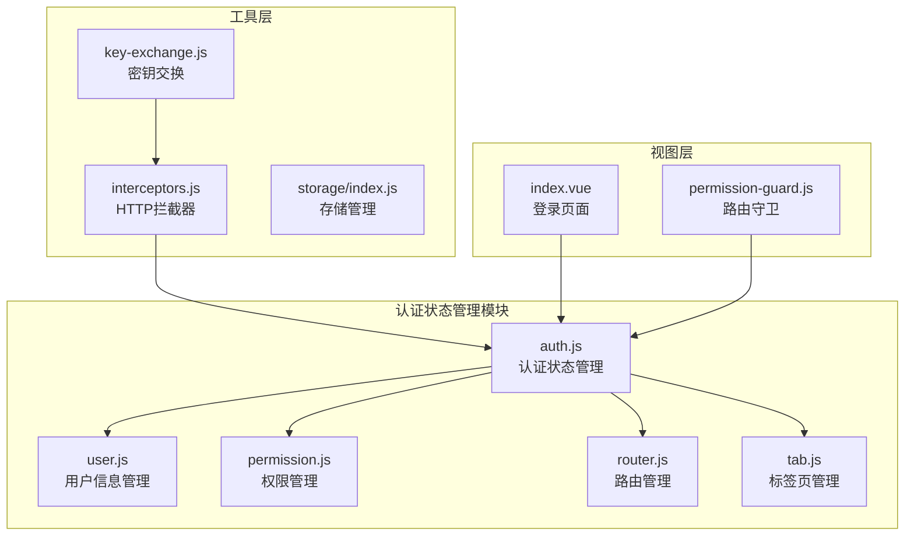
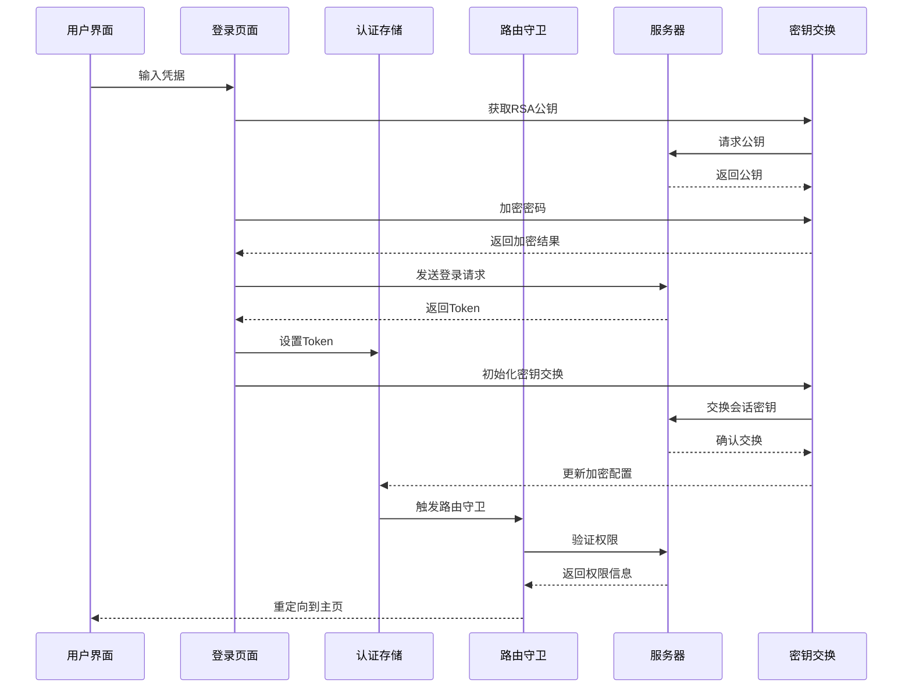
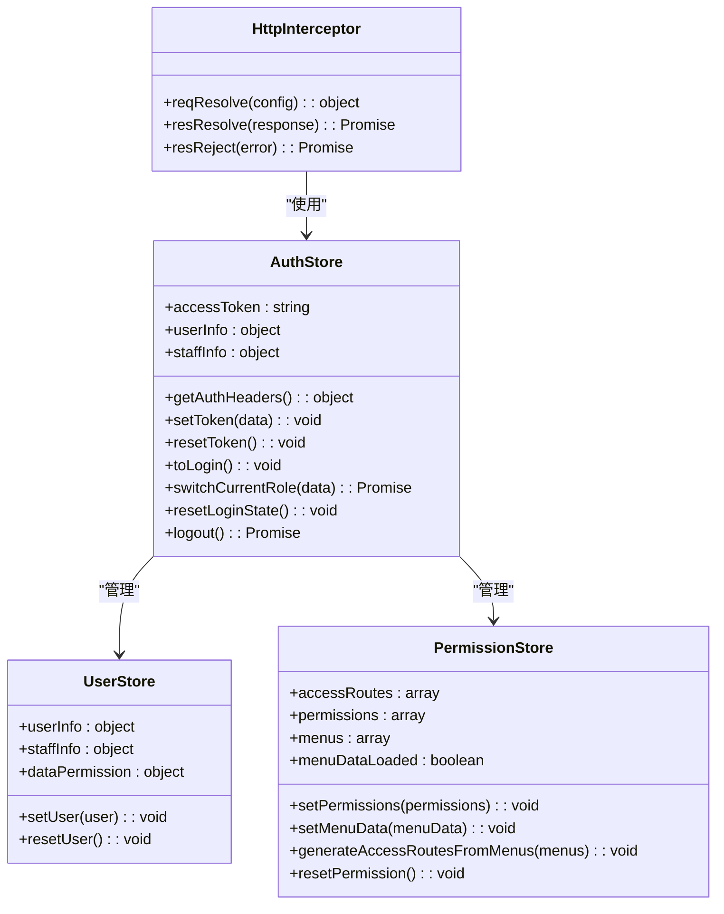
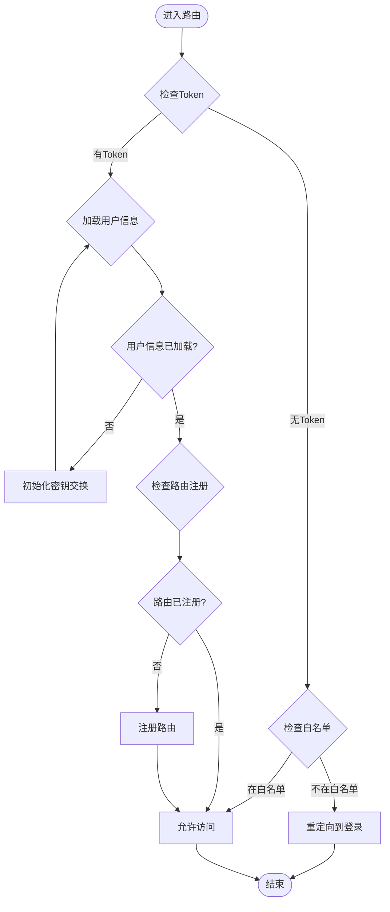
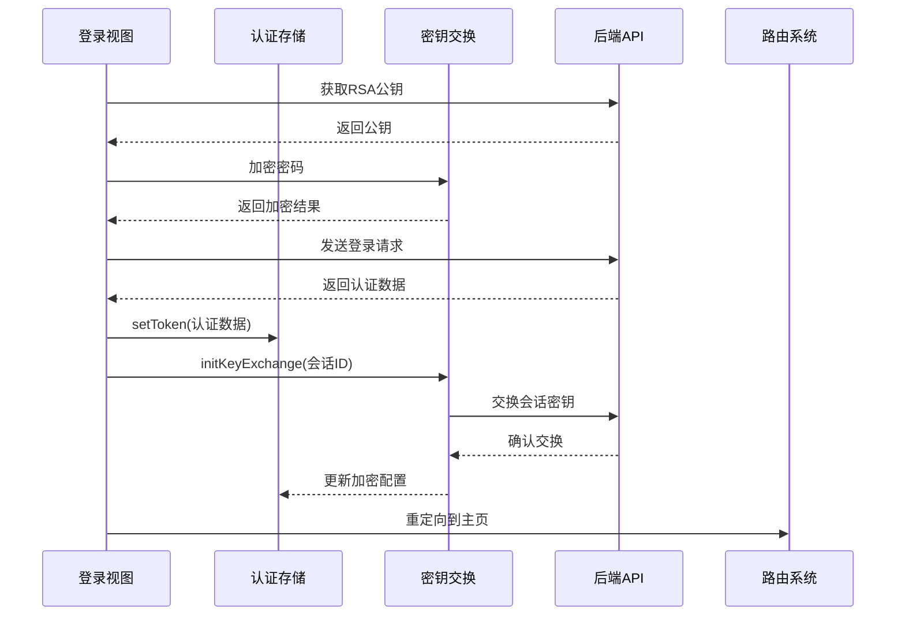
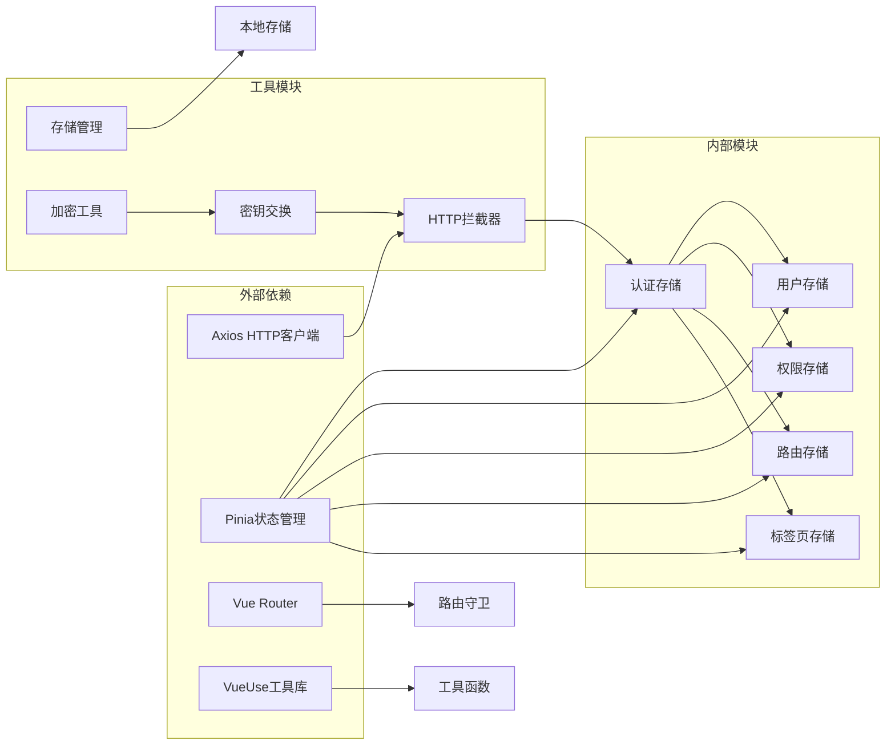

# 认证状态管理

<cite>
**本文档引用的文件**
- [auth.js](file://forge-admin-ui/src/store/modules/auth.js)
- [index.js](file://forge-admin-ui/src/store/index.js)
- [interceptors.js](file://forge-admin-ui/src/utils/http/interceptors.js)
- [index.js](file://forge-admin-ui/src/utils/http/index.js)
- [key-exchange.js](file://forge-admin-ui/src/utils/crypto/key-exchange.js)
- [user.js](file://forge-admin-ui/src/store/modules/user.js)
- [permission.js](file://forge-admin-ui/src/store/modules/permission.js)
- [helper.js](file://forge-admin-ui/src/store/helper.js)
- [permission-guard.js](file://forge-admin-ui/src/router/guards/permission-guard.js)
- [index.vue](file://forge-admin-ui/src/views/login/index.vue)
- [api.js](file://forge-admin-ui/src/views/login/api.js)
- [whitelist.config.js](file://forge-admin-ui/src/config/whitelist.config.js)
- [main.js](file://forge-admin-ui/src/main.js)
</cite>

## 目录
1. [简介](#简介)
2. [项目结构](#项目结构)
3. [核心组件](#核心组件)
4. [架构概览](#架构概览)
5. [详细组件分析](#详细组件分析)
6. [依赖关系分析](#依赖关系分析)
7. [性能考虑](#性能考虑)
8. [故障排除指南](#故障排除指南)
9. [结论](#结论)
10. [附录](#附录)

## 简介

认证状态管理模块是Forge Admin前端框架的核心组件，负责管理用户认证状态、Token生命周期、权限验证和登出处理。该模块采用Pinia状态管理库，结合Vue 3 Composition API，实现了完整的认证流程管理和安全通信机制。

本模块的主要功能包括：
- 用户认证状态的集中管理
- Token的自动添加和维护
- 权限验证和路由守卫
- 安全的密钥交换机制
- 自动化的登出和状态重置
- 与后端API的无缝集成

## 项目结构

认证状态管理模块位于前端项目的store目录下，采用模块化设计，与其他核心模块紧密协作：

**图表来源**
- [auth.js](file://forge-admin-ui/src/store/modules/auth.js#L1-L78)
- [interceptors.js](file://forge-admin-ui/src/utils/http/interceptors.js#L1-L165)
- [key-exchange.js](file://forge-admin-ui/src/utils/crypto/key-exchange.js#L1-L265)

**章节来源**
- [auth.js](file://forge-admin-ui/src/store/modules/auth.js#L1-L78)
- [index.js](file://forge-admin-ui/src/store/index.js#L1-L11)

## 核心组件

### 认证状态存储(auth.js)

认证状态存储是整个认证系统的核心，基于Pinia实现，提供了以下关键功能：

**状态管理**
- `accessToken`: JWT访问令牌
- `userInfo`: 用户基本信息
- `staffInfo`: 员工相关信息

**认证头生成**
自动为每个HTTP请求添加Authorization头，支持Bearer Token认证模式。

**Token管理**
- `setToken()`: 设置访问令牌
- `resetToken()`: 重置令牌状态
- `logout()`: 完整的登出流程

**章节来源**
- [auth.js](file://forge-admin-ui/src/store/modules/auth.js#L6-L77)

### HTTP拦截器(interceptors.js)

HTTP拦截器负责处理所有API请求和响应，实现统一的认证和错误处理：

**请求拦截**
- 自动添加Authorization头
- Trace ID追踪
- 防重放攻击保护
- 请求加密

**响应拦截**
- 统一错误处理
- 解密响应数据
- 业务错误识别

**章节来源**
- [interceptors.js](file://forge-admin-ui/src/utils/http/interceptors.js#L15-L165)

### 密钥交换(key-exchange.js)

实现动态密钥交换的安全通信机制：

**密钥管理**
- RSA公钥获取
- 会话密钥生成
- 密钥持久化存储

**安全特性**
- 防重放攻击
- 会话密钥轮换
- 自动密钥恢复

**章节来源**
- [key-exchange.js](file://forge-admin-ui/src/utils/crypto/key-exchange.js#L1-L265)

## 架构概览

认证状态管理采用分层架构设计，各组件职责明确，协作紧密：

**图表来源**
- [index.vue](file://forge-admin-ui/src/views/login/index.vue#L436-L564)
- [auth.js](file://forge-admin-ui/src/store/modules/auth.js#L26-L72)
- [permission-guard.js](file://forge-admin-ui/src/router/guards/permission-guard.js#L84-L200)

## 详细组件分析

### 认证状态管理器

认证状态管理器是模块的核心，负责协调各个认证相关组件的工作：

**图表来源**
- [auth.js](file://forge-admin-ui/src/store/modules/auth.js#L6-L77)
- [user.js](file://forge-admin-ui/src/store/modules/user.js#L23-L118)
- [permission.js](file://forge-admin-ui/src/store/modules/permission.js#L5-L269)

#### Token管理机制

Token管理采用自动化的生命周期管理模式：

**Token设置流程**
1. 接收后端返回的认证数据
2. 提取accessToken字段
3. 自动更新Authorization头
4. 触发相关状态更新

**Token存储策略**
- 内存存储：实时访问
- 持久化存储：跨会话保持
- 自动清理：登出时重置

**章节来源**
- [auth.js](file://forge-admin-ui/src/store/modules/auth.js#L26-L36)

### 路由守卫系统

路由守卫系统确保只有认证用户才能访问受保护的资源：

**图表来源**
- [permission-guard.js](file://forge-admin-ui/src/router/guards/permission-guard.js#L84-L200)

#### 权限验证流程

权限验证采用多层次的检查机制：

**认证检查**
- Token有效性验证
- 用户状态检查
- 权限级别验证

**路由权限**
- 动态路由生成
- 组件权限控制
- 菜单权限展示

**章节来源**
- [permission-guard.js](file://forge-admin-ui/src/router/guards/permission-guard.js#L114-L192)

### 登录处理流程

登录处理流程实现了完整的用户认证体验：

**图表来源**
- [index.vue](file://forge-admin-ui/src/views/login/index.vue#L436-L564)
- [api.js](file://forge-admin-ui/src/views/login/api.js#L4-L24)

#### 登录配置管理

支持多种登录方式的灵活配置：

**验证码类型**
- 图形验证码
- 滑块验证码
- 短信验证码

**安全配置**
- 密码加密传输
- 验证码时效管理
- 登录尝试限制

**章节来源**
- [index.vue](file://forge-admin-ui/src/views/login/index.vue#L285-L326)

### 错误处理机制

系统实现了全面的错误处理机制：

**HTTP错误处理**
- 网络错误捕获
- 业务错误分类
- 统一错误提示

**认证错误处理**
- Token过期检测
- 自动重新登录
- 错误状态恢复

**安全错误处理**
- 密钥过期处理
- 重放攻击防护
- 异常状态清理

**章节来源**
- [interceptors.js](file://forge-admin-ui/src/utils/http/interceptors.js#L76-L110)

## 依赖关系分析

认证状态管理模块的依赖关系清晰明确：

**图表来源**
- [auth.js](file://forge-admin-ui/src/store/modules/auth.js#L1-L5)
- [interceptors.js](file://forge-admin-ui/src/utils/http/interceptors.js#L1-L5)

**章节来源**
- [auth.js](file://forge-admin-ui/src/store/modules/auth.js#L1-L5)
- [index.js](file://forge-admin-ui/src/store/index.js#L1-L11)

## 性能考虑

认证状态管理模块在设计时充分考虑了性能优化：

**内存管理**
- 按需加载用户信息
- 及时清理过期数据
- 避免内存泄漏

**网络优化**
- 批量API请求
- 缓存策略
- 连接池管理

**渲染优化**
- 组件懒加载
- 虚拟滚动
- 防抖处理

## 故障排除指南

### 常见问题诊断

**Token相关问题**
- Token过期：检查后端JWT配置
- Token丢失：验证存储机制
- 认证失败：检查权限配置

**路由问题**
- 404错误：检查路由注册
- 权限拒绝：验证权限配置
- 无限重定向：检查白名单设置

**安全问题**
- 密钥交换失败：检查网络连接
- 加密错误：验证公钥状态
- 重放攻击：检查时间同步

**章节来源**
- [permission-guard.js](file://forge-admin-ui/src/router/guards/permission-guard.js#L540-L545)

### 调试技巧

**开发环境调试**
- 启用详细日志
- 使用浏览器开发者工具
- 监控网络请求

**生产环境监控**
- 错误追踪
- 性能监控
- 用户行为分析

## 结论

认证状态管理模块通过精心设计的架构和完善的机制，为Forge Admin提供了安全可靠的用户认证解决方案。模块具有以下特点：

**安全性**
- 多层安全防护
- 动态密钥交换
- 加密通信

**可靠性**
- 完善的错误处理
- 自动状态恢复
- 优雅降级

**可扩展性**
- 模块化设计
- 插件化架构
- 配置灵活

该模块为整个前端应用提供了坚实的认证基础，确保了系统的安全性和用户体验。

## 附录

### 扩展开发指南

**新增认证方式**
1. 在API层添加新的认证接口
2. 在认证存储中添加相应状态
3. 更新路由守卫逻辑
4. 添加相应的UI组件

**自定义权限系统**
1. 扩展权限存储结构
2. 实现权限验证逻辑
3. 更新菜单生成规则
4. 添加权限配置界面

**安全增强**
1. 实现双因素认证
2. 添加生物识别支持
3. 增强密钥管理
4. 实现审计日志

### 最佳实践

**开发规范**
- 遵循单一职责原则
- 使用类型安全编程
- 实现错误边界处理
- 编写单元测试

**部署建议**
- 配置适当的缓存策略
- 实现健康检查
- 监控系统性能
- 准备应急响应计划