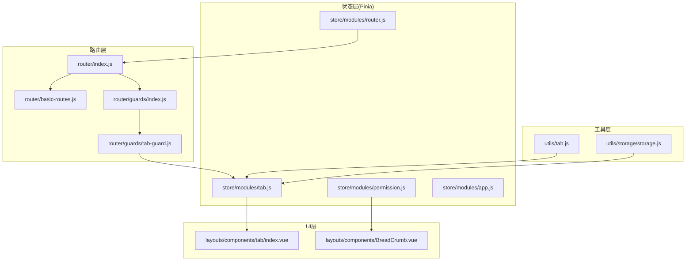
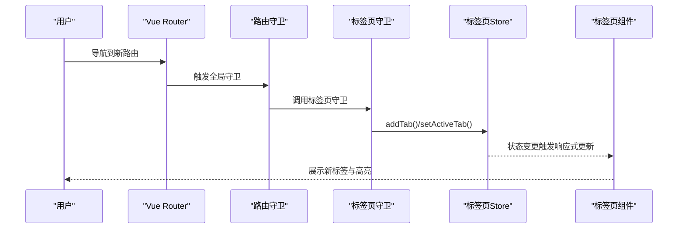
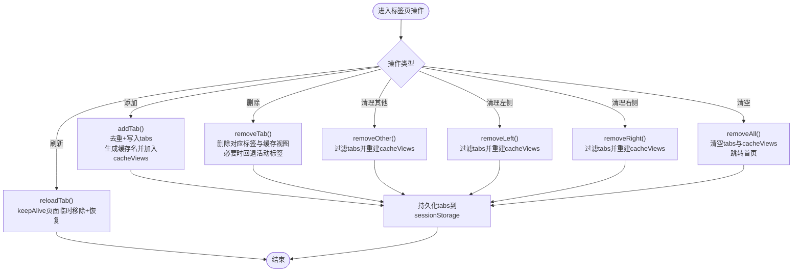
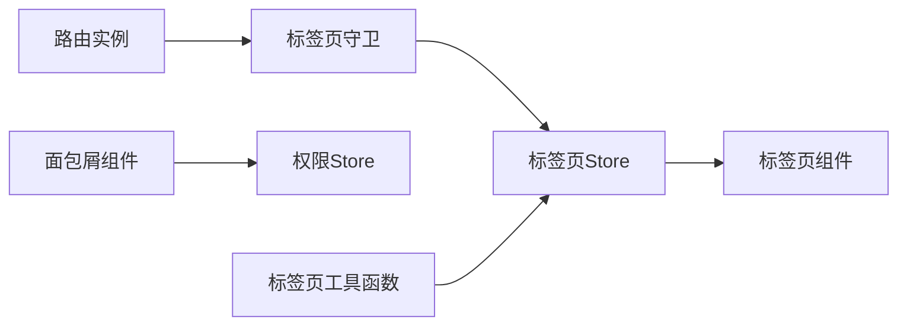

# 路由状态管理

<cite>
**本文引用的文件**
- [router/index.js](file://forge-admin-ui/src/router/index.js)
- [router/basic-routes.js](file://forge-admin-ui/src/router/basic-routes.js)
- [router/guards/index.js](file://forge-admin-ui/src/router/guards/index.js)
- [router/guards/tab-guard.js](file://forge-admin-ui/src/router/guards/tab-guard.js)
- [store/modules/router.js](file://forge-admin-ui/src/store/modules/router.js)
- [store/modules/tab.js](file://forge-admin-ui/src/store/modules/tab.js)
- [store/modules/permission.js](file://forge-admin-ui/src/store/modules/permission.js)
- [store/modules/app.js](file://forge-admin-ui/src/store/modules/app.js)
- [layouts/components/tab/index.vue](file://forge-admin-ui/src/layouts/components/tab/index.vue)
- [layouts/components/BreadCrumb.vue](file://forge-admin-ui/src/layouts/components/BreadCrumb.vue)
- [utils/tab.js](file://forge-admin-ui/src/utils/tab.js)
- [utils/storage/storage.js](file://forge-admin-ui/src/utils/storage/storage.js)
- [views/system/user.vue](file://forge-admin-ui/src/views/system/user.vue)
- [views/system/menu.vue](file://forge-admin-ui/src/views/system/menu.vue)
- [layouts/normal/index.vue](file://forge-admin-ui/src/layouts/normal/index.vue)
</cite>

## 目录
1. [简介](#简介)
2. [项目结构](#项目结构)
3. [核心组件](#核心组件)
4. [架构总览](#架构总览)
5. [详细组件分析](#详细组件分析)
6. [依赖关系分析](#依赖关系分析)
7. [性能考虑](#性能考虑)
8. [故障排查指南](#故障排查指南)
9. [结论](#结论)
10. [附录](#附录)

## 简介
本文件聚焦于“路由状态管理”模块，围绕 forge-admin-ui 中的路由状态、面包屑导航、标签页状态与路由切换进行系统化技术说明。重点覆盖以下方面：
- 路由状态的数据结构设计与来源
- 标签页状态与缓存策略
- 面包屑导航的生成逻辑
- 路由守卫如何传递与同步状态
- 路由状态持久化方案
- 扩展开发指南与性能优化建议

## 项目结构
路由状态管理涉及的核心文件分布如下：
- 路由注册与历史模式配置：router/index.js
- 基础路由集合：router/basic-routes.js
- 路由守卫入口：router/guards/index.js
- 标签页守卫：router/guards/tab-guard.js
- Pinia 状态模块：store/modules/router.js、store/modules/tab.js、store/modules/permission.js、store/modules/app.js
- UI 组件：layouts/components/tab/index.vue、layouts/components/BreadCrumb.vue
- 工具函数：utils/tab.js、utils/storage/storage.js
- 页面示例：views/system/user.vue、views/system/menu.vue
- 布局：layouts/normal/index.vue

图表来源
- [router/index.js](file://forge-admin-ui/src/router/index.js#L1-L18)
- [router/basic-routes.js](file://forge-admin-ui/src/router/basic-routes.js#L1-L86)
- [router/guards/index.js](file://forge-admin-ui/src/router/guards/index.js#L1-L12)
- [router/guards/tab-guard.js](file://forge-admin-ui/src/router/guards/tab-guard.js#L1-L41)
- [store/modules/router.js](file://forge-admin-ui/src/store/modules/router.js#L1-L19)
- [store/modules/tab.js](file://forge-admin-ui/src/store/modules/tab.js#L1-L174)
- [store/modules/permission.js](file://forge-admin-ui/src/store/modules/permission.js#L1-L269)
- [store/modules/app.js](file://forge-admin-ui/src/store/modules/app.js#L1-L91)
- [layouts/components/tab/index.vue](file://forge-admin-ui/src/layouts/components/tab/index.vue#L1-L94)
- [layouts/components/BreadCrumb.vue](file://forge-admin-ui/src/layouts/components/BreadCrumb.vue#L1-L79)
- [utils/tab.js](file://forge-admin-ui/src/utils/tab.js#L1-L226)
- [utils/storage/storage.js](file://forge-admin-ui/src/utils/storage/storage.js#L1-L59)

章节来源
- [router/index.js](file://forge-admin-ui/src/router/index.js#L1-L18)
- [router/basic-routes.js](file://forge-admin-ui/src/router/basic-routes.js#L1-L86)
- [router/guards/index.js](file://forge-admin-ui/src/router/guards/index.js#L1-L12)
- [router/guards/tab-guard.js](file://forge-admin-ui/src/router/guards/tab-guard.js#L1-L41)
- [store/modules/tab.js](file://forge-admin-ui/src/store/modules/tab.js#L1-L174)
- [store/modules/permission.js](file://forge-admin-ui/src/store/modules/permission.js#L1-L269)
- [layouts/components/tab/index.vue](file://forge-admin-ui/src/layouts/components/tab/index.vue#L1-L94)
- [layouts/components/BreadCrumb.vue](file://forge-admin-ui/src/layouts/components/BreadCrumb.vue#L1-L79)
- [utils/tab.js](file://forge-admin-ui/src/utils/tab.js#L1-L226)
- [utils/storage/storage.js](file://forge-admin-ui/src/utils/storage/storage.js#L1-L59)

## 核心组件
- 路由实例与历史模式
  - 基于环境变量动态选择 hash 或 history 模式，并注入基础路由与滚动行为。
- 路由守卫体系
  - 页面加载、标题、权限与标签页守卫统一入口，按序安装。
- 标签页状态管理
  - 基于 Pinia 的标签页集合、活动标签、缓存视图列表与持久化策略。
- 面包屑导航
  - 基于权限树与当前路由匹配生成层级路径。
- 工具函数
  - 提供关闭/刷新/批量关闭等标签页操作，封装对 store 的调用。

章节来源
- [router/index.js](file://forge-admin-ui/src/router/index.js#L1-L18)
- [router/guards/index.js](file://forge-admin-ui/src/router/guards/index.js#L1-L12)
- [store/modules/tab.js](file://forge-admin-ui/src/store/modules/tab.js#L1-L174)
- [layouts/components/BreadCrumb.vue](file://forge-admin-ui/src/layouts/components/BreadCrumb.vue#L1-L79)
- [utils/tab.js](file://forge-admin-ui/src/utils/tab.js#L1-L226)

## 架构总览
路由状态管理的运行时交互如下：

图表来源
- [router/guards/tab-guard.js](file://forge-admin-ui/src/router/guards/tab-guard.js#L1-L41)
- [store/modules/tab.js](file://forge-admin-ui/src/store/modules/tab.js#L1-L174)
- [layouts/components/tab/index.vue](file://forge-admin-ui/src/layouts/components/tab/index.vue#L1-L94)

## 详细组件分析

### 路由注册与历史模式
- 历史模式选择
  - 通过环境变量决定使用 hash 或 history，并支持公共路径前缀。
- 基础路由注入
  - 将基础路由集合注入到 router 实例。
- 滚动行为
  - 每次导航后滚动至顶部，提升用户体验一致性。

章节来源
- [router/index.js](file://forge-admin-ui/src/router/index.js#L1-L18)
- [router/basic-routes.js](file://forge-admin-ui/src/router/basic-routes.js#L1-L86)

### 路由守卫体系
- 守卫入口
  - 统一安装页面加载、页面标题、权限与标签页守卫。
- 标签页守卫
  - 在每次路由 after 钩子中，读取 meta 标题与图标，尝试从组件默认导出读取标题，避免重复添加标签，设置活动标签。

章节来源
- [router/guards/index.js](file://forge-admin-ui/src/router/guards/index.js#L1-L12)
- [router/guards/tab-guard.js](file://forge-admin-ui/src/router/guards/tab-guard.js#L1-L41)

### 标签页状态管理（Pinia Store）
- 数据结构
  - tabs：标签页数组，包含 name、path、title、icon、keepAlive、key 等字段。
  - activeTab：当前活动标签键。
  - cacheViews：缓存视图名称列表，基于路径转换生成。
  - reloading：刷新状态标记。
- 关键动作
  - addTab：去重后添加标签；根据路径生成缓存名并加入缓存视图列表。
  - removeTab：删除对应标签与缓存视图；若删除的是活动标签，回退到相邻标签并导航。
  - removeOther/removeLeft/removeRight：批量清理并同步缓存视图列表。
  - removeAll：清空标签与缓存视图，跳转首页。
  - reloadTab：支持 keepAlive 页面的临时移除与恢复，配合 nextTick 触发重新渲染。
  - setTabs/persist：持久化仅 tabs 字段到 sessionStorage，键带租户前缀。
- 与路由的关系
  - 通过守卫自动同步标签页；通过工具函数与组件交互实现关闭/刷新等操作。

图表来源
- [store/modules/tab.js](file://forge-admin-ui/src/store/modules/tab.js#L1-L174)

章节来源
- [store/modules/tab.js](file://forge-admin-ui/src/store/modules/tab.js#L1-L174)

### 面包屑导航
- 来源与匹配
  - 基于权限树与当前路由 name 进行匹配，生成面包屑路径。
- 交互
  - 支持下拉选择与点击跳转，最终通过路由 push 完成导航。
- 依赖
  - 依赖权限 store 与路由实例。

章节来源
- [layouts/components/BreadCrumb.vue](file://forge-admin-ui/src/layouts/components/BreadCrumb.vue#L1-L79)
- [store/modules/permission.js](file://forge-admin-ui/src/store/modules/permission.js#L1-L269)

### 标签页工具函数
- 关闭单个/多个标签
  - 支持精确匹配与前缀匹配，避免 query 参数导致的误判。
- 关闭并打开新标签
  - 先关闭目标标签，再导航到新路径。
- 刷新标签
  - 依据当前路由或指定路径，结合 keepAlive 状态执行刷新。
- 关闭左右/其他/全部
  - 提供多种批量清理能力，并同步更新缓存视图列表。

章节来源
- [utils/tab.js](file://forge-admin-ui/src/utils/tab.js#L1-L226)

### 路由状态与页面组件的集成
- 页面组件示例
  - 用户管理与菜单管理页面展示了 CRUD 与复杂交互，路由状态通过守卫与 store 自动维护，页面无需直接关心标签页细节。
- 布局集成
  - 布局文件引入标签页组件与面包屑组件，形成统一的导航体验。

章节来源
- [views/system/user.vue](file://forge-admin-ui/src/views/system/user.vue#L1-L1036)
- [views/system/menu.vue](file://forge-admin-ui/src/views/system/menu.vue#L1-L737)
- [layouts/normal/index.vue](file://forge-admin-ui/src/layouts/normal/index.vue#L1-L192)

### 路由守卫的状态传递
- 标签页守卫
  - 从路由 meta 与组件默认导出读取标题，避免重复标签，设置活动标签。
- 权限守卫
  - 通过权限 store 生成访问路由并注入，保障导航安全。
- 页面标题守卫
  - 依据 meta.title 设置页面标题，提升 SEO 与可读性。

章节来源
- [router/guards/tab-guard.js](file://forge-admin-ui/src/router/guards/tab-guard.js#L1-L41)
- [store/modules/permission.js](file://forge-admin-ui/src/store/modules/permission.js#L1-L269)

### 路由状态持久化实现
- 存储策略
  - 标签页状态仅持久化 tabs 字段到 sessionStorage，键名包含租户前缀，避免跨租户污染。
- 存储工具
  - 提供带过期时间的通用存储类，便于扩展其他状态持久化场景。

章节来源
- [store/modules/tab.js](file://forge-admin-ui/src/store/modules/tab.js#L169-L173)
- [utils/storage/storage.js](file://forge-admin-ui/src/utils/storage/storage.js#L1-L59)

## 依赖关系分析
- 组件耦合
  - 标签页组件依赖标签页 store；面包屑组件依赖权限 store；守卫依赖标签页 store 与路由实例。
- 状态耦合
  - 标签页 store 与工具函数双向协作，工具函数封装对 store 的调用，降低页面耦合度。
- 外部依赖
  - Vue Router、Pinia、Naive UI 组件库。

图表来源
- [router/guards/tab-guard.js](file://forge-admin-ui/src/router/guards/tab-guard.js#L1-L41)
- [store/modules/tab.js](file://forge-admin-ui/src/store/modules/tab.js#L1-L174)
- [layouts/components/tab/index.vue](file://forge-admin-ui/src/layouts/components/tab/index.vue#L1-L94)
- [layouts/components/BreadCrumb.vue](file://forge-admin-ui/src/layouts/components/BreadCrumb.vue#L1-L79)
- [utils/tab.js](file://forge-admin-ui/src/utils/tab.js#L1-L226)

章节来源
- [router/guards/tab-guard.js](file://forge-admin-ui/src/router/guards/tab-guard.js#L1-L41)
- [store/modules/tab.js](file://forge-admin-ui/src/store/modules/tab.js#L1-L174)
- [layouts/components/tab/index.vue](file://forge-admin-ui/src/layouts/components/tab/index.vue#L1-L94)
- [layouts/components/BreadCrumb.vue](file://forge-admin-ui/src/layouts/components/BreadCrumb.vue#L1-L79)
- [utils/tab.js](file://forge-admin-ui/src/utils/tab.js#L1-L226)

## 性能考虑
- 标签页数量控制
  - 限制同时打开的标签页数量，避免过多组件实例导致内存与渲染压力。
- 缓存策略
  - 仅对需要保持状态的页面启用 keepAlive，并合理使用缓存视图列表，减少无效缓存。
- 路由守卫轻量化
  - 守卫中尽量避免重型计算，优先使用已存在的 meta 与组件导出信息。
- 滚动行为
  - 固定滚动至顶部可减少页面滚动状态的复杂性，提升一致性体验。
- 持久化粒度
  - 仅持久化必要字段，降低序列化/反序列化成本。

## 故障排查指南
- 标签页未更新
  - 检查守卫是否正确执行，确认 meta.title 是否存在，组件默认导出是否可读。
- 标签页重复
  - 确认 addTab 去重逻辑与 key 生成规则是否一致。
- 刷新无效
  - 检查 keepAlive 标记与 reloadTab 流程，确保临时移除与恢复顺序正确。
- 面包屑不显示
  - 确认权限树是否包含当前路由 code，匹配逻辑是否正确。
- 路由跳转异常
  - 检查基础路由与动态路由注入顺序，确认权限 store 是否已生成 accessRoutes。

章节来源
- [router/guards/tab-guard.js](file://forge-admin-ui/src/router/guards/tab-guard.js#L1-L41)
- [store/modules/tab.js](file://forge-admin-ui/src/store/modules/tab.js#L1-L174)
- [layouts/components/BreadCrumb.vue](file://forge-admin-ui/src/layouts/components/BreadCrumb.vue#L1-L79)
- [store/modules/permission.js](file://forge-admin-ui/src/store/modules/permission.js#L1-L269)

## 结论
本模块通过“路由守卫 + Pinia Store + UI 组件”的分层设计，实现了路由状态的自动化管理与持久化。标签页与面包屑导航在统一的状态驱动下协同工作，既保证了用户体验，又降低了页面与路由系统的耦合度。后续可在缓存策略、标签页数量限制与守卫性能上持续优化。

## 附录

### 路由状态数据结构定义
- 标签页项
  - 字段：name、path、title、icon、keepAlive、key
  - 用途：描述一个标签页的元信息与状态
- 活动标签
  - 字段：activeTab
  - 用途：记录当前激活的标签键
- 缓存视图列表
  - 字段：cacheViews
  - 用途：记录需要缓存的视图名称，基于路径转换生成
- 路由状态
  - 字段：router、route、accessRoutes（来自权限 store）
  - 用途：提供路由实例与动态路由注入能力

章节来源
- [store/modules/tab.js](file://forge-admin-ui/src/store/modules/tab.js#L1-L174)
- [store/modules/router.js](file://forge-admin-ui/src/store/modules/router.js#L1-L19)
- [store/modules/permission.js](file://forge-admin-ui/src/store/modules/permission.js#L1-L269)

### 路由缓存策略
- 缓存触发条件
  - 由路由 meta.keepAlive 控制是否缓存
- 缓存视图命名
  - 将路径中的斜杠替换为短横线，并去除查询参数，得到缓存名称
- 缓存生命周期
  - 与标签页集合同步，关闭标签时移除对应缓存视图

章节来源
- [store/modules/tab.js](file://forge-admin-ui/src/store/modules/tab.js#L26-L41)
- [store/modules/permission.js](file://forge-admin-ui/src/store/modules/permission.js#L102-L116)

### 标签页管理机制
- 添加标签
  - 去重后写入 tabs，生成缓存名并加入 cacheViews
- 删除标签
  - 删除对应标签与缓存视图；若删除活动标签，回退到相邻标签并导航
- 批量清理
  - 其他/左侧/右侧清理会重建 cacheViews 并更新 tabs
- 清空
  - 清空 tabs 与 cacheViews，并跳转首页

章节来源
- [store/modules/tab.js](file://forge-admin-ui/src/store/modules/tab.js#L26-L140)

### 路由状态与页面组件的集成方式
- 页面无需直接操作标签页，通过工具函数与守卫自动维护
- 布局中引入标签页组件与面包屑组件，统一展示导航状态

章节来源
- [utils/tab.js](file://forge-admin-ui/src/utils/tab.js#L1-L226)
- [layouts/components/tab/index.vue](file://forge-admin-ui/src/layouts/components/tab/index.vue#L1-L94)
- [layouts/components/BreadCrumb.vue](file://forge-admin-ui/src/layouts/components/BreadCrumb.vue#L1-L79)

### 路由守卫的状态传递
- 标题与图标
  - 从 meta 与组件默认导出读取，避免重复标签
- 权限与动态路由
  - 通过权限 store 生成 accessRoutes 并注入

章节来源
- [router/guards/tab-guard.js](file://forge-admin-ui/src/router/guards/tab-guard.js#L1-L41)
- [store/modules/permission.js](file://forge-admin-ui/src/store/modules/permission.js#L79-L130)

### 路由状态持久化实现
- 持久化字段
  - 仅持久化 tabs 字段
- 存储介质
  - sessionStorage
- 键名规则
  - 带租户前缀，避免跨租户冲突

章节来源
- [store/modules/tab.js](file://forge-admin-ui/src/store/modules/tab.js#L169-L173)

### 路由状态扩展开发指南
- 新增标签页
  - 在守卫中确保 meta.title/icon 正确设置；如需自定义标题，可在组件默认导出提供 title
- 扩展缓存策略
  - 依据业务需求在 keepAlive 与 cacheViews 之间平衡
- 扩展守卫
  - 在 guards 目录新增守卫并在入口统一安装
- 扩展工具函数
  - 在 utils/tab.js 中新增标签页操作，保持与 store 的解耦

章节来源
- [router/guards/tab-guard.js](file://forge-admin-ui/src/router/guards/tab-guard.js#L1-L41)
- [utils/tab.js](file://forge-admin-ui/src/utils/tab.js#L1-L226)