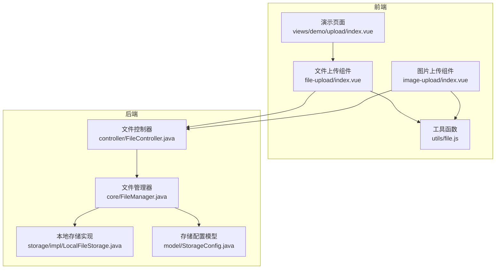
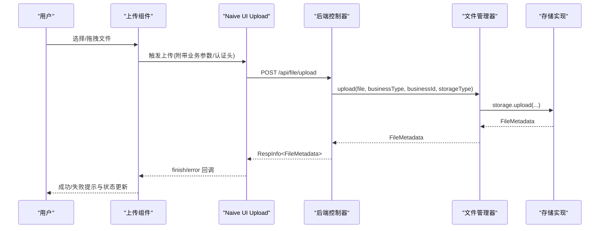
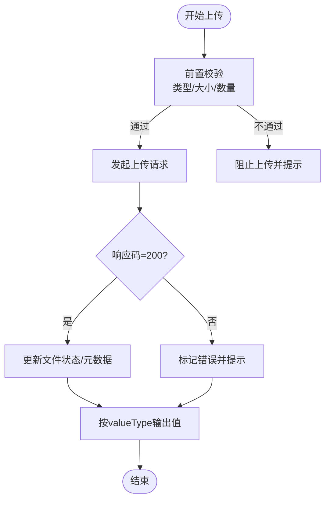
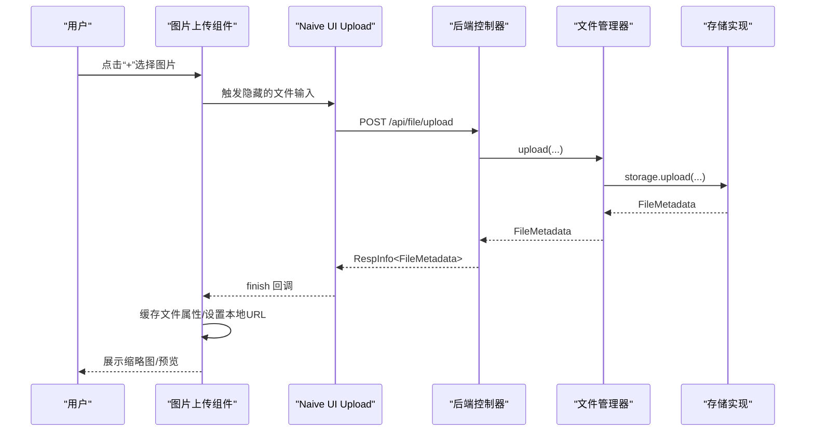
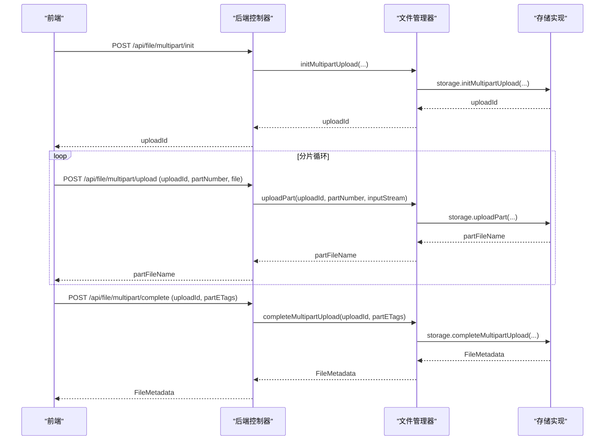
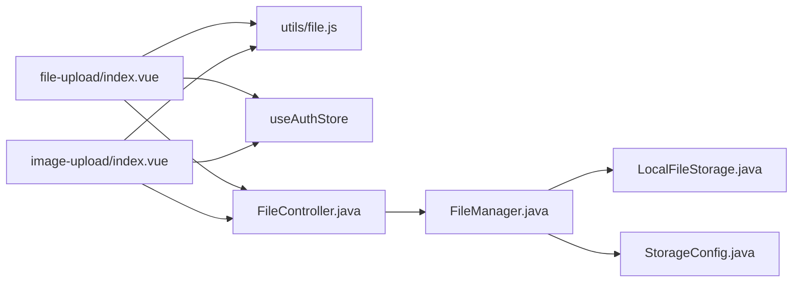

# 上传组件

<cite>
**本文引用的文件**
- [file-upload/index.vue](file://forge-admin-ui/src/components/file-upload/index.vue)
- [image-upload/index.vue](file://forge-admin-ui/src/components/image-upload/index.vue)
- [file.js](file://forge-admin-ui/src/utils/file.js)
- [index.vue](file://forge-admin-ui/src/views/demo/upload/index.vue)
- [FileController.java](file://forge/forge-framework/forge-starter-parent/forge-starter-file/src/main/java/com/mdframe/forge/starter/file/controller/FileController.java)
- [FileManager.java](file://forge/forge-framework/forge-starter-parent/forge-starter-file/src/main/java/com/mdframe/forge/starter/file/core/FileManager.java)
- [LocalFileStorage.java](file://forge/forge-framework/forge-starter-parent/forge-starter-file/src/main/java/com/mdframe/forge/starter/file/storage/impl/LocalFileStorage.java)
- [StorageConfig.java](file://forge/forge-framework/forge-starter-parent/forge-starter-file/src/main/java/com/mdframe/forge/starter/file/model/StorageConfig.java)
</cite>

## 目录
1. [简介](#简介)
2. [项目结构](#项目结构)
3. [核心组件](#核心组件)
4. [架构总览](#架构总览)
5. [详细组件分析](#详细组件分析)
6. [依赖关系分析](#依赖关系分析)
7. [性能考量](#性能考量)
8. [故障排查指南](#故障排查指南)
9. [结论](#结论)
10. [附录](#附录)

## 简介
本技术文档围绕 Forge 项目的上传组件展开，系统性介绍文件上传与图片上传两大组件的设计与实现要点，涵盖文件选择、拖拽上传、进度显示、错误处理、类型与大小限制、并发控制策略、分片上传与断点续传、事件回调与状态管理、用户体验优化、配置项与样式定制、国际化支持以及典型应用场景与性能调优建议。

## 项目结构
上传组件位于前端 UI 工程的组件目录，配合后端文件服务模块共同实现完整的上传能力。前端组件负责用户交互、校验与状态管理；后端控制器与文件管理器负责业务逻辑、存储策略与分片上传。

**图表来源**
- [file-upload/index.vue](file://forge-admin-ui/src/components/file-upload/index.vue#L1-L469)
- [image-upload/index.vue](file://forge-admin-ui/src/components/image-upload/index.vue#L1-L632)
- [file.js](file://forge-admin-ui/src/utils/file.js#L1-L92)
- [index.vue](file://forge-admin-ui/src/views/demo/upload/index.vue#L1-L86)
- [FileController.java](file://forge/forge-framework/forge-starter-parent/forge-starter-file/src/main/java/com/mdframe/forge/starter/file/controller/FileController.java#L1-L117)
- [FileManager.java](file://forge/forge-framework/forge-starter-parent/forge-starter-file/src/main/java/com/mdframe/forge/starter/file/core/FileManager.java#L1-L255)
- [LocalFileStorage.java](file://forge/forge-framework/forge-starter-parent/forge-starter-file/src/main/java/com/mdframe/forge/starter/file/storage/impl/LocalFileStorage.java#L131-L252)
- [StorageConfig.java](file://forge/forge-framework/forge-starter-parent/forge-starter-file/src/main/java/com/mdframe/forge/starter/file/model/StorageConfig.java#L91-L108)

**章节来源**
- [file-upload/index.vue](file://forge-admin-ui/src/components/file-upload/index.vue#L1-L51)
- [image-upload/index.vue](file://forge-admin-ui/src/components/image-upload/index.vue#L1-L86)
- [file.js](file://forge-admin-ui/src/utils/file.js#L1-L33)
- [FileController.java](file://forge/forge-framework/forge-starter-parent/forge-starter-file/src/main/java/com/mdframe/forge/starter/file/controller/FileController.java#L21-L116)

## 核心组件
- 文件上传组件：基于 Naive UI Upload，支持多文件、类型与大小限制、数量限制、提示信息、事件回调与值输出格式化。
- 图片上传组件：在文件上传基础上增强图片预览、本地 blob 展示、删除与模态预览，适配图片场景的 UI 与交互。
- 工具函数：统一构建访问 URL、下载 URL、图片预览 URL，支持宽度、高度与缩放模式参数。
- 后端控制器与管理器：提供通用上传、分片上传初始化/上传/完成、下载、URL 获取、删除等接口与业务逻辑。

**章节来源**
- [file-upload/index.vue](file://forge-admin-ui/src/components/file-upload/index.vue#L64-L136)
- [image-upload/index.vue](file://forge-admin-ui/src/components/image-upload/index.vue#L95-L157)
- [file.js](file://forge-admin-ui/src/utils/file.js#L12-L91)
- [FileController.java](file://forge/forge-framework/forge-starter-parent/forge-starter-file/src/main/java/com/mdframe/forge/starter/file/controller/FileController.java#L31-L115)
- [FileManager.java](file://forge/forge-framework/forge-starter-parent/forge-starter-file/src/main/java/com/mdframe/forge/starter/file/core/FileManager.java#L58-L99)

## 架构总览
前端组件通过 Naive UI Upload 发起上传请求，携带业务参数与认证头；后端控制器接收请求，委托文件管理器执行上传或分片流程；存储策略由本地/云存储实现类提供，最终持久化元数据并返回结果。

**图表来源**
- [file-upload/index.vue](file://forge-admin-ui/src/components/file-upload/index.vue#L145-L166)
- [FileController.java](file://forge/forge-framework/forge-starter-parent/forge-starter-file/src/main/java/com/mdframe/forge/starter/file/controller/FileController.java#L31-L43)
- [FileManager.java](file://forge/forge-framework/forge-starter-parent/forge-starter-file/src/main/java/com/mdframe/forge/starter/file/core/FileManager.java#L58-L99)
- [LocalFileStorage.java](file://forge/forge-framework/forge-starter-parent/forge-starter-file/src/main/java/com/mdframe/forge/starter/file/storage/impl/LocalFileStorage.java#L131-L134)

## 详细组件分析

### 文件上传组件（file-upload）
- 文件选择与拖拽上传
  - 使用 Naive UI Upload 的默认插槽触发选择，支持 accept 类型过滤与多选。
  - 通过 on-before-upload、on-finish、on-error、on-remove 等钩子实现全流程控制。
- 进度显示与状态管理
  - 内置文件列表与状态字段（如 percentage、status），组件内部维护 fileList 并在 finish/error 时更新。
- 错误处理机制
  - 解析响应体，区分业务码与异常；统一弹窗提示与 error 事件抛出。
- 配置与行为
  - 支持业务类型/ID、存储类型、数量限制、大小限制、文件类型白名单、是否显示列表与提示、按钮文案、禁用状态、返回值类型（string/array/object）。
- 值输出与回显
  - 根据 valueType 输出不同格式；支持从字符串/数组/对象数组初始化文件列表；对已完成文件保留元数据与 URL。

**图表来源**
- [file-upload/index.vue](file://forge-admin-ui/src/components/file-upload/index.vue#L251-L340)
- [file-upload/index.vue](file://forge-admin-ui/src/components/file-upload/index.vue#L393-L419)

**章节来源**
- [file-upload/index.vue](file://forge-admin-ui/src/components/file-upload/index.vue#L1-L51)
- [file-upload/index.vue](file://forge-admin-ui/src/components/file-upload/index.vue#L64-L136)
- [file-upload/index.vue](file://forge-admin-ui/src/components/file-upload/index.vue#L251-L340)
- [file-upload/index.vue](file://forge-admin-ui/src/components/file-upload/index.vue#L350-L390)
- [file-upload/index.vue](file://forge-admin-ui/src/components/file-upload/index.vue#L393-L431)

### 图片上传组件（image-upload）
- 图片预览与本地展示
  - 优先使用本地 blob URL 避免闪烁；回显时可将远端 URL 转换为 blob URL。
- 裁剪与尺寸限制
  - 组件未内置裁剪功能；可通过工具函数生成带宽高与模式的预览 URL，满足前端展示需求。
- 删除与模态预览
  - 支持删除、预览大图；预览时根据是否为 blob URL 决策是否重新拉取。
- 状态与缓存
  - 使用 Map 缓存文件属性（fileId、filePath、originalUrl、url、thumbnailUrl），解决 Naive UI 覆盖自定义属性问题。

**图表来源**
- [image-upload/index.vue](file://forge-admin-ui/src/components/image-upload/index.vue#L366-L372)
- [image-upload/index.vue](file://forge-admin-ui/src/components/image-upload/index.vue#L292-L355)
- [image-upload/index.vue](file://forge-admin-ui/src/components/image-upload/index.vue#L448-L484)

**章节来源**
- [image-upload/index.vue](file://forge-admin-ui/src/components/image-upload/index.vue#L1-L86)
- [image-upload/index.vue](file://forge-admin-ui/src/components/image-upload/index.vue#L194-L250)
- [image-upload/index.vue](file://forge-admin-ui/src/components/image-upload/index.vue#L253-L289)
- [image-upload/index.vue](file://forge-admin-ui/src/components/image-upload/index.vue#L292-L355)
- [image-upload/index.vue](file://forge-admin-ui/src/components/image-upload/index.vue#L387-L417)
- [image-upload/index.vue](file://forge-admin-ui/src/components/image-upload/index.vue#L448-L505)

### 分片上传与断点续传
- 接口设计
  - 初始化：POST /api/file/multipart/init
  - 上传分片：POST /api/file/multipart/upload（携带 uploadId、partNumber）
  - 完成分片：POST /api/file/multipart/complete（携带 uploadId、partETags）
- 后端实现要点
  - LocalFileStorage 会为每个 uploadId 创建临时目录，保存分片文件，完成后合并并清理临时目录，生成最终 FileMetadata。
- 前端策略
  - 组件未内置分片上传逻辑，可在业务侧通过自定义上传流程调用上述接口实现分片与断点续传。

**图表来源**
- [FileController.java](file://forge/forge-framework/forge-starter-parent/forge-starter-file/src/main/java/com/mdframe/forge/starter/file/controller/FileController.java#L77-L115)
- [FileManager.java](file://forge/forge-framework/forge-starter-parent/forge-starter-file/src/main/java/com/mdframe/forge/starter/file/core/FileManager.java#L183-L218)
- [LocalFileStorage.java](file://forge/forge-framework/forge-starter-parent/forge-starter-file/src/main/java/com/mdframe/forge/starter/file/storage/impl/LocalFileStorage.java#L137-L163)
- [LocalFileStorage.java](file://forge/forge-framework/forge-starter-parent/forge-starter-file/src/main/java/com/mdframe/forge/starter/file/storage/impl/LocalFileStorage.java#L166-L185)
- [LocalFileStorage.java](file://forge/forge-framework/forge-starter-parent/forge-starter-file/src/main/java/com/mdframe/forge/starter/file/storage/impl/LocalFileStorage.java#L188-L252)

**章节来源**
- [FileController.java](file://forge/forge-framework/forge-starter-parent/forge-starter-file/src/main/java/com/mdframe/forge/starter/file/controller/FileController.java#L77-L115)
- [FileManager.java](file://forge/forge-framework/forge-starter-parent/forge-starter-file/src/main/java/com/mdframe/forge/starter/file/core/FileManager.java#L183-L218)
- [LocalFileStorage.java](file://forge/forge-framework/forge-starter-parent/forge-starter-file/src/main/java/com/mdframe/forge/starter/file/storage/impl/LocalFileStorage.java#L137-L163)
- [LocalFileStorage.java](file://forge/forge-framework/forge-starter-parent/forge-starter-file/src/main/java/com/mdframe/forge/starter/file/storage/impl/LocalFileStorage.java#L166-L185)
- [LocalFileStorage.java](file://forge/forge-framework/forge-starter-parent/forge-starter-file/src/main/java/com/mdframe/forge/starter/file/storage/impl/LocalFileStorage.java#L188-L252)

### 文件类型验证、大小限制与并发控制
- 类型与大小限制
  - 前端：on-before-upload 中按 fileType 与 fileSize 校验；accept 限定选择范围。
  - 后端：FileManager.validateFile 结合 StorageConfig 的 allowedTypes 与 maxFileSize 进行二次校验。
- 并发控制
  - 组件未内置并发队列；可通过外部控制（如业务层限制同时上传任务数）实现并发策略。

**章节来源**
- [file-upload/index.vue](file://forge-admin-ui/src/components/file-upload/index.vue#L251-L279)
- [image-upload/index.vue](file://forge-admin-ui/src/components/image-upload/index.vue#L253-L289)
- [FileManager.java](file://forge/forge-framework/forge-starter-parent/forge-starter-file/src/main/java/com/mdframe/forge/starter/file/core/FileManager.java#L223-L253)
- [StorageConfig.java](file://forge/forge-framework/forge-starter-parent/forge-starter-file/src/main/java/com/mdframe/forge/starter/file/model/StorageConfig.java#L102-L107)

### 事件回调、状态管理与用户体验优化
- 事件回调
  - success、error、remove、update:modelValue 等事件用于业务联动。
- 状态管理
  - 组件内部维护 fileList，区分 uploading/finished/error；对已完成文件保留元数据与 URL。
- 用户体验
  - 提示信息（支持格式/大小/数量）、上传中圆形进度、错误遮罩、删除与预览图标、回显时的本地 blob URL 减少闪烁。

**章节来源**
- [file-upload/index.vue](file://forge-admin-ui/src/components/file-upload/index.vue#L138-L139)
- [file-upload/index.vue](file://forge-admin-ui/src/components/file-upload/index.vue#L350-L354)
- [file-upload/index.vue](file://forge-admin-ui/src/components/file-upload/index.vue#L357-L390)
- [image-upload/index.vue](file://forge-admin-ui/src/components/image-upload/index.vue#L18-L35)
- [image-upload/index.vue](file://forge-admin-ui/src/components/image-upload/index.vue#L387-L417)

### 配置选项、样式定制与国际化支持
- 配置选项
  - 文件上传：action、businessType、businessId、storageType、limit、fileSize、fileType、multiple、showFileList、showTip、uploadButtonText、disabled、valueType。
  - 图片上传：同上，额外支持 fileType 默认值（图片类型集合）。
- 样式定制
  - 组件提供 scoped 样式，可按需覆盖容器、列表、动作图标、上传遮罩、错误遮罩等样式。
- 国际化
  - 组件内提示文本为中文；若需国际化，可在业务层替换提示文案或通过全局消息组件的国际化方案实现。

**章节来源**
- [file-upload/index.vue](file://forge-admin-ui/src/components/file-upload/index.vue#L64-L136)
- [image-upload/index.vue](file://forge-admin-ui/src/components/image-upload/index.vue#L95-L157)
- [file-upload/index.vue](file://forge-admin-ui/src/components/file-upload/index.vue#L443-L468)
- [image-upload/index.vue](file://forge-admin-ui/src/components/image-upload/index.vue#L508-L631)

### 实际应用场景与使用示例
- 演示页面
  - 展示拖拽上传与自定义请求流程，适合理解如何接入自定义上传逻辑。
- 常见场景
  - 文件上传：文档、压缩包、表格等，结合 FileType 与 FileSize 控制。
  - 图片上传：商品图、头像、轮播图等，结合图片预览与删除操作。

**章节来源**
- [index.vue](file://forge-admin-ui/src/views/demo/upload/index.vue#L1-L86)

## 依赖关系分析
- 前端组件依赖
  - Naive UI 组件库（NUpload、NButton、NIcon、NAlert、NModal、NProgress 等）。
  - 工具函数 getFileUrl、getFileDownloadUrl、getImageUrl。
  - 认证 Store（useAuthStore）注入 Authorization 头。
- 后端依赖
  - Spring MVC 控制器、文件管理器、存储策略接口与实现、存储配置模型。

**图表来源**
- [file-upload/index.vue](file://forge-admin-ui/src/components/file-upload/index.vue#L55-L63)
- [image-upload/index.vue](file://forge-admin-ui/src/components/image-upload/index.vue#L90-L93)
- [file.js](file://forge-admin-ui/src/utils/file.js#L12-L91)
- [FileController.java](file://forge/forge-framework/forge-starter-parent/forge-starter-file/src/main/java/com/mdframe/forge/starter/file/controller/FileController.java#L26-L26)
- [FileManager.java](file://forge/forge-framework/forge-starter-parent/forge-starter-file/src/main/java/com/mdframe/forge/starter/file/core/FileManager.java#L32-L53)
- [LocalFileStorage.java](file://forge/forge-framework/forge-starter-parent/forge-starter-file/src/main/java/com/mdframe/forge/starter/file/storage/impl/LocalFileStorage.java#L131-L134)
- [StorageConfig.java](file://forge/forge-framework/forge-starter-parent/forge-starter-file/src/main/java/com/mdframe/forge/starter/file/model/StorageConfig.java#L91-L108)

**章节来源**
- [file-upload/index.vue](file://forge-admin-ui/src/components/file-upload/index.vue#L55-L63)
- [image-upload/index.vue](file://forge-admin-ui/src/components/image-upload/index.vue#L90-L93)
- [FileManager.java](file://forge/forge-framework/forge-starter-parent/forge-starter-file/src/main/java/com/mdframe/forge/starter/file/core/FileManager.java#L32-L53)

## 性能考量
- 前端
  - 使用本地 blob URL 预览图片，减少闪烁与二次请求。
  - 对已完成文件保留元数据，避免重复计算与网络请求。
  - 通过延迟触发 emitValue 保证 UI 状态稳定后再更新 v-model。
- 后端
  - 分片上传合并阶段采用缓冲区读写，降低内存占用。
  - 临时目录按 uploadId 隔离，完成后统一清理，避免磁盘碎片。
- 并发与限流
  - 组件未内置并发队列，建议在业务层限制同时上传任务数，避免资源争用。

[本节为通用指导，无需列出具体文件来源]

## 故障排查指南
- 常见错误与定位
  - 响应解析失败：handleFinish 中捕获异常并标记 error，检查后端返回格式与跨域配置。
  - 上传失败提示：handleError 解析响应体 msg 字段，检查后端异常链路与日志。
  - 类型/大小/数量校验失败：确认前端 accept 与 fileType、fileSize、limit 配置一致。
- 建议排查步骤
  - 检查请求头 Authorization 与 X-Timestamp/X-Nonce 是否正确注入。
  - 核对后端 StorageConfig 的 allowedTypes 与 maxFileSize 是否与前端一致。
  - 若使用分片上传，确认 uploadId、partNumber、partETags 参数传递正确。

**章节来源**
- [file-upload/index.vue](file://forge-admin-ui/src/components/file-upload/index.vue#L343-L348)
- [file-upload/index.vue](file://forge-admin-ui/src/components/file-upload/index.vue#L334-L340)
- [image-upload/index.vue](file://forge-admin-ui/src/components/image-upload/index.vue#L358-L363)
- [FileManager.java](file://forge/forge-framework/forge-starter-parent/forge-starter-file/src/main/java/com/mdframe/forge/starter/file/core/FileManager.java#L223-L253)

## 结论
上传组件在前端提供了完善的文件/图片上传体验，结合后端的通用文件管理与分片上传能力，能够满足大多数业务场景。通过类型与大小限制、状态管理与事件回调，组件具备良好的扩展性与可维护性。建议在生产环境中配合业务层并发控制、错误重试与监控告警，进一步提升稳定性与用户体验。

[本节为总结性内容，无需列出具体文件来源]

## 附录
- API 一览（后端）
  - 上传：POST /api/file/upload
  - 下载：GET /api/file/download/{fileId}
  - 获取访问 URL：GET /api/file/url/{fileId}?expires=N
  - 删除：DELETE /{fileId}
  - 分片上传初始化：POST /api/file/multipart/init
  - 上传分片：POST /api/file/multipart/upload
  - 完成分片：POST /api/file/multipart/complete
- 工具函数
  - getFileUrl：统一构建访问 URL
  - getFileDownloadUrl：下载 URL
  - getImageUrl：带宽高与缩放模式的图片预览 URL

**章节来源**
- [FileController.java](file://forge/forge-framework/forge-starter-parent/forge-starter-file/src/main/java/com/mdframe/forge/starter/file/controller/FileController.java#L31-L115)
- [file.js](file://forge-admin-ui/src/utils/file.js#L12-L91)