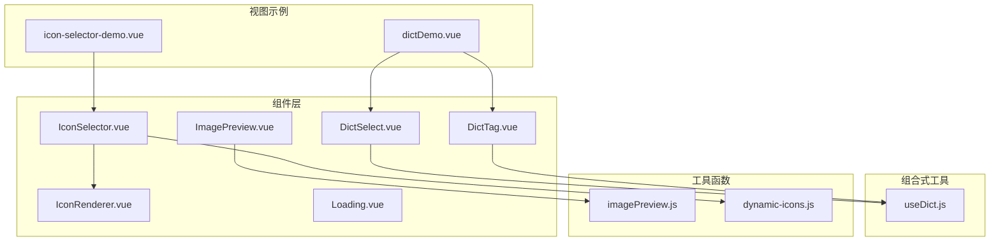
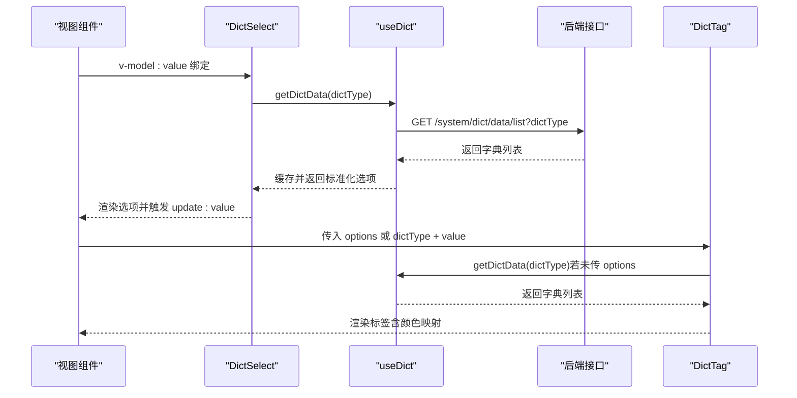
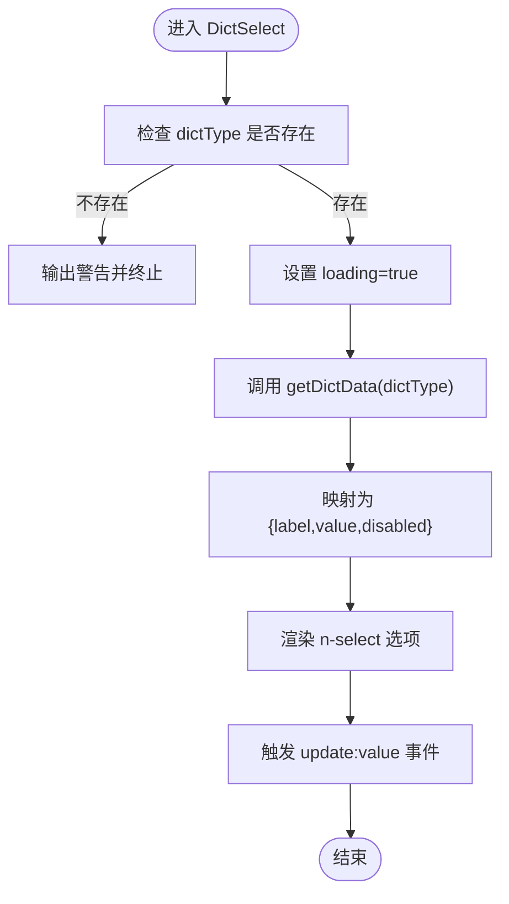
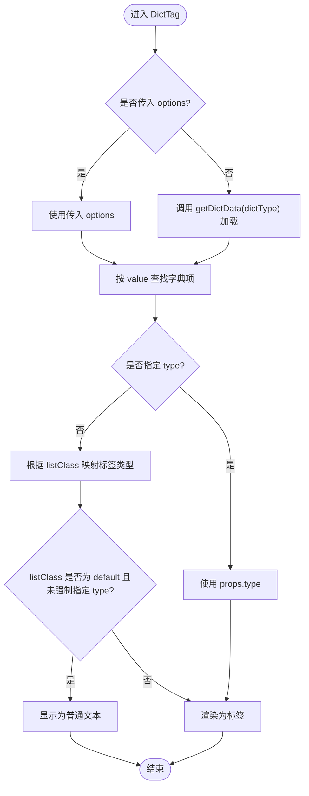
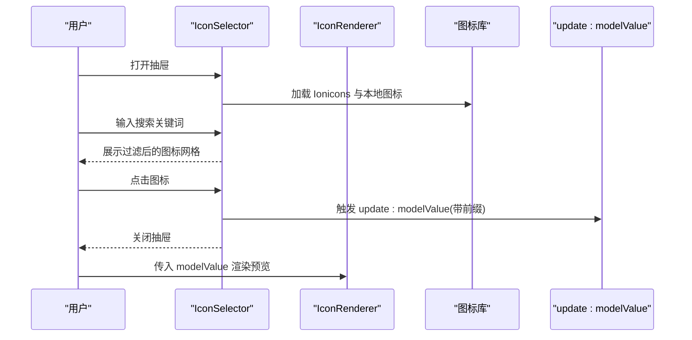
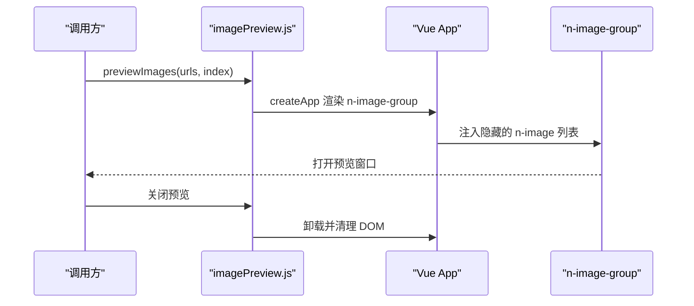
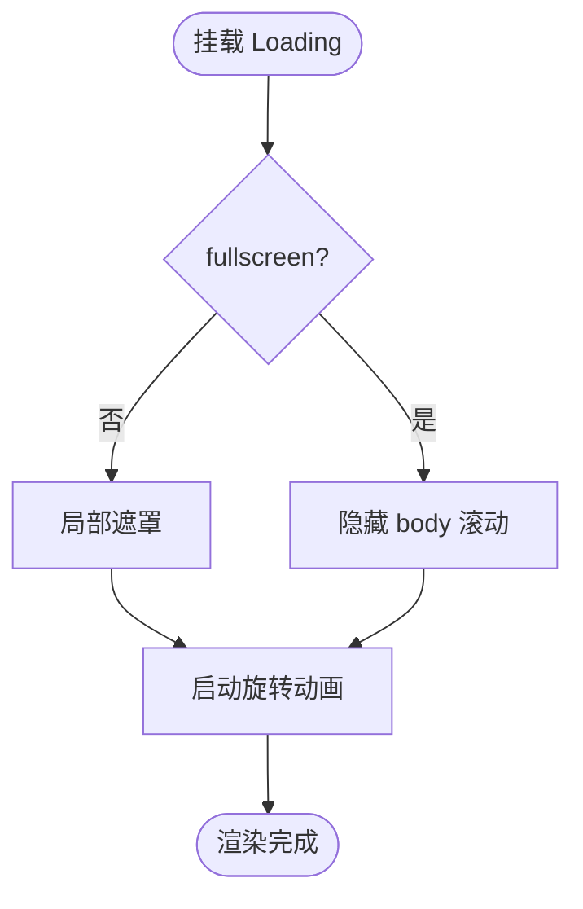
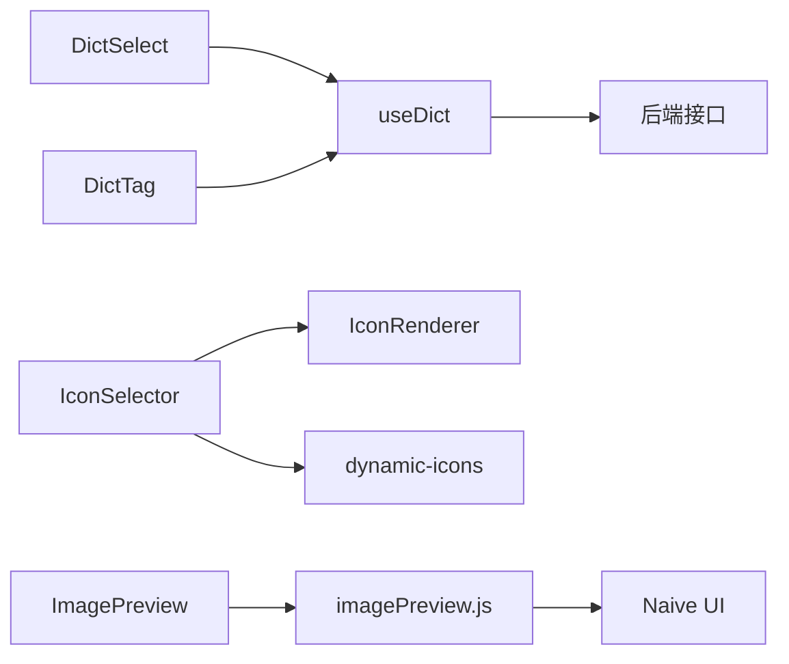

# 业务组件

<cite>
**本文引用的文件**
- [DictSelect.vue](file://forge-admin-ui/src/components/DictSelect.vue)
- [DictTag.vue](file://forge-admin-ui/src/components/DictTag.vue)
- [IconSelector.vue](file://forge-admin-ui/src/components/IconSelector.vue)
- [IconRenderer.vue](file://forge-admin-ui/src/components/IconRenderer.vue)
- [ImagePreview.vue](file://forge-admin-ui/src/components/ImagePreview.vue)
- [Loading.vue](file://forge-admin-ui/src/components/Loading.vue)
- [useDict.js](file://forge-admin-ui/src/composables/useDict.js)
- [imagePreview.js](file://forge-admin-ui/src/utils/imagePreview.js)
- [dynamic-icons.js](file://forge-admin-ui/src/assets/icons/dynamic-icons.js)
- [DICT_USAGE_GUIDE.md](file://forge-admin-ui/src/components/DICT_USAGE_GUIDE.md)
- [dictDemo.vue](file://forge-admin-ui/src/views/system/dictDemo.vue)
- [icon-selector-demo.vue](file://forge-admin-ui/src/views/demo/icon-selector-demo.vue)
- [index.js](file://forge-admin-ui/src/components/index.js)
</cite>

## 目录
1. [简介](#简介)
2. [项目结构](#项目结构)
3. [核心组件](#核心组件)
4. [架构总览](#架构总览)
5. [详细组件分析](#详细组件分析)
6. [依赖关系分析](#依赖关系分析)
7. [性能考量](#性能考量)
8. [故障排查指南](#故障排查指南)
9. [结论](#结论)
10. [附录](#附录)

## 简介
本文件面向业务组件的综合技术文档，重点覆盖以下组件：
- 字典选择器 DictSelect：字典数据加载、选项渲染与值绑定机制
- 字典标签 DictTag：标签显示、颜色配置与交互行为
- 图标选择器 IconSelector：图标库管理、搜索过滤与选择回调
- 图片预览 ImagePreview：图片加载、缩放控制与下载功能
- 加载组件 Loading：多种加载状态、动画效果与使用场景

同时提供数据流设计、事件通信与状态管理方案，并给出业务场景下的使用示例与性能优化建议。

## 项目结构
本项目前端位于 forge-admin-ui，业务组件主要分布在 src/components 与 src/composables、src/utils 下，配合视图层示例展示组件用法。

图表来源
- [DictSelect.vue](file://forge-admin-ui/src/components/DictSelect.vue#L1-L112)
- [DictTag.vue](file://forge-admin-ui/src/components/DictTag.vue#L1-L177)
- [IconSelector.vue](file://forge-admin-ui/src/components/IconSelector.vue#L1-L331)
- [IconRenderer.vue](file://forge-admin-ui/src/components/IconRenderer.vue#L1-L99)
- [ImagePreview.vue](file://forge-admin-ui/src/components/ImagePreview.vue#L1-L21)
- [Loading.vue](file://forge-admin-ui/src/components/Loading.vue#L1-L178)
- [useDict.js](file://forge-admin-ui/src/composables/useDict.js#L1-L186)
- [imagePreview.js](file://forge-admin-ui/src/utils/imagePreview.js#L1-L128)
- [dynamic-icons.js](file://forge-admin-ui/src/assets/icons/dynamic-icons.js#L1-L10)
- [dictDemo.vue](file://forge-admin-ui/src/views/system/dictDemo.vue#L1-L217)
- [icon-selector-demo.vue](file://forge-admin-ui/src/views/demo/icon-selector-demo.vue#L1-L160)

章节来源
- [index.js](file://forge-admin-ui/src/components/index.js#L1-L6)

## 核心组件
- 字典选择器 DictSelect：基于 Naive UI 的 Select，支持单选/多选、可搜索、可清空、禁用等；通过 useDict 加载字典数据，自动过滤状态为 0 的项。
- 字典标签 DictTag：根据字典项的 listClass 自动映射标签类型（default/success/info/warning/error），支持直接显示为普通文本或作为可关闭标签。
- 图标选择器 IconSelector：提供抽屉式弹窗，内置 Ionicons 与本地图标库，支持搜索过滤、选择回调与清除。
- 图片预览 ImagePreview：基于 Naive UI 的 n-image-group 封装，提供工具函数进行图片预览与清理。
- 加载组件 Loading：全屏/局部遮罩加载，支持背景色、文字、字体大小与颜色配置，内置动画与响应式适配。

章节来源
- [DictSelect.vue](file://forge-admin-ui/src/components/DictSelect.vue#L1-L112)
- [DictTag.vue](file://forge-admin-ui/src/components/DictTag.vue#L1-L177)
- [IconSelector.vue](file://forge-admin-ui/src/components/IconSelector.vue#L1-L331)
- [IconRenderer.vue](file://forge-admin-ui/src/components/IconRenderer.vue#L1-L99)
- [ImagePreview.vue](file://forge-admin-ui/src/components/ImagePreview.vue#L1-L21)
- [Loading.vue](file://forge-admin-ui/src/components/Loading.vue#L1-L178)
- [useDict.js](file://forge-admin-ui/src/composables/useDict.js#L1-L186)
- [imagePreview.js](file://forge-admin-ui/src/utils/imagePreview.js#L1-L128)

## 架构总览
组件间数据与控制流概览如下：

图表来源
- [DictSelect.vue](file://forge-admin-ui/src/components/DictSelect.vue#L87-L105)
- [DictTag.vue](file://forge-admin-ui/src/components/DictTag.vue#L150-L170)
- [useDict.js](file://forge-admin-ui/src/composables/useDict.js#L26-L74)

## 详细组件分析

### 字典选择器 DictSelect
- 数据加载
  - 通过 watch 监听 dictType，初始化即触发加载；内部调用 useDict 的 getDictData，返回标准化字典选项。
  - 选项映射：label/value，禁用状态由字典项 status 决定。
- 选项渲染
  - 基于 Naive UI 的 n-select，支持 clearable/filterable/multiple/disabled/loading 等属性透传。
- 值绑定
  - 通过 update:value 事件向上抛出，供 v-model:value 接收。

图表来源
- [DictSelect.vue](file://forge-admin-ui/src/components/DictSelect.vue#L87-L110)
- [useDict.js](file://forge-admin-ui/src/composables/useDict.js#L66-L74)

章节来源
- [DictSelect.vue](file://forge-admin-ui/src/components/DictSelect.vue#L1-L112)
- [useDict.js](file://forge-admin-ui/src/composables/useDict.js#L1-L186)

### 字典标签 DictTag
- 标签显示
  - 若传入 options 或已加载的字典列表，按 value 查找对应项；否则回退到原始值显示。
- 颜色配置
  - 优先使用 props.type；否则根据字典项的 listClass 自动映射（default/success/info/warning/error），并兼容旧命名 primary→info、danger→error。
  - 当 listClass 为 default 且未强制指定 type 时，显示为普通文本而非标签。
- 交互行为
  - 支持 closable，触发 close 事件；支持 round/bordered/size 等外观定制。

图表来源
- [DictTag.vue](file://forge-admin-ui/src/components/DictTag.vue#L92-L148)
- [DictTag.vue](file://forge-admin-ui/src/components/DictTag.vue#L118-L130)
- [useDict.js](file://forge-admin-ui/src/composables/useDict.js#L66-L74)

章节来源
- [DictTag.vue](file://forge-admin-ui/src/components/DictTag.vue#L1-L177)
- [DICT_USAGE_GUIDE.md](file://forge-admin-ui/src/components/DICT_USAGE_GUIDE.md#L79-L96)

### 图标选择器 IconSelector
- 图标库管理
  - Ionicons：通过 @vicons/ionicons5 动态导入，提供大量矢量图标。
  - 本地图标：通过 vite 的动态导入与 icons 集合（dynamic-icons.js）管理，支持本地 SVG 图标。
- 搜索过滤
  - 支持在两个标签页（Ionicons、本地图标）内输入关键词过滤，区分目录前缀与文件名进行匹配。
- 选择回调
  - 选择后通过 update:modelValue 返回带前缀的图标标识（ionicons5:xxx 或 local:xxx），并关闭抽屉。
- 交互细节
  - 支持清除已选图标，格式化显示名称（去除前缀），并高亮当前选中项。

图表来源
- [IconSelector.vue](file://forge-admin-ui/src/components/IconSelector.vue#L115-L183)
- [IconSelector.vue](file://forge-admin-ui/src/components/IconSelector.vue#L204-L214)
- [IconRenderer.vue](file://forge-admin-ui/src/components/IconRenderer.vue#L56-L93)
- [dynamic-icons.js](file://forge-admin-ui/src/assets/icons/dynamic-icons.js#L1-L10)

章节来源
- [IconSelector.vue](file://forge-admin-ui/src/components/IconSelector.vue#L1-L331)
- [IconRenderer.vue](file://forge-admin-ui/src/components/IconRenderer.vue#L1-L99)
- [dynamic-icons.js](file://forge-admin-ui/src/assets/icons/dynamic-icons.js#L1-L10)

### 图片预览 ImagePreview
- 图片加载
  - 通过工具函数 previewImages 创建 n-image-group 并注入多张图片，隐藏尺寸以便预览触发。
- 缩放控制与下载
  - 基于 Naive UI 的预览能力，支持缩放、切换与关闭；下载能力由底层组件提供。
- 生命周期管理
  - 通过 MutationObserver 监听预览容器移除，自动卸载临时应用并清理 DOM。

图表来源
- [imagePreview.js](file://forge-admin-ui/src/utils/imagePreview.js#L27-L107)

章节来源
- [ImagePreview.vue](file://forge-admin-ui/src/components/ImagePreview.vue#L1-L21)
- [imagePreview.js](file://forge-admin-ui/src/utils/imagePreview.js#L1-L128)

### 加载组件 Loading
- 状态与样式
  - 支持 fullscreen 与局部遮罩两种模式；可配置背景色、文字、颜色与字号。
  - 内置旋转动画（spinner-ring 多环相位差），响应式适配移动端。
- 行为特性
  - 全屏模式下挂载时隐藏 body 滚动，卸载时恢复滚动。
- 使用场景
  - 页面级加载、模块级加载、异步操作等待等。

图表来源
- [Loading.vue](file://forge-admin-ui/src/components/Loading.vue#L50-L62)
- [Loading.vue](file://forge-admin-ui/src/components/Loading.vue#L105-L159)

章节来源
- [Loading.vue](file://forge-admin-ui/src/components/Loading.vue#L1-L178)

## 依赖关系分析
- 组件耦合
  - DictSelect/DictTag 依赖 useDict 提供的字典数据与缓存；二者通过统一的数据格式与 listClass 实现解耦。
  - IconSelector 依赖 IconRenderer 渲染图标，依赖 dynamic-icons.js 管理本地图标集合。
  - ImagePreview 依赖 imagePreview.js 的工具函数，后者依赖 Naive UI 的 n-image-group。
- 外部依赖
  - Naive UI：n-select、n-tag、n-image、n-image-group 等组件。
  - @vicons/ionicons5：提供大量矢量图标。
  - Vite 动态导入：用于加载本地 SVG 图标资源。

图表来源
- [DictSelect.vue](file://forge-admin-ui/src/components/DictSelect.vue#L27)
- [DictTag.vue](file://forge-admin-ui/src/components/DictTag.vue#L34)
- [IconSelector.vue](file://forge-admin-ui/src/components/IconSelector.vue#L88-L90)
- [IconRenderer.vue](file://forge-admin-ui/src/components/IconRenderer.vue#L19-L20)
- [imagePreview.js](file://forge-admin-ui/src/utils/imagePreview.js#L1-L2)
- [useDict.js](file://forge-admin-ui/src/composables/useDict.js#L16)

章节来源
- [useDict.js](file://forge-admin-ui/src/composables/useDict.js#L1-L186)
- [IconSelector.vue](file://forge-admin-ui/src/components/IconSelector.vue#L1-L331)
- [IconRenderer.vue](file://forge-admin-ui/src/components/IconRenderer.vue#L1-L99)
- [imagePreview.js](file://forge-admin-ui/src/utils/imagePreview.js#L1-L128)

## 性能考量
- 字典数据缓存
  - useDict 采用 Map 缓存，避免重复请求；支持按需 reload 与 clearDictCache 清理。
- 异步加载与防抖
  - DictSelect/DictTag 在 dictType 变化时触发加载；建议在父组件集中 useDict 加载，减少重复请求。
- 图标渲染优化
  - IconSelector 仅对搜索关键词进行过滤，避免一次性渲染全部图标；本地图标通过动态导入按需加载。
- 图片预览
  - imagePreview.js 通过隐藏元素触发预览，避免额外 DOM 开销；预览关闭后及时清理临时应用与节点。
- Loading 动画
  - 采用多环相位差动画，视觉上更流畅；在移动端适当缩小尺寸提升体验。

章节来源
- [useDict.js](file://forge-admin-ui/src/composables/useDict.js#L18-L86)
- [DictSelect.vue](file://forge-admin-ui/src/components/DictSelect.vue#L102-L105)
- [IconSelector.vue](file://forge-admin-ui/src/components/IconSelector.vue#L115-L131)
- [imagePreview.js](file://forge-admin-ui/src/utils/imagePreview.js#L33-L107)
- [Loading.vue](file://forge-admin-ui/src/components/Loading.vue#L105-L159)

## 故障排查指南
- 字典未显示或显示异常
  - 确认 dictType 正确且后端接口返回正常；检查 listClass 是否为 default 导致显示为文本。
  - 如数据未更新，调用 reload 或 clearDictCache 清理缓存。
- 选择器无法加载字典
  - 检查 dictType 是否传入；确认网络请求是否成功；查看控制台警告信息。
- 图标选择器无结果
  - 检查搜索关键词是否正确；确认 dynamic-icons.js 中是否存在目标图标；确认本地图标路径与命名规则。
- 图片预览无法关闭或内存泄漏
  - 确认 MutationObserver 是否监听到容器移除；确保未手动干预预览 DOM 结构。
- Loading 全屏模式滚动异常
  - 确认组件卸载时是否执行清理逻辑；检查是否多次挂载导致滚动状态未恢复。

章节来源
- [DICT_USAGE_GUIDE.md](file://forge-admin-ui/src/components/DICT_USAGE_GUIDE.md#L329-L353)
- [DictSelect.vue](file://forge-admin-ui/src/components/DictSelect.vue#L88-L100)
- [DictTag.vue](file://forge-admin-ui/src/components/DictTag.vue#L150-L163)
- [imagePreview.js](file://forge-admin-ui/src/utils/imagePreview.js#L80-L107)
- [Loading.vue](file://forge-admin-ui/src/components/Loading.vue#L57-L62)

## 结论
上述业务组件围绕“数据驱动 + 组合式工具 + 事件通信”的设计模式构建，具备良好的扩展性与复用性。通过 useDict 统一字典数据管理、IconSelector 提供灵活的图标选择体验、ImagePreview 与 Loading 提升交互质量，形成完整的业务组件生态。建议在实际项目中遵循统一的数据格式与命名规范，结合缓存与懒加载策略，持续优化用户体验与性能表现。

## 附录
- 使用示例参考
  - 字典组件：见 [dictDemo.vue](file://forge-admin-ui/src/views/system/dictDemo.vue#L1-L217)
  - 图标选择器：见 [icon-selector-demo.vue](file://forge-admin-ui/src/views/demo/icon-selector-demo.vue#L1-L160)
- 组件导出入口：见 [index.js](file://forge-admin-ui/src/components/index.js#L1-L6)
- 字典使用指南：见 [DICT_USAGE_GUIDE.md](file://forge-admin-ui/src/components/DICT_USAGE_GUIDE.md#L1-L513)