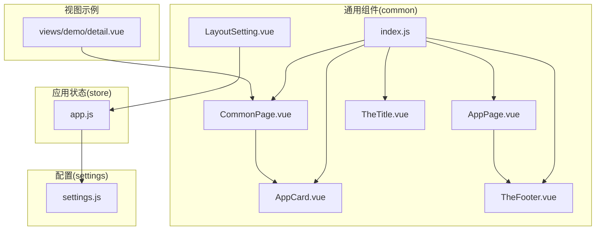
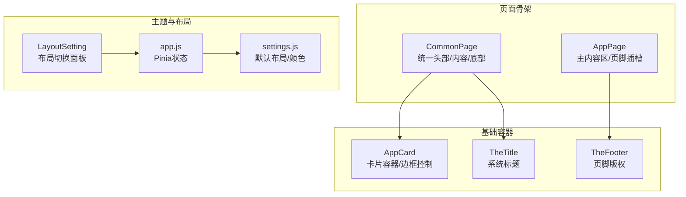
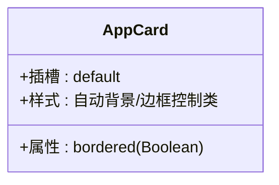
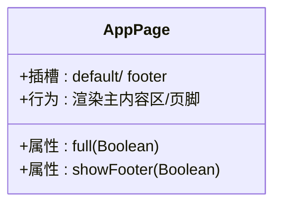
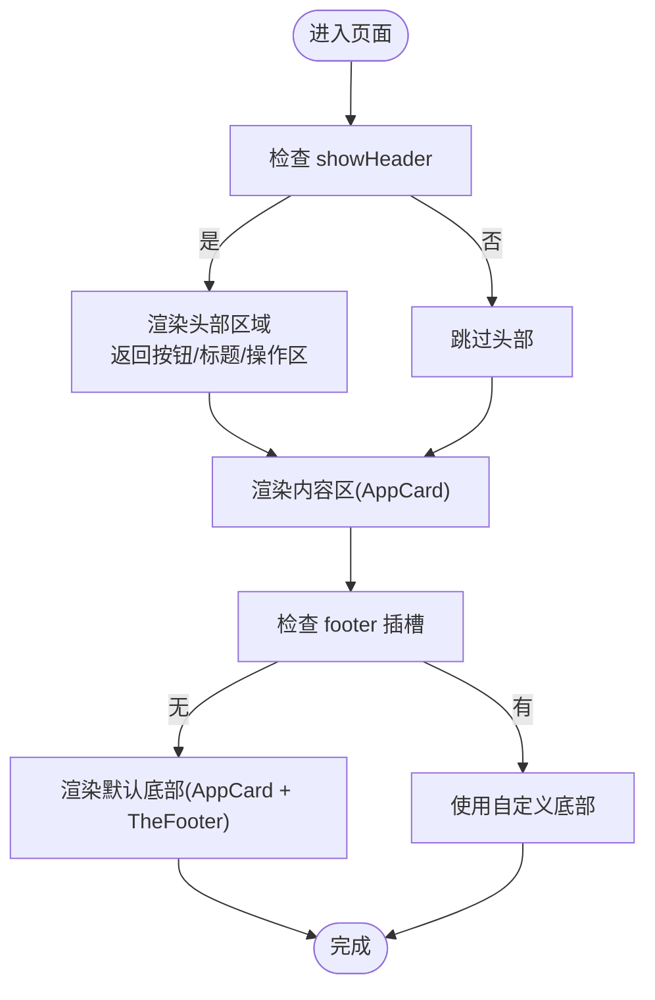
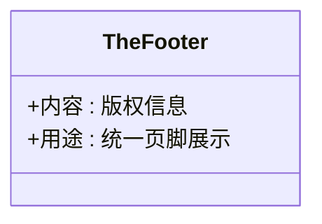
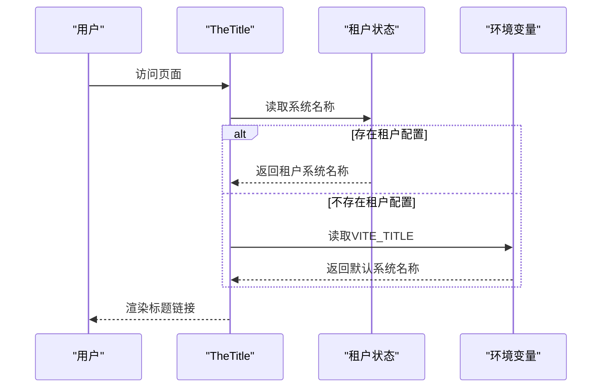
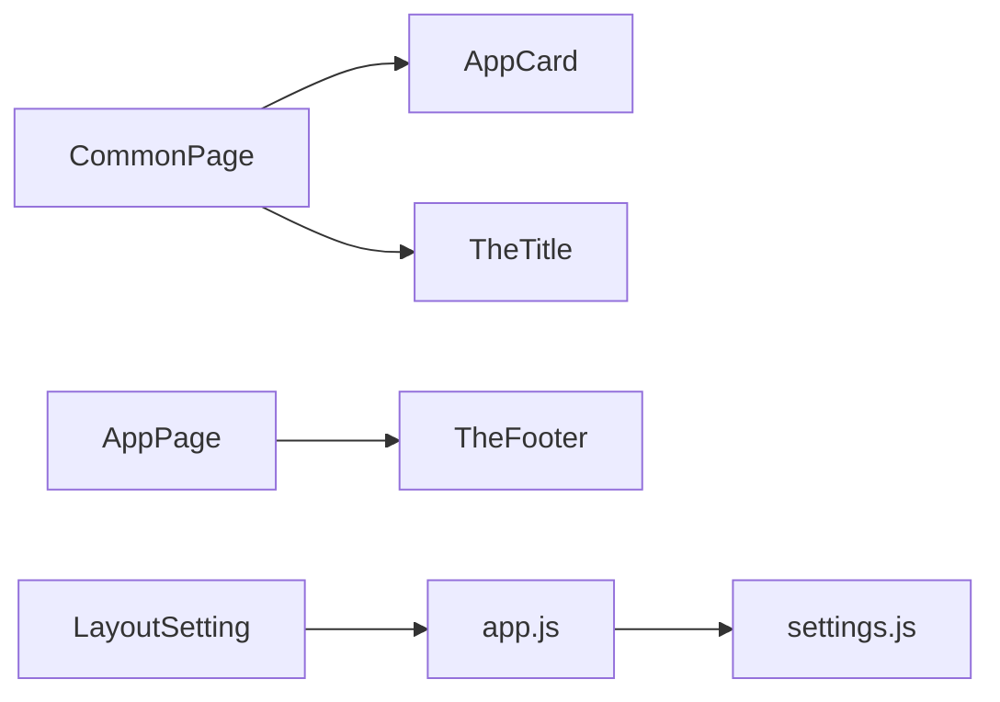

# 基础组件

<cite>
**本文档引用的文件**
- [AppCard.vue](file://forge-admin-ui/src/components/common/AppCard.vue)
- [AppPage.vue](file://forge-admin-ui/src/components/common/AppPage.vue)
- [CommonPage.vue](file://forge-admin-ui/src/components/common/CommonPage.vue)
- [TheFooter.vue](file://forge-admin-ui/src/components/common/TheFooter.vue)
- [TheTitle.vue](file://forge-admin-ui/src/components/common/TheTitle.vue)
- [index.js](file://forge-admin-ui/src/components/common/index.js)
- [LayoutSetting.vue](file://forge-admin-ui/src/components/common/LayoutSetting.vue)
- [app.js](file://forge-admin-ui/src/store/modules/app.js)
- [settings.js](file://forge-admin-ui/src/settings.js)
- [detail.vue](file://forge-admin-ui/src/views/demo/detail.vue)
</cite>

## 目录
1. [简介](#简介)
2. [项目结构](#项目结构)
3. [核心组件](#核心组件)
4. [架构概览](#架构概览)
5. [详细组件分析](#详细组件分析)
6. [依赖分析](#依赖分析)
7. [性能考虑](#性能考虑)
8. [故障排除指南](#故障排除指南)
9. [结论](#结论)
10. [附录](#附录)

## 简介
本文件聚焦于Forge前端UI框架中的基础组件体系，深入解析以下组件的设计理念、布局结构与样式定制能力：
- AppCard卡片组件：提供统一的卡片容器与边框控制
- AppPage页面容器组件：管理页面主内容区与页脚插槽
- CommonPage通用页面组件：统一头部、内容区、底部的页面骨架，内置面包屑与标题管理
- TheFooter页脚组件：版权信息展示与链接管理
- TheTitle标题组件：多级标题支持与SEO优化

同时，文档提供属性配置、事件处理与样式覆盖的最佳实践，并结合实际使用示例与常见问题解决方案，帮助开发者快速掌握组件的正确用法。

## 项目结构
基础组件位于通用组件目录中，通过统一的导出入口集中管理，便于全局按需引入与复用。

**图表来源**
- [index.js](file://forge-admin-ui/src/components/common/index.js#L1-L11)
- [AppCard.vue](file://forge-admin-ui/src/components/common/AppCard.vue#L1-L12)
- [AppPage.vue](file://forge-admin-ui/src/components/common/AppPage.vue#L1-L25)
- [CommonPage.vue](file://forge-admin-ui/src/components/common/CommonPage.vue#L1-L97)
- [TheFooter.vue](file://forge-admin-ui/src/components/common/TheFooter.vue#L1-L9)
- [TheTitle.vue](file://forge-admin-ui/src/components/common/TheTitle.vue#L1-L18)
- [LayoutSetting.vue](file://forge-admin-ui/src/components/common/LayoutSetting.vue#L1-L176)
- [app.js](file://forge-admin-ui/src/store/modules/app.js#L1-L91)
- [settings.js](file://forge-admin-ui/src/settings.js#L1-L75)
- [detail.vue](file://forge-admin-ui/src/views/demo/detail.vue#L1-L16)

**章节来源**
- [index.js](file://forge-admin-ui/src/components/common/index.js#L1-L11)

## 核心组件
本节概述各组件的核心职责与典型用法，便于快速定位与集成。

- AppCard：提供带边框样式的卡片容器，支持通过布尔属性控制边框显示，作为页面骨架的基础单元。
- AppPage：页面主容器，负责内容区与页脚插槽的布局，支持全屏模式与页脚开关。
- CommonPage：统一页面骨架，内置头部（含返回按钮、标题、操作区）、内容区与底部，支持插槽扩展与默认页脚。
- TheFooter：页脚版权信息展示，可作为默认底部或自定义插槽替代。
- TheTitle：系统标题渲染，优先从租户配置或环境变量读取系统名称，支持SEO友好链接。

**章节来源**
- [AppCard.vue](file://forge-admin-ui/src/components/common/AppCard.vue#L1-L12)
- [AppPage.vue](file://forge-admin-ui/src/components/common/AppPage.vue#L1-L25)
- [CommonPage.vue](file://forge-admin-ui/src/components/common/CommonPage.vue#L1-L97)
- [TheFooter.vue](file://forge-admin-ui/src/components/common/TheFooter.vue#L1-L9)
- [TheTitle.vue](file://forge-admin-ui/src/components/common/TheTitle.vue#L1-L18)

## 架构概览
基础组件围绕“容器-骨架-插槽”的设计模式构建，形成清晰的层次关系与扩展点。

**图表来源**
- [CommonPage.vue](file://forge-admin-ui/src/components/common/CommonPage.vue#L1-L97)
- [AppPage.vue](file://forge-admin-ui/src/components/common/AppPage.vue#L1-L25)
- [AppCard.vue](file://forge-admin-ui/src/components/common/AppCard.vue#L1-L12)
- [TheFooter.vue](file://forge-admin-ui/src/components/common/TheFooter.vue#L1-L9)
- [TheTitle.vue](file://forge-admin-ui/src/components/common/TheTitle.vue#L1-L18)
- [LayoutSetting.vue](file://forge-admin-ui/src/components/common/LayoutSetting.vue#L1-L176)
- [app.js](file://forge-admin-ui/src/store/modules/app.js#L1-L91)
- [settings.js](file://forge-admin-ui/src/settings.js#L1-L75)

## 详细组件分析

### AppCard 卡片组件
- 设计理念
  - 以最小可用抽象提供统一的卡片容器，通过边框属性实现视觉一致性与灵活组合。
  - 使用插槽承载任意内容，确保高扩展性与低耦合。
- 布局结构
  - 容器类名包含自动背景与边框控制类，支持在不同布局下保持视觉连贯。
- 样式定制
  - 通过外部类名覆盖与主题变量联动，实现边框、背景与暗色模式的适配。
- 属性与事件
  - 属性：bordered（Boolean）控制边框显示
  - 插槽：默认插槽承载内容
- 最佳实践
  - 在页面骨架中作为基础容器使用，避免重复封装相同结构
  - 与CommonPage的头部/内容/底部卡片配合，形成统一的视觉层级

**图表来源**
- [AppCard.vue](file://forge-admin-ui/src/components/common/AppCard.vue#L1-L12)

**章节来源**
- [AppCard.vue](file://forge-admin-ui/src/components/common/AppCard.vue#L1-L12)

### AppPage 页面容器组件
- 生命周期管理
  - 作为纯展示容器，主要在挂载阶段渲染主内容区与页脚插槽
- 内容区域划分
  - 主内容区：flex布局，支持full属性控制是否占满剩余空间
  - 页脚插槽：默认渲染TheFooter组件，可通过具名插槽覆盖
- 响应式适配
  - 通过flex与高度类名实现自适应布局，结合全局样式变量保证在不同屏幕下的表现
- 属性与事件
  - 属性：full（Boolean，默认false），showFooter（Boolean，默认false）
  - 插槽：默认插槽承载内容；footer插槽覆盖默认页脚
- 最佳实践
  - 在需要统一页脚与滚动区域的页面使用，减少重复代码
  - 通过插槽扩展实现复杂页面的差异化需求

**图表来源**
- [AppPage.vue](file://forge-admin-ui/src/components/common/AppPage.vue#L1-L25)

**章节来源**
- [AppPage.vue](file://forge-admin-ui/src/components/common/AppPage.vue#L1-L25)

### CommonPage 通用页面组件
- 统一布局
  - 头部区域：粘性定位，包含返回按钮、标题与操作区
  - 内容区：滚动内容区，提供充足的内边距与圆角
  - 底部区域：默认显示AppCard包裹的TheFooter，可被具名footer插槽覆盖
- 面包屑导航与标题管理
  - 标题优先级：props.title > 路由meta.title，支持动态标题
  - 返回按钮：当back属性为true时显示，点击触发路由回退
  - 标题装饰条：当存在标题时显示，增强视觉引导
- 属性与事件
  - 属性：back（Boolean），showFooter（Boolean），showHeader（Boolean），title（String）
  - 插槽：header（自定义头部）、title-prefix（标题前缀）、title-suffix（标题后缀）、action（操作区）、footer（自定义底部）
- 最佳实践
  - 在业务页面中统一使用，减少重复的头部与底部逻辑
  - 通过插槽实现灵活的标题与操作区定制

**图表来源**
- [CommonPage.vue](file://forge-admin-ui/src/components/common/CommonPage.vue#L1-L97)

**章节来源**
- [CommonPage.vue](file://forge-admin-ui/src/components/common/CommonPage.vue#L1-L97)

### TheFooter 页脚组件
- 版权信息展示
  - 固定的版权文本，适合统一的页脚风格
- 链接管理
  - 可通过具名插槽替换默认页脚，实现更多链接或信息的展示
- 最佳实践
  - 在需要统一版权风格的场景使用默认页脚
  - 在需要个性化页脚时，通过footer插槽注入自定义内容

**图表来源**
- [TheFooter.vue](file://forge-admin-ui/src/components/common/TheFooter.vue#L1-L9)

**章节来源**
- [TheFooter.vue](file://forge-admin-ui/src/components/common/TheFooter.vue#L1-L9)

### TheTitle 标题组件
- 多级标题支持
  - 通过计算属性优先读取租户配置的系统名称，若不存在则回退到环境变量
  - 支持作为导航链接回到首页，提升用户体验
- SEO优化
  - 使用语义化的链接标签，便于搜索引擎识别站点名称与主页路径
- 最佳实践
  - 在头部区域固定展示，确保用户始终能快速回到首页
  - 结合路由meta.title实现页面级标题与系统级标题的协同

**图表来源**
- [TheTitle.vue](file://forge-admin-ui/src/components/common/TheTitle.vue#L1-L18)
- [app.js](file://forge-admin-ui/src/store/modules/app.js#L1-L91)

**章节来源**
- [TheTitle.vue](file://forge-admin-ui/src/components/common/TheTitle.vue#L1-L18)

## 依赖分析
基础组件之间的依赖关系清晰，遵循“容器-骨架-插槽”的组合模式，避免循环依赖与过度耦合。

**图表来源**
- [CommonPage.vue](file://forge-admin-ui/src/components/common/CommonPage.vue#L1-L97)
- [AppPage.vue](file://forge-admin-ui/src/components/common/AppPage.vue#L1-L25)
- [AppCard.vue](file://forge-admin-ui/src/components/common/AppCard.vue#L1-L12)
- [TheFooter.vue](file://forge-admin-ui/src/components/common/TheFooter.vue#L1-L9)
- [TheTitle.vue](file://forge-admin-ui/src/components/common/TheTitle.vue#L1-L18)
- [LayoutSetting.vue](file://forge-admin-ui/src/components/common/LayoutSetting.vue#L1-L176)
- [app.js](file://forge-admin-ui/src/store/modules/app.js#L1-L91)
- [settings.js](file://forge-admin-ui/src/settings.js#L1-L75)

**章节来源**
- [index.js](file://forge-admin-ui/src/components/common/index.js#L1-L11)

## 性能考虑
- 组件复用与渲染
  - 通过插槽与条件渲染减少不必要的DOM节点，降低重绘开销
- 主题与布局
  - 使用Pinia状态管理布局与主题，避免频繁的全局样式切换导致的性能损耗
- 样式隔离
  - 采用局部作用域样式与原子类，减少CSS冲突与样式计算成本

## 故障排除指南
- 标题未显示或显示异常
  - 检查props.title与路由meta.title的优先级是否符合预期
  - 确认租户配置与环境变量是否正确设置
- 返回按钮无效
  - 确认back属性为true且路由实例可用
- 页脚未显示
  - 检查showFooter属性与footer插槽是否正确使用
- 边框样式不生效
  - 确认bordered属性与相关样式类是否正确传递

**章节来源**
- [CommonPage.vue](file://forge-admin-ui/src/components/common/CommonPage.vue#L1-L97)
- [AppPage.vue](file://forge-admin-ui/src/components/common/AppPage.vue#L1-L25)
- [AppCard.vue](file://forge-admin-ui/src/components/common/AppCard.vue#L1-L12)
- [TheTitle.vue](file://forge-admin-ui/src/components/common/TheTitle.vue#L1-L18)

## 结论
基础组件通过简洁的API与强大的插槽机制，为页面提供了统一而灵活的骨架结构。AppCard、AppPage与CommonPage分别承担容器、主内容区与页面骨架的角色，TheFooter与TheTitle则完善了页脚与标题体系。结合LayoutSetting与Pinia状态管理，开发者可以高效地搭建一致性的页面体验，并在需要时进行深度定制。

## 附录

### 实际使用示例
- 在示例页面中直接使用CommonPage，设置返回按钮、显示头部与自定义标题
  - 示例路径：[detail.vue](file://forge-admin-ui/src/views/demo/detail.vue#L1-L16)

**章节来源**
- [detail.vue](file://forge-admin-ui/src/views/demo/detail.vue#L1-L16)

### 组件属性配置与最佳实践清单
- AppCard
  - 属性：bordered（控制边框）
  - 最佳实践：在页面骨架中作为基础容器使用，避免重复封装
- AppPage
  - 属性：full（占满空间）、showFooter（显示页脚）
  - 最佳实践：通过footer插槽覆盖默认页脚，满足个性化需求
- CommonPage
  - 属性：back、showFooter、showHeader、title
  - 最佳实践：优先使用props.title，其次使用路由meta.title；通过插槽扩展头部与底部
- TheFooter
  - 最佳实践：在需要统一版权风格时使用默认页脚；通过footer插槽实现个性化
- TheTitle
  - 最佳实践：作为首页链接使用，结合租户配置与环境变量实现多级标题支持