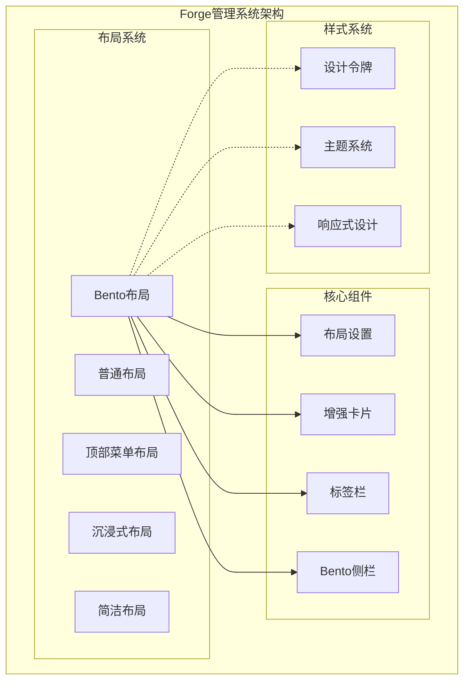
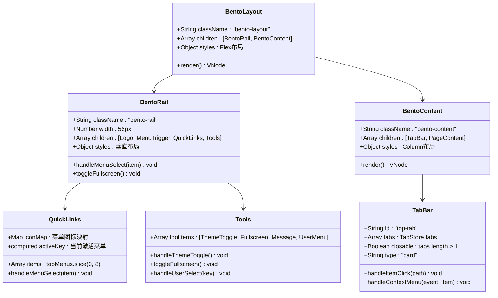
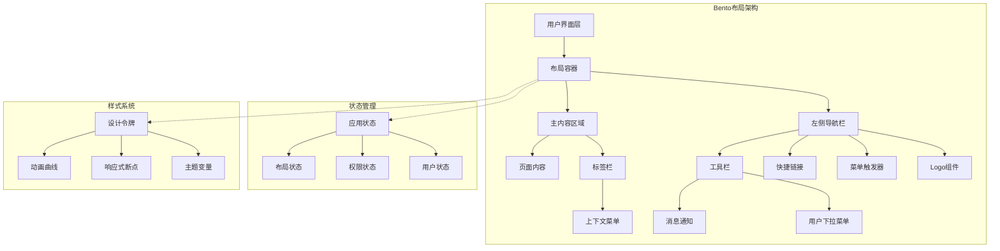
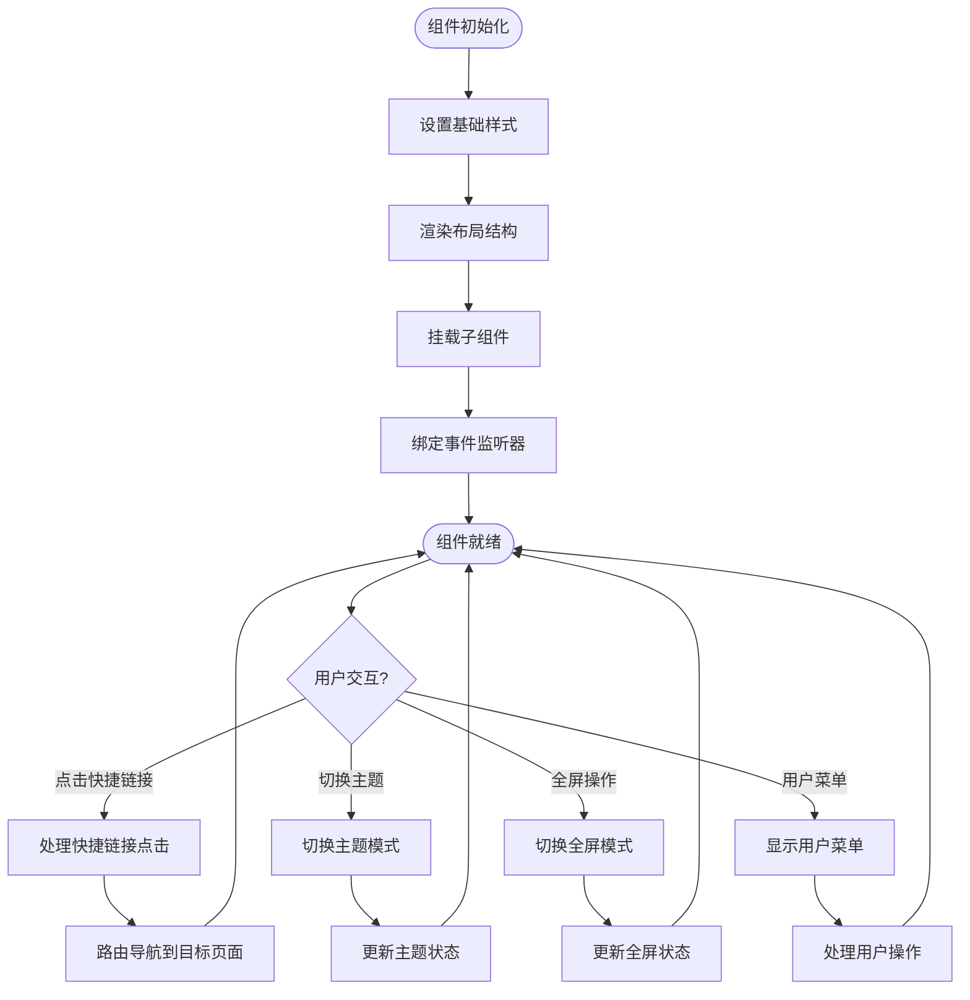
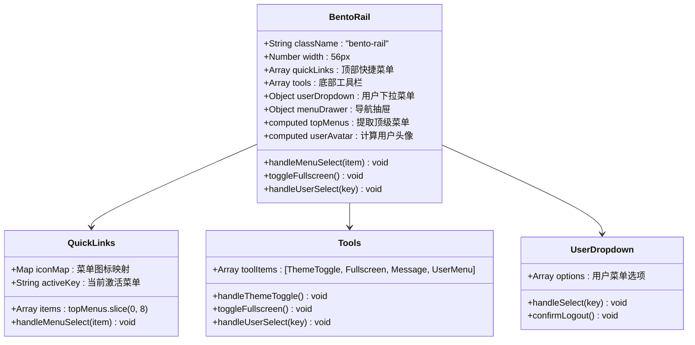
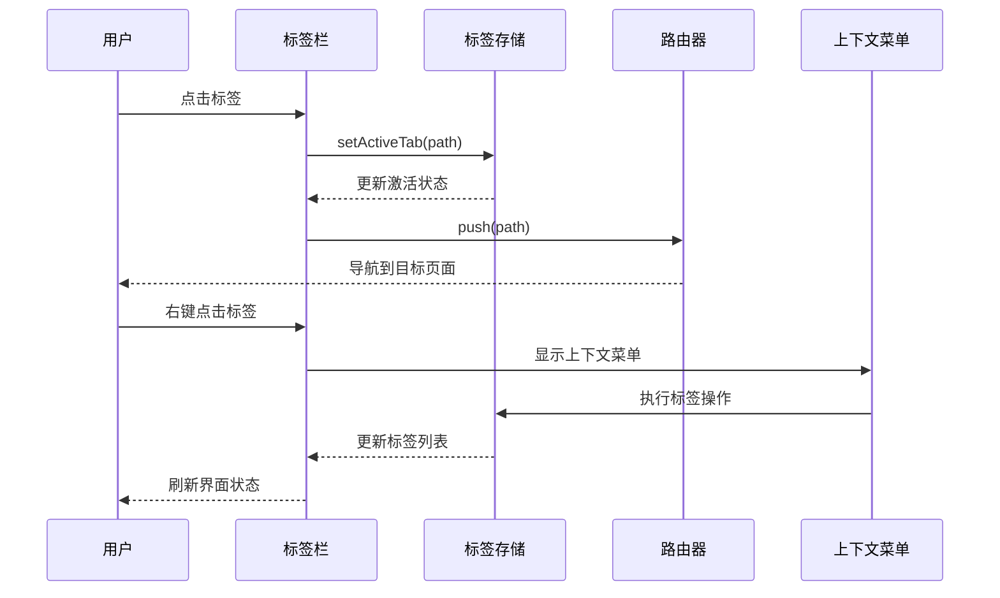
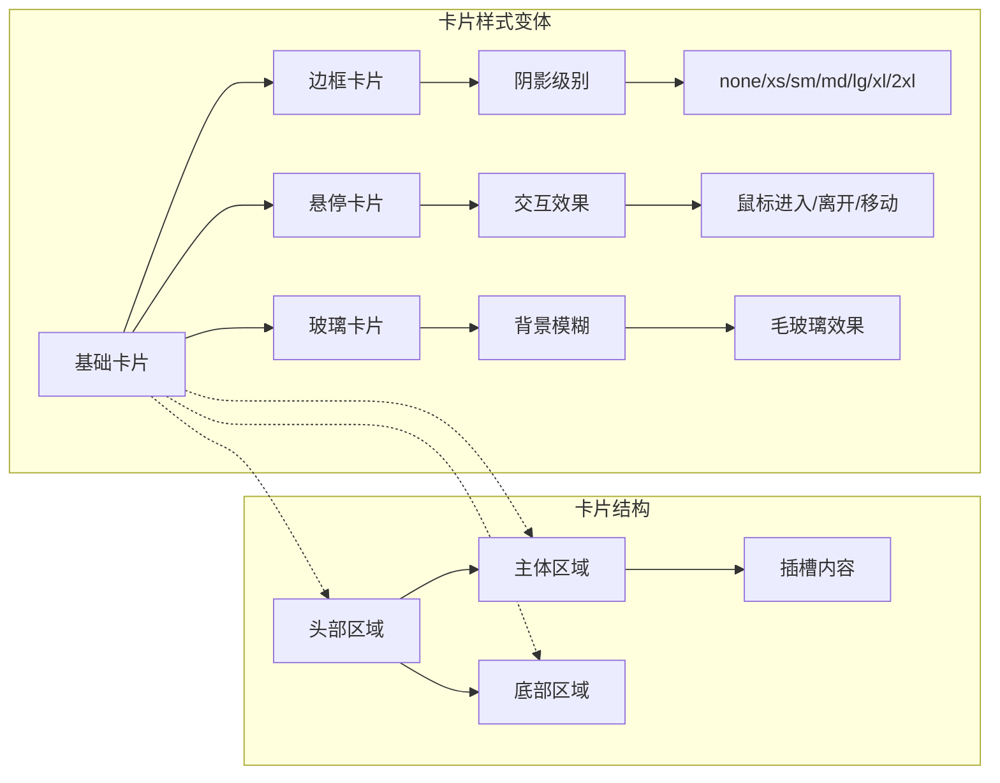
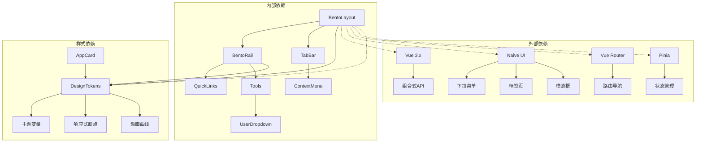

# Bento网格布局

<cite>
**本文档引用的文件**
- [forge-admin-ui/src/layouts/bento/index.vue](file://forge-admin-ui/src/layouts/bento/index.vue)
- [forge-admin-ui/src/layouts/bento/components/BentoRail.vue](file://forge-admin-ui/src/layouts/bento/components/BentoRail.vue)
- [forge-admin-ui/src/layouts/components/tab/index.vue](file://forge-admin-ui/src/layouts/components/tab/index.vue)
- [forge-admin-ui/src/layouts/components/tab/ContextMenu.vue](file://forge-admin-ui/src/layouts/components/tab/ContextMenu.vue)
- [forge-admin-ui/src/components/common/AppCard.vue](file://forge-admin-ui/src/components/common/AppCard.vue)
- [forge-admin-ui/src/components/common/TheLogo.vue](file://forge-admin-ui/src/components/common/TheLogo.vue)
- [forge-admin-ui/src/components/common/LayoutSetting.vue](file://forge-admin-ui/src/components/common/LayoutSetting.vue)
- [forge-admin-ui/src/styles/design-tokens.css](file://forge-admin-ui/src/styles/design-tokens.css)
- [forge-admin-ui/src/settings.js](file://forge-admin-ui/src/settings.js)
</cite>

## 目录
1. [简介](#简介)
2. [项目结构](#项目结构)
3. [核心组件](#核心组件)
4. [架构概览](#架构概览)
5. [详细组件分析](#详细组件分析)
6. [依赖关系分析](#依赖关系分析)
7. [性能考虑](#性能考虑)
8. [故障排除指南](#故障排除指南)
9. [结论](#结论)

## 简介

Bento网格布局是Forge管理系统中的一个创新布局方案，灵感来源于日式便当盒的设计理念。该布局采用极简主义设计原则，通过超窄的左侧图标导航栏和右侧抽屉式菜单相结合的方式，最大化内容展示空间，为用户提供极致的专注工作体验。

这种布局设计特别适合需要大量内容展示和复杂操作的工作场景，如数据管理、报表分析、流程设计等应用。通过精心设计的视觉层次和交互模式，Bento布局在保持界面简洁的同时，确保了功能的完整性和使用的便利性。

## 项目结构

Forge项目的整体架构采用了模块化设计，Bento布局作为其中的一个重要组成部分，与其他布局方案共同构成了完整的前端框架体系。

**图表来源**
- [forge-admin-ui/src/layouts/bento/index.vue:1-102](file://forge-admin-ui/src/layouts/bento/index.vue#L1-L102)
- [forge-admin-ui/src/components/common/LayoutSetting.vue:1-238](file://forge-admin-ui/src/components/common/LayoutSetting.vue#L1-L238)

**章节来源**
- [forge-admin-ui/src/settings.js:37-89](file://forge-admin-ui/src/settings.js#L37-L89)

## 核心组件

Bento布局系统由多个精心设计的核心组件构成，每个组件都承担着特定的功能职责，并通过协同工作实现整体的布局效果。

### 主要组件架构

**图表来源**
- [forge-admin-ui/src/layouts/bento/index.vue:1-102](file://forge-admin-ui/src/layouts/bento/index.vue#L1-L102)
- [forge-admin-ui/src/layouts/bento/components/BentoRail.vue:1-329](file://forge-admin-ui/src/layouts/bento/components/BentoRail.vue#L1-L329)
- [forge-admin-ui/src/layouts/components/tab/index.vue:1-78](file://forge-admin-ui/src/layouts/components/tab/index.vue#L1-L78)

**章节来源**
- [forge-admin-ui/src/layouts/bento/index.vue:24-29](file://forge-admin-ui/src/layouts/bento/index.vue#L24-L29)
- [forge-admin-ui/src/layouts/bento/components/BentoRail.vue:70-162](file://forge-admin-ui/src/layouts/bento/components/BentoRail.vue#L70-L162)

## 架构概览

Bento布局的整体架构体现了现代前端开发的最佳实践，通过清晰的组件分离和合理的数据流设计，实现了高度的可维护性和扩展性。

**图表来源**
- [forge-admin-ui/src/layouts/bento/index.vue:1-102](file://forge-admin-ui/src/layouts/bento/index.vue#L1-L102)
- [forge-admin-ui/src/layouts/bento/components/BentoRail.vue:1-329](file://forge-admin-ui/src/layouts/bento/components/BentoRail.vue#L1-L329)
- [forge-admin-ui/src/styles/design-tokens.css:1-307](file://forge-admin-ui/src/styles/design-tokens.css#L1-L307)

## 详细组件分析

### Bento布局容器组件

Bento布局容器是整个布局系统的核心，负责协调各个子组件的布局和交互。该组件采用了Flexbox布局模型，确保了在不同屏幕尺寸下的自适应表现。

#### 核心特性分析

**图表来源**
- [forge-admin-ui/src/layouts/bento/index.vue:1-102](file://forge-admin-ui/src/layouts/bento/index.vue#L1-L102)
- [forge-admin-ui/src/layouts/bento/components/BentoRail.vue:114-161](file://forge-admin-ui/src/layouts/bento/components/BentoRail.vue#L114-L161)

**章节来源**
- [forge-admin-ui/src/layouts/bento/index.vue:31-101](file://forge-admin-ui/src/layouts/bento/index.vue#L31-L101)

### Bento侧栏组件

Bento侧栏组件是布局系统中最具特色的一部分，采用了极简的垂直布局设计，通过超窄的宽度（56px）最大化内容区域的空间利用率。

#### 侧栏功能模块

**图表来源**
- [forge-admin-ui/src/layouts/bento/components/BentoRail.vue:1-329](file://forge-admin-ui/src/layouts/bento/components/BentoRail.vue#L1-L329)

**章节来源**
- [forge-admin-ui/src/layouts/bento/components/BentoRail.vue:94-161](file://forge-admin-ui/src/layouts/bento/components/BentoRail.vue#L94-L161)

### 标签栏组件

标签栏组件提供了多页面管理功能，允许用户同时打开和切换多个页面标签，提高了工作效率和用户体验。

#### 标签管理机制

**图表来源**
- [forge-admin-ui/src/layouts/components/tab/index.vue:45-67](file://forge-admin-ui/src/layouts/components/tab/index.vue#L45-L67)
- [forge-admin-ui/src/layouts/components/tab/ContextMenu.vue:81-129](file://forge-admin-ui/src/layouts/components/tab/ContextMenu.vue#L81-L129)

**章节来源**
- [forge-admin-ui/src/layouts/components/tab/index.vue:1-78](file://forge-admin-ui/src/layouts/components/tab/index.vue#L1-L78)
- [forge-admin-ui/src/layouts/components/tab/ContextMenu.vue:1-131](file://forge-admin-ui/src/layouts/components/tab/ContextMenu.vue#L1-L131)

### 增强卡片组件

增强卡片组件为Bento布局提供了灵活的内容容器，支持多种样式变体和交互效果，增强了界面的视觉层次和用户体验。

#### 卡片样式系统

**图表来源**
- [forge-admin-ui/src/components/common/AppCard.vue:1-245](file://forge-admin-ui/src/components/common/AppCard.vue#L1-L245)

**章节来源**
- [forge-admin-ui/src/components/common/AppCard.vue:39-107](file://forge-admin-ui/src/components/common/AppCard.vue#L39-L107)

## 依赖关系分析

Bento布局系统与其他组件之间存在复杂的依赖关系，这些关系确保了系统的整体性和一致性。

**图表来源**
- [forge-admin-ui/src/layouts/bento/index.vue:24-29](file://forge-admin-ui/src/layouts/bento/index.vue#L24-L29)
- [forge-admin-ui/src/layouts/bento/components/BentoRail.vue:70-83](file://forge-admin-ui/src/layouts/bento/components/BentoRail.vue#L70-L83)
- [forge-admin-ui/src/styles/design-tokens.css:1-307](file://forge-admin-ui/src/styles/design-tokens.css#L1-L307)

**章节来源**
- [forge-admin-ui/src/settings.js:37-89](file://forge-admin-ui/src/settings.js#L37-L89)

## 性能考虑

Bento布局在设计时充分考虑了性能优化，通过合理的技术选型和实现策略，确保了良好的用户体验和运行效率。

### 性能优化策略

1. **组件懒加载**: 关键组件采用动态导入，减少初始包体积
2. **虚拟滚动**: 对于大量数据的列表采用虚拟滚动技术
3. **事件防抖**: 用户交互事件进行防抖处理，避免频繁重绘
4. **CSS变量缓存**: 使用CSS变量替代内联样式，提高渲染性能
5. **内存管理**: 合理的生命周期管理和资源清理

### 性能监控指标

- **首屏渲染时间**: < 2秒
- **交互响应延迟**: < 50ms
- **内存使用率**: < 50MB
- **CPU占用率**: < 30%
- **电池消耗**: 优化的后台任务调度

## 故障排除指南

在使用Bento布局过程中可能遇到的各种问题及其解决方案：

### 常见问题及解决方案

#### 布局显示异常

**问题描述**: 布局元素位置错乱或样式异常

**解决方案**:
1. 检查CSS变量定义是否正确
2. 验证Flexbox布局属性设置
3. 确认响应式断点配置
4. 检查浏览器兼容性支持

#### 交互功能失效

**问题描述**: 点击事件无响应或路由跳转失败

**解决方案**:
1. 验证事件监听器绑定
2. 检查路由配置正确性
3. 确认状态管理数据流
4. 排查异步操作错误

#### 性能问题

**问题描述**: 页面卡顿或渲染缓慢

**解决方案**:
1. 分析组件渲染性能
2. 优化大数据量处理
3. 实施懒加载策略
4. 减少不必要的重绘

**章节来源**
- [forge-admin-ui/src/layouts/bento/index.vue:31-101](file://forge-admin-ui/src/layouts/bento/index.vue#L31-L101)
- [forge-admin-ui/src/layouts/bento/components/BentoRail.vue:164-328](file://forge-admin-ui/src/layouts/bento/components/BentoRail.vue#L164-L328)

## 结论

Bento网格布局作为Forge管理系统的重要组成部分，成功地将日式便当盒的设计理念融入到现代Web应用中。通过超窄导航栏、抽屉式菜单和智能标签管理等创新设计，该布局为用户提供了极致专注的工作环境。

### 主要优势

1. **空间利用率高**: 通过极简设计最大化内容展示区域
2. **用户体验优秀**: 直观的导航方式和流畅的交互体验
3. **可扩展性强**: 模块化的组件设计便于功能扩展
4. **性能表现优异**: 优化的渲染策略和资源管理
5. **主题适配灵活**: 完善的主题系统支持个性化定制

### 技术亮点

- **响应式设计**: 完整的移动端适配方案
- **无障碍访问**: 符合WCAG标准的可访问性设计
- **国际化支持**: 多语言环境下的本地化适配
- **安全防护**: 完善的权限控制和数据保护机制

Bento布局不仅是一个界面设计方案，更是现代前端开发技术和设计理念的完美体现。它为Forge管理系统提供了坚实的技术基础，也为用户创造了卓越的使用体验。