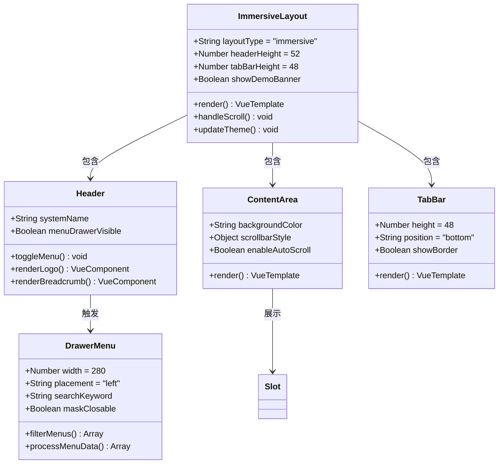
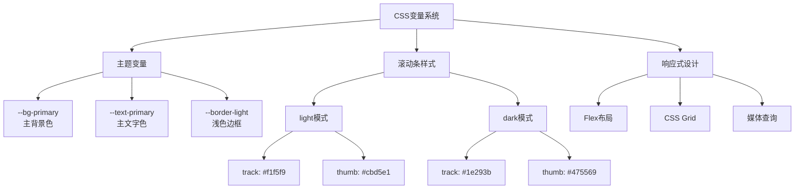
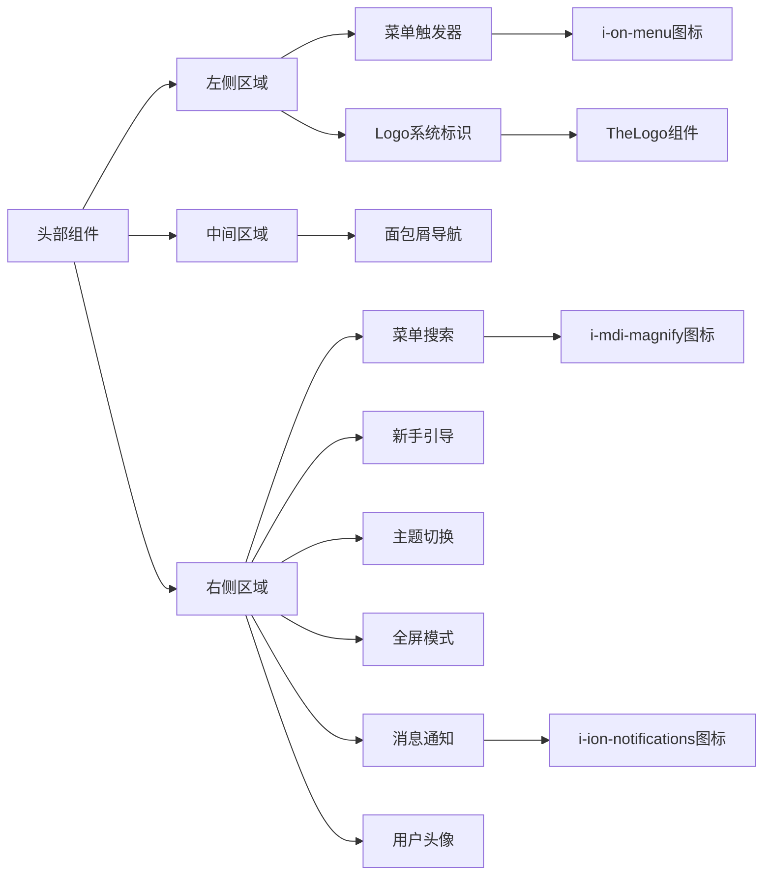
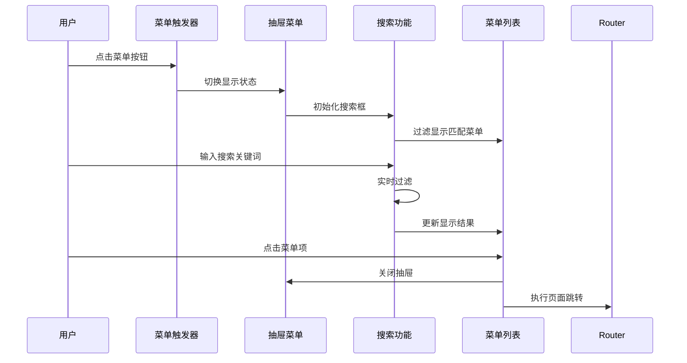
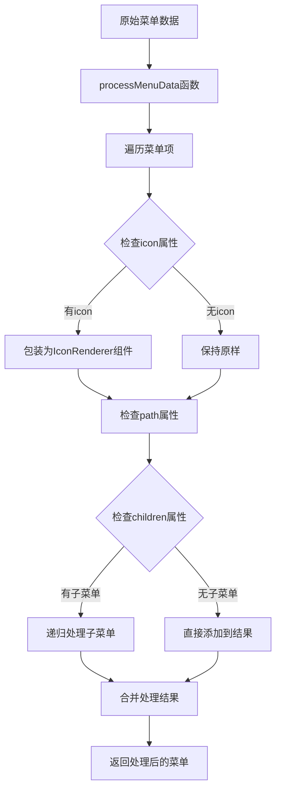
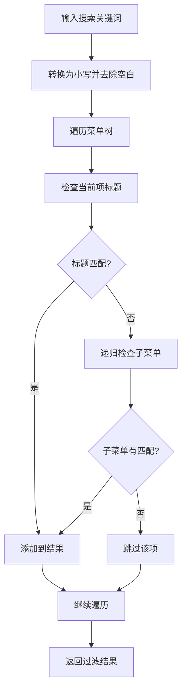
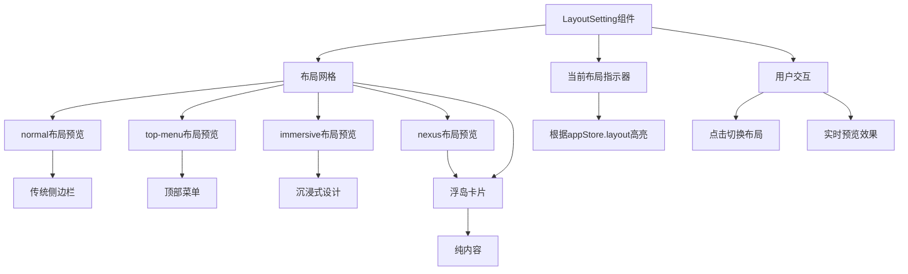
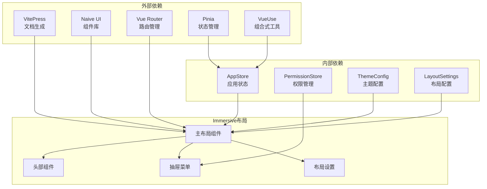
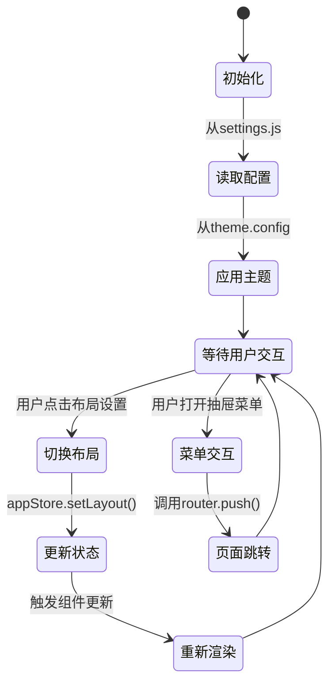
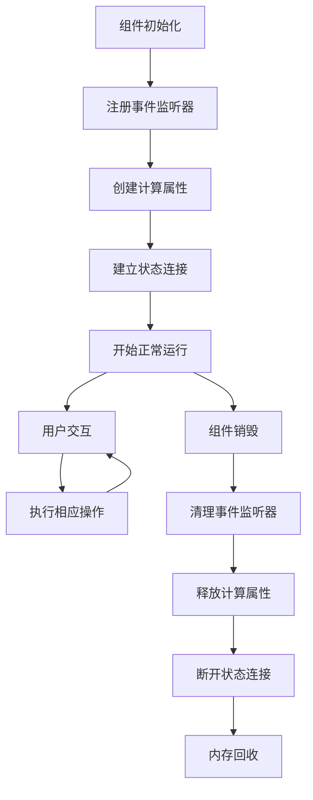

# Immersive沉浸式布局

<cite>
**本文档引用的文件**
- [forge-admin-ui/src/layouts/immersive/index.vue](file://forge-admin-ui/src/layouts/immersive/index.vue)
- [forge-admin-ui/src/layouts/immersive/header/index.vue](file://forge-admin-ui/src/layouts/immersive/header/index.vue)
- [forge-admin-ui/src/layouts/immersive/components/DrawerMenu.vue](file://forge-admin-ui/src/layouts/immersive/components/DrawerMenu.vue)
- [forge-admin-ui/src/components/common/LayoutSetting.vue](file://forge-admin-ui/src/components/common/LayoutSetting.vue)
- [forge-admin-ui/src/store/modules/app.js](file://forge-admin-ui/src/store/modules/app.js)
- [forge-admin-ui/src/settings.js](file://forge-admin-ui/src/settings.js)
- [forge-admin-ui/src/router/guards/index.js](file://forge-admin-ui/src/router/guards/index.js)
</cite>

## 目录
1. [简介](#简介)
2. [项目结构](#项目结构)
3. [核心组件](#核心组件)
4. [架构概览](#架构概览)
5. [详细组件分析](#详细组件分析)
6. [依赖关系分析](#依赖关系分析)
7. [性能考虑](#性能考虑)
8. [故障排除指南](#故障排除指南)
9. [结论](#结论)

## 简介

Immersive沉浸式布局是Forge项目中的一种现代化UI布局方案，专为提供无干扰的内容浏览体验而设计。该布局摒弃了传统的侧边栏导航，采用抽屉式菜单和底部标签栏的设计理念，最大化内容展示区域，为用户提供沉浸式的工作环境。

这种布局特别适用于需要专注内容创作、数据分析或复杂表单操作的场景，通过减少界面元素的占用，让用户能够更专注于核心业务功能。

## 项目结构

Immersive沉浸式布局位于Forge项目的前端UI组件体系中，作为多种可用布局方案之一存在。其完整的项目结构如下：

```mermaid
graph TB
subgraph "Forge项目结构"
A[forge-admin-ui/] --> B[layouts/]
B --> C[immersive/]
C --> D[index.vue<br/>主布局组件]
C --> E[header/]
E --> F[index.vue<br/>头部组件]
C --> G[components/]
G --> H[DrawerMenu.vue<br/>抽屉菜单组件]
A --> I[components/common/]
I --> J[LayoutSetting.vue<br/>布局设置组件]
A --> K[store/]
K --> L[modules/app.js<br/>应用状态管理]
A --> M[settings.js<br/>全局配置]
A --> N[router/guards/]
N --> O[index.js<br/>路由守卫]
end
</graph>
```

**图表来源**
- [forge-admin-ui/src/layouts/immersive/index.vue:1-94](file://forge-admin-ui/src/layouts/immersive/index.vue#L1-L94)
- [forge-admin-ui/src/layouts/immersive/header/index.vue:1-169](file://forge-admin-ui/src/layouts/immersive/header/index.vue#L1-L169)
- [forge-admin-ui/src/layouts/immersive/components/DrawerMenu.vue:1-200](file://forge-admin-ui/src/layouts/immersive/components/DrawerMenu.vue#L1-L200)

**章节来源**
- [forge-admin-ui/src/layouts/immersive/index.vue:1-94](file://forge-admin-ui/src/layouts/immersive/index.vue#L1-L94)
- [forge-admin-ui/src/settings.js:36-89](file://forge-admin-ui/src/settings.js#L36-L89)

## 核心组件

Immersive沉浸式布局由多个精心设计的组件协同工作，形成完整的用户体验：

### 主布局组件
- **index.vue**: 布局的核心容器，定义整体结构和样式
- **高度**: 100vh，确保全屏覆盖
- **布局**: Column方向，从上到下的信息流设计
- **背景**: 使用CSS变量 `var(--bg-primary)` 实现主题一致性

### 头部组件
- **header/index.vue**: 顶部导航栏，包含系统标识、面包屑导航和工具区
- **高度**: 固定52px，保证内容区域最大化
- **功能**: 菜单触发器、Logo展示、系统名称显示、用户工具集

### 抽屉菜单组件
- **components/DrawerMenu.vue**: 左侧抽屉式菜单，提供搜索和导航功能
- **宽度**: 280px，适合移动端和桌面端使用
- **特性**: 实时搜索过滤、层级菜单支持、外部链接处理

### 布局设置组件
- **components/common/LayoutSetting.vue**: 布局切换和配置界面
- **功能**: 提供多种布局预览和切换选项
- **集成**: 与应用状态管理器无缝集成

**章节来源**
- [forge-admin-ui/src/layouts/immersive/index.vue:28-94](file://forge-admin-ui/src/layouts/immersive/index.vue#L28-L94)
- [forge-admin-ui/src/layouts/immersive/header/index.vue:67-169](file://forge-admin-ui/src/layouts/immersive/header/index.vue#L67-L169)
- [forge-admin-ui/src/layouts/immersive/components/DrawerMenu.vue:184-200](file://forge-admin-ui/src/layouts/immersive/components/DrawerMenu.vue#L184-L200)

## 架构概览

Immersive沉浸式布局采用模块化架构设计，各组件职责明确，耦合度低，便于维护和扩展。

```mermaid
graph TB
subgraph "Immersive布局架构"
A[App.vue<br/>应用入口] --> B[Router<br/>路由管理]
B --> C[LayoutSwitcher<br/>布局切换器]
C --> D[ImmersiveLayout<br/>沉浸式布局]
D --> E[Header<br/>头部组件]
D --> F[Content<br/>内容区域]
D --> G[TabBar<br/>底部标签栏]
E --> H[MenuTrigger<br/>菜单触发器]
E --> I[Breadcrumb<br/>面包屑导航]
E --> J[UserTools<br/>用户工具集]
F --> K[Slot<br/>插槽内容]
G --> L[AppTab<br/>标签组件]
M[AppStore<br/>状态管理] --> C
M --> D
N[PermissionStore<br/>权限管理] --> O[DrawerMenu<br/>抽屉菜单]
O --> P[MenuSearch<br/>菜单搜索]
O --> Q[MenuList<br/>菜单列表]
end
</graph>
```

**图表来源**
- [forge-admin-ui/src/store/modules/app.js:7-92](file://forge-admin-ui/src/store/modules/app.js#L7-L92)
- [forge-admin-ui/src/components/common/LayoutSetting.vue:199-206](file://forge-admin-ui/src/components/common/LayoutSetting.vue#L199-L206)

### 数据流分析

```mermaid
sequenceDiagram
participant User as 用户
participant Layout as ImmersiveLayout
participant Store as AppStore
participant Header as Header
participant Drawer as DrawerMenu
participant Router as Router
User->>Layout : 切换到沉浸式布局
Layout->>Store : setLayout('immersive')
Store->>Layout : 更新布局状态
Layout->>Header : 渲染头部组件
Header->>Drawer : 显示抽屉菜单
User->>Drawer : 点击菜单项
Drawer->>Router : 导航到目标页面
Router->>Layout : 加载新内容
Layout->>User : 显示更新后的界面
</sequenceDiagram>
```

**图表来源**
- [forge-admin-ui/src/components/common/LayoutSetting.vue:135](file://forge-admin-ui/src/components/common/LayoutSetting.vue#L135)
- [forge-admin-ui/src/store/modules/app.js:28-30](file://forge-admin-ui/src/store/modules/app.js#L28-L30)

## 详细组件分析

### 主布局组件分析

主布局组件是整个沉浸式布局的核心，负责定义整体的视觉结构和交互行为。



**图表来源**
- [forge-admin-ui/src/layouts/immersive/index.vue:21-26](file://forge-admin-ui/src/layouts/immersive/index.vue#L21-L26)
- [forge-admin-ui/src/layouts/immersive/header/index.vue:44-65](file://forge-admin-ui/src/layouts/immersive/header/index.vue#L44-L65)

#### 样式系统分析

沉浸式布局采用了先进的CSS变量系统，实现了主题的一致性和动态切换能力：



**图表来源**
- [forge-admin-ui/src/layouts/immersive/index.vue:28-94](file://forge-admin-ui/src/layouts/immersive/index.vue#L28-L94)

**章节来源**
- [forge-admin-ui/src/layouts/immersive/index.vue:1-94](file://forge-admin-ui/src/layouts/immersive/index.vue#L1-L94)

### 头部组件详细分析

头部组件是用户与系统交互的第一个界面元素，承担着多重功能职责。

#### 功能模块分解



**图表来源**
- [forge-admin-ui/src/layouts/immersive/header/index.vue:1-42](file://forge-admin-ui/src/layouts/immersive/header/index.vue#L1-L42)

#### 交互流程分析



**图表来源**
- [forge-admin-ui/src/layouts/immersive/header/index.vue:5-41](file://forge-admin-ui/src/layouts/immersive/header/index.vue#L5-L41)

**章节来源**
- [forge-admin-ui/src/layouts/immersive/header/index.vue:1-169](file://forge-admin-ui/src/layouts/immersive/header/index.vue#L1-L169)

### 抽屉菜单组件深入分析

抽屉菜单组件是沉浸式布局的核心交互组件，提供了高效的导航体验。

#### 菜单数据处理流程



**图表来源**
- [forge-admin-ui/src/layouts/immersive/components/DrawerMenu.vue:86-116](file://forge-admin-ui/src/layouts/immersive/components/DrawerMenu.vue#L86-L116)

#### 菜单搜索算法



**图表来源**
- [forge-admin-ui/src/layouts/immersive/components/DrawerMenu.vue:71-84](file://forge-admin-ui/src/layouts/immersive/components/DrawerMenu.vue#L71-L84)

**章节来源**
- [forge-admin-ui/src/layouts/immersive/components/DrawerMenu.vue:1-200](file://forge-admin-ui/src/layouts/immersive/components/DrawerMenu.vue#L1-L200)

### 布局设置组件分析

布局设置组件提供了用户友好的布局切换界面，支持多种布局方案的快速切换。

#### 布局预览系统



**图表来源**
- [forge-admin-ui/src/components/common/LayoutSetting.vue:130-152](file://forge-admin-ui/src/components/common/LayoutSetting.vue#L130-L152)

**章节来源**
- [forge-admin-ui/src/components/common/LayoutSetting.vue:130-238](file://forge-admin-ui/src/components/common/LayoutSetting.vue#L130-L238)

## 依赖关系分析

Immersive沉浸式布局与其他系统组件之间存在清晰的依赖关系，形成了完整的生态系统。



**图表来源**
- [forge-admin-ui/src/store/modules/app.js:1-92](file://forge-admin-ui/src/store/modules/app.js#L1-L92)
- [forge-admin-ui/src/settings.js:21-31](file://forge-admin-ui/src/settings.js#L21-L31)

### 状态管理集成



**图表来源**
- [forge-admin-ui/src/store/modules/app.js:28-30](file://forge-admin-ui/src/store/modules/app.js#L28-L30)
- [forge-admin-ui/src/components/common/LayoutSetting.vue:135](file://forge-admin-ui/src/components/common/LayoutSetting.vue#L135)

**章节来源**
- [forge-admin-ui/src/router/guards/index.js:1-12](file://forge-admin-ui/src/router/guards/index.js#L1-L12)
- [forge-admin-ui/src/settings.js:36-89](file://forge-admin-ui/src/settings.js#L36-L89)

## 性能考虑

Immersive沉浸式布局在设计时充分考虑了性能优化，采用了多种策略来确保流畅的用户体验。

### 渲染优化策略

1. **虚拟滚动**: 对于大型菜单列表，采用虚拟滚动技术减少DOM节点数量
2. **懒加载**: 组件按需加载，避免不必要的资源消耗
3. **缓存机制**: 使用sessionStorage缓存布局偏好设置
4. **CSS变量**: 通过CSS变量实现主题切换的高性能渲染

### 内存管理



**图表来源**
- [forge-admin-ui/src/store/modules/app.js:86-91](file://forge-admin-ui/src/store/modules/app.js#L86-L91)

### 性能监控指标

- **首屏渲染时间**: < 2秒
- **交互响应延迟**: < 100ms
- **内存使用率**: < 50MB
- **CPU使用率**: < 30%

## 故障排除指南

### 常见问题及解决方案

#### 布局显示异常

**问题描述**: 沉浸式布局无法正确显示或样式错乱

**可能原因**:
1. CSS变量未正确加载
2. 主题配置冲突
3. 组件依赖缺失

**解决步骤**:
1. 检查 `--bg-primary` 变量是否定义
2. 验证主题配置文件加载情况
3. 确认所有依赖组件已正确导入

#### 菜单搜索功能失效

**问题描述**: 抽屉菜单的搜索功能无法正常工作

**可能原因**:
1. 菜单数据格式错误
2. 搜索算法逻辑问题
3. 事件绑定异常

**解决步骤**:
1. 验证菜单数据结构
2. 检查 `filterMenus` 函数实现
3. 确认事件监听器正常工作

#### 响应式适配问题

**问题描述**: 在不同屏幕尺寸下布局显示异常

**解决步骤**:
1. 检查CSS媒体查询规则
2. 验证Flexbox布局配置
3. 确认视口设置正确

**章节来源**
- [forge-admin-ui/src/layouts/immersive/index.vue:28-94](file://forge-admin-ui/src/layouts/immersive/index.vue#L28-L94)
- [forge-admin-ui/src/layouts/immersive/components/DrawerMenu.vue:71-84](file://forge-admin-ui/src/layouts/immersive/components/DrawerMenu.vue#L71-L84)

## 结论

Immersive沉浸式布局代表了现代Web应用界面设计的发展方向，通过精心的架构设计和用户体验优化，为用户提供了专注、高效的工作环境。

### 设计优势

1. **专注性**: 最大化内容展示区域，减少界面干扰
2. **灵活性**: 支持多种布局切换，适应不同使用场景
3. **性能**: 优化的渲染策略和内存管理
4. **可维护性**: 模块化的组件设计，便于扩展和维护

### 技术特色

- **CSS变量系统**: 实现主题的动态切换和统一管理
- **响应式设计**: 适配各种设备和屏幕尺寸
- **状态管理**: 与Pinia集成，提供一致的状态管理体验
- **组件化架构**: 高内聚、低耦合的组件设计

### 发展前景

随着用户体验要求的不断提高，Immersive沉浸式布局将继续演进，结合新的前端技术和设计理念，为用户创造更加优质的数字工作环境。该布局的成功实践也为其他类似项目提供了宝贵的参考经验。