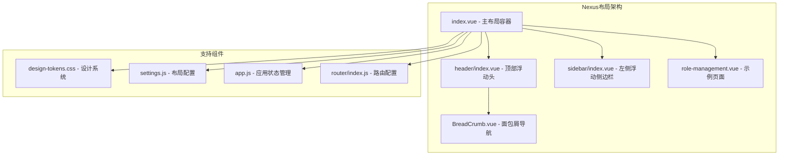
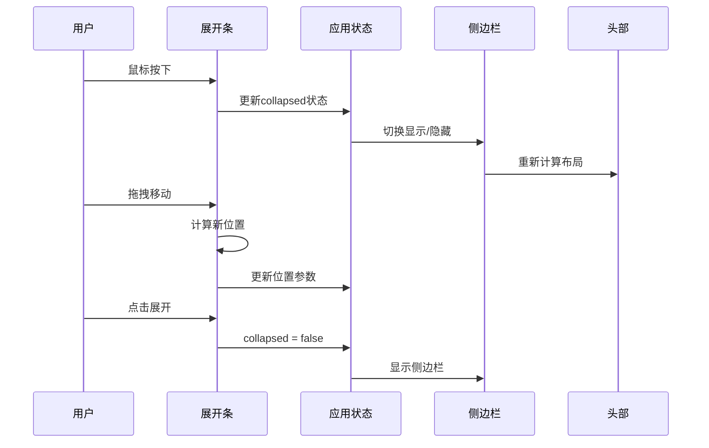
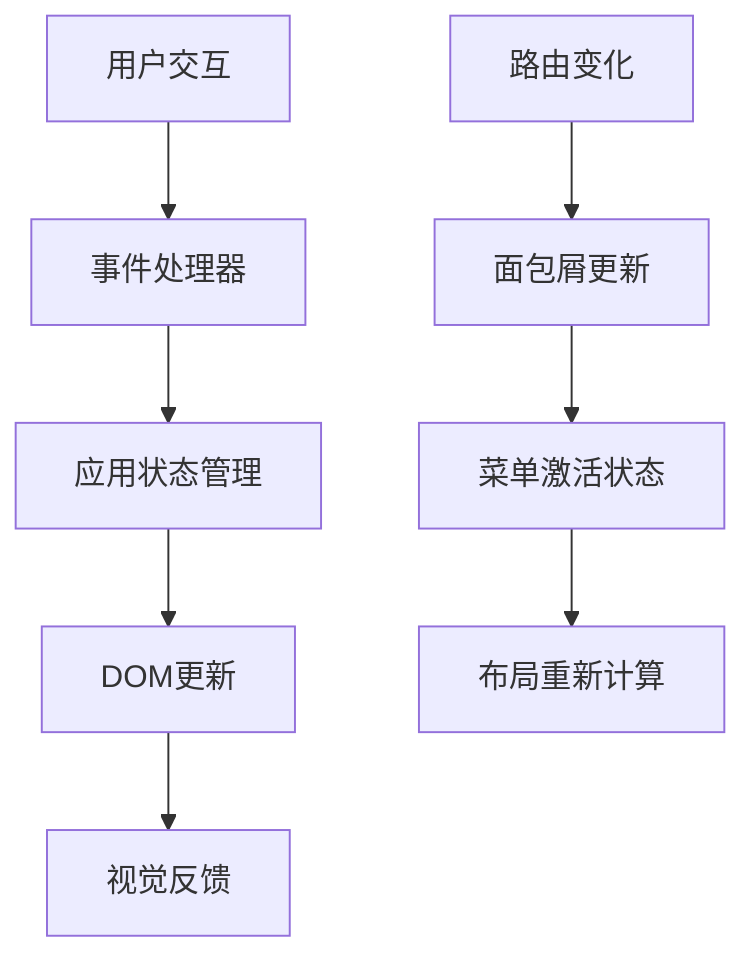
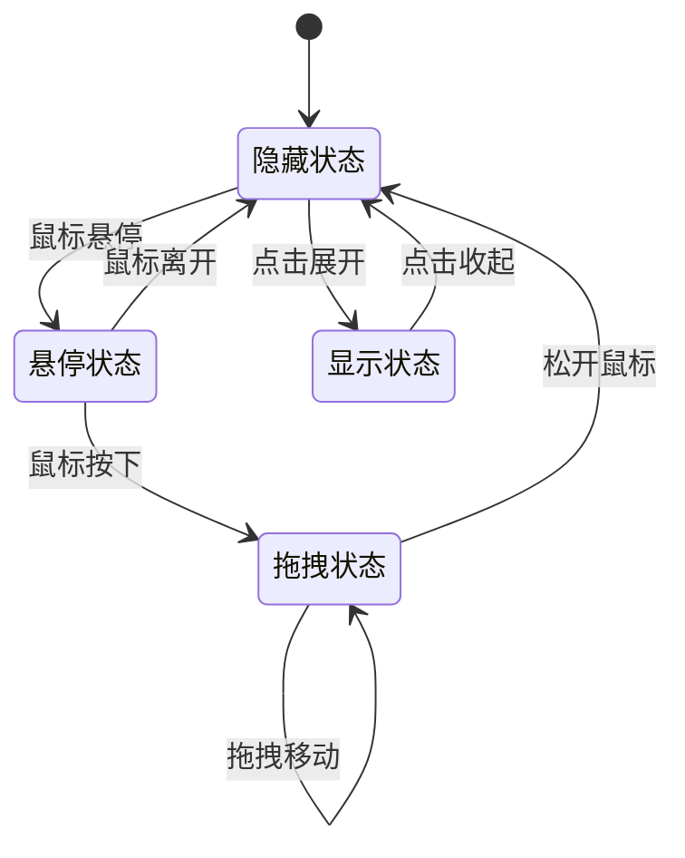
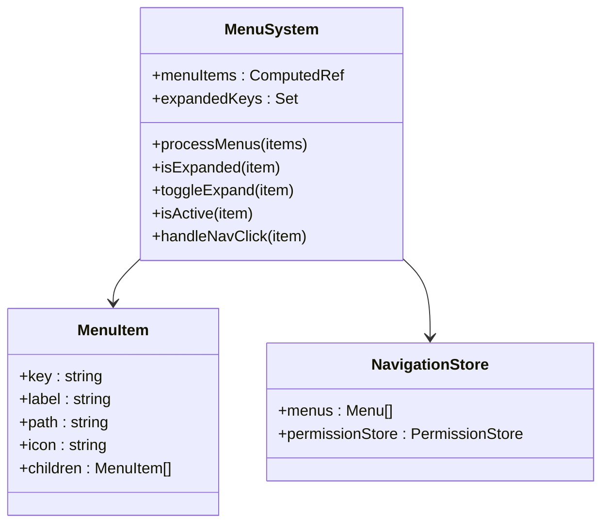
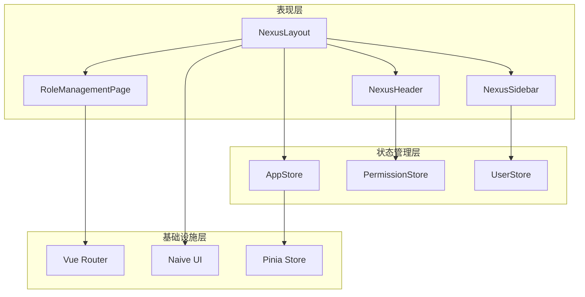

# Nexus浮动岛屿布局

<cite>
**本文档引用的文件**
- [index.vue](file://forge-admin-ui/src/layouts/nexus/index.vue)
- [role-management.vue](file://forge-admin-ui/src/views/nexus/role-management.vue)
- [header/index.vue](file://forge-admin-ui/src/layouts/nexus/header/index.vue)
- [sidebar/index.vue](file://forge-admin-ui/src/layouts/nexus/sidebar/index.vue)
- [settings.js](file://forge-admin-ui/src/settings.js)
- [app.js](file://forge-admin-ui/src/store/modules/app.js)
- [design-tokens.css](file://forge-admin-ui/src/styles/design-tokens.css)
- [router/index.js](file://forge-admin-ui/src/router/index.js)
- [BreadCrumb.vue](file://forge-admin-ui/src/layouts/nexus/BreadCrumb.vue)
</cite>

## 目录
1. [简介](#简介)
2. [项目结构](#项目结构)
3. [核心组件](#核心组件)
4. [架构概览](#架构概览)
5. [详细组件分析](#详细组件分析)
6. [依赖关系分析](#依赖关系分析)
7. [性能考虑](#性能考虑)
8. [故障排除指南](#故障排除指南)
9. [结论](#结论)

## 简介

Nexus浮动岛屿布局是Forge Admin管理系统中的一个现代化UI布局方案，采用"浮动岛屿"的设计理念。该布局通过卡片式的浮岛设计，为用户提供更加直观和高效的界面体验。布局的核心特色包括可拖拽的侧边栏展开条、浮动的头部区域、以及内容区域的卡片化设计。

这种设计风格融合了现代商务美学和用户体验优化，通过柔和的阴影效果、圆角设计和精致的色彩搭配，营造出专业而友好的操作环境。Nexus布局特别适合需要大量信息展示和复杂功能管理的企业级应用。

## 项目结构

Nexus浮动岛屿布局主要由以下几个核心部分组成：

**图表来源**
- [index.vue:1-531](file://forge-admin-ui/src/layouts/nexus/index.vue#L1-L531)
- [header/index.vue:1-147](file://forge-admin-ui/src/layouts/nexus/header/index.vue#L1-L147)
- [sidebar/index.vue:1-671](file://forge-admin-ui/src/layouts/nexus/sidebar/index.vue#L1-L671)

**章节来源**
- [index.vue:1-531](file://forge-admin-ui/src/layouts/nexus/index.vue#L1-L531)
- [settings.js:37-89](file://forge-admin-ui/src/settings.js#L37-L89)

## 核心组件

### 主布局容器 (NexusLayout)

Nexus主布局容器是整个浮动岛屿布局的核心，负责协调各个组件的布局和交互。其主要特点包括：

- **浮动岛屿设计**：采用卡片式设计，具有柔和的阴影效果
- **响应式布局**：支持多种屏幕尺寸的自适应
- **可拖拽交互**：提供侧边栏展开条的拖拽功能
- **深度模式支持**：完整的明暗主题切换

### 顶部浮动头 (NexusHeader)

顶部浮动头采用极简设计，集成了面包屑导航、搜索功能和用户工具栏：

- **面包屑导航**：动态显示当前页面路径
- **搜索功能**：集成全局搜索入口
- **用户工具栏**：包含主题切换、全屏、通知和用户头像

### 左侧浮动侧边栏 (NexusSidebar)

左侧浮动侧边栏是Nexus布局最具特色的部分，采用卡片式设计：

- **折叠菜单系统**：支持多级菜单的折叠展开
- **活动状态指示**：清晰显示当前选中的菜单项
- **用户信息面板**：集成用户头像和快捷操作
- **平滑动画效果**：菜单切换具有流畅的过渡动画

**章节来源**
- [index.vue:110-531](file://forge-admin-ui/src/layouts/nexus/index.vue#L110-L531)
- [header/index.vue:1-147](file://forge-admin-ui/src/layouts/nexus/header/index.vue#L1-L147)
- [sidebar/index.vue:1-671](file://forge-admin-ui/src/layouts/nexus/sidebar/index.vue#L1-L671)

## 架构概览

Nexus浮动岛屿布局采用了模块化的架构设计，各组件之间通过清晰的接口进行通信：

**图表来源**
- [index.vue:66-107](file://forge-admin-ui/src/layouts/nexus/index.vue#L66-L107)
- [app.js:18-30](file://forge-admin-ui/src/store/modules/app.js#L18-L30)

### 数据流分析

Nexus布局的数据流遵循单向数据流原则，确保状态管理的清晰性和可预测性：

**图表来源**
- [index.vue:66-107](file://forge-admin-ui/src/layouts/nexus/index.vue#L66-L107)
- [BreadCrumb.vue:57-85](file://forge-admin-ui/src/layouts/nexus/BreadCrumb.vue#L57-L85)

**章节来源**
- [index.vue:50-108](file://forge-admin-ui/src/layouts/nexus/index.vue#L50-L108)
- [app.js:7-92](file://forge-admin-ui/src/store/modules/app.js#L7-L92)

## 详细组件分析

### 展开拖拽条组件

展开拖拽条是Nexus布局最具创新性的交互元素之一，它提供了独特的侧边栏控制方式：

#### 交互流程

#### 核心功能实现

展开拖拽条实现了以下核心功能：

- **智能拖拽检测**：区分拖拽和点击操作
- **边界限制**：防止拖拽超出可视范围
- **平滑动画**：拖拽过程中的流畅过渡
- **状态持久化**：拖拽位置的记忆功能

**章节来源**
- [index.vue:66-107](file://forge-admin-ui/src/layouts/nexus/index.vue#L66-L107)

### 侧边栏菜单系统

侧边栏菜单系统采用了现代化的折叠设计，支持复杂的层级结构：

#### 菜单渲染机制

**图表来源**
- [sidebar/index.vue:124-204](file://forge-admin-ui/src/layouts/nexus/sidebar/index.vue#L124-L204)

#### 菜单激活逻辑

菜单激活状态的判断逻辑考虑了多种情况：

- **精确匹配**：完全相同的路径
- **前缀匹配**：子路径的自动激活
- **边界处理**：避免前缀误匹配问题

**章节来源**
- [sidebar/index.vue:146-204](file://forge-admin-ui/src/layouts/nexus/sidebar/index.vue#L146-L204)

### 示例页面：角色管理

Nexus布局提供了一个完整的角色管理页面作为示例，展示了浮动岛屿设计在实际业务场景中的应用：

#### 页面结构分析

角色管理页面采用了"便当盒"式的信息展示布局：

- **统计卡片网格**：展示关键指标和统计数据
- **过滤控制面板**：提供灵活的数据筛选功能
- **表格视图**：展示详细的角色信息
- **响应式设计**：适配不同屏幕尺寸

#### 数据展示模式

页面使用了多种数据展示模式：

- **统计卡片**：突出显示重要指标
- **标签云**：展示权限和状态信息
- **头像堆叠**：显示用户关联信息
- **状态指示器**：可视化显示系统状态

**章节来源**
- [role-management.vue:1-746](file://forge-admin-ui/src/views/nexus/role-management.vue#L1-L746)

## 依赖关系分析

Nexus浮动岛屿布局的依赖关系体现了清晰的分层架构：

**图表来源**
- [index.vue:51-56](file://forge-admin-ui/src/layouts/nexus/index.vue#L51-L56)
- [app.js:7-17](file://forge-admin-ui/src/store/modules/app.js#L7-L17)

### 组件耦合度分析

Nexus布局在设计上注重降低组件间的耦合度：

- **松耦合设计**：组件间通过props和events通信
- **状态集中管理**：使用Pinia进行状态统一管理
- **接口抽象**：通过store接口隐藏具体实现细节
- **事件驱动**：采用Vue的事件系统进行组件通信

**章节来源**
- [index.vue:51-56](file://forge-admin-ui/src/layouts/nexus/index.vue#L51-L56)
- [app.js:7-17](file://forge-admin-ui/src/store/modules/app.js#L7-L17)

## 性能考虑

Nexus浮动岛屿布局在性能方面采用了多项优化策略：

### 渲染优化

- **虚拟滚动**：对于大量数据的列表采用虚拟滚动技术
- **懒加载**：非关键资源按需加载
- **CSS变量缓存**：使用CSS变量减少重绘
- **动画优化**：利用GPU加速提升动画性能

### 内存管理

- **组件卸载清理**：及时清理事件监听器和定时器
- **状态持久化**：合理使用sessionStorage避免内存泄漏
- **图片优化**：采用适当的图片格式和尺寸

### 网络优化

- **资源压缩**：生产环境启用代码压缩和合并
- **CDN加速**：静态资源使用CDN分发
- **缓存策略**：合理的HTTP缓存配置

## 故障排除指南

### 常见问题及解决方案

#### 布局错位问题

**症状**：侧边栏或内容区域位置异常
**原因**：CSS变量未正确加载或浏览器兼容性问题
**解决方案**：
1. 检查design-tokens.css是否正确引入
2. 验证CSS变量的浏览器支持情况
3. 确认z-index层级设置

#### 交互失效问题

**症状**：拖拽功能无法正常使用
**原因**：事件监听器未正确绑定或状态管理异常
**解决方案**：
1. 检查handleBarMouseDown事件绑定
2. 验证appStore.collapsed状态
3. 确认事件监听器的清理机制

#### 性能问题

**症状**：页面滚动卡顿或菜单切换延迟
**原因**：过多的DOM操作或重绘重排
**解决方案**：
1. 使用requestAnimationFrame优化动画
2. 减少不必要的CSS属性修改
3. 实施虚拟滚动优化大数据集

**章节来源**
- [index.vue:104-107](file://forge-admin-ui/src/layouts/nexus/index.vue#L104-L107)
- [design-tokens.css:297-306](file://forge-admin-ui/src/styles/design-tokens.css#L297-L306)

## 结论

Nexus浮动岛屿布局代表了现代前端UI设计的发展方向，通过创新的浮动岛屿设计理念和精心的交互优化，为用户提供了卓越的操作体验。该布局不仅在视觉上具有吸引力，在功能性和性能方面也达到了很高的水准。

布局的主要优势包括：

- **创新的设计理念**：浮动岛屿设计突破了传统布局的限制
- **优秀的用户体验**：直观的交互和流畅的动画效果
- **强大的功能性**：支持复杂的菜单系统和数据展示
- **良好的可扩展性**：模块化设计便于功能扩展和定制

随着前端技术的不断发展，Nexus布局为类似的设计提供了宝贵的参考和借鉴价值。其设计理念和实现细节值得在更多的项目中得到应用和推广。