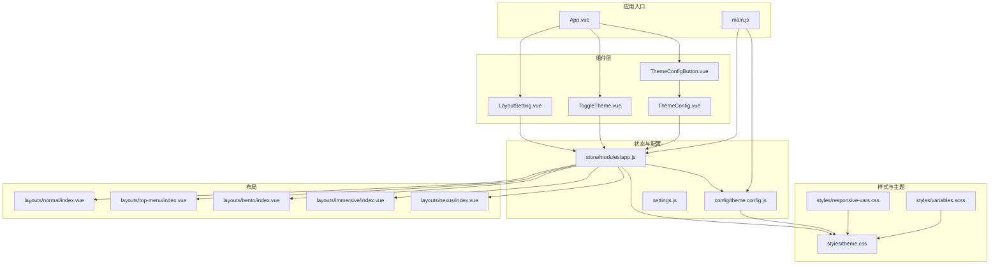
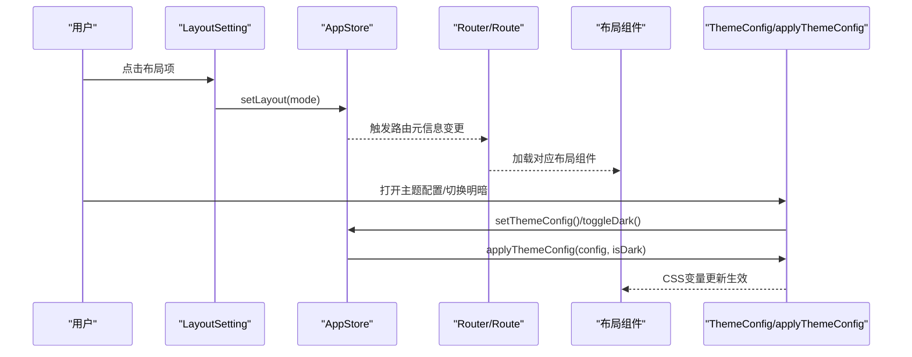
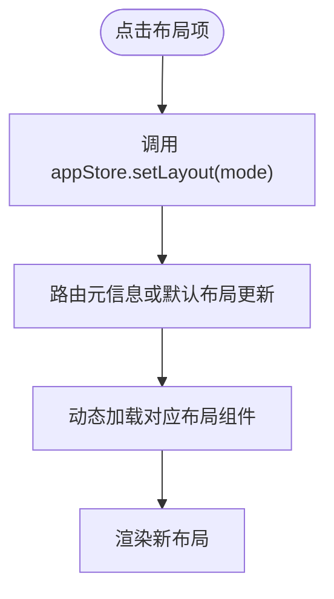
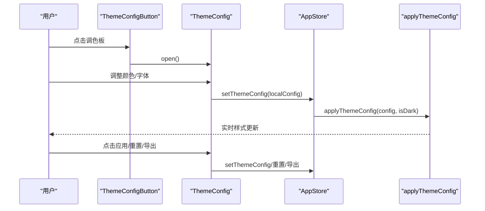
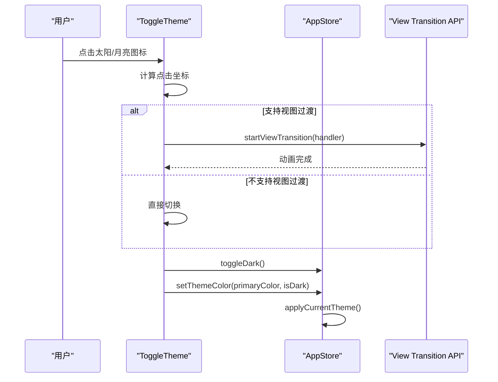
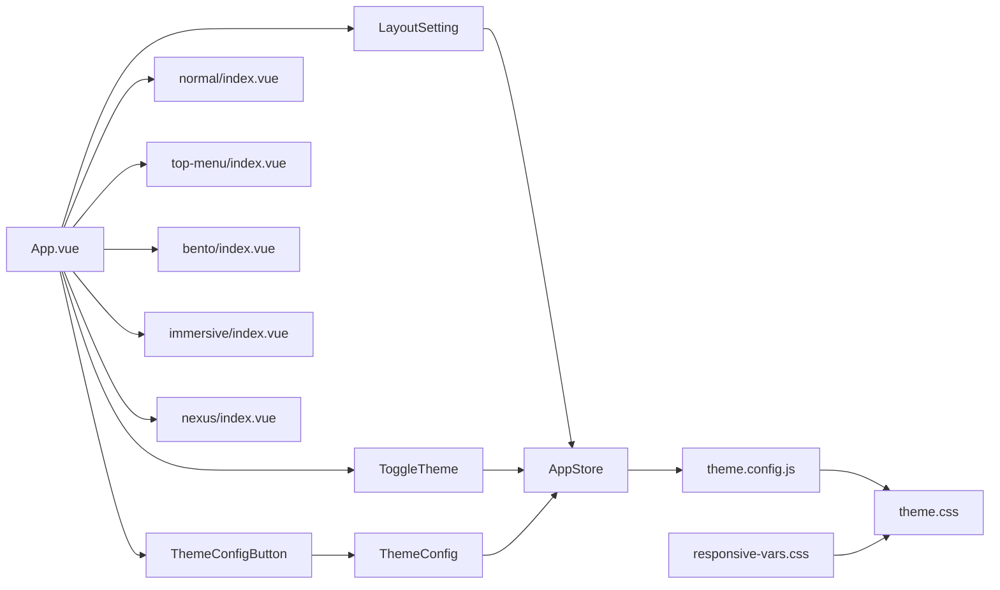

# 布局组件

<cite>
**本文引用的文件**   
- [LayoutSetting.vue](file://forge-admin-ui/src/components/common/LayoutSetting.vue)
- [ThemeConfig.vue](file://forge-admin-ui/src/components/common/ThemeConfig.vue)
- [ThemeConfigButton.vue](file://forge-admin-ui/src/components/common/ThemeConfigButton.vue)
- [ToggleTheme.vue](file://forge-admin-ui/src/components/common/ToggleTheme.vue)
- [theme.config.js](file://forge-admin-ui/src/config/theme.config.js)
- [app.js](file://forge-admin-ui/src/store/modules/app.js)
- [theme.css](file://forge-admin-ui/src/styles/theme.css)
- [responsive-vars.css](file://forge-admin-ui/src/styles/responsive-vars.css)
- [variables.scss](file://forge-admin-ui/src/styles/variables.scss)
- [normal/index.vue](file://forge-admin-ui/src/layouts/normal/index.vue)
- [top-menu/index.vue](file://forge-admin-ui/src/layouts/top-menu/index.vue)
- [bento/index.vue](file://forge-admin-ui/src/layouts/bento/index.vue)
- [immersive/index.vue](file://forge-admin-ui/src/layouts/immersive/index.vue)
- [nexus/index.vue](file://forge-admin-ui/src/layouts/nexus/index.vue)
- [settings.js](file://forge-admin-ui/src/settings.js)
- [main.js](file://forge-admin-ui/src/main.js)
- [App.vue](file://forge-admin-ui/src/App.vue)
- [responsive-font-unified.js](file://forge-admin-ui/src/plugins/responsive-font-unified.js)
- [menu-theme.js](file://forge-admin-ui/src/utils/menu-theme.js)
- [BentoRail.vue](file://forge-admin-ui/src/layouts/bento/components/BentoRail.vue)
- [DrawerMenu.vue](file://forge-admin-ui/src/layouts/immersive/components/DrawerMenu.vue)
- [nexus/sidebar/index.vue](file://forge-admin-ui/src/layouts/nexus/sidebar/index.vue)
- [nexus/header/index.vue](file://forge-admin-ui/src/layouts/nexus/header/index.vue)
- [immersive/header/index.vue](file://forge-admin-ui/src/layouts/immersive/header/index.vue)
- [TURBOGUIDE.md](file://forge-admin-ui/docs/THEME_CONFIG.md)
- [QUICK_START_THEME.md](file://forge-admin-ui/QUICK_START_THEME.md)
</cite>

## 更新摘要
**所做更改**
- 新增三个全新布局变体：Nexus浮动岛屿布局、Immersive沉浸式布局、Bento网格布局
- 更新布局设置组件以支持新布局变体的预览和切换
- 增强布局配置功能，完善响应式设计和交互体验
- 新增详细的布局组件分析章节，涵盖新布局的技术实现

## 目录
1. [简介](#简介)
2. [项目结构](#项目结构)
3. [核心组件](#核心组件)
4. [架构总览](#架构总览)
5. [详细组件分析](#详细组件分析)
6. [新增布局变体详解](#新增布局变体详解)
7. [依赖关系分析](#依赖关系分析)
8. [性能考量](#性能考量)
9. [故障排查指南](#故障排查指南)
10. [结论](#结论)
11. [附录](#附录)

## 简介
本技术文档聚焦于Forge前端工程中的布局与主题系统，围绕以下组件展开：
- 布局设置组件：LayoutSetting，用于切换系统布局模式（包括新增的Nexus浮动岛屿、Immersive沉浸式、Bento网格布局）。
- 主题配置组件：ThemeConfig，提供Header、顶部菜单、侧边菜单的颜色与字体配置，并支持应用、重置与导出。
- 主题配置按钮：ThemeConfigButton，负责打开主题配置抽屉。
- 明暗模式切换：ToggleTheme，支持基于视图过渡的动画切换与状态持久化。

同时，文档深入解析主题配置的颜色管理、字体设置与组件样式定制；阐述响应式设计、屏幕适配与兼容性处理；并给出主题系统的扩展机制、自定义主题与品牌定制方案，以及配置项、事件监听与状态管理的最佳实践。

## 项目结构
本节从"组件-样式-状态-入口"四个维度梳理与布局主题相关的关键文件与职责分工。

**图表来源**
- [LayoutSetting.vue:1-238](file://forge-admin-ui/src/components/common/LayoutSetting.vue#L1-L238)
- [ThemeConfig.vue:1-285](file://forge-admin-ui/src/components/common/ThemeConfig.vue#L1-L285)
- [ThemeConfigButton.vue:1-26](file://forge-admin-ui/src/components/common/ThemeConfigButton.vue#L1-L26)
- [ToggleTheme.vue:1-47](file://forge-admin-ui/src/components/common/ToggleTheme.vue#L1-L47)
- [app.js:1-91](file://forge-admin-ui/src/store/modules/app.js#L1-L91)
- [theme.config.js:1-164](file://forge-admin-ui/src/config/theme.config.js#L1-L164)
- [theme.css:1-576](file://forge-admin-ui/src/styles/theme.css#L1-L576)
- [responsive-vars.css:1-63](file://forge-admin-ui/src/styles/responsive-vars.css#L1-L63)
- [variables.scss:1-42](file://forge-admin-ui/src/styles/variables.scss#L1-L42)
- [normal/index.vue:1-192](file://forge-admin-ui/src/layouts/normal/index.vue#L1-L192)
- [top-menu/index.vue:1-48](file://forge-admin-ui/src/layouts/top-menu/index.vue#L1-L48)
- [bento/index.vue:1-79](file://forge-admin-ui/src/layouts/bento/index.vue#L1-L79)
- [immersive/index.vue:1-94](file://forge-admin-ui/src/layouts/immersive/index.vue#L1-L94)
- [nexus/index.vue:1-531](file://forge-admin-ui/src/layouts/nexus/index.vue#L1-L531)
- [settings.js:1-90](file://forge-admin-ui/src/settings.js#L1-L90)
- [main.js:1-37](file://forge-admin-ui/src/main.js#L1-L37)
- [App.vue:1-150](file://forge-admin-ui/src/App.vue#L1-L150)

**章节来源**
- [LayoutSetting.vue:1-238](file://forge-admin-ui/src/components/common/LayoutSetting.vue#L1-L238)
- [ThemeConfig.vue:1-285](file://forge-admin-ui/src/components/common/ThemeConfig.vue#L1-L285)
- [ThemeConfigButton.vue:1-26](file://forge-admin-ui/src/components/common/ThemeConfigButton.vue#L1-L26)
- [ToggleTheme.vue:1-47](file://forge-admin-ui/src/components/common/ToggleTheme.vue#L1-L47)
- [app.js:1-91](file://forge-admin-ui/src/store/modules/app.js#L1-L91)
- [theme.config.js:1-164](file://forge-admin-ui/src/config/theme.config.js#L1-L164)
- [theme.css:1-576](file://forge-admin-ui/src/styles/theme.css#L1-L576)
- [responsive-vars.css:1-63](file://forge-admin-ui/src/styles/responsive-vars.css#L1-L63)
- [variables.scss:1-42](file://forge-admin-ui/src/styles/variables.scss#L1-L42)
- [normal/index.vue:1-192](file://forge-admin-ui/src/layouts/normal/index.vue#L1-L192)
- [top-menu/index.vue:1-48](file://forge-admin-ui/src/layouts/top-menu/index.vue#L1-L48)
- [bento/index.vue:1-79](file://forge-admin-ui/src/layouts/bento/index.vue#L1-L79)
- [immersive/index.vue:1-94](file://forge-admin-ui/src/layouts/immersive/index.vue#L1-L94)
- [nexus/index.vue:1-531](file://forge-admin-ui/src/layouts/nexus/index.vue#L1-L531)
- [settings.js:1-90](file://forge-admin-ui/src/settings.js#L1-L90)
- [main.js:1-37](file://forge-admin-ui/src/main.js#L1-L37)
- [App.vue:1-150](file://forge-admin-ui/src/App.vue#L1-L150)

## 核心组件
本节概述四大组件的功能边界与协作关系。

- LayoutSetting：提供布局模式选择与预览，通过Pinia状态驱动布局切换，现已支持九种布局变体。
- ThemeConfig：提供Header、顶部菜单、侧边菜单的可视化配置，支持应用、重置与导出。
- ThemeConfigButton：封装打开主题配置抽屉的交互。
- ToggleTheme：切换明/暗模式，支持视图过渡动画与状态持久化。

**章节来源**
- [LayoutSetting.vue:1-238](file://forge-admin-ui/src/components/common/LayoutSetting.vue#L1-L238)
- [ThemeConfig.vue:1-285](file://forge-admin-ui/src/components/common/ThemeConfig.vue#L1-L285)
- [ThemeConfigButton.vue:1-26](file://forge-admin-ui/src/components/common/ThemeConfigButton.vue#L1-L26)
- [ToggleTheme.vue:1-47](file://forge-admin-ui/src/components/common/ToggleTheme.vue#L1-L47)

## 架构总览
整体架构以Pinia状态为中心，通过主题配置模块将CSS变量注入到全局样式中，布局组件按路由元信息或状态动态加载。

**图表来源**
- [LayoutSetting.vue:154-174](file://forge-admin-ui/src/components/common/LayoutSetting.vue#L154-L174)
- [app.js:28-73](file://forge-admin-ui/src/store/modules/app.js#L28-L73)
- [App.vue:43-67](file://forge-admin-ui/src/App.vue#L43-L67)
- [theme.config.js:105-163](file://forge-admin-ui/src/config/theme.config.js#L105-L163)

**章节来源**
- [App.vue:43-67](file://forge-admin-ui/src/App.vue#L43-L67)
- [app.js:28-73](file://forge-admin-ui/src/store/modules/app.js#L28-L73)
- [theme.config.js:105-163](file://forge-admin-ui/src/config/theme.config.js#L105-L163)

## 详细组件分析

### LayoutSetting 布局设置组件
- 功能要点
  - 提供九种布局模式预览网格（简约、通用、顶部菜单、顶部加侧栏、全面、空白、便当盒、沉浸式、Nexus浮动岛屿）。
  - 点击任一布局卡片调用Pinia状态中的setLayout，从而影响路由元信息或默认布局。
  - 通过Tooltip提示与模态框承载，避免遮挡主界面。
- 关键交互
  - 点击卡片 -> 调用appStore.setLayout -> 触发布局切换。
  - 卡片高亮显示当前已选布局。
- 注意事项
  - 对于已显式设置layout的页面，其优先级高于全局设置。
  - 布局切换采用异步组件按需加载，避免首屏负担。

**图表来源**
- [LayoutSetting.vue:14-174](file://forge-admin-ui/src/components/common/LayoutSetting.vue#L14-L174)
- [app.js:28-30](file://forge-admin-ui/src/store/modules/app.js#L28-L30)
- [App.vue:43-67](file://forge-admin-ui/src/App.vue#L43-L67)

**章节来源**
- [LayoutSetting.vue:1-238](file://forge-admin-ui/src/components/common/LayoutSetting.vue#L1-L238)
- [settings.js:36-89](file://forge-admin-ui/src/settings.js#L36-L89)
- [App.vue:43-67](file://forge-admin-ui/src/App.vue#L43-L67)

### ThemeConfig 主题配置组件
- 功能要点
  - 三标签页：Header、顶部菜单、侧边菜单，分别提供颜色与字体配置。
  - 实时预览：输入值变更即调用setThemeConfig同步到全局。
  - 应用主题：保存当前配置到Pinia并关闭抽屉。
  - 重置为默认：恢复默认主题配置。
  - 导出配置：生成JSON文件下载。
- 数据流
  - 本地配置localConfig（深拷贝自Pinia） -> 实时更新 -> setThemeConfig -> applyThemeConfig -> CSS变量生效。
- 字体大小
  - 通过输入框限制范围并在更新时拼接单位，再写入对应配置。

**图表来源**
- [ThemeConfigButton.vue:17-25](file://forge-admin-ui/src/components/common/ThemeConfigButton.vue#L17-L25)
- [ThemeConfig.vue:208-284](file://forge-admin-ui/src/components/common/ThemeConfig.vue#L208-L284)
- [app.js:50-73](file://forge-admin-ui/src/store/modules/app.js#L50-L73)
- [theme.config.js:105-163](file://forge-admin-ui/src/config/theme.config.js#L105-L163)

**章节来源**
- [ThemeConfig.vue:1-285](file://forge-admin-ui/src/components/common/ThemeConfig.vue#L1-L285)
- [theme.config.js:1-164](file://forge-admin-ui/src/config/theme.config.js#L1-L164)
- [app.js:50-73](file://forge-admin-ui/src/store/modules/app.js#L50-L73)

### ThemeConfigButton 主题配置按钮
- 功能要点
  - Tooltip提示"主题配置"。
  - 点击触发ThemeConfig抽屉的open方法。
- 交互行为
  - 通过ref访问子组件并调用暴露的open方法，实现轻量交互。

**章节来源**
- [ThemeConfigButton.vue:1-26](file://forge-admin-ui/src/components/common/ThemeConfigButton.vue#L1-L26)
- [ThemeConfig.vue:269-284](file://forge-admin-ui/src/components/common/ThemeConfig.vue#L269-L284)

### ToggleTheme 明暗模式切换
- 功能要点
  - 基于VueUse的useDark与useToggle实现明/暗模式切换。
  - 若浏览器支持View Transition，则执行圆形扩散动画，增强视觉连贯性。
  - 切换后同步调用AppStore.toggleDark并应用当前主题。
- 状态持久化
  - Pinia持久化策略将layout、primaryColor、themeConfig等存储于sessionStorage，实现刷新后状态恢复。

**图表来源**
- [ToggleTheme.vue:10-46](file://forge-admin-ui/src/components/common/ToggleTheme.vue#L10-L46)
- [app.js:25-27](file://forge-admin-ui/src/store/modules/app.js#L25-L27)
- [app.js:34-46](file://forge-admin-ui/src/store/modules/app.js#L34-L46)
- [app.js:71-73](file://forge-admin-ui/src/store/modules/app.js#L71-L73)

**章节来源**
- [ToggleTheme.vue:1-47](file://forge-admin-ui/src/components/common/ToggleTheme.vue#L1-L47)
- [app.js:25-27](file://forge-admin-ui/src/store/modules/app.js#L25-L27)
- [app.js:34-46](file://forge-admin-ui/src/store/modules/app.js#L34-L46)
- [app.js:71-73](file://forge-admin-ui/src/store/modules/app.js#L71-L73)

## 新增布局变体详解

### Nexus浮动岛屿布局
Nexus布局采用现代化的浮岛设计概念，将传统侧边栏改造为悬浮的卡片式界面。

- **核心特性**
  - 浮动卡片式侧边栏，具有圆角边框和阴影效果
  - 可拖拽的展开条，支持垂直位置调整
  - 收起状态下显示为细长的展开条
  - 深色模式下具有不同的色彩方案
- **交互设计**
  - 侧边栏支持滑入滑出动画
  - 展开条悬停时有放大效果
  - 支持鼠标拖拽调整展开条位置
- **技术实现**
  - 使用CSS变量定义浮岛样式参数
  - 通过Vue Transition实现侧边栏动画
  - 响应式设计支持移动端适配

**章节来源**
- [nexus/index.vue:1-531](file://forge-admin-ui/src/layouts/nexus/index.vue#L1-L531)
- [nexus/sidebar/index.vue:1-671](file://forge-admin-ui/src/layouts/nexus/sidebar/index.vue#L1-L671)
- [nexus/header/index.vue:1-147](file://forge-admin-ui/src/layouts/nexus/header/index.vue#L1-L147)

### Immersive沉浸式布局
Immersive布局专注于最大化内容展示区域，采用抽屉式菜单设计。

- **核心特性**
  - 无侧边栏设计，最大化内容区域
  - 顶部固定Header，底部固定Tab标签栏
  - 抽屉式菜单，支持搜索和过滤
  - 滚动条样式优化
- **交互设计**
  - 菜单通过抽屉形式展示
  - 支持关键词搜索过滤菜单项
  - Tab标签栏位于底部
- **技术实现**
  - 使用Flexbox布局实现内容区域自适应
  - 抽屉菜单基于Naive UI组件
  - 滚动条样式针对深色模式优化

**章节来源**
- [immersive/index.vue:1-94](file://forge-admin-ui/src/layouts/immersive/index.vue#L1-L94)
- [immersive/header/index.vue:1-169](file://forge-admin-ui/src/layouts/immersive/header/index.vue#L1-L169)
- [DrawerMenu.vue:1-200](file://forge-admin-ui/src/layouts/immersive/components/DrawerMenu.vue#L1-L200)

### Bento网格布局
Bento布局采用超窄图标导航栏和右侧抽屉菜单的设计理念。

- **核心特性**
  - 超窄左侧导航栏，仅显示图标
  - 右侧抽屉式菜单，支持快捷入口
  - Tab标签栏位于顶部
  - 极致的内容空间利用
- **交互设计**
  - 左侧导航栏包含Logo、菜单触发、快捷入口和工具栏
  - 支持全屏切换和主题切换
  - 用户头像下拉菜单
- **技术实现**
  - 使用CSS Grid实现布局网格
  - 抽屉菜单组件复用Immersive布局
  - 响应式设计支持不同屏幕尺寸

**章节来源**
- [bento/index.vue:1-79](file://forge-admin-ui/src/layouts/bento/index.vue#L1-L79)
- [BentoRail.vue:1-329](file://forge-admin-ui/src/layouts/bento/components/BentoRail.vue#L1-L329)

## 依赖关系分析
- 组件依赖
  - LayoutSetting依赖AppStore与模态框组件，用于布局切换与交互。
  - ThemeConfig依赖AppStore与默认主题配置，用于读取与应用主题。
  - ThemeConfigButton依赖ThemeConfig，用于打开抽屉。
  - ToggleTheme依赖VueUse与AppStore，用于明暗模式切换与主题应用。
- 样式依赖
  - theme.config.js将主题配置映射为CSS变量，theme.css消费这些变量。
  - responsive-vars.css提供字体缩放变量，配合插件统一响应式字体。
- 布局依赖
  - App.vue根据路由元信息或AppStore.layout动态加载布局组件。
  - nine种布局示例展示不同布局下的样式与响应式处理。

**图表来源**
- [LayoutSetting.vue:154-174](file://forge-admin-ui/src/components/common/LayoutSetting.vue#L154-L174)
- [ThemeConfig.vue:208-284](file://forge-admin-ui/src/components/common/ThemeConfig.vue#L208-L284)
- [ThemeConfigButton.vue:17-25](file://forge-admin-ui/src/components/common/ThemeConfigButton.vue#L17-L25)
- [ToggleTheme.vue:10-46](file://forge-admin-ui/src/components/common/ToggleTheme.vue#L10-L46)
- [app.js:1-91](file://forge-admin-ui/src/store/modules/app.js#L1-L91)
- [theme.config.js:105-163](file://forge-admin-ui/src/config/theme.config.js#L105-L163)
- [theme.css:1-576](file://forge-admin-ui/src/styles/theme.css#L1-L576)
- [responsive-vars.css:1-63](file://forge-admin-ui/src/styles/responsive-vars.css#L1-L63)
- [App.vue:43-67](file://forge-admin-ui/src/App.vue#L43-L67)
- [normal/index.vue:1-192](file://forge-admin-ui/src/layouts/normal/index.vue#L1-L192)
- [top-menu/index.vue:1-48](file://forge-admin-ui/src/layouts/top-menu/index.vue#L1-L48)
- [bento/index.vue:1-79](file://forge-admin-ui/src/layouts/bento/index.vue#L1-L79)
- [immersive/index.vue:1-94](file://forge-admin-ui/src/layouts/immersive/index.vue#L1-L94)
- [nexus/index.vue:1-531](file://forge-admin-ui/src/layouts/nexus/index.vue#L1-L531)

**章节来源**
- [app.js:1-91](file://forge-admin-ui/src/store/modules/app.js#L1-L91)
- [theme.config.js:105-163](file://forge-admin-ui/src/config/theme.config.js#L105-L163)
- [theme.css:1-576](file://forge-admin-ui/src/styles/theme.css#L1-L576)
- [responsive-vars.css:1-63](file://forge-admin-ui/src/styles/responsive-vars.css#L1-L63)
- [App.vue:43-67](file://forge-admin-ui/src/App.vue#L43-L67)

## 性能考量
- 布局加载
  - 使用异步组件与缓存Map避免重复加载，减少首屏抖动。
  - 新增布局采用懒加载策略，仅在需要时加载对应组件。
- 主题应用
  - 通过CSS变量批量更新，避免频繁DOM重排。
  - 明暗模式切换使用视图过渡API，仅在支持环境下启用，保障兼容性。
- 字体缩放
  - 基于CSS变量与插件统一处理，减少运行时计算成本。
  - 新增布局均支持响应式字体缩放。
- 状态持久化
  - Pinia持久化关键配置至sessionStorage，降低二次进入成本。
  - 新布局状态与现有状态管理机制完全兼容。

## 故障排查指南
- 主题不生效
  - 检查App.vue初始化阶段是否正确调用applyThemeConfig。
  - 确认theme.config.js中的applyThemeConfig是否被调用。
- 颜色/字体未更新
  - 确认ThemeConfig中setThemeConfig是否被调用，以及CSS变量是否正确写入。
- 明暗模式切换无效
  - 检查ToggleTheme中toggleDark流程与AppStore.toggleDark是否执行。
  - 确认Pinia持久化配置是否正确写入sessionStorage。
- 布局切换异常
  - 检查App.vue中getLayout与路由元信息是否一致。
  - 确认LayoutSetting的setLayout是否正确触发。
  - 验证新布局组件的导入和注册是否正确。
- 新布局功能异常
  - 检查对应布局组件的依赖是否正确加载。
  - 确认CSS变量和样式定义是否完整。
  - 验证响应式媒体查询是否正常工作。

**章节来源**
- [main.js:26-30](file://forge-admin-ui/src/main.js#L26-L30)
- [theme.config.js:105-163](file://forge-admin-ui/src/config/theme.config.js#L105-L163)
- [ThemeConfig.vue:237-242](file://forge-admin-ui/src/components/common/ThemeConfig.vue#L237-L242)
- [ToggleTheme.vue:16-20](file://forge-admin-ui/src/components/common/ToggleTheme.vue#L16-L20)
- [app.js:85-90](file://forge-admin-ui/src/store/modules/app.js#L85-L90)
- [App.vue:43-67](file://forge-admin-ui/src/App.vue#L43-L67)

## 结论
本布局与主题系统以Pinia为核心，结合CSS变量与响应式字体，实现了灵活的布局切换、主题定制与明暗模式切换。新增的Nexus浮动岛屿、Immersive沉浸式和Bento网格三种布局变体进一步丰富了系统的设计语言，满足不同场景下的用户体验需求。通过可视化配置与持久化策略，既满足了个性化需求，又兼顾了性能与兼容性。建议在实际项目中遵循"预设优先、导出共享、分层维护"的最佳实践，持续扩展品牌化与多租户主题能力。

## 附录

### 响应式设计与屏幕适配
- 字体缩放
  - responsive-vars.css提供多断点的font-scale变量，theme.css与插件共同作用，使文本在不同屏幕宽度下保持可读性。
- 布局适配
  - nine种布局在小屏设备中对侧栏位置与尺寸进行优化，提升移动端体验。
  - 新增布局均包含响应式媒体查询，支持不同屏幕尺寸的适配。
- 插件支持
  - responsive-font-unified.js提供统一的响应式字体快捷类与动态规则，便于在UI中快速适配。

**章节来源**
- [responsive-vars.css:1-63](file://forge-admin-ui/src/styles/responsive-vars.css#L1-L63)
- [theme.css:1-576](file://forge-admin-ui/src/styles/theme.css#L1-L576)
- [responsive-font-unified.js:90-148](file://forge-admin-ui/src/plugins/responsive-font-unified.js#L90-L148)
- [normal/index.vue:150-190](file://forge-admin-ui/src/layouts/normal/index.vue#L150-L190)
- [top-menu/index.vue:1-48](file://forge-admin-ui/src/layouts/top-menu/index.vue#L1-L48)
- [nexus/index.vue:466-502](file://forge-admin-ui/src/layouts/nexus/index.vue#L466-L502)
- [immersive/index.vue:54-93](file://forge-admin-ui/src/layouts/immersive/index.vue#L54-L93)
- [bento/index.vue:31-79](file://forge-admin-ui/src/layouts/bento/index.vue#L31-L79)

### 主题系统的扩展机制与品牌定制
- 自定义主题
  - 在theme.config.js中新增themePresets，或直接修改defaultThemeConfig以适配品牌色与风格。
  - 新增布局的CSS变量定义，支持深度定制。
- 导出与复用
  - 使用ThemeConfig的导出功能保存配置，便于团队共享与版本控制。
- 菜单主题覆盖
  - 通过menu-theme.js读取CSS变量，生成Naive UI组件的主题覆盖配置，确保第三方组件与自定义主题一致。

**章节来源**
- [theme.config.js:1-164](file://forge-admin-ui/src/config/theme.config.js#L1-L164)
- [ThemeConfig.vue:256-267](file://forge-admin-ui/src/components/common/ThemeConfig.vue#L256-L267)
- [menu-theme.js:1-17](file://forge-admin-ui/src/utils/menu-theme.js#L1-L17)
- [TURBOGUIDE.md:62-266](file://forge-admin-ui/docs/THEME_CONFIG.md#L62-L266)
- [QUICK_START_THEME.md:1-55](file://forge-admin-ui/QUICK_START_THEME.md#L1-L55)

### 配置项、事件监听与状态管理最佳实践
- 配置项
  - 布局：通过settings.js定义默认布局与九种可用布局集合。
  - 主题：通过theme.config.js集中管理颜色、字体、尺寸与暗色模式变体。
  - 样式：通过theme.css消费CSS变量，实现主题与样式的解耦。
- 事件监听
  - App.vue中监听路由变化与主题变化，确保布局与主题同步更新。
  - ToggleTheme中监听用户点击坐标，计算视图过渡动画路径。
  - 新增布局的事件处理，如Nexus布局的拖拽事件。
- 状态管理
  - AppStore集中管理collapsed、layout、primaryColor、themeConfig、isDark等状态，并持久化关键字段。
  - 通过setThemeColor与applyCurrentTheme联动，确保Naive UI组件与自定义主题一致。

**章节来源**
- [settings.js:21-89](file://forge-admin-ui/src/settings.js#L21-L89)
- [theme.config.js:105-163](file://forge-admin-ui/src/config/theme.config.js#L105-L163)
- [theme.css:1-576](file://forge-admin-ui/src/styles/theme.css#L1-L576)
- [App.vue:69-117](file://forge-admin-ui/src/App.vue#L69-L117)
- [ToggleTheme.vue:16-45](file://forge-admin-ui/src/components/common/ToggleTheme.vue#L16-L45)
- [app.js:18-83](file://forge-admin-ui/src/store/modules/app.js#L18-L83)
- [nexus/index.vue:66-107](file://forge-admin-ui/src/layouts/nexus/index.vue#L66-L107)