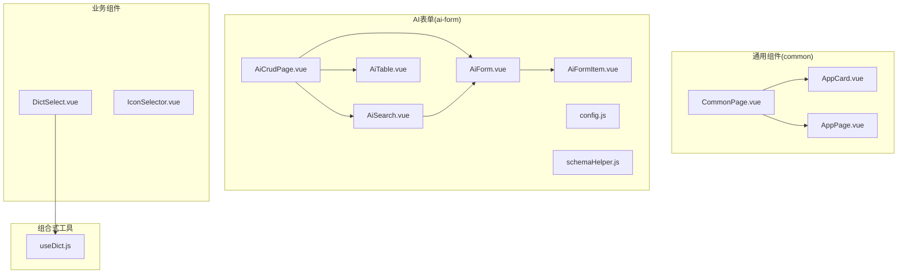
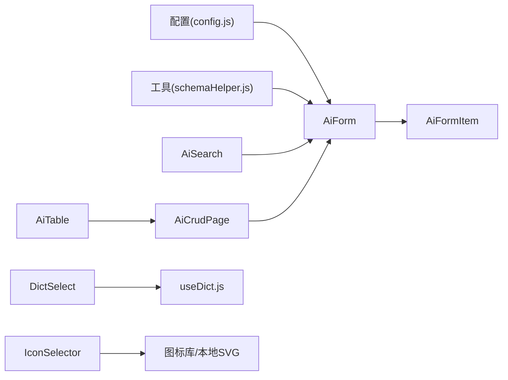
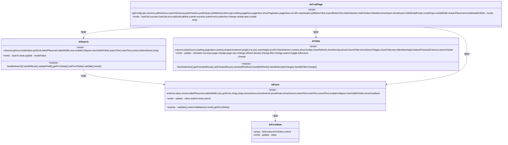
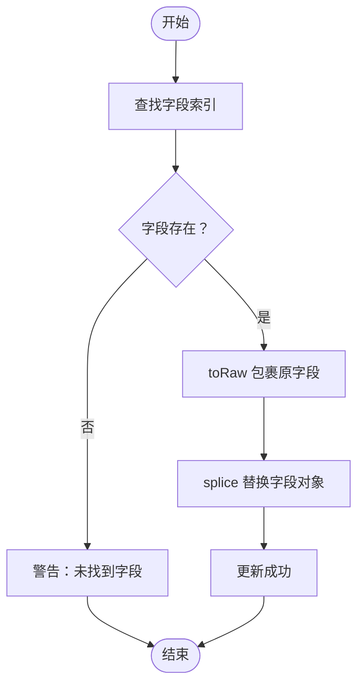
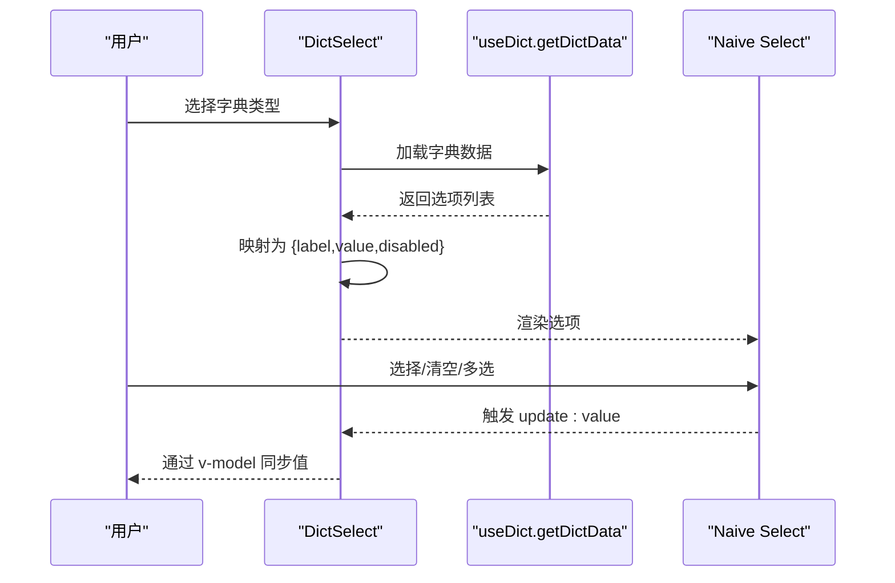
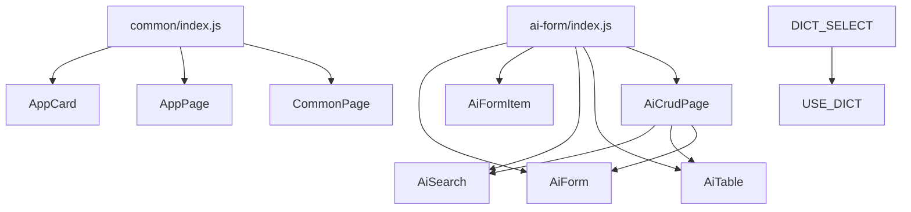

# 组件架构体系

<cite>
**本文档引用的文件**
- [AppCard.vue](file://forge-admin-ui/src/components/common/AppCard.vue)
- [AppPage.vue](file://forge-admin-ui/src/components/common/AppPage.vue)
- [CommonPage.vue](file://forge-admin-ui/src/components/common/CommonPage.vue)
- [AiForm.vue](file://forge-admin-ui/src/components/ai-form/AiForm.vue)
- [AiFormItem.vue](file://forge-admin-ui/src/components/ai-form/AiFormItem.vue)
- [AiSearch.vue](file://forge-admin-ui/src/components/ai-form/AiSearch.vue)
- [AiTable.vue](file://forge-admin-ui/src/components/ai-form/AiTable.vue)
- [AiCrudPage.vue](file://forge-admin-ui/src/components/ai-form/AiCrudPage.vue)
- [DictSelect.vue](file://forge-admin-ui/src/components/DictSelect.vue)
- [IconSelector.vue](file://forge-admin-ui/src/components/IconSelector.vue)
- [config.js](file://forge-admin-ui/src/components/ai-form/config.js)
- [schemaHelper.js](file://forge-admin-ui/src/components/ai-form/schemaHelper.js)
- [index.js（AI表单导出）](file://forge-admin-ui/src/components/ai-form/index.js)
- [index.js（通用组件导出）](file://forge-admin-ui/src/components/common/index.js)
- [useDict.js](file://forge-admin-ui/src/composables/useDict.js)
</cite>

## 目录
1. [引言](#引言)
2. [项目结构](#项目结构)
3. [核心组件](#核心组件)
4. [架构总览](#架构总览)
5. [详细组件分析](#详细组件分析)
6. [依赖关系分析](#依赖关系分析)
7. [性能考虑](#性能考虑)
8. [故障排查指南](#故障排查指南)
9. [结论](#结论)
10. [附录](#附录)

## 引言
本文件系统化梳理 Forge 前端组件架构，重点覆盖通用页面组件与 AI 表单/CRUD 生态，以及字典选择器、图标选择器等业务组件。文档旨在帮助开发者快速理解组件设计理念、使用方法、配置选项与扩展路径，并提供开发规范、复用策略与性能优化建议。

## 项目结构
Forge 前端采用按功能域划分的组织方式，核心位于 forge-admin-ui/src/components 下：
- common：通用页面与布局组件（AppCard、AppPage、CommonPage 等）
- ai-form：AI 表单生态（AiForm、AiFormItem、AiSearch、AiTable、AiCrudPage 等）
- 业务组件：DictSelect、IconSelector 等
- composable：useDict 等可复用逻辑封装

图表来源
- [CommonPage.vue](file://forge-admin-ui/src/components/common/CommonPage.vue#L1-L97)
- [AppCard.vue](file://forge-admin-ui/src/components/common/AppCard.vue#L1-L12)
- [AppPage.vue](file://forge-admin-ui/src/components/common/AppPage.vue#L1-L25)
- [AiCrudPage.vue](file://forge-admin-ui/src/components/ai-form/AiCrudPage.vue#L1-L254)
- [AiForm.vue](file://forge-admin-ui/src/components/ai-form/AiForm.vue#L1-L343)
- [AiSearch.vue](file://forge-admin-ui/src/components/ai-form/AiSearch.vue#L1-L255)
- [AiTable.vue](file://forge-admin-ui/src/components/ai-form/AiTable.vue#L1-L537)
- [DictSelect.vue](file://forge-admin-ui/src/components/DictSelect.vue#L1-L112)
- [IconSelector.vue](file://forge-admin-ui/src/components/IconSelector.vue#L1-L331)
- [useDict.js](file://forge-admin-ui/src/composables/useDict.js#L1-L186)

章节来源
- [index.js（通用组件导出）](file://forge-admin-ui/src/components/common/index.js#L1-L11)
- [index.js（AI表单导出）](file://forge-admin-ui/src/components/ai-form/index.js#L1-L36)

## 核心组件
- 通用页面组件
  - AppCard：卡片容器，支持边框样式切换
  - AppPage：页面主体布局，支持全宽与底部插槽
  - CommonPage：标准页面骨架（头部、内容、底部），支持返回按钮、标题、操作区与底部插槽
- AI 表单生态
  - AiForm：基于 JSON Schema 的动态表单渲染，支持栅格布局、验证规则、折叠/展开、操作按钮
  - AiFormItem：单个字段渲染器，内置丰富控件类型与事件桥接
  - AiSearch：列表页专用搜索表单，封装 AiForm 并提供搜索/重置按钮
  - AiTable：远程数据表格，支持列配置、筛选、排序、分页、工具栏
  - AiCrudPage：完整 CRUD 页面，整合搜索、表格、新增/编辑弹窗/抽屉、导入导出
- 业务组件
  - DictSelect：字典选择器，基于字典类型动态加载选项
  - IconSelector：图标选择器，支持 Ionicons 与本地 SVG 图标，抽屉内搜索与选择

章节来源
- [AppCard.vue](file://forge-admin-ui/src/components/common/AppCard.vue#L1-L12)
- [AppPage.vue](file://forge-admin-ui/src/components/common/AppPage.vue#L1-L25)
- [CommonPage.vue](file://forge-admin-ui/src/components/common/CommonPage.vue#L1-L97)
- [AiForm.vue](file://forge-admin-ui/src/components/ai-form/AiForm.vue#L1-L343)
- [AiFormItem.vue](file://forge-admin-ui/src/components/ai-form/AiFormItem.vue#L1-L704)
- [AiSearch.vue](file://forge-admin-ui/src/components/ai-form/AiSearch.vue#L1-L255)
- [AiTable.vue](file://forge-admin-ui/src/components/ai-form/AiTable.vue#L1-L537)
- [AiCrudPage.vue](file://forge-admin-ui/src/components/ai-form/AiCrudPage.vue#L1-L800)
- [DictSelect.vue](file://forge-admin-ui/src/components/DictSelect.vue#L1-L112)
- [IconSelector.vue](file://forge-admin-ui/src/components/IconSelector.vue#L1-L331)

## 架构总览
AI 表单/CRUD 采用“配置驱动 + 组合式组件”的设计模式：
- 配置层：config.js 定义字段类型与工厂方法；schemaHelper.js 提供运行时 Schema 更新能力
- 渲染层：AiForm/AiFormItem 负责将 JSON Schema 渲染为具体 UI 控件
- 交互层：AiSearch/AiTable/AiCrudPage 提供搜索、表格与 CRUD 流程编排
- 业务层：DictSelect/IconSelector 等业务组件通过统一接口接入

图表来源
- [config.js](file://forge-admin-ui/src/components/ai-form/config.js#L1-L316)
- [schemaHelper.js](file://forge-admin-ui/src/components/ai-form/schemaHelper.js#L1-L225)
- [AiForm.vue](file://forge-admin-ui/src/components/ai-form/AiForm.vue#L1-L343)
- [AiFormItem.vue](file://forge-admin-ui/src/components/ai-form/AiFormItem.vue#L1-L704)
- [AiSearch.vue](file://forge-admin-ui/src/components/ai-form/AiSearch.vue#L1-L255)
- [AiTable.vue](file://forge-admin-ui/src/components/ai-form/AiTable.vue#L1-L537)
- [AiCrudPage.vue](file://forge-admin-ui/src/components/ai-form/AiCrudPage.vue#L1-L800)
- [DictSelect.vue](file://forge-admin-ui/src/components/DictSelect.vue#L1-L112)
- [IconSelector.vue](file://forge-admin-ui/src/components/IconSelector.vue#L1-L331)
- [useDict.js](file://forge-admin-ui/src/composables/useDict.js#L1-L186)

## 详细组件分析

### 通用页面组件
- AppCard
  - 设计要点：轻量卡片容器，支持 bordered 属性切换边框样式
  - 使用建议：用于 CommonPage 的头部/内容/底部区域包裹，统一背景与边框
- AppPage
  - 设计要点：页面主体容器，支持 full 与 showFooter 控制布局与底部显示
  - 使用建议：作为页面根容器，承载 CommonPage 与业务页面
- CommonPage
  - 设计要点：标准页面骨架，支持插槽化头部、标题、操作区与底部
  - 特性：返回按钮、标题装饰条、可选头部与底部显示
  - 使用建议：在路由视图中作为通用页面容器，减少重复布局代码

章节来源
- [AppCard.vue](file://forge-admin-ui/src/components/common/AppCard.vue#L1-L12)
- [AppPage.vue](file://forge-admin-ui/src/components/common/AppPage.vue#L1-L25)
- [CommonPage.vue](file://forge-admin-ui/src/components/common/CommonPage.vue#L1-L97)

### AI 表单组件
- AiForm
  - 设计要点：JSON Schema 驱动，支持栅格布局、验证规则、折叠/展开、操作按钮
  - 关键能力：vIf 条件渲染、divider 去尾处理、formActionSpan 计算、字段变更事件透传
  - 配置项：schema、value、context、labelPlacement/Width、size、gridCols/xGap/yGap、showActions/Submit/Reset/Cancel、enableCollapse/maxVisibleFields、showFeedback
  - 暴露方法：validate、restoreValidation、reset、getFormData
- AiFormItem
  - 设计要点：统一字段渲染器，内置 input、textarea、number、select、radio、checkbox、switch、date/datetime/daterange/month/year/time、upload、fileUpload、imageUpload、slider、rate、color、cascader、treeSelect、transfer、customSelect、text、slot 等类型
  - 关键能力：占位符生成、禁用状态处理、选项数据响应式加载、事件桥接、复制文本、上传回调
- AiSearch
  - 设计要点：列表页专用搜索表单，封装 AiForm，提供搜索/重置按钮与 extra-actions 插槽
  - 配置项：schema/options、modelValue、gridCols、labelPlacement/Width、size、enableCollapse、maxVisibleFields、searchText/resetText、context、beforeReset、yGap
  - 暴露方法：handleSearch、handleReset、updateField、getFormData/setFormData、validate/reset
- AiTable
  - 设计要点：远程数据表格，支持列配置、筛选、排序、分页、工具栏
  - 配置项：columns、dataSource、loading、pagination、rowKey、striped/bordered/singleLine、size、maxHeight、scrollX、hideSelection、context、工具栏开关与默认列
  - 暴露方法：clearSelection、getCheckedRows、setCheckedKeys、checkedRowKeys、handleRefresh/handleDensityChange/handleFilterChange
- AiCrudPage
  - 设计要点：完整 CRUD 页面，整合搜索、表格、新增/编辑弹窗/抽屉、导入导出
  - 关键流程：钩子函数（beforeLoadList/beforeRenderList/beforeSearch/beforeRenderForm/beforeRenderDetail）、API 解析（支持 postEncrypt）、分页与列表加载、新增/编辑初始化、确认/取消、导入模板下载
  - 事件：load-list-success/load-list-error/add/edit/delete/submit-success/submit-error/selection-change/modal-open/modal-close

图表来源
- [AiForm.vue](file://forge-admin-ui/src/components/ai-form/AiForm.vue#L85-L342)
- [AiFormItem.vue](file://forge-admin-ui/src/components/ai-form/AiFormItem.vue#L495-L704)
- [AiSearch.vue](file://forge-admin-ui/src/components/ai-form/AiSearch.vue#L65-L247)
- [AiTable.vue](file://forge-admin-ui/src/components/ai-form/AiTable.vue#L65-L454)
- [AiCrudPage.vue](file://forge-admin-ui/src/components/ai-form/AiCrudPage.vue#L256-L799)

章节来源
- [AiForm.vue](file://forge-admin-ui/src/components/ai-form/AiForm.vue#L1-L343)
- [AiFormItem.vue](file://forge-admin-ui/src/components/ai-form/AiFormItem.vue#L1-L704)
- [AiSearch.vue](file://forge-admin-ui/src/components/ai-form/AiSearch.vue#L1-L255)
- [AiTable.vue](file://forge-admin-ui/src/components/ai-form/AiTable.vue#L1-L537)
- [AiCrudPage.vue](file://forge-admin-ui/src/components/ai-form/AiCrudPage.vue#L1-L800)

### AI 表单配置与 Schema 工具
- config.js
  - FIELD_TYPES：定义所有受支持的字段类型常量
  - createField：统一字段默认值（showLabel/showFeedback/clearable 等）
  - FieldFactory：快速创建常用字段（input、textarea、select、radio、checkbox、date、switch、number、radioButton、dateRange、dateTime、time、slider、rate、color、cascader、treeSelect、transfer、upload、slot、text、customSelect）
- schemaHelper.js
  - updateFieldOptions：更新指定字段的选项数据（splice 触发响应式）
  - batchUpdateFieldOptions：批量更新多个字段的选项
  - updateFieldConfig：更新字段配置项
  - getFieldConfig：获取字段配置
  - setFieldLoading：设置字段加载状态
  - createAsyncOptionsUpdater：创建异步选项更新函数
  - createCascadeUpdater：创建级联更新函数（父字段值变化联动子字段选项）

图表来源
- [schemaHelper.js](file://forge-admin-ui/src/components/ai-form/schemaHelper.js#L20-L36)

章节来源
- [config.js](file://forge-admin-ui/src/components/ai-form/config.js#L1-L316)
- [schemaHelper.js](file://forge-admin-ui/src/components/ai-form/schemaHelper.js#L1-L225)

### 业务组件
- DictSelect
  - 功能特性：基于字典类型动态加载选项，支持多选、过滤、清空、禁用、加载状态
  - 数据流：watch dictType -> getDictData -> dictOptions 映射 -> n-select
  - 使用建议：在 AiForm/AiSearch 中作为 select 类型字段使用
- IconSelector
  - 功能特性：抽屉内选择图标，支持 Ionicons 与本地 SVG 图标，搜索过滤，标签页切换，前缀规范化（ionicons5:/local:）
  - 使用建议：作为表单中图标字段的选择器，返回标准化图标标识

图表来源
- [DictSelect.vue](file://forge-admin-ui/src/components/DictSelect.vue#L87-L111)
- [useDict.js](file://forge-admin-ui/src/composables/useDict.js#L26-L74)

章节来源
- [DictSelect.vue](file://forge-admin-ui/src/components/DictSelect.vue#L1-L112)
- [IconSelector.vue](file://forge-admin-ui/src/components/IconSelector.vue#L1-L331)
- [useDict.js](file://forge-admin-ui/src/composables/useDict.js#L1-L186)

## 依赖关系分析
- 组件导出入口
  - ai-form/index.js：统一导出 AiForm、AiFormItem、AiSearch、AiTable、AiCustomSelect、AiCrudPage、AiTableFilter、AiToolbarAction，并导出配置与工具
  - common/index.js：统一导出通用组件
- 组件间耦合
  - AiCrudPage 依赖 AiSearch、AiTable、AiForm
  - AiSearch 依赖 AiForm
  - DictSelect 依赖 useDict
  - IconSelector 依赖本地图标资源与 Ionicons
- 外部依赖
  - Naive UI 组件库（n-form、n-grid、n-gi、n-button、n-modal、n-drawer、n-upload、n-data-table 等）
  - Vue 3 组合式 API（ref、computed、watch、defineProps/defineEmits/defineExpose）

图表来源
- [index.js（AI表单导出）](file://forge-admin-ui/src/components/ai-form/index.js#L1-L36)
- [index.js（通用组件导出）](file://forge-admin-ui/src/components/common/index.js#L1-L11)

章节来源
- [index.js（AI表单导出）](file://forge-admin-ui/src/components/ai-form/index.js#L1-L36)
- [index.js（通用组件导出）](file://forge-admin-ui/src/components/common/index.js#L1-L11)

## 性能考虑
- 响应式与渲染优化
  - AiForm/AiFormItem：通过 computed 与 v-if/v-else 渲染分支，避免不必要的组件实例化
  - AiCrudPage：分页与远程加载，结合 beforeLoadList 钩子进行参数预处理，减少无效请求
- 数据加载与缓存
  - useDict：全局 Map 缓存字典数据，支持 forceReload 与 clearDictCache
  - schemaHelper：createAsyncOptionsUpdater/createCascadeUpdater 在异步加载期间设置 loading，避免重复请求
- DOM 与滚动
  - AiTable：scrollX 自动计算列宽总和，maxHeight 默认使用 calc 以适配页面布局
  - AppPage：提供 full 模式与底部插槽，减少布局重排
- 事件与回调
  - AiForm/AiFormItem：字段 onChange 与组件事件桥接，避免深层嵌套导致的性能问题
  - AiCrudPage：钩子函数支持 Promise，确保异步流程可控

[本节为通用指导，无需特定文件引用]

## 故障排查指南
- 表单验证失败
  - 现象：handleSubmit 抛错或控制台输出验证失败
  - 排查：检查 schema.rules 或 required 配置；确认 formRef.validate 调用时机
  - 参考：AiForm.handleSubmit、AiForm.formRules
- 字典未显示或禁用
  - 现象：DictSelect 无选项或状态为 0 的项被禁用
  - 排查：确认 dictType 正确；检查 getDictData 返回数据结构；查看 dictOptions 映射
  - 参考：DictSelect.dictOptions、useDict.getDictData
- 图标选择异常
  - 现象：IconSelector 无法显示或选择后无值
  - 排查：确认 activeTab 与前缀（ionicons5:/local:）；检查 filtered* 计算属性与 selectIcon 逻辑
  - 参考：IconSelector.selectIcon、IconSelector.filteredIonicons/filteredLocalIcons
- CRUD 列表加载失败
  - 现象：控制台报错“未配置 API 地址”或加载失败
  - 排查：确认 api/apiConfig.list；检查 beforeLoadList 钩子返回值；核对 listMethod/isEncrypt 与 postEncrypt 使用
  - 参考：AiCrudPage.loadList、AiCrudPage.parseApiConfig

章节来源
- [AiForm.vue](file://forge-admin-ui/src/components/ai-form/AiForm.vue#L304-L311)
- [DictSelect.vue](file://forge-admin-ui/src/components/DictSelect.vue#L87-L111)
- [IconSelector.vue](file://forge-admin-ui/src/components/IconSelector.vue#L172-L202)
- [AiCrudPage.vue](file://forge-admin-ui/src/components/ai-form/AiCrudPage.vue#L543-L642)

## 结论
Forge 前端组件架构以“配置驱动 + 组合式组件”为核心，通过 AiForm/AiFormItem 实现表单的高可配置性，借助 AiSearch/AiTable/AiCrudPage 构建完整的 CRUD 生态，配合 DictSelect/IconSelector 等业务组件提升开发效率。建议在实际项目中遵循统一的命名与属性传递规范，善用 schemaHelper 的运行时更新能力，结合 useDict 的缓存机制与 AiCrudPage 的钩子体系，实现高性能、易维护的前端界面。

[本节为总结，无需特定文件引用]

## 附录

### 组件开发规范与命名约定
- 组件命名
  - 通用组件：AppCard、AppPage、CommonPage
  - AI 表单组件：AiForm、AiFormItem、AiSearch、AiTable、AiCrudPage、AiCustomSelect、AiTableFilter、AiToolbarAction
  - 业务组件：DictSelect、IconSelector
- 属性传递
  - v-model：统一使用 value 或 modelValue，保持与 Naive UI 一致
  - 透传：通过 v-bind="$attrs" 透传原生属性与事件
  - 插槽：优先使用具名插槽（如 formAction、extra-actions、toolbar-left 等），保证扩展性
- 配置与工厂
  - 使用 FieldFactory 快速创建常用字段，统一默认行为
  - 通过 schemaHelper 动态更新字段选项与配置，避免硬编码

[本节为通用指导，无需特定文件引用]

### 配置选项速查（关键组件）
- AiForm
  - 关键 props：schema、value、context、labelPlacement/Width、size、gridCols/xGap/yGap、showActions/Submit/Reset/Cancel、enableCollapse/maxVisibleFields、showFeedback
  - 关键 emits：update:value、submit、reset、cancel
  - 关键暴露：validate、restoreValidation、reset、getFormData
- AiSearch
  - 关键 props：schema/options、modelValue、gridCols、labelPlacement/Width、size、enableCollapse/maxVisibleFields、searchText/resetText、context、beforeReset、yGap
  - 关键暴露：handleSearch、handleReset、updateField、getFormData/setFormData、validate/reset
- AiTable
  - 关键 props：columns、dataSource、loading、pagination、rowKey、striped/bordered/singleLine、size、maxHeight、scrollX、hideSelection、context、工具栏开关与默认列
  - 关键暴露：clearSelection、getCheckedRows、setCheckedKeys、checkedRowKeys、handleRefresh/handleDensityChange/handleFilterChange
- DictSelect
  - 关键 props：value、dictType、placeholder、disabled、clearable、filterable、multiple
  - 关键暴露：update:value
- IconSelector
  - 关键 props：modelValue、disabled
  - 关键暴露：update:modelValue

章节来源
- [AiForm.vue](file://forge-admin-ui/src/components/ai-form/AiForm.vue#L90-L178)
- [AiSearch.vue](file://forge-admin-ui/src/components/ai-form/AiSearch.vue#L70-L140)
- [AiTable.vue](file://forge-admin-ui/src/components/ai-form/AiTable.vue#L72-L228)
- [DictSelect.vue](file://forge-admin-ui/src/components/DictSelect.vue#L29-L71)
- [IconSelector.vue](file://forge-admin-ui/src/components/IconSelector.vue#L91-L100)