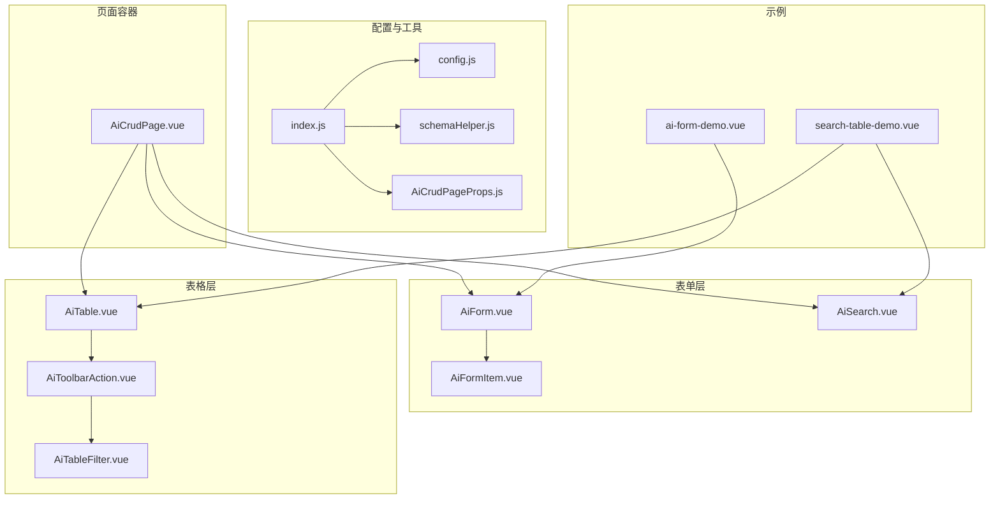
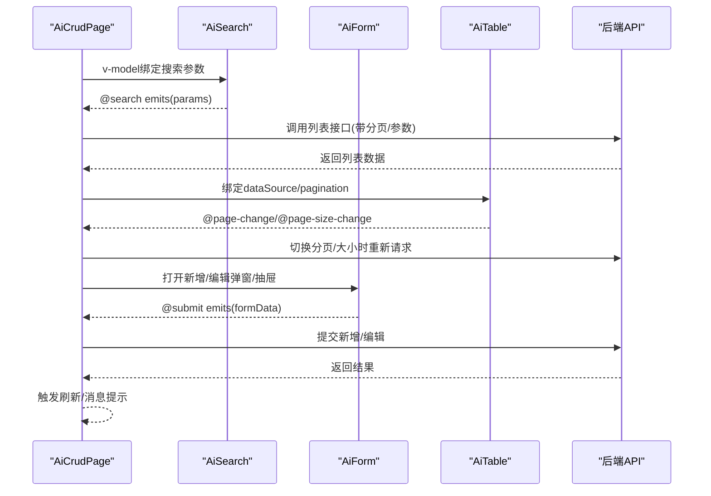
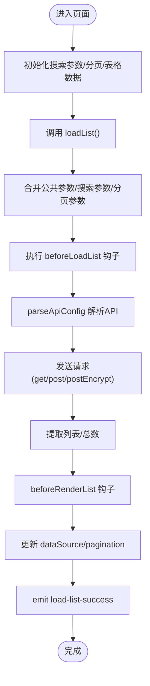
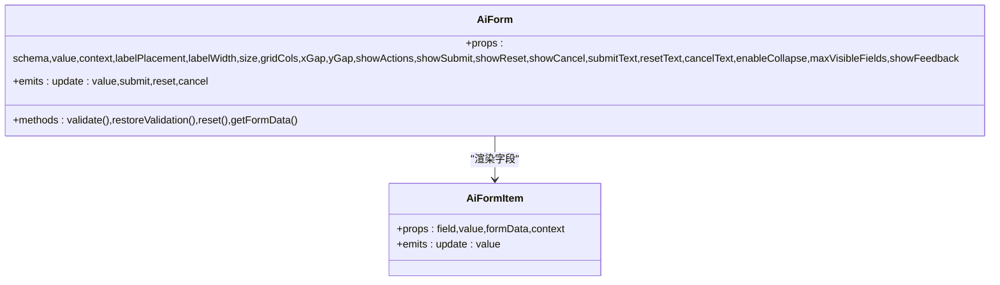
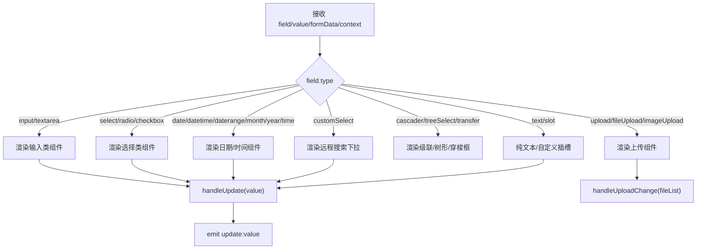
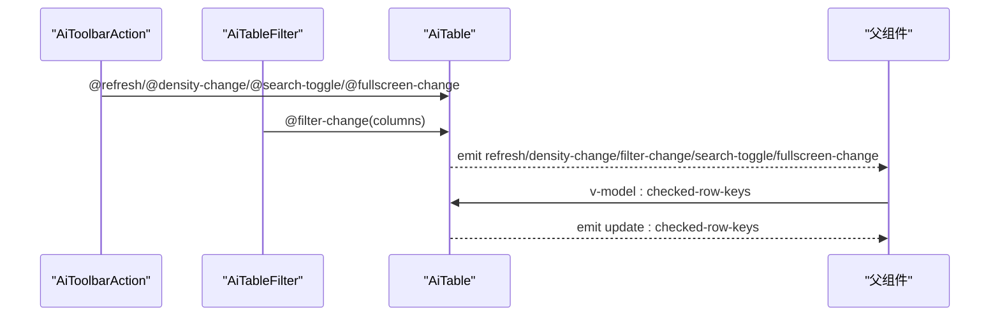
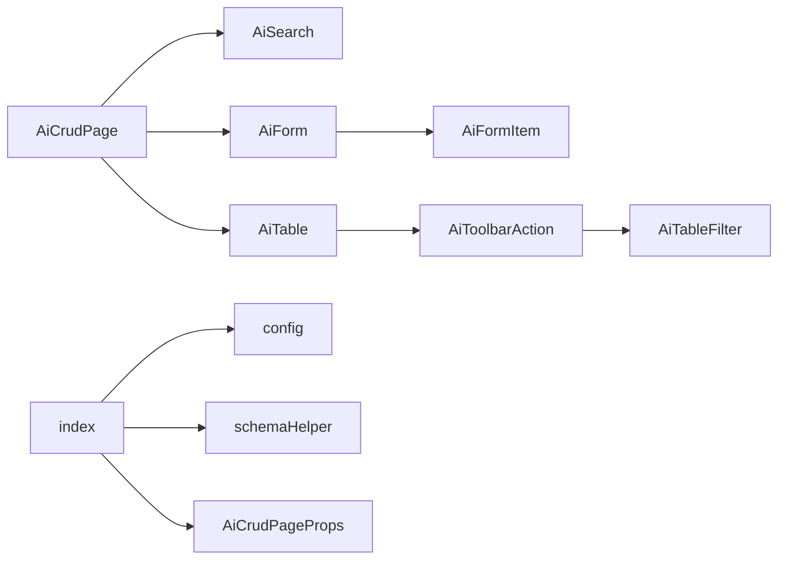

# 表单组件

<cite>
**本文引用的文件**
- [AiCrudPage.vue](file://forge-admin-ui/src/components/ai-form/AiCrudPage.vue)
- [AiForm.vue](file://forge-admin-ui/src/components/ai-form/AiForm.vue)
- [AiFormItem.vue](file://forge-admin-ui/src/components/ai-form/AiFormItem.vue)
- [AiSearch.vue](file://forge-admin-ui/src/components/ai-form/AiSearch.vue)
- [AiTable.vue](file://forge-admin-ui/src/components/ai-form/AiTable.vue)
- [AiTableFilter.vue](file://forge-admin-ui/src/components/ai-form/AiTableFilter.vue)
- [AiToolbarAction.vue](file://forge-admin-ui/src/components/ai-form/AiToolbarAction.vue)
- [AiCrudPageProps.js](file://forge-admin-ui/src/components/ai-form/AiCrudPageProps.js)
- [config.js](file://forge-admin-ui/src/components/ai-form/config.js)
- [schemaHelper.js](file://forge-admin-ui/src/components/ai-form/schemaHelper.js)
- [index.js](file://forge-admin-ui/src/components/ai-form/index.js)
- [ai-form-demo.vue](file://forge-admin-ui/src/views/demo/ai-form-demo.vue)
- [search-table-demo.vue](file://forge-admin-ui/src/views/demo/search-table-demo.vue)
</cite>

## 目录
1. [引言](#引言)
2. [项目结构](#项目结构)
3. [核心组件](#核心组件)
4. [架构总览](#架构总览)
5. [详细组件分析](#详细组件分析)
6. [依赖关系分析](#依赖关系分析)
7. [性能考量](#性能考量)
8. [故障排查指南](#故障排查指南)
9. [结论](#结论)
10. [附录](#附录)

## 引言
本技术文档系统性解析Forge Admin UI中的AI表单组件体系，重点覆盖以下目标：
- 深入剖析AiCrudPage增删改查页面的整体架构、路由集成与数据绑定机制
- 详解AiForm表单组件的字段配置、验证规则与提交处理流程
- 阐述AiFormItem表单项的渲染逻辑、样式定制与事件处理
- 介绍AiSearch搜索组件的查询条件构建、参数传递与结果展示
- 说明AiTable表格组件的数据渲染、分页处理与排序功能
- 解析AiTableFilter表格过滤器的筛选条件管理与动态配置
- 介绍AiToolbarAction工具栏动作按钮的权限控制与交互设计
- 提供组件间协作模式、数据流向与状态同步方案
- 包含完整的使用示例与扩展开发指南

## 项目结构
AI表单组件位于forge-admin-ui/src/components/ai-form目录，采用“按功能域”组织方式，核心文件如下：
- 页面容器：AiCrudPage.vue
- 表单层：AiForm.vue、AiFormItem.vue、AiSearch.vue
- 表格层：AiTable.vue、AiTableFilter.vue、AiToolbarAction.vue
- 配置与工具：config.js、schemaHelper.js、AiCrudPageProps.js、index.js
- 示例：ai-form-demo.vue、search-table-demo.vue

图表来源
- [AiCrudPage.vue](file://forge-admin-ui/src/components/ai-form/AiCrudPage.vue#L1-L254)
- [AiForm.vue](file://forge-admin-ui/src/components/ai-form/AiForm.vue#L1-L343)
- [AiFormItem.vue](file://forge-admin-ui/src/components/ai-form/AiFormItem.vue#L1-L704)
- [AiSearch.vue](file://forge-admin-ui/src/components/ai-form/AiSearch.vue#L1-L255)
- [AiTable.vue](file://forge-admin-ui/src/components/ai-form/AiTable.vue#L1-L537)
- [AiTableFilter.vue](file://forge-admin-ui/src/components/ai-form/AiTableFilter.vue#L1-L406)
- [AiToolbarAction.vue](file://forge-admin-ui/src/components/ai-form/AiToolbarAction.vue#L1-L279)
- [config.js](file://forge-admin-ui/src/components/ai-form/config.js#L1-L316)
- [schemaHelper.js](file://forge-admin-ui/src/components/ai-form/schemaHelper.js#L1-L225)
- [AiCrudPageProps.js](file://forge-admin-ui/src/components/ai-form/AiCrudPageProps.js#L1-L565)
- [index.js](file://forge-admin-ui/src/components/ai-form/index.js#L1-L36)
- [ai-form-demo.vue](file://forge-admin-ui/src/views/demo/ai-form-demo.vue#L1-L462)
- [search-table-demo.vue](file://forge-admin-ui/src/views/demo/search-table-demo.vue#L1-L373)

章节来源
- [index.js](file://forge-admin-ui/src/components/ai-form/index.js#L1-L36)

## 核心组件
- AiCrudPage：统一的CRUD页面容器，集成搜索、表格、表单弹窗/抽屉、导入导出等能力，负责API调用、分页、选中态与事件发射。
- AiForm：基于JSON Schema动态渲染表单，内置栅格布局、折叠、验证规则生成、字段联动与事件回调。
- AiFormItem：单个表单项渲染器，支持多种Naive UI组件类型、禁用控制、远程选项、事件透传与复制文本。
- AiSearch：专用搜索表单，封装AiForm，提供搜索/重置按钮与钩子扩展。
- AiTable：表格组件，支持列配置、排序、筛选、插槽渲染、分页、工具栏与多选。
- AiTableFilter：列筛选器，支持勾选、重置、拖拽排序与可见列顺序控制。
- AiToolbarAction：表格工具栏动作集合，提供刷新、密度、列设置、搜索显隐、全屏等。
- 配置与工具：config.js提供字段类型常量与工厂方法；schemaHelper.js提供动态更新Schema的能力；AiCrudPageProps.js定义AiCrudPage的完整Props。

章节来源
- [AiCrudPage.vue](file://forge-admin-ui/src/components/ai-form/AiCrudPage.vue#L1-L254)
- [AiForm.vue](file://forge-admin-ui/src/components/ai-form/AiForm.vue#L1-L343)
- [AiFormItem.vue](file://forge-admin-ui/src/components/ai-form/AiFormItem.vue#L1-L704)
- [AiSearch.vue](file://forge-admin-ui/src/components/ai-form/AiSearch.vue#L1-L255)
- [AiTable.vue](file://forge-admin-ui/src/components/ai-form/AiTable.vue#L1-L537)
- [AiTableFilter.vue](file://forge-admin-ui/src/components/ai-form/AiTableFilter.vue#L1-L406)
- [AiToolbarAction.vue](file://forge-admin-ui/src/components/ai-form/AiToolbarAction.vue#L1-L279)
- [config.js](file://forge-admin-ui/src/components/ai-form/config.js#L1-L316)
- [schemaHelper.js](file://forge-admin-ui/src/components/ai-form/schemaHelper.js#L1-L225)
- [AiCrudPageProps.js](file://forge-admin-ui/src/components/ai-form/AiCrudPageProps.js#L1-L565)

## 架构总览
AI表单组件体系采用“容器-表单-表格-工具”的分层架构：
- 容器层：AiCrudPage负责页面生命周期、API调用、状态管理与事件发射
- 表单层：AiForm/AiFormItem负责字段渲染、验证与联动
- 表格层：AiTable/AiTableFilter/AiToolbarAction负责数据展示、筛选与工具
- 配置层：config.js/schemaHelper.js提供字段工厂与Schema动态更新能力
- 示例层：ai-form-demo.vue/search-table-demo.vue演示典型用法

图表来源
- [AiCrudPage.vue](file://forge-admin-ui/src/components/ai-form/AiCrudPage.vue#L543-L642)
- [AiSearch.vue](file://forge-admin-ui/src/components/ai-form/AiSearch.vue#L155-L174)
- [AiTable.vue](file://forge-admin-ui/src/components/ai-form/AiTable.vue#L394-L409)
- [AiForm.vue](file://forge-admin-ui/src/components/ai-form/AiForm.vue#L304-L311)

## 详细组件分析

### AiCrudPage：增删改查页面容器
- 功能职责
  - 集成搜索、表格、表单弹窗/抽屉、导入导出
  - 统一API配置与请求封装（支持GET/POST/加密请求）
  - 分页与排序、选中态管理、钩子扩展（beforeLoadList/beforeSearch/beforeSubmit等）
  - 事件发射：列表加载成功/失败、新增/编辑/删除、提交成功/失败、选中项变化、弹窗开关
- 关键特性
  - 动态列：若未定义操作列，自动注入默认操作列（编辑/删除）
  - 行键：支持字符串或函数，确保表格唯一标识
  - 横向滚动与最大高度：自动计算或按需传入
  - 表单上下文：向表单传递modalStatus/currentRow等上下文
- 数据流
  - 搜索参数 -> beforeSearch钩子 -> 构建请求参数 -> parseApiConfig -> request/postEncrypt -> beforeRenderList -> 更新dataSource/pagination
  - 新增/编辑 -> beforeRenderForm -> 初始化表单数据 -> 提交 -> beforeSubmit -> API -> 成功/失败回调
- 事件流
  - @load-list-success/@load-list-error：列表加载结果
  - @add/@edit/@delete/@submit-success/@submit-error：业务事件
  - @selection-change：选中项变化
  - @modal-open/@modal-close：弹窗状态

图表来源
- [AiCrudPage.vue](file://forge-admin-ui/src/components/ai-form/AiCrudPage.vue#L543-L642)

章节来源
- [AiCrudPage.vue](file://forge-admin-ui/src/components/ai-form/AiCrudPage.vue#L1-L254)
- [AiCrudPageProps.js](file://forge-admin-ui/src/components/ai-form/AiCrudPageProps.js#L1-L565)

### AiForm：动态表单渲染器
- 字段配置
  - schema：字段数组，每项包含field/label/type/placeholder/defaultValue/required/rules/span等
  - vIf：条件渲染，支持布尔或函数
  - showFeedback：是否显示验证反馈
  - enableCollapse/maxVisibleFields：折叠与最大显示字段数
- 验证规则
  - 自定义rules优先；未提供时根据required生成默认规则
  - 支持字段级onChange回调
- 事件与插槽
  - @submit/@reset/@cancel：表单事件
  - formAction插槽：自定义操作按钮
  - 透传所有插槽至AiFormItem
- 方法暴露
  - validate/restoreValidation/reset/getFormData：供父组件调用

图表来源
- [AiForm.vue](file://forge-admin-ui/src/components/ai-form/AiForm.vue#L90-L178)
- [AiFormItem.vue](file://forge-admin-ui/src/components/ai-form/AiFormItem.vue#L495-L512)

章节来源
- [AiForm.vue](file://forge-admin-ui/src/components/ai-form/AiForm.vue#L1-L343)

### AiFormItem：表单项渲染器
- 渲染逻辑
  - 根据field.type渲染对应Naive UI组件（input/textarea/select/radio/checkbox/date/time/switch/slider/rate/color/upload/cascader/treeSelect/transfer/customSelect/text/slot等）
  - 支持divider分割线、禁用控制、占位符、计数、多选、远程搜索等
- 事件处理
  - handleUpdate：向上游发射update:value
  - getComponentEvents：透传组件事件到字段配置的on回调
  - 文件上传：handleUploadChange/onSuccess/onError/onRemove
- 文本展示与复制
  - text类型支持formatter与copy按钮

图表来源
- [AiFormItem.vue](file://forge-admin-ui/src/components/ai-form/AiFormItem.vue#L24-L482)

章节来源
- [AiFormItem.vue](file://forge-admin-ui/src/components/ai-form/AiFormItem.vue#L1-L704)

### AiSearch：搜索表单
- 组件特性
  - 基于AiForm，禁用默认提交/重置按钮，提供搜索/重置按钮与extra-actions插槽
  - 支持beforeReset钩子、防重复点击、自动校验
  - 暴露handleSearch/handleReset/updateField/getFormData/setFormData/validate/reset等方法
- 参数传递
  - v-model绑定搜索参数，@search/@reset事件向上抛出
  - 与AiCrudPage配合实现“搜索即刷新”

章节来源
- [AiSearch.vue](file://forge-admin-ui/src/components/ai-form/AiSearch.vue#L1-L255)

### AiTable：表格组件
- 列配置
  - columns：prop/label/width/minWidth/maxWidth/align/fixed/ellipsis/sorter/filter/filterMultiple/filterOptions/render/formatter/slot/_slot等
  - 支持自定义render与formatter，插槽渲染
- 工具栏
  - showToolbar/showRefresh/showDensity/showColumnFilter/showSearchToggle/showFullscreen
  - AiToolbarAction提供刷新、密度、列设置、搜索显隐、全屏
- 分页与排序
  - pagination支持onChange/onUpdatePageSize
  - sorter支持数字与字符串本地排序
- 多选与选中态
  - v-model:checked-row-keys双向绑定
  - 暴露clearSelection/getCheckedRows/setCheckedKeys

图表来源
- [AiToolbarAction.vue](file://forge-admin-ui/src/components/ai-form/AiToolbarAction.vue#L188-L194)
- [AiTableFilter.vue](file://forge-admin-ui/src/components/ai-form/AiTableFilter.vue#L112-L112)
- [AiTable.vue](file://forge-admin-ui/src/components/ai-form/AiTable.vue#L230-L239)

章节来源
- [AiTable.vue](file://forge-admin-ui/src/components/ai-form/AiTable.vue#L1-L537)
- [AiToolbarAction.vue](file://forge-admin-ui/src/components/ai-form/AiToolbarAction.vue#L1-L279)
- [AiTableFilter.vue](file://forge-admin-ui/src/components/ai-form/AiTableFilter.vue#L1-L406)

### AiTableFilter：列筛选器
- 功能
  - 勾选可见列、重置默认列、拖拽排序列顺序
  - 排除操作列与选择列，支持默认checked与排序
- 事件
  - filter-change：返回最终列顺序（选择列->可见列->操作列）
  - column-order-change：列顺序变更
  - update:checked-columns：选中列变更

章节来源
- [AiTableFilter.vue](file://forge-admin-ui/src/components/ai-form/AiTableFilter.vue#L1-L406)

### AiToolbarAction：工具栏动作
- 功能
  - 刷新、密度调整、列设置、搜索显隐、全屏
  - 密度选项：紧凑/默认/宽松
- 事件
  - refresh/density-change/filter-change/search-toggle/fullscreen-change

章节来源
- [AiToolbarAction.vue](file://forge-admin-ui/src/components/ai-form/AiToolbarAction.vue#L1-L279)

### 配置与工具：config.js 与 schemaHelper.js
- config.js
  - FIELD_TYPES：字段类型常量
  - createField：字段配置工厂，提供默认值
  - FieldFactory：快速创建常用字段（input/select/number/date/switch/textarea/...）
- schemaHelper.js
  - updateFieldOptions/batchUpdateFieldOptions：动态更新字段选项
  - updateFieldConfig：更新字段配置
  - getFieldConfig：获取字段配置
  - setFieldLoading：设置字段加载状态
  - createAsyncOptionsUpdater：异步选项更新器
  - createCascadeUpdater：级联更新器（父子字段联动）

章节来源
- [config.js](file://forge-admin-ui/src/components/ai-form/config.js#L1-L316)
- [schemaHelper.js](file://forge-admin-ui/src/components/ai-form/schemaHelper.js#L1-L225)

## 依赖关系分析
- 组件内聚与耦合
  - AiCrudPage高内聚：聚合搜索、表格、表单、导入导出，通过props与事件解耦
  - AiForm/AiFormItem低耦合：通过JSON Schema与事件回调实现灵活扩展
  - AiTable/AiToolbarAction/AiTableFilter：工具组件独立，通过props与事件交互
- 外部依赖
  - Naive UI：n-form/n-grid/n-data-table等组件
  - Vue：组合式API、响应式系统、事件系统
- 可能的循环依赖
  - 当前文件结构未发现循环依赖

图表来源
- [index.js](file://forge-admin-ui/src/components/ai-form/index.js#L1-L36)
- [AiCrudPage.vue](file://forge-admin-ui/src/components/ai-form/AiCrudPage.vue#L265-L270)
- [AiForm.vue](file://forge-admin-ui/src/components/ai-form/AiForm.vue#L88-L88)
- [AiFormItem.vue](file://forge-admin-ui/src/components/ai-form/AiFormItem.vue#L488-L490)
- [AiTable.vue](file://forge-admin-ui/src/components/ai-form/AiTable.vue#L68-L68)
- [AiToolbarAction.vue](file://forge-admin-ui/src/components/ai-form/AiToolbarAction.vue#L97-L97)
- [AiTableFilter.vue](file://forge-admin-ui/src/components/ai-form/AiTableFilter.vue#L74-L75)

## 性能考量
- 渲染优化
  - AiFormItem对options使用computed与缓存策略，避免重复渲染
  - AiTable列配置转换在computed中进行，减少重复计算
- 请求优化
  - AiCrudPage支持postEncrypt与GET/POST双模式，合理选择请求方式
  - beforeLoadList钩子可用于参数预处理，减少无效请求
- 交互优化
  - AiSearch防重复点击，提升用户体验
  - AiTable分页与排序在前端处理，建议后端分页以降低数据传输

## 故障排查指南
- 表单验证失败
  - 检查AiForm的rules配置与required字段
  - 使用AiForm暴露的validate方法定位问题字段
- 选项不显示或为空
  - 检查AiFormItem的options函数/数组与异步加载逻辑
  - 使用schemaHelper的setFieldLoading与updateFieldOptions调试
- 表格列不生效
  - 检查AiTableFilter的filter-change事件是否正确返回列顺序
  - 确认列配置中的visible/hidden与filterable设置
- API请求异常
  - 检查AiCrudPage的apiConfig与parseApiConfig
  - 确认beforeLoadList/beforeSubmit钩子返回值
- 弹窗/抽屉无法关闭
  - 检查AiCrudPage的handleModalClose与confirmLoading状态

章节来源
- [AiForm.vue](file://forge-admin-ui/src/components/ai-form/AiForm.vue#L304-L311)
- [AiFormItem.vue](file://forge-admin-ui/src/components/ai-form/AiFormItem.vue#L549-L598)
- [AiTableFilter.vue](file://forge-admin-ui/src/components/ai-form/AiTableFilter.vue#L245-L287)
- [AiCrudPage.vue](file://forge-admin-ui/src/components/ai-form/AiCrudPage.vue#L527-L538)

## 结论
AI表单组件体系通过清晰的分层与完善的配置能力，实现了从页面容器到表单、表格与工具的全链路解决方案。其核心优势在于：
- 配置驱动：以JSON Schema驱动表单/表格渲染，降低模板代码
- 钩子扩展：丰富的钩子满足复杂业务场景
- 组件解耦：各组件职责明确，便于复用与维护
- 工具完备：提供字段工厂与Schema动态更新工具，加速开发

## 附录

### 使用示例与最佳实践
- 基础表单
  - 参考ai-form-demo.vue中的基础/高级/工厂用法
  - 使用FieldFactory快速创建常用字段
- 搜索+表格
  - 参考search-table-demo.vue，演示AiSearch与AiTable的组合
  - 使用v-model:checked-row-keys实现多选
- CRUD页面
  - 在AiCrudPage中配置apiConfig、columns、editSchema等
  - 使用钩子beforeLoadList/beforeSearch/beforeSubmit等扩展行为
- 动态Schema
  - 使用schemaHelper的createAsyncOptionsUpdater/createCascadeUpdater实现远程/级联联动

章节来源
- [ai-form-demo.vue](file://forge-admin-ui/src/views/demo/ai-form-demo.vue#L1-L462)
- [search-table-demo.vue](file://forge-admin-ui/src/views/demo/search-table-demo.vue#L1-L373)