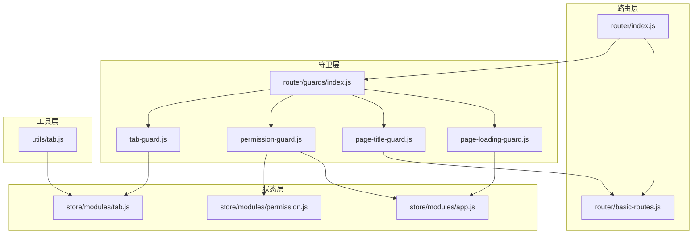
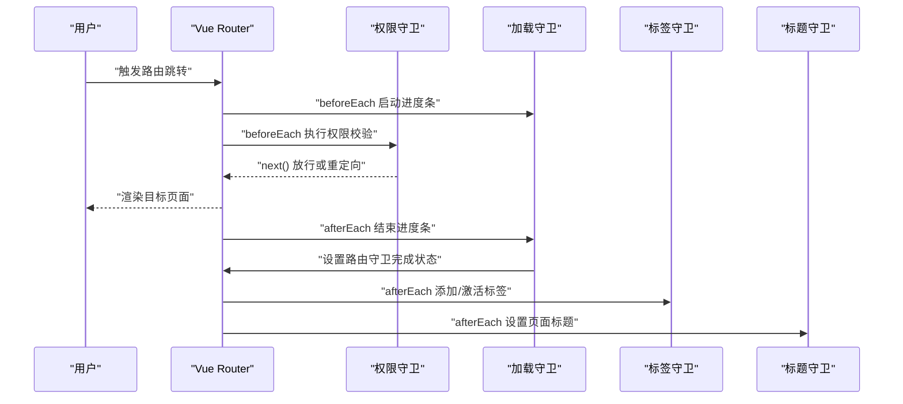
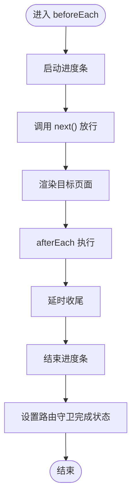
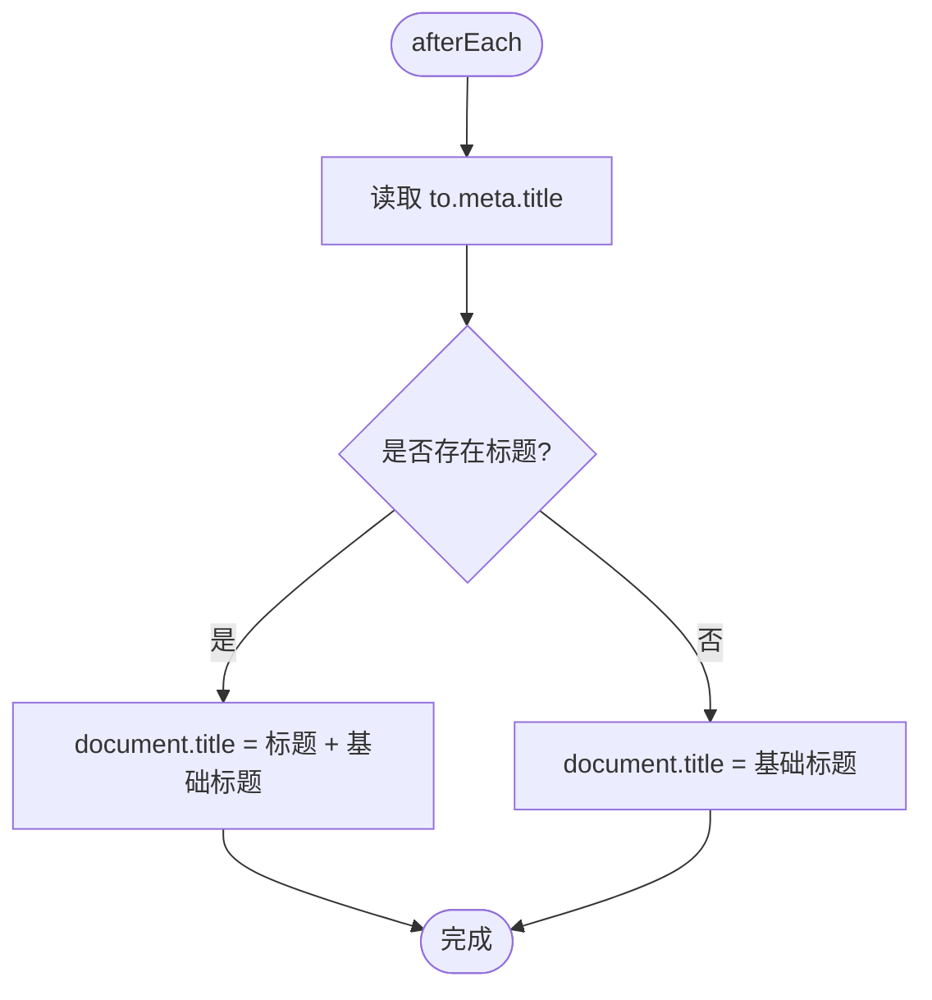
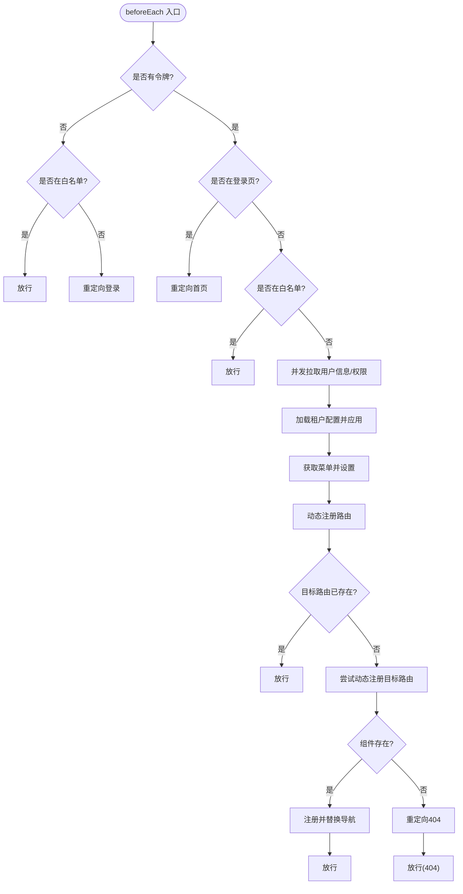
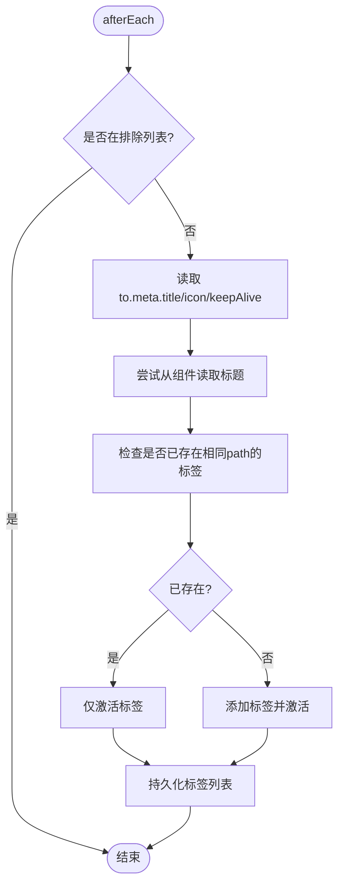
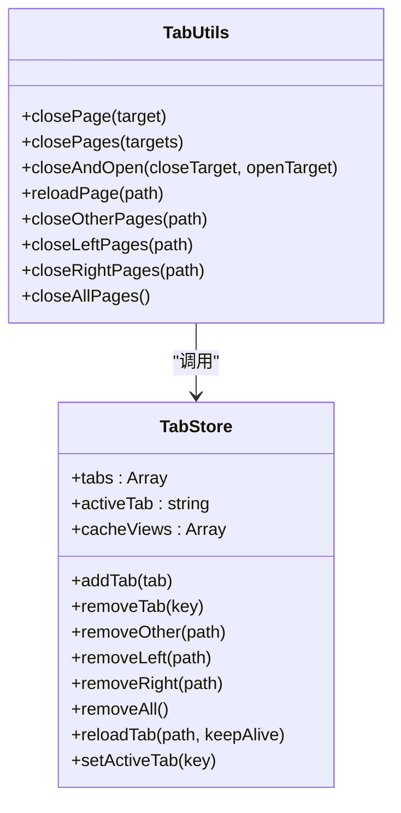
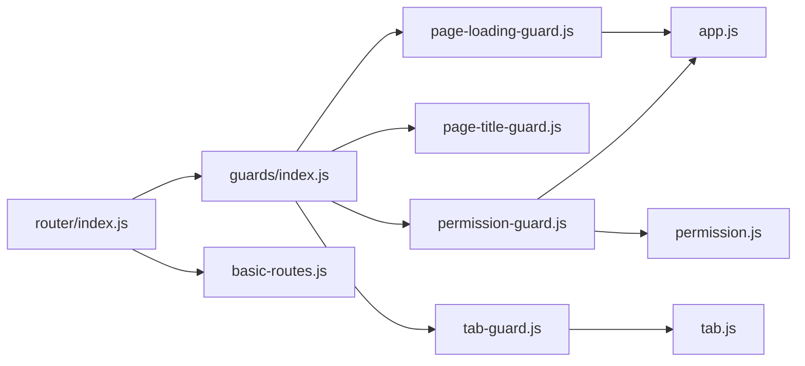

# 导航守卫系统

<cite>
**本文档引用的文件**
- [router/guards/index.js](file://forge-admin-ui/src/router/guards/index.js)
- [router/guards/page-loading-guard.js](file://forge-admin-ui/src/router/guards/page-loading-guard.js)
- [router/guards/page-title-guard.js](file://forge-admin-ui/src/router/guards/page-title-guard.js)
- [router/guards/permission-guard.js](file://forge-admin-ui/src/router/guards/permission-guard.js)
- [router/guards/tab-guard.js](file://forge-admin-ui/src/router/guards/tab-guard.js)
- [router/index.js](file://forge-admin-ui/src/router/index.js)
- [router/basic-routes.js](file://forge-admin-ui/src/router/basic-routes.js)
- [config/whitelist.config.js](file://forge-admin-ui/src/config/whitelist.config.js)
- [store/modules/tab.js](file://forge-admin-ui/src/store/modules/tab.js)
- [store/modules/app.js](file://forge-admin-ui/src/store/modules/app.js)
- [store/modules/permission.js](file://forge-admin-ui/src/store/modules/permission.js)
- [utils/tab.js](file://forge-admin-ui/src/utils/tab.js)
- [main.js](file://forge-admin-ui/src/main.js)
- [layouts/normal/index.vue](file://forge-admin-ui/src/layouts/normal/index.vue)
- [layouts/full/index.vue](file://forge-admin-ui/src/layouts/full/index.vue)
</cite>

## 目录
1. [简介](#简介)
2. [项目结构](#项目结构)
3. [核心组件](#核心组件)
4. [架构总览](#架构总览)
5. [详细组件分析](#详细组件分析)
6. [依赖关系分析](#依赖关系分析)
7. [性能考虑](#性能考虑)
8. [故障排查指南](#故障排查指南)
9. [结论](#结论)
10. [附录](#附录)

## 简介
本文件系统性解析 Forge 前端导航守卫体系，涵盖页面加载守卫、页面标题动态设置、标签页管理机制与权限校验流程。重点阐述导航前守卫、导航后守卫、全局前置守卫的执行顺序与职责边界；解释页面加载状态管理、标题国际化处理、标签页持久化存储；提供导航守卫配置方法、性能监控与用户体验优化策略。

## 项目结构
导航守卫位于前端工程的路由模块中，采用“按功能分层”的组织方式：
- 路由层：定义基础路由与路由实例初始化
- 守卫层：封装页面加载、标题、权限、标签页四类守卫
- 状态层：基于 Pinia 的应用状态与标签页状态管理
- 工具层：标签页操作工具函数

**图表来源**
- [router/index.js](file://forge-admin-ui/src/router/index.js#L1-L18)
- [router/basic-routes.js](file://forge-admin-ui/src/router/basic-routes.js#L1-L86)
- [router/guards/index.js](file://forge-admin-ui/src/router/guards/index.js#L1-L12)
- [router/guards/page-loading-guard.js](file://forge-admin-ui/src/router/guards/page-loading-guard.js#L1-L31)
- [router/guards/page-title-guard.js](file://forge-admin-ui/src/router/guards/page-title-guard.js#L1-L14)
- [router/guards/permission-guard.js](file://forge-admin-ui/src/router/guards/permission-guard.js#L1-L547)
- [router/guards/tab-guard.js](file://forge-admin-ui/src/router/guards/tab-guard.js#L1-L41)
- [store/modules/app.js](file://forge-admin-ui/src/store/modules/app.js#L1-L91)
- [store/modules/tab.js](file://forge-admin-ui/src/store/modules/tab.js#L1-L174)
- [store/modules/permission.js](file://forge-admin-ui/src/store/modules/permission.js#L1-L269)
- [utils/tab.js](file://forge-admin-ui/src/utils/tab.js#L1-L226)

**章节来源**
- [router/index.js](file://forge-admin-ui/src/router/index.js#L1-L18)
- [router/basic-routes.js](file://forge-admin-ui/src/router/basic-routes.js#L1-L86)
- [router/guards/index.js](file://forge-admin-ui/src/router/guards/index.js#L1-L12)

## 核心组件
- 页面加载守卫：负责启动/结束进度条、设置路由守卫完成状态、错误处理
- 页面标题守卫：根据路由元信息动态设置浏览器标题
- 权限守卫：令牌校验、白名单放行、用户信息与菜单权限拉取、动态路由注册、租户配置应用、WebSocket 初始化
- 标签页守卫：导航后自动添加标签、去重、激活、从组件读取标题

**章节来源**
- [router/guards/page-loading-guard.js](file://forge-admin-ui/src/router/guards/page-loading-guard.js#L1-L31)
- [router/guards/page-title-guard.js](file://forge-admin-ui/src/router/guards/page-title-guard.js#L1-L14)
- [router/guards/permission-guard.js](file://forge-admin-ui/src/router/guards/permission-guard.js#L1-L547)
- [router/guards/tab-guard.js](file://forge-admin-ui/src/router/guards/tab-guard.js#L1-L41)

## 架构总览
导航守卫的执行顺序遵循 Vue Router 的生命周期钩子：
- 全局前置守卫（router.beforeEach）：权限校验、白名单放行、动态路由注册
- 导航后守卫（router.afterEach）：页面加载完成、标签页管理、标题设置
- 错误处理（router.onError）：异常时的进度条与守卫完成状态处理

**图表来源**
- [router/guards/page-loading-guard.js](file://forge-admin-ui/src/router/guards/page-loading-guard.js#L4-L30)
- [router/guards/permission-guard.js](file://forge-admin-ui/src/router/guards/permission-guard.js#L84-L546)
- [router/guards/tab-guard.js](file://forge-admin-ui/src/router/guards/tab-guard.js#L5-L40)
- [router/guards/page-title-guard.js](file://forge-admin-ui/src/router/guards/page-title-guard.js#L3-L13)

## 详细组件分析

### 页面加载守卫
- 启动时机：全局前置守卫开始时启动进度条
- 结束时机：导航完成后延时收尾，确保守卫完成状态设置
- 错误处理：异常时标记守卫完成并进入错误态
- 状态同步：通过应用状态 store 标记路由守卫完成，供其他模块感知

**图表来源**
- [router/guards/page-loading-guard.js](file://forge-admin-ui/src/router/guards/page-loading-guard.js#L4-L30)
- [store/modules/app.js](file://forge-admin-ui/src/store/modules/app.js#L74-L77)

**章节来源**
- [router/guards/page-loading-guard.js](file://forge-admin-ui/src/router/guards/page-loading-guard.js#L1-L31)
- [store/modules/app.js](file://forge-admin-ui/src/store/modules/app.js#L1-L91)

### 页面标题守卫
- 读取规则：优先使用路由元信息中的标题，否则回退至基础标题
- 国际化处理：标题来源于路由元信息，可在业务层通过多语言资源填充
- 基础标题：来自环境变量，统一拼接在标题末尾

**图表来源**
- [router/guards/page-title-guard.js](file://forge-admin-ui/src/router/guards/page-title-guard.js#L3-L13)

**章节来源**
- [router/guards/page-title-guard.js](file://forge-admin-ui/src/router/guards/page-title-guard.js#L1-L14)

### 权限守卫（导航前守卫）
- 白名单放行：登录、404 等无需登录即可访问
- 令牌校验：无令牌时重定向登录，并携带重定向参数
- 用户信息与菜单权限：首次进入时并发拉取并持久化到本地存储
- 动态路由注册：根据权限生成路由并按需注册，缺失组件时回退到 404
- 菜单数据加载：支持刷新后重新拉取与注册
- 租户配置：动态应用系统布局、主题、浏览器标题与图标
- WebSocket 初始化：在用户信息获取成功后初始化连接
- 路由守卫完成状态：无论成功与否均设置完成标志，保证后续逻辑一致

**图表来源**
- [router/guards/permission-guard.js](file://forge-admin-ui/src/router/guards/permission-guard.js#L84-L546)
- [config/whitelist.config.js](file://forge-admin-ui/src/config/whitelist.config.js#L1-L10)
- [store/modules/permission.js](file://forge-admin-ui/src/store/modules/permission.js#L1-L269)
- [store/modules/app.js](file://forge-admin-ui/src/store/modules/app.js#L1-L91)

**章节来源**
- [router/guards/permission-guard.js](file://forge-admin-ui/src/router/guards/permission-guard.js#L1-L547)
- [config/whitelist.config.js](file://forge-admin-ui/src/config/whitelist.config.js#L1-L10)
- [store/modules/permission.js](file://forge-admin-ui/src/store/modules/permission.js#L1-L269)
- [store/modules/app.js](file://forge-admin-ui/src/store/modules/app.js#L1-L91)

### 标签页守卫
- 排除规则：对 404、403、登录页不添加标签
- 自动添加：导航后根据路由信息添加标签，避免重复
- 标题来源：优先使用路由元信息，若无则尝试从组件读取
- 激活逻辑：始终将当前标签设为激活状态
- 缓存视图：维护缓存视图列表，随标签增删同步更新

**图表来源**
- [router/guards/tab-guard.js](file://forge-admin-ui/src/router/guards/tab-guard.js#L5-L40)
- [store/modules/tab.js](file://forge-admin-ui/src/store/modules/tab.js#L1-L174)

**章节来源**
- [router/guards/tab-guard.js](file://forge-admin-ui/src/router/guards/tab-guard.js#L1-L41)
- [store/modules/tab.js](file://forge-admin-ui/src/store/modules/tab.js#L1-L174)

### 标签页持久化与工具函数
- 持久化策略：使用会话存储保存标签列表与缓存视图，键名包含租户标识
- 工具函数：提供关闭单个/多个标签、关闭其他/左侧/右侧、关闭全部、刷新当前标签等能力
- 刷新策略：对 keep-alive 页面进行临时移除与恢复，确保重新渲染

**图表来源**
- [store/modules/tab.js](file://forge-admin-ui/src/store/modules/tab.js#L1-L174)
- [utils/tab.js](file://forge-admin-ui/src/utils/tab.js#L1-L226)

**章节来源**
- [store/modules/tab.js](file://forge-admin-ui/src/store/modules/tab.js#L1-L174)
- [utils/tab.js](file://forge-admin-ui/src/utils/tab.js#L1-L226)

## 依赖关系分析
- 守卫装配：通过守卫索引文件集中注册四类守卫
- 路由初始化：在应用启动时创建路由实例并挂载守卫
- 状态依赖：权限守卫依赖应用状态与权限状态；标签守卫依赖标签状态；加载守卫依赖应用状态
- 基础路由：白名单与基础页面由基础路由定义

**图表来源**
- [router/guards/index.js](file://forge-admin-ui/src/router/guards/index.js#L1-L12)
- [router/index.js](file://forge-admin-ui/src/router/index.js#L1-L18)
- [router/basic-routes.js](file://forge-admin-ui/src/router/basic-routes.js#L1-L86)
- [store/modules/app.js](file://forge-admin-ui/src/store/modules/app.js#L1-L91)
- [store/modules/permission.js](file://forge-admin-ui/src/store/modules/permission.js#L1-L269)
- [store/modules/tab.js](file://forge-admin-ui/src/store/modules/tab.js#L1-L174)

**章节来源**
- [router/guards/index.js](file://forge-admin-ui/src/router/guards/index.js#L1-L12)
- [router/index.js](file://forge-admin-ui/src/router/index.js#L1-L18)

## 性能考虑
- 异步组件与动态注册：通过 import.meta.glob 按需加载组件，减少首屏体积
- 并发拉取：用户信息与权限并发获取，缩短首屏等待时间
- 延时收尾：加载守卫在 afterEach 中延时收尾，避免频繁切换导致的闪烁
- 缓存视图：标签页与 keep-alive 协同，减少重复渲染成本
- 菜单数据等待：在权限未就绪时进行轮询等待，确保渲染一致性

## 故障排查指南
- 无法进入页面
  - 检查白名单配置与登录状态
  - 确认动态路由注册是否成功，组件是否存在
- 标题未更新
  - 检查路由元信息是否正确设置
  - 确认基础标题环境变量是否配置
- 标签页异常
  - 检查标签页持久化键值与租户标识
  - 使用工具函数验证关闭/刷新逻辑
- 加载进度条异常
  - 确认错误回调是否触发并设置守卫完成状态
  - 检查应用状态中的守卫完成标志

**章节来源**
- [config/whitelist.config.js](file://forge-admin-ui/src/config/whitelist.config.js#L1-L10)
- [router/guards/permission-guard.js](file://forge-admin-ui/src/router/guards/permission-guard.js#L1-L547)
- [router/guards/page-title-guard.js](file://forge-admin-ui/src/router/guards/page-title-guard.js#L1-L14)
- [store/modules/tab.js](file://forge-admin-ui/src/store/modules/tab.js#L1-L174)
- [router/guards/page-loading-guard.js](file://forge-admin-ui/src/router/guards/page-loading-guard.js#L1-L31)

## 结论
Forge 前端导航守卫系统通过“加载-标题-权限-标签”四维协同，实现了安全、流畅、可扩展的路由体验。权限守卫承担核心职责，结合动态路由与租户配置，满足复杂业务场景；标签页持久化与工具函数保障了多页面操作体验；加载守卫与标题守卫提供良好的用户反馈。建议在实际项目中：
- 明确白名单范围，避免过度放行
- 为路由元信息补充国际化标题
- 合理使用 keep-alive 与缓存视图
- 监控守卫完成状态，确保异常路径可控

## 附录

### 导航守卫配置方法
- 启用/禁用历史模式：通过环境变量控制路由历史模式
- 基础路由：在基础路由中定义白名单与基础页面
- 守卫装配：在守卫索引文件中注册各类型守卫
- 状态持久化：调整标签页与应用状态的持久化键与存储介质

**章节来源**
- [router/index.js](file://forge-admin-ui/src/router/index.js#L1-L18)
- [router/basic-routes.js](file://forge-admin-ui/src/router/basic-routes.js#L1-L86)
- [router/guards/index.js](file://forge-admin-ui/src/router/guards/index.js#L1-L12)
- [store/modules/tab.js](file://forge-admin-ui/src/store/modules/tab.js#L169-L174)
- [store/modules/app.js](file://forge-admin-ui/src/store/modules/app.js#L85-L89)

### 布局与主题集成
- 布局组件：普通布局与全屏布局分别承载侧边栏、头部与内容区域
- 主题配置：应用状态维护主题配置与主色，守卫中可按租户动态覆盖

**章节来源**
- [layouts/normal/index.vue](file://forge-admin-ui/src/layouts/normal/index.vue#L1-L192)
- [layouts/full/index.vue](file://forge-admin-ui/src/layouts/full/index.vue#L1-L144)
- [store/modules/app.js](file://forge-admin-ui/src/store/modules/app.js#L1-L91)
- [router/guards/permission-guard.js](file://forge-admin-ui/src/router/guards/permission-guard.js#L10-L82)