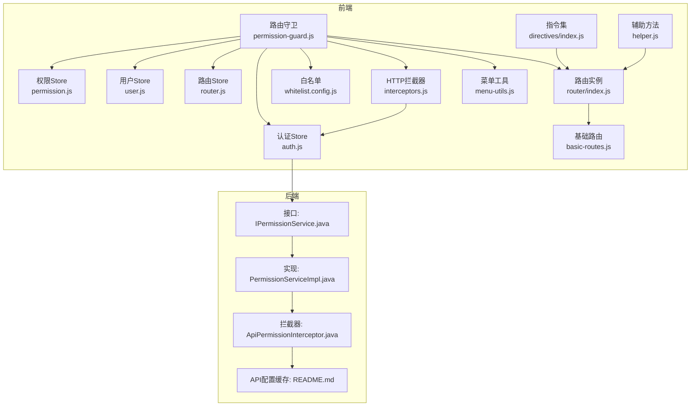
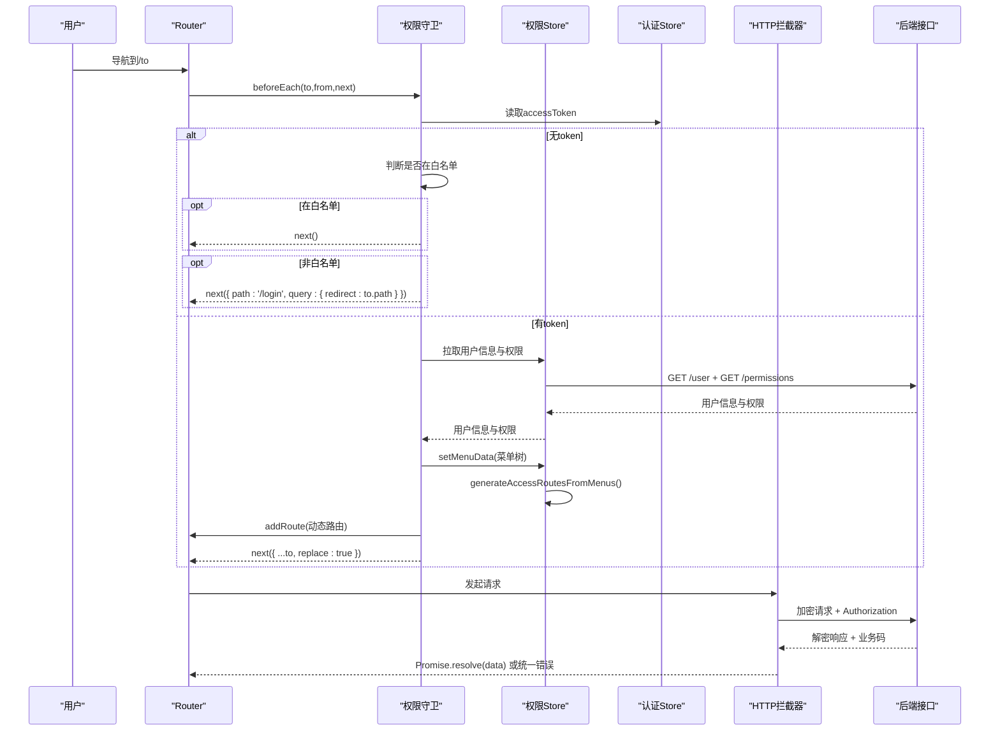
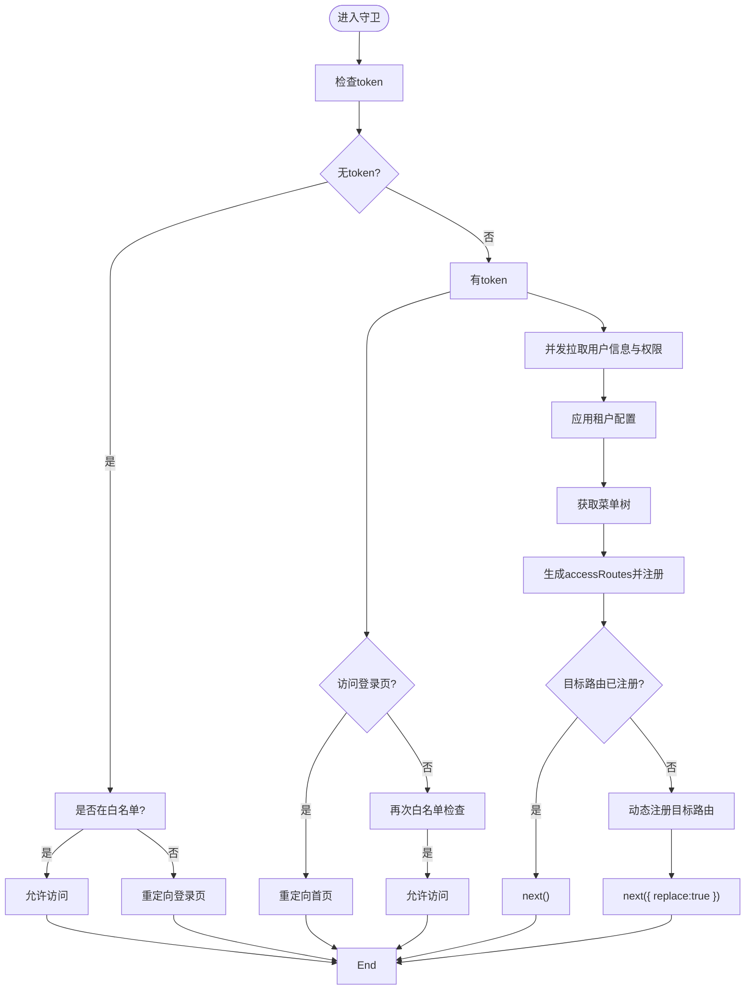
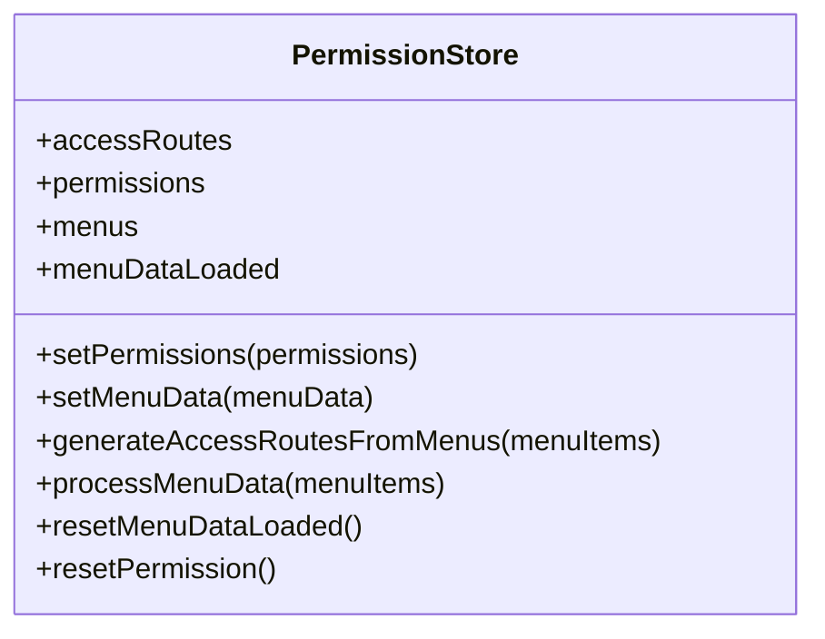
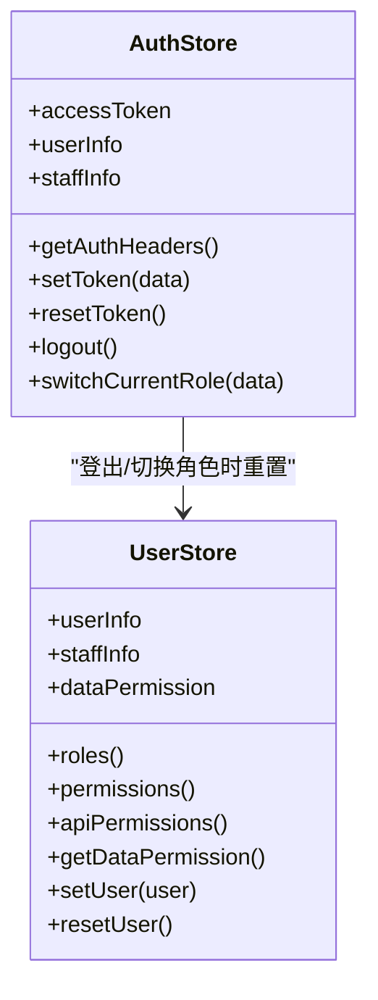
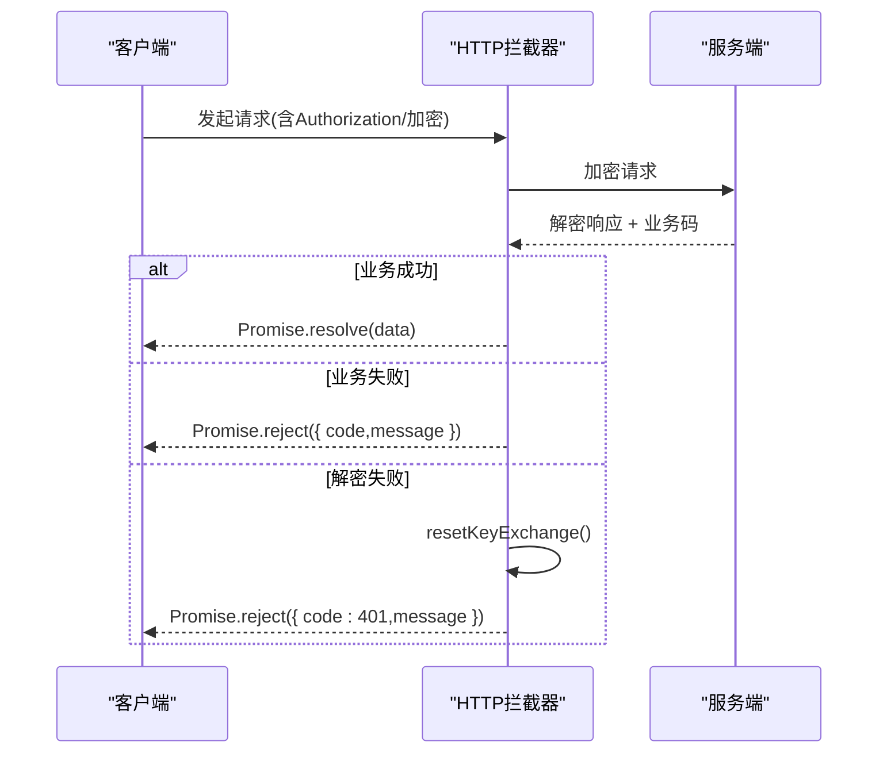
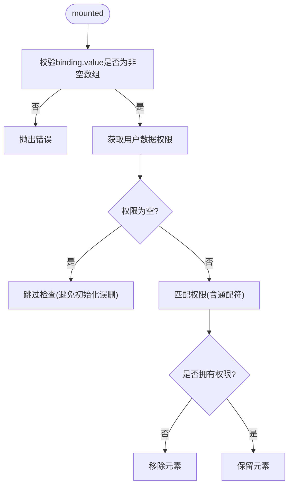
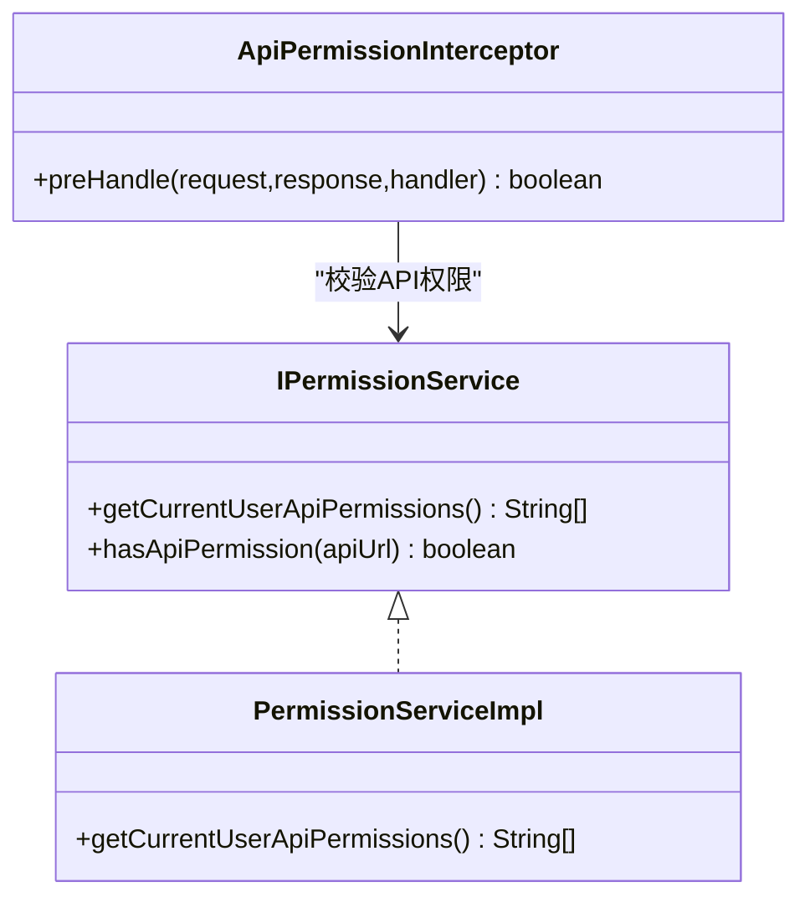
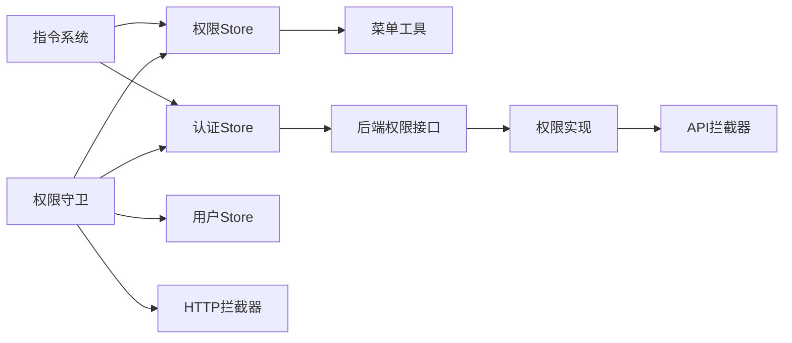

# 权限路由守卫

<cite>
**本文引用的文件**
- [permission-guard.js](file://forge-admin-ui/src/router/guards/permission-guard.js)
- [permission.js](file://forge-admin-ui/src/store/modules/permission.js)
- [auth.js](file://forge-admin-ui/src/store/modules/auth.js)
- [user.js](file://forge-admin-ui/src/store/modules/user.js)
- [router.js](file://forge-admin-ui/src/store/modules/router.js)
- [index.js](file://forge-admin-ui/src/router/index.js)
- [basic-routes.js](file://forge-admin-ui/src/router/basic-routes.js)
- [whitelist.config.js](file://forge-admin-ui/src/config/whitelist.config.js)
- [helper.js](file://forge-admin-ui/src/store/helper.js)
- [interceptors.js](file://forge-admin-ui/src/utils/http/interceptors.js)
- [hasPermi.js](file://forge-admin-ui/src/directives/modules/hasPermi.js)
- [directives/index.js](file://forge-admin-ui/src/directives/index.js)
- [menu-utils.js](file://forge-admin-ui/src/utils/menu-utils.js)
- [IPermissionService.java](file://forge/forge-framework/forge-starter-parent/forge-starter-auth/src/main/java/com/mdframe/forge/starter/auth/service/IPermissionService.java)
- [PermissionServiceImpl.java](file://forge/forge-framework/forge-plugin-parent/forge-plugin-system/src/main/java/com/mdframe/forge/plugin/system/service/impl/PermissionServiceImpl.java)
- [ApiPermissionInterceptor.java](file://forge/forge-framework/forge-starter-parent/forge-starter-auth/src/main/java/com/mdframe/forge/starter/auth/interceptor/ApiPermissionInterceptor.java)
- [README.md](file://forge/forge-framework/forge-starter-parent/forge-starter-api-config/README.md)
</cite>

## 目录
1. [简介](#简介)
2. [项目结构](#项目结构)
3. [核心组件](#核心组件)
4. [架构总览](#架构总览)
5. [组件详解](#组件详解)
6. [依赖关系分析](#依赖关系分析)
7. [性能考量](#性能考量)
8. [故障排查指南](#故障排查指南)
9. [结论](#结论)
10. [附录](#附录)

## 简介
本文件面向Forge前端权限路由守卫，系统性解析权限守卫实现机制、路由访问控制逻辑、用户权限验证流程。重点涵盖：
- 路由元信息中的权限标识与菜单元数据映射
- 动态路由生成与注册策略
- 登录状态检查、角色与资源权限判断
- 权限守卫配置方法、错误处理与缓存策略
- 性能优化与调试技巧

## 项目结构
围绕权限路由守卫的关键文件组织如下：
- 路由守卫：permission-guard.js
- 状态管理：permission.js、auth.js、user.js、router.js
- 路由配置：index.js、basic-routes.js
- 白名单：whitelist.config.js
- 辅助工具：helper.js、interceptors.js、menu-utils.js
- 指令：hasPermi.js、directives/index.js
- 后端权限接口与拦截器：IPermissionService.java、PermissionServiceImpl.java、ApiPermissionInterceptor.java
- API配置缓存说明：README.md

**图表来源**
- [permission-guard.js](file://forge-admin-ui/src/router/guards/permission-guard.js#L84-L547)
- [permission.js](file://forge-admin-ui/src/store/modules/permission.js#L1-L269)
- [auth.js](file://forge-admin-ui/src/store/modules/auth.js#L1-L78)
- [user.js](file://forge-admin-ui/src/store/modules/user.js#L1-L118)
- [router.js](file://forge-admin-ui/src/store/modules/router.js#L1-L19)
- [index.js](file://forge-admin-ui/src/router/index.js#L1-L18)
- [basic-routes.js](file://forge-admin-ui/src/router/basic-routes.js#L1-L86)
- [whitelist.config.js](file://forge-admin-ui/src/config/whitelist.config.js#L1-L10)
- [interceptors.js](file://forge-admin-ui/src/utils/http/interceptors.js#L1-L165)
- [menu-utils.js](file://forge-admin-ui/src/utils/menu-utils.js#L1-L170)
- [directives/index.js](file://forge-admin-ui/src/directives/index.js#L1-L38)
- [helper.js](file://forge-admin-ui/src/store/helper.js#L1-L57)
- [IPermissionService.java](file://forge/forge-framework/forge-starter-parent/forge-starter-auth/src/main/java/com/mdframe/forge/starter/auth/service/IPermissionService.java#L1-L25)
- [PermissionServiceImpl.java](file://forge/forge-framework/forge-plugin-parent/forge-plugin-system/src/main/java/com/mdframe/forge/plugin/system/service/impl/PermissionServiceImpl.java#L1-L32)
- [ApiPermissionInterceptor.java](file://forge/forge-framework/forge-starter-parent/forge-starter-auth/src/main/java/com/mdframe/forge/starter/auth/interceptor/ApiPermissionInterceptor.java#L1-L43)
- [README.md](file://forge/forge-framework/forge-starter-parent/forge-starter-api-config/README.md#L143-L168)

**章节来源**
- [permission-guard.js](file://forge-admin-ui/src/router/guards/permission-guard.js#L84-L547)
- [index.js](file://forge-admin-ui/src/router/index.js#L1-L18)

## 核心组件
- 路由守卫 createPermissionGuard：统一处理登录态、白名单、动态路由注册、菜单与路由映射、租户配置应用、WebSocket初始化等。
- 权限Store permission.js：负责菜单数据处理、路由生成、权限集合与菜单树构建、加载状态管理。
- 认证Store auth.js：维护token、用户信息、鉴权Header、登出与切换角色时的状态重置。
- 用户Store user.js：聚合用户、员工、数据权限信息，提供角色与权限getter。
- 路由Store router.js：提供路由重置能力，配合权限路由回滚。
- HTTP拦截器 interceptors.js：统一请求/响应处理、加解密、错误提示与重试策略。
- 指令系统：hasPermi.js（基于用户数据权限）、directives/index.js（基于路由meta.btns）。

**章节来源**
- [permission-guard.js](file://forge-admin-ui/src/router/guards/permission-guard.js#L84-L547)
- [permission.js](file://forge-admin-ui/src/store/modules/permission.js#L1-L269)
- [auth.js](file://forge-admin-ui/src/store/modules/auth.js#L1-L78)
- [user.js](file://forge-admin-ui/src/store/modules/user.js#L1-L118)
- [router.js](file://forge-admin-ui/src/store/modules/router.js#L1-L19)
- [interceptors.js](file://forge-admin-ui/src/utils/http/interceptors.js#L1-L165)
- [hasPermi.js](file://forge-admin-ui/src/directives/modules/hasPermi.js#L1-L41)
- [directives/index.js](file://forge-admin-ui/src/directives/index.js#L1-L38)

## 架构总览
权限路由守卫贯穿“路由层-状态层-接口层-后端鉴权层”的闭环：
- 前端路由守卫在每次导航前检查token与白名单，必要时拉取用户信息、权限与菜单，并动态注册路由。
- 权限Store将菜单数据转换为路由，同时生成accessRoutes供守卫注册。
- HTTP拦截器在请求阶段注入Authorization与安全参数，在响应阶段统一解密与错误处理。
- 后端通过IPermissionService与ApiPermissionInterceptor实现API级权限校验与缓存策略。

**图表来源**
- [permission-guard.js](file://forge-admin-ui/src/router/guards/permission-guard.js#L84-L547)
- [permission.js](file://forge-admin-ui/src/store/modules/permission.js#L78-L130)
- [interceptors.js](file://forge-admin-ui/src/utils/http/interceptors.js#L118-L165)
- [IPermissionService.java](file://forge/forge-framework/forge-starter-parent/forge-starter-auth/src/main/java/com/mdframe/forge/starter/auth/service/IPermissionService.java#L1-L25)

## 组件详解

### 路由守卫：权限控制与动态路由
- 登录态与白名单：若无token且不在白名单，重定向至登录页；若已登录访问登录页，重定向首页。
- 用户信息与权限：首次进入时并发拉取用户信息与权限，持久化到localStorage，同时加载租户配置并应用主题、浏览器标题与图标。
- 菜单数据与路由生成：获取菜单树，转换为前端路由结构，生成accessRoutes并批量注册；若组件不存在，注册指向404的兜底路由。
- 动态路由补全：若目标路由未注册，尝试根据视图组件存在性与菜单树匹配title与parentKey，必要时进行路径前缀与关键词匹配以推断父级菜单。
- 路由注册完成：设置路由守卫完成标志，避免重复执行；若注册后仍不可达，触发replace重新导航。
- 错误兜底：捕获异常并统一跳转404，同时设置完成标志。

**图表来源**
- [permission-guard.js](file://forge-admin-ui/src/router/guards/permission-guard.js#L84-L547)
- [whitelist.config.js](file://forge-admin-ui/src/config/whitelist.config.js#L1-L10)

**章节来源**
- [permission-guard.js](file://forge-admin-ui/src/router/guards/permission-guard.js#L84-L547)
- [whitelist.config.js](file://forge-admin-ui/src/config/whitelist.config.js#L1-L10)

### 权限Store：菜单到路由的转换
- setPermissions：从权限集合中筛选菜单类型，映射为前端菜单项并排序。
- setMenuData：处理菜单树，生成路由并写入accessRoutes，同时设置菜单数据加载完成标志。
- generateAccessRoutesFromMenus：遍历菜单树，生成标准路由对象，处理外链、keepAlive、redirect、perms等元信息。
- processMenuData：适配后端资源树结构，过滤隐藏项与按钮/API类型，统一component路径格式。
- resetMenuDataLoaded/resetPermission：重置菜单加载状态与权限数据，配合登出/切换角色场景。

**图表来源**
- [permission.js](file://forge-admin-ui/src/store/modules/permission.js#L1-L269)

**章节来源**
- [permission.js](file://forge-admin-ui/src/store/modules/permission.js#L1-L269)

### 认证与用户：登录态与权限数据
- 认证Store：维护accessToken与用户信息，提供鉴权Header；登出/切换角色时重置路由、用户、权限、标签页、WebSocket与密钥交换状态。
- 用户Store：聚合userInfo、staffInfo、dataPermission，提供角色与权限getter，兼容多种用户结构。
- 辅助方法：getUserInfo/getPermissions分别从接口与基础权限中获取用户与权限数据。

**图表来源**
- [auth.js](file://forge-admin-ui/src/store/modules/auth.js#L1-L78)
- [user.js](file://forge-admin-ui/src/store/modules/user.js#L1-L118)
- [helper.js](file://forge-admin-ui/src/store/helper.js#L1-L57)

**章节来源**
- [auth.js](file://forge-admin-ui/src/store/modules/auth.js#L1-L78)
- [user.js](file://forge-admin-ui/src/store/modules/user.js#L1-L118)
- [helper.js](file://forge-admin-ui/src/store/helper.js#L1-L57)

### HTTP拦截器：请求/响应与安全
- 请求阶段：注入traceId、Authorization、防重放参数，加密请求体。
- 响应阶段：解密响应，处理业务错误码，统一错误提示；检测解密失败时重置密钥交换并提示重新操作。
- 与守卫协作：在守卫执行前确保密钥交换完成，保障加密接口可用。

**图表来源**
- [interceptors.js](file://forge-admin-ui/src/utils/http/interceptors.js#L118-L165)
- [permission-guard.js](file://forge-admin-ui/src/router/guards/permission-guard.js#L117-L118)

**章节来源**
- [interceptors.js](file://forge-admin-ui/src/utils/http/interceptors.js#L1-L165)
- [permission-guard.js](file://forge-admin-ui/src/router/guards/permission-guard.js#L117-L118)

### 指令系统：按钮级权限与页面元素控制
- v-hasPermi：基于用户数据权限数组判断，支持通配符“**”，在挂载与更新时执行检查，缺失权限则移除DOM元素。
- v-permission：基于当前路由meta.btns中的按钮权限码集合判断，不在集合内则移除元素。

**图表来源**
- [hasPermi.js](file://forge-admin-ui/src/directives/modules/hasPermi.js#L1-L41)
- [directives/index.js](file://forge-admin-ui/src/directives/index.js#L1-L38)

**章节来源**
- [hasPermi.js](file://forge-admin-ui/src/directives/modules/hasPermi.js#L1-L41)
- [directives/index.js](file://forge-admin-ui/src/directives/index.js#L1-L38)

### 后端权限：接口级校验与缓存
- IPermissionService：提供当前用户API权限列表与URL匹配能力。
- PermissionServiceImpl：从登录用户上下文中读取已缓存的API权限，避免重复查询。
- ApiPermissionInterceptor：在preHandle阶段进行API权限校验，支持通配符匹配与忽略注解。
- API配置缓存：提供刷新与清理接口，采用事件驱动的分布式缓存同步，生产建议结合成熟限流框架。

**图表来源**
- [IPermissionService.java](file://forge/forge-framework/forge-starter-parent/forge-starter-auth/src/main/java/com/mdframe/forge/starter/auth/service/IPermissionService.java#L1-L25)
- [PermissionServiceImpl.java](file://forge/forge-framework/forge-plugin-parent/forge-plugin-system/src/main/java/com/mdframe/forge/plugin/system/service/impl/PermissionServiceImpl.java#L1-L32)
- [ApiPermissionInterceptor.java](file://forge/forge-framework/forge-starter-parent/forge-starter-auth/src/main/java/com/mdframe/forge/starter/auth/interceptor/ApiPermissionInterceptor.java#L1-L43)
- [README.md](file://forge/forge-framework/forge-starter-parent/forge-starter-api-config/README.md#L143-L168)

**章节来源**
- [IPermissionService.java](file://forge/forge-framework/forge-starter-parent/forge-starter-auth/src/main/java/com/mdframe/forge/starter/auth/service/IPermissionService.java#L1-L25)
- [PermissionServiceImpl.java](file://forge/forge-framework/forge-plugin-parent/forge-plugin-system/src/main/java/com/mdframe/forge/plugin/system/service/impl/PermissionServiceImpl.java#L1-L32)
- [ApiPermissionInterceptor.java](file://forge/forge-framework/forge-starter-parent/forge-starter-auth/src/main/java/com/mdframe/forge/starter/auth/interceptor/ApiPermissionInterceptor.java#L1-L43)
- [README.md](file://forge/forge-framework/forge-starter-parent/forge-starter-api-config/README.md#L143-L168)

## 依赖关系分析
- 路由守卫依赖认证Store获取token，依赖权限Store生成与注册路由，依赖用户Store与localStorage持久化用户信息，依赖HTTP拦截器保证加密接口可用。
- 权限Store依赖菜单工具函数处理菜单树与图标渲染。
- 指令系统依赖当前路由meta.btns与用户数据权限。
- 后端通过接口与拦截器实现API级权限校验，与前端权限形成互补。

**图表来源**
- [permission-guard.js](file://forge-admin-ui/src/router/guards/permission-guard.js#L84-L547)
- [permission.js](file://forge-admin-ui/src/store/modules/permission.js#L1-L269)
- [interceptors.js](file://forge-admin-ui/src/utils/http/interceptors.js#L1-L165)
- [directives/index.js](file://forge-admin-ui/src/directives/index.js#L1-L38)
- [IPermissionService.java](file://forge/forge-framework/forge-starter-parent/forge-starter-auth/src/main/java/com/mdframe/forge/starter/auth/service/IPermissionService.java#L1-L25)
- [PermissionServiceImpl.java](file://forge/forge-framework/forge-plugin-parent/forge-plugin-system/src/main/java/com/mdframe/forge/plugin/system/service/impl/PermissionServiceImpl.java#L1-L32)
- [ApiPermissionInterceptor.java](file://forge/forge-framework/forge-starter-parent/forge-starter-auth/src/main/java/com/mdframe/forge/starter/auth/interceptor/ApiPermissionInterceptor.java#L1-L43)

**章节来源**
- [permission-guard.js](file://forge-admin-ui/src/router/guards/permission-guard.js#L84-L547)
- [permission.js](file://forge-admin-ui/src/store/modules/permission.js#L1-L269)
- [interceptors.js](file://forge-admin-ui/src/utils/http/interceptors.js#L1-L165)
- [directives/index.js](file://forge-admin-ui/src/directives/index.js#L1-L38)

## 性能考量
- 并发拉取：用户信息与权限采用Promise.all并发获取，减少首屏等待时间。
- 菜单到路由转换：一次性生成accessRoutes并批量注册，避免多次遍历。
- 组件存在性检查：使用import.meta.glob预加载视图组件清单，仅注册存在的路由，不存在时快速降级为404。
- 路由守卫完成标志：避免重复执行与死循环，提升导航稳定性。
- HTTP加密前置：在守卫中先完成密钥交换，确保后续加密接口可用，减少运行时异常重试。
- 后端缓存：API权限在登录时加载并缓存，拦截器直接匹配，降低数据库压力。

[本节为通用性能建议，无需特定文件引用]

## 故障排查指南
- 登录后仍被重定向到登录页
  - 检查token是否正确设置与持久化；确认白名单配置是否包含目标路径。
  - 关注守卫中token分支与白名单分支逻辑。
- 动态路由未注册或404
  - 确认菜单树中是否存在对应path与component；检查组件路径是否以/src/views开头且存在。
  - 若组件不存在，守卫会注册指向404的兜底路由，检查控制台日志定位。
- 页面元素被错误移除
  - 检查v-hasPermi绑定值是否为数组且非空；确认用户数据权限是否已加载。
  - 检查v-permission绑定的按钮权限码是否存在于当前路由meta.btns。
- 解密失败或安全会话过期
  - 检查HTTP拦截器解密流程与密钥交换状态；出现DECRYPT_ERROR时会重置密钥交换并提示重新操作。
- API权限校验失败
  - 检查后端IPermissionService返回的API权限列表与ApiPermissionInterceptor的URL匹配规则；必要时刷新API配置缓存。

**章节来源**
- [permission-guard.js](file://forge-admin-ui/src/router/guards/permission-guard.js#L84-L547)
- [interceptors.js](file://forge-admin-ui/src/utils/http/interceptors.js#L20-L71)
- [hasPermi.js](file://forge-admin-ui/src/directives/modules/hasPermi.js#L1-L41)
- [directives/index.js](file://forge-admin-ui/src/directives/index.js#L1-L38)
- [IPermissionService.java](file://forge/forge-framework/forge-starter-parent/forge-starter-auth/src/main/java/com/mdframe/forge/starter/auth/service/IPermissionService.java#L1-L25)
- [ApiPermissionInterceptor.java](file://forge/forge-framework/forge-starter-parent/forge-starter-auth/src/main/java/com/mdframe/forge/starter/auth/interceptor/ApiPermissionInterceptor.java#L1-L43)

## 结论
Forge前端权限路由守卫通过“路由守卫+状态管理+指令系统+HTTP拦截器”的协同，实现了从导航到渲染的全链路权限控制。配合后端API权限拦截与缓存策略，形成前后端一致的权限边界。建议在实际部署中关注并发拉取、组件存在性检查、密钥交换前置与API配置缓存刷新等关键点，以获得更稳定与高性能的用户体验。

[本节为总结性内容，无需特定文件引用]

## 附录

### 路由元信息与权限标识
- 路由元信息包含title、icon、type、keepAlive、alwaysShow、redirect、originPath、perms等字段，用于菜单渲染与按钮权限控制。
- 菜单树处理时会过滤隐藏项与按钮/API类型，统一component路径格式，支持外链与iframe模式。

**章节来源**
- [permission.js](file://forge-admin-ui/src/store/modules/permission.js#L132-L204)
- [permission.js](file://forge-admin-ui/src/store/modules/permission.js#L78-L130)

### 动态路由生成与菜单匹配算法
- 依据菜单树生成路由：遍历菜单项，过滤目录与菜单类型，拼装标准路由对象。
- 父级菜单推断：当目标路由未在菜单中直接出现时，通过路径前缀与关键词匹配（如“dict”与“dictData”）寻找相关父级菜单键值。

**章节来源**
- [permission-guard.js](file://forge-admin-ui/src/router/guards/permission-guard.js#L204-L339)
- [permission-guard.js](file://forge-admin-ui/src/router/guards/permission-guard.js#L440-L535)

### 登录状态检查与角色权限判断
- 登录态：通过认证Store的accessToken判断；无token且不在白名单则重定向登录。
- 角色与权限：用户Store提供roles、permissions、apiPermissions等getter；指令v-hasPermi支持通配符“**”。

**章节来源**
- [auth.js](file://forge-admin-ui/src/store/modules/auth.js#L1-L78)
- [user.js](file://forge-admin-ui/src/store/modules/user.js#L1-L118)
- [hasPermi.js](file://forge-admin-ui/src/directives/modules/hasPermi.js#L1-L41)

### 资源访问控制与错误处理
- 前端：路由守卫与指令控制页面与按钮可见性；HTTP拦截器统一错误提示与解密失败处理。
- 后端：IPermissionService提供API权限列表；ApiPermissionInterceptor进行URL匹配与权限校验；README说明缓存刷新接口与设计原则。

**章节来源**
- [interceptors.js](file://forge-admin-ui/src/utils/http/interceptors.js#L1-L165)
- [IPermissionService.java](file://forge/forge-framework/forge-starter-parent/forge-starter-auth/src/main/java/com/mdframe/forge/starter/auth/service/IPermissionService.java#L1-L25)
- [ApiPermissionInterceptor.java](file://forge/forge-framework/forge-starter-parent/forge-starter-auth/src/main/java/com/mdframe/forge/starter/auth/interceptor/ApiPermissionInterceptor.java#L1-L43)
- [README.md](file://forge/forge-framework/forge-starter-parent/forge-starter-api-config/README.md#L143-L168)