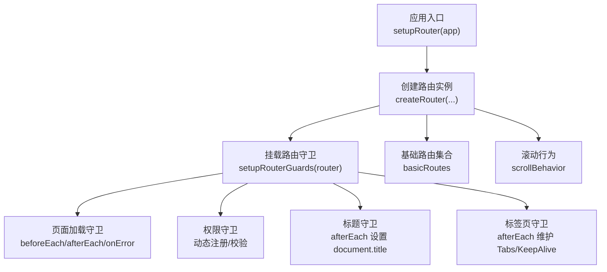
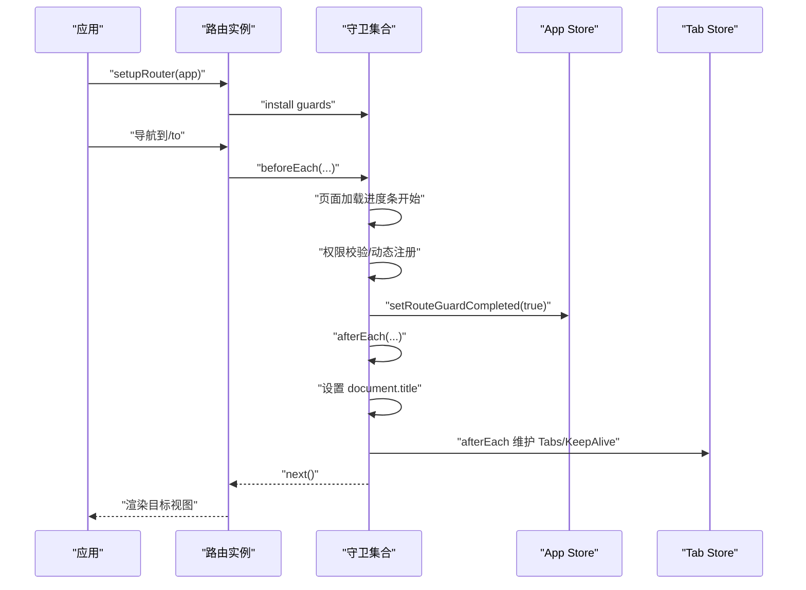
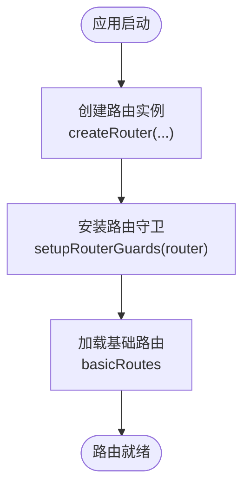
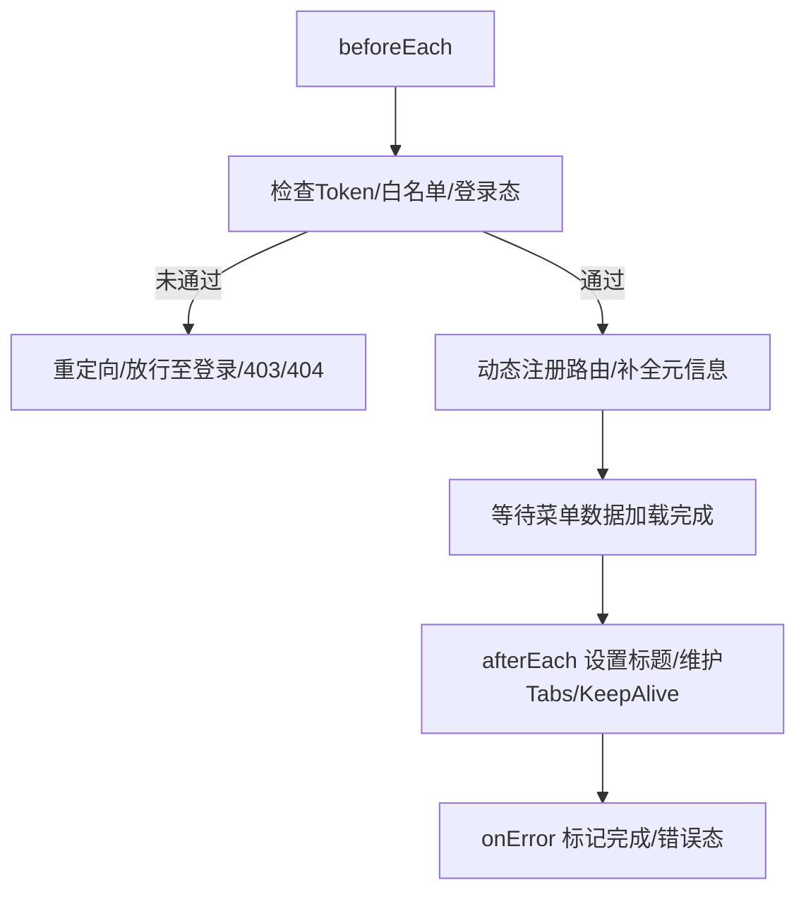
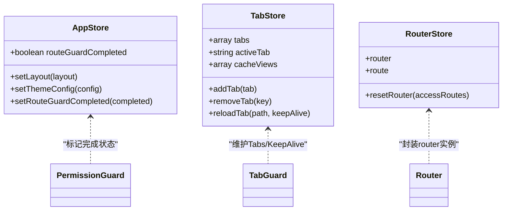
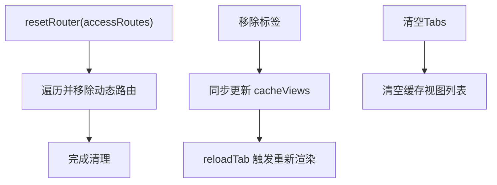
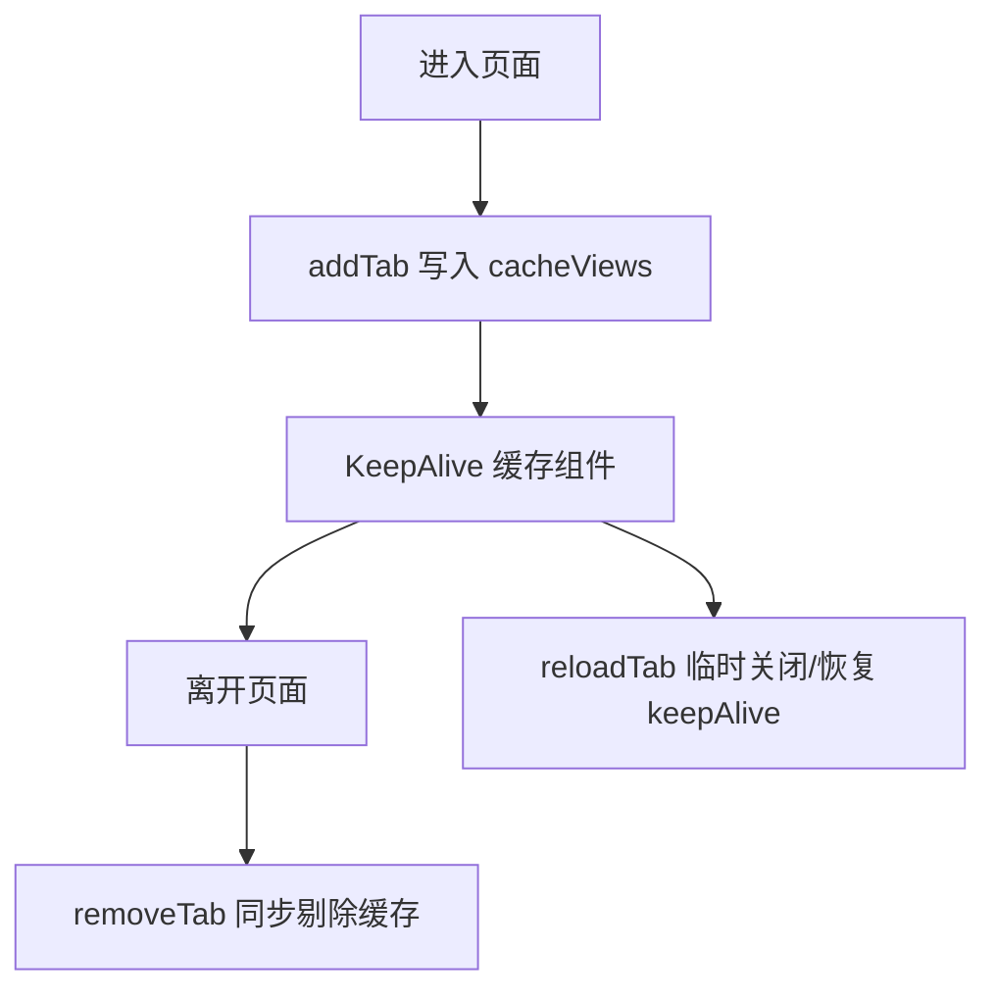
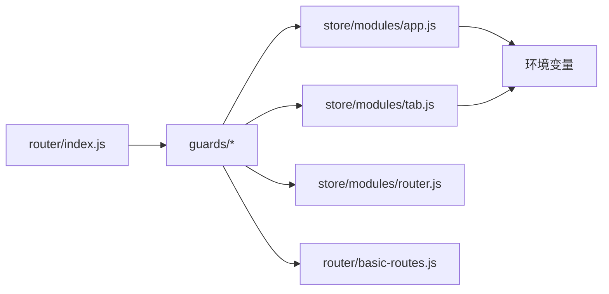

# 路由生命周期

<cite>
**本文引用的文件**
- [router/index.js](file://forge-admin-ui/src/router/index.js)
- [router/basic-routes.js](file://forge-admin-ui/src/router/basic-routes.js)
- [router/guards/index.js](file://forge-admin-ui/src/router/guards/index.js)
- [router/guards/page-loading-guard.js](file://forge-admin-ui/src/router/guards/page-loading-guard.js)
- [router/guards/page-title-guard.js](file://forge-admin-ui/src/router/guards/page-title-guard.js)
- [router/guards/permission-guard.js](file://forge-admin-ui/src/router/guards/permission-guard.js)
- [router/guards/tab-guard.js](file://forge-admin-ui/src/router/guards/tab-guard.js)
- [store/index.js](file://forge-admin-ui/src/store/index.js)
- [store/modules/app.js](file://forge-admin-ui/src/store/modules/app.js)
- [store/modules/router.js](file://forge-admin-ui/src/store/modules/router.js)
- [store/modules/tab.js](file://forge-admin-ui/src/store/modules/tab.js)
- [composables/useAliveData.js](file://forge-admin-ui/src/composables/useAliveData.js)
</cite>

## 目录
1. [简介](#简介)
2. [项目结构](#项目结构)
3. [核心组件](#核心组件)
4. [架构总览](#架构总览)
5. [详细组件分析](#详细组件分析)
6. [依赖关系分析](#依赖关系分析)
7. [性能考量](#性能考量)
8. [故障排查指南](#故障排查指南)
9. [结论](#结论)
10. [附录](#附录)

## 简介
本文件系统性梳理 Forge 前端的路由生命周期管理，涵盖路由实例创建、初始化流程、销毁与清理机制；详解路由状态管理、路由参数监听与变化事件处理；解释路由缓存策略、组件生命周期钩子与路由过渡动画；并提供最佳实践、内存泄漏防护与性能监控建议。内容面向不同技术背景读者，既提供高层概览，也给出可操作的落地细节。

## 项目结构
Forge 前端路由系统位于 forge-admin-ui/src/router 目录，采用“路由定义 + 多类守卫 + 状态管理”的分层组织方式：
- 路由定义：基础路由集中于 basic-routes.js，运行时通过 createRouter 创建实例。
- 路由守卫：按职责拆分为页面加载、页面标题、权限校验、标签页维护等。
- 状态管理：通过 Pinia Store 管理应用状态、路由状态、标签页与缓存视图。

图表来源
- [router/index.js](file://forge-admin-ui/src/router/index.js#L1-L18)
- [router/guards/index.js](file://forge-admin-ui/src/router/guards/index.js#L1-L12)
- [router/basic-routes.js](file://forge-admin-ui/src/router/basic-routes.js#L1-L86)

章节来源
- [router/index.js](file://forge-admin-ui/src/router/index.js#L1-L18)
- [router/basic-routes.js](file://forge-admin-ui/src/router/basic-routes.js#L1-L86)
- [router/guards/index.js](file://forge-admin-ui/src/router/guards/index.js#L1-L12)

## 核心组件
- 路由实例创建与挂载
  - 通过 createRouter 创建实例，支持 Hash 与 History 两种模式，基于环境变量选择。
  - 通过 setupRouter(app) 完成 app.use(router) 与守卫安装。
- 基础路由集合
  - 登录、首页、404/403 错误页、iframe、系统功能页等静态路由。
- 路由守卫体系
  - 页面加载进度条与守卫完成状态标记。
  - 权限校验、动态路由注册、菜单与租户配置应用。
  - 页面标题设置。
  - 标签页维护与 KeepAlive 缓存联动。
- 状态管理
  - App Store：路由守卫完成状态、主题、布局等。
  - Tab Store：标签页列表、活动标签、缓存视图列表、标签页刷新。
  - Router Store：对 router 实例与 route 的轻量封装与重置能力。

章节来源
- [router/index.js](file://forge-admin-ui/src/router/index.js#L1-L18)
- [router/basic-routes.js](file://forge-admin-ui/src/router/basic-routes.js#L1-L86)
- [router/guards/page-loading-guard.js](file://forge-admin-ui/src/router/guards/page-loading-guard.js#L1-L31)
- [router/guards/permission-guard.js](file://forge-admin-ui/src/router/guards/permission-guard.js#L1-L547)
- [router/guards/page-title-guard.js](file://forge-admin-ui/src/router/guards/page-title-guard.js#L1-L14)
- [router/guards/tab-guard.js](file://forge-admin-ui/src/router/guards/tab-guard.js#L1-L41)
- [store/modules/app.js](file://forge-admin-ui/src/store/modules/app.js#L1-L91)
- [store/modules/tab.js](file://forge-admin-ui/src/store/modules/tab.js#L1-L174)
- [store/modules/router.js](file://forge-admin-ui/src/store/modules/router.js#L1-L19)

## 架构总览
下图展示路由生命周期的关键节点与交互：实例创建、守卫链路、状态同步与标签页/缓存联动。

图表来源
- [router/index.js](file://forge-admin-ui/src/router/index.js#L14-L18)
- [router/guards/index.js](file://forge-admin-ui/src/router/guards/index.js#L6-L11)
- [router/guards/page-loading-guard.js](file://forge-admin-ui/src/router/guards/page-loading-guard.js#L4-L30)
- [router/guards/permission-guard.js](file://forge-admin-ui/src/router/guards/permission-guard.js#L84-L546)
- [router/guards/page-title-guard.js](file://forge-admin-ui/src/router/guards/page-title-guard.js#L3-L13)
- [router/guards/tab-guard.js](file://forge-admin-ui/src/router/guards/tab-guard.js#L5-L40)
- [store/modules/app.js](file://forge-admin-ui/src/store/modules/app.js#L74-L77)
- [store/modules/tab.js](file://forge-admin-ui/src/store/modules/tab.js#L26-L41)

## 详细组件分析

### 路由实例创建与初始化
- 实例创建
  - 基于环境变量选择 Hash 或 History 模式，并指定公共路径。
  - 指定基础路由集合与滚动行为（回到顶部）。
- 初始化挂载
  - setupRouter(app) 中完成 app.use(router) 与守卫安装。
- 基础路由
  - 登录、首页、404/403、iframe、系统功能页等，均采用异步组件按需加载。

图表来源
- [router/index.js](file://forge-admin-ui/src/router/index.js#L5-L12)
- [router/index.js](file://forge-admin-ui/src/router/index.js#L14-L18)
- [router/basic-routes.js](file://forge-admin-ui/src/router/basic-routes.js#L1-L86)

章节来源
- [router/index.js](file://forge-admin-ui/src/router/index.js#L1-L18)
- [router/basic-routes.js](file://forge-admin-ui/src/router/basic-routes.js#L1-L86)

### 路由守卫链路与生命周期
- 页面加载守卫
  - beforeEach 开始进度条。
  - afterEach 结束进度条，并在一定延迟后确保“路由守卫完成”状态被设置。
  - onError 统一标记完成状态并置错误态。
- 权限守卫
  - 校验 Token、白名单、登录态与目标路由合法性。
  - 动态注册路由：扫描视图组件、注册有效路由、必要时回退至 404。
  - 从菜单数据推导标题与父级菜单键，支持路径前缀与关键词匹配。
  - 加载用户信息、权限、菜单、租户配置并应用主题与浏览器图标。
  - 等待菜单数据加载完成后放行，必要时触发重新导航。
- 页面标题守卫
  - afterMatched 读取 meta.title 并拼接基础标题。
- 标签页守卫
  - afterMatched 维护 Tabs，避免重复添加；读取组件默认 title；联动 KeepAlive 缓存。

图表来源
- [router/guards/page-loading-guard.js](file://forge-admin-ui/src/router/guards/page-loading-guard.js#L4-L30)
- [router/guards/permission-guard.js](file://forge-admin-ui/src/router/guards/permission-guard.js#L84-L546)
- [router/guards/page-title-guard.js](file://forge-admin-ui/src/router/guards/page-title-guard.js#L3-L13)
- [router/guards/tab-guard.js](file://forge-admin-ui/src/router/guards/tab-guard.js#L5-L40)

章节来源
- [router/guards/page-loading-guard.js](file://forge-admin-ui/src/router/guards/page-loading-guard.js#L1-L31)
- [router/guards/permission-guard.js](file://forge-admin-ui/src/router/guards/permission-guard.js#L1-L547)
- [router/guards/page-title-guard.js](file://forge-admin-ui/src/router/guards/page-title-guard.js#L1-L14)
- [router/guards/tab-guard.js](file://forge-admin-ui/src/router/guards/tab-guard.js#L1-L41)

### 路由状态管理与参数监听
- App Store
  - 维护路由守卫完成状态，供全局与守卫使用。
  - 主题、布局、深色模式等应用级状态。
- Tab Store
  - 维护 Tabs 列表、活动标签、缓存视图列表。
  - 支持移除左右/其他/全部标签，并同步更新缓存视图列表。
  - 提供 reloadTab 异步刷新，结合 KeepAlive 控制实现“热重载”。
- Router Store
  - 对 router 与 route 的轻量封装，提供 resetRouter 接口，便于按需移除动态路由。

图表来源
- [store/modules/app.js](file://forge-admin-ui/src/store/modules/app.js#L7-L17)
- [store/modules/app.js](file://forge-admin-ui/src/store/modules/app.js#L74-L77)
- [store/modules/tab.js](file://forge-admin-ui/src/store/modules/tab.js#L8-L15)
- [store/modules/tab.js](file://forge-admin-ui/src/store/modules/tab.js#L26-L41)
- [store/modules/router.js](file://forge-admin-ui/src/store/modules/router.js#L3-L18)

章节来源
- [store/modules/app.js](file://forge-admin-ui/src/store/modules/app.js#L1-L91)
- [store/modules/tab.js](file://forge-admin-ui/src/store/modules/tab.js#L1-L174)
- [store/modules/router.js](file://forge-admin-ui/src/store/modules/router.js#L1-L19)

### 路由销毁机制与资源清理
- 动态路由重置
  - 通过 resetRouter(accessRoutes) 遍历并移除已注册的动态路由，避免残留。
- 标签页与缓存清理
  - 移除标签时同步从 cacheViews 中剔除对应缓存名。
  - 清空 Tabs 时同时清空缓存视图列表。
- KeepAlive 刷新
  - reloadTab 通过临时关闭/恢复 keepAlive 属性，配合 nextTick 触发重新渲染，避免内存泄漏。

图表来源
- [store/modules/router.js](file://forge-admin-ui/src/store/modules/router.js#L7-L11)
- [store/modules/tab.js](file://forge-admin-ui/src/store/modules/tab.js#L42-L66)
- [store/modules/tab.js](file://forge-admin-ui/src/store/modules/tab.js#L133-L140)
- [store/modules/tab.js](file://forge-admin-ui/src/store/modules/tab.js#L141-L164)

章节来源
- [store/modules/router.js](file://forge-admin-ui/src/store/modules/router.js#L1-L19)
- [store/modules/tab.js](file://forge-admin-ui/src/store/modules/tab.js#L1-L174)

### 路由缓存策略与组件生命周期钩子
- 缓存策略
  - 标签页缓存：根据路径生成缓存名并写入 cacheViews，随标签页增删同步更新。
  - KeepAlive：通过路由 meta.keepAlive 控制组件缓存；标签页刷新时临时关闭/恢复以触发重建。
- 生命周期钩子
  - 组件卸载时应清理定时器、订阅与事件监听，避免内存泄漏。
  - 使用 useAliveData 在路由切换间保持部分数据，减少重复计算与请求。

图表来源
- [store/modules/tab.js](file://forge-admin-ui/src/store/modules/tab.js#L26-L41)
- [store/modules/tab.js](file://forge-admin-ui/src/store/modules/tab.js#L42-L66)
- [store/modules/tab.js](file://forge-admin-ui/src/store/modules/tab.js#L141-L164)
- [composables/useAliveData.js](file://forge-admin-ui/src/composables/useAliveData.js#L1-L22)

章节来源
- [store/modules/tab.js](file://forge-admin-ui/src/store/modules/tab.js#L1-L174)
- [composables/useAliveData.js](file://forge-admin-ui/src/composables/useAliveData.js#L1-L22)

### 路由过渡动画与滚动行为
- 滚动行为
  - scrollBehavior 回到顶部，保证每次导航后页面处于一致的初始位置。
- 过渡动画
  - 项目未显式配置路由过渡动画，如需可在路由配置中扩展 enter/leave 动画钩子或在布局层统一处理。

章节来源
- [router/index.js](file://forge-admin-ui/src/router/index.js#L11-L12)

## 依赖关系分析
- 组件耦合
  - 路由守卫与 Store 存在强耦合：权限守卫依赖 App Store 标记完成状态；标签页守卫依赖 Tab Store 维护状态。
  - 动态路由注册依赖菜单数据与视图组件扫描结果。
- 外部依赖
  - Vue Router：路由实例、导航钩子、动态路由注册。
  - Pinia：状态持久化插件、模块化 Store。
  - 环境变量：决定历史模式与公共路径。

图表来源
- [router/index.js](file://forge-admin-ui/src/router/index.js#L1-L18)
- [router/guards/index.js](file://forge-admin-ui/src/router/guards/index.js#L1-L12)
- [store/modules/app.js](file://forge-admin-ui/src/store/modules/app.js#L1-L91)
- [store/modules/tab.js](file://forge-admin-ui/src/store/modules/tab.js#L1-L174)
- [store/modules/router.js](file://forge-admin-ui/src/store/modules/router.js#L1-L19)
- [router/basic-routes.js](file://forge-admin-ui/src/router/basic-routes.js#L1-L86)

章节来源
- [router/index.js](file://forge-admin-ui/src/router/index.js#L1-L18)
- [router/guards/index.js](file://forge-admin-ui/src/router/guards/index.js#L1-L12)
- [store/modules/app.js](file://forge-admin-ui/src/store/modules/app.js#L1-L91)
- [store/modules/tab.js](file://forge-admin-ui/src/store/modules/tab.js#L1-L174)
- [store/modules/router.js](file://forge-admin-ui/src/store/modules/router.js#L1-L19)
- [router/basic-routes.js](file://forge-admin-ui/src/router/basic-routes.js#L1-L86)

## 性能考量
- 路由守卫性能
  - beforeEach/afterEach 中避免重型同步任务；使用异步组件与懒加载减少首屏负担。
  - 动态注册路由时批量处理并去重，减少重复注册与导航次数。
- 状态持久化
  - Pinia 持久化仅保留必要字段，降低序列化开销。
- KeepAlive 优化
  - 合理使用 keepAlive，避免缓存过多页面导致内存压力。
  - 使用 reloadTab 时注意只对必要页面执行，避免全局刷新。
- 图标与主题
  - 租户主题与浏览器图标应用时尽量一次性完成，避免多次 DOM 操作。

## 故障排查指南
- 路由守卫未完成
  - 现象：页面加载进度条卡住或守卫状态未置位。
  - 排查：确认 permission-guard 是否抛错并最终调用 next；检查 App Store 的 routeGuardCompleted 是否被设置。
- 动态路由未生效
  - 现象：导航到新路由后 404。
  - 排查：确认动态注册逻辑是否命中；检查组件是否存在；确认刚注册路由后是否触发了 replace 重新导航。
- 标题未更新
  - 现象：页面标题未按 meta.title 更新。
  - 排查：确认 page-title-guard 是否执行；检查 meta.title 是否存在。
- 标签页异常
  - 现象：重复标签、缓存未清理、刷新无效。
  - 排查：确认 tab-guard 是否正确读取组件 title；检查 removeTab/removeAll 是否同步更新 cacheViews；reloadTab 是否正确切换 keepAlive。

章节来源
- [router/guards/page-loading-guard.js](file://forge-admin-ui/src/router/guards/page-loading-guard.js#L1-L31)
- [router/guards/permission-guard.js](file://forge-admin-ui/src/router/guards/permission-guard.js#L194-L201)
- [router/guards/page-title-guard.js](file://forge-admin-ui/src/router/guards/page-title-guard.js#L1-L14)
- [router/guards/tab-guard.js](file://forge-admin-ui/src/router/guards/tab-guard.js#L1-L41)
- [store/modules/app.js](file://forge-admin-ui/src/store/modules/app.js#L74-L77)
- [store/modules/tab.js](file://forge-admin-ui/src/store/modules/tab.js#L42-L66)
- [store/modules/tab.js](file://forge-admin-ui/src/store/modules/tab.js#L133-L140)
- [store/modules/tab.js](file://forge-admin-ui/src/store/modules/tab.js#L141-L164)

## 结论
Forge 前端路由生命周期围绕“实例创建 → 守卫链路 → 状态管理 → 标签页与缓存”展开，形成闭环：权限守卫保障安全与动态路由注册，页面加载与标题守卫提升用户体验，标签页与缓存联动实现多页签场景下的性能与一致性。通过合理的状态持久化、缓存策略与资源清理，可有效避免内存泄漏并提升性能。

## 附录
- 最佳实践
  - 在 beforeEach 中尽早设置“路由守卫完成”状态，确保 onError 也能正确标记。
  - 动态路由注册时优先从菜单数据推导元信息，减少硬编码。
  - KeepAlive 与标签页联动，避免缓存膨胀。
  - 使用 useAliveData 在路由切换间保持必要数据，减少重复请求。
- 内存泄漏防护
  - 组件卸载时清理定时器、WebSocket、事件监听。
  - 定期调用 resetRouter 清理不再使用的动态路由。
  - 使用 reloadTab 时确保只对必要页面执行，避免全局重建。
- 性能监控
  - 记录守卫耗时与导航耗时，定位慢点。
  - 监控标签页数量与缓存视图大小，防止内存压力过大。