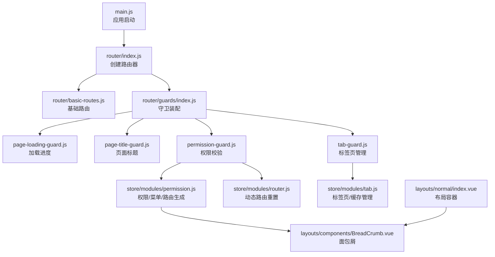
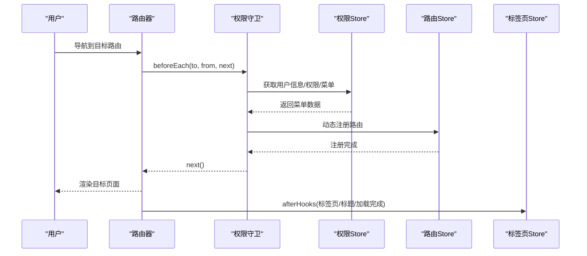
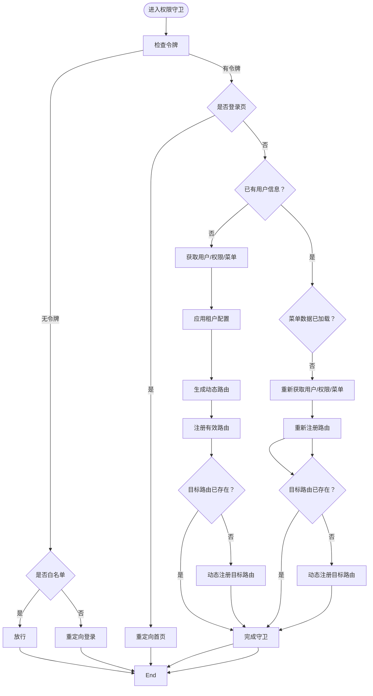
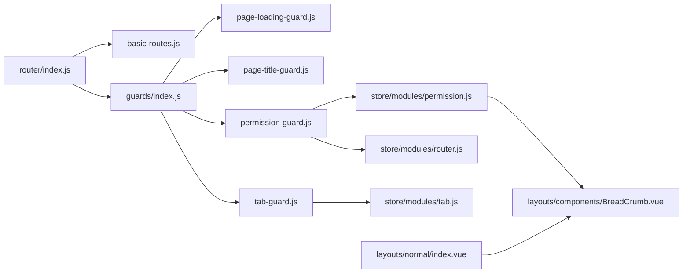

# 路由系统设计

<cite>
**本文档引用的文件**
- [router/index.js](file://forge-admin-ui/src/router/index.js)
- [router/basic-routes.js](file://forge-admin-ui/src/router/basic-routes.js)
- [router/guards/index.js](file://forge-admin-ui/src/router/guards/index.js)
- [router/guards/page-loading-guard.js](file://forge-admin-ui/src/router/guards/page-loading-guard.js)
- [router/guards/page-title-guard.js](file://forge-admin-ui/src/router/guards/page-title-guard.js)
- [router/guards/permission-guard.js](file://forge-admin-ui/src/router/guards/permission-guard.js)
- [router/guards/tab-guard.js](file://forge-admin-ui/src/router/guards/tab-guard.js)
- [store/modules/router.js](file://forge-admin-ui/src/store/modules/router.js)
- [store/modules/permission.js](file://forge-admin-ui/src/store/modules/permission.js)
- [store/modules/tab.js](file://forge-admin-ui/src/store/modules/tab.js)
- [layouts/normal/index.vue](file://forge-admin-ui/src/layouts/normal/index.vue)
- [layouts/components/BreadCrumb.vue](file://forge-admin-ui/src/layouts/components/BreadCrumb.vue)
- [utils/menu-utils.js](file://forge-admin-ui/src/utils/menu-utils.js)
- [utils/tab.js](file://forge-admin-ui/src/utils/tab.js)
- [main.js](file://forge-admin-ui/src/main.js)
</cite>

## 目录
1. [引言](#引言)
2. [项目结构](#项目结构)
3. [核心组件](#核心组件)
4. [架构总览](#架构总览)
5. [详细组件分析](#详细组件分析)
6. [依赖关系分析](#依赖关系分析)
7. [性能考虑](#性能考虑)
8. [故障排除指南](#故障排除指南)
9. [结论](#结论)
10. [附录](#附录)

## 引言
本文件面向Forge前端路由系统的深度技术文档，围绕路由配置结构、动态路由生成机制、权限路由守卫实现展开；同时详解路由元信息设计、页面标题管理、面包屑导航生成；解释路由懒加载策略、路由缓存机制与标签页管理功能；给出路由权限控制实现方案、嵌套路由设计模式与路由参数传递最佳实践，并提供路由性能优化与SEO优化建议。

## 项目结构
Forge前端路由系统位于 `forge-admin-ui/src/router` 目录下，采用“静态基础路由 + 动态权限路由”的双层结构：
- 基础路由：登录、首页、404/403错误页、iframe、系统消息等静态页面
- 权限路由：基于菜单数据动态生成，支持外链、keepAlive、权限标识等元信息

路由守卫按职责拆分：页面加载进度、页面标题、权限校验、标签页管理四类守卫统一在入口集中装配。

图表来源
- [main.js](file://forge-admin-ui/src/main.js#L15-L37)
- [router/index.js](file://forge-admin-ui/src/router/index.js#L1-L18)
- [router/basic-routes.js](file://forge-admin-ui/src/router/basic-routes.js#L1-L86)
- [router/guards/index.js](file://forge-admin-ui/src/router/guards/index.js#L1-L12)
- [router/guards/page-loading-guard.js](file://forge-admin-ui/src/router/guards/page-loading-guard.js#L1-L31)
- [router/guards/page-title-guard.js](file://forge-admin-ui/src/router/guards/page-title-guard.js#L1-L14)
- [router/guards/permission-guard.js](file://forge-admin-ui/src/router/guards/permission-guard.js#L1-L547)
- [router/guards/tab-guard.js](file://forge-admin-ui/src/router/guards/tab-guard.js#L1-L41)
- [store/modules/permission.js](file://forge-admin-ui/src/store/modules/permission.js#L1-L269)
- [store/modules/router.js](file://forge-admin-ui/src/store/modules/router.js#L1-L19)
- [store/modules/tab.js](file://forge-admin-ui/src/store/modules/tab.js#L1-L174)
- [layouts/components/BreadCrumb.vue](file://forge-admin-ui/src/layouts/components/BreadCrumb.vue#L1-L79)
- [layouts/normal/index.vue](file://forge-admin-ui/src/layouts/normal/index.vue#L1-L192)

章节来源
- [router/index.js](file://forge-admin-ui/src/router/index.js#L1-L18)
- [router/basic-routes.js](file://forge-admin-ui/src/router/basic-routes.js#L1-L86)
- [router/guards/index.js](file://forge-admin-ui/src/router/guards/index.js#L1-L12)
- [main.js](file://forge-admin-ui/src/main.js#L15-L37)

## 核心组件
- 路由器创建与历史模式选择：根据环境变量决定使用哈希或HTML5 History模式，并设置滚动行为
- 基础路由表：定义登录、首页、错误页、iframe、系统消息等静态路由
- 路由守卫集合：页面加载进度、页面标题、权限校验、标签页管理
- 权限/菜单/动态路由生成：从菜单数据生成路由，处理外链、keepAlive、权限标识等元信息
- 标签页/缓存管理：维护标签页列表、缓存视图、刷新逻辑
- 面包屑导航：基于权限树匹配当前路由，生成层级导航

章节来源
- [router/index.js](file://forge-admin-ui/src/router/index.js#L1-L18)
- [router/basic-routes.js](file://forge-admin-ui/src/router/basic-routes.js#L1-L86)
- [router/guards/page-loading-guard.js](file://forge-admin-ui/src/router/guards/page-loading-guard.js#L1-L31)
- [router/guards/page-title-guard.js](file://forge-admin-ui/src/router/guards/page-title-guard.js#L1-L14)
- [router/guards/permission-guard.js](file://forge-admin-ui/src/router/guards/permission-guard.js#L1-L547)
- [router/guards/tab-guard.js](file://forge-admin-ui/src/router/guards/tab-guard.js#L1-L41)
- [store/modules/permission.js](file://forge-admin-ui/src/store/modules/permission.js#L1-L269)
- [store/modules/tab.js](file://forge-admin-ui/src/store/modules/tab.js#L1-L174)
- [layouts/components/BreadCrumb.vue](file://forge-admin-ui/src/layouts/components/BreadCrumb.vue#L1-L79)

## 架构总览
路由系统采用“静态基础路由 + 动态权限路由”双层架构，配合多类路由守卫实现完整的用户体验闭环：从页面加载进度、标题设置、权限校验到标签页管理与面包屑导航。

图表来源
- [router/guards/permission-guard.js](file://forge-admin-ui/src/router/guards/permission-guard.js#L84-L547)
- [store/modules/permission.js](file://forge-admin-ui/src/store/modules/permission.js#L1-L269)
- [store/modules/router.js](file://forge-admin-ui/src/store/modules/router.js#L1-L19)
- [router/guards/tab-guard.js](file://forge-admin-ui/src/router/guards/tab-guard.js#L1-L41)

## 详细组件分析

### 路由器与历史模式
- 历史模式选择：根据环境变量决定使用哈希或HTML5 History模式，并支持自定义公共路径
- 滚动行为：每次导航回到顶部，保证良好的用户体验
- 路由注册：将基础路由注入路由器实例

章节来源
- [router/index.js](file://forge-admin-ui/src/router/index.js#L1-L18)

### 基础路由表
- 登录页、首页、404/403错误页、iframe、系统消息、个人中心等静态路由
- 元信息包含标题、布局等，便于守卫与导航组件使用
- 路由组件采用懒加载写法，结合Vite的动态导入能力

章节来源
- [router/basic-routes.js](file://forge-admin-ui/src/router/basic-routes.js#L1-L86)

### 路由守卫体系
- 加载进度守卫：在导航开始时启动进度条，在完成后结束并标记守卫完成
- 页面标题守卫：根据路由元信息设置页面标题，支持基础标题拼接
- 权限守卫：令牌校验、白名单放行、用户信息与菜单拉取、动态路由注册、外链适配、租户配置应用、WebSocket初始化
- 标签页守卫：排除特定路由，读取组件标题，去重添加，设置激活态

章节来源
- [router/guards/index.js](file://forge-admin-ui/src/router/guards/index.js#L1-L12)
- [router/guards/page-loading-guard.js](file://forge-admin-ui/src/router/guards/page-loading-guard.js#L1-L31)
- [router/guards/page-title-guard.js](file://forge-admin-ui/src/router/guards/page-title-guard.js#L1-L14)
- [router/guards/permission-guard.js](file://forge-admin-ui/src/router/guards/permission-guard.js#L1-L547)
- [router/guards/tab-guard.js](file://forge-admin-ui/src/router/guards/tab-guard.js#L1-L41)

### 动态路由生成与权限控制
- 菜单数据处理：过滤目录与菜单类型、可见性、排序，转换为前端路由所需结构
- 路由生成：为菜单项生成路由，处理外链、keepAlive、alwaysShow、redirect、权限标识等元信息
- 动态注册：使用Vite的glob导入匹配组件，仅注册存在的组件；对缺失组件指向404
- 白名单与登录拦截：无令牌或目标在白名单时放行；已登录访问登录页重定向首页
- 租户配置应用：系统布局、主题、浏览器标题与图标等
- WebSocket初始化：在用户信息获取成功后初始化客户端

图表来源
- [router/guards/permission-guard.js](file://forge-admin-ui/src/router/guards/permission-guard.js#L84-L547)
- [store/modules/permission.js](file://forge-admin-ui/src/store/modules/permission.js#L1-L269)

章节来源
- [router/guards/permission-guard.js](file://forge-admin-ui/src/router/guards/permission-guard.js#L1-L547)
- [store/modules/permission.js](file://forge-admin-ui/src/store/modules/permission.js#L1-L269)

### 路由元信息设计
- 标题与图标：title、icon用于页面标题与侧边栏/面包屑展示
- 布局与展示：layout、alwaysShow控制布局与菜单显示策略
- 缓存与重定向：keepAlive、redirect控制页面缓存与重定向
- 外链与权限：isExternal、perms用于外链适配与权限标识
- 父级关联：parentKey用于隐藏二级页面的面包屑父子关系

章节来源
- [store/modules/permission.js](file://forge-admin-ui/src/store/modules/permission.js#L102-L130)
- [router/guards/permission-guard.js](file://forge-admin-ui/src/router/guards/permission-guard.js#L238-L262)
- [layouts/components/BreadCrumb.vue](file://forge-admin-ui/src/layouts/components/BreadCrumb.vue#L1-L79)

### 页面标题管理
- 标题来源优先级：路由元信息 > 组件默认导出标题 > 基础标题
- 标题拼接：将页面标题与基础标题拼接，形成“页面 | 基础标题”的标准格式

章节来源
- [router/guards/page-title-guard.js](file://forge-admin-ui/src/router/guards/page-title-guard.js#L1-L14)
- [router/guards/tab-guard.js](file://forge-admin-ui/src/router/guards/tab-guard.js#L15-L30)

### 面包屑导航生成
- 匹配算法：在权限树中查找当前路由对应菜单项，回溯父节点形成层级
- 下拉选项：对非末级菜单项提供子菜单下拉，支持快速切换
- 点击跳转：点击项若可点击则导航至对应路径

章节来源
- [layouts/components/BreadCrumb.vue](file://forge-admin-ui/src/layouts/components/BreadCrumb.vue#L1-L79)
- [utils/menu-utils.js](file://forge-admin-ui/src/utils/menu-utils.js#L42-L55)

### 路由懒加载策略
- Vite动态导入：使用import.meta.glob扫描views目录下的组件，按需加载
- 组件存在性校验：仅注册存在的组件；缺失时自动指向404路由
- 外链适配：外链菜单映射到iframe路由，统一处理

章节来源
- [router/guards/permission-guard.js](file://forge-admin-ui/src/router/guards/permission-guard.js#L164-L188)
- [store/modules/permission.js](file://forge-admin-ui/src/store/modules/permission.js#L94-L100)

### 路由缓存机制
- 缓存视图命名：将路径转换为缓存名称（如 /system/user → system-user），避免查询参数影响
- 标签页与缓存联动：新增/删除标签页时同步更新缓存视图列表
- 刷新策略：对keepAlive页面执行临时移除再恢复，触发重新渲染

章节来源
- [store/modules/tab.js](file://forge-admin-ui/src/store/modules/tab.js#L26-L41)
- [store/modules/tab.js](file://forge-admin-ui/src/store/modules/tab.js#L42-L66)
- [store/modules/tab.js](file://forge-admin-ui/src/store/modules/tab.js#L142-L164)

### 标签页管理功能
- 新增与去重：按key（通常为path）去重，避免重复标签
- 激活态管理：设置当前激活标签，支持上下文操作（关闭左侧/右侧/其他/全部）
- 刷新与持久化：支持按路径刷新，会话存储持久化标签页列表

章节来源
- [router/guards/tab-guard.js](file://forge-admin-ui/src/router/guards/tab-guard.js#L1-L41)
- [store/modules/tab.js](file://forge-admin-ui/src/store/modules/tab.js#L1-L174)
- [utils/tab.js](file://forge-admin-ui/src/utils/tab.js#L1-L226)

### 嵌套路由设计模式
- 布局容器：通过布局组件承载侧边栏、头部与主内容区，支持多种布局形态
- 路由嵌套：在权限路由中通过父级菜单建立层级关系，配合面包屑与标签页实现清晰导航

章节来源
- [layouts/normal/index.vue](file://forge-admin-ui/src/layouts/normal/index.vue#L1-L192)
- [layouts/components/BreadCrumb.vue](file://forge-admin-ui/src/layouts/components/BreadCrumb.vue#L1-L79)

### 路由参数传递最佳实践
- 查询参数：通过路由query传递筛选条件、分页参数等
- 路径参数：通过路由params传递主键等强关联参数
- 面包屑与标签页：优先使用路由元信息title，其次读取组件默认导出title，确保导航一致性

章节来源
- [router/guards/tab-guard.js](file://forge-admin-ui/src/router/guards/tab-guard.js#L15-L30)
- [router/guards/permission-guard.js](file://forge-admin-ui/src/router/guards/permission-guard.js#L238-L262)

## 依赖关系分析
- 路由器依赖基础路由与守卫装配
- 权限守卫依赖权限Store与路由Store，动态注册路由
- 标签页守卫依赖标签页Store，与路由元信息协同
- 面包屑依赖权限树与路由元信息

图表来源
- [router/index.js](file://forge-admin-ui/src/router/index.js#L1-L18)
- [router/basic-routes.js](file://forge-admin-ui/src/router/basic-routes.js#L1-L86)
- [router/guards/index.js](file://forge-admin-ui/src/router/guards/index.js#L1-L12)
- [router/guards/page-loading-guard.js](file://forge-admin-ui/src/router/guards/page-loading-guard.js#L1-L31)
- [router/guards/page-title-guard.js](file://forge-admin-ui/src/router/guards/page-title-guard.js#L1-L14)
- [router/guards/permission-guard.js](file://forge-admin-ui/src/router/guards/permission-guard.js#L1-L547)
- [router/guards/tab-guard.js](file://forge-admin-ui/src/router/guards/tab-guard.js#L1-L41)
- [store/modules/permission.js](file://forge-admin-ui/src/store/modules/permission.js#L1-L269)
- [store/modules/router.js](file://forge-admin-ui/src/store/modules/router.js#L1-L19)
- [store/modules/tab.js](file://forge-admin-ui/src/store/modules/tab.js#L1-L174)
- [layouts/components/BreadCrumb.vue](file://forge-admin-ui/src/layouts/components/BreadCrumb.vue#L1-L79)
- [layouts/normal/index.vue](file://forge-admin-ui/src/layouts/normal/index.vue#L1-L192)

## 性能考虑
- 路由懒加载：利用Vite动态导入减少首屏体积，按需加载组件
- 组件存在性校验：仅注册存在的组件，避免无效注册带来的开销
- 缓存策略：keepAlive与标签页缓存联动，减少重复渲染
- 加载进度：统一的加载进度条与守卫完成标记，避免重复导航与闪烁
- 菜单数据加载：并发获取用户信息与权限，减少等待时间

## 故障排除指南
- 404问题：确认组件路径与实际文件一致；动态注册时组件不存在将自动指向404
- 权限不足：检查权限守卫中的白名单与令牌；确认菜单数据中权限标识与后端一致
- 标题异常：检查路由元信息title；若无则回退基础标题
- 标签页重复：确认标签页key生成规则（通常使用path）；确保去重逻辑生效
- 面包屑不显示：确认权限树中存在对应菜单项；检查路由name与菜单code匹配

章节来源
- [router/guards/permission-guard.js](file://forge-admin-ui/src/router/guards/permission-guard.js#L174-L188)
- [router/guards/page-title-guard.js](file://forge-admin-ui/src/router/guards/page-title-guard.js#L1-L14)
- [router/guards/tab-guard.js](file://forge-admin-ui/src/router/guards/tab-guard.js#L32-L38)
- [layouts/components/BreadCrumb.vue](file://forge-admin-ui/src/layouts/components/BreadCrumb.vue#L34-L55)

## 结论
Forge前端路由系统通过“静态基础路由 + 动态权限路由”的组合，配合完善的路由守卫体系，实现了从权限控制、页面标题、面包屑导航到标签页与缓存管理的全链路体验。借助Vite的动态导入与Pinia的状态管理，系统具备良好的扩展性与性能表现。建议在后续迭代中持续完善菜单数据结构与权限标识的一致性，进一步优化动态路由注册的健壮性与可维护性。

## 附录
- 路由守卫装配顺序：加载进度 → 权限校验 → 页面标题 → 标签页管理
- 租户配置应用：系统布局、主题、浏览器标题与图标
- 菜单数据处理：过滤不可见与API类型，转换为前端路由结构

章节来源
- [router/guards/index.js](file://forge-admin-ui/src/router/guards/index.js#L1-L12)
- [router/guards/permission-guard.js](file://forge-admin-ui/src/router/guards/permission-guard.js#L10-L82)
- [store/modules/permission.js](file://forge-admin-ui/src/store/modules/permission.js#L133-L204)