# 路由配置管理

<cite>
**本文档引用的文件**
- [router/index.js](file://forge-admin-ui/src/router/index.js)
- [router/basic-routes.js](file://forge-admin-ui/src/router/basic-routes.js)
- [router/guards/index.js](file://forge-admin-ui/src/router/guards/index.js)
- [router/guards/permission-guard.js](file://forge-admin-ui/src/router/guards/permission-guard.js)
- [router/guards/page-loading-guard.js](file://forge-admin-ui/src/router/guards/page-loading-guard.js)
- [router/guards/page-title-guard.js](file://forge-admin-ui/src/router/guards/page-title-guard.js)
- [router/guards/tab-guard.js](file://forge-admin-ui/src/router/guards/tab-guard.js)
- [vite.config.js](file://forge-admin-ui/vite.config.js)
- [.env](file://forge-admin-ui/.env)
- [.env.development](file://forge-admin-ui/.env.development)
- [.env.production](file://forge-admin-ui/.env.production)
- [views/home/index.vue](file://forge-admin-ui/src/views/home/index.vue)
- [views/login/index.vue](file://forge-admin-ui/src/views/login/index.vue)
</cite>

## 目录
1. [简介](#简介)
2. [项目结构](#项目结构)
3. [核心组件](#核心组件)
4. [架构概览](#架构概览)
5. [详细组件分析](#详细组件分析)
6. [依赖关系分析](#依赖关系分析)
7. [性能考虑](#性能考虑)
8. [故障排除指南](#故障排除指南)
9. [结论](#结论)

## 简介

Forge前端路由配置管理系统是一个基于Vue 3和Vue Router的现代化前端路由解决方案。该系统提供了完整的路由配置管理、动态路由注册、权限控制、页面标题管理、标签页管理和路由守卫机制。

本系统支持多种路由模式，包括Hash模式和History模式，具备完善的路由懒加载实现、路由元信息设计、路由命名规范和路由层级结构管理。同时集成了多环境配置管理、性能优化策略和最佳实践指导。

## 项目结构

Forge前端路由系统采用模块化架构设计，主要包含以下核心目录：

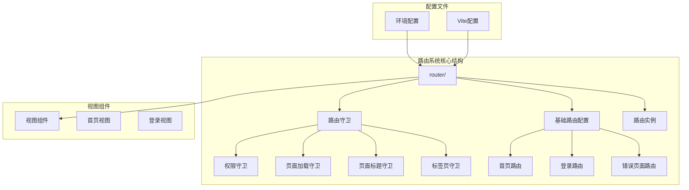

**图表来源**
- [router/index.js](file://forge-admin-ui/src/router/index.js#L1-L18)
- [router/basic-routes.js](file://forge-admin-ui/src/router/basic-routes.js#L1-L86)
- [router/guards/index.js](file://forge-admin-ui/src/router/guards/index.js#L1-L12)

**章节来源**
- [router/index.js](file://forge-admin-ui/src/router/index.js#L1-L18)
- [router/basic-routes.js](file://forge-admin-ui/src/router/basic-routes.js#L1-L86)
- [vite.config.js](file://forge-admin-ui/vite.config.js#L1-L86)

## 核心组件

### 路由实例配置

路由实例通过`createRouter`函数创建，支持两种历史模式：

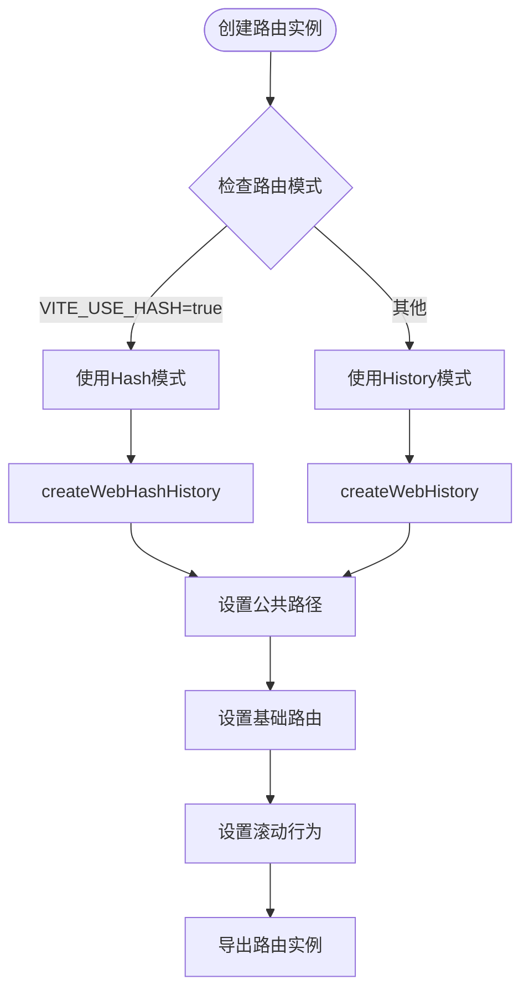

**图表来源**
- [router/index.js](file://forge-admin-ui/src/router/index.js#L5-L12)

### 基础路由配置

系统提供8个基础路由，涵盖登录、首页、错误页面等核心功能：

| 路由名称 | 路径 | 组件 | 元信息 |
|---------|------|------|--------|
| Login | /login | 登录视图 | title: 登录页, layout: empty |
| Home | / | 首页视图 | title: 首页 |
| 404 | /404 | 404视图 | title: 页面飞走了, layout: empty |
| 403 | /403 | 403视图 | title: 没有权限, layout: empty |
| iframe | /iframe | iframe视图 | title: iframe |
| NoticeList | /system/notice-list | 通知公告视图 | title: 通知公告 |
| MessageTemplate | /message/template | 消息模板视图 | title: 消息模板管理 |
| UserProfile | /profile | 个人中心视图 | title: 个人中心 |

**章节来源**
- [router/basic-routes.js](file://forge-admin-ui/src/router/basic-routes.js#L1-L86)

## 架构概览

### 路由系统整体架构

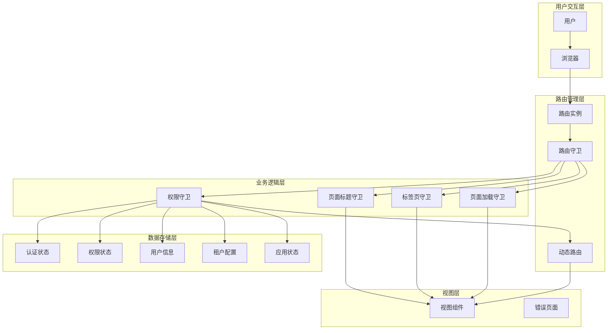

**图表来源**
- [router/index.js](file://forge-admin-ui/src/router/index.js#L1-L18)
- [router/guards/index.js](file://forge-admin-ui/src/router/guards/index.js#L1-L12)
- [router/guards/permission-guard.js](file://forge-admin-ui/src/router/guards/permission-guard.js#L84-L547)

### 路由守卫执行流程

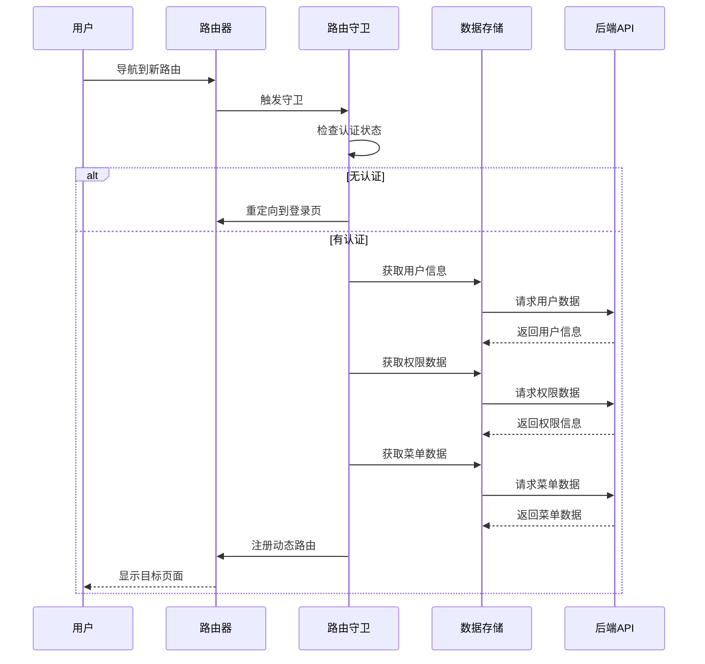

**图表来源**
- [router/guards/permission-guard.js](file://forge-admin-ui/src/router/guards/permission-guard.js#L84-L200)

**章节来源**
- [router/guards/index.js](file://forge-admin-ui/src/router/guards/index.js#L1-L12)
- [router/guards/permission-guard.js](file://forge-admin-ui/src/router/guards/permission-guard.js#L84-L547)

## 详细组件分析

### 路由历史模式选择

系统支持两种路由历史模式，通过环境变量进行配置：

#### Hash模式配置

Hash模式使用URL中的hash部分来模拟完整URL，适用于静态服务器部署场景：

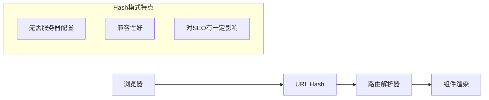

#### History模式配置

History模式使用HTML5 History API，提供更干净的URL，但需要服务器配置支持：

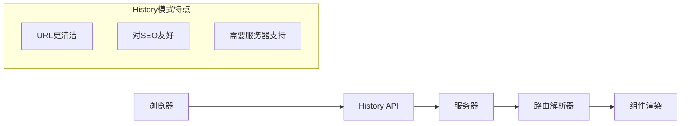

**章节来源**
- [router/index.js](file://forge-admin-ui/src/router/index.js#L6-L9)

### 路由元信息设计

路由元信息通过`meta`字段实现，包含页面标题、布局配置等信息：

#### 元信息字段说明

| 字段名 | 类型 | 描述 | 示例值 |
|--------|------|------|--------|
| title | string | 页面标题 | '首页', '登录页' |
| layout | string | 页面布局类型 | 'normal', 'empty', 'full' |
| icon | string | 页面图标 | 'ai-icon:home' |
| keepAlive | boolean | 是否缓存组件 | true, false |
| parentKey | string | 父级菜单键值 | 'system-menu' |

#### 元信息使用示例

```mermaid
classDiagram
class RouteMeta {
+string title
+string layout
+string icon
+boolean keepAlive
+string parentKey
}
class BasicRoute {
+string name
+string path
+Function component
+RouteMeta meta
}
class LoginRoute {
+string name : "Login"
+string path : "/login"
+Function component
+RouteMeta meta : {title : "登录页", layout : "empty"}
}
class HomeRoute {
+string name : "Home"
+string path : "/"
+Function component
+RouteMeta meta : {title : "首页"}
}
BasicRoute <|-- LoginRoute
BasicRoute <|-- HomeRoute
```

**图表来源**
- [router/basic-routes.js](file://forge-admin-ui/src/router/basic-routes.js#L6-L18)

**章节来源**
- [router/basic-routes.js](file://forge-admin-ui/src/router/basic-routes.js#L6-L18)

### 路由命名规范

系统采用统一的路由命名规范，确保路由名称的可读性和一致性：

#### 命名规则

1. **基础路由命名**：使用英文单词，首字母大写
   - `Login`, `Home`, `NotFound`

2. **系统路由命名**：使用`模块名/功能名`格式
   - `system/user`, `system/role`, `message/template`

3. **动态路由命名**：使用路径转换规则
   - `/system/user` → `system-user`

#### 命名示例对比

| 路径 | 命名方式 | 最终名称 |
|------|----------|----------|
| /login | 直接使用 | Login |
| / | 直接使用 | Home |
| /system/user | 路径转换 | system-user |
| /message/template | 路径转换 | message-template |

**章节来源**
- [router/basic-routes.js](file://forge-admin-ui/src/router/basic-routes.js#L3-L84)

### 路由层级结构

系统支持多层级路由结构，通过嵌套路由实现复杂的页面布局：

```mermaid
graph TD
Root[/] --> Home[首页]
Root --> System[系统管理]
Root --> Message[消息中心]
System --> User[用户管理]
System --> Role[角色管理]
System --> Menu[菜单管理]
Message --> Template[模板管理]
Message --> List[消息列表]
subgraph "布局结构"
Empty[empty布局 - 登录页]
Normal[normal布局 - 主要页面]
Full[full布局 - 全屏页面]
end
Home -.-> Normal
User -.-> Normal
Role -.-> Normal
Login -.-> Empty
Template -.-> Full
```

**章节来源**
- [router/basic-routes.js](file://forge-admin-ui/src/router/basic-routes.js#L1-L86)

### 路由懒加载实现

系统采用动态导入实现路由懒加载，提升应用启动性能：

#### 懒加载实现方式

```mermaid
flowchart TD
Request[路由请求] --> CheckComponent{检查组件}
CheckComponent --> |已加载| Render[直接渲染]
CheckComponent --> |未加载| LazyLoad[动态导入]
LazyLoad --> ImportModule[import('@/views/home/index.vue')]
ImportModule --> LoadComponent[加载组件模块]
LoadComponent --> CacheComponent[缓存组件]
CacheComponent --> Render
subgraph "性能优化"
SplitChunks[代码分割]
Preload[预加载策略]
AsyncLoad[异步加载]
end
```

**图表来源**
- [router/basic-routes.js](file://forge-admin-ui/src/router/basic-routes.js#L5-L15)

#### 动态导入语法

系统使用箭头函数形式的动态导入：
- `() => import('@/views/login/index.vue')`
- `() => import('@/views/home/index.vue')`

这种方式确保组件只在路由访问时才加载，实现真正的懒加载效果。

**章节来源**
- [router/basic-routes.js](file://forge-admin-ui/src/router/basic-routes.js#L5-L15)

### 路由组件动态导入

系统支持运行时动态注册路由组件，实现灵活的路由管理：

#### 动态注册流程

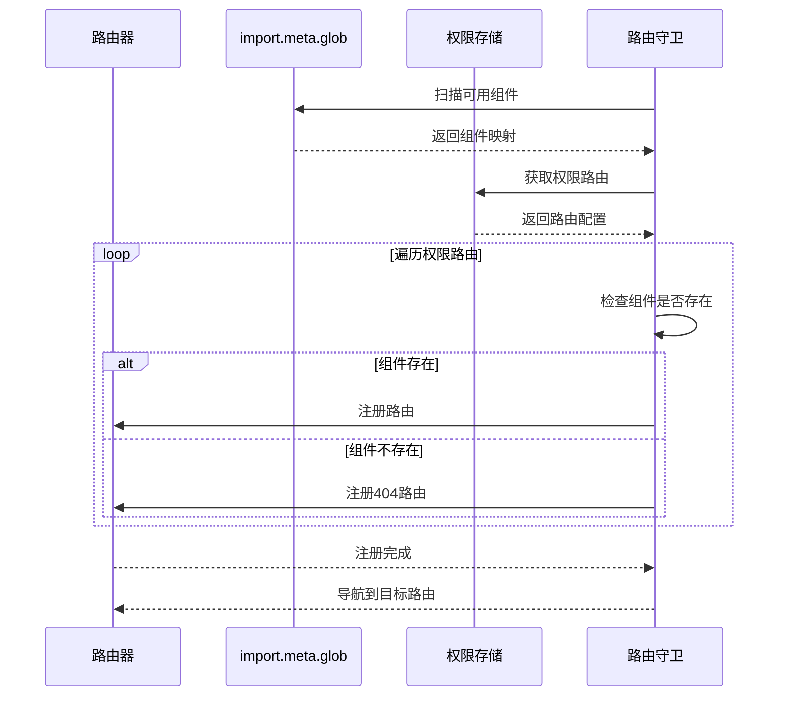

**图表来源**
- [router/guards/permission-guard.js](file://forge-admin-ui/src/router/guards/permission-guard.js#L164-L192)

**章节来源**
- [router/guards/permission-guard.js](file://forge-admin-ui/src/router/guards/permission-guard.js#L164-L192)

### 路由预加载策略

系统实现了智能的路由预加载策略，平衡性能和用户体验：

#### 预加载实现

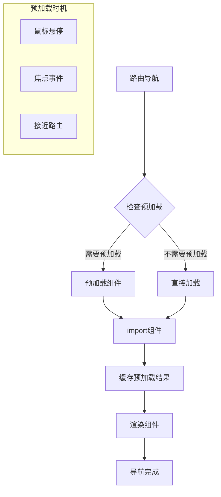

**章节来源**
- [router/guards/permission-guard.js](file://forge-admin-ui/src/router/guards/permission-guard.js#L164-L192)

## 依赖关系分析

### 路由系统依赖图

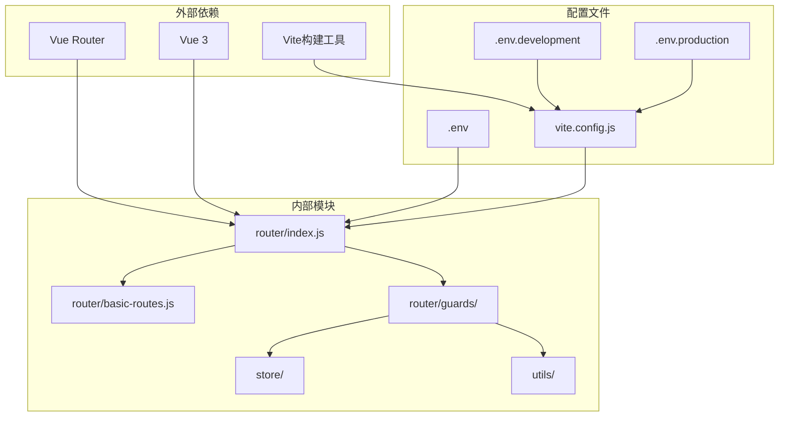

**图表来源**
- [router/index.js](file://forge-admin-ui/src/router/index.js#L1-L3)
- [vite.config.js](file://forge-admin-ui/vite.config.js#L13-L38)

### 路由守卫依赖关系

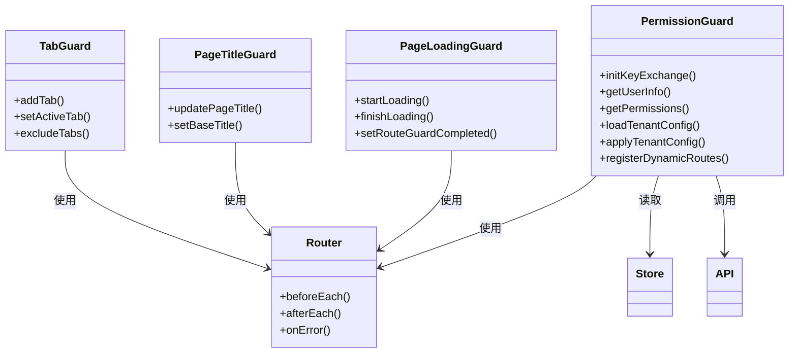

**图表来源**
- [router/guards/index.js](file://forge-admin-ui/src/router/guards/index.js#L6-L11)
- [router/guards/permission-guard.js](file://forge-admin-ui/src/router/guards/permission-guard.js#L84-L547)

**章节来源**
- [router/guards/index.js](file://forge-admin-ui/src/router/guards/index.js#L1-L12)
- [router/guards/permission-guard.js](file://forge-admin-ui/src/router/guards/permission-guard.js#L84-L547)

## 性能考虑

### 路由性能优化策略

系统采用了多项性能优化策略来提升路由系统的响应速度和用户体验：

#### 代码分割优化

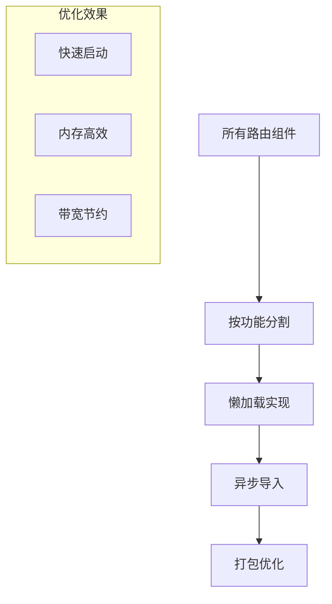

#### 缓存策略

系统实现了多层次的缓存机制：

1. **组件缓存**：动态导入的组件会被缓存
2. **路由缓存**：已注册的路由信息会被缓存
3. **数据缓存**：用户信息和权限数据会被缓存

#### 预加载策略

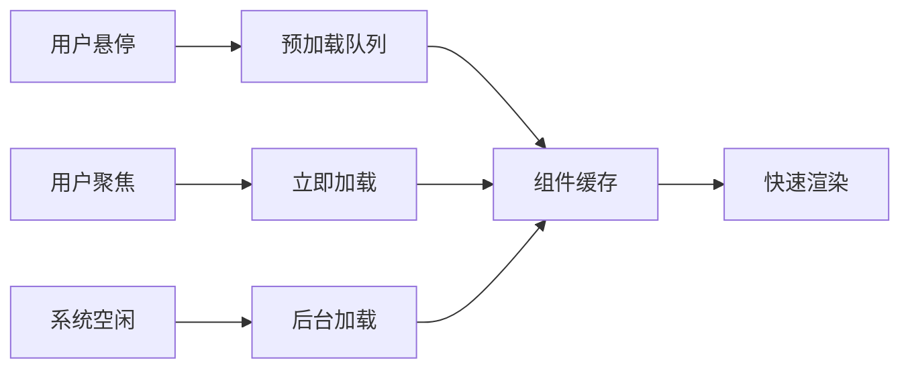

**章节来源**
- [router/guards/permission-guard.js](file://forge-admin-ui/src/router/guards/permission-guard.js#L164-L192)

## 故障排除指南

### 常见路由问题及解决方案

#### 路由守卫循环重定向

**问题描述**：用户在登录状态下访问登录页面导致无限重定向

**解决方案**：
```javascript
// 检查token状态，避免循环重定向
if (token && to.path === '/login') {
    next({ path: '/' })
    return
}
```

#### 动态路由注册失败

**问题描述**：动态路由组件无法正确注册

**解决方案**：
```javascript
// 检查组件是否存在
if (routeComponents[route.component]) {
    route.component = routeComponents[route.component]
    router.addRoute(route)
} else {
    // 创建404路由替代
    const notFoundRoute = {
        ...route,
        component: routeComponents['/src/views/error-page/404.vue']
    }
    router.addRoute(notFoundRoute)
}
```

#### 页面标题不更新

**问题描述**：页面切换后标题没有变化

**解决方案**：
```javascript
// 确保页面标题守卫正确执行
router.afterEach((to) => {
    const pageTitle = to.meta?.title
    if (pageTitle) {
        document.title = `${pageTitle} | ${baseTitle}`
    }
})
```

#### 标签页重复添加

**问题描述**：相同页面多次打开导致标签页重复

**解决方案**：
```javascript
// 检查是否已存在相同path的tab
const existingTab = tabStore.tabs.find(item => item.path === path)
if (!existingTab) {
    tabStore.addTab({ name, path, title, icon, keepAlive, key: path })
}
```

**章节来源**
- [router/guards/permission-guard.js](file://forge-admin-ui/src/router/guards/permission-guard.js#L92-L112)
- [router/guards/page-title-guard.js](file://forge-admin-ui/src/router/guards/page-title-guard.js#L4-L12)
- [router/guards/tab-guard.js](file://forge-admin-ui/src/router/guards/tab-guard.js#L32-L38)

## 结论

Forge前端路由配置管理系统提供了完整的路由解决方案，具有以下优势：

### 核心特性总结

1. **灵活的历史模式支持**：支持Hash和History两种模式，适应不同部署需求
2. **完善的元信息设计**：通过meta字段实现丰富的页面配置
3. **智能的懒加载机制**：提升应用启动性能和用户体验
4. **强大的权限控制**：基于角色的动态路由注册和权限验证
5. **多环境配置管理**：支持开发、测试、生产多环境的灵活配置
6. **全面的路由守卫**：提供完整的导航控制和状态管理

### 最佳实践建议

1. **路由命名规范**：遵循统一的命名规范，确保路由名称的可读性
2. **元信息完整性**：为每个路由配置完整的meta信息
3. **性能优化策略**：合理使用懒加载和预加载，平衡性能和体验
4. **错误处理机制**：完善404和403页面，提供良好的用户体验
5. **权限控制策略**：建立完善的权限体系，确保系统安全性

该路由系统为企业级应用提供了稳定、高效的前端路由解决方案，能够满足复杂业务场景的需求。