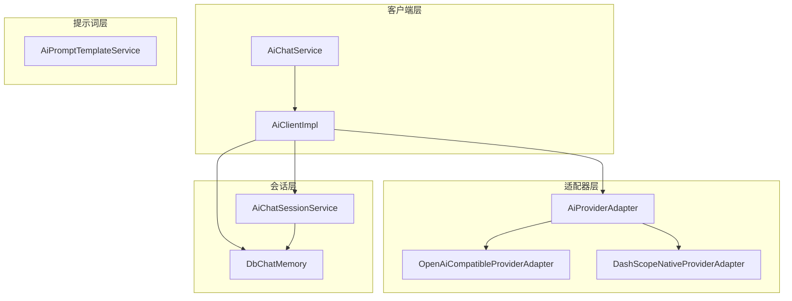
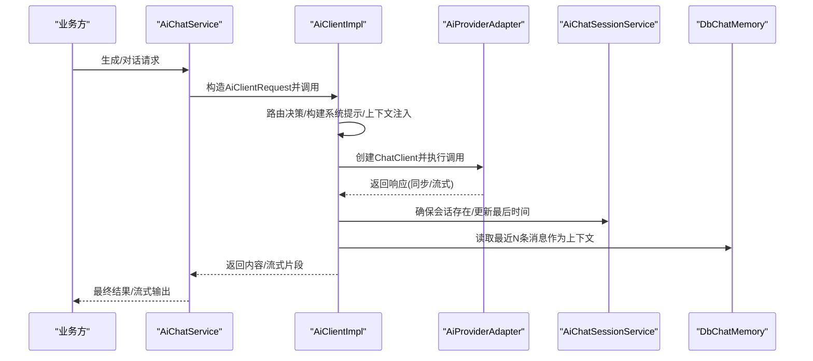
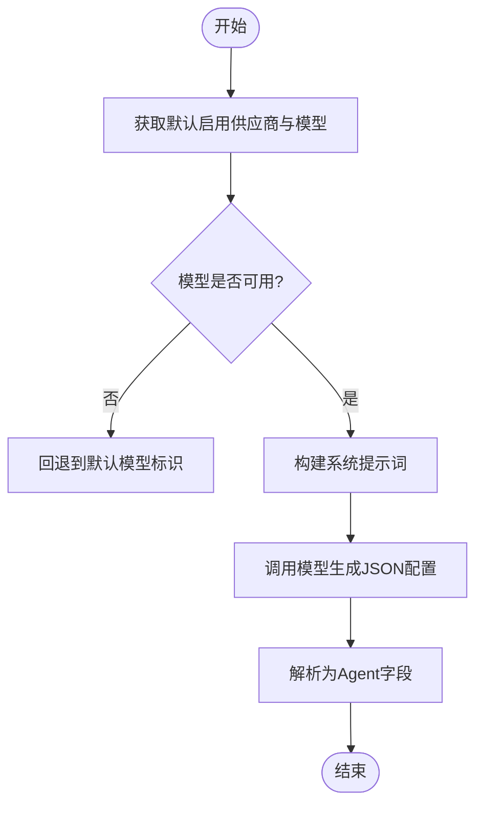
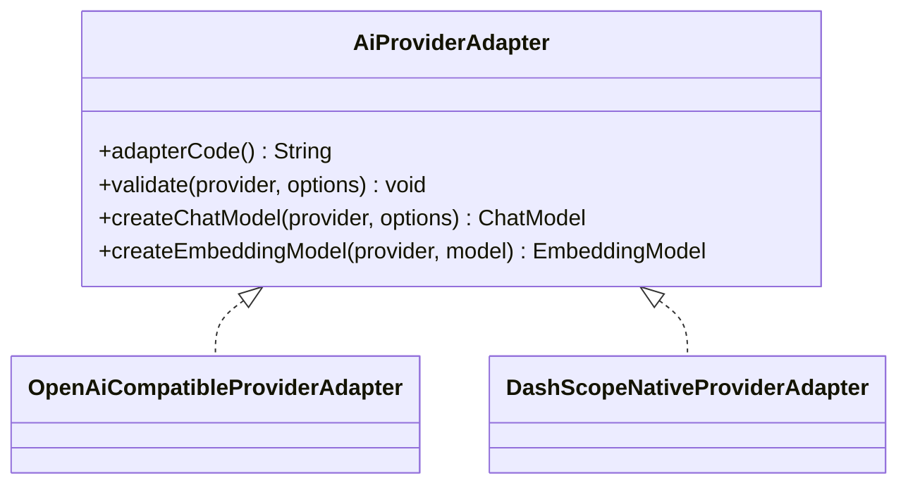
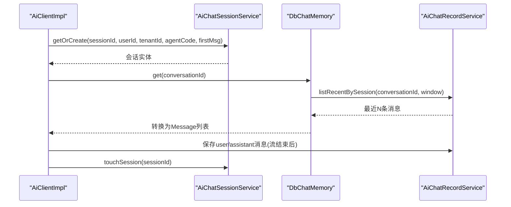
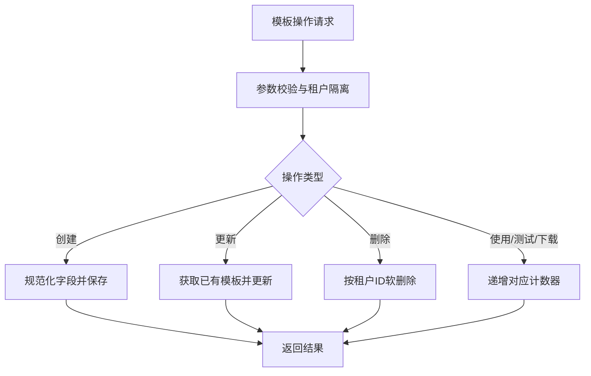
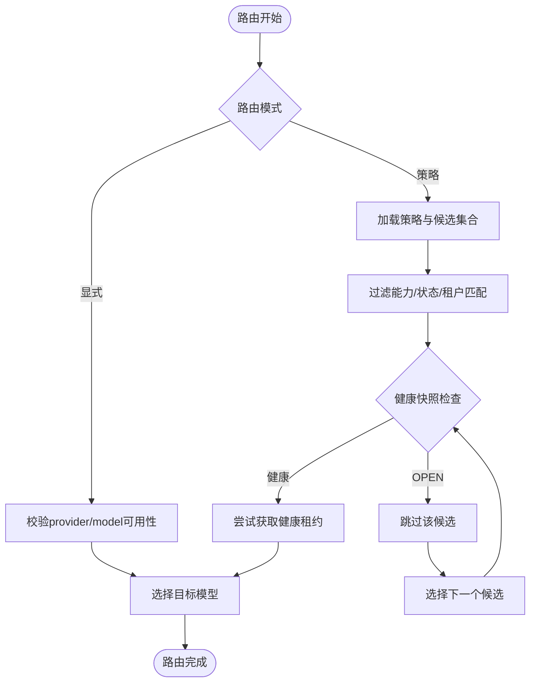
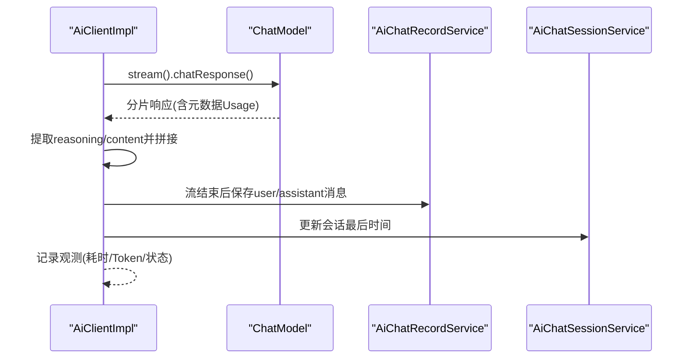
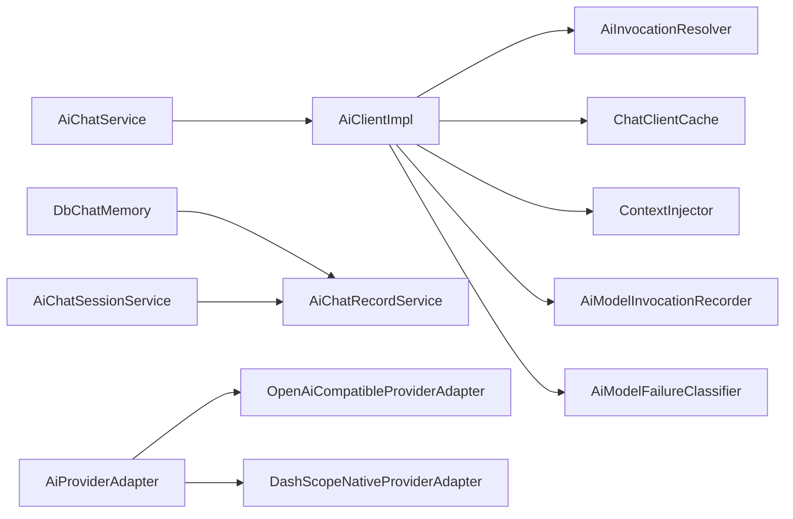

# AI能力服务

<cite>
**本文引用的文件**
- [AiClientImpl.java](file://forge-server/forge-framework/forge-plugin-parent/forge-plugin-ai/src/main/java/com/mdframe/forge/plugin/ai/client/AiClientImpl.java)
- [AiChatService.java](file://forge-server/forge-framework/forge-plugin-parent/forge-plugin-ai/src/main/java/com/mdframe/forge/plugin/ai/chat/service/AiChatService.java)
- [AiProviderAdapter.java](file://forge-server/forge-framework/forge-plugin-parent/forge-plugin-ai/src/main/java/com/mdframe/forge/plugin/ai/provider/adapter/AiProviderAdapter.java)
- [OpenAiCompatibleProviderAdapter.java](file://forge-server/forge-framework/forge-plugin-parent/forge-plugin-ai/src/main/java/com/mdframe/forge/plugin/ai/provider/adapter/OpenAiCompatibleProviderAdapter.java)
- [DashScopeNativeProviderAdapter.java](file://forge-server/forge-framework/forge-plugin-parent/forge-plugin-ai/src/main/java/com/mdframe/forge/plugin/ai/provider/adapter/DashScopeNativeProviderAdapter.java)
- [AiChatSessionService.java](file://forge-server/forge-framework/forge-plugin-parent/forge-plugin-ai/src/main/java/com/mdframe/forge/plugin/ai/session/service/AiChatSessionService.java)
- [DbChatMemory.java](file://forge-server/forge-framework/forge-plugin-parent/forge-plugin-ai/src/main/java/com/mdframe/forge/plugin/ai/chat/memory/DbChatMemory.java)
- [AiPromptTemplateService.java](file://forge-server/forge-framework/forge-plugin-parent/forge-plugin-ai/src/main/java/com/mdframe/forge/plugin/ai/prompt/service/AiPromptTemplateService.java)
- [AgentFieldGenerator.java](file://forge-server/forge-framework/forge-plugin-parent/forge-plugin-ai/src/main/java/com/mdframe/forge/plugin/ai/agent/engine/create/AgentFieldGenerator.java)
- [PolicyBasedAiModelRouterTest.java](file://forge-server/forge-framework/forge-plugin-parent/forge-plugin-ai/src/test/java/com/mdframe/forge/plugin/ai/routing/PolicyBasedAiModelRouterTest.java)
- [spec.md](file://code-copilot/changes/archive/2026-07-11-ai-model-routing-governance/spec.md)
</cite>

## 目录
1. [简介](#简介)
2. [项目结构](#项目结构)
3. [核心组件](#核心组件)
4. [架构总览](#架构总览)
5. [详细组件分析](#详细组件分析)
6. [依赖关系分析](#依赖关系分析)
7. [性能与优化](#性能与优化)
8. [故障排查指南](#故障排查指南)
9. [结论](#结论)
10. [附录](#附录)

## 简介
本技术文档聚焦于AI能力服务的实现，覆盖智能体管理、AI供应商配置、会话管理与提示词模板库的服务层设计。重点阐述AI代理模式的设计思想与实现机制，包括模型路由、负载均衡与故障转移策略；解释多供应商抽象层如何统一对接OpenAI、阿里百炼、智谱等提供商；并给出会话状态管理、上下文持久化与并发控制方案，以及调用性能优化、缓存策略与错误处理机制。

## 项目结构
AI能力服务位于插件模块中，围绕“客户端-适配器-会话-提示词”四个层次组织：
- 客户端层：统一的AI调用入口，负责请求解析、系统提示构建、流式/同步调用、观测记录与会话持久化。
- 适配器层：以接口抽象不同AI供应商，屏蔽底层差异，提供Chat与Embedding模型创建能力。
- 会话层：会话生命周期管理、消息历史加载、统计指标计算。
- 提示词层：模板的增删改查、使用计数、租户隔离与查询限制。

**图表来源**
- [AiClientImpl.java:1-419](file://forge-server/forge-framework/forge-plugin-parent/forge-plugin-ai/src/main/java/com/mdframe/forge/plugin/ai/client/AiClientImpl.java#L1-L419)
- [AiChatService.java:1-139](file://forge-server/forge-framework/forge-plugin-parent/forge-plugin-ai/src/main/java/com/mdframe/forge/plugin/ai/chat/service/AiChatService.java#L1-L139)
- [AiProviderAdapter.java:1-45](file://forge-server/forge-framework/forge-plugin-parent/forge-plugin-ai/src/main/java/com/mdframe/forge/plugin/ai/provider/adapter/AiProviderAdapter.java#L1-L45)
- [OpenAiCompatibleProviderAdapter.java](file://forge-server/forge-framework/forge-plugin-parent/forge-plugin-ai/src/main/java/com/mdframe/forge/plugin/ai/provider/adapter/OpenAiCompatibleProviderAdapter.java)
- [DashScopeNativeProviderAdapter.java](file://forge-server/forge-framework/forge-plugin-parent/forge-plugin-ai/src/main/java/com/mdframe/forge/plugin/ai/provider/adapter/DashScopeNativeProviderAdapter.java)
- [AiChatSessionService.java:1-260](file://forge-server/forge-framework/forge-plugin-parent/forge-plugin-ai/src/main/java/com/mdframe/forge/plugin/ai/session/service/AiChatSessionService.java#L1-L260)
- [DbChatMemory.java:1-93](file://forge-server/forge-framework/forge-plugin-parent/forge-plugin-ai/src/main/java/com/mdframe/forge/plugin/ai/chat/memory/DbChatMemory.java#L1-L93)
- [AiPromptTemplateService.java:1-219](file://forge-server/forge-framework/forge-plugin-parent/forge-plugin-ai/src/main/java/com/mdframe/forge/plugin/ai/prompt/service/AiPromptTemplateService.java#L1-L219)

**章节来源**
- [AiClientImpl.java:1-419](file://forge-server/forge-framework/forge-plugin-parent/forge-plugin-ai/src/main/java/com/mdframe/forge/plugin/ai/client/AiClientImpl.java#L1-L419)
- [AiChatService.java:1-139](file://forge-server/forge-framework/forge-plugin-parent/forge-plugin-ai/src/main/java/com/mdframe/forge/plugin/ai/chat/service/AiChatService.java#L1-L139)
- [AiProviderAdapter.java:1-45](file://forge-server/forge-framework/forge-plugin-parent/forge-plugin-ai/src/main/java/com/mdframe/forge/plugin/ai/provider/adapter/AiProviderAdapter.java#L1-L45)
- [AiChatSessionService.java:1-260](file://forge-server/forge-framework/forge-plugin-parent/forge-plugin-ai/src/main/java/com/mdframe/forge/plugin/ai/session/service/AiChatSessionService.java#L1-L260)
- [DbChatMemory.java:1-93](file://forge-server/forge-framework/forge-plugin-parent/forge-plugin-ai/src/main/java/com/mdframe/forge/plugin/ai/chat/memory/DbChatMemory.java#L1-L93)
- [AiPromptTemplateService.java:1-219](file://forge-server/forge-framework/forge-plugin-parent/forge-plugin-ai/src/main/java/com/mdframe/forge/plugin/ai/prompt/service/AiPromptTemplateService.java#L1-L219)

## 核心组件
- AI客户端（AiClientImpl）：统一封装同步与流式调用，负责路由决策、系统提示构建、上下文注入、会话持久化、观测记录与失败分类。
- 聊天服务（AiChatService）：面向业务场景（如仪表盘生成、对话流）组装请求参数，调用客户端完成生成或流式输出。
- 供应商适配器（AiProviderAdapter及实现）：抽象Chat与Embedding模型创建，支持OpenAI兼容与阿里百炼原生适配。
- 会话服务（AiChatSessionService）：会话创建/重命名/置顶/删除、用户侧分页、统计与体验指标计算。
- 数据库对话记忆（DbChatMemory）：基于数据库的消息历史读取与清理，控制上下文窗口大小。
- 提示词模板服务（AiPromptTemplateService）：模板CRUD、使用计数、租户隔离、查询限制与安全裁剪。
- 智能体字段生成（AgentFieldGenerator）：通过默认Chat模型生成Agent配置字段，便于快速初始化智能体。

**章节来源**
- [AiClientImpl.java:57-117](file://forge-server/forge-framework/forge-plugin-parent/forge-plugin-ai/src/main/java/com/mdframe/forge/plugin/ai/client/AiClientImpl.java#L57-L117)
- [AiClientImpl.java:119-247](file://forge-server/forge-framework/forge-plugin-parent/forge-plugin-ai/src/main/java/com/mdframe/forge/plugin/ai/client/AiClientImpl.java#L119-L247)
- [AiChatService.java:25-74](file://forge-server/forge-framework/forge-plugin-parent/forge-plugin-ai/src/main/java/com/mdframe/forge/plugin/ai/chat/service/AiChatService.java#L25-L74)
- [AiProviderAdapter.java:10-44](file://forge-server/forge-framework/forge-plugin-parent/forge-plugin-ai/src/main/java/com/mdframe/forge/plugin/ai/provider/adapter/AiProviderAdapter.java#L10-L44)
- [AiChatSessionService.java:34-72](file://forge-server/forge-framework/forge-plugin-parent/forge-plugin-ai/src/main/java/com/mdframe/forge/plugin/ai/session/service/AiChatSessionService.java#L34-L72)
- [DbChatMemory.java:25-93](file://forge-server/forge-framework/forge-plugin-parent/forge-plugin-ai/src/main/java/com/mdframe/forge/plugin/ai/chat/memory/DbChatMemory.java#L25-L93)
- [AiPromptTemplateService.java:31-97](file://forge-server/forge-framework/forge-plugin-parent/forge-plugin-ai/src/main/java/com/mdframe/forge/plugin/ai/prompt/service/AiPromptTemplateService.java#L31-L97)
- [AgentFieldGenerator.java:30-58](file://forge-server/forge-framework/forge-plugin-parent/forge-plugin-ai/src/main/java/com/mdframe/forge/plugin/ai/agent/engine/create/AgentFieldGenerator.java#L30-L58)

## 架构总览
AI能力服务采用分层与适配器模式：
- 上层业务通过AiChatService发起生成或对话请求。
- AiClientImpl作为统一入口，进行路由决策、系统提示构建、会话上下文注入、调用执行与结果持久化。
- 通过AiProviderAdapter抽象不同供应商，OpenAI兼容与阿里百炼原生适配器分别实现具体模型创建。
- 会话与上下文由AiChatSessionService与DbChatMemory协同管理，保证跨请求的多轮对话一致性。
- 提示词模板服务提供可配置的提示词管理能力，支撑不同业务场景的提示词复用。

**图表来源**
- [AiChatService.java:25-74](file://forge-server/forge-framework/forge-plugin-parent/forge-plugin-ai/src/main/java/com/mdframe/forge/plugin/ai/chat/service/AiChatService.java#L25-L74)
- [AiClientImpl.java:57-117](file://forge-server/forge-framework/forge-plugin-parent/forge-plugin-ai/src/main/java/com/mdframe/forge/plugin/ai/client/AiClientImpl.java#L57-L117)
- [AiProviderAdapter.java:10-44](file://forge-server/forge-framework/forge-plugin-parent/forge-plugin-ai/src/main/java/com/mdframe/forge/plugin/ai/provider/adapter/AiProviderAdapter.java#L10-L44)
- [AiChatSessionService.java:34-72](file://forge-server/forge-framework/forge-plugin-parent/forge-plugin-ai/src/main/java/com/mdframe/forge/plugin/ai/session/service/AiChatSessionService.java#L34-L72)
- [DbChatMemory.java:48-66](file://forge-server/forge-framework/forge-plugin-parent/forge-plugin-ai/src/main/java/com/mdframe/forge/plugin/ai/chat/memory/DbChatMemory.java#L48-L66)

## 详细组件分析

### 智能体管理与字段生成
- Agent字段生成器通过默认Chat模型生成Agent名称、描述、问候语、预设问题、系统指令与保持项等配置，便于快速创建智能体。
- 生成过程会获取启用的默认供应商与模型，若未配置则回退到通用模型标识。

**图表来源**
- [AgentFieldGenerator.java:30-58](file://forge-server/forge-framework/forge-plugin-parent/forge-plugin-ai/src/main/java/com/mdframe/forge/plugin/ai/agent/engine/create/AgentFieldGenerator.java#L30-L58)

**章节来源**
- [AgentFieldGenerator.java:30-58](file://forge-server/forge-framework/forge-plugin-parent/forge-plugin-ai/src/main/java/com/mdframe/forge/plugin/ai/agent/engine/create/AgentFieldGenerator.java#L30-L58)

### 多供应商抽象层与适配器实现
- 适配器接口定义稳定代码、校验、Chat与Embedding模型创建方法，屏蔽供应商差异。
- OpenAI兼容适配器与阿里百炼原生适配器分别实现具体逻辑，使上层无需关心底层细节。

**图表来源**
- [AiProviderAdapter.java:10-44](file://forge-server/forge-framework/forge-plugin-parent/forge-plugin-ai/src/main/java/com/mdframe/forge/plugin/ai/provider/adapter/AiProviderAdapter.java#L10-L44)
- [OpenAiCompatibleProviderAdapter.java](file://forge-server/forge-framework/forge-plugin-parent/forge-plugin-ai/src/main/java/com/mdframe/forge/plugin/ai/provider/adapter/OpenAiCompatibleProviderAdapter.java)
- [DashScopeNativeProviderAdapter.java](file://forge-server/forge-framework/forge-plugin-parent/forge-plugin-ai/src/main/java/com/mdframe/forge/plugin/ai/provider/adapter/DashScopeNativeProviderAdapter.java)

**章节来源**
- [AiProviderAdapter.java:10-44](file://forge-server/forge-framework/forge-plugin-parent/forge-plugin-ai/src/main/java/com/mdframe/forge/plugin/ai/provider/adapter/AiProviderAdapter.java#L10-L44)

### 会话管理与上下文持久化
- 会话服务提供幂等的“获取或创建”能力，自动设置标题、状态与更新时间，支持软删除、置顶与用户侧分页。
- 数据库对话记忆按会话读取最近N条消息，控制上下文窗口避免超出Token限制，并在流结束后统一落库，减少重复写入。

**图表来源**
- [AiClientImpl.java:373-417](file://forge-server/forge-framework/forge-plugin-parent/forge-plugin-ai/src/main/java/com/mdframe/forge/plugin/ai/client/AiClientImpl.java#L373-L417)
- [AiChatSessionService.java:34-72](file://forge-server/forge-framework/forge-plugin-parent/forge-plugin-ai/src/main/java/com/mdframe/forge/plugin/ai/session/service/AiChatSessionService.java#L34-L72)
- [DbChatMemory.java:48-66](file://forge-server/forge-framework/forge-plugin-parent/forge-plugin-ai/src/main/java/com/mdframe/forge/plugin/ai/chat/memory/DbChatMemory.java#L48-L66)

**章节来源**
- [AiChatSessionService.java:34-72](file://forge-server/forge-framework/forge-plugin-parent/forge-plugin-ai/src/main/java/com/mdframe/forge/plugin/ai/session/service/AiChatSessionService.java#L34-L72)
- [DbChatMemory.java:25-93](file://forge-server/forge-framework/forge-plugin-parent/forge-plugin-ai/src/main/java/com/mdframe/forge/plugin/ai/chat/memory/DbChatMemory.java#L25-L93)
- [AiClientImpl.java:373-417](file://forge-server/forge-framework/forge-plugin-parent/forge-plugin-ai/src/main/java/com/mdframe/forge/plugin/ai/client/AiClientImpl.java#L373-L417)

### 提示词模板库
- 提供管理员分页、启用列表、详情、创建/更新/删除、使用/测试/下载计数递增等功能。
- 对输入进行安全裁剪与长度限制，租户隔离，防止越权与数据污染。

**图表来源**
- [AiPromptTemplateService.java:31-97](file://forge-server/forge-framework/forge-plugin-parent/forge-plugin-ai/src/main/java/com/mdframe/forge/plugin/ai/prompt/service/AiPromptTemplateService.java#L31-L97)
- [AiPromptTemplateService.java:117-167](file://forge-server/forge-framework/forge-plugin-parent/forge-plugin-ai/src/main/java/com/mdframe/forge/plugin/ai/prompt/service/AiPromptTemplateService.java#L117-L167)

**章节来源**
- [AiPromptTemplateService.java:31-97](file://forge-server/forge-framework/forge-plugin-parent/forge-plugin-ai/src/main/java/com/mdframe/forge/plugin/ai/prompt/service/AiPromptTemplateService.java#L31-L97)
- [AiPromptTemplateService.java:117-167](file://forge-server/forge-framework/forge-plugin-parent/forge-plugin-ai/src/main/java/com/mdframe/forge/plugin/ai/prompt/service/AiPromptTemplateService.java#L117-L167)

### 模型路由、负载均衡与故障转移
- 路由策略支持显式指定provider/model或基于策略选择候选模型；候选需满足启用、能力匹配、未逻辑删除且非OPEN状态。
- 健康快照用于跳过已知OPEN候选，选择下一个健康候选；熔断键包含租户、供应商主键与模型主键，避免跨租户误用。
- 调用前跳过已知OPEN候选，网络调用失败后本次请求立即结束，不自动重试或跨供应商补发，避免重复计费与副作用。

**图表来源**
- [PolicyBasedAiModelRouterTest.java:26-94](file://forge-server/forge-framework/forge-plugin-parent/forge-plugin-ai/src/test/java/com/mdframe/forge/plugin/ai/routing/PolicyBasedAiModelRouterTest.java#L26-L94)
- [spec.md:22-70](file://code-copilot/changes/archive/2026-07-11-ai-model-routing-governance/spec.md#L22-L70)

**章节来源**
- [PolicyBasedAiModelRouterTest.java:26-94](file://forge-server/forge-framework/forge-plugin-parent/forge-plugin-ai/src/test/java/com/mdframe/forge/plugin/ai/routing/PolicyBasedAiModelRouterTest.java#L26-L94)
- [spec.md:22-70](file://code-copilot/changes/archive/2026-07-11-ai-model-routing-governance/spec.md#L22-L70)

### 流式调用与上下文拼接
- 流式调用在订阅时标记已派发，逐块提取思考过程与回复内容，拼接分隔符后输出。
- 结束时根据信号类型记录观测结果，区分成功、失败与取消，并异步持久化完整内容。

**图表来源**
- [AiClientImpl.java:119-247](file://forge-server/forge-framework/forge-plugin-parent/forge-plugin-ai/src/main/java/com/mdframe/forge/plugin/ai/client/AiClientImpl.java#L119-L247)
- [AiClientImpl.java:373-417](file://forge-server/forge-framework/forge-plugin-parent/forge-plugin-ai/src/main/java/com/mdframe/forge/plugin/ai/client/AiClientImpl.java#L373-L417)

**章节来源**
- [AiClientImpl.java:119-247](file://forge-server/forge-framework/forge-plugin-parent/forge-plugin-ai/src/main/java/com/mdframe/forge/plugin/ai/client/AiClientImpl.java#L119-L247)

## 依赖关系分析
- AiClientImpl依赖AiInvocationResolver进行路由决策，依赖ChatClientCache管理基础与会话级ChatClient，依赖ContextInjector注入上下文，依赖AiModelInvocationRecorder记录观测，依赖AiModelFailureClassifier分类失败原因。
- AiChatService依赖AiClient对外暴露业务场景能力。
- DbChatMemory依赖AiChatRecordService读取与清理消息历史。
- AiChatSessionService依赖AiChatRecordService进行消息软删除与统计。
- 适配器层通过AiProviderAdapter统一抽象，OpenAI兼容与阿里百炼原生适配器分别实现。

**图表来源**
- [AiClientImpl.java:43-55](file://forge-server/forge-framework/forge-plugin-parent/forge-plugin-ai/src/main/java/com/mdframe/forge/plugin/ai/client/AiClientImpl.java#L43-L55)
- [AiChatService.java:16-23](file://forge-server/forge-framework/forge-plugin-parent/forge-plugin-ai/src/main/java/com/mdframe/forge/plugin/ai/chat/service/AiChatService.java#L16-L23)
- [DbChatMemory.java:22-30](file://forge-server/forge-framework/forge-plugin-parent/forge-plugin-ai/src/main/java/com/mdframe/forge/plugin/ai/chat/memory/DbChatMemory.java#L22-L30)
- [AiChatSessionService.java:25-32](file://forge-server/forge-framework/forge-plugin-parent/forge-plugin-ai/src/main/java/com/mdframe/forge/plugin/ai/session/service/AiChatSessionService.java#L25-L32)
- [AiProviderAdapter.java:10-44](file://forge-server/forge-framework/forge-plugin-parent/forge-plugin-ai/src/main/java/com/mdframe/forge/plugin/ai/provider/adapter/AiProviderAdapter.java#L10-L44)

**章节来源**
- [AiClientImpl.java:43-55](file://forge-server/forge-framework/forge-plugin-parent/forge-plugin-ai/src/main/java/com/mdframe/forge/plugin/ai/client/AiClientImpl.java#L43-L55)
- [AiChatService.java:16-23](file://forge-server/forge-framework/forge-plugin-parent/forge-plugin-ai/src/main/java/com/mdframe/forge/plugin/ai/chat/service/AiChatService.java#L16-L23)
- [DbChatMemory.java:22-30](file://forge-server/forge-framework/forge-plugin-parent/forge-plugin-ai/src/main/java/com/mdframe/forge/plugin/ai/chat/memory/DbChatMemory.java#L22-L30)
- [AiChatSessionService.java:25-32](file://forge-server/forge-framework/forge-plugin-parent/forge-plugin-ai/src/main/java/com/mdframe/forge/plugin/ai/session/service/AiChatSessionService.java#L25-L32)
- [AiProviderAdapter.java:10-44](file://forge-server/forge-framework/forge-plugin-parent/forge-plugin-ai/src/main/java/com/mdframe/forge/plugin/ai/provider/adapter/AiProviderAdapter.java#L10-L44)

## 性能与优化
- 上下文窗口控制：DbChatMemory默认保留最近20条消息，避免超出Token限制导致调用失败或成本上升。
- 流式输出：通过Reactor Flux分片推送，降低首字延迟，提升用户体验。
- 会话持久化去重：使用AtomicBoolean确保流结束后仅一次持久化，避免重复写入。
- 观测记录：记录阶段、耗时、Token用量与价格快照，便于性能分析与成本核算。
- 路由治理：健康快照跳过OPEN候选，避免无效调用；熔断键细化到租户与模型主键，提高稳定性。

[本节为通用指导，不直接分析具体文件]

## 故障排查指南
- 业务异常处理：当检测到“未配置”或“已停用”等错误信息时，返回对应的降级原因，便于前端展示与监控告警。
- 流式失败处理：捕获异常并记录观测，返回降级JSON，避免中断整个流程。
- 会话与消息权限：删除消息时校验归属用户，防止越权操作。
- 提示词模板安全：创建/更新时对字段进行长度裁剪与空值处理，避免数据污染。

**章节来源**
- [AiClientImpl.java:288-299](file://forge-server/forge-framework/forge-plugin-parent/forge-plugin-ai/src/main/java/com/mdframe/forge/plugin/ai/client/AiClientImpl.java#L288-L299)
- [AiClientImpl.java:228-246](file://forge-server/forge-framework/forge-plugin-parent/forge-plugin-ai/src/main/java/com/mdframe/forge/plugin/ai/client/AiClientImpl.java#L228-L246)
- [AiChatSessionService.java:100-118](file://forge-server/forge-framework/forge-plugin-parent/forge-plugin-ai/src/main/java/com/mdframe/forge/plugin/ai/session/service/AiChatSessionService.java#L100-L118)
- [AiPromptTemplateService.java:117-167](file://forge-server/forge-framework/forge-plugin-parent/forge-plugin-ai/src/main/java/com/mdframe/forge/plugin/ai/prompt/service/AiPromptTemplateService.java#L117-L167)

## 结论
AI能力服务通过清晰的层次划分与适配器模式，实现了多供应商的统一接入与灵活扩展；借助会话管理与数据库对话记忆，保障了多轮对话的一致性与上下文可控；路由治理与健康快照提升了模型的稳定性与可用性；观测记录与错误分类为性能优化与故障定位提供了数据支撑。整体设计兼顾了可扩展性、可靠性与可维护性。

[本节为总结性内容，不直接分析具体文件]

## 附录
- 关键路径参考：
  - 同步调用：[AiClientImpl.java:57-117](file://forge-server/forge-framework/forge-plugin-parent/forge-plugin-ai/src/main/java/com/mdframe/forge/plugin/ai/client/AiClientImpl.java#L57-L117)
  - 流式调用：[AiClientImpl.java:119-247](file://forge-server/forge-framework/forge-plugin-parent/forge-plugin-ai/src/main/java/com/mdframe/forge/plugin/ai/client/AiClientImpl.java#L119-L247)
  - 会话创建：[AiChatSessionService.java:34-72](file://forge-server/forge-framework/forge-plugin-parent/forge-plugin-ai/src/main/java/com/mdframe/forge/plugin/ai/session/service/AiChatSessionService.java#L34-L72)
  - 上下文读取：[DbChatMemory.java:48-66](file://forge-server/forge-framework/forge-plugin-parent/forge-plugin-ai/src/main/java/com/mdframe/forge/plugin/ai/chat/memory/DbChatMemory.java#L48-L66)
  - 提示词模板CRUD：[AiPromptTemplateService.java:31-97](file://forge-server/forge-framework/forge-plugin-parent/forge-plugin-ai/src/main/java/com/mdframe/forge/plugin/ai/prompt/service/AiPromptTemplateService.java#L31-L97)
  - 路由策略行为：[PolicyBasedAiModelRouterTest.java:26-94](file://forge-server/forge-framework/forge-plugin-parent/forge-plugin-ai/src/test/java/com/mdframe/forge/plugin/ai/routing/PolicyBasedAiModelRouterTest.java#L26-L94)