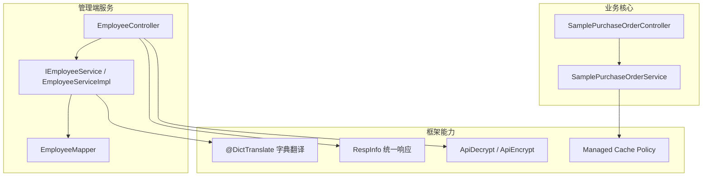
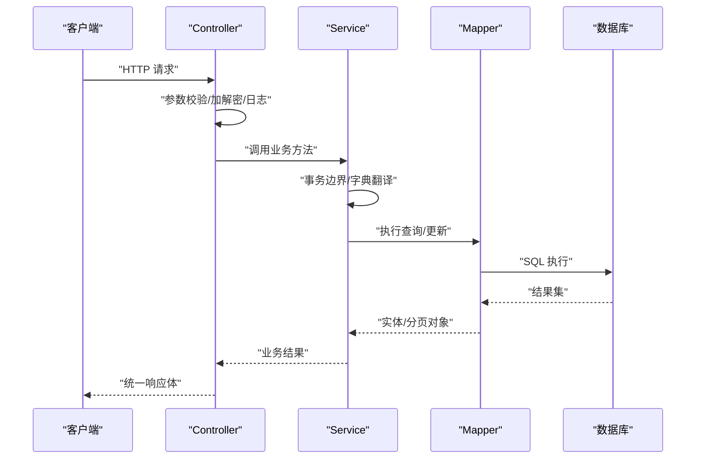
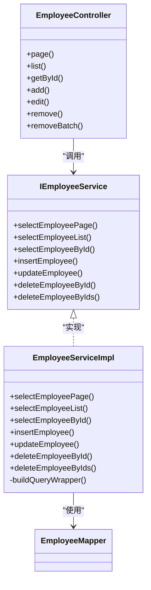
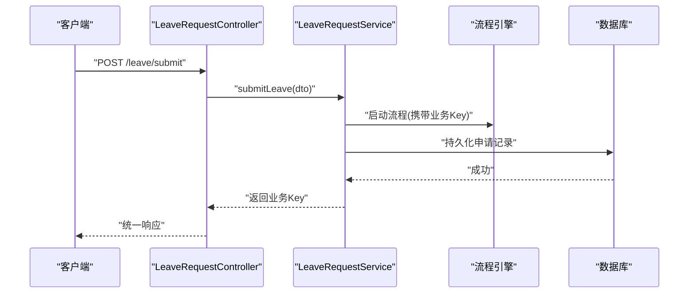
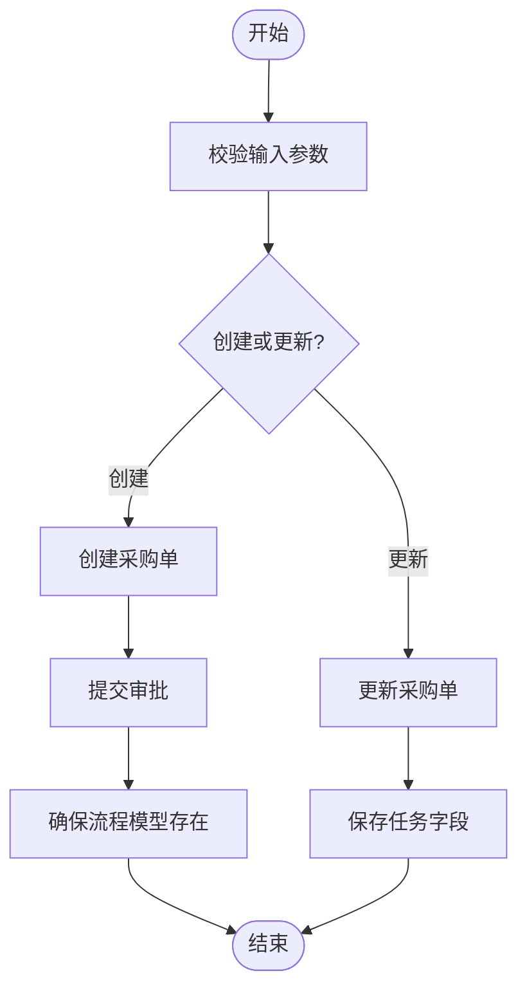
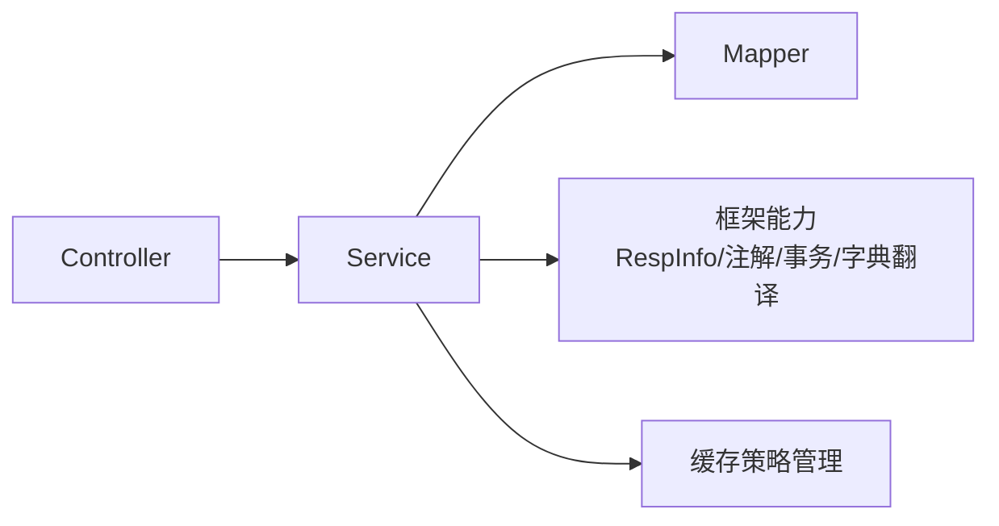

# 业务服务层

<cite>
**本文引用的文件**
- [EmployeeController.java](file://forge-server/forge-admin-server/src/main/java/com/mdframe/forge/employee/controller/EmployeeController.java)
- [IEmployeeService.java](file://forge-server/forge-admin-server/src/main/java/com/mdframe/forge/employee/service/IEmployeeService.java)
- [EmployeeServiceImpl.java](file://forge-server/forge-admin-server/src/main/java/com/mdframe/forge/employee/service/impl/EmployeeServiceImpl.java)
- [LeaveRequestController.java](file://forge-server/forge-admin-server/src/main/java/com/mdframe/forge/leave/controller/LeaveRequestController.java)
- [LeaveRequestService.java](file://forge-server/forge-admin-server/src/main/java/com/mdframe/forge/leave/service/LeaveRequestService.java)
- [SamplePurchaseOrderController.java](file://forge-server/forge-business/forge-business-core/src/main/java/com/mdframe/forge/business/core/purchase/controller/SamplePurchaseOrderController.java)
- [SamplePurchaseOrderService.java](file://forge-server/forge-business/forge-business-core/src/main/java/com/mdframe/forge/business/core/purchase/service/SamplePurchaseOrderService.java)
- [EffectiveCachePolicy.java](file://forge-server/forge-framework/forge-starter-parent/forge-starter-cache/src/main/java/com/mdframe/forge/starter/cache/managed/model/EffectiveCachePolicy.java)
- [SysManagedCachePolicyServiceImpl.java](file://forge-server/forge-framework/forge-starter-parent/forge-starter-system/src/main/java/com/mdframe/forge/plugin/system/service/impl/SysManagedCachePolicyServiceImpl.java)
</cite>

## 目录
1. [简介](#简介)
2. [项目结构](#项目结构)
3. [核心组件](#核心组件)
4. [架构总览](#架构总览)
5. [详细组件分析](#详细组件分析)
6. [依赖关系分析](#依赖关系分析)
7. [性能考虑](#性能考虑)
8. [故障排查指南](#故障排查指南)
9. [结论](#结论)
10. [附录](#附录)

## 简介
本技术文档聚焦于 Forge Admin 的业务服务层，围绕分层架构中的 Service 层设计模式与职责划分展开，结合领域驱动设计（DDD）思想与服务接口规范，系统阐述事务管理策略、控制器层 RESTful API 设计规范、业务逻辑实现最佳实践，以及性能优化技巧（缓存策略、数据库连接池调优、并发控制）。文档以员工管理、请假申请、采购单审批等典型业务为案例，提供可落地的架构与工程化建议。

## 项目结构
本项目采用多模块组织：
- 管理端服务（forge-admin-server）：包含员工、请假等基础业务能力，体现标准的 Controller-Service-Mapper 分层。
- 业务核心（forge-business-core）：封装跨域通用业务能力，如采购单审批流程示例。
- 框架能力（forge-starter-parent、forge-plugin-parent）：提供统一响应、加密注解、字典翻译、缓存策略管理等横切能力。

图表来源
- [EmployeeController.java:1-103](file://forge-server/forge-admin-server/src/main/java/com/mdframe/forge/employee/controller/EmployeeController.java#L1-L103)
- [IEmployeeService.java:1-55](file://forge-server/forge-admin-server/src/main/java/com/mdframe/forge/employee/service/IEmployeeService.java#L1-L55)
- [EmployeeServiceImpl.java:1-105](file://forge-server/forge-admin-server/src/main/java/com/mdframe/forge/employee/service/impl/EmployeeServiceImpl.java#L1-L105)
- [SamplePurchaseOrderController.java:1-93](file://forge-server/forge-business/forge-business-core/src/main/java/com/mdframe/forge/business/core/purchase/controller/SamplePurchaseOrderController.java#L1-L93)
- [SamplePurchaseOrderService.java:1-57](file://forge-server/forge-business/forge-business-core/src/main/java/com/mdframe/forge/business/core/purchase/service/SamplePurchaseOrderService.java#L1-L57)

章节来源
- [EmployeeController.java:1-103](file://forge-server/forge-admin-server/src/main/java/com/mdframe/forge/employee/controller/EmployeeController.java#L1-L103)
- [EmployeeServiceImpl.java:1-105](file://forge-server/forge-admin-server/src/main/java/com/mdframe/forge/employee/service/impl/EmployeeServiceImpl.java#L1-L105)
- [SamplePurchaseOrderController.java:1-93](file://forge-server/forge-business/forge-business-core/src/main/java/com/mdframe/forge/business/core/purchase/controller/SamplePurchaseOrderController.java#L1-L93)
- [SamplePurchaseOrderService.java:1-57](file://forge-server/forge-business/forge-business-core/src/main/java/com/mdframe/forge/business/core/purchase/service/SamplePurchaseOrderService.java#L1-L57)

## 核心组件
- 控制器层（Controller）
  - 负责接收请求、参数校验、调用 Service、封装统一响应。
  - 使用统一响应体 RespInfo，便于前端一致处理。
  - 通过 @ApiDecrypt/@ApiEncrypt 实现请求解密与响应加密。
  - 通过 @OperationLog 记录操作日志，便于审计。
- 服务层（Service）
  - 定义领域级接口（如 IEmployeeService、LeaveRequestService、SamplePurchaseOrderService），承载业务编排与规则。
  - 使用声明式事务 @Transactional 保证数据一致性。
  - 使用 @DictTranslate 对查询结果进行字典翻译，提升可读性。
- 数据访问层（Mapper）
  - 基于 MyBatis-Plus，提供分页、条件构建、批量操作等能力。
- 框架能力
  - 统一响应、加解密、字典翻译、缓存策略管理、租户隔离等横切能力。

章节来源
- [EmployeeController.java:1-103](file://forge-server/forge-admin-server/src/main/java/com/mdframe/forge/employee/controller/EmployeeController.java#L1-L103)
- [IEmployeeService.java:1-55](file://forge-server/forge-admin-server/src/main/java/com/mdframe/forge/employee/service/IEmployeeService.java#L1-L55)
- [EmployeeServiceImpl.java:1-105](file://forge-server/forge-admin-server/src/main/java/com/mdframe/forge/employee/service/impl/EmployeeServiceImpl.java#L1-L105)
- [LeaveRequestController.java:1-104](file://forge-server/forge-admin-server/src/main/java/com/mdframe/forge/leave/controller/LeaveRequestController.java#L1-L104)
- [LeaveRequestService.java:1-63](file://forge-server/forge-admin-server/src/main/java/com/mdframe/forge/leave/service/LeaveRequestService.java#L1-L63)
- [SamplePurchaseOrderController.java:1-93](file://forge-server/forge-business/forge-business-core/src/main/java/com/mdframe/forge/business/core/purchase/controller/SamplePurchaseOrderController.java#L1-L93)
- [SamplePurchaseOrderService.java:1-57](file://forge-server/forge-business/forge-business-core/src/main/java/com/mdframe/forge/business/core/purchase/service/SamplePurchaseOrderService.java#L1-L57)

## 架构总览
下图展示了从请求到数据持久化的完整链路，并标注了关键横切能力（加解密、日志、字典翻译、事务）。

图表来源
- [EmployeeController.java:1-103](file://forge-server/forge-admin-server/src/main/java/com/mdframe/forge/employee/controller/EmployeeController.java#L1-L103)
- [EmployeeServiceImpl.java:1-105](file://forge-server/forge-admin-server/src/main/java/com/mdframe/forge/employee/service/impl/EmployeeServiceImpl.java#L1-L105)

## 详细组件分析

### 员工管理（CRUD）
- 控制器职责
  - 暴露分页、列表、详情、新增、修改、删除、批量删除等接口。
  - 使用统一响应体封装成功/失败信息。
  - 通过注解完成加解密与操作日志记录。
- 服务职责
  - 定义清晰的领域方法：分页查询、列表查询、按 ID 查询、新增、修改、删除、批量删除。
  - 使用声明式事务确保写操作的原子性。
  - 使用字典翻译简化返回数据的展示。
- 数据访问
  - 基于 MyBatis-Plus 的条件构造器动态组装查询条件。
  - 分页查询通过 PageQuery 转换为分页对象。

图表来源
- [EmployeeController.java:1-103](file://forge-server/forge-admin-server/src/main/java/com/mdframe/forge/employee/controller/EmployeeController.java#L1-L103)
- [IEmployeeService.java:1-55](file://forge-server/forge-admin-server/src/main/java/com/mdframe/forge/employee/service/IEmployeeService.java#L1-L55)
- [EmployeeServiceImpl.java:1-105](file://forge-server/forge-admin-server/src/main/java/com/mdframe/forge/employee/service/impl/EmployeeServiceImpl.java#L1-L105)

章节来源
- [EmployeeController.java:1-103](file://forge-server/forge-admin-server/src/main/java/com/mdframe/forge/employee/controller/EmployeeController.java#L1-L103)
- [IEmployeeService.java:1-55](file://forge-server/forge-admin-server/src/main/java/com/mdframe/forge/employee/service/IEmployeeService.java#L1-L55)
- [EmployeeServiceImpl.java:1-105](file://forge-server/forge-admin-server/src/main/java/com/mdframe/forge/employee/service/impl/EmployeeServiceImpl.java#L1-L105)

### 请假申请（流程集成）
- 控制器职责
  - 提交申请、保存草稿、更新草稿、获取详情、分页查询、撤销申请、删除草稿。
  - 忽略租户过滤（@IgnoreTenant），适用于跨租户或全局场景。
- 服务职责
  - 提交申请触发流程启动；草稿状态支持保存与更新；撤销申请与分页查询当前用户请假列表。
- 流程集成
  - 通过业务 Key（businessKey）关联流程实例，便于后续跟踪与回调。

图表来源
- [LeaveRequestController.java:1-104](file://forge-server/forge-admin-server/src/main/java/com/mdframe/forge/leave/controller/LeaveRequestController.java#L1-L104)
- [LeaveRequestService.java:1-63](file://forge-server/forge-admin-server/src/main/java/com/mdframe/forge/leave/service/LeaveRequestService.java#L1-L63)

章节来源
- [LeaveRequestController.java:1-104](file://forge-server/forge-admin-server/src/main/java/com/mdframe/forge/leave/controller/LeaveRequestController.java#L1-L104)
- [LeaveRequestService.java:1-63](file://forge-server/forge-admin-server/src/main/java/com/mdframe/forge/leave/service/LeaveRequestService.java#L1-L63)

### 采购单审批（业务编排）
- 控制器职责
  - 分页查询、详情查询（支持按 ID 或业务 Key）、新增、修改、删除、提交审批、保存任务字段、初始化流程模型。
- 服务职责
  - 定义模型键、业务类型、状态常量，提供完整的 CRUD 与流程编排方法。
  - 通过 ensureFlowModel 保证流程模型存在，便于测试与演示。

图表来源
- [SamplePurchaseOrderController.java:1-93](file://forge-server/forge-business/forge-business-core/src/main/java/com/mdframe/forge/business/core/purchase/controller/SamplePurchaseOrderController.java#L1-L93)
- [SamplePurchaseOrderService.java:1-57](file://forge-server/forge-business/forge-business-core/src/main/java/com/mdframe/forge/business/core/purchase/service/SamplePurchaseOrderService.java#L1-L57)

章节来源
- [SamplePurchaseOrderController.java:1-93](file://forge-server/forge-business/forge-business-core/src/main/java/com/mdframe/forge/business/core/purchase/controller/SamplePurchaseOrderController.java#L1-L93)
- [SamplePurchaseOrderService.java:1-57](file://forge-server/forge-business/forge-business-core/src/main/java/com/mdframe/forge/business/core/purchase/service/SamplePurchaseOrderService.java#L1-L57)

## 依赖关系分析
- 控制器依赖服务接口，服务实现依赖 Mapper 与框架能力（事务、字典翻译、统一响应）。
- 业务核心模块通过服务接口抽象出流程相关能力，便于扩展与替换。
- 框架层提供统一的缓存策略管理与配置覆盖机制，支持运行时调整。

图表来源
- [EmployeeController.java:1-103](file://forge-server/forge-admin-server/src/main/java/com/mdframe/forge/employee/controller/EmployeeController.java#L1-L103)
- [EmployeeServiceImpl.java:1-105](file://forge-server/forge-admin-server/src/main/java/com/mdframe/forge/employee/service/impl/EmployeeServiceImpl.java#L1-L105)
- [EffectiveCachePolicy.java:1-40](file://forge-server/forge-framework/forge-starter-parent/forge-starter-cache/src/main/java/com/mdframe/forge/starter/cache/managed/model/EffectiveCachePolicy.java#L1-L40)

章节来源
- [EmployeeController.java:1-103](file://forge-server/forge-admin-server/src/main/java/com/mdframe/forge/employee/controller/EmployeeController.java#L1-L103)
- [EmployeeServiceImpl.java:1-105](file://forge-server/forge-admin-server/src/main/java/com/mdframe/forge/employee/service/impl/EmployeeServiceImpl.java#L1-L105)
- [EffectiveCachePolicy.java:1-40](file://forge-server/forge-framework/forge-starter-parent/forge-starter-cache/src/main/java/com/mdframe/forge/starter/cache/managed/model/EffectiveCachePolicy.java#L1-L40)

## 性能考虑
- 缓存策略
  - 使用 Managed Cache Policy 对热点数据进行本地与 Redis 双层缓存，支持 TTL、最大容量、空值缓存等配置。
  - 通过 EffectiveCachePolicy 合并默认定义与运行时覆盖，灵活调整缓存行为。
- 数据库连接池调优
  - 合理设置连接池大小、超时时间、空闲回收策略，避免连接泄漏与资源争用。
  - 针对高频查询使用索引与分页，减少全表扫描与内存压力。
- 并发控制
  - 在写操作中使用声明式事务，确保数据一致性。
  - 对热点资源（如流程模型初始化）使用分布式锁或幂等设计，防止重复提交与竞争条件。
- 查询优化
  - 使用条件构造器动态拼装查询，避免不必要的字段加载。
  - 对复杂查询进行 SQL 分析与索引优化。

章节来源
- [EffectiveCachePolicy.java:1-40](file://forge-server/forge-framework/forge-starter-parent/forge-starter-cache/src/main/java/com/mdframe/forge/starter/cache/managed/model/EffectiveCachePolicy.java#L1-L40)
- [SysManagedCachePolicyServiceImpl.java:153-180](file://forge-server/forge-framework/forge-starter-parent/forge-starter-system/src/main/java/com/mdframe/forge/plugin/system/service/impl/SysManagedCachePolicyServiceImpl.java#L153-L180)

## 故障排查指南
- 事务问题
  - 检查写操作是否标注 @Transactional，并确保异常类型正确触发回滚。
  - 确认事务传播行为与隔离级别是否符合预期。
- 字典翻译缺失
  - 检查查询方法是否标注 @DictTranslate，确认字典源配置是否正确。
- 缓存未命中
  - 核对缓存策略是否启用、TTL 是否过短、Redis 连接是否正常。
  - 查看运行时覆盖配置是否生效。
- 流程相关问题
  - 确认流程模型已初始化，业务 Key 与流程实例关联正确。
  - 检查流程回调与状态更新逻辑是否一致。

章节来源
- [EmployeeServiceImpl.java:57-83](file://forge-server/forge-admin-server/src/main/java/com/mdframe/forge/employee/service/impl/EmployeeServiceImpl.java#L57-L83)
- [EmployeeServiceImpl.java:36-50](file://forge-server/forge-admin-server/src/main/java/com/mdframe/forge/employee/service/impl/EmployeeServiceImpl.java#L36-L50)
- [EffectiveCachePolicy.java:1-40](file://forge-server/forge-framework/forge-starter-parent/forge-starter-cache/src/main/java/com/mdframe/forge/starter/cache/managed/model/EffectiveCachePolicy.java#L1-L40)

## 结论
Forge Admin 的业务服务层遵循清晰的分层架构与 DDD 思想，通过统一的控制器规范、服务接口抽象、声明式事务与字典翻译等框架能力，实现了高内聚、低耦合的业务编排。结合缓存策略管理与流程集成，既保证了数据一致性与可维护性，又提供了良好的性能与扩展性。建议在新增业务时沿用现有模式，持续优化查询与缓存策略，确保系统的稳定与高效。

## 附录
- 统一响应体：RespInfo
- 加解密注解：@ApiDecrypt、@ApiEncrypt
- 操作日志：@OperationLog
- 字典翻译：@DictTranslate
- 租户隔离：@IgnoreTenant