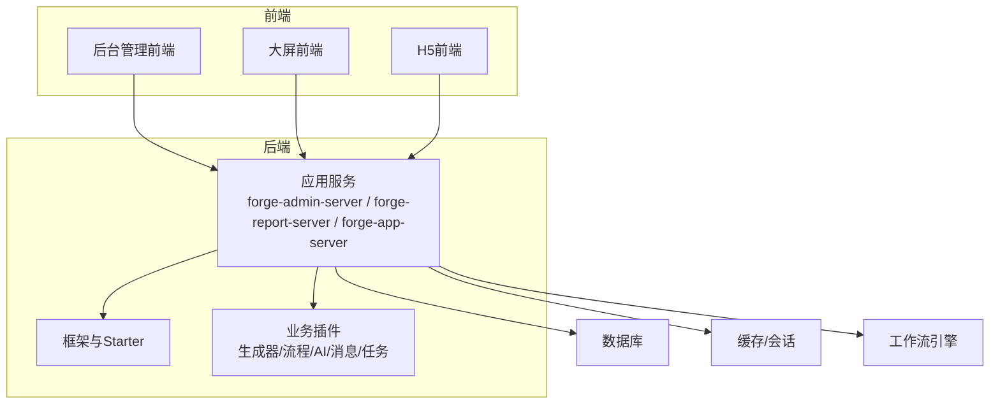
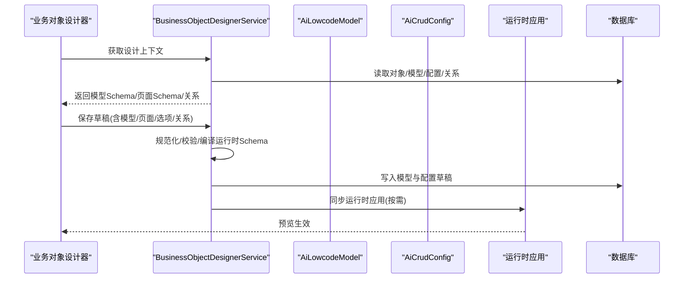
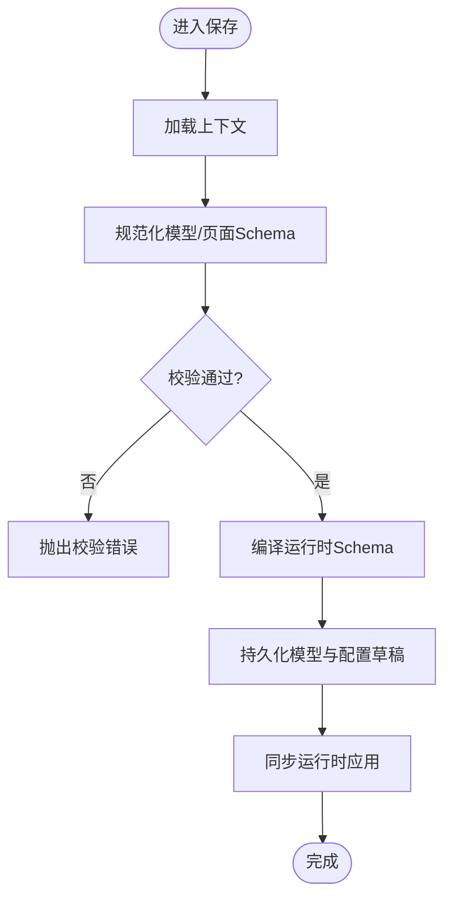
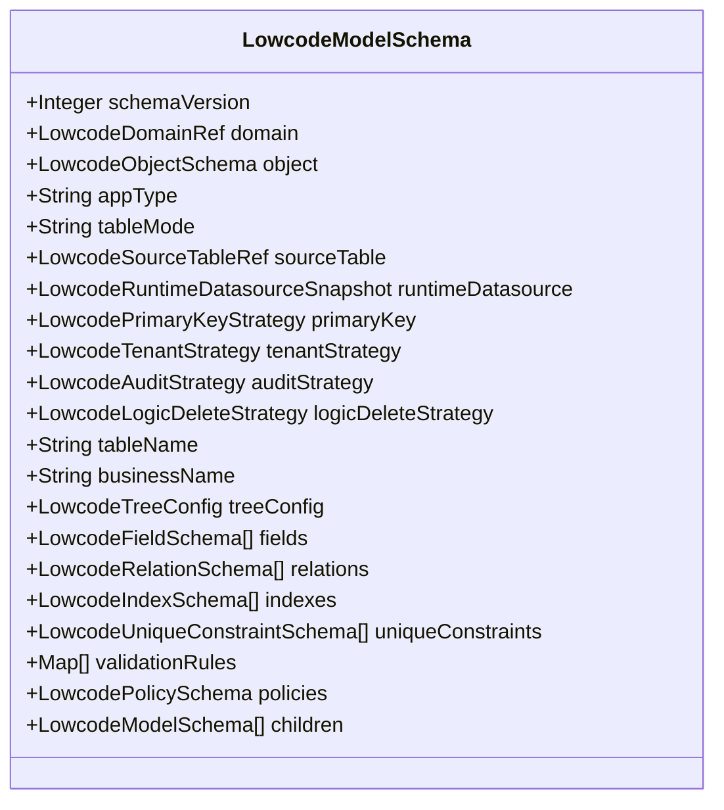
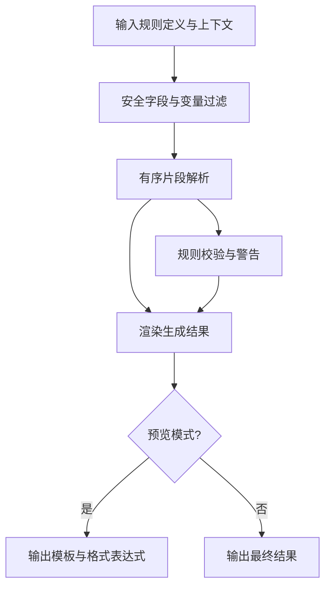
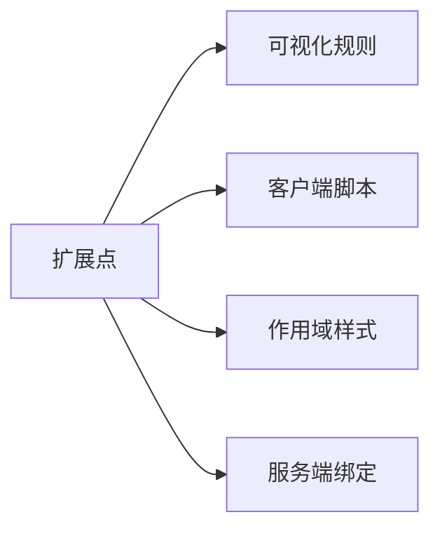
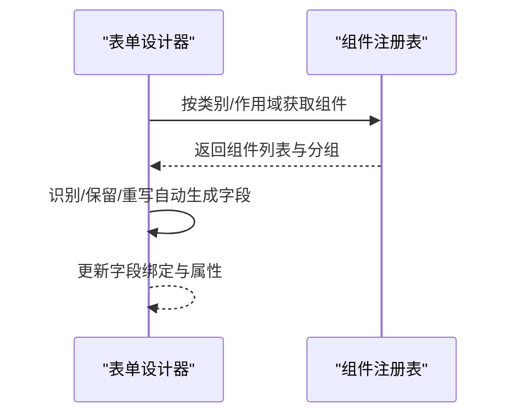
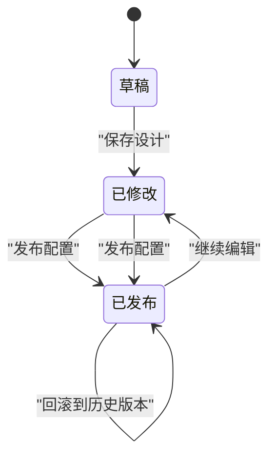
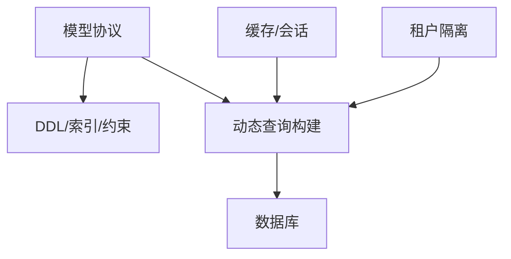
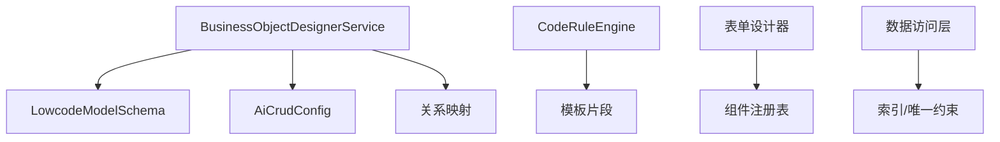

# 低代码服务

<cite>
**本文引用的文件**
- [README.md](file://README.md)
- [BusinessObjectDesignerService.java](file://forge-server/forge-framework/forge-plugin-parent/forge-plugin-generator/src/main/java/com/mdframe/forge/plugin/generator/service/businessapp/BusinessObjectDesignerService.java)
- [LowcodeModelSchema.java](file://forge-server/forge-framework/forge-plugin-parent/forge-plugin-generator/src/main/java/com/mdframe/forge/plugin/generator/dto/lowcode/LowcodeModelSchema.java)
- [CodeRuleEngine.java](file://forge-server/forge-framework/forge-plugin-parent/forge-plugin-generator/src/main/java/com/mdframe/forge/plugin/generator/manager/coderule/CodeRuleEngine.java)
- [BusinessExtensionType.java](file://forge-server/forge-framework/forge-plugin-parent/forge-plugin-generator/src/main/java/com/mdframe/forge/plugin/generator/constant/BusinessExtensionType.java)
- [BusinessFormDesigner.vue](file://forge-admin-ui/src/views/app-center/components/designer/BusinessFormDesigner.vue)
- [registry.js](file://forge-admin-ui/src/components/lowcode-builder/designer-core/spec/registry.js)
- [FlowModelMapperSqlContractTest.java](file://forge-server/forge-framework/forge-plugin-parent/forge-plugin-flow/src/test/java/com/mdframe/forge/starter/flow/mapper/FlowModelMapperSqlContractTest.java)
</cite>

## 目录
1. [简介](#简介)
2. [项目结构](#项目结构)
3. [核心组件](#核心组件)
4. [架构总览](#架构总览)
5. [详细组件分析](#详细组件分析)
6. [依赖关系分析](#依赖关系分析)
7. [性能与优化](#性能与优化)
8. [故障排查指南](#故障排查指南)
9. [结论](#结论)
10. [附录](#附录)

## 简介
本技术文档面向低代码服务的后端实现，聚焦业务对象设计器、表单设计器与 CRUD 生成器的元数据驱动架构。文档从模型定义、关系映射、动态表单生成机制入手，解释代码生成引擎（模板引擎、AST 操作与质量保障）的工作原理，并覆盖低代码应用的生命周期管理（发布、部署、版本控制与回滚）、数据访问层动态构建与查询优化、缓存策略，以及扩展点设计与插件化、自定义组件集成方案。整体目标是帮助读者在不深入源码细节的情况下，理解系统如何以“配置即代码”的方式快速交付企业级后台能力。

## 项目结构
项目采用分层与插件化组织：
- 后端核心框架与 Starter：提供认证、缓存、ORM、多租户、数据权限、加解密、日志、文件、Excel 等基础能力。
- 业务插件：系统管理、代码生成、任务调度、消息中心、流程、AI 等业务能力以插件方式组合。
- 应用服务：按场景聚合插件并对外提供接口。
- 前端：后台管理、大屏编辑器、H5 移动端等独立前端工程。

**图表来源**
- [README.md:68-73](file://README.md#L68-L73)

**章节来源**
- [README.md:68-73](file://README.md#L68-L73)

## 核心组件
- 业务对象设计器服务：负责加载/保存设计上下文、模型与页面 Schema、关系同步、草稿与运行时物化、版本回滚等。
- 低代码模型协议：描述表模式、字段、关系、索引、唯一约束、审计与逻辑删除策略等。
- 代码规则引擎：对命名、编码规则进行渲染与校验，支持预览模式与安全变量注入。
- 扩展点类型：限定可视化规则、客户端脚本、作用域样式与服务端绑定等扩展边界。
- 表单设计器前端：处理字段绑定、自动生成字段名保留与重写、组件注册与分组等。
- 组件注册表：提供组件分类、分组、类型列表与别名映射等能力。

**章节来源**
- [BusinessObjectDesignerService.java:191-370](file://forge-server/forge-framework/forge-plugin-parent/forge-plugin-generator/src/main/java/com/mdframe/forge/plugin/generator/service/businessapp/BusinessObjectDesignerService.java#L191-L370)
- [LowcodeModelSchema.java:12-70](file://forge-server/forge-framework/forge-plugin-parent/forge-plugin-generator/src/main/java/com/mdframe/forge/plugin/generator/dto/lowcode/LowcodeModelSchema.java#L12-L70)
- [CodeRuleEngine.java:154-173](file://forge-server/forge-framework/forge-plugin-parent/forge-plugin-generator/src/main/java/com/mdframe/forge/plugin/generator/manager/coderule/CodeRuleEngine.java#L154-L173)
- [BusinessExtensionType.java:8-18](file://forge-server/forge-framework/forge-plugin-parent/forge-plugin-generator/src/main/java/com/mdframe/forge/plugin/generator/constant/BusinessExtensionType.java#L8-L18)
- [BusinessFormDesigner.vue:1669-1733](file://forge-admin-ui/src/views/app-center/components/designer/BusinessFormDesigner.vue#L1669-L1733)
- [registry.js:95-141](file://forge-admin-ui/src/components/lowcode-builder/designer-core/spec/registry.js#L95-L141)

## 架构总览
低代码平台以“元数据驱动”为核心：通过统一的模型与页面 Schema 表达业务对象、字段、关系与界面布局；设计器将用户配置持久化为可演进的版本；运行时根据 Schema 动态生成 CRUD、表单、列表与联动逻辑；代码生成器基于模板与规则输出可下载或在线运行的代码。

**图表来源**
- [BusinessObjectDesignerService.java:191-370](file://forge-server/forge-framework/forge-plugin-parent/forge-plugin-generator/src/main/java/com/mdframe/forge/plugin/generator/service/businessapp/BusinessObjectDesignerService.java#L191-L370)

## 详细组件分析

### 业务对象设计器服务
职责与关键点：
- 设计上下文加载：聚合对象、模型、配置、页面与关系信息，统一归一化。
- 草稿保存与运行时物化：在保存时执行模型与页面 Schema 的规范化、校验与编译，产出运行时可用的配置快照。
- 关系同步：将对象间关系应用到模型，保证查询与展示一致性。
- 版本回滚：基于设计版本快照恢复模型、页面、关系与设计选项。
- 默认值与兼容：为缺失字段提供默认值，兼容历史运行时 Schema。

**图表来源**
- [BusinessObjectDesignerService.java:324-370](file://forge-server/forge-framework/forge-plugin-parent/forge-plugin-generator/src/main/java/com/mdframe/forge/plugin/generator/service/businessapp/BusinessObjectDesignerService.java#L324-L370)

**章节来源**
- [BusinessObjectDesignerService.java:191-370](file://forge-server/forge-framework/forge-plugin-parent/forge-plugin-generator/src/main/java/com/mdframe/forge/plugin/generator/service/businessapp/BusinessObjectDesignerService.java#L191-L370)
- [BusinessObjectDesignerService.java:444-457](file://forge-server/forge-framework/forge-plugin-parent/forge-plugin-generator/src/main/java/com/mdframe/forge/plugin/generator/service/businessapp/BusinessObjectDesignerService.java#L444-L457)

### 低代码模型协议
模型协议承载数据模型的核心语义：
- 领域与对象：领域归属、对象标识、名称与描述。
- 表模式：单表/树形/预留主子表模式；是否创建新表或绑定已有表。
- 运行数据源快照：运行时数据源与表名映射。
- 主键/租户/审计/逻辑删除策略：统一治理多租户隔离与审计追踪。
- 字段集合：字段定义、类型、长度、精度、查询类型等。
- 关系与索引：领域内关系声明、自定义索引与唯一约束。
- 策略与校验：通用策略与校验规则扩展。

**图表来源**
- [LowcodeModelSchema.java:12-70](file://forge-server/forge-framework/forge-plugin-parent/forge-plugin-generator/src/main/java/com/mdframe/forge/plugin/generator/dto/lowcode/LowcodeModelSchema.java#L12-L70)

**章节来源**
- [LowcodeModelSchema.java:12-70](file://forge-server/forge-framework/forge-plugin-parent/forge-plugin-generator/src/main/java/com/mdframe/forge/plugin/generator/dto/lowcode/LowcodeModelSchema.java#L12-L70)

### 代码生成引擎与规则
代码生成引擎围绕“规则即配置”的理念：
- 规则渲染：将字段、系统变量与样本序列安全注入到规则片段中，生成最终结果。
- 预览模式：在不落盘的情况下输出模板与格式化表达式，便于调试与验证。
- 安全过滤：对业务字段与系统变量进行白名单与类型过滤，防止注入风险。
- 质量保障：规则校验与警告收集，确保生成产物符合规范。

**图表来源**
- [CodeRuleEngine.java:154-173](file://forge-server/forge-framework/forge-plugin-parent/forge-plugin-generator/src/main/java/com/mdframe/forge/plugin/generator/manager/coderule/CodeRuleEngine.java#L154-L173)

**章节来源**
- [CodeRuleEngine.java:154-173](file://forge-server/forge-framework/forge-plugin-parent/forge-plugin-generator/src/main/java/com/mdframe/forge/plugin/generator/manager/coderule/CodeRuleEngine.java#L154-L173)

### 扩展点与插件机制
扩展点用于限制可注入的代码与样式范围，避免破坏运行时稳定性：
- 可视化规则：在界面层扩展字段显示与交互行为。
- 客户端脚本：在前端沙箱中执行轻量脚本。
- 作用域样式：仅影响当前组件样式，避免全局污染。
- 服务端绑定：在后端扩展数据绑定与计算逻辑。

**图表来源**
- [BusinessExtensionType.java:8-18](file://forge-server/forge-framework/forge-plugin-parent/forge-plugin-generator/src/main/java/com/mdframe/forge/plugin/generator/constant/BusinessExtensionType.java#L8-L18)

**章节来源**
- [BusinessExtensionType.java:8-18](file://forge-server/forge-framework/forge-plugin-parent/forge-plugin-generator/src/main/java/com/mdframe/forge/plugin/generator/constant/BusinessExtensionType.java#L8-L18)

### 表单设计器前端与组件注册
表单设计器关注字段绑定与自动生成字段的保护：
- 自动生成字段识别：对由模板生成的字段进行识别与保留，避免被误改。
- 字段名重写：当字段名变更时，同步更新组件绑定与属性，保持前后一致。
- 组件注册与分组：按类别与分组列出可用组件，支持作用域过滤与统计。

**图表来源**
- [BusinessFormDesigner.vue:1669-1733](file://forge-admin-ui/src/views/app-center/components/designer/BusinessFormDesigner.vue#L1669-L1733)
- [registry.js:95-141](file://forge-admin-ui/src/components/lowcode-builder/designer-core/spec/registry.js#L95-L141)

**章节来源**
- [BusinessFormDesigner.vue:1669-1733](file://forge-admin-ui/src/views/app-center/components/designer/BusinessFormDesigner.vue#L1669-L1733)
- [registry.js:95-141](file://forge-admin-ui/src/components/lowcode-builder/designer-core/spec/registry.js#L95-L141)

### 生命周期管理：发布、部署、版本控制与回滚
- 草稿与变更标记：保存设计时标记应用存在未发布变更，便于提示与合并。
- 运行时物化：编译后的模型与页面 Schema 作为运行时配置，供预览与发布使用。
- 版本快照：设计版本包含模型、页面、关系与设计选项的快照，支持回滚。
- 发布与部署：通过配置键与应用关联，将最新配置同步至运行时应用。

**图表来源**
- [BusinessObjectDesignerService.java:324-370](file://forge-server/forge-framework/forge-plugin-parent/forge-plugin-generator/src/main/java/com/mdframe/forge/plugin/generator/service/businessapp/BusinessObjectDesignerService.java#L324-L370)
- [BusinessObjectDesignerService.java:444-457](file://forge-server/forge-framework/forge-plugin-parent/forge-plugin-generator/src/main/java/com/mdframe/forge/plugin/generator/service/businessapp/BusinessObjectDesignerService.java#L444-L457)

**章节来源**
- [BusinessObjectDesignerService.java:324-370](file://forge-server/forge-framework/forge-plugin-parent/forge-plugin-generator/src/main/java/com/mdframe/forge/plugin/generator/service/businessapp/BusinessObjectDesignerService.java#L324-L370)
- [BusinessObjectDesignerService.java:444-457](file://forge-server/forge-framework/forge-plugin-parent/forge-plugin-generator/src/main/java/com/mdframe/forge/plugin/generator/service/businessapp/BusinessObjectDesignerService.java#L444-L457)

### 数据访问层：动态构建、查询优化与缓存
- 动态构建：基于模型协议中的字段、关系、索引与唯一约束，运行时动态生成查询与校验逻辑。
- 查询优化：通过索引与唯一约束减少扫描范围；关系映射避免 N+1 查询。
- 缓存策略：结合缓存与会话能力，对字典、菜单、权限等热点数据进行缓存，降低数据库压力。
- 多租户隔离：所有查询强制租户边界与逻辑删除过滤，确保数据安全。

**图表来源**
- [LowcodeModelSchema.java:12-70](file://forge-server/forge-framework/forge-plugin-parent/forge-plugin-generator/src/main/java/com/mdframe/forge/plugin/generator/dto/lowcode/LowcodeModelSchema.java#L12-L70)
- [FlowModelMapperSqlContractTest.java:13-26](file://forge-server/forge-framework/forge-plugin-parent/forge-plugin-flow/src/test/java/com/mdframe/forge/starter/flow/mapper/FlowModelMapperSqlContractTest.java#L13-L26)

**章节来源**
- [LowcodeModelSchema.java:12-70](file://forge-server/forge-framework/forge-plugin-parent/forge-plugin-generator/src/main/java/com/mdframe/forge/plugin/generator/dto/lowcode/LowcodeModelSchema.java#L12-L70)
- [FlowModelMapperSqlContractTest.java:13-26](file://forge-server/forge-framework/forge-plugin-parent/forge-plugin-flow/src/test/java/com/mdframe/forge/starter/flow/mapper/FlowModelMapperSqlContractTest.java#L13-L26)

## 依赖关系分析
- 设计器服务依赖模型协议、配置实体、关系映射与运行时数据源解析。
- 代码规则引擎依赖安全变量与模板片段，输出受控的生成结果。
- 前端表单设计器依赖组件注册表，按类别与作用域选择组件。
- 数据访问层依赖模型协议中的索引与约束，确保查询高效且安全。

**图表来源**
- [BusinessObjectDesignerService.java:191-370](file://forge-server/forge-framework/forge-plugin-parent/forge-plugin-generator/src/main/java/com/mdframe/forge/plugin/generator/service/businessapp/BusinessObjectDesignerService.java#L191-L370)
- [LowcodeModelSchema.java:12-70](file://forge-server/forge-framework/forge-plugin-parent/forge-plugin-generator/src/main/java/com/mdframe/forge/plugin/generator/dto/lowcode/LowcodeModelSchema.java#L12-L70)
- [CodeRuleEngine.java:154-173](file://forge-server/forge-framework/forge-plugin-parent/forge-plugin-generator/src/main/java/com/mdframe/forge/plugin/generator/manager/coderule/CodeRuleEngine.java#L154-L173)
- [BusinessFormDesigner.vue:1669-1733](file://forge-admin-ui/src/views/app-center/components/designer/BusinessFormDesigner.vue#L1669-L1733)
- [registry.js:95-141](file://forge-admin-ui/src/components/lowcode-builder/designer-core/spec/registry.js#L95-L141)

**章节来源**
- [BusinessObjectDesignerService.java:191-370](file://forge-server/forge-framework/forge-plugin-parent/forge-plugin-generator/src/main/java/com/mdframe/forge/plugin/generator/service/businessapp/BusinessObjectDesignerService.java#L191-L370)
- [LowcodeModelSchema.java:12-70](file://forge-server/forge-framework/forge-plugin-parent/forge-plugin-generator/src/main/java/com/mdframe/forge/plugin/generator/dto/lowcode/LowcodeModelSchema.java#L12-L70)
- [CodeRuleEngine.java:154-173](file://forge-server/forge-framework/forge-plugin-parent/forge-plugin-generator/src/main/java/com/mdframe/forge/plugin/generator/manager/coderule/CodeRuleEngine.java#L154-L173)
- [BusinessFormDesigner.vue:1669-1733](file://forge-admin-ui/src/views/app-center/components/designer/BusinessFormDesigner.vue#L1669-L1733)
- [registry.js:95-141](file://forge-admin-ui/src/components/lowcode-builder/designer-core/spec/registry.js#L95-L141)

## 性能与优化
- 查询优化：利用模型协议中的索引与唯一约束，减少全表扫描；关系映射避免 N+1 查询。
- 缓存策略：对字典、菜单、权限等热点数据进行缓存，降低数据库压力。
- 预览模式：代码规则引擎支持预览模式，减少无效落盘与重复计算。
- 租户隔离：强制租户边界与逻辑删除过滤，避免越权与脏数据。

[本节为通用指导，不直接分析具体文件]

## 故障排查指南
- 首次启动数据库或 Redis 连接错误：检查本地配置文件是否正确复制与修改。
- 前端请求失败：确认后端端口与代理目标配置是否正确。
- 新增配置项：敏感配置不要提交；通用配置需同步示例文件并使用占位符。
- 提交敏感配置：立即更换密钥并从仓库历史清理。

**章节来源**
- [README.md:502-519](file://README.md#L502-L519)

## 结论
该低代码服务以元数据驱动为核心，通过统一的模型与页面 Schema 表达业务对象与界面布局，配合设计器、代码生成引擎与运行时物化，实现了从设计到发布的闭环。扩展点与插件机制保障了系统的可扩展性与安全性；数据访问层的动态构建与查询优化提升了性能与可靠性。整体架构兼顾了交付效率与企业级复杂度，适合长期演进的企业后台与 SaaS 平台。

[本节为总结性内容，不直接分析具体文件]

## 附录
- 快速开始与环境准备：参考 README 的环境要求、初始化脚本与启动命令。
- 插件体系：系统管理、代码生成、任务调度、消息中心、流程、AI 等插件可按需启用。
- 技术栈：后端 Spring Boot、MyBatis-Plus、Sa-Token、Flowable、Redisson；前端 Vue 3、Naive UI、Vite、Pinia、ECharts 等。

**章节来源**
- [README.md:211-238](file://README.md#L211-L238)
- [README.md:489-499](file://README.md#L489-L499)
- [README.md:263-393](file://README.md#L263-L393)