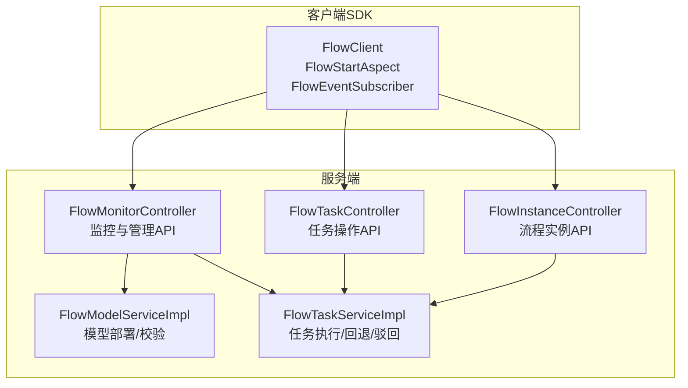
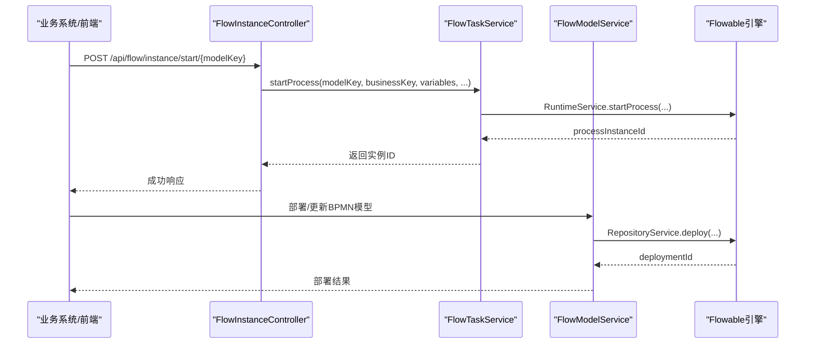
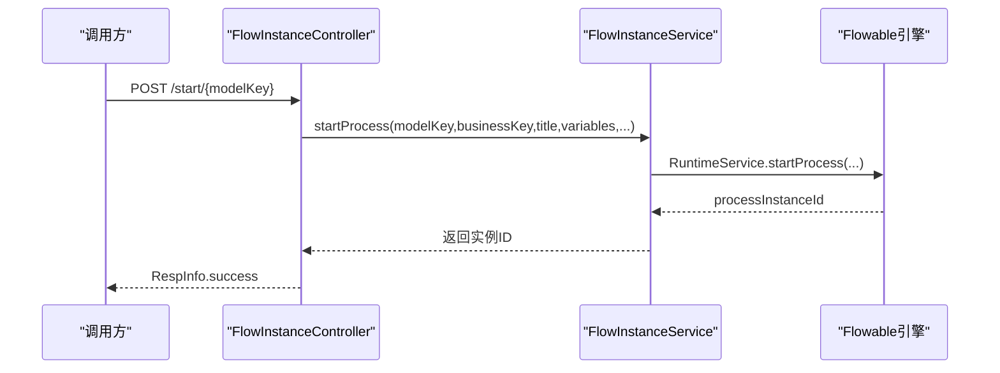
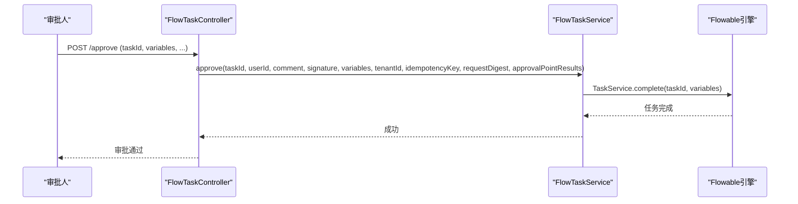
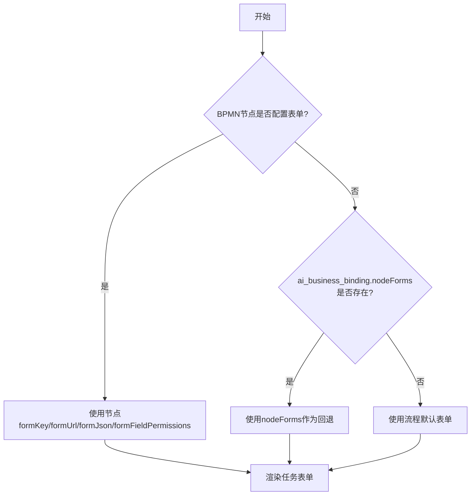
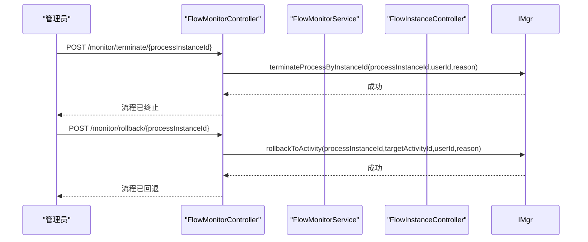
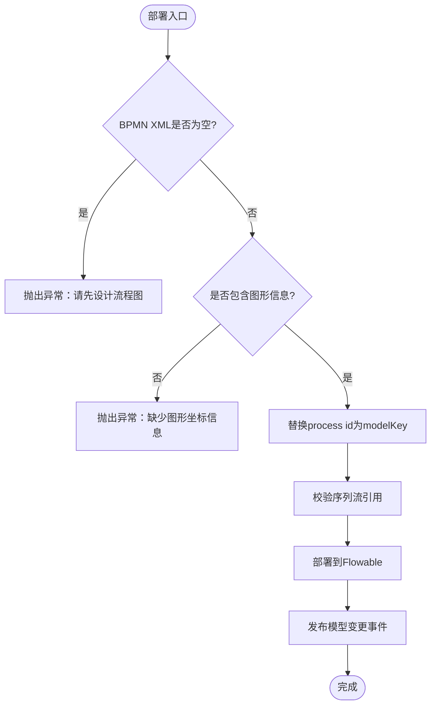
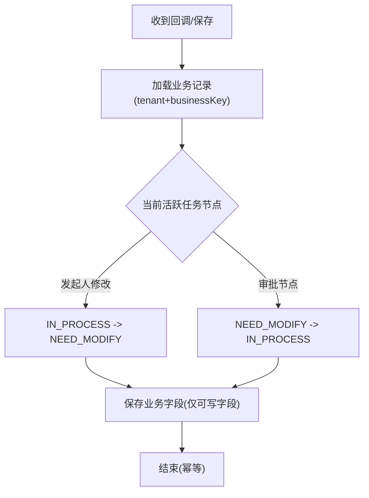
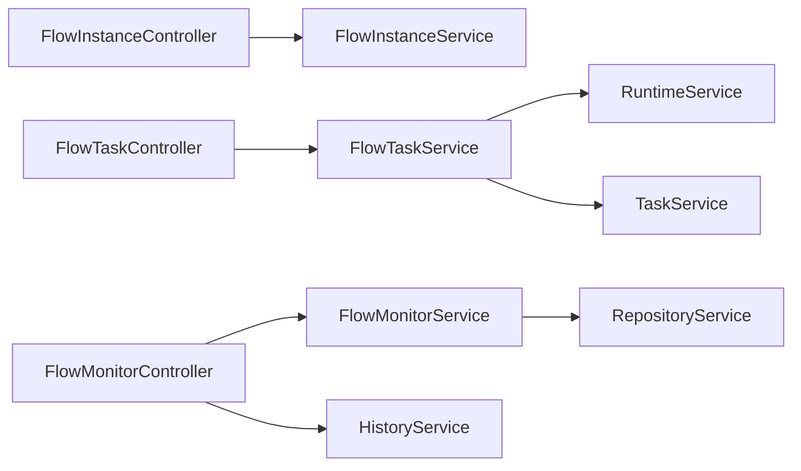

# 工作流服务

<cite>
**本文引用的文件**
- [SKILL.md](file://.agents/skills/forge-business-flow-development/SKILL.md)
- [bpmn-configuration.md](file://.agents/skills/forge-business-flow-development/references/bpmn-configuration.md)
- [status-and-callbacks.md](file://.agents/skills/forge-business-flow-development/references/status-and-callbacks.md)
- [code-first-workflow.md](file://.agents/skills/forge-business-flow-development/references/code-first-workflow.md)
- [lowcode-workflow.md](file://.agents/skills/forge-business-flow-development/references/lowcode-workflow.md)
- [FlowInstanceController.java](file://forge-server/forge-flow/forge-flow-server/src/main/java/com/mdframe/forge/flow/controller/FlowInstanceController.java)
- [FlowTaskController.java](file://forge-server/forge-flow/forge-flow-server/src/main/java/com/mdframe/forge/flow/controller/FlowTaskController.java)
- [FlowMonitorController.java](file://forge-server/forge-flow/forge-flow-server/src/main/java/com/mdframe/forge/flow/controller/FlowMonitorController.java)
- [FlowModelServiceImpl.java](file://forge-server/forge-framework/forge-plugin-parent/forge-plugin-flow/src/main/java/com/mdframe/forge/starter/flow/service/impl/FlowModelServiceImpl.java)
- [FlowTaskServiceImpl.java](file://forge-server/forge-framework/forge-plugin-parent/forge-plugin-flow/src/main/java/com/mdframe/forge/starter/flow/service/impl/FlowTaskServiceImpl.java)
</cite>

## 目录
1. [简介](#简介)
2. [项目结构](#项目结构)
3. [核心组件](#核心组件)
4. [架构总览](#架构总览)
5. [详细组件分析](#详细组件分析)
6. [依赖关系分析](#依赖关系分析)
7. [性能考虑](#性能考虑)
8. [故障排查指南](#故障排查指南)
9. [结论](#结论)
10. [附录](#附录)

## 简介
本技术文档围绕基于 Flowable 的工作流服务，系统阐述 BPMN 流程定义、流程实例管理、任务调度与审批业务逻辑，以及监控追踪、事件驱动集成、版本管理与并发控制等关键能力。文档面向不同技术背景的读者，提供从高层架构到代码级实现的多层次说明，并给出可视化图示与排错建议。

## 项目结构
工作流服务由“客户端 SDK”和“服务端”两部分组成：
- 客户端 SDK（forge-flow-client）：提供启动、回调注解、远程作业执行、令牌获取等能力，供业务模块以声明式方式接入。
- 服务端（forge-flow-server）：暴露流程模型、实例、任务、表单、监控等 REST API，并与 Flowable 引擎交互完成流程编排。

**图表来源**
- [FlowInstanceController.java:47-145](file://forge-server/forge-flow/forge-flow-server/src/main/java/com/mdframe/forge/flow/controller/FlowInstanceController.java#L47-L145)
- [FlowTaskController.java:126-165](file://forge-server/forge-flow/forge-flow-server/src/main/java/com/mdframe/forge/flow/controller/FlowTaskController.java#L126-L165)
- [FlowMonitorController.java:115-186](file://forge-server/forge-flow/forge-flow-server/src/main/java/com/mdframe/forge/flow/controller/FlowMonitorController.java#L115-L186)
- [FlowModelServiceImpl.java:259-367](file://forge-server/forge-framework/forge-plugin-parent/forge-plugin-flow/src/main/java/com/mdframe/forge/starter/flow/service/impl/FlowModelServiceImpl.java#L259-L367)
- [FlowTaskServiceImpl.java:301-381](file://forge-server/forge-framework/forge-plugin-parent/forge-plugin-flow/src/main/java/com/mdframe/forge/starter/flow/service/impl/FlowTaskServiceImpl.java#L301-L381)

**章节来源**
- [SKILL.md:1-74](file://.agents/skills/forge-business-flow-development/SKILL.md#L1-L74)

## 核心组件
- 流程实例控制器：负责发起、终止、删除、变量读写、分页查询等实例生命周期管理。
- 任务控制器：提供待办/已办/我发起的列表、签收、审批通过/驳回/退回/转办/改派/撤回、流程图与历史、逾期提醒等。
- 监控控制器：提供统计、实例列表、详情、趋势、分布、管理员终止/回退/转派/挂起/激活、变量与活动节点查询、批量清理等。
- 模型服务：负责 BPMN XML 校验、图形信息检查、process id 替换、序列流引用校验与部署。
- 任务服务：封装审批/驳回/退回等动作的执行、幂等性、错误记录、自动批准重复任务等。

**章节来源**
- [FlowInstanceController.java:47-239](file://forge-server/forge-flow/forge-flow-server/src/main/java/com/mdframe/forge/flow/controller/FlowInstanceController.java#L47-L239)
- [FlowTaskController.java:49-373](file://forge-server/forge-flow/forge-flow-server/src/main/java/com/mdframe/forge/flow/controller/FlowTaskController.java#L49-L373)
- [FlowMonitorController.java:51-403](file://forge-server/forge-flow/forge-flow-server/src/main/java/com/mdframe/forge/flow/controller/FlowMonitorController.java#L51-L403)
- [FlowModelServiceImpl.java:259-387](file://forge-server/forge-framework/forge-plugin-parent/forge-plugin-flow/src/main/java/com/mdframe/forge/starter/flow/service/impl/FlowModelServiceImpl.java#L259-L387)
- [FlowTaskServiceImpl.java:301-381](file://forge-server/forge-framework/forge-plugin-parent/forge-plugin-flow/src/main/java/com/mdframe/forge/starter/flow/service/impl/FlowTaskServiceImpl.java#L301-L381)

## 架构总览
工作流服务采用“控制器 + 服务 + Flowable 引擎”的分层架构。业务侧通过客户端 SDK 调用服务端接口，或由平台低代码运行时触发；服务端统一收敛到控制器，再委托服务层与 Flowable 引擎交互，完成流程定义部署、实例运行、任务流转与监控。

**图表来源**
- [FlowInstanceController.java:47-145](file://forge-server/forge-flow/forge-flow-server/src/main/java/com/mdframe/forge/flow/controller/FlowInstanceController.java#L47-L145)
- [FlowModelServiceImpl.java:259-367](file://forge-server/forge-framework/forge-plugin-parent/forge-plugin-flow/src/main/java/com/mdframe/forge/starter/flow/service/impl/FlowModelServiceImpl.java#L259-L367)

## 详细组件分析

### 流程实例管理
- 发起流程：支持普通发起与委托发起（含高风险审批专用入口），统一解析用户、租户、组织信息，生成或复用 businessKey，默认 title，并调用服务层启动流程。
- 状态查询：按 businessKey 获取流程业务实体。
- 终止/删除：支持按 businessKey 终止或删除实例。
- 变量读写：支持读取/更新流程变量。
- 分页与详情：支持按流程定义键、状态、标题、申请人等条件分页查询，以及按实例ID查询详情。

**图表来源**
- [FlowInstanceController.java:47-145](file://forge-server/forge-flow/forge-flow-server/src/main/java/com/mdframe/forge/flow/controller/FlowInstanceController.java#L47-L145)

**章节来源**
- [FlowInstanceController.java:47-239](file://forge-server/forge-flow/forge-flow-server/src/main/java/com/mdframe/forge/flow/controller/FlowInstanceController.java#L47-L239)

### 任务调度与审批
- 任务列表：我的待办/已办/我发起的、候选任务。
- 任务操作：签收、审批通过、驳回、驳回至发起人修改路径、退回、转办、改派、终结、撤回。
- 流程图与历史：高亮当前节点的流程图、流程图详情、审批时间轴。
- 逾期提醒：手动触发扫描发送。

**图表来源**
- [FlowTaskController.java:126-136](file://forge-server/forge-flow/forge-flow-server/src/main/java/com/mdframe/forge/flow/controller/FlowTaskController.java#L126-L136)
- [FlowTaskServiceImpl.java:301-318](file://forge-server/forge-framework/forge-plugin-parent/forge-plugin-flow/src/main/java/com/mdframe/forge/starter/flow/service/impl/FlowTaskServiceImpl.java#L301-L318)

**章节来源**
- [FlowTaskController.java:49-373](file://forge-server/forge-flow/forge-flow-server/src/main/java/com/mdframe/forge/flow/controller/FlowTaskController.java#L49-L373)
- [FlowTaskServiceImpl.java:301-381](file://forge-server/forge-framework/forge-plugin-parent/forge-plugin-flow/src/main/java/com/mdframe/forge/starter/flow/service/impl/FlowTaskServiceImpl.java#L301-L381)

### BPMN 流程定义与节点配置
- 运行时优先级：BPMN 节点 formKey/formUrl/formJson/formFieldPermissions > ai_business_binding.nodeForms 回退 > 流程默认表单。
- 用户任务属性：assignee 表达式、多实例会签、拒绝分支条件、默认分支设置。
- 模型初始化规则：不存在则创建并部署；存在且XML为空则写入默认；存在且XML非空则保留用户编辑内容。
- 表单资产规则：代码优先使用 BUSINESS_CODE_FORM；低代码使用 BUSINESS_OBJECT_FORM；外部 URL 为高级回退。

**图表来源**
- [bpmn-configuration.md:7-13](file://.agents/skills/forge-business-flow-development/references/bpmn-configuration.md#L7-L13)
- [bpmn-configuration.md:17-81](file://.agents/skills/forge-business-flow-development/references/bpmn-configuration.md#L17-L81)
- [bpmn-configuration.md:82-98](file://.agents/skills/forge-business-flow-development/references/bpmn-configuration.md#L82-L98)

**章节来源**
- [bpmn-configuration.md:1-106](file://.agents/skills/forge-business-flow-development/references/bpmn-configuration.md#L1-L106)

### 流程监控与追踪
- 统计与分布：管理员统计、任务趋势、流程分布。
- 实例管理：分页查询、详情、变量、活动节点、当前任务。
- 运维操作：终止、回退、转派、挂起/激活、删除实例数据、批量清理。
- 安全校验：权限控制、租户校验、原因必填。

**图表来源**
- [FlowMonitorController.java:115-186](file://forge-server/forge-flow/forge-flow-server/src/main/java/com/mdframe/forge/flow/controller/FlowMonitorController.java#L115-L186)

**章节来源**
- [FlowMonitorController.java:51-403](file://forge-server/forge-flow/forge-flow-server/src/main/java/com/mdframe/forge/flow/controller/FlowMonitorController.java#L51-L403)

### 流程版本管理与部署
- 部署前校验：检查 BPMN XML 是否为空、是否包含图形信息（BPMNDiagram）、序列流引用是否合法。
- process id 替换：将 BPMN 中的 process id 替换为 modelKey，确保启动时能找到正确的流程定义。
- 部署与发布：部署成功后发布事件，记录部署ID。

**图表来源**
- [FlowModelServiceImpl.java:259-367](file://forge-server/forge-framework/forge-plugin-parent/forge-plugin-flow/src/main/java/com/mdframe/forge/starter/flow/service/impl/FlowModelServiceImpl.java#L259-L367)

**章节来源**
- [FlowModelServiceImpl.java:259-387](file://forge-server/forge-framework/forge-plugin-parent/forge-plugin-flow/src/main/java/com/mdframe/forge/starter/flow/service/impl/FlowModelServiceImpl.java#L259-L387)

### 审批业务逻辑与异常处理
- 状态机：业务状态枚举维护 DRAFT/IN_PROCESS/NEED_MODIFY/APPROVED/REJECTED/CANCELED，禁止硬编码字符串。
- 回调契约：在任务创建、完成、完成终态、驳回、取消等事件中进行状态修复与变量复制，保证幂等。
- 修复规则：在 TASK_CREATED、任务表单保存、页面查询三处进行状态修复，避免漂移。
- 变量安全：完成任务前写入审批变量，合并运行时与历史变量，业务回调容忍缺失变量。
- 幂等性：启动与任务操作均支持幂等键与请求摘要，防止重复提交。

**图表来源**
- [status-and-callbacks.md:32-78](file://.agents/skills/forge-business-flow-development/references/status-and-callbacks.md#L32-L78)

**章节来源**
- [status-and-callbacks.md:1-92](file://.agents/skills/forge-business-flow-development/references/status-and-callbacks.md#L1-L92)

### 事件驱动与异步消息处理
- 客户端注解：@FlowBind/@FlowCallback 将业务 Service 与流程模型绑定，并在指定事件上执行回调。
- 远程作业：RemoteJobFlowExecutor 支持将流程步骤作为远程作业执行，便于解耦与重试。
- 事件发布：模型部署后发布变更事件，供其他模块订阅。

**章节来源**
- [code-first-workflow.md:37-47](file://.agents/skills/forge-business-flow-development/references/code-first-workflow.md#L37-L47)
- [lowcode-workflow.md:16-35](file://.agents/skills/forge-business-flow-development/references/lowcode-workflow.md#L16-L35)
- [FlowModelServiceImpl.java:358-367](file://forge-server/forge-framework/forge-plugin-parent/forge-plugin-flow/src/main/java/com/mdframe/forge/starter/flow/service/impl/FlowModelServiceImpl.java#L358-L367)

### 与业务系统集成模式
- 代码优先：自定义 Java Service、表、表单、状态修复，适合复杂业务。
- 低代码：动态 CRUD 对象 + 运行时配置，适合快速构建。
- 表单绑定：BPMN 节点表单优先级明确，避免重复配置。
- 启动路径：低代码平台通过内置 START_FLOW 路径启动，避免重复实现。

**章节来源**
- [code-first-workflow.md:1-58](file://.agents/skills/forge-business-flow-development/references/code-first-workflow.md#L1-L58)
- [lowcode-workflow.md:1-43](file://.agents/skills/forge-business-flow-development/references/lowcode-workflow.md#L1-L43)
- [bpmn-configuration.md:7-13](file://.agents/skills/forge-business-flow-development/references/bpmn-configuration.md#L7-L13)

## 依赖关系分析
- 控制器依赖服务：FlowInstanceController/FlowTaskController/FlowMonitorController 分别依赖 FlowInstanceService/FlowTaskService/FlowMonitorService。
- 服务依赖引擎：通过 Flowable 的 RuntimeService/TaskService/HistoryService/RepositoryService 完成流程运行与元数据管理。
- 模型服务依赖引擎：部署流程模型、生成流程图、校验 BPMN 完整性。
- 任务服务内部依赖：授权校验、任务操作、错误记录、自动批准重复任务。

**图表来源**
- [FlowInstanceController.java:39-42](file://forge-server/forge-flow/forge-flow-server/src/main/java/com/mdframe/forge/flow/controller/FlowInstanceController.java#L39-L42)
- [FlowTaskController.java:43-44](file://forge-server/forge-flow/forge-flow-server/src/main/java/com/mdframe/forge/flow/controller/FlowTaskController.java#L43-L44)
- [FlowMonitorController.java:42-46](file://forge-server/forge-flow/forge-flow-server/src/main/java/com/mdframe/forge/flow/controller/FlowMonitorController.java#L42-L46)
- [FlowModelServiceImpl.java:259-367](file://forge-server/forge-framework/forge-plugin-parent/forge-plugin-flow/src/main/java/com/mdframe/forge/starter/flow/service/impl/FlowModelServiceImpl.java#L259-L367)

**章节来源**
- [FlowInstanceController.java:39-42](file://forge-server/forge-flow/forge-flow-server/src/main/java/com/mdframe/forge/flow/controller/FlowInstanceController.java#L39-L42)
- [FlowTaskController.java:43-44](file://forge-server/forge-flow/forge-flow-server/src/main/java/com/mdframe/forge/flow/controller/FlowTaskController.java#L43-L44)
- [FlowMonitorController.java:42-46](file://forge-server/forge-flow/forge-flow-server/src/main/java/com/mdframe/forge/flow/controller/FlowMonitorController.java#L42-L46)

## 性能考虑
- 分页与过滤：任务与实例查询均支持分页与多维过滤，减少不必要的数据传输。
- 流程图生成：仅在需要时生成图片，避免频繁 IO。
- 变量读取：根据流程状态选择运行时或历史变量，降低查询成本。
- 幂等与去重：通过 idempotencyKey/requestDigest 避免重复提交导致的额外计算。
- 批量操作：批量清理需确认文本与范围限制，防止误删大表。

[本节为通用指导，不直接分析具体文件]

## 故障排查指南
- 部署失败：检查 BPMN XML 是否为空或缺少图形信息；确认序列流引用正确；查看日志中 XML 预览与诊断信息。
- 任务操作失败：检查任务是否存在、是否已被处理；确认 assignee 与当前用户匹配；查看错误记录与幂等键冲突。
- 状态不一致：在 TASK_CREATED、任务表单保存、页面查询三处进行状态修复；核对业务状态枚举与 BPMN 节点映射。
- 变量缺失：合并运行时与历史变量；在回调中容忍缺失变量并做降级处理。
- 权限问题：委托发起需验证 Session；任务操作需校验租户一致性；监控操作需具备相应权限。

**章节来源**
- [FlowModelServiceImpl.java:259-367](file://forge-server/forge-framework/forge-plugin-parent/forge-plugin-flow/src/main/java/com/mdframe/forge/starter/flow/service/impl/FlowModelServiceImpl.java#L259-L367)
- [FlowTaskServiceImpl.java:301-381](file://forge-server/forge-framework/forge-plugin-parent/forge-plugin-flow/src/main/java/com/mdframe/forge/starter/flow/service/impl/FlowTaskServiceImpl.java#L301-L381)
- [status-and-callbacks.md:62-92](file://.agents/skills/forge-business-flow-development/references/status-and-callbacks.md#L62-L92)

## 结论
该工作流服务以 Flowable 为核心，结合代码优先与低代码两种模式，提供了完整的流程建模、实例管理、任务调度、监控运维与事件驱动集成能力。通过严格的 BPMN 校验、状态修复机制与幂等控制，保障了流程执行的稳定性与可追溯性。建议在复杂业务中使用代码优先路径，在快速迭代场景中使用低代码路径，并结合监控与审计能力持续优化流程质量。

## 附录
- 最佳实践
  - 版本管理：模型部署前校验完整性，保留用户编辑内容，避免覆盖。
  - 回滚机制：管理员可回退到指定活动节点，配合 BPMN 回路实现灵活修正。
  - 并发控制：使用幂等键与请求摘要防止重复提交；低代码平台已提供锁机制。
  - 事件驱动：通过回调与远程作业解耦业务逻辑，提升可扩展性与可靠性。
  - 表单配置：遵循 BPMN 节点表单优先级，避免重复配置与歧义。

[本节为通用指导，不直接分析具体文件]