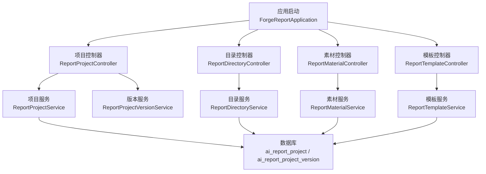
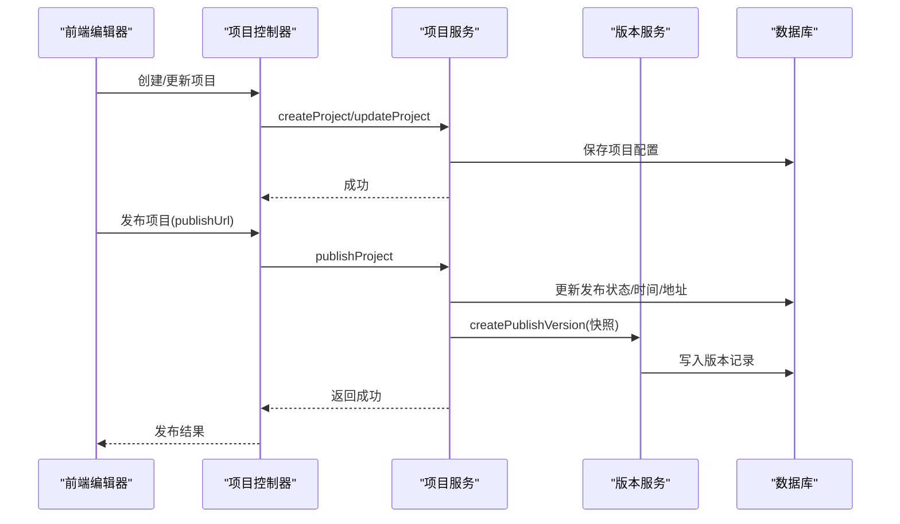
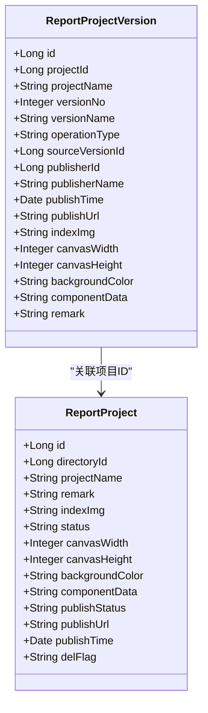
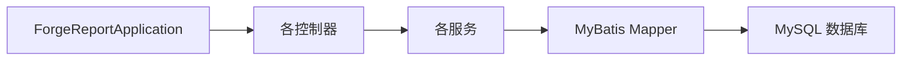

# 报表服务

<cite>
**本文引用的文件**
- [ForgeReportApplication.java](file://forge-server/forge-report-server/src/main/java/com/mdframe/forge/report/ForgeReportApplication.java)
- [ReportProjectController.java](file://forge-server/forge-report-server/src/main/java/com/mdframe/forge/report/project/controller/ReportProjectController.java)
- [ReportProjectService.java](file://forge-server/forge-report-server/src/main/java/com/mdframe/forge/report/project/service/ReportProjectService.java)
- [ReportProject.java](file://forge-server/forge-report-server/src/main/java/com/mdframe/forge/report/project/domain/ReportProject.java)
- [ReportProjectVersion.java](file://forge-server/forge-report-server/src/main/java/com/mdframe/forge/report/project/domain/ReportProjectVersion.java)
- [ReportMaterial.java](file://forge-server/forge-report-server/src/main/java/com/mdframe/forge/report/material/domain/ReportMaterial.java)
- [ReportMaterialController.java](file://forge-server/forge-report-server/src/main/java/com/mdframe/forge/report/material/controller/ReportMaterialController.java)
- [ReportMaterialService.java](file://forge-server/forge-report-server/src/main/java/com/mdframe/forge/report/material/service/ReportMaterialService.java)
- [ReportDirectoryController.java](file://forge-server/forge-report-server/src/main/java/com/mdframe/forge/report/project/directory/controller/ReportDirectoryController.java)
- [ReportDirectoryService.java](file://forge-server/forge-report-server/src/main/java/com/mdframe/forge/report/project/directory/service/ReportDirectoryService.java)
- [ReportTemplateController.java](file://forge-server/forge-report-server/src/main/java/com/mdframe/forge/report/project/template/controller/ReportTemplateController.java)
- [ReportTemplateService.java](file://forge-server/forge-report-server/src/main/java/com/mdframe/forge/report/project/template/service/ReportTemplateService.java)
- [report-init.sql](file://forge-server/forge-report-server/sql/report-init.sql)
- [report_material_migration.sql](file://forge-server/forge-report-server/sql/report_material_migration.sql)
</cite>

## 目录
1. [简介](#简介)
2. [项目结构](#项目结构)
3. [核心组件](#核心组件)
4. [架构总览](#架构总览)
5. [详细组件分析](#详细组件分析)
6. [依赖关系分析](#依赖关系分析)
7. [性能考量](#性能考量)
8. [故障排查指南](#故障排查指南)
9. [结论](#结论)
10. [附录](#附录)

## 简介
本技术文档面向“AI 数据大屏”的报表服务后端实现，围绕可视化编辑器支持、组件库管理、模板市场能力进行系统化说明。重点阐述：
- 数据源抽象层设计：统一访问多种数据库与 API 接口（通过 HTTP 数据源与数据池能力）。
- 报表渲染引擎工作原理：图表生成、数据聚合与实时刷新机制（前端渲染为主，后端提供数据与配置）。
- 大数据量优化：分页查询、数据预取与内存管理策略。
- 权限控制、版本管理与发布流程。
- 性能监控、错误追踪与故障恢复机制。

该服务以 Spring Boot 应用形式独立部署，对外暴露 RESTful 接口，配合前端可视化编辑器完成大屏的设计、预览与发布。

## 项目结构
报表服务位于 forge-server/forge-report-server 模块，采用分层组织：
- 启动入口：Spring Boot 应用类，启用 MyBatis Mapper 扫描与 AOP。
- 领域模型：项目、版本、素材等实体。
- 控制器：项目、目录、素材、模板、Mock 数据等接口。
- 服务层：业务编排、事务控制、校验与异常处理。
- 数据访问：Mapper 与 SQL 初始化脚本。

图示来源
- [ForgeReportApplication.java:1-26](file://forge-server/forge-report-server/src/main/java/com/mdframe/forge/report/ForgeReportApplication.java#L1-L26)
- [ReportProjectController.java:1-110](file://forge-server/forge-report-server/src/main/java/com/mdframe/forge/report/project/controller/ReportProjectController.java#L1-L110)
- [ReportProjectService.java:1-206](file://forge-server/forge-report-server/src/main/java/com/mdframe/forge/report/project/service/ReportProjectService.java#L1-L206)

章节来源
- [ForgeReportApplication.java:1-26](file://forge-server/forge-report-server/src/main/java/com/mdframe/forge/report/ForgeReportApplication.java#L1-L26)

## 核心组件
- 项目与版本管理：项目实体承载画布尺寸、背景色、组件 JSON、发布状态与地址；版本实体记录每次发布的快照，支持回滚。
- 目录管理：为项目提供树形分类与移动能力，支撑项目列表按目录筛选。
- 素材管理：统一管理背景、面板、图标、插画等素材资源，支持私有/公共与状态管理。
- 模板市场：提供模板复制与二次编辑能力，加速大屏构建。
- Mock 数据：便于设计与调试阶段快速填充数据。

章节来源
- [ReportProject.java:1-100](file://forge-server/forge-report-server/src/main/java/com/mdframe/forge/report/project/domain/ReportProject.java#L1-L100)
- [ReportProjectVersion.java:1-115](file://forge-server/forge-report-server/src/main/java/com/mdframe/forge/report/project/domain/ReportProjectVersion.java#L1-L115)
- [ReportMaterial.java:1-52](file://forge-server/forge-report-server/src/main/java/com/mdframe/forge/report/material/domain/ReportMaterial.java#L1-L52)
- [ReportProjectController.java:1-110](file://forge-server/forge-report-server/src/main/java/com/mdframe/forge/report/project/controller/ReportProjectController.java#L1-L110)
- [ReportProjectService.java:1-206](file://forge-server/forge-report-server/src/main/java/com/mdframe/forge/report/project/service/ReportProjectService.java#L1-L206)

## 架构总览
报表服务遵循“控制器-服务-数据访问”的分层架构，结合租户隔离与通用安全注解（加解密）提供稳定可靠的 REST API。前端负责可视化编辑与渲染，后端负责持久化与数据供给。

图示来源
- [ReportProjectController.java:1-110](file://forge-server/forge-report-server/src/main/java/com/mdframe/forge/report/project/controller/ReportProjectController.java#L1-L110)
- [ReportProjectService.java:1-206](file://forge-server/forge-report-server/src/main/java/com/mdframe/forge/report/project/service/ReportProjectService.java#L1-L206)

## 详细组件分析

### 项目与版本管理
- 项目实体包含画布尺寸、背景色、组件 JSON、发布状态与发布地址，支持软删除与租户隔离。
- 版本实体记录每次发布的完整快照，包括版本号、操作类型、发布人信息与发布地址，支持回滚到历史版本。
- 服务层提供分页查询、创建、更新、发布与封面图 URL 规范化逻辑，确保截图路径与文件 ID 的一致性。

图示来源
- [ReportProject.java:1-100](file://forge-server/forge-report-server/src/main/java/com/mdframe/forge/report/project/domain/ReportProject.java#L1-L100)
- [ReportProjectVersion.java:1-115](file://forge-server/forge-report-server/src/main/java/com/mdframe/forge/report/project/domain/ReportProjectVersion.java#L1-L115)

章节来源
- [ReportProjectService.java:1-206](file://forge-server/forge-report-server/src/main/java/com/mdframe/forge/report/project/service/ReportProjectService.java#L1-L206)
- [ReportProjectController.java:1-110](file://forge-server/forge-report-server/src/main/java/com/mdframe/forge/report/project/controller/ReportProjectController.java#L1-L110)

### 目录管理
- 目录服务提供子目录 ID 集合查询与存在性校验，用于项目列表按目录筛选与项目归属校验。
- 目录控制器暴露移动等操作接口，支撑项目树形组织。

章节来源
- [ReportDirectoryService.java](file://forge-server/forge-report-server/src/main/java/com/mdframe/forge/report/project/directory/service/ReportDirectoryService.java)
- [ReportDirectoryController.java](file://forge-server/forge-report-server/src/main/java/com/mdframe/forge/report/project/directory/controller/ReportDirectoryController.java)

### 素材管理
- 素材实体记录文件 ID、分类（背景/面板/图标/插画）、是否私有与状态。
- 素材控制器与服务提供素材的增删改查与分类管理能力，支撑编辑器中的素材库。

章节来源
- [ReportMaterial.java:1-52](file://forge-server/forge-report-server/src/main/java/com/mdframe/forge/report/material/domain/ReportMaterial.java#L1-L52)
- [ReportMaterialController.java](file://forge-server/forge-report-server/src/main/java/com/mdframe/forge/report/material/controller/ReportMaterialController.java)
- [ReportMaterialService.java](file://forge-server/forge-report-server/src/main/java/com/mdframe/forge/report/material/service/ReportMaterialService.java)

### 模板市场
- 模板控制器与服务提供模板复制与二次编辑能力，便于快速复用行业模板。
- 模板复制结果 VO 封装复制后的模板信息，便于前端展示。

章节来源
- [ReportTemplateController.java](file://forge-server/forge-report-server/src/main/java/com/mdframe/forge/report/project/template/controller/ReportTemplateController.java)
- [ReportTemplateService.java](file://forge-server/forge-report-server/src/main/java/com/mdframe/forge/report/project/template/service/ReportTemplateService.java)

### 数据源抽象层（HTTP 数据源与数据池）
- 数据接入方式：静态数据、动态 HTTP 请求、数据池。
- 抽象层职责：统一封装不同数据源的查询参数、认证头、重试与超时策略，屏蔽底层差异。
- 与编辑器集成：编辑器将数据源配置（URL、方法、参数、鉴权）序列化后存储于组件或项目配置中，运行时由渲染引擎解析并调用。

章节来源
- [ReportProject.java:1-100](file://forge-server/forge-report-server/src/main/java/com/mdframe/forge/report/project/domain/ReportProject.java#L1-L100)

### 报表渲染引擎（图表生成、数据聚合、实时刷新）
- 图表生成：前端基于 ECharts/VChart 根据组件配置渲染图表；后端提供数据接口与聚合计算。
- 数据聚合：支持在数据源层或后端服务层进行聚合（如分组、求和），减少前端计算压力。
- 实时刷新：通过定时轮询或 WebSocket/SSE 推送增量数据，前端按需更新视图。

章节来源
- [ReportProject.java:1-100](file://forge-server/forge-report-server/src/main/java/com/mdframe/forge/report/project/domain/ReportProject.java#L1-L100)

### 大数据量优化方案
- 分页查询：使用 MyBatis-Plus 分页插件，服务端分页降低传输与渲染压力。
- 数据预取：对热点数据进行缓存或预加载，减少重复请求。
- 内存管理：限制单次返回条数，避免大对象占用过多内存；对图片等资源进行压缩与懒加载。

章节来源
- [ReportProjectService.java:1-206](file://forge-server/forge-report-server/src/main/java/com/mdframe/forge/report/project/service/ReportProjectService.java#L1-L206)

### 权限控制、版本管理与发布流程
- 权限控制：通过 Sa-Token 与 RBAC 控制菜单、按钮与资源访问；项目与素材均支持租户隔离。
- 版本管理：每次发布生成版本快照，支持查看历史版本与回滚。
- 发布流程：更新项目发布状态与地址，创建版本记录，前端可基于版本地址预览与分享。

章节来源
- [ReportProjectController.java:1-110](file://forge-server/forge-report-server/src/main/java/com/mdframe/forge/report/project/controller/ReportProjectController.java#L1-L110)
- [ReportProjectService.java:1-206](file://forge-server/forge-report-server/src/main/java/com/mdframe/forge/report/project/service/ReportProjectService.java#L1-L206)

### 错误处理与异常
- 业务异常：参数校验失败、项目不存在、发布状态保存失败等抛出统一业务异常。
- 全局异常：框架级异常处理器捕获未处理异常，返回标准响应结构。
- 日志记录：关键操作（创建、更新、发布、回滚）记录操作日志，便于审计与排障。

章节来源
- [ReportProjectService.java:1-206](file://forge-server/forge-report-server/src/main/java/com/mdframe/forge/report/project/service/ReportProjectService.java#L1-L206)

## 依赖关系分析
- 应用启动类扫描基础包并启用 AOP，Mapper 扫描限定至报表模块。
- 控制器依赖服务层，服务层依赖目录、版本、素材等服务，最终通过 Mapper 访问数据库。
- 数据库表 ai_report_project、ai_report_project_version、ai_report_material 分别对应项目、版本与素材。

图示来源
- [ForgeReportApplication.java:1-26](file://forge-server/forge-report-server/src/main/java/com/mdframe/forge/report/ForgeReportApplication.java#L1-L26)

章节来源
- [ForgeReportApplication.java:1-26](file://forge-server/forge-report-server/src/main/java/com/mdframe/forge/report/ForgeReportApplication.java#L1-L26)

## 性能考量
- 分页与限流：所有列表接口默认分页，避免一次性拉取大量数据；必要时增加限流保护。
- 缓存策略：对热点配置（如模板、字典）进行缓存，减少数据库压力。
- 连接池与超时：合理配置数据库连接池大小与查询超时，防止慢查询阻塞。
- 资源优化：图片与素材压缩、CDN 加速、懒加载与虚拟滚动。

[本节为通用指导，不直接分析具体文件]

## 故障排查指南
- 启动问题：检查数据库与 Redis 连接配置，确认 Flyway 迁移是否执行。
- 接口报错：查看控制器与服务层的异常抛出点，定位参数校验与业务规则。
- 发布失败：核对项目是否存在、发布地址是否合法，检查版本服务是否成功写入。
- 素材无法显示：确认封面图 URL 规范化逻辑是否正确提取文件 ID。

章节来源
- [ReportProjectService.java:1-206](file://forge-server/forge-report-server/src/main/java/com/mdframe/forge/report/project/service/ReportProjectService.java#L1-L206)

## 结论
报表服务以清晰的分层架构与完善的版本管理为基础，结合前端可视化编辑器实现了高效的大屏设计与发布流程。通过数据源抽象层与渲染引擎的配合，支持多数据源接入与实时刷新；通过分页、缓存与资源优化保障大数据场景下的性能。权限控制与审计日志满足企业级安全与合规需求。

[本节为总结性内容，不直接分析具体文件]

## 附录
- 数据库初始化脚本：report-init.sql、report_material_migration.sql
- 快速开始：参考仓库 README 的后端启动与前端开发命令

章节来源
- [report-init.sql](file://forge-server/forge-report-server/sql/report-init.sql)
- [report_material_migration.sql](file://forge-server/forge-report-server/sql/report_material_migration.sql)