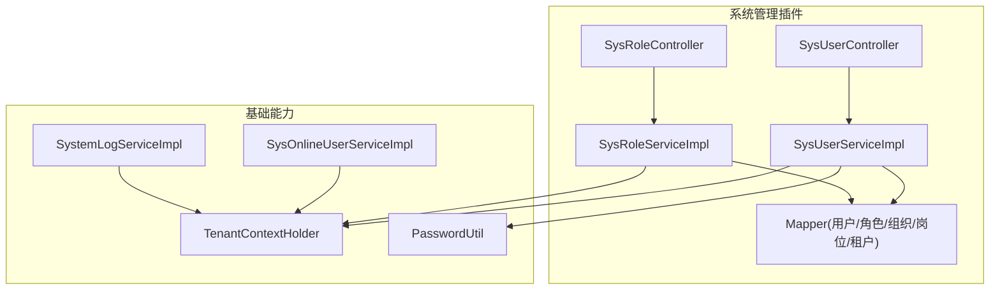
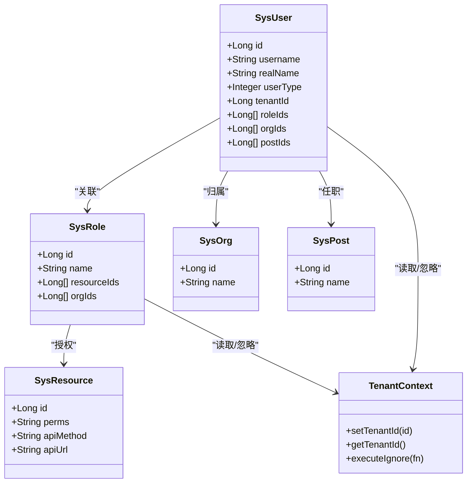
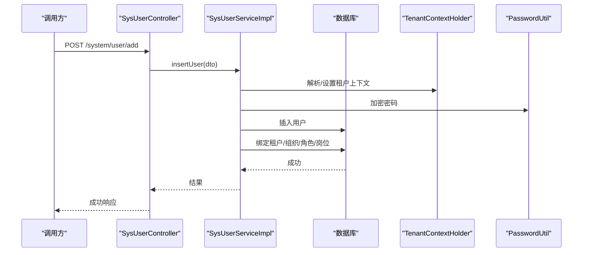
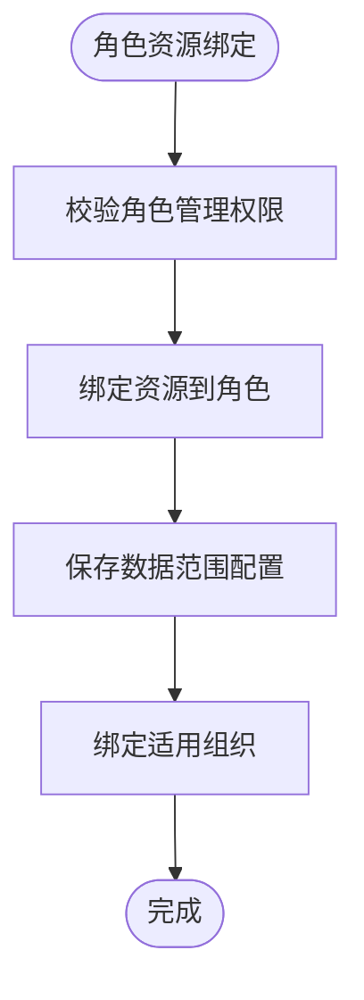
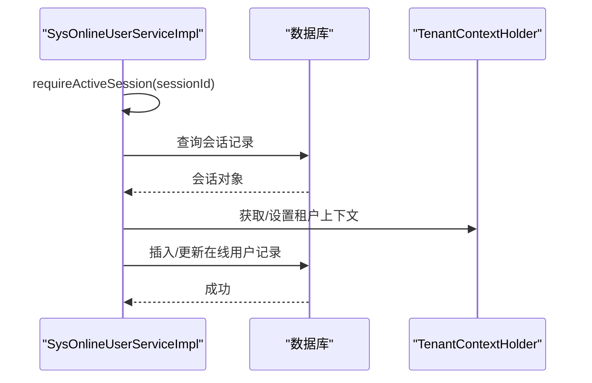
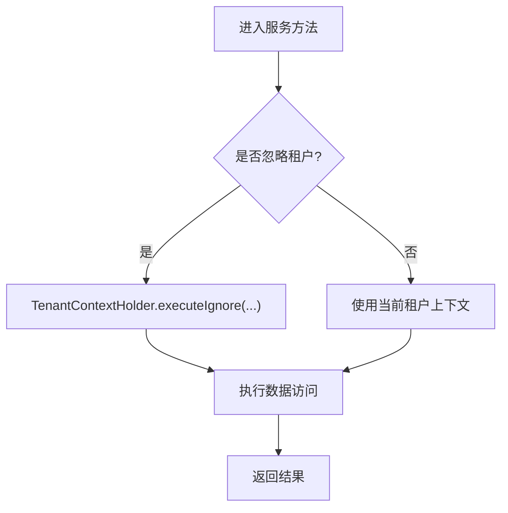
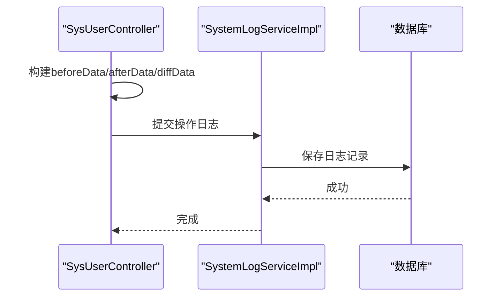
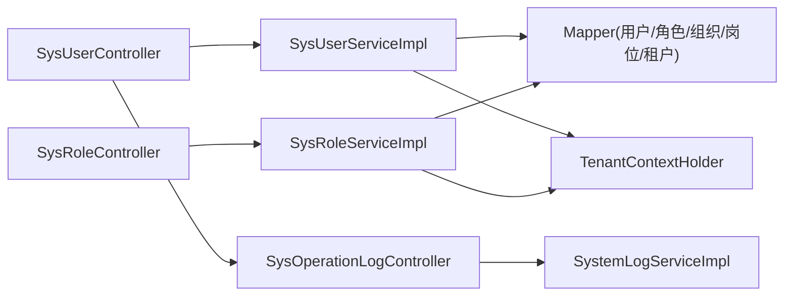

# 系统管理服务

<cite>
**本文引用的文件**
- [SysUserController.java](file://forge-server/forge-framework/forge-plugin-parent/forge-plugin-system/src/main/java/com/mdframe/forge/plugin/system/controller/SysUserController.java)
- [SysRoleController.java](file://forge-server/forge-framework/forge-plugin-parent/forge-plugin-system/src/main/java/com/mdframe/forge/plugin/system/controller/SysRoleController.java)
- [SysUserServiceImpl.java](file://forge-server/forge-framework/forge-plugin-parent/forge-plugin-system/src/main/java/com/mdframe/forge/plugin/system/service/impl/SysUserServiceImpl.java)
- [SysRoleServiceImpl.java](file://forge-server/forge-framework/forge-plugin-parent/forge-plugin-system/src/main/java/com/mdframe/forge/plugin/system/service/impl/SysRoleServiceImpl.java)
- [SysOnlineUserServiceImpl.java](file://forge-server/forge-framework/forge-plugin-parent/forge-plugin-system/src/main/java/com/mdframe/forge/plugin/system/service/impl/SysOnlineUserServiceImpl.java)
- [TenantContextHolder.java](file://forge-server/forge-framework/forge-starter-parent/forge-starter-tenant/src/main/java/com/mdframe/forge/starter/tenant/context/TenantContextHolder.java)
- [TenantUtil.java](file://forge-server/forge-framework/forge-starter-parent/forge-starter-tenant/src/main/java/com/mdframe/forge/starter/tenant/util/TenantUtil.java)
- [PasswordUtil.java](file://forge-server/forge-framework/forge-starter-parent/forge-starter-auth/src/main/java/com/mdframe/forge/starter/auth/util/PasswordUtil.java)
- [SysOperationLogController.java](file://forge-server/forge-framework/forge-plugin-parent/forge-plugin-system/src/main/java/com/mdframe/forge/plugin/system/controller/SysOperationLogController.java)
- [SystemLogServiceImpl.java](file://forge-server/forge-framework/forge-plugin-parent/forge-plugin-system/src/main/java/com/mdframe/forge/plugin/system/service/impl/SystemLogServiceImpl.java)
- [V1.0.14__enhance_operation_log_page_audit.sql](file://forge-server/db/migration/V1.0.14__enhance_operation_log_page_audit.sql)
- [api_resources_example.sql](file://forge-server/forge-admin-server/src/main/resources/sql/api_resources_example.sql)
</cite>

## 目录
1. [简介](#简介)
2. [项目结构](#项目结构)
3. [核心组件](#核心组件)
4. [架构总览](#架构总览)
5. [详细组件分析](#详细组件分析)
6. [依赖关系分析](#依赖关系分析)
7. [性能考虑](#性能考虑)
8. [故障排查指南](#故障排查指南)
9. [结论](#结论)
10. [附录](#附录)

## 简介
本技术文档聚焦系统管理服务的用户管理、角色权限、菜单资源、部门组织、多租户数据隔离、会话与密码安全、审计日志等核心能力。文档从服务层实现出发，阐述 RBAC 权限模型在系统中的落地方式（权限验证、数据权限控制、动态权限分配），并给出接口规范、事务边界设计与性能优化建议，帮助读者快速理解与扩展系统管理能力。

## 项目结构
系统管理服务主要位于插件化架构的 system 插件中，采用 Controller-Service-Mapper 分层：
- 控制器层：暴露 REST 接口，负责参数校验、鉴权注解、操作日志埋点与响应封装。
- 服务层：承载业务逻辑，包括用户/角色/组织/岗位/租户绑定、RBAC 权限判定、数据范围控制、事务边界。
- 数据访问层：MyBatis Mapper 与实体映射，配合多租户上下文进行数据隔离。
- 基础设施：认证与密码工具、租户上下文、在线会话管理、操作日志记录。

**图示来源**
- [SysUserController.java:1-667](file://forge-server/forge-framework/forge-plugin-parent/forge-plugin-system/src/main/java/com/mdframe/forge/plugin/system/controller/SysUserController.java#L1-L667)
- [SysRoleController.java:1-180](file://forge-server/forge-framework/forge-plugin-parent/forge-plugin-system/src/main/java/com/mdframe/forge/plugin/system/controller/SysRoleController.java#L1-L180)
- [SysUserServiceImpl.java:1-200](file://forge-server/forge-framework/forge-plugin-parent/forge-plugin-system/src/main/java/com/mdframe/forge/plugin/system/service/impl/SysUserServiceImpl.java#L1-L200)
- [SysRoleServiceImpl.java:872-904](file://forge-server/forge-framework/forge-plugin-parent/forge-plugin-system/src/main/java/com/mdframe/forge/plugin/system/service/impl/SysRoleServiceImpl.java#L872-L904)
- [TenantContextHolder.java:1-63](file://forge-server/forge-framework/forge-starter-parent/forge-starter-tenant/src/main/java/com/mdframe/forge/starter/tenant/context/TenantContextHolder.java#L1-L63)
- [PasswordUtil.java:1-30](file://forge-server/forge-framework/forge-starter-parent/forge-starter-auth/src/main/java/com/mdframe/forge/starter/auth/util/PasswordUtil.java#L1-L30)
- [SysOnlineUserServiceImpl.java:457-486](file://forge-server/forge-framework/forge-plugin-parent/forge-plugin-system/src/main/java/com/mdframe/forge/plugin/system/service/impl/SysOnlineUserServiceImpl.java#L457-L486)
- [SystemLogServiceImpl.java:62-84](file://forge-server/forge-framework/forge-plugin-parent/forge-plugin-system/src/main/java/com/mdframe/forge/plugin/system/service/impl/SystemLogServiceImpl.java#L62-L84)

**章节来源**
- [SysUserController.java:1-667](file://forge-server/forge-framework/forge-plugin-parent/forge-plugin-system/src/main/java/com/mdframe/forge/plugin/system/controller/SysUserController.java#L1-L667)
- [SysRoleController.java:1-180](file://forge-server/forge-framework/forge-plugin-parent/forge-plugin-system/src/main/java/com/mdframe/forge/plugin/system/controller/SysRoleController.java#L1-L180)

## 核心组件
- 用户管理：提供分页查询、新增/编辑/删除、状态管理、资料更新、批量导入、角色/组织/岗位/租户绑定等能力，并在返回前脱敏敏感字段。
- 角色与权限：提供角色 CRUD、资源（菜单/按钮/接口）绑定、数据范围配置、适用组织绑定、角色下用户管理等。
- 在线会话：维护在线用户会话，支持按租户持久化与校验。
- 多租户：通过上下文持有者在查询/写入时注入或忽略租户过滤，保障数据隔离与系统级操作的灵活性。
- 密码安全：统一使用 BCrypt 加密与校验，避免明文存储。
- 审计日志：对关键操作进行前后快照与差异对比，支持分页查询与详情查看。

**章节来源**
- [SysUserController.java:63-117](file://forge-server/forge-framework/forge-plugin-parent/forge-plugin-system/src/main/java/com/mdframe/forge/plugin/system/controller/SysUserController.java#L63-L117)
- [SysUserController.java:119-193](file://forge-server/forge-framework/forge-plugin-parent/forge-plugin-system/src/main/java/com/mdframe/forge/plugin/system/controller/SysUserController.java#L119-L193)
- [SysUserController.java:195-390](file://forge-server/forge-framework/forge-plugin-parent/forge-plugin-system/src/main/java/com/mdframe/forge/plugin/system/controller/SysUserController.java#L195-L390)
- [SysUserController.java:392-549](file://forge-server/forge-framework/forge-plugin-parent/forge-plugin-system/src/main/java/com/mdframe/forge/plugin/system/controller/SysUserController.java#L392-L549)
- [SysRoleController.java:32-179](file://forge-server/forge-framework/forge-plugin-parent/forge-plugin-system/src/main/java/com/mdframe/forge/plugin/system/controller/SysRoleController.java#L32-L179)
- [SysUserServiceImpl.java:90-198](file://forge-server/forge-framework/forge-plugin-parent/forge-plugin-system/src/main/java/com/mdframe/forge/plugin/system/service/impl/SysUserServiceImpl.java#L90-L198)
- [SysRoleServiceImpl.java:872-904](file://forge-server/forge-framework/forge-plugin-parent/forge-plugin-system/src/main/java/com/mdframe/forge/plugin/system/service/impl/SysRoleServiceImpl.java#L872-L904)
- [SysOnlineUserServiceImpl.java:457-486](file://forge-server/forge-framework/forge-plugin-parent/forge-plugin-system/src/main/java/com/mdframe/forge/plugin/system/service/impl/SysOnlineUserServiceImpl.java#L457-L486)
- [TenantContextHolder.java:1-63](file://forge-server/forge-framework/forge-starter-parent/forge-starter-tenant/src/main/java/com/mdframe/forge/starter/tenant/context/TenantContextHolder.java#L1-L63)
- [PasswordUtil.java:1-30](file://forge-server/forge-framework/forge-starter-parent/forge-starter-auth/src/main/java/com/mdframe/forge/starter/auth/util/PasswordUtil.java#L1-L30)
- [SysOperationLogController.java:1-47](file://forge-server/forge-framework/forge-plugin-parent/forge-plugin-system/src/main/java/com/mdframe/forge/plugin/system/controller/SysOperationLogController.java#L1-L47)
- [SystemLogServiceImpl.java:62-84](file://forge-server/forge-framework/forge-plugin-parent/forge-plugin-system/src/main/java/com/mdframe/forge/plugin/system/service/impl/SystemLogServiceImpl.java#L62-L84)

## 架构总览
系统管理服务以 RBAC 为核心，结合多租户与数据范围控制，形成“用户-角色-资源”的权限体系；同时通过“用户-组织-岗位-租户”的关系支撑组织维度下的权限与数据可见性。

**图示来源**
- [SysUserServiceImpl.java:90-198](file://forge-server/forge-framework/forge-plugin-parent/forge-plugin-system/src/main/java/com/mdframe/forge/plugin/system/service/impl/SysUserServiceImpl.java#L90-L198)
- [SysRoleController.java:86-179](file://forge-server/forge-framework/forge-plugin-parent/forge-plugin-system/src/main/java/com/mdframe/forge/plugin/system/controller/SysRoleController.java#L86-L179)
- [TenantContextHolder.java:1-63](file://forge-server/forge-framework/forge-starter-parent/forge-starter-tenant/src/main/java/com/mdframe/forge/starter/tenant/context/TenantContextHolder.java#L1-L63)

## 详细组件分析

### 用户管理
- 功能要点
  - 分页查询与导出：支持按租户上下文忽略过滤，便于跨租户统计与导出。
  - 新增/编辑/删除：包含权限校验、自管理限制、类型校验、密码加密、组织/角色/岗位同步绑定。
  - 绑定关系：支持用户与角色、组织、岗位、租户的多维绑定，含批量操作。
  - 敏感信息保护：列表与详情返回时对手机号、邮箱、身份证等进行脱敏，并清理密码与盐值。
  - 审计日志：对增删改操作设置 before/after 快照与差异对比，便于追溯。
- 事务边界
  - 新增/编辑/删除均使用事务注解，确保主表与关联表一致性。
- 权限控制
  - 管理入口通过权限常量集合进行校验，管理员与租户管理员豁免。
- 多租户策略
  - 写操作解析目标租户ID；读操作可忽略租户上下文以支持系统级查询。

**图示来源**
- [SysUserController.java:119-132](file://forge-server/forge-framework/forge-plugin-parent/forge-plugin-system/src/main/java/com/mdframe/forge/plugin/system/controller/SysUserController.java#L119-L132)
- [SysUserServiceImpl.java:110-145](file://forge-server/forge-framework/forge-plugin-parent/forge-plugin-system/src/main/java/com/mdframe/forge/plugin/system/service/impl/SysUserServiceImpl.java#L110-L145)
- [TenantContextHolder.java:1-63](file://forge-server/forge-framework/forge-starter-parent/forge-starter-tenant/src/main/java/com/mdframe/forge/starter/tenant/context/TenantContextHolder.java#L1-L63)
- [PasswordUtil.java:1-30](file://forge-server/forge-framework/forge-starter-parent/forge-starter-auth/src/main/java/com/mdframe/forge/starter/auth/util/PasswordUtil.java#L1-L30)

**章节来源**
- [SysUserController.java:63-193](file://forge-server/forge-framework/forge-plugin-parent/forge-plugin-system/src/main/java/com/mdframe/forge/plugin/system/controller/SysUserController.java#L63-L193)
- [SysUserServiceImpl.java:90-198](file://forge-server/forge-framework/forge-plugin-parent/forge-plugin-system/src/main/java/com/mdframe/forge/plugin/system/service/impl/SysUserServiceImpl.java#L90-L198)
- [SysUserController.java:435-549](file://forge-server/forge-framework/forge-plugin-parent/forge-plugin-system/src/main/java/com/mdframe/forge/plugin/system/controller/SysUserController.java#L435-L549)

### 角色与权限（RBAC）
- 功能要点
  - 角色 CRUD：分页、详情、新增、编辑、删除、批量删除。
  - 资源绑定：为角色绑定菜单/按钮/接口资源，支持客户端维度与父资源包含。
  - 数据范围：保存角色的默认与业务模块数据范围，用于数据权限控制。
  - 适用组织：限定角色生效的组织范围。
  - 用户管理：查询角色下用户、添加/移除用户。
- 权限校验
  - 管理入口通过权限集合校验，支持通配符与精确匹配。
- 多租户策略
  - 资源与角色绑定可在租户维度生效，查询时可忽略租户上下文。

**图示来源**
- [SysRoleController.java:86-179](file://forge-server/forge-framework/forge-plugin-parent/forge-plugin-system/src/main/java/com/mdframe/forge/plugin/system/controller/SysRoleController.java#L86-L179)
- [SysRoleServiceImpl.java:872-904](file://forge-server/forge-framework/forge-plugin-parent/forge-plugin-system/src/main/java/com/mdframe/forge/plugin/system/service/impl/SysRoleServiceImpl.java#L872-L904)

**章节来源**
- [SysRoleController.java:32-179](file://forge-server/forge-framework/forge-plugin-parent/forge-plugin-system/src/main/java/com/mdframe/forge/plugin/system/controller/SysRoleController.java#L32-L179)
- [SysRoleServiceImpl.java:872-904](file://forge-server/forge-framework/forge-plugin-parent/forge-plugin-system/src/main/java/com/mdframe/forge/plugin/system/service/impl/SysRoleServiceImpl.java#L872-L904)

### 在线会话管理
- 功能要点
  - 会话存在性与有效性校验。
  - 按租户持久化在线用户记录，缺失租户信息时抛出异常。
  - 基于 Token 执行租户相关操作，空 Token 时跳过。
- 安全策略
  - 会话状态启用检查，防止无效会话操作。

**图示来源**
- [SysOnlineUserServiceImpl.java:457-486](file://forge-server/forge-framework/forge-plugin-parent/forge-plugin-system/src/main/java/com/mdframe/forge/plugin/system/service/impl/SysOnlineUserServiceImpl.java#L457-L486)
- [TenantContextHolder.java:1-63](file://forge-server/forge-framework/forge-starter-parent/forge-starter-tenant/src/main/java/com/mdframe/forge/starter/tenant/context/TenantContextHolder.java#L1-L63)

**章节来源**
- [SysOnlineUserServiceImpl.java:457-486](file://forge-server/forge-framework/forge-plugin-parent/forge-plugin-system/src/main/java/com/mdframe/forge/plugin/system/service/impl/SysOnlineUserServiceImpl.java#L457-L486)

### 多租户数据隔离与服务边界
- 上下文机制
  - 使用 TransmittableThreadLocal 传递租户 ID，支持线程池场景。
  - 提供忽略租户执行的能力，用于系统级操作或跨租户统计。
- 服务边界
  - 用户/角色/组织/岗位/租户绑定在服务层解析目标租户，保证写入正确隔离。
  - 查询可通过忽略上下文实现跨租户聚合。

**图示来源**
- [TenantContextHolder.java:1-63](file://forge-server/forge-framework/forge-starter-parent/forge-starter-tenant/src/main/java/com/mdframe/forge/starter/tenant/context/TenantContextHolder.java#L1-L63)
- [SysUserServiceImpl.java:90-107](file://forge-server/forge-framework/forge-plugin-parent/forge-plugin-system/src/main/java/com/mdframe/forge/plugin/system/service/impl/SysUserServiceImpl.java#L90-L107)

**章节来源**
- [TenantContextHolder.java:1-63](file://forge-server/forge-framework/forge-starter-parent/forge-starter-tenant/src/main/java/com/mdframe/forge/starter/tenant/context/TenantContextHolder.java#L1-L63)
- [TenantUtil.java:1-58](file://forge-server/forge-framework/forge-starter-parent/forge-starter-tenant/src/main/java/com/mdframe/forge/starter/tenant/util/TenantUtil.java#L1-L58)
- [SysUserServiceImpl.java:90-107](file://forge-server/forge-framework/forge-plugin-parent/forge-plugin-system/src/main/java/com/mdframe/forge/plugin/system/service/impl/SysUserServiceImpl.java#L90-L107)

### 密码安全策略
- 加密与校验
  - 统一使用 BCrypt 生成盐值并加密，登录时进行匹配校验。
- 强制修改
  - 新增用户时标记首次登录需强制修改密码，提升安全性。

**章节来源**
- [PasswordUtil.java:1-30](file://forge-server/forge-framework/forge-starter-parent/forge-starter-auth/src/main/java/com/mdframe/forge/starter/auth/util/PasswordUtil.java#L1-L30)
- [SysUserServiceImpl.java:110-145](file://forge-server/forge-framework/forge-plugin-parent/forge-plugin-system/src/main/java/com/mdframe/forge/plugin/system/service/impl/SysUserServiceImpl.java#L110-L145)

### 审计日志记录
- 操作日志
  - 控制器层通过注解记录操作类型与描述。
  - 服务层对关键操作设置 before/after 快照与差异对比，便于审计。
- 页面审计
  - 迁移脚本为审计日志相关资源与接口定义权限与菜单项。

**图示来源**
- [SysUserController.java:435-549](file://forge-server/forge-framework/forge-plugin-parent/forge-plugin-system/src/main/java/com/mdframe/forge/plugin/system/controller/SysUserController.java#L435-L549)
- [SystemLogServiceImpl.java:62-84](file://forge-server/forge-framework/forge-plugin-parent/forge-plugin-system/src/main/java/com/mdframe/forge/plugin/system/service/impl/SystemLogServiceImpl.java#L62-L84)
- [V1.0.14__enhance_operation_log_page_audit.sql:200-216](file://forge-server/db/migration/V1.0.14__enhance_operation_log_page_audit.sql#L200-L216)

**章节来源**
- [SysOperationLogController.java:1-47](file://forge-server/forge-framework/forge-plugin-parent/forge-plugin-system/src/main/java/com/mdframe/forge/plugin/system/controller/SysOperationLogController.java#L1-L47)
- [SystemLogServiceImpl.java:62-84](file://forge-server/forge-framework/forge-plugin-parent/forge-plugin-system/src/main/java/com/mdframe/forge/plugin/system/service/impl/SystemLogServiceImpl.java#L62-L84)
- [V1.0.14__enhance_operation_log_page_audit.sql:200-216](file://forge-server/db/migration/V1.0.14__enhance_operation_log_page_audit.sql#L200-L216)

## 依赖关系分析
- 控制器依赖服务接口，服务依赖 Mapper 与上下文工具。
- 权限校验依赖 LoginUser 与权限集合，支持通配符匹配。
- 多租户上下文贯穿读写路径，确保数据隔离。
- 审计日志依赖操作上下文与数据库持久化。

**图示来源**
- [SysUserController.java:1-667](file://forge-server/forge-framework/forge-plugin-parent/forge-plugin-system/src/main/java/com/mdframe/forge/plugin/system/controller/SysUserController.java#L1-L667)
- [SysRoleController.java:1-180](file://forge-server/forge-framework/forge-plugin-parent/forge-plugin-system/src/main/java/com/mdframe/forge/plugin/system/controller/SysRoleController.java#L1-L180)
- [SysUserServiceImpl.java:1-200](file://forge-server/forge-framework/forge-plugin-parent/forge-plugin-system/src/main/java/com/mdframe/forge/plugin/system/service/impl/SysUserServiceImpl.java#L1-L200)
- [SysRoleServiceImpl.java:872-904](file://forge-server/forge-framework/forge-plugin-parent/forge-plugin-system/src/main/java/com/mdframe/forge/plugin/system/service/impl/SysRoleServiceImpl.java#L872-L904)
- [TenantContextHolder.java:1-63](file://forge-server/forge-framework/forge-starter-parent/forge-starter-tenant/src/main/java/com/mdframe/forge/starter/tenant/context/TenantContextHolder.java#L1-L63)
- [SysOperationLogController.java:1-47](file://forge-server/forge-framework/forge-plugin-parent/forge-plugin-system/src/main/java/com/mdframe/forge/plugin/system/controller/SysOperationLogController.java#L1-L47)
- [SystemLogServiceImpl.java:62-84](file://forge-server/forge-framework/forge-plugin-parent/forge-plugin-system/src/main/java/com/mdframe/forge/plugin/system/service/impl/SystemLogServiceImpl.java#L62-L84)

**章节来源**
- [SysUserController.java:1-667](file://forge-server/forge-framework/forge-plugin-parent/forge-plugin-system/src/main/java/com/mdframe/forge/plugin/system/controller/SysUserController.java#L1-L667)
- [SysRoleController.java:1-180](file://forge-server/forge-framework/forge-plugin-parent/forge-plugin-system/src/main/java/com/mdframe/forge/plugin/system/controller/SysRoleController.java#L1-L180)
- [SysUserServiceImpl.java:1-200](file://forge-server/forge-framework/forge-plugin-parent/forge-plugin-system/src/main/java/com/mdframe/forge/plugin/system/service/impl/SysUserServiceImpl.java#L1-L200)
- [SysRoleServiceImpl.java:872-904](file://forge-server/forge-framework/forge-plugin-parent/forge-plugin-system/src/main/java/com/mdframe/forge/plugin/system/service/impl/SysRoleServiceImpl.java#L872-L904)
- [TenantContextHolder.java:1-63](file://forge-server/forge-framework/forge-starter-parent/forge-starter-tenant/src/main/java/com/mdframe/forge/starter/tenant/context/TenantContextHolder.java#L1-L63)
- [SysOperationLogController.java:1-47](file://forge-server/forge-framework/forge-plugin-parent/forge-plugin-system/src/main/java/com/mdframe/forge/plugin/system/controller/SysOperationLogController.java#L1-L47)
- [SystemLogServiceImpl.java:62-84](file://forge-server/forge-framework/forge-plugin-parent/forge-plugin-system/src/main/java/com/mdframe/forge/plugin/system/service/impl/SystemLogServiceImpl.java#L62-L84)

## 性能考虑
- 分页与导出
  - 分页查询使用 MyBatis Plus Page，避免全量加载；导出时忽略租户上下文以提升跨租户效率。
- 缓存与上下文
  - 多租户上下文使用 TransmittableThreadLocal，减少线程切换开销；必要时可结合应用缓存降低重复查询。
- 事务粒度
  - 将关联表写入纳入同一事务，避免中间态；尽量缩小事务范围，减少锁竞争。
- 敏感数据处理
  - 列表与详情返回前进行脱敏，避免额外网络传输与前端处理成本。
- 批量操作
  - 批量绑定角色/组织/岗位/租户时，合并 SQL 操作，减少往返次数。

[本节为通用性能建议，不直接分析具体文件]

## 故障排查指南
- 权限不足
  - 现象：访问角色/用户管理接口时报无权。
  - 排查：确认当前用户是否具备对应权限集合中的任一权限；检查是否被通配符覆盖。
- 租户上下文错误
  - 现象：数据查询不到或写入到错误租户。
  - 排查：检查服务层是否正确设置或忽略租户上下文；确认 Mapper 查询是否受租户过滤影响。
- 会话无效
  - 现象：在线用户操作失败。
  - 排查：检查会话是否存在且状态启用；确认租户信息是否完整。
- 审计日志缺失
  - 现象：操作后无日志记录。
  - 排查：确认控制器是否设置 before/after 快照；检查日志服务是否正常持久化。

**章节来源**
- [SysRoleServiceImpl.java:872-904](file://forge-server/forge-framework/forge-plugin-parent/forge-plugin-system/src/main/java/com/mdframe/forge/plugin/system/service/impl/SysRoleServiceImpl.java#L872-L904)
- [SysUserServiceImpl.java:90-198](file://forge-server/forge-framework/forge-plugin-parent/forge-plugin-system/src/main/java/com/mdframe/forge/plugin/system/service/impl/SysUserServiceImpl.java#L90-L198)
- [SysOnlineUserServiceImpl.java:457-486](file://forge-server/forge-framework/forge-plugin-parent/forge-plugin-system/src/main/java/com/mdframe/forge/plugin/system/service/impl/SysOnlineUserServiceImpl.java#L457-L486)
- [SystemLogServiceImpl.java:62-84](file://forge-server/forge-framework/forge-plugin-parent/forge-plugin-system/src/main/java/com/mdframe/forge/plugin/system/service/impl/SystemLogServiceImpl.java#L62-L84)

## 结论
系统管理服务以 RBAC 为核心，结合多租户上下文与数据范围控制，实现了灵活而安全的权限与数据隔离。用户、角色、组织、岗位与租户的多维绑定满足复杂企业场景；在线会话与审计日志保障了可追溯性与合规性。建议在后续迭代中持续优化事务粒度、引入缓存与批量优化，并完善权限资源的细粒度管控。

[本节为总结性内容，不直接分析具体文件]

## 附录

### 接口规范（节选）
- 用户管理
  - GET /system/user/page：分页查询用户列表
  - POST /system/user/getById：根据 ID 查询用户详情
  - POST /system/user/add：新增用户
  - POST /system/user/edit：修改用户
  - POST /system/user/remove：删除用户
  - POST /system/user/removeBatch：批量删除用户
  - POST /system/user/{userId}/roles：绑定用户角色
  - POST /system/user/batch/roles：批量授权用户角色
  - POST /system/user/{userId}/roles/unbind：解除用户角色
  - POST /system/user/{userId}/org：绑定用户组织
  - POST /system/user/{userId}/org/unbind：解除用户组织
  - GET /system/user/{userId}/roles：查询用户角色 ID 列表
  - GET /system/user/{userId}/orgs：查询用户组织 ID 列表
  - GET /system/user/{userId}/org-bindings：查询用户组织绑定详情
  - GET /system/user/{userId}/tenants：查询用户租户绑定列表
  - POST /system/user/{userId}/tenants：绑定用户租户
  - POST /system/user/batch/tenants：批量加入租户
  - POST /system/user/{userId}/orgs：批量绑定用户组织
  - GET /system/user/{userId}/org-roles：查询用户在指定组织下的角色 ID 列表
  - POST /system/user/{userId}/org-roles：保存用户在指定组织下的角色
  - GET /system/user/{userId}/posts：查询用户岗位 ID 列表
  - POST /system/user/{userId}/posts：批量绑定用户岗位
  - POST /system/user/resetPwd：重置用户密码
  - POST /system/user/updateStatus：更新用户状态
  - POST /system/user/updateProfile：更新用户资料
  - GET /system/user/profile：获取当前登录用户的基本资料
  - POST /system/user/import：批量导入用户
- 角色管理
  - GET /system/role/page：分页查询角色列表
  - POST /system/role/getById：根据 ID 查询角色详情
  - POST /system/role/add：新增角色
  - POST /system/role/edit：修改角色
  - POST /system/role/remove：删除角色
  - POST /system/role/removeBatch：批量删除角色
  - POST /system/role/{roleId}/resources：给角色绑定资源
  - POST /system/role/{roleId}/resources/unbind：解除角色资源
  - GET /system/role/{roleId}/resources：查询角色的资源 ID 列表
  - GET /system/role/{roleId}/dataScopes：查询角色数据范围
  - POST /system/role/{roleId}/dataScopes：保存角色数据范围
  - GET /system/role/{roleId}/orgs：查询角色适用组织 ID 列表
  - POST /system/role/{roleId}/orgs：保存角色适用组织
  - GET /system/role/{roleId}/users：查询角色下的用户列表
  - POST /system/role/removeUserRole：移除角色用户
  - POST /system/role/{roleId}/addUsers：批量添加用户到角色
- 操作日志
  - GET /system/operationLog/page：分页查询操作日志
  - GET /system/operationLog/{id}：查询操作日志详情

**章节来源**
- [SysUserController.java:63-390](file://forge-server/forge-framework/forge-plugin-parent/forge-plugin-system/src/main/java/com/mdframe/forge/plugin/system/controller/SysUserController.java#L63-L390)
- [SysRoleController.java:32-179](file://forge-server/forge-framework/forge-plugin-parent/forge-plugin-system/src/main/java/com/mdframe/forge/plugin/system/controller/SysRoleController.java#L32-L179)
- [SysOperationLogController.java:28-47](file://forge-server/forge-framework/forge-plugin-parent/forge-plugin-system/src/main/java/com/mdframe/forge/plugin/system/controller/SysOperationLogController.java#L28-L47)

### 资源与权限示例（节选）
- 角色管理 API
  - /system/role/page：分页查询角色列表
  - /system/role/add：新增角色
  - /system/role/edit：编辑角色信息
  - /system/role/remove：删除角色
- 资源管理 API
  - /system/resource/page：分页查询资源列表
  - /system/resource/tree：查询资源树
  - /system/resource/current/tree：查询当前用户资源树
  - /system/resource/current/menu：查询当前用户菜单树
  - /system/resource/current/permissions：查询当前用户权限列表
- 组织与租户管理 API（通配符示例）
  - /system/org/*：组织管理模块所有单层接口
  - /system/tenant/**：租户管理模块所有接口

**章节来源**
- [api_resources_example.sql:26-43](file://forge-server/forge-admin-server/src/main/resources/sql/api_resources_example.sql#L26-L43)