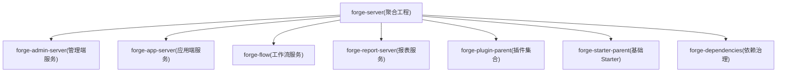
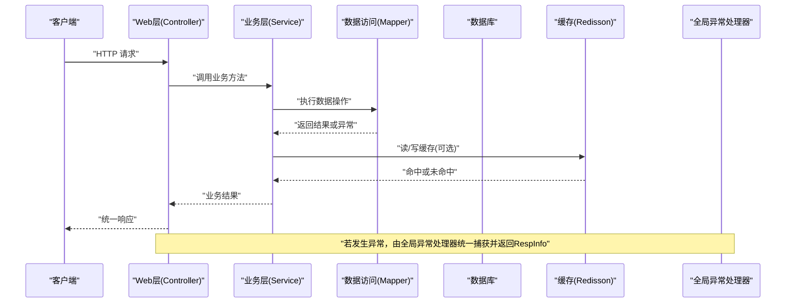
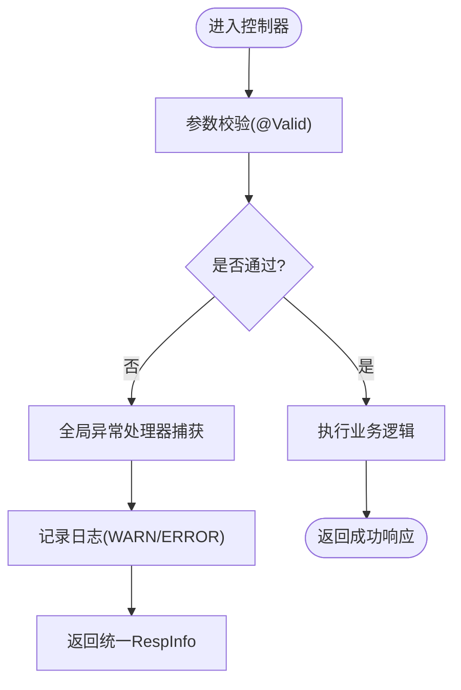
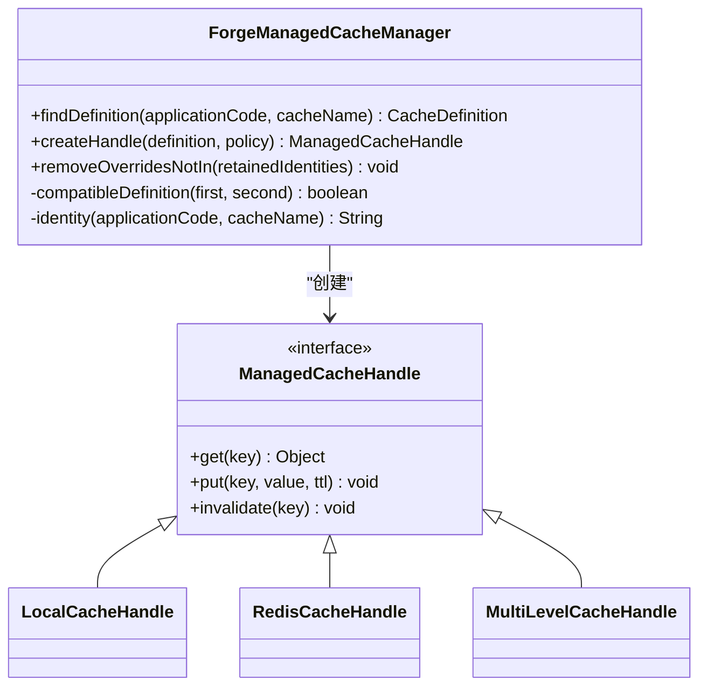
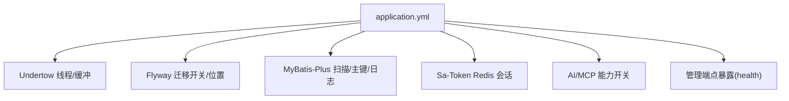
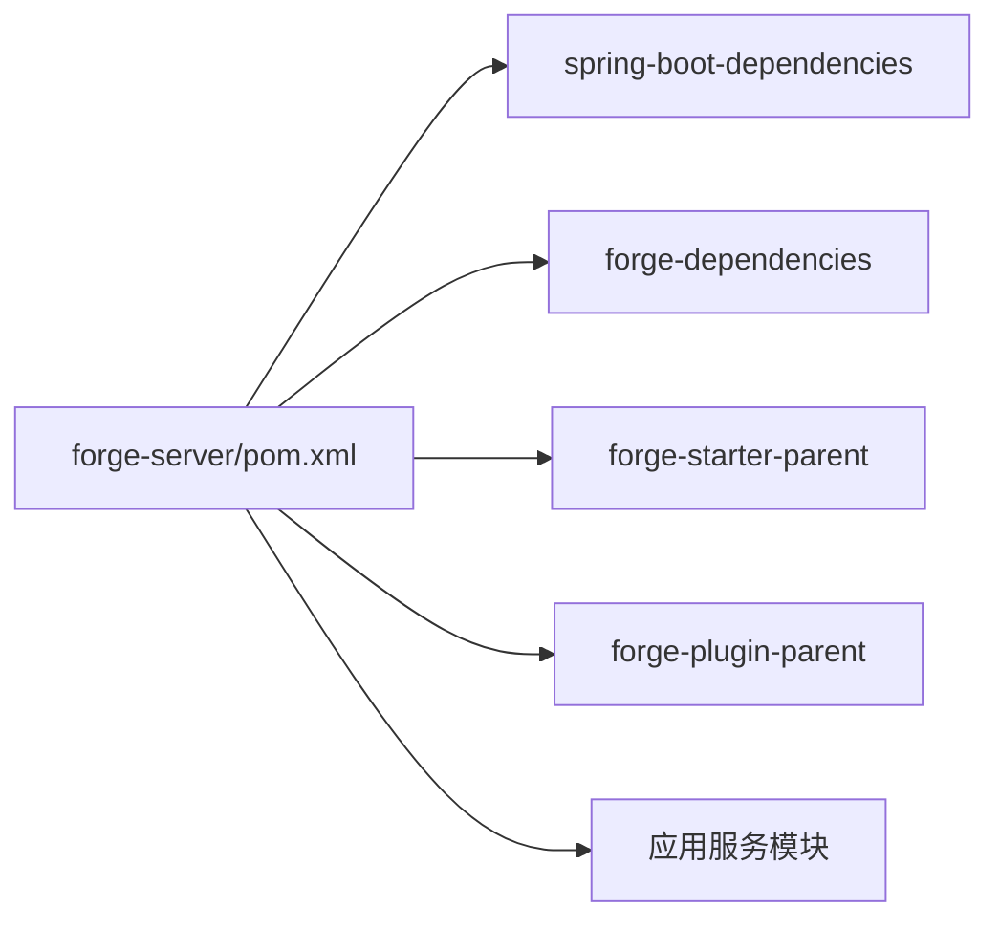

# 通用服务模式

<cite>
**本文引用的文件**
- [forge-server/pom.xml](file://forge-server/pom.xml)
- [application.yml](file://forge-server/forge-admin-server/src/main/resources/application.yml)
- [GlobalExceptionHandler.java](file://forge-server/forge-framework/forge-starter-parent/forge-starter-core/src/main/java/com/mdframe/forge/starter/core/exception/GlobalExceptionHandler.java)
- [ExceptionAutoConfiguration.java](file://forge-server/forge-framework/forge-starter-parent/forge-starter-core/src/main/java/com/mdframe/forge/starter/core/config/ExceptionAutoConfiguration.java)
- [EXCEPTION_USAGE.md](file://forge-server/forge-framework/forge-starter-parent/forge-starter-core/EXCEPTION_USAGE.md)
- [ForgeManagedCacheManager.java](file://forge-server/forge-framework/forge-starter-parent/forge-starter-cache/src/main/java/com/mdframe/forge/starter/cache/managed/ForgeManagedCacheManager.java)
- [ForgeCacheAspectTest.java](file://forge-server/forge-framework/forge-starter-parent/forge-starter-cache/src/test/java/com/mdframe/forge/starter/cache/managed/ForgeCacheAspectTest.java)
- [tech-global-exception-handler.md](file://code-copilot/knowledge/tech-global-exception-handler.md)
</cite>

## 目录
1. [引言](#引言)
2. [项目结构](#项目结构)
3. [核心组件](#核心组件)
4. [架构总览](#架构总览)
5. [详细组件分析](#详细组件分析)
6. [依赖关系分析](#依赖关系分析)
7. [性能考量](#性能考量)
8. [故障排查指南](#故障排查指南)
9. [结论](#结论)
10. [附录](#附录)

## 引言
本技术文档围绕 Spring Boot 微服务架构中的通用服务模式，结合仓库中实际实现，系统阐述分层架构、依赖注入与面向切面编程的应用；说明事务管理策略（声明式事务、分布式事务边界设计）；统一异常处理、日志记录与监控告警方案；缓存策略、连接池调优与并发控制优化；服务间通信、API 网关集成与微服务治理最佳实践；以及测试策略、Mock 框架使用与持续集成配置要点。内容既覆盖高层架构，也深入到关键代码路径与配置项，帮助读者快速理解并落地工程实践。

## 项目结构
本项目采用多模块 Maven 聚合工程，顶层 forge-server 聚合多个业务与服务子模块：
- 应用服务：forge-admin-server、forge-app-server、forge-flow、forge-report-server
- 能力与插件：forge-plugin-parent 下的 AI、数据、流程、消息、外部集成等插件
- 基础能力：forge-starter-parent 提供核心 starter（Web、ORM、缓存、事务、日志、租户、鉴权等）
- 版本与依赖治理：forge-dependencies 统一管理第三方依赖版本

**图示来源**
- [forge-server/pom.xml:186-193](file://forge-server/pom.xml#L186-L193)

**章节来源**
- [forge-server/pom.xml:1-127](file://forge-server/pom.xml#L1-L127)
- [forge-server/pom.xml:186-193](file://forge-server/pom.xml#L186-L193)

## 核心组件
- 全局异常处理：通过 @RestControllerAdvice 统一捕获参数校验、方法参数类型不匹配、上传大小超限、未找到处理器等异常，并返回统一响应体 RespInfo；自动配置类在启动时注册该处理器。
- 缓存管理：基于 Redisson 的多级缓存管理器，支持本地缓存与 Redis 缓存的协同、失效广播、运行时策略覆盖与一致性保障。
- 配置与环境：application.yml 集中配置 Undertow、MyBatis-Plus、Flyway、Sa-Token、AI/MCP、能力开放网关、加密与持久化开关等；通过 profiles.active 切换环境。
- 构建与测试：Maven Surefire 按 profile 控制测试执行，注解处理器启用 Lombok、MapStruct-Plus、Therapi Javadoc 等。

**章节来源**
- [GlobalExceptionHandler.java:1-33](file://forge-server/forge-framework/forge-starter-parent/forge-starter-core/src/main/java/com/mdframe/forge/starter/core/exception/GlobalExceptionHandler.java#L1-L33)
- [ExceptionAutoConfiguration.java:1-20](file://forge-server/forge-framework/forge-starter-parent/forge-starter-core/src/main/java/com/mdframe/forge/starter/core/config/ExceptionAutoConfiguration.java#L1-L20)
- [application.yml:1-228](file://forge-server/forge-admin-server/src/main/resources/application.yml#L1-L228)
- [forge-server/pom.xml:197-253](file://forge-server/pom.xml#L197-L253)

## 架构总览
下图展示从请求进入、控制器层、异常处理、到数据访问与缓存的整体链路，体现分层与横切关注点（异常、日志、缓存、事务）的解耦。

**图示来源**
- [GlobalExceptionHandler.java:1-33](file://forge-server/forge-framework/forge-starter-parent/forge-starter-core/src/main/java/com/mdframe/forge/starter/core/exception/GlobalExceptionHandler.java#L1-L33)
- [application.yml:97-111](file://forge-server/forge-admin-server/src/main/resources/application.yml#L97-L111)
- [ForgeManagedCacheManager.java:272-288](file://forge-server/forge-framework/forge-starter-parent/forge-starter-cache/src/main/java/com/mdframe/forge/starter/cache/managed/ForgeManagedCacheManager.java#L272-L288)

## 详细组件分析

### 全局异常处理组件
- 职责：集中处理参数校验失败、类型转换错误、上传限制、资源未找到、权限拒绝等异常，输出统一的 RespInfo，并记录日志。
- 自动装配：通过 AutoConfiguration 暴露 Bean，无需额外配置即可生效。
- 使用建议：业务异常继承 BusinessException，Controller 使用 @Valid/@Validated 触发校验，配合全局处理器完成统一响应。

**图示来源**
- [GlobalExceptionHandler.java:1-33](file://forge-server/forge-framework/forge-starter-parent/forge-starter-core/src/main/java/com/mdframe/forge/starter/core/exception/GlobalExceptionHandler.java#L1-L33)
- [EXCEPTION_USAGE.md:243-358](file://forge-server/forge-framework/forge-starter-parent/forge-starter-core/EXCEPTION_USAGE.md#L243-L358)
- [tech-global-exception-handler.md:1-6](file://code-copilot/knowledge/tech-global-exception-handler.md#L1-L6)

**章节来源**
- [GlobalExceptionHandler.java:1-33](file://forge-server/forge-framework/forge-starter-parent/forge-starter-core/src/main/java/com/mdframe/forge/starter/core/exception/GlobalExceptionHandler.java#L1-L33)
- [ExceptionAutoConfiguration.java:1-20](file://forge-server/forge-framework/forge-starter-parent/forge-starter-core/src/main/java/com/mdframe/forge/starter/core/config/ExceptionAutoConfiguration.java#L1-L20)
- [EXCEPTION_USAGE.md:243-358](file://forge-server/forge-framework/forge-starter-parent/forge-starter-core/EXCEPTION_USAGE.md#L243-L358)
- [tech-global-exception-handler.md:1-6](file://code-copilot/knowledge/tech-global-exception-handler.md#L1-L6)

### 缓存管理与多级缓存
- 多级缓存：支持 LOCAL、REDIS、多级模式；当为多级模式时，本地缓存与 Redis 协同，并通过 Topic 进行失效广播。
- 定义与策略：通过 CacheDefinition 描述缓存名称、TTL、最大容量、是否允许缓存空值等；运行时可覆盖默认策略。
- 一致性：对不一致的定义进行兼容检查，避免不同实例间策略冲突。
- 观测性：内部维护命中率、丢失率、写入次数、淘汰数与失败计数，便于监控。

**图示来源**
- [ForgeManagedCacheManager.java:212-288](file://forge-server/forge-framework/forge-starter-parent/forge-starter-cache/src/main/java/com/mdframe/forge/starter/cache/managed/ForgeManagedCacheManager.java#L212-L288)
- [ForgeManagedCacheManager.java:488-521](file://forge-server/forge-framework/forge-starter-parent/forge-starter-cache/src/main/java/com/mdframe/forge/starter/cache/managed/ForgeManagedCacheManager.java#L488-L521)

**章节来源**
- [ForgeManagedCacheManager.java:212-288](file://forge-server/forge-framework/forge-starter-parent/forge-starter-cache/src/main/java/com/mdframe/forge/starter/cache/managed/ForgeManagedCacheManager.java#L212-L288)
- [ForgeManagedCacheManager.java:488-521](file://forge-server/forge-framework/forge-starter-parent/forge-starter-cache/src/main/java/com/mdframe/forge/starter/cache/managed/ForgeManagedCacheManager.java#L488-L521)
- [ForgeCacheAspectTest.java:78-126](file://forge-server/forge-framework/forge-starter-parent/forge-starter-cache/src/test/java/com/mdframe/forge/starter/cache/managed/ForgeCacheAspectTest.java#L78-L126)

### 配置与环境治理
- 服务器与IO：Undertow 线程模型、缓冲区大小、直接内存分配等可调；静态资源路径与日期格式统一。
- 数据迁移：Flyway 启用开关、迁移脚本位置、基线版本与表名可配置。
- ORM：MyBatis-Plus 扫描包、XML 位置、驼峰映射、主键策略、日志实现等。
- 安全与会话：Sa-Token 使用 Redis 存储 Session，超时时间可配。
- 能力开放与AI：MCP 协议、工具能力开关、令牌 TTL、跨域白名单等。
- 监控：仅暴露 health 端点，隐藏详情。

**图示来源**
- [application.yml:1-228](file://forge-server/forge-admin-server/src/main/resources/application.yml#L1-L228)

**章节来源**
- [application.yml:1-228](file://forge-server/forge-admin-server/src/main/resources/application.yml#L1-L228)

### 事务管理与边界设计
- 声明式事务：通过 Spring 事务管理器与 @Transactional 在 Service 层划定事务边界，保证同一业务操作的原子性与一致性。
- 分布式事务：跨服务调用场景下，优先采用最终一致性与补偿机制；必要时引入分布式事务协调器，确保跨库/跨服务的幂等与重试策略。
- 边界设计：将只读查询与写操作分离，避免长事务；对外部调用进行超时与熔断保护，减少事务持有时间。

[本节为通用实践说明，不直接引用具体文件]

### 服务间通信与 API 网关
- 服务间通信：推荐使用 HTTP/REST 或异步消息；对敏感调用进行鉴权与限流；对外部依赖增加重试与降级。
- API 网关：统一入口负责路由、鉴权、限流、审计与监控；能力开放网关（open-gateway）已提供限流、幂等与令牌管理等能力开关。

[本节为通用实践说明，不直接引用具体文件]

### 微服务治理
- 注册发现与配置中心：结合 Nacos/Eureka 等实现服务注册与动态配置。
- 可观测性：接入日志采集、指标上报与链路追踪，结合 Prometheus/Grafana/SkyWalking 等工具。
- 安全治理：统一鉴权、密钥轮换、敏感信息脱敏与审计。

[本节为通用实践说明，不直接引用具体文件]

### 测试策略与 Mock
- 单元测试：使用 JUnit 与 Mockito 对 Service/Component 进行隔离测试；针对缓存行为可通过 AspectJProxyFactory 构造代理验证缓存命中与调用次数。
- 集成测试：结合 Testcontainers 或嵌入式数据库进行数据层测试；利用 @SpringBootTest 加载上下文。
- 持续集成：Maven Surefire 按 profile 控制测试范围与标签；CI 流水线执行编译、测试与打包。

**章节来源**
- [ForgeCacheAspectTest.java:78-126](file://forge-server/forge-framework/forge-starter-parent/forge-starter-cache/src/test/java/com/mdframe/forge/starter/cache/managed/ForgeCacheAspectTest.java#L78-L126)
- [forge-server/pom.xml:240-253](file://forge-server/pom.xml#L240-L253)

## 依赖关系分析
- 版本治理：通过 spring-boot-dependencies 与 forge-dependencies 统一版本；引入 Spring AI、Flowable、Flyway、Redisson、MapStruct-Plus 等。
- 模块耦合：starter 模块被各业务服务复用；插件模块按需装配；应用服务通过 pom 聚合依赖。
- 外部依赖：数据库驱动、OSS SDK、短信 SDK、Undertow 等均在顶层 POM 中声明。

**图示来源**
- [forge-server/pom.xml:129-184](file://forge-server/pom.xml#L129-L184)
- [forge-server/pom.xml:186-193](file://forge-server/pom.xml#L186-L193)

**章节来源**
- [forge-server/pom.xml:129-184](file://forge-server/pom.xml#L129-L184)
- [forge-server/pom.xml:186-193](file://forge-server/pom.xml#L186-L193)

## 性能考量
- 连接池与数据库：合理设置 MyBatis-Plus 执行器类型与日志级别；根据负载调整连接池大小与超时；使用 Flyway 管理迁移，避免冷启动阻塞。
- 缓存策略：优先使用多级缓存降低热点读取压力；合理设置 TTL 与最大容量；利用失效广播保持一致性。
- 并发控制：通过 Undertow 线程模型与任务队列调节吞吐；对慢接口进行限流与熔断；避免长事务与锁竞争。
- 监控告警：开启健康检查端点；收集 JVM、GC、线程池、缓存命中率等指标；对异常与慢请求设置告警阈值。

[本节为通用实践说明，不直接引用具体文件]

## 故障排查指南
- 异常定位：查看全局异常处理器记录的日志与统一响应码；结合参数校验错误信息快速定位问题。
- 缓存问题：检查缓存定义是否一致、Redis 连通性、失效主题是否正常；通过计数器观察命中率与失败次数。
- 配置问题：核对 application.yml 中相关开关与占位符替换；确认环境变量与 Profile 是否正确激活。
- 迁移问题：检查 Flyway 基线版本与迁移脚本位置；确认数据库权限与字符集一致性。

**章节来源**
- [GlobalExceptionHandler.java:1-33](file://forge-server/forge-framework/forge-starter-parent/forge-starter-core/src/main/java/com/mdframe/forge/starter/core/exception/GlobalExceptionHandler.java#L1-L33)
- [application.yml:65-72](file://forge-server/forge-admin-server/src/main/resources/application.yml#L65-L72)
- [ForgeManagedCacheManager.java:488-521](file://forge-server/forge-framework/forge-starter-parent/forge-starter-cache/src/main/java/com/mdframe/forge/starter/cache/managed/ForgeManagedCacheManager.java#L488-L521)

## 结论
本项目以多模块 Maven 聚合工程为基础，通过 starter 与插件体系沉淀通用能力，结合全局异常处理、多级缓存、统一配置与环境治理，构建了可扩展、可观测、易维护的微服务架构。遵循声明式事务与分布式一致性原则，辅以完善的测试与 CI 流程，能够有效支撑复杂业务场景的高可用与高性能需求。

## 附录
- 术语解释：
  - 声明式事务：通过注解或 XML 配置声明事务边界，由容器管理提交与回滚。
  - 多级缓存：同时使用本地缓存与远程缓存，兼顾性能与一致性。
  - 能力开放网关：统一对外暴露受控能力，包含鉴权、限流、幂等与审计。
- 参考路径：
  - 全局异常处理：[GlobalExceptionHandler.java:1-33](file://forge-server/forge-framework/forge-starter-parent/forge-starter-core/src/main/java/com/mdframe/forge/starter/core/exception/GlobalExceptionHandler.java#L1-L33)
  - 缓存管理器：[ForgeManagedCacheManager.java:212-288](file://forge-server/forge-framework/forge-starter-parent/forge-starter-cache/src/main/java/com/mdframe/forge/starter/cache/managed/ForgeManagedCacheManager.java#L212-L288)
  - 应用配置：[application.yml:1-228](file://forge-server/forge-admin-server/src/main/resources/application.yml#L1-L228)
  - 构建与测试：[forge-server/pom.xml:197-253](file://forge-server/pom.xml#L197-L253)