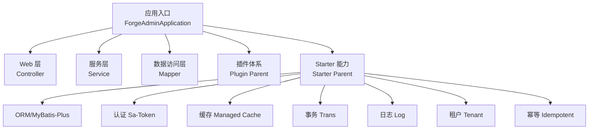
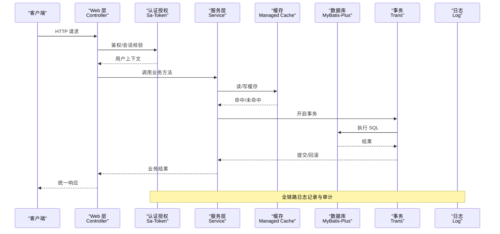
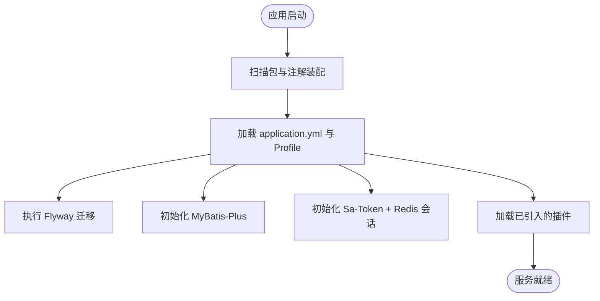
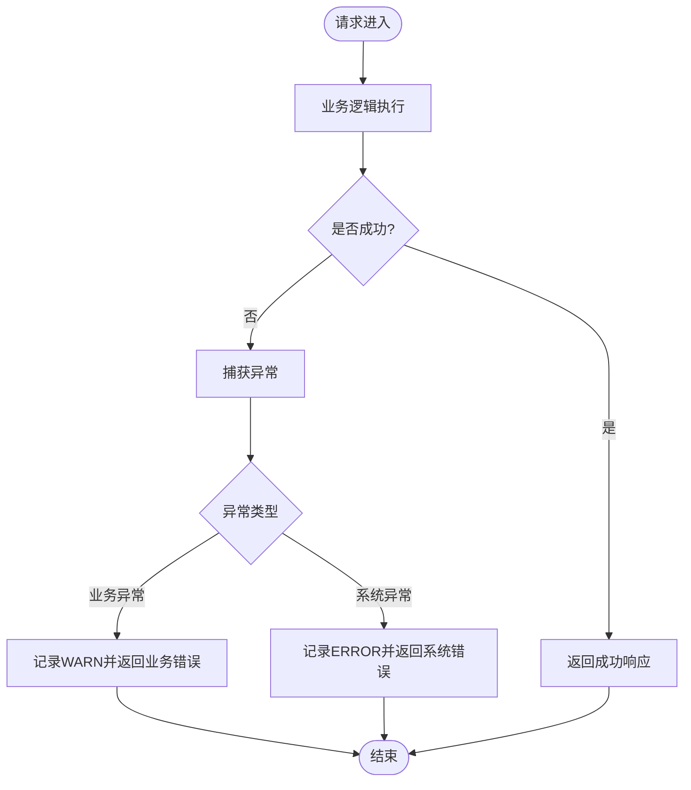
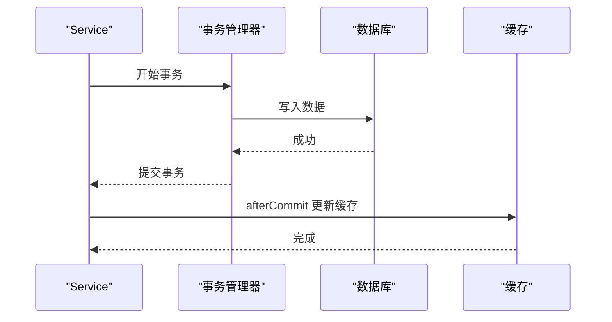
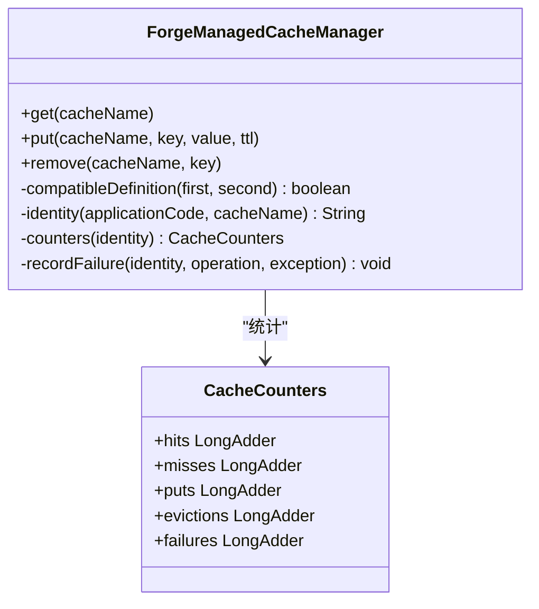
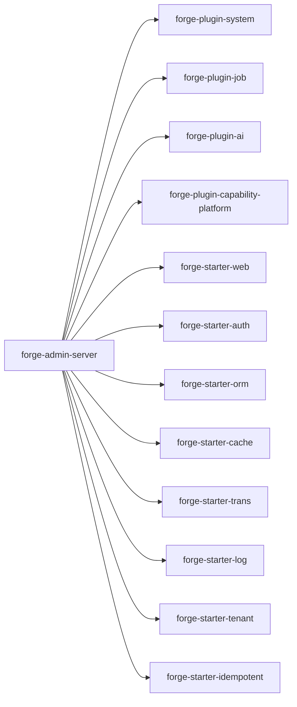

# 后端架构

<cite>
**本文引用的文件**
- [ForgeAdminApplication.java](file://forge-server/forge-admin-server/src/main/java/com/mdframe/forge/admin/ForgeAdminApplication.java)
- [application.yml](file://forge-server/forge-admin-server/src/main/resources/application.yml)
- [pom.xml（forge-admin-server）](file://forge-server/forge-admin-server/pom.xml)
- [ExceptionAutoConfiguration.java](file://forge-server/forge-framework/forge-starter-parent/forge-starter-core/src/main/java/com/mdframe/forge/starter/core/config/ExceptionAutoConfiguration.java)
- [EXCEPTION_USAGE.md](file://forge-server/forge-framework/forge-starter-parent/forge-starter-core/EXCEPTION_USAGE.md)
- [CacheTransactionExecutor.java](file://forge-server/forge-framework/forge-starter-parent/forge-starter-cache/src/main/java/com/mdframe/forge/starter/cache/managed/transaction/CacheTransactionExecutor.java)
- [ForgeManagedCacheManager.java](file://forge-server/forge-framework/forge-starter-parent/forge-starter-cache/src/main/java/com/mdframe/forge/starter/cache/managed/ForgeManagedCacheManager.java)
- [DbConfigLoader.java](file://forge-server/forge-framework/forge-starter-parent/forge-starter-config/src/main/java/com/mdframe/forge/starter/property/DbConfigLoader.java)
- [TenantBusinessDataSourceInfo.java](file://forge-server/forge-framework/forge-starter-parent/forge-starter-tenant/src/main/java/com/mdframe/forge/starter/tenant/datasource/TenantBusinessDataSourceInfo.java)
- [SaTokenFlowTokenProvider.java](file://forge-server/forge-framework/forge-starter-parent/forge-starter-auth/src/main/java/com/mdframe/forge/starter/auth/config/SaTokenFlowTokenProvider.java)
</cite>

## 目录
1. [简介](#简介)
2. [项目结构](#项目结构)
3. [核心组件](#核心组件)
4. [架构总览](#架构总览)
5. [详细组件分析](#详细组件分析)
6. [依赖关系分析](#依赖关系分析)
7. [性能考量](#性能考量)
8. [故障排查指南](#故障排查指南)
9. [结论](#结论)
10. [附录](#附录)

## 简介
本技术文档面向 Forge Admin 后端，围绕 Spring Boot 3.2 应用启动流程、分层架构（Controller-Service-Mapper）、插件化与 Starter 设计模式展开，系统阐述统一异常处理、日志规范、事务管理策略与缓存机制；并说明多数据源配置、MyBatis-Plus 集成、Sa-Token 认证授权与 Redis 分布式锁实现。文末提供插件开发指南、接口设计规范与安全加固策略，帮助团队在统一框架下高效扩展业务功能。

## 项目结构
- 应用入口：Spring Boot 主类通过注解扫描包、启用 AOP 与 MyBatis Mapper 扫描，完成基础能力装配。
- 配置中心：application.yml 集中定义服务器、日志、Flyway、MyBatis-Plus、Sa-Token、能力开关等关键配置项。
- 模块划分：
  - 业务服务：forge-admin-server 聚合系统插件、Starter 与业务核心模块。
  - 基础设施：forge-framework/forge-starter-parent 提供 Web、Auth、ORM、Cache、Trans、Log、Tenant、Idempotent 等可插拔能力。
  - 插件体系：forge-framework/forge-plugin-parent 提供 System、Job、Flow、Generator、AI、Capability 等插件。
- 构建与打包：Maven 多模块工程，使用 spring-boot-maven-plugin 进行 repackage。

**图表来源**
- [ForgeAdminApplication.java:8-10](file://forge-server/forge-admin-server/src/main/java/com/mdframe/forge/admin/ForgeAdminApplication.java#L8-L10)
- [application.yml:97-118](file://forge-server/forge-admin-server/src/main/resources/application.yml#L97-L118)

**章节来源**
- [ForgeAdminApplication.java:8-10](file://forge-server/forge-admin-server/src/main/java/com/mdframe/forge/admin/ForgeAdminApplication.java#L8-L10)
- [application.yml:1-228](file://forge-server/forge-admin-server/src/main/resources/application.yml#L1-L228)
- [pom.xml（forge-admin-server）:14-153](file://forge-server/forge-admin-server/pom.xml#L14-L153)

## 核心组件
- 应用启动器：基于 @SpringBootApplication 扫描 com.mdframe.forge 包，@MapperScan 自动注册 Mapper，@EnableAspectJAutoProxy 开启 AOP。
- 配置与特性开关：application.yml 中通过 spring.profiles.active 切换环境，并通过 forge.* 命名空间控制能力开关（如 open-gateway、capability、crypto）。
- Starter 能力：
  - Web：统一响应、参数校验、跨域、静态资源等。
  - Auth：Sa-Token 会话与鉴权，Redis 存储 Session。
  - ORM：MyBatis-Plus 全局配置（驼峰映射、逻辑删除、分页、ID 生成策略等）。
  - Cache：本地+Redis 双层缓存，支持 TTL、空值缓存、命中率统计与失败降级。
  - Trans：声明式事务与事务同步回调（如 afterCommit）。
  - Log：结构化日志与审计。
  - Tenant：多租户与数据源路由。
  - Idempotent：接口幂等与防重放。
- 插件体系：以插件形式提供系统管理、任务调度、工作流、代码生成、AI、能力开放平台等能力，按需引入。

**章节来源**
- [application.yml:33-118](file://forge-server/forge-admin-server/src/main/resources/application.yml#L33-L118)
- [application.yml:119-218](file://forge-server/forge-admin-server/src/main/resources/application.yml#L119-L218)
- [pom.xml（forge-admin-server）:14-153](file://forge-server/forge-admin-server/pom.xml#L14-L153)

## 架构总览
下图展示请求从进入 Web 层到持久化的完整链路，以及横切能力（认证、权限、日志、缓存、事务、租户）的介入点。

**图表来源**
- [application.yml:97-118](file://forge-server/forge-admin-server/src/main/resources/application.yml#L97-L118)
- [application.yml:119-131](file://forge-server/forge-admin-server/src/main/resources/application.yml#L119-L131)
- [CacheTransactionExecutor.java:8-20](file://forge-server/forge-framework/forge-starter-parent/forge-starter-cache/src/main/java/com/mdframe/forge/starter/cache/managed/transaction/CacheTransactionExecutor.java#L8-L20)

## 详细组件分析

### 应用启动与装配流程
- 启动入口：主类启用包扫描、AOP 与 Mapper 扫描，确保所有 Starter 与插件自动装配生效。
- 配置加载：application.yml 通过 profiles 激活不同环境配置；Flyway 负责数据库版本迁移；MyBatis-Plus 全局配置统一实体与 SQL 行为。
- 能力开关：通过 forge.* 配置项动态启用/关闭能力（如 MCP、Open Gateway、高风险审批等），便于灰度与裁剪。

**图表来源**
- [ForgeAdminApplication.java:8-10](file://forge-server/forge-admin-server/src/main/java/com/mdframe/forge/admin/ForgeAdminApplication.java#L8-L10)
- [application.yml:65-118](file://forge-server/forge-admin-server/src/main/resources/application.yml#L65-L118)
- [application.yml:119-131](file://forge-server/forge-admin-server/src/main/resources/application.yml#L119-L131)

**章节来源**
- [ForgeAdminApplication.java:8-10](file://forge-server/forge-admin-server/src/main/java/com/mdframe/forge/admin/ForgeAdminApplication.java#L8-L10)
- [application.yml:65-118](file://forge-server/forge-admin-server/src/main/resources/application.yml#L65-L118)
- [application.yml:119-131](file://forge-server/forge-admin-server/src/main/resources/application.yml#L119-L131)

### 分层架构（Controller-Service-Mapper）
- Controller：接收请求、参数校验、调用 Service，返回统一响应体。
- Service：编排业务逻辑，组合缓存、事务、外部调用等能力。
- Mapper：基于 MyBatis-Plus 的数据访问接口，配合 XML 或注解完成 SQL 映射。
- 建议：
  - 保持薄 Controller，复杂逻辑下沉至 Service。
  - 使用 DTO/VO 隔离入参与出参，避免直接暴露实体。
  - 对批量操作与复杂查询采用专用 Mapper/XML。

[本节为通用架构说明，不直接分析具体文件]

### 插件化架构与 Starter 设计模式
- 插件（Plugin）：按领域能力拆分（系统、任务、工作流、代码生成、AI、能力开放平台等），通过 Maven 依赖按需引入，降低耦合。
- Starter：将横切能力封装为独立模块（Web、Auth、ORM、Cache、Trans、Log、Tenant、Idempotent 等），通过自动配置装配，业务只需引入依赖即可使用。
- 优势：
  - 能力可插拔、可裁剪，便于多场景部署。
  - 统一治理与升级路径，减少重复造轮子。
  - 通过配置开关控制能力启停，满足灰度与合规要求。

**章节来源**
- [pom.xml（forge-admin-server）:14-153](file://forge-server/forge-admin-server/pom.xml#L14-L153)

### 统一异常处理
- 全局处理器：通过 AutoConfiguration 注册 GlobalExceptionHandler，拦截各类异常并返回统一格式。
- 业务异常：自定义 BusinessException 携带状态码与消息，便于前端友好提示。
- 工具类：ExceptionUtil 提供简洁抛出与条件判断方法，提升可读性与一致性。
- 最佳实践：
  - 优先使用 ExceptionUtil 抛出业务异常。
  - 合理设置错误码（4xx/5xx）。
  - 在 Controller 层使用参数校验注解，由全局处理器统一捕获。

**图表来源**
- [ExceptionAutoConfiguration.java:12-19](file://forge-server/forge-framework/forge-starter-parent/forge-starter-core/src/main/java/com/mdframe/forge/starter/core/config/ExceptionAutoConfiguration.java#L12-L19)
- [EXCEPTION_USAGE.md:1-358](file://forge-server/forge-framework/forge-starter-parent/forge-starter-core/EXCEPTION_USAGE.md#L1-L358)

**章节来源**
- [ExceptionAutoConfiguration.java:12-19](file://forge-server/forge-framework/forge-starter-parent/forge-starter-core/src/main/java/com/mdframe/forge/starter/core/config/ExceptionAutoConfiguration.java#L12-L19)
- [EXCEPTION_USAGE.md:1-358](file://forge-server/forge-framework/forge-starter-parent/forge-starter-core/EXCEPTION_USAGE.md#L1-L358)

### 日志记录规范
- 日志级别：业务异常记录 WARN，系统异常记录 ERROR；第三方组件默认 error。
- 输出位置：logback.xml 指定输出策略；可通过 logging.level 调整各包级别。
- 建议：
  - 关键流程打 INFO，调试信息用 DEBUG。
  - 敏感信息脱敏后再记录。
  - 结合 TraceId 进行链路追踪。

**章节来源**
- [application.yml:23-30](file://forge-server/forge-admin-server/src/main/resources/application.yml#L23-L30)

### 事务管理策略
- 声明式事务：通过 Starter 提供的 Trans 能力统一管理事务边界。
- 事务后回调：CacheTransactionExecutor.afterCommit 在事务提交后执行缓存更新等操作，保证数据一致性与最终一致性。
- 建议：
  - 写操作加事务，读操作尽量无事务。
  - 跨服务调用需考虑补偿与重试。
  - 长事务拆分为短事务，避免锁竞争。

**图表来源**
- [CacheTransactionExecutor.java:8-20](file://forge-server/forge-framework/forge-starter-parent/forge-starter-cache/src/main/java/com/mdframe/forge/starter/cache/managed/transaction/CacheTransactionExecutor.java#L8-L20)

**章节来源**
- [CacheTransactionExecutor.java:8-20](file://forge-server/forge-framework/forge-starter-parent/forge-starter-cache/src/main/java/com/mdframe/forge/starter/cache/managed/transaction/CacheTransactionExecutor.java#L8-L20)

### 缓存机制
- 双层缓存：本地缓存 + Redis 分布式缓存，支持 TTL、空值缓存、容量限制。
- 指标统计：命中、未命中、写入、淘汰、失败计数，便于监控与调优。
- 兼容性：通过 CacheDefinition 校验配置一致性，避免运行时冲突。
- 建议：
  - 热点数据使用本地缓存，跨节点共享数据使用 Redis。
  - 合理设置 TTL 与容量，避免内存泄漏。
  - 失败时降级为直连数据库。

**图表来源**
- [ForgeManagedCacheManager.java:488-521](file://forge-server/forge-framework/forge-starter-parent/forge-starter-cache/src/main/java/com/mdframe/forge/starter/cache/managed/ForgeManagedCacheManager.java#L488-L521)

**章节来源**
- [ForgeManagedCacheManager.java:488-521](file://forge-server/forge-framework/forge-starter-parent/forge-starter-cache/src/main/java/com/mdframe/forge/starter/cache/managed/ForgeManagedCacheManager.java#L488-L521)

### 多数据源配置与 MyBatis-Plus 集成
- MyBatis-Plus：全局配置包括驼峰映射、缓存、自增/雪花 ID、日志实现等；XML 与实体扫描路径统一配置。
- 多数据源：通过租户 Starter 提供数据源信息模型（包含主库标识、租户ID、读写分离、风险等级等），结合配置中心加载数据库连接信息。
- 配置中心：DbConfigLoader 合并 sys_config 与分组 JSON 配置，生成键值对供运行时使用。
- 建议：
  - 明确主从角色与读写策略。
  - 对跨库操作谨慎评估事务边界。
  - 使用配置中心统一管理敏感信息。

**章节来源**
- [application.yml:97-118](file://forge-server/forge-admin-server/src/main/resources/application.yml#L97-L118)
- [TenantBusinessDataSourceInfo.java:53-127](file://forge-server/forge-framework/forge-starter-parent/forge-starter-tenant/src/main/java/com/mdframe/forge/starter/tenant/datasource/TenantBusinessDataSourceInfo.java#L53-L127)
- [DbConfigLoader.java:14-44](file://forge-server/forge-framework/forge-starter-parent/forge-starter-config/src/main/java/com/mdframe/forge/starter/property/DbConfigLoader.java#L14-L44)

### Sa-Token 认证授权与 Redis 分布式锁
- 认证授权：Sa-Token 通过 alone-redis 存储会话，支持过期时间、密码、端口等配置；与业务登录态结合，提供细粒度权限控制。
- 分布式锁：结合 Redis 实现分布式锁（例如用于限流、防重、并发控制），与事务后回调配合保证最终一致性。
- 建议：
  - 锁粒度尽量小，避免死锁。
  - 设置合理的超时与重试策略。
  - 对敏感接口增加签名与防重放。

**章节来源**
- [application.yml:119-131](file://forge-server/forge-admin-server/src/main/resources/application.yml#L119-L131)
- [SaTokenFlowTokenProvider.java:37-55](file://forge-server/forge-framework/forge-starter-parent/forge-starter-auth/src/main/java/com/mdframe/forge/starter/auth/config/SaTokenFlowTokenProvider.java#L37-L55)

### 插件开发指南
- 新建插件模块：在 plugin-parent 下新增模块，遵循 starter 的自动配置约定（META-INF/spring 自动装配）。
- 能力暴露：通过配置项控制开关，默认关闭，按需启用。
- 依赖管理：仅引入必要依赖，避免传递依赖污染。
- 测试覆盖：提供单元测试与集成测试，验证配置与行为。

[本节为通用开发指南，不直接分析具体文件]

### 接口设计规范
- 统一响应：所有接口返回统一结构，包含状态码、消息与数据。
- 参数校验：DTO 使用校验注解，Controller 使用 @Valid/@Validated。
- 版本管理：URL 或 Header 中体现 API 版本，向后兼容。
- 安全：对敏感接口启用鉴权、签名与限流。

[本节为通用规范，不直接分析具体文件]

### 安全防护策略
- 认证与授权：Sa-Token 统一鉴权，结合角色/权限模型控制访问。
- 数据安全：敏感字段加密存储与传输，日志脱敏。
- 防重放与幂等：对外接口启用幂等与防重放，结合 Redis 锁与唯一键。
- 能力网关：Open Gateway 提供统一入口，内置限流、快照保留与审计。

**章节来源**
- [application.yml:192-218](file://forge-server/forge-admin-server/src/main/resources/application.yml#L192-L218)

## 依赖关系分析
- 应用依赖：forge-admin-server 依赖系统插件、Starter、业务核心、Flow Client、AI、MCP、能力平台等。
- Starter 解耦：每个 Starter 职责单一，通过自动配置注入，业务无需感知实现细节。
- 插件解耦：插件之间通过接口与事件通信，避免强耦合。

**图表来源**
- [pom.xml（forge-admin-server）:14-153](file://forge-server/forge-admin-server/pom.xml#L14-L153)

**章节来源**
- [pom.xml（forge-admin-server）:14-153](file://forge-server/forge-admin-server/pom.xml#L14-L153)

## 性能考量
- 线程与缓冲：Undertow IO/Worker 线程数与缓冲区大小根据负载调优。
- 缓存策略：热点数据本地缓存 + Redis 分布式缓存，合理 TTL 与容量。
- 事务优化：缩短事务范围，避免长事务；批量操作分批提交。
- 数据库：合理使用索引、分页与只读副本；慢查询分析与优化。
- 监控：利用 Actuator 健康检查与缓存计数器观察运行状态。

[本节为通用指导，不直接分析具体文件]

## 故障排查指南
- 启动失败：检查 application.yml 配置与 Profile；确认数据库连接与 Flyway 迁移。
- 认证失败：核对 Sa-Token Redis 配置与会话有效期；检查登录态与权限。
- 缓存异常：查看缓存计数器与失败日志；必要时降级为直连数据库。
- 事务问题：定位事务边界与传播行为；检查 afterCommit 回调是否执行。
- 日志定位：根据 TraceId 与日志级别快速定位问题。

**章节来源**
- [application.yml:23-30](file://forge-server/forge-admin-server/src/main/resources/application.yml#L23-L30)
- [application.yml:119-131](file://forge-server/forge-admin-server/src/main/resources/application.yml#L119-L131)
- [CacheTransactionExecutor.java:8-20](file://forge-server/forge-framework/forge-starter-parent/forge-starter-cache/src/main/java/com/mdframe/forge/starter/cache/managed/transaction/CacheTransactionExecutor.java#L8-L20)

## 结论
Forge Admin 后端以 Spring Boot 3.2 为基础，通过 Starter 与插件体系实现了高度模块化与可插拔；统一异常、日志、事务、缓存、认证与多数据源等横切能力被抽象为可复用组件，显著提升了开发效率与系统稳定性。建议在业务开发中遵循分层与规范，充分利用框架能力，持续优化性能与安全。

## 附录
- 常用配置键：
  - server.port / undertow.threads
  - mybatis-plus.configuration / global-config.dbConfig
  - sa-token.alone-redis.*
  - forge.capability.open-gateway.*
  - forge.crypto.bootstrap.*
- 参考文档：
  - 异常处理使用示例与最佳实践
  - 缓存管理器设计与统计
  - 配置中心加载与合并策略
  - 租户数据源信息与路由

[本节为补充信息，不直接分析具体文件]