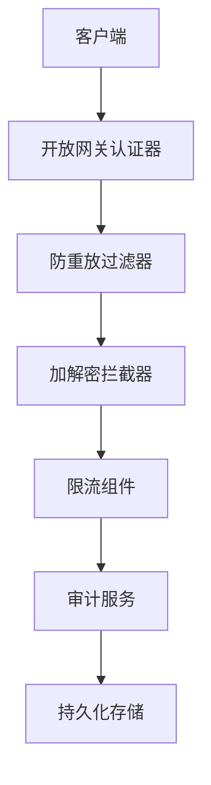
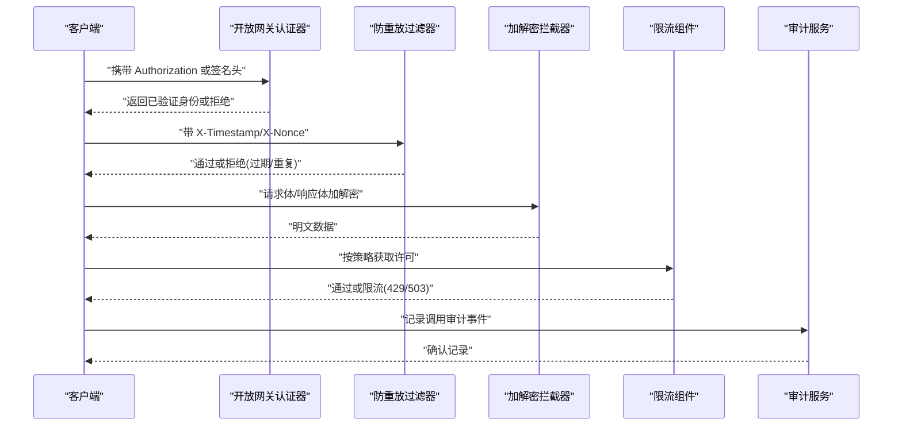
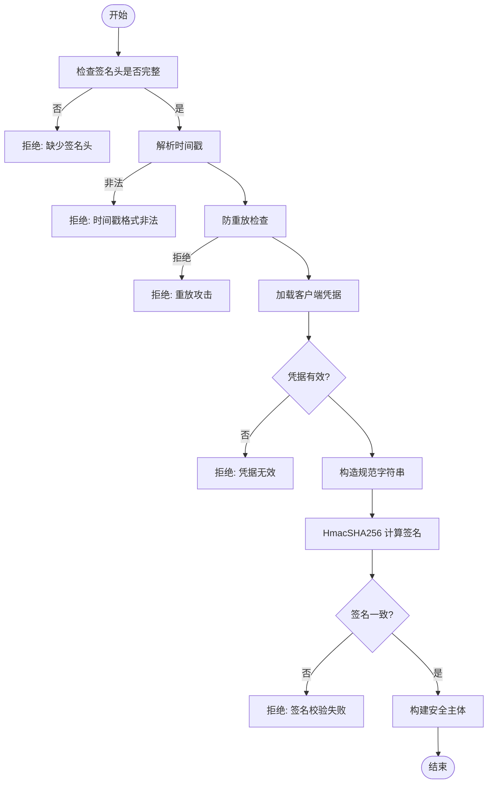
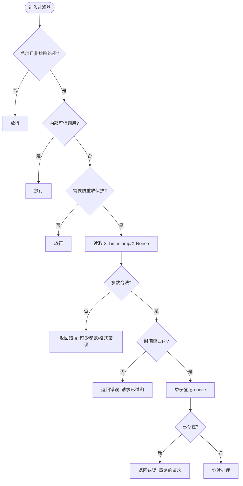
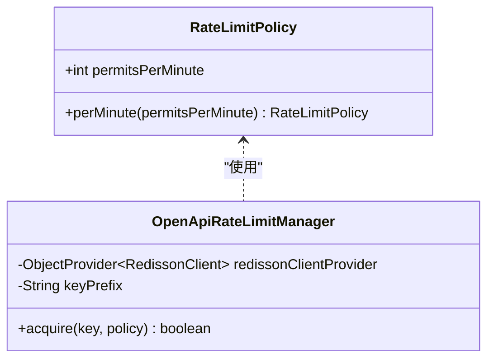
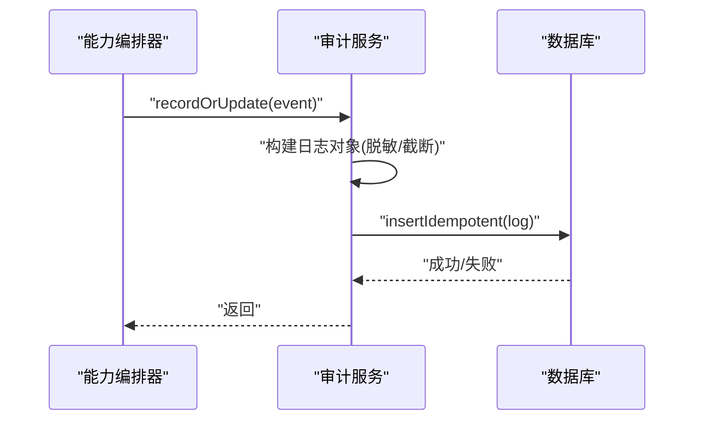
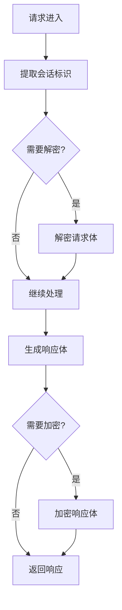
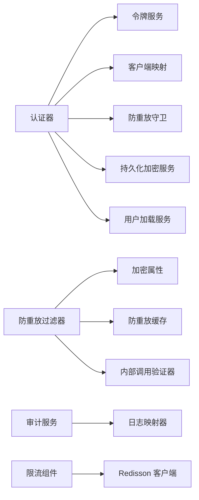

# API安全防护

<cite>
**本文引用的文件**
- [OpenGatewayAuthenticator.java](file://forge-server/forge-framework/forge-plugin-parent/forge-plugin-capability-parent/forge-plugin-capability-platform/src/main/java/com/mdframe/forge/plugin/capability/opengateway/auth/OpenGatewayAuthenticator.java)
- [ReplayAttackFilter.java](file://forge-server/forge-framework/forge-starter-parent/forge-starter-crypto/src/main/java/com/mdframe/forge/starter/crypto/filter/ReplayAttackFilter.java)
- [CryptoAutoConfiguration.java](file://forge-server/forge-framework/forge-starter-parent/forge-starter-crypto/src/main/java/com/mdframe/forge/starter/crypto/config/CryptoAutoConfiguration.java)
- [DecryptRequestBodyAdvice.java](file://forge-server/forge-framework/forge-starter-parent/forge-starter-crypto/src/main/java/com/mdframe/forge/starter/crypto/advice/DecryptRequestBodyAdvice.java)
- [EncryptResponseBodyAdvice.java](file://forge-server/forge-framework/forge-starter-parent/forge-starter-crypto/src/main/java/com/mdframe/forge/starter/crypto/advice/EncryptResponseBodyAdvice.java)
- [CapabilityInvocationAuditService.java](file://forge-server/forge-framework/forge-plugin-parent/forge-plugin-capability-parent/forge-plugin-capability-platform/src/main/java/com/mdframe/forge/plugin/capability/controlplane/service/CapabilityInvocationAuditService.java)
- [CapabilityInvokeOrchestrator.java](file://forge-server/forge-framework/forge-plugin-parent/forge-plugin-capability-parent/forge-plugin-capability-platform/src/main/java/com/mdframe/forge/plugin/capability/opengateway/service/CapabilityInvokeOrchestrator.java)
- [RateLimitPolicy.java](file://forge-server/forge-framework/forge-starter-parent/forge-starter-openapi-security/src/main/java/com/mdframe/forge/starter/openapi/security/ratelimit/RateLimitPolicy.java)
- [OpenApiRateLimitManager.java](file://forge-server/forge-framework/forge-starter-parent/forge-starter-openapi-security/src/main/java/com/mdframe/forge/starter/openapi/security/ratelimit/OpenApiRateLimitManager.java)
- [application.yml](file://forge-server/forge-admin-server/src/main/resources/application.yml)
</cite>

## 目录
1. [简介](#简介)
2. [项目结构](#项目结构)
3. [核心组件](#核心组件)
4. [架构总览](#架构总览)
5. [详细组件分析](#详细组件分析)
6. [依赖关系分析](#依赖关系分析)
7. [性能考虑](#性能考虑)
8. [故障排查指南](#故障排查指南)
9. [结论](#结论)
10. [附录](#附录)

## 简介
本技术文档面向 Forge Admin 开放网关与平台能力的安全防护体系，围绕接口签名验证、防重放攻击、请求频率限制、敏感操作审计日志、传输层安全（HTTPS、数据加密、证书管理）、API 版本控制与向后兼容，以及常见 Web 攻击防护（SQL 注入、XSS、CSRF）进行系统化说明。文档以代码实现为依据，提供可追溯的源码路径与可视化图示，帮助读者快速理解并落地安全策略。

## 项目结构
本项目将安全能力拆分为多个可复用的 Starter 与插件：
- 开放网关认证器：负责 OAuth 令牌与客户端签名两种认证模式，统一产出已验证的身份上下文。
- 防重放过滤器：基于时间戳+Nonce 的通用防重放保护，支持白名单/黑名单路径配置。
- 加解密拦截器：对请求体/响应体进行透明加解密，支持动态密钥协商与排除路径。
- 限流组件：基于 Redisson 的开放 API 限流抽象，支持按分钟粒度限流与失败降级。
- 审计服务：记录能力调用全链路审计事件，包含身份、能力标识、状态码、错误阶段等。
- 自动装配：通过 Spring Boot 自动装配注册过滤器与 Bean。

图表来源
- [OpenGatewayAuthenticator.java:63-72](file://forge-server/forge-framework/forge-plugin-parent/forge-plugin-capability-parent/forge-plugin-capability-platform/src/main/java/com/mdframe/forge/plugin/capability/opengateway/auth/OpenGatewayAuthenticator.java#L63-L72)
- [ReplayAttackFilter.java:35-107](file://forge-server/forge-framework/forge-starter-parent/forge-starter-crypto/src/main/java/com/mdframe/forge/starter/crypto/filter/ReplayAttackFilter.java#L35-L107)
- [DecryptRequestBodyAdvice.java:190-217](file://forge-server/forge-framework/forge-starter-parent/forge-starter-crypto/src/main/java/com/mdframe/forge/starter/crypto/advice/DecryptRequestBodyAdvice.java#L190-L217)
- [EncryptResponseBodyAdvice.java:205-245](file://forge-server/forge-framework/forge-starter-parent/forge-starter-crypto/src/main/java/com/mdframe/forge/starter/crypto/advice/EncryptResponseBodyAdvice.java#L205-L245)
- [OpenApiRateLimitManager.java:1-28](file://forge-server/forge-framework/forge-starter-parent/forge-starter-openapi-security/src/main/java/com/mdframe/forge/starter/openapi/security/ratelimit/OpenApiRateLimitManager.java#L1-L28)
- [CapabilityInvokeOrchestrator.java:373-398](file://forge-server/forge-framework/forge-plugin-parent/forge-plugin-capability-parent/forge-plugin-capability-platform/src/main/java/com/mdframe/forge/plugin/capability/opengateway/service/CapabilityInvokeOrchestrator.java#L373-L398)

章节来源
- [application.yml](file://forge-server/forge-admin-server/src/main/resources/application.yml)

## 核心组件
- 开放网关认证器：支持 Bearer 令牌与 HMAC-SHA256 客户端签名两种模式；签名模式要求携带 AppId、Timestamp、Nonce、Signature，并进行时间窗口校验与防重放检查；仅允许 SERVICE 模式客户端使用签名认证。
- 防重放过滤器：全局注册，优先放行内部可信调用与排除路径；对需要保护的请求校验 X-Timestamp 与 X-Nonce，并在缓存中做原子登记，防止重复提交。
- 加解密拦截器：从请求头或会话中提取会话标识，用于动态密钥协商；支持排除路径与明文控制端点；对请求体/响应体进行对称加密/解密。
- 限流组件：定义每分钟许可数策略，基于 Redisson RRateLimiter 实现分布式限流；Redis 不可用时返回 503 降级。
- 审计服务：记录能力调用事件，包含租户、客户端、能力标识、版本、执行主体、结果状态、错误阶段、耗时等字段，并落库持久化。

章节来源
- [OpenGatewayAuthenticator.java:100-183](file://forge-server/forge-framework/forge-plugin-parent/forge-plugin-capability-parent/forge-plugin-capability-platform/src/main/java/com/mdframe/forge/plugin/capability/opengateway/auth/OpenGatewayAuthenticator.java#L100-L183)
- [ReplayAttackFilter.java:35-107](file://forge-server/forge-framework/forge-starter-parent/forge-starter-crypto/src/main/java/com/mdframe/forge/starter/crypto/filter/ReplayAttackFilter.java#L35-L107)
- [DecryptRequestBodyAdvice.java:190-217](file://forge-server/forge-framework/forge-starter-parent/forge-starter-crypto/src/main/java/com/mdframe/forge/starter/crypto/advice/DecryptRequestBodyAdvice.java#L190-L217)
- [EncryptResponseBodyAdvice.java:205-245](file://forge-server/forge-framework/forge-starter-parent/forge-starter-crypto/src/main/java/com/mdframe/forge/starter/crypto/advice/EncryptResponseBodyAdvice.java#L205-L245)
- [RateLimitPolicy.java:1-19](file://forge-server/forge-framework/forge-starter-parent/forge-starter-openapi-security/src/main/java/com/mdframe/forge/starter/openapi/security/ratelimit/RateLimitPolicy.java#L1-L19)
- [OpenApiRateLimitManager.java:1-28](file://forge-server/forge-framework/forge-starter-parent/forge-starter-openapi-security/src/main/java/com/mdframe/forge/starter/openapi/security/ratelimit/OpenApiRateLimitManager.java#L1-L28)
- [CapabilityInvocationAuditService.java:21-43](file://forge-server/forge-framework/forge-plugin-parent/forge-plugin-capability-parent/forge-plugin-capability-platform/src/main/java/com/mdframe/forge/plugin/capability/controlplane/service/CapabilityInvocationAuditService.java#L21-L43)

## 架构总览
下图展示了请求进入后的安全处理链：认证器先识别认证方式（OAuth 或签名），随后经过防重放过滤器、加解密拦截器、限流组件，最终执行业务逻辑并输出审计事件。

图表来源
- [OpenGatewayAuthenticator.java:63-72](file://forge-server/forge-framework/forge-plugin-parent/forge-plugin-capability-parent/forge-plugin-capability-platform/src/main/java/com/mdframe/forge/plugin/capability/opengateway/auth/OpenGatewayAuthenticator.java#L63-L72)
- [ReplayAttackFilter.java:35-107](file://forge-server/forge-framework/forge-starter-parent/forge-starter-crypto/src/main/java/com/mdframe/forge/starter/crypto/filter/ReplayAttackFilter.java#L35-L107)
- [DecryptRequestBodyAdvice.java:190-217](file://forge-server/forge-framework/forge-starter-parent/forge-starter-crypto/src/main/java/com/mdframe/forge/starter/crypto/advice/DecryptRequestBodyAdvice.java#L190-L217)
- [EncryptResponseBodyAdvice.java:205-245](file://forge-server/forge-framework/forge-starter-parent/forge-starter-crypto/src/main/java/com/mdframe/forge/starter/crypto/advice/EncryptResponseBodyAdvice.java#L205-L245)
- [OpenApiRateLimitManager.java:1-28](file://forge-server/forge-framework/forge-starter-parent/forge-starter-openapi-security/src/main/java/com/mdframe/forge/starter/openapi/security/ratelimit/OpenApiRateLimitManager.java#L1-L28)
- [CapabilityInvokeOrchestrator.java:373-398](file://forge-server/forge-framework/forge-plugin-parent/forge-plugin-capability-parent/forge-plugin-capability-platform/src/main/java/com/mdframe/forge/plugin/capability/opengateway/service/CapabilityInvokeOrchestrator.java#L373-L398)

## 详细组件分析

### 接口签名验证机制
- 认证入口：优先识别 Bearer 令牌；若存在签名相关头则走签名认证流程。
- 签名参数：必须包含 AppId、Timestamp、Nonce、Signature；缺失或格式非法直接拒绝。
- 防重放：在签名认证前调用防重放守卫，依据 appId、timestamp、nonce 进行去重与时间窗口校验。
- 凭据校验：根据 AppId 查找客户端凭据，校验状态、有效期、ActorMode、AuthModes、服务账号绑定等。
- 签名算法：构造规范字符串（AppId + 换行 + Timestamp + 换行 + Nonce + 换行 + Method + 换行 + URI + 换行 + Body SHA-256），使用 HmacSHA256 计算签名并与请求头 Signature 比较。
- 身份产出：成功后构建统一的安全主体，包含客户端信息、租户、组织、角色范围等。

图表来源
- [OpenGatewayAuthenticator.java:100-183](file://forge-server/forge-framework/forge-plugin-parent/forge-plugin-capability-parent/forge-plugin-capability-platform/src/main/java/com/mdframe/forge/plugin/capability/opengateway/auth/OpenGatewayAuthenticator.java#L100-L183)

章节来源
- [OpenGatewayAuthenticator.java:100-183](file://forge-server/forge-framework/forge-plugin-parent/forge-plugin-capability-parent/forge-plugin-capability-platform/src/main/java/com/mdframe/forge/plugin/capability/opengateway/auth/OpenGatewayAuthenticator.java#L100-L183)

### 防重放攻击策略
- 全局过滤器：对所有 URL 注册，优先级最高；支持开关与排除路径。
- 内部调用豁免：通过内部调用验证器放行可信内网请求。
- 时间窗口：校验 X-Timestamp 与当前时间差是否在配置的时间窗口内。
- Nonce 去重：使用缓存原子登记 nonce，TTL 为时间窗口的两倍，避免边界重放。
- 错误处理：对缺失参数、时间戳格式错误、重复请求等返回明确错误。

图表来源
- [ReplayAttackFilter.java:35-107](file://forge-server/forge-framework/forge-starter-parent/forge-starter-crypto/src/main/java/com/mdframe/forge/starter/crypto/filter/ReplayAttackFilter.java#L35-L107)
- [CryptoAutoConfiguration.java:175-191](file://forge-server/forge-framework/forge-starter-parent/forge-starter-crypto/src/main/java/com/mdframe/forge/starter/crypto/config/CryptoAutoConfiguration.java#L175-L191)

章节来源
- [ReplayAttackFilter.java:35-107](file://forge-server/forge-framework/forge-starter-parent/forge-starter-crypto/src/main/java/com/mdframe/forge/starter/crypto/filter/ReplayAttackFilter.java#L35-L107)
- [CryptoAutoConfiguration.java:175-191](file://forge-server/forge-framework/forge-starter-parent/forge-starter-crypto/src/main/java/com/mdframe/forge/starter/crypto/config/CryptoAutoConfiguration.java#L175-L191)

### 请求频率限制
- 策略模型：以“每分钟许可数”为核心策略，确保并发与速率可控。
- 实现方式：基于 Redisson RRateLimiter，key 前缀可参数化隔离不同开放出口。
- 失败降级：当 Redis 不可用时返回 503，保证系统可用性。
- 使用场景：适用于定时任务开放 API、外部调用开放 API 等场景，可按用户/租户维度扩展 key。

图表来源
- [RateLimitPolicy.java:1-19](file://forge-server/forge-framework/forge-starter-parent/forge-starter-openapi-security/src/main/java/com/mdframe/forge/starter/openapi/security/ratelimit/RateLimitPolicy.java#L1-L19)
- [OpenApiRateLimitManager.java:1-28](file://forge-server/forge-framework/forge-starter-parent/forge-starter-openapi-security/src/main/java/com/mdframe/forge/starter/openapi/security/ratelimit/OpenApiRateLimitManager.java#L1-L28)

章节来源
- [RateLimitPolicy.java:1-19](file://forge-server/forge-framework/forge-starter-parent/forge-starter-openapi-security/src/main/java/com/mdframe/forge/starter/openapi/security/ratelimit/RateLimitPolicy.java#L1-L19)
- [OpenApiRateLimitManager.java:1-28](file://forge-server/forge-framework/forge-starter-parent/forge-starter-openapi-security/src/main/java/com/mdframe/forge/starter/openapi/security/ratelimit/OpenApiRateLimitManager.java#L1-L28)

### 敏感操作审计日志
- 审计触发：能力调用编排器在执行前后记录审计事件，包含请求 ID、客户端、能力标识、版本、执行主体、状态码、错误阶段、错误信息、Schema 路径、耗时等。
- 数据清洗：审计服务内置正则过滤敏感键值对，限制错误消息长度，确保日志安全。
- 幂等写入：采用幂等插入，避免重复记录。
- 异常处理：记录失败时抛出不可用异常，上层可据此降级或告警。

图表来源
- [CapabilityInvokeOrchestrator.java:373-398](file://forge-server/forge-framework/forge-plugin-parent/forge-plugin-capability-parent/forge-plugin-capability-platform/src/main/java/com/mdframe/forge/plugin/capability/opengateway/service/CapabilityInvokeOrchestrator.java#L373-L398)
- [CapabilityInvocationAuditService.java:21-43](file://forge-server/forge-framework/forge-plugin-parent/forge-plugin-capability-parent/forge-plugin-capability-platform/src/main/java/com/mdframe/forge/plugin/capability/controlplane/service/CapabilityInvocationAuditService.java#L21-L43)

章节来源
- [CapabilityInvokeOrchestrator.java:373-398](file://forge-server/forge-framework/forge-plugin-parent/forge-plugin-capability-parent/forge-plugin-capability-platform/src/main/java/com/mdframe/forge/plugin/capability/opengateway/service/CapabilityInvokeOrchestrator.java#L373-L398)
- [CapabilityInvocationAuditService.java:21-43](file://forge-server/forge-framework/forge-plugin-parent/forge-plugin-capability-parent/forge-plugin-capability-platform/src/main/java/com/mdframe/forge/plugin/capability/controlplane/service/CapabilityInvocationAuditService.java#L21-L43)

### 传输层安全保护
- HTTPS 配置：建议通过反向代理（如 Nginx）强制 HTTPS，关闭 HTTP 明文访问。
- 数据加密传输：加解密拦截器支持请求体/响应体对称加密，结合动态密钥协商提升安全性。
- 会话标识提取：优先从 Authorization 头或 X-Session-Id 头获取会话标识，最后回退到 HTTP Session ID。
- 排除路径：控制端点（如 /crypto/config、/api/config/manage/crypto）保持明文以便配置管理。

图表来源
- [DecryptRequestBodyAdvice.java:190-217](file://forge-server/forge-framework/forge-starter-parent/forge-starter-crypto/src/main/java/com/mdframe/forge/starter/crypto/advice/DecryptRequestBodyAdvice.java#L190-L217)
- [EncryptResponseBodyAdvice.java:205-245](file://forge-server/forge-framework/forge-starter-parent/forge-starter-crypto/src/main/java/com/mdframe/forge/starter/crypto/advice/EncryptResponseBodyAdvice.java#L205-L245)

章节来源
- [DecryptRequestBodyAdvice.java:190-217](file://forge-server/forge-framework/forge-starter-parent/forge-starter-crypto/src/main/java/com/mdframe/forge/starter/crypto/advice/DecryptRequestBodyAdvice.java#L190-L217)
- [EncryptResponseBodyAdvice.java:205-245](file://forge-server/forge-framework/forge-starter-parent/forge-starter-crypto/src/main/java/com/mdframe/forge/starter/crypto/advice/EncryptResponseBodyAdvice.java#L205-L245)

### API 版本控制与向后兼容
- 版本标识：能力快照中包含 sourceVersion，适配器会将其转换为正整数版本；不合法版本将返回冲突错误。
- 兼容性策略：对外暴露的版本需保持稳定，新增字段应默认兼容；删除或变更字段需提供迁移方案与过渡期。
- 前端适配：前端在构建输入表单时遵循安全字段名与类型映射，避免引入不安全属性。

章节来源
- [BusinessActionOpenGatewayAdapter.java:194-204](file://forge-server/forge-framework/forge-plugin-parent/forge-plugin-capability-parent/forge-plugin-capability-actions/src/main/java/com/mdframe/forge/plugin/capability/secureaction/gateway/BusinessActionOpenGatewayAdapter.java#L194-L204)

### 常见 Web 攻击防护
- SQL 注入：建议在业务层使用参数化查询与 ORM 框架，避免拼接 SQL；对输入进行严格类型校验与白名单过滤。
- XSS 攻击：前端对用户输入进行转义与净化，禁止渲染危险脚本与事件处理器；后端对输出进行编码。
- CSRF 攻击：对状态变更接口启用同源策略与 CSRF Token 校验；跨域请求需显式授权。

[本节为通用安全实践说明，不直接分析具体文件]

## 依赖关系分析
- 认证器依赖：令牌服务、客户端映射、防重放守卫、持久化加密服务、用户加载服务、身份配置。
- 过滤器依赖：加密属性、防重放缓存、对象映射器、内部调用验证器。
- 审计服务依赖：能力调用日志映射器、租户上下文执行器。
- 限流组件依赖：Redisson 客户端、策略配置。

图表来源
- [OpenGatewayAuthenticator.java:53-58](file://forge-server/forge-framework/forge-plugin-parent/forge-plugin-capability-parent/forge-plugin-capability-platform/src/main/java/com/mdframe/forge/plugin/capability/opengateway/auth/OpenGatewayAuthenticator.java#L53-L58)
- [ReplayAttackFilter.java:28-31](file://forge-server/forge-framework/forge-starter-parent/forge-starter-crypto/src/main/java/com/mdframe/forge/starter/crypto/filter/ReplayAttackFilter.java#L28-L31)
- [CapabilityInvocationAuditService.java:38-43](file://forge-server/forge-framework/forge-plugin-parent/forge-plugin-capability-parent/forge-plugin-capability-platform/src/main/java/com/mdframe/forge/plugin/capability/controlplane/service/CapabilityInvocationAuditService.java#L38-L43)
- [OpenApiRateLimitManager.java:20-28](file://forge-server/forge-framework/forge-starter-parent/forge-starter-openapi-security/src/main/java/com/mdframe/forge/starter/openapi/security/ratelimit/OpenApiRateLimitManager.java#L20-L28)

章节来源
- [OpenGatewayAuthenticator.java:53-58](file://forge-server/forge-framework/forge-plugin-parent/forge-plugin-capability-parent/forge-plugin-capability-platform/src/main/java/com/mdframe/forge/plugin/capability/opengateway/auth/OpenGatewayAuthenticator.java#L53-L58)
- [ReplayAttackFilter.java:28-31](file://forge-server/forge-framework/forge-starter-parent/forge-starter-crypto/src/main/java/com/mdframe/forge/starter/crypto/filter/ReplayAttackFilter.java#L28-L31)
- [CapabilityInvocationAuditService.java:38-43](file://forge-server/forge-framework/forge-plugin-parent/forge-plugin-capability-parent/forge-plugin-capability-platform/src/main/java/com/mdframe/forge/plugin/capability/controlplane/service/CapabilityInvocationAuditService.java#L38-L43)
- [OpenApiRateLimitManager.java:20-28](file://forge-server/forge-framework/forge-starter-parent/forge-starter-openapi-security/src/main/java/com/mdframe/forge/starter/openapi/security/ratelimit/OpenApiRateLimitManager.java#L20-L28)

## 性能考虑
- 签名计算：HmacSHA256 与 SHA-256 计算开销较低，但应避免在高频路径上重复计算；建议缓存客户端密钥与版本。
- 防重放缓存：Nonce TTL 为时间窗口两倍，注意缓存容量与淘汰策略；高并发下建议使用高性能缓存实现。
- 限流组件：Redisson RRateLimiter 在高吞吐场景下需注意网络延迟与连接池配置；失败降级为 503 保障可用性。
- 审计日志：批量写入与异步落库可降低主流程延迟；敏感字段脱敏与长度限制减少 I/O 压力。

[本节提供通用性能指导，不直接分析具体文件]

## 故障排查指南
- 签名认证失败：检查请求头是否完整、时间戳格式是否正确、客户端凭据状态与有效期、签名算法与规范字符串是否一致。
- 防重放被拒：确认 X-Timestamp 与服务器时间同步、X-Nonce 唯一性、时间窗口配置合理。
- 限流触发：核对策略配置与 key 前缀，检查 Redis 连通性与限流器实例；必要时调整许可数或扩容。
- 审计记录失败：查看异常堆栈与日志级别，确认租户上下文与映射器可用；必要时重试或降级。

章节来源
- [OpenGatewayAuthenticator.java:100-183](file://forge-server/forge-framework/forge-plugin-parent/forge-plugin-capability-parent/forge-plugin-capability-platform/src/main/java/com/mdframe/forge/plugin/capability/opengateway/auth/OpenGatewayAuthenticator.java#L100-L183)
- [ReplayAttackFilter.java:35-107](file://forge-server/forge-framework/forge-starter-parent/forge-starter-crypto/src/main/java/com/mdframe/forge/starter/crypto/filter/ReplayAttackFilter.java#L35-L107)
- [OpenApiRateLimitManager.java:1-28](file://forge-server/forge-framework/forge-starter-parent/forge-starter-openapi-security/src/main/java/com/mdframe/forge/starter/openapi/security/ratelimit/OpenApiRateLimitManager.java#L1-L28)
- [CapabilityInvokeOrchestrator.java:373-398](file://forge-server/forge-framework/forge-plugin-parent/forge-plugin-capability-parent/forge-plugin-capability-platform/src/main/java/com/mdframe/forge/plugin/capability/opengateway/service/CapabilityInvokeOrchestrator.java#L373-L398)

## 结论
Forge Admin 的安全防护体系以“认证—防重放—加解密—限流—审计”为主线，形成闭环的安全治理。通过标准化签名算法、严格的防重放策略、透明的数据加解密、可配置的限流与完善的审计日志，能够有效抵御常见威胁并满足合规要求。建议在生产环境强化 HTTPS、定期轮换密钥、监控限流与审计指标，持续优化安全策略与性能表现。

## 附录
- 配置建议：
  - 启用防重放保护，设置合理时间窗口与排除路径。
  - 配置加解密开关、算法与动态密钥协商。
  - 设置开放 API 每分钟许可数，区分不同出口 key 前缀。
- 最佳实践：
  - 客户端严格遵循签名规范，确保时间同步与 Nonce 唯一。
  - 服务端开启最小权限原则，限制签名认证仅用于 SERVICE 模式。
  - 审计日志脱敏与长度限制，避免泄露敏感信息。

[本节为补充说明，不直接分析具体文件]