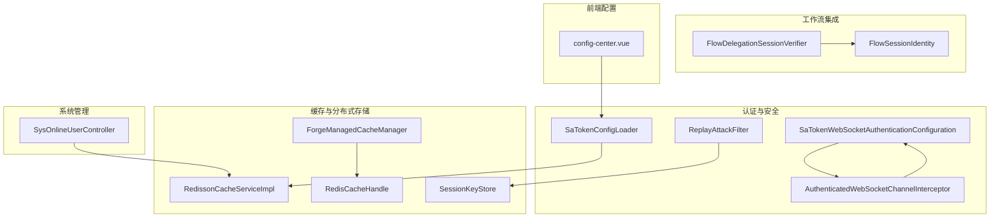
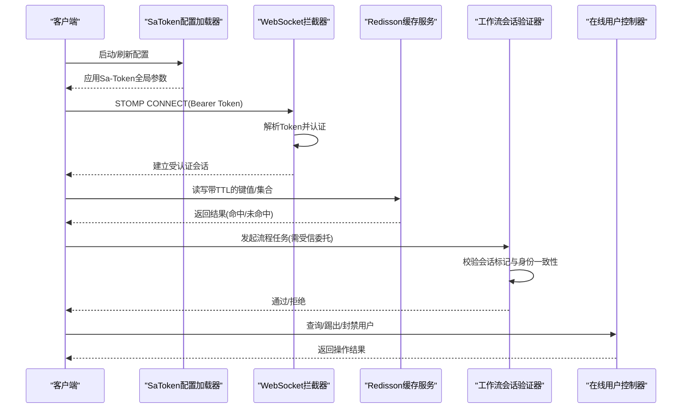
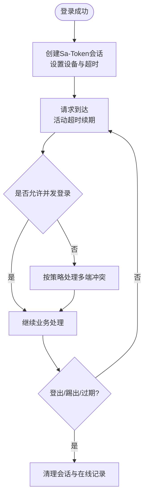
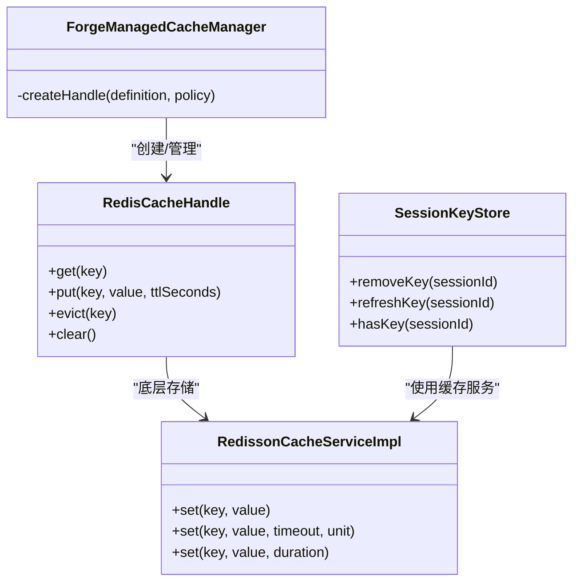
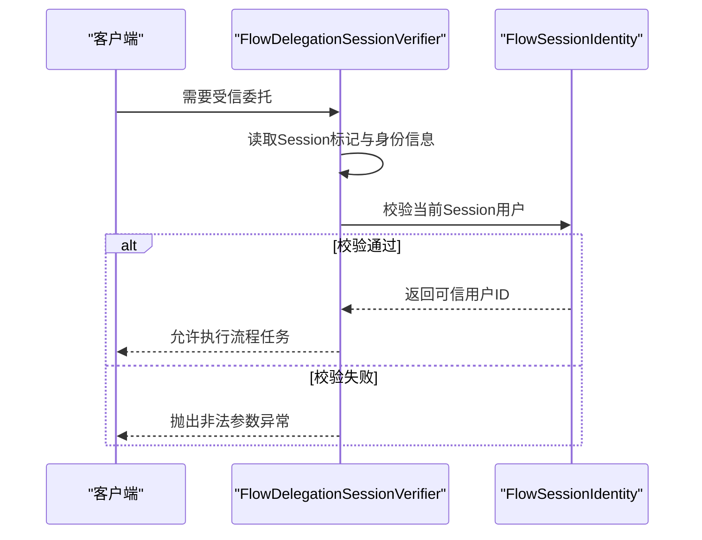
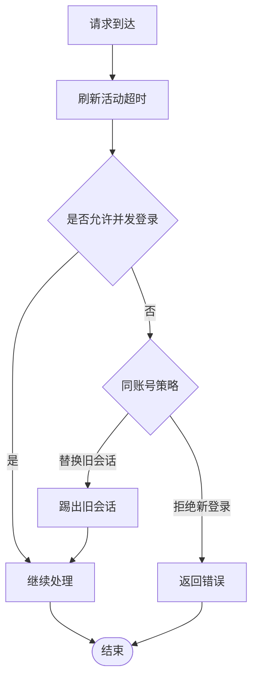
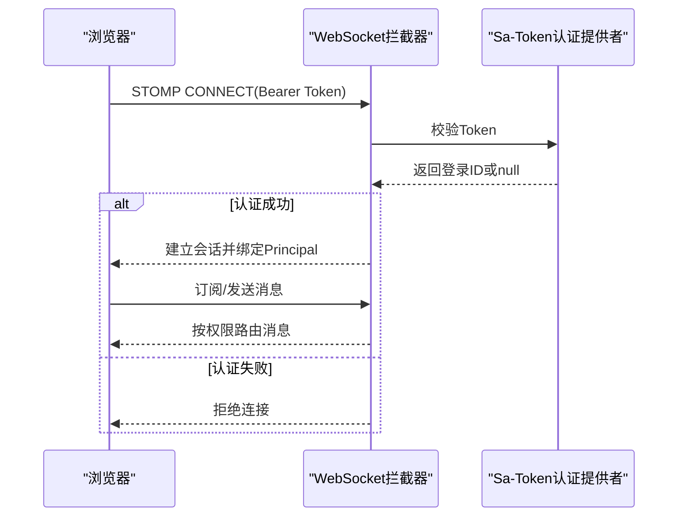
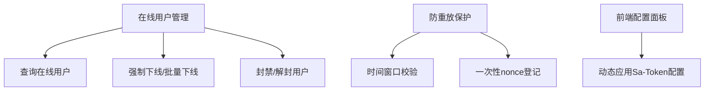
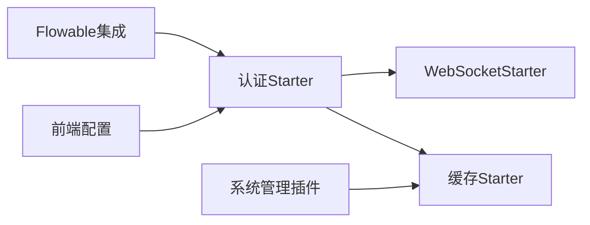

# 会话管理

<cite>
**本文引用的文件**
- [SaTokenConfigLoader.java](file://forge-server/forge-framework/forge-starter-parent/forge-starter-auth/src/main/java/com/mdframe/forge/starter/auth/config/SaTokenConfigLoader.java)
- [FlowDelegationSessionVerifier.java](file://forge-server/forge-framework/forge-starter-parent/forge-starter-auth/src/main/java/com/mdframe/forge/starter/auth/config/FlowDelegationSessionVerifier.java)
- [FlowSessionIdentity.java](file://forge-server/forge-flow/forge-flow-server/src/main/java/com/mdframe/forge/flow/identity/FlowSessionIdentity.java)
- [RedissonCacheServiceImpl.java](file://forge-server/forge-framework/forge-starter-parent/forge-starter-cache/src/main/java/com/mdframe/forge/starter/cache/service/impl/RedissonCacheServiceImpl.java)
- [RedisCacheHandle.java](file://forge-server/forge-framework/forge-starter-parent/forge-starter-cache/src/main/java/com/mdframe/forge/starter/cache/managed/store/RedisCacheHandle.java)
- [ForgeManagedCacheManager.java](file://forge-server/forge-framework/forge-starter-parent/forge-starter-cache/src/main/java/com/mdframe/forge/starter/cache/managed/ForgeManagedCacheManager.java)
- [SessionKeyStore.java](file://forge-server/forge-framework/forge-starter-parent/forge-starter-crypto/src/main/java/com/mdframe/forge/starter/crypto/keyexchange/SessionKeyStore.java)
- [ReplayAttackFilter.java](file://forge-server/forge-framework/forge-starter-parent/forge-starter-crypto/src/main/java/com/mdframe/forge/starter/crypto/filter/ReplayAttackFilter.java)
- [OpenApiReplayGuardTest.java](file://forge-server/forge-framework/forge-starter-parent/forge-starter-openapi-security/src/test/java/com/mdframe/forge/starter/openapi/security/replay/OpenApiReplayGuardTest.java)
- [WebSocketAuthenticationProvider.java](file://forge-server/forge-framework/forge-starter-parent/forge-starter-websocket/src/main/java/com/mdframe/forge/starter/websocket/security/WebSocketAuthenticationProvider.java)
- [AuthenticatedWebSocketChannelInterceptor.java](file://forge-server/forge-framework/forge-starter-parent/forge-starter-websocket/src/main/java/com/mdframe/forge/starter/websocket/security/AuthenticatedWebSocketChannelInterceptor.java)
- [SaTokenWebSocketAuthenticationConfiguration.java](file://forge-server/forge-framework/forge-starter-parent/forge-starter-auth/src/main/java/com/mdframe/forge/starter/auth/config/SaTokenWebSocketAuthenticationConfiguration.java)
- [WebSocketProperties.java](file://forge-server/forge-framework/forge-starter-parent/forge-starter-websocket/src/main/java/com/mdframe/forge/starter/websocket/security/WebSocketProperties.java)
- [SysOnlineUserController.java](file://forge-server/forge-plugin-parent/forge-plugin-system/src/main/java/com/mdframe/forge/plugin/system/controller/SysOnlineUserController.java)
- [config-center.vue](file://forge-admin-ui/src/views/system/config-center.vue)
</cite>

## 目录
1. [简介](#简介)
2. [项目结构](#项目结构)
3. [核心组件](#核心组件)
4. [架构总览](#架构总览)
5. [详细组件分析](#详细组件分析)
6. [依赖关系分析](#依赖关系分析)
7. [性能考虑](#性能考虑)
8. [故障排查指南](#故障排查指南)
9. [结论](#结论)
10. [附录](#附录)

## 简介
本技术文档围绕 Forge Admin 的会话管理体系展开，重点说明基于 Sa-Token 的会话创建、更新与销毁流程；分布式会话存储方案（Redis/Redisson）及缓存同步策略；工作流（Flowable）中的会话委托机制与会话状态保持；会话超时处理、自动续期与并发登录控制；WebSocket 实时通信安全与会话绑定；以及在线会话监控与诊断能力。

## 项目结构
本项目将会话相关能力拆分为多个 Starter 与插件：
- 认证与安全：Sa-Token 配置加载、WebSocket 认证适配、防重放保护
- 缓存与分布式存储：Redisson 缓存服务、多级缓存与失效广播
- 工作流集成：Flowable 执行上下文与会话身份校验
- 系统管理：在线用户管理与强制下线
- 前端配置：Sa-Token 运行时参数可视化配置

图表来源
- [SaTokenConfigLoader.java:39-68](file://forge-server/forge-framework/forge-starter-parent/forge-starter-auth/src/main/java/com/mdframe/forge/starter/auth/config/SaTokenConfigLoader.java#L39-L68)
- [SaTokenWebSocketAuthenticationConfiguration.java:15-22](file://forge-server/forge-framework/forge-starter-parent/forge-starter-auth/src/main/java/com/mdframe/forge/starter/auth/config/SaTokenWebSocketAuthenticationConfiguration.java#L15-L22)
- [AuthenticatedWebSocketChannelInterceptor.java:18-104](file://forge-server/forge-framework/forge-starter-parent/forge-starter-websocket/src/main/java/com/mdframe/forge/starter/websocket/security/AuthenticatedWebSocketChannelInterceptor.java#L18-L104)
- [ReplayAttackFilter.java:72-98](file://forge-server/forge-framework/forge-starter-parent/forge-starter-crypto/src/main/java/com/mdframe/forge/starter/crypto/filter/ReplayAttackFilter.java#L72-L98)
- [RedissonCacheServiceImpl.java:33-49](file://forge-server/forge-framework/forge-starter-parent/forge-starter-cache/src/main/java/com/mdframe/forge/starter/cache/service/impl/RedissonCacheServiceImpl.java#L33-L49)
- [RedisCacheHandle.java:17-35](file://forge-server/forge-framework/forge-starter-parent/forge-starter-cache/src/main/java/com/mdframe/forge/starter/cache/managed/store/RedisCacheHandle.java#L17-L35)
- [ForgeManagedCacheManager.java:272-289](file://forge-server/forge-framework/forge-starter-parent/forge-starter-cache/src/main/java/com/mdframe/forge/starter/cache/managed/ForgeManagedCacheManager.java#L272-L289)
- [SessionKeyStore.java:48-77](file://forge-server/forge-framework/forge-starter-parent/forge-starter-crypto/src/main/java/com/mdframe/forge/starter/crypto/keyexchange/SessionKeyStore.java#L48-L77)
- [FlowDelegationSessionVerifier.java:35-64](file://forge-server/forge-framework/forge-starter-parent/forge-starter-auth/src/main/java/com/mdframe/forge/starter/auth/config/FlowDelegationSessionVerifier.java#L35-L64)
- [FlowSessionIdentity.java:16-31](file://forge-server/forge-flow/forge-flow-server/src/main/java/com/mdframe/forge/flow/identity/FlowSessionIdentity.java#L16-L31)
- [SysOnlineUserController.java:63-130](file://forge-server/forge-plugin-parent/forge-plugin-system/src/main/java/com/mdframe/forge/plugin/system/controller/SysOnlineUserController.java#L63-L130)
- [config-center.vue:242-270](file://forge-admin-ui/src/views/system/config-center.vue#L242-L270)

章节来源
- [SaTokenConfigLoader.java:39-68](file://forge-server/forge-framework/forge-starter-parent/forge-starter-auth/src/main/java/com/mdframe/forge/starter/auth/config/SaTokenConfigLoader.java#L39-L68)
- [config-center.vue:242-270](file://forge-admin-ui/src/views/system/config-center.vue#L242-L270)

## 核心组件
- Sa-Token 配置加载器：启动时从配置中心读取并应用 Sa-Token 全局参数（令牌名、前缀、超时、活动超时、并发、共享等），支持动态刷新事件。
- WebSocket 安全拦截器：对 STOMP 连接进行 Bearer Token 认证，限制订阅目标与应用处理器前缀，绑定已认证 Principal。
- Redisson 缓存服务：提供键值、集合、列表、Map 等基础操作，支持 TTL 与过期策略。
- 多级缓存管理器：根据策略选择本地、纯 Redis 或 Redis+本地两级缓存，并通过 Topic 实现失效广播。
- 会话密钥存储：为加密会话提供基于缓存的密钥存取、刷新与存在性检查。
- 工作流会话委托验证：在 Flowable 执行上下文中校验受信委托标记与身份一致性，防止伪造主体。
- 在线用户管理：提供查询、踢出、封禁/解封等操作接口，配合权限控制。

章节来源
- [SaTokenConfigLoader.java:39-68](file://forge-server/forge-framework/forge-starter-parent/forge-starter-auth/src/main/java/com/mdframe/forge/starter/auth/config/SaTokenConfigLoader.java#L39-L68)
- [AuthenticatedWebSocketChannelInterceptor.java:18-104](file://forge-server/forge-framework/forge-starter-parent/forge-starter-websocket/src/main/java/com/mdframe/forge/starter/websocket/security/AuthenticatedWebSocketChannelInterceptor.java#L18-L104)
- [RedissonCacheServiceImpl.java:33-49](file://forge-server/forge-framework/forge-starter-parent/forge-starter-cache/src/main/java/com/mdframe/forge/starter/cache/service/impl/RedissonCacheServiceImpl.java#L33-L49)
- [ForgeManagedCacheManager.java:272-289](file://forge-server/forge-framework/forge-starter-parent/forge-starter-cache/src/main/java/com/mdframe/forge/starter/cache/managed/ForgeManagedCacheManager.java#L272-L289)
- [SessionKeyStore.java:48-77](file://forge-server/forge-framework/forge-starter-parent/forge-starter-crypto/src/main/java/com/mdframe/forge/starter/crypto/keyexchange/SessionKeyStore.java#L48-L77)
- [FlowDelegationSessionVerifier.java:35-64](file://forge-server/forge-framework/forge-starter-parent/forge-starter-auth/src/main/java/com/mdframe/forge/starter/auth/config/FlowDelegationSessionVerifier.java#L35-L64)
- [SysOnlineUserController.java:63-130](file://forge-server/forge-plugin-parent/forge-plugin-system/src/main/java/com/mdframe/forge/plugin/system/controller/SysOnlineUserController.java#L63-L130)

## 架构总览
下图展示了请求进入后，认证、会话、缓存、工作流与 WebSocket 的交互关系。

图表来源
- [SaTokenConfigLoader.java:39-68](file://forge-server/forge-framework/forge-starter-parent/forge-starter-auth/src/main/java/com/mdframe/forge/starter/auth/config/SaTokenConfigLoader.java#L39-L68)
- [AuthenticatedWebSocketChannelInterceptor.java:18-104](file://forge-server/forge-framework/forge-starter-parent/forge-starter-websocket/src/main/java/com/mdframe/forge/starter/websocket/security/AuthenticatedWebSocketChannelInterceptor.java#L18-L104)
- [RedissonCacheServiceImpl.java:33-49](file://forge-server/forge-framework/forge-starter-parent/forge-starter-cache/src/main/java/com/mdframe/forge/starter/cache/service/impl/RedissonCacheServiceImpl.java#L33-L49)
- [FlowDelegationSessionVerifier.java:35-64](file://forge-server/forge-framework/forge-starter-parent/forge-starter-auth/src/main/java/com/mdframe/forge/starter/auth/config/FlowDelegationSessionVerifier.java#L35-L64)
- [SysOnlineUserController.java:63-130](file://forge-server/forge-plugin-parent/forge-plugin-system/src/main/java/com/mdframe/forge/plugin/system/controller/SysOnlineUserController.java#L63-L130)

## 详细组件分析

### Sa-Token 会话生命周期与配置
- 会话创建：登录成功后由上层认证逻辑调用 Sa-Token 登录方法创建会话，并将用户信息写入 Session。
- 会话更新：每次访问触发活动超时续期；可通过配置中心动态调整超时与并发策略。
- 会话销毁：主动登出、强制下线、会话过期均会清理会话数据。
- 配置加载：启动时从配置中心读取 Sa-Token 参数并应用到全局配置；支持事件驱动刷新。

图表来源
- [SaTokenConfigLoader.java:39-68](file://forge-server/forge-framework/forge-starter-parent/forge-starter-auth/src/main/java/com/mdframe/forge/starter/auth/config/SaTokenConfigLoader.java#L39-L68)
- [config-center.vue:242-270](file://forge-admin-ui/src/views/system/config-center.vue#L242-L270)

章节来源
- [SaTokenConfigLoader.java:39-68](file://forge-server/forge-framework/forge-starter-parent/forge-starter-auth/src/main/java/com/mdframe/forge/starter/auth/config/SaTokenConfigLoader.java#L39-L68)
- [config-center.vue:242-270](file://forge-admin-ui/src/views/system/config-center.vue#L242-L270)

### 分布式会话存储与缓存同步
- 存储后端：使用 Redisson 作为分布式缓存与键值存储，支持多种数据结构与过期策略。
- 多级缓存：根据策略选择本地缓存、纯 Redis 或 Redis+本地两级模式；二级缓存通过 Topic 广播失效消息，保证一致性。
- 会话密钥：加密会话所需的密钥存储在缓存中，支持刷新与存在性检查。

图表来源
- [RedissonCacheServiceImpl.java:33-49](file://forge-server/forge-framework/forge-starter-parent/forge-starter-cache/src/main/java/com/mdframe/forge/starter/cache/service/impl/RedissonCacheServiceImpl.java#L33-L49)
- [RedisCacheHandle.java:17-35](file://forge-server/forge-framework/forge-starter-parent/forge-starter-cache/src/main/java/com/mdframe/forge/starter/cache/managed/store/RedisCacheHandle.java#L17-L35)
- [ForgeManagedCacheManager.java:272-289](file://forge-server/forge-framework/forge-starter-parent/forge-starter-cache/src/main/java/com/mdframe/forge/starter/cache/managed/ForgeManagedCacheManager.java#L272-L289)
- [SessionKeyStore.java:48-77](file://forge-server/forge-framework/forge-starter-parent/forge-starter-crypto/src/main/java/com/mdframe/forge/starter/crypto/keyexchange/SessionKeyStore.java#L48-L77)

章节来源
- [RedissonCacheServiceImpl.java:33-49](file://forge-server/forge-framework/forge-starter-parent/forge-starter-cache/src/main/java/com/mdframe/forge/starter/cache/service/impl/RedissonCacheServiceImpl.java#L33-L49)
- [RedisCacheHandle.java:17-35](file://forge-server/forge-framework/forge-starter-parent/forge-starter-cache/src/main/java/com/mdframe/forge/starter/cache/managed/store/RedisCacheHandle.java#L17-L35)
- [ForgeManagedCacheManager.java:272-289](file://forge-server/forge-framework/forge-starter-parent/forge-starter-cache/src/main/java/com/mdframe/forge/starter/cache/managed/ForgeManagedCacheManager.java#L272-L289)
- [SessionKeyStore.java:48-77](file://forge-server/forge-framework/forge-starter-parent/forge-starter-crypto/src/main/java/com/mdframe/forge/starter/crypto/keyexchange/SessionKeyStore.java#L48-L77)

### 工作流会话委托机制
- 委托标记：在受信委托桥签发时，向当前 Sa-Token Session 写入标记与关键身份信息（主体用户ID、租户ID、活跃组织ID、客户端ID）。
- 身份校验：Flowable 任务执行前，要求当前会话必须包含受信委托标记且与当前登录用户一致，否则拒绝执行。
- 身份约束：流程接口仅信任当前 Session 身份，并对分页大小进行限制，防止滥用。

图表来源
- [FlowDelegationSessionVerifier.java:35-64](file://forge-server/forge-framework/forge-starter-parent/forge-starter-auth/src/main/java/com/mdframe/forge/starter/auth/config/FlowDelegationSessionVerifier.java#L35-L64)
- [FlowSessionIdentity.java:16-31](file://forge-server/forge-flow/forge-flow-server/src/main/java/com/mdframe/forge/flow/identity/FlowSessionIdentity.java#L16-L31)

章节来源
- [FlowDelegationSessionVerifier.java:35-64](file://forge-server/forge-framework/forge-starter-parent/forge-starter-auth/src/main/java/com/mdframe/forge/starter/auth/config/FlowDelegationSessionVerifier.java#L35-L64)
- [FlowSessionIdentity.java:16-31](file://forge-server/forge-flow/forge-flow-server/src/main/java/com/mdframe/forge/flow/identity/FlowSessionIdentity.java#L16-L31)

### 会话超时、自动续期与并发控制
- 超时与活动超时：通过 Sa-Token 配置项控制令牌有效期与活动超时时间；前端可配置并在运行时生效。
- 自动续期：每次请求到达时刷新活动超时，避免长时间无操作导致会话意外失效。
- 并发登录：支持按客户端维度控制是否允许多端同时登录；当不允许时，可按策略替换旧会话或拒绝新登录。

图表来源
- [config-center.vue:242-270](file://forge-admin-ui/src/views/system/config-center.vue#L242-L270)
- [SaTokenConfigLoader.java:39-68](file://forge-server/forge-framework/forge-starter-parent/forge-starter-auth/src/main/java/com/mdframe/forge/starter/auth/config/SaTokenConfigLoader.java#L39-L68)

章节来源
- [config-center.vue:242-270](file://forge-admin-ui/src/views/system/config-center.vue#L242-L270)
- [SaTokenConfigLoader.java:39-68](file://forge-server/forge-framework/forge-starter-parent/forge-starter-auth/src/main/java/com/mdframe/forge/starter/auth/config/SaTokenConfigLoader.java#L39-L68)

### WebSocket 会话管理与实时通信安全
- 认证方式：STOMP CONNECT 携带 Bearer Token，服务端通过 WebSocket 认证提供者校验令牌有效性。
- 目标限制：仅允许订阅配置的目标路径，禁止直发 Broker；消息只能发往应用处理器前缀。
- 会话绑定：认证成功后将 Principal 绑定到通道，后续消息路由按用户隔离。

图表来源
- [AuthenticatedWebSocketChannelInterceptor.java:18-104](file://forge-server/forge-framework/forge-starter-parent/forge-starter-websocket/src/main/java/com/mdframe/forge/starter/websocket/security/AuthenticatedWebSocketChannelInterceptor.java#L18-L104)
- [SaTokenWebSocketAuthenticationConfiguration.java:15-22](file://forge-server/forge-framework/forge-starter-parent/forge-starter-auth/src/main/java/com/mdframe/forge/starter/auth/config/SaTokenWebSocketAuthenticationConfiguration.java#L15-L22)
- [WebSocketProperties.java:12-36](file://forge-server/forge-framework/forge-starter-parent/forge-starter-websocket/src/main/java/com/mdframe/forge/starter/websocket/security/WebSocketProperties.java#L12-L36)

章节来源
- [AuthenticatedWebSocketChannelInterceptor.java:18-104](file://forge-server/forge-framework/forge-starter-parent/forge-starter-websocket/src/main/java/com/mdframe/forge/starter/websocket/security/AuthenticatedWebSocketChannelInterceptor.java#L18-L104)
- [SaTokenWebSocketAuthenticationConfiguration.java:15-22](file://forge-server/forge-framework/forge-starter-parent/forge-starter-auth/src/main/java/com/mdframe/forge/starter/auth/config/SaTokenWebSocketAuthenticationConfiguration.java#L15-L22)
- [WebSocketProperties.java:12-36](file://forge-server/forge-framework/forge-starter-parent/forge-starter-websocket/src/main/java/com/mdframe/forge/starter/websocket/security/WebSocketProperties.java#L12-L36)

### 会话监控与诊断工具
- 在线用户管理：提供查询在线用户、强制下线、批量下线、封禁/解封、获取会话ID列表等接口，配合细粒度权限控制。
- 防重放保护：通过时间窗口与一次性 nonce 登记（Redis SETNX）防止请求重放；对外部 API 提供守卫校验。
- 前端配置面板：可视化配置 Sa-Token 参数（令牌名、超时、活动超时、并发登录等），便于运维与调试。

图表来源
- [SysOnlineUserController.java:63-130](file://forge-server/forge-plugin-parent/forge-plugin-system/src/main/java/com/mdframe/forge/plugin/system/controller/SysOnlineUserController.java#L63-L130)
- [ReplayAttackFilter.java:72-98](file://forge-server/forge-framework/forge-starter-parent/forge-starter-crypto/src/main/java/com/mdframe/forge/starter/crypto/filter/ReplayAttackFilter.java#L72-L98)
- [OpenApiReplayGuardTest.java:66-91](file://forge-server/forge-framework/forge-starter-parent/forge-starter-openapi-security/src/test/java/com/mdframe/forge/starter/openapi/security/replay/OpenApiReplayGuardTest.java#L66-L91)
- [config-center.vue:242-270](file://forge-admin-ui/src/views/system/config-center.vue#L242-L270)

章节来源
- [SysOnlineUserController.java:63-130](file://forge-server/forge-plugin-parent/forge-plugin-system/src/main/java/com/mdframe/forge/plugin/system/controller/SysOnlineUserController.java#L63-L130)
- [ReplayAttackFilter.java:72-98](file://forge-server/forge-framework/forge-starter-parent/forge-starter-crypto/src/main/java/com/mdframe/forge/starter/crypto/filter/ReplayAttackFilter.java#L72-L98)
- [OpenApiReplayGuardTest.java:66-91](file://forge-server/forge-framework/forge-starter-parent/forge-starter-openapi-security/src/test/java/com/mdframe/forge/starter/openapi/security/replay/OpenApiReplayGuardTest.java#L66-L91)
- [config-center.vue:242-270](file://forge-admin-ui/src/views/system/config-center.vue#L242-L270)

## 依赖关系分析
- 松耦合设计：各 Starter 通过接口与配置类解耦，如 WebSocket 认证提供者由具体 Starter 实现。
- 外部依赖：Redisson 用于分布式缓存与消息广播；Sa-Token 负责会话与鉴权；Spring Messaging 用于 WebSocket 通道。
- 潜在循环依赖：通过分层与接口抽象避免直接循环引用；例如缓存管理器不直接依赖业务模块。

图表来源
- [SaTokenWebSocketAuthenticationConfiguration.java:15-22](file://forge-server/forge-framework/forge-starter-parent/forge-starter-auth/src/main/java/com/mdframe/forge/starter/auth/config/SaTokenWebSocketAuthenticationConfiguration.java#L15-L22)
- [ForgeManagedCacheManager.java:272-289](file://forge-server/forge-framework/forge-starter-parent/forge-starter-cache/src/main/java/com/mdframe/forge/starter/cache/managed/ForgeManagedCacheManager.java#L272-L289)
- [FlowDelegationSessionVerifier.java:35-64](file://forge-server/forge-framework/forge-starter-parent/forge-starter-auth/src/main/java/com/mdframe/forge/starter/auth/config/FlowDelegationSessionVerifier.java#L35-L64)
- [SysOnlineUserController.java:63-130](file://forge-server/forge-plugin-parent/forge-plugin-system/src/main/java/com/mdframe/forge/plugin/system/controller/SysOnlineUserController.java#L63-L130)
- [config-center.vue:242-270](file://forge-admin-ui/src/views/system/config-center.vue#L242-L270)

章节来源
- [SaTokenWebSocketAuthenticationConfiguration.java:15-22](file://forge-server/forge-framework/forge-starter-parent/forge-starter-auth/src/main/java/com/mdframe/forge/starter/auth/config/SaTokenWebSocketAuthenticationConfiguration.java#L15-L22)
- [ForgeManagedCacheManager.java:272-289](file://forge-server/forge-framework/forge-starter-parent/forge-starter-cache/src/main/java/com/mdframe/forge/starter/cache/managed/ForgeManagedCacheManager.java#L272-L289)
- [FlowDelegationSessionVerifier.java:35-64](file://forge-server/forge-framework/forge-starter-parent/forge-starter-auth/src/main/java/com/mdframe/forge/starter/auth/config/FlowDelegationSessionVerifier.java#L35-L64)
- [SysOnlineUserController.java:63-130](file://forge-server/forge-plugin-parent/forge-plugin-system/src/main/java/com/mdframe/forge/plugin/system/controller/SysOnlineUserController.java#L63-L130)
- [config-center.vue:242-270](file://forge-admin-ui/src/views/system/config-center.vue#L242-L270)

## 性能考虑
- 缓存命中率：合理设置 TTL 与缓存层级，减少 Redis 压力；利用本地缓存降低读放大。
- 并发控制：开启并发登录时需评估会话数量增长对内存与 Redis 的影响；必要时采用队列限流。
- 防重放开销：时间窗口与 nonce 登记带来额外写操作，建议结合业务场景调整窗口大小与缓存策略。
- WebSocket 扩展：按用户隔离的消息路由在高并发下需关注 Broker 与连接数上限。

[本节为通用指导，无需特定文件来源]

## 故障排查指南
- 会话无效或频繁过期：检查 Sa-Token 超时与活动超时配置是否正确；确认请求是否持续刷新活动超时。
- WebSocket 连接被拒：确认 CONNECT 是否携带有效 Bearer Token；检查订阅目标是否在允许列表中。
- 工作流任务被拒绝：核查当前会话是否包含受信委托标记；确认主体用户、租户与组织 ID 是否一致。
- 在线用户无法踢出：确认权限是否足够；检查会话 ID 是否有效；查看 Redis 中对应键是否存在。
- 防重放误报：检查时间戳与 nonce 生成逻辑；确认 Redis 可用性与 TTL 设置。

章节来源
- [SaTokenConfigLoader.java:39-68](file://forge-server/forge-framework/forge-starter-parent/forge-starter-auth/src/main/java/com/mdframe/forge/starter/auth/config/SaTokenConfigLoader.java#L39-L68)
- [AuthenticatedWebSocketChannelInterceptor.java:18-104](file://forge-server/forge-framework/forge-starter-parent/forge-starter-websocket/src/main/java/com/mdframe/forge/starter/websocket/security/AuthenticatedWebSocketChannelInterceptor.java#L18-L104)
- [FlowDelegationSessionVerifier.java:35-64](file://forge-server/forge-framework/forge-starter-parent/forge-starter-auth/src/main/java/com/mdframe/forge/starter/auth/config/FlowDelegationSessionVerifier.java#L35-L64)
- [SysOnlineUserController.java:63-130](file://forge-server/forge-plugin-parent/forge-plugin-system/src/main/java/com/mdframe/forge/plugin/system/controller/SysOnlineUserController.java#L63-L130)
- [ReplayAttackFilter.java:72-98](file://forge-server/forge-framework/forge-starter-parent/forge-starter-crypto/src/main/java/com/mdframe/forge/starter/crypto/filter/ReplayAttackFilter.java#L72-L98)

## 结论
本方案以 Sa-Token 为核心，结合 Redisson 分布式缓存与多级缓存策略，实现了高可用、可扩展的会话管理。通过工作流会话委托验证与 WebSocket 安全拦截，保障了跨进程与实时通信的安全性与一致性。在线用户管理与防重放机制提供了完善的监控与防护能力。建议在部署时根据业务规模合理配置超时、并发与缓存策略，并结合日志与监控持续优化。

[本节为总结，无需特定文件来源]

## 附录
- 关键配置项参考：
  - 令牌名称与前缀：影响客户端与服务端识别
  - 超时与活动超时：决定会话生命周期与续期行为
  - 并发登录开关：控制多端登录策略
  - WebSocket 允许订阅目标：限制客户端可访问的消息路径
  - 防重放时间窗口与 nonce TTL：平衡安全性与性能

[本节为补充信息，无需特定文件来源]