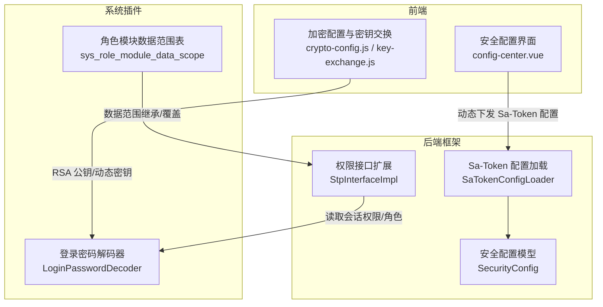
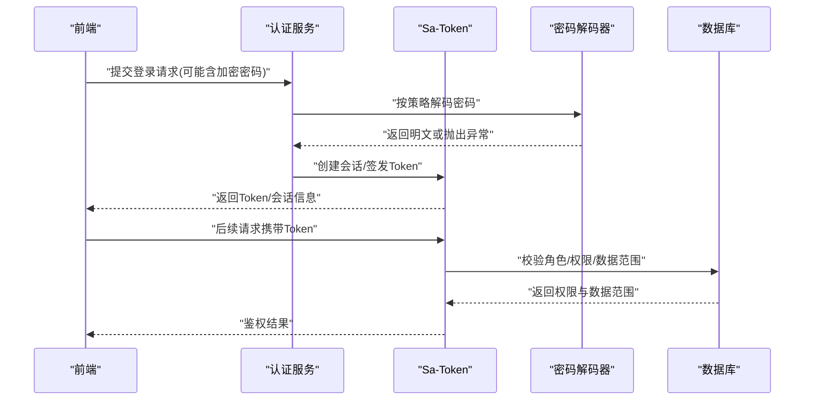
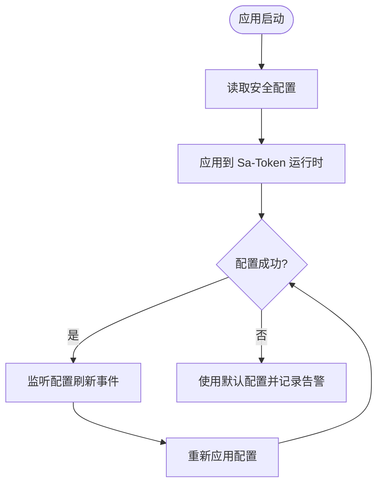
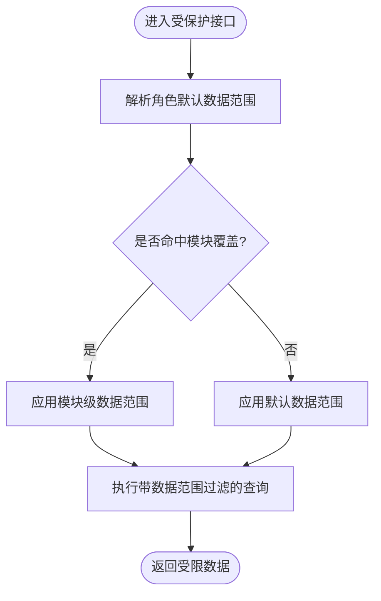
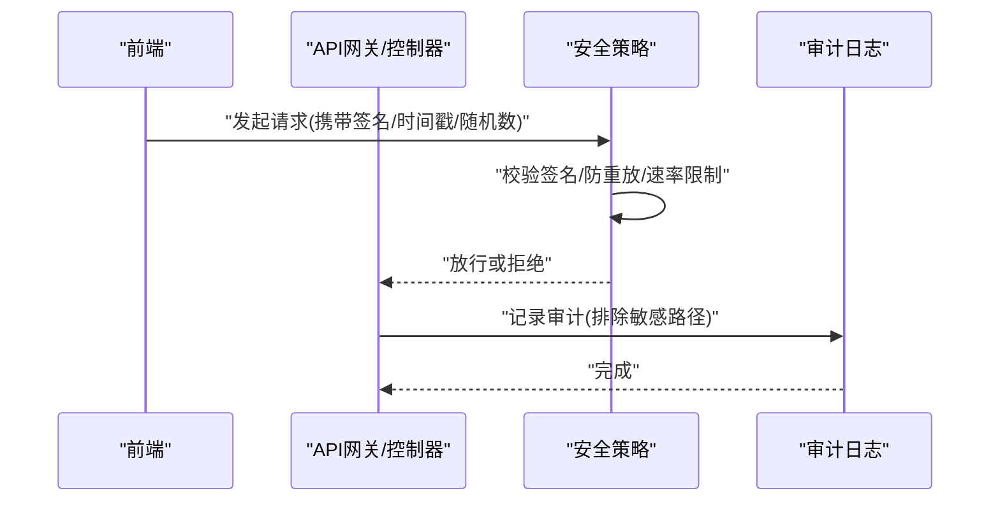
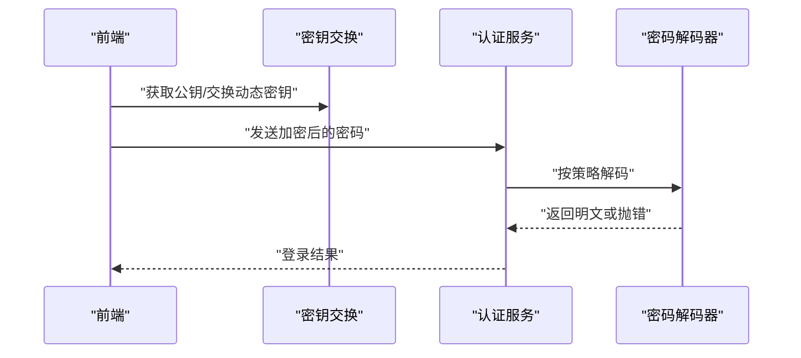
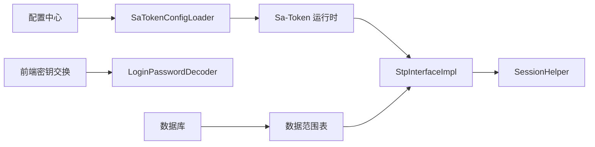

# 安全认证

<cite>
**本文引用的文件**
- [SaTokenConfigLoader.java](file://forge-server/forge-framework/forge-starter-parent/forge-starter-auth/src/main/java/com/mdframe/forge/starter/auth/config/SaTokenConfigLoader.java)
- [SecurityConfig.java](file://forge-server/forge-framework/forge-starter-parent/forge-starter-config/src/main/java/com/mdframe/forge/starter/config/config/SecurityConfig.java)
- [StpInterfaceImpl.java](file://forge-server/forge-framework/forge-starter-parent/forge-starter-auth/src/main/java/com/mdframe/forge/starter/auth/config/StpInterfaceImpl.java)
- [LoginPasswordDecoder.java](file://forge-server/forge-framework/forge-plugin-parent/forge-plugin-system/src/main/java/com/mdframe/forge/plugin/system/auth/LoginPasswordDecoder.java)
- [V1.0.99__add_role_module_data_scopes.sql](file://forge-server/db/migration/V1.0.99__add_role_module_data_scopes.sql)
- [application-permission-utils.js](file://forge-admin-ui/src/views/app-center/application-permission-utils.js)
- [config-center.vue](file://forge-admin-ui/src/views/system/config-center.vue)
- [crypto-config.js](file://forge-admin-ui/src/utils/crypto/crypto-config.js)
- [key-exchange.js](file://forge-admin-ui/src/utils/crypto/key-exchange.js)
- [CapabilityClientSecretCodecTest.java](file://forge-server/forge-framework/forge-plugin-parent/forge-plugin-capability-parent/forge-plugin-capability-platform/src/test/java/com/mdframe/forge/plugin/capability/controlplane/security/CapabilityClientSecretCodecTest.java)
- [BusinessExtensionValidationService.java](file://forge-server/forge-framework/forge-plugin-parent/forge-plugin-generator/src/main/java/com/mdframe/forge/plugin/generator/service/businessapp/BusinessExtensionValidationService.java)
- [ClientCredentialSurfaceContractTest.java](file://forge-server/forge-framework/forge-plugin-parent/forge-plugin-system/src/test/java/com/mdframe/forge/plugin/system/security/ClientCredentialSurfaceContractTest.java)
</cite>

## 目录
1. [简介](#简介)
2. [项目结构](#项目结构)
3. [核心组件](#核心组件)
4. [架构总览](#架构总览)
5. [详细组件分析](#详细组件分析)
6. [依赖关系分析](#依赖关系分析)
7. [性能考虑](#性能考虑)
8. [故障排查指南](#故障排查指南)
9. [结论](#结论)
10. [附录](#附录)

## 简介
本技术文档围绕 Forge Admin 的安全认证体系，系统性阐述基于 Sa-Token 的认证授权集成、RBAC 权限模型与数据权限控制、API 安全防护策略、密码加密存储与传输安全、会话安全管理，以及常见安全漏洞防护（SQL 注入、XSS、CSRF）的实践。文档面向不同技术背景的读者，提供从高层架构到代码级实现的渐进式说明，并辅以可视化图示帮助理解。

## 项目结构
本项目在“后端框架 + 插件 + 前端”的分层结构中实现安全能力：
- 后端框架层：提供 Sa-Token 配置加载、运行时刷新、权限接口扩展等通用能力。
- 系统插件层：实现登录密码解码、验证码策略、消息通道等与安全相关的业务逻辑。
- 数据库迁移：通过 SQL 脚本定义角色模块数据范围覆盖表，支撑细粒度数据权限。
- 前端工程：提供安全配置管理界面、密钥交换与加解密工具、防重放与路径白名单等。



图表来源
- [SaTokenConfigLoader.java:1-77](file://forge-server/forge-framework/forge-starter-parent/forge-starter-auth/src/main/java/com/mdframe/forge/starter/auth/config/SaTokenConfigLoader.java#L1-L77)
- [SecurityConfig.java:1-113](file://forge-server/forge-framework/forge-starter-parent/forge-starter-config/src/main/java/com/mdframe/forge/starter/config/config/SecurityConfig.java#L1-L113)
- [StpInterfaceImpl.java:1-35](file://forge-server/forge-framework/forge-starter-parent/forge-starter-auth/src/main/java/com/mdframe/forge/starter/auth/config/StpInterfaceImpl.java#L1-L35)
- [LoginPasswordDecoder.java:1-50](file://forge-server/forge-framework/forge-plugin-parent/forge-plugin-system/src/main/java/com/mdframe/forge/plugin/system/auth/LoginPasswordDecoder.java#L1-L50)
- [V1.0.99__add_role_module_data_scopes.sql:1-32](file://forge-server/db/migration/V1.0.99__add_role_module_data_scopes.sql#L1-L32)
- [config-center.vue:242-270](file://forge-admin-ui/src/views/system/config-center.vue#L242-L270)
- [crypto-config.js:1-53](file://forge-admin-ui/src/utils/crypto/crypto-config.js#L1-L53)
- [key-exchange.js:227-274](file://forge-admin-ui/src/utils/crypto/key-exchange.js#L227-L274)

章节来源
- [SaTokenConfigLoader.java:1-77](file://forge-server/forge-framework/forge-starter-parent/forge-starter-auth/src/main/java/com/mdframe/forge/starter/auth/config/SaTokenConfigLoader.java#L1-L77)
- [SecurityConfig.java:1-113](file://forge-server/forge-framework/forge-starter-parent/forge-starter-config/src/main/java/com/mdframe/forge/starter/config/config/SecurityConfig.java#L1-L113)
- [StpInterfaceImpl.java:1-35](file://forge-server/forge-framework/forge-starter-parent/forge-starter-auth/src/main/java/com/mdframe/forge/starter/auth/config/StpInterfaceImpl.java#L1-L35)
- [LoginPasswordDecoder.java:1-50](file://forge-server/forge-framework/forge-plugin-parent/forge-plugin-system/src/main/java/com/mdframe/forge/plugin/system/auth/LoginPasswordDecoder.java#L1-L50)
- [V1.0.99__add_role_module_data_scopes.sql:1-32](file://forge-server/db/migration/V1.0.99__add_role_module_data_scopes.sql#L1-L32)
- [config-center.vue:242-270](file://forge-admin-ui/src/views/system/config-center.vue#L242-L270)
- [crypto-config.js:1-53](file://forge-admin-ui/src/utils/crypto/crypto-config.js#L1-L53)
- [key-exchange.js:227-274](file://forge-admin-ui/src/utils/crypto/key-exchange.js#L227-L274)

## 核心组件
- Sa-Token 配置加载与热更新：应用启动时从配置中心读取 Sa-Token 参数并应用到运行时；支持配置变更事件触发重新加载，确保 Token 名称、前缀、超时、并发与共享策略可动态调整。
- 权限接口扩展：将当前会话中的角色键集合与权限码集合暴露给 Sa-Token，用于注解鉴权与路由级控制。
- 登录密码统一解码：根据服务端登录策略决定是否启用 RSA 解密；当开启加密且解密失败时拒绝明文降级，保障传输安全。
- 数据权限模型：通过角色与业务模块的数据范围覆盖表，实现部门隔离、自定义范围与权限继承规则。
- 前端安全能力：提供安全配置界面、密钥交换流程、API 级加解密与防重放策略，并与后端策略协同工作。

章节来源
- [SaTokenConfigLoader.java:25-76](file://forge-server/forge-framework/forge-starter-parent/forge-starter-auth/src/main/java/com/mdframe/forge/starter/auth/config/SaTokenConfigLoader.java#L25-L76)
- [StpInterfaceImpl.java:17-33](file://forge-server/forge-framework/forge-starter-parent/forge-starter-auth/src/main/java/com/mdframe/forge/starter/auth/config/StpInterfaceImpl.java#L17-L33)
- [LoginPasswordDecoder.java:21-48](file://forge-server/forge-framework/forge-plugin-parent/forge-plugin-system/src/main/java/com/mdframe/forge/plugin/system/auth/LoginPasswordDecoder.java#L21-L48)
- [V1.0.99__add_role_module_data_scopes.sql:1-18](file://forge-server/db/migration/V1.0.99__add_role_module_data_scopes.sql#L1-L18)
- [config-center.vue:242-270](file://forge-admin-ui/src/views/system/config-center.vue#L242-L270)
- [crypto-config.js:1-53](file://forge-admin-ui/src/utils/crypto/crypto-config.js#L1-L53)
- [key-exchange.js:239-274](file://forge-admin-ui/src/utils/crypto/key-exchange.js#L239-L274)

## 架构总览
下图展示了认证授权与数据安全的关键交互：前端登录后获取或交换密钥，使用 RSA 加密密码；后端按策略解码；Sa-Token 负责会话与 Token 生命周期；权限与数据范围由会话与数据库共同决定。



图表来源
- [LoginPasswordDecoder.java:21-48](file://forge-server/forge-framework/forge-plugin-parent/forge-plugin-system/src/main/java/com/mdframe/forge/plugin/system/auth/LoginPasswordDecoder.java#L21-L48)
- [SaTokenConfigLoader.java:39-68](file://forge-server/forge-framework/forge-starter-parent/forge-starter-auth/src/main/java/com/mdframe/forge/starter/auth/config/SaTokenConfigLoader.java#L39-L68)
- [StpInterfaceImpl.java:17-33](file://forge-server/forge-framework/forge-starter-parent/forge-starter-auth/src/main/java/com/mdframe/forge/starter/auth/config/StpInterfaceImpl.java#L17-L33)
- [V1.0.99__add_role_module_data_scopes.sql:1-18](file://forge-server/db/migration/V1.0.99__add_role_module_data_scopes.sql#L1-L18)

## 详细组件分析

### Sa-Token 认证与会话管理
- 配置加载与热更新：应用启动时读取 SecurityConfig，将 tokenName、tokenPrefix、timeout、activeTimeout、并发与共享策略写入 Sa-Token 运行时；监听配置刷新事件，动态生效。
- 会话与权限：通过 StpInterfaceImpl 将当前会话的角色键与权限码暴露给 Sa-Token，便于注解鉴权与路由控制。
- 前端配置界面：提供 Sa-Token 相关参数的可视化编辑，包括 Token 超时、活动超时、并发登录开关等。



图表来源
- [SaTokenConfigLoader.java:25-76](file://forge-server/forge-framework/forge-starter-parent/forge-starter-auth/src/main/java/com/mdframe/forge/starter/auth/config/SaTokenConfigLoader.java#L25-L76)
- [SecurityConfig.java:24-70](file://forge-server/forge-framework/forge-starter-parent/forge-starter-config/src/main/java/com/mdframe/forge/starter/config/config/SecurityConfig.java#L24-L70)
- [config-center.vue:242-270](file://forge-admin-ui/src/views/system/config-center.vue#L242-L270)

章节来源
- [SaTokenConfigLoader.java:25-76](file://forge-server/forge-framework/forge-starter-parent/forge-starter-auth/src/main/java/com/mdframe/forge/starter/auth/config/SaTokenConfigLoader.java#L25-L76)
- [SecurityConfig.java:24-70](file://forge-server/forge-framework/forge-starter-parent/forge-starter-config/src/main/java/com/mdframe/forge/starter/config/config/SecurityConfig.java#L24-L70)
- [config-center.vue:242-270](file://forge-admin-ui/src/views/system/config-center.vue#L242-L270)
- [StpInterfaceImpl.java:17-33](file://forge-server/forge-framework/forge-starter-parent/forge-starter-auth/src/main/java/com/mdframe/forge/starter/auth/config/StpInterfaceImpl.java#L17-L33)

### RBAC 权限模型与动态权限控制
- 角色与资源：通过会话中的角色键与权限码进行接口级鉴权；权限集合来源于当前登录上下文。
- 模块级数据范围覆盖：新增角色-业务模块数据范围覆盖表，允许对特定模块设置更严格的数据范围，形成“全局默认范围 + 模块覆盖”的继承机制。
- 前端权限归一化：提供工具函数对角色授权数据进行规范化处理，便于前后端一致地表达权限与数据范围。

```mermaid
classDiagram
class 角色 {
+id
+租户ID
+角色键
}
class 业务模块 {
+模块编码
+默认数据范围
}
class 角色模块数据范围 {
+租户ID
+角色ID
+模块编码
+数据范围
}
角色 ||--o{ 角色模块数据范围 : "拥有"
业务模块 ||--o{ 角色模块数据范围 : "被覆盖"
```

图表来源
- [V1.0.99__add_role_module_data_scopes.sql:1-18](file://forge-server/db/migration/V1.0.99__add_role_module_data_scopes.sql#L1-L18)
- [application-permission-utils.js:1-34](file://forge-admin-ui/src/views/app-center/application-permission-utils.js#L1-L34)

章节来源
- [StpInterfaceImpl.java:17-33](file://forge-server/forge-framework/forge-starter-parent/forge-starter-auth/src/main/java/com/mdframe/forge/starter/auth/config/StpInterfaceImpl.java#L17-L33)
- [V1.0.99__add_role_module_data_scopes.sql:1-18](file://forge-server/db/migration/V1.0.99__add_role_module_data_scopes.sql#L1-L18)
- [application-permission-utils.js:1-34](file://forge-admin-ui/src/views/app-center/application-permission-utils.js#L1-L34)

### 数据权限控制机制
- 部门数据隔离：通过数据范围字段限制查询可见范围，结合租户与组织维度实现多租户与组织内数据隔离。
- 自定义数据范围：支持为特定业务模块设置更细粒度的数据范围，覆盖默认策略。
- 权限继承规则：角色默认数据范围作为基线，模块级覆盖优先；未覆盖模块沿用默认范围。



图表来源
- [V1.0.99__add_role_module_data_scopes.sql:1-18](file://forge-server/db/migration/V1.0.99__add_role_module_data_scopes.sql#L1-L18)
- [application-permission-utils.js:8-24](file://forge-admin-ui/src/views/app-center/application-permission-utils.js#L8-L24)

章节来源
- [V1.0.99__add_role_module_data_scopes.sql:1-18](file://forge-server/db/migration/V1.0.99__add_role_module_data_scopes.sql#L1-L18)
- [application-permission-utils.js:8-24](file://forge-admin-ui/src/views/app-center/application-permission-utils.js#L8-L24)

### API 安全防护策略
- 接口签名验证：通过前端密钥交换与动态密钥模式，结合路径白名单/黑名单控制，对敏感接口进行加密与防重放保护。
- 请求频率限制：建议结合网关或中间件实现限流策略，避免暴力破解与资源滥用（具体实现可在网关层补充）。
- 敏感操作审计：日志切面需硬排除敏感路径，防止记录登录、注册、改密等敏感信息。



图表来源
- [crypto-config.js:1-53](file://forge-admin-ui/src/utils/crypto/crypto-config.js#L1-L53)
- [key-exchange.js:239-274](file://forge-admin-ui/src/utils/crypto/key-exchange.js#L239-L274)
- [ClientCredentialSurfaceContractTest.java:17-33](file://forge-server/forge-framework/forge-plugin-parent/forge-plugin-system/src/test/java/com/mdframe/forge/plugin/system/security/ClientCredentialSurfaceContractTest.java#L17-L33)

章节来源
- [crypto-config.js:1-53](file://forge-admin-ui/src/utils/crypto/crypto-config.js#L1-L53)
- [key-exchange.js:239-274](file://forge-admin-ui/src/utils/crypto/key-exchange.js#L239-L274)
- [ClientCredentialSurfaceContractTest.java:17-33](file://forge-server/forge-framework/forge-plugin-parent/forge-plugin-system/src/test/java/com/mdframe/forge/plugin/system/security/ClientCredentialSurfaceContractTest.java#L17-L33)

### 密码加密存储与数据传输安全
- 传输加密：前端在登录时可选择 RSA 加密密码；后端按策略解码，若开启加密且解密失败则拒绝明文降级。
- 密钥管理：支持动态密钥模式，应用启动或登录后进行密钥交换；提供静态密钥回退方案。
- 客户端密钥安全：能力平台客户端密钥生成与校验需配置 Pepper，缺失时将拒绝签发。



图表来源
- [key-exchange.js:239-274](file://forge-admin-ui/src/utils/crypto/key-exchange.js#L239-L274)
- [LoginPasswordDecoder.java:21-48](file://forge-server/forge-framework/forge-plugin-parent/forge-plugin-system/src/main/java/com/mdframe/forge/plugin/system/auth/LoginPasswordDecoder.java#L21-L48)
- [CapabilityClientSecretCodecTest.java:12-28](file://forge-server/forge-framework/forge-plugin-parent/forge-plugin-capability-parent/forge-plugin-capability-platform/src/test/java/com/mdframe/forge/plugin/capability/controlplane/security/CapabilityClientSecretCodecTest.java#L12-L28)

章节来源
- [key-exchange.js:239-274](file://forge-admin-ui/src/utils/crypto/key-exchange.js#L239-L274)
- [LoginPasswordDecoder.java:21-48](file://forge-server/forge-framework/forge-plugin-parent/forge-plugin-system/src/main/java/com/mdframe/forge/plugin/system/auth/LoginPasswordDecoder.java#L21-L48)
- [CapabilityClientSecretCodecTest.java:12-28](file://forge-server/forge-framework/forge-plugin-parent/forge-plugin-capability-parent/forge-plugin-capability-platform/src/test/java/com/mdframe/forge/plugin/capability/controlplane/security/CapabilityClientSecretCodecTest.java#L12-L28)

### 会话安全管理
- Token 生命周期：支持设置 Token 有效期与活动超时，控制长时间无操作自动过期。
- 并发与共享：可配置同一账号是否允许多设备并发登录，以及是否共享 Token。
- 读取位置：支持从 Header、Body、Cookie 中读取 Token，灵活适配不同客户端。

章节来源
- [SecurityConfig.java:24-70](file://forge-server/forge-framework/forge-starter-parent/forge-starter-config/src/main/java/com/mdframe/forge/starter/config/config/SecurityConfig.java#L24-L70)
- [SaTokenConfigLoader.java:39-68](file://forge-server/forge-framework/forge-starter-parent/forge-starter-auth/src/main/java/com/mdframe/forge/starter/auth/config/SaTokenConfigLoader.java#L39-L68)

### 安全漏洞防护
- SQL 注入防护：在代码生成与低代码扩展中禁用危险 API 与关键字，避免拼接用户输入；测试断言确保不出现危险字符串与注入特征。
- XSS 防护：前端规范强调模板自动转义、谨慎使用 v-html、避免直接 innerHTML；生成器禁止引入不安全 CSS/JS。
- CSRF 防护：建议使用 SameSite Cookie、表单令牌与服务端校验；前端规范明确 CSRF Token 的使用方式。

章节来源
- [BusinessExtensionValidationService.java:28-43](file://forge-server/forge-framework/forge-plugin-parent/forge-plugin-generator/src/main/java/com/mdframe/forge/plugin/generator/service/businessapp/BusinessExtensionValidationService.java#L28-L43)
- [.turing_coder_rules/common-rules.md:516-536](file://forge-admin-ui/.turing_coder_rules/common-rules.md#L516-L536)

## 依赖关系分析
- 组件耦合：Sa-Token 配置加载依赖配置中心服务；权限接口扩展依赖会话助手；密码解码器依赖 RSA 密钥持有者；数据范围依赖数据库表与前端归一化工具。
- 外部依赖：Sa-Token 框架、RSA 加密库、配置中心、数据库。
- 潜在循环依赖：通过分层与接口解耦避免循环；配置加载与权限扩展均为单向依赖。



图表来源
- [SaTokenConfigLoader.java:39-68](file://forge-server/forge-framework/forge-starter-parent/forge-starter-auth/src/main/java/com/mdframe/forge/starter/auth/config/SaTokenConfigLoader.java#L39-L68)
- [StpInterfaceImpl.java:17-33](file://forge-server/forge-framework/forge-starter-parent/forge-starter-auth/src/main/java/com/mdframe/forge/starter/auth/config/StpInterfaceImpl.java#L17-L33)
- [LoginPasswordDecoder.java:21-48](file://forge-server/forge-framework/forge-plugin-parent/forge-plugin-system/src/main/java/com/mdframe/forge/plugin/system/auth/LoginPasswordDecoder.java#L21-L48)
- [V1.0.99__add_role_module_data_scopes.sql:1-18](file://forge-server/db/migration/V1.0.99__add_role_module_data_scopes.sql#L1-L18)

章节来源
- [SaTokenConfigLoader.java:39-68](file://forge-server/forge-framework/forge-starter-parent/forge-starter-auth/src/main/java/com/mdframe/forge/starter/auth/config/SaTokenConfigLoader.java#L39-L68)
- [StpInterfaceImpl.java:17-33](file://forge-server/forge-framework/forge-starter-parent/forge-starter-auth/src/main/java/com/mdframe/forge/starter/auth/config/StpInterfaceImpl.java#L17-L33)
- [LoginPasswordDecoder.java:21-48](file://forge-server/forge-framework/forge-plugin-parent/forge-plugin-system/src/main/java/com/mdframe/forge/plugin/system/auth/LoginPasswordDecoder.java#L21-L48)
- [V1.0.99__add_role_module_data_scopes.sql:1-18](file://forge-server/db/migration/V1.0.99__add_role_module_data_scopes.sql#L1-L18)

## 性能考虑
- 配置热更新：避免频繁全量重载，仅在配置变更事件触发时增量应用。
- 权限缓存：建议对角色与权限集合进行短期缓存，减少会话解析开销。
- 数据范围过滤：在 SQL 层添加必要索引（如租户、组织、模块编码），提升范围查询性能。
- 密钥交换：动态密钥模式应在登录后一次性完成，避免每次请求重复交换。

[本节为通用指导，无需引用具体文件]

## 故障排查指南
- 登录失败且提示“密码加密校验失败”：检查前端是否启用 RSA 加密、是否成功获取公钥或交换动态密钥；确认后端 RSA 服务可用。
- Sa-Token 配置未生效：确认配置中心已下发安全配置；查看应用启动日志中是否成功加载并应用；检查配置刷新事件是否触发。
- 权限不足：核对当前会话中的角色键与权限码是否正确加载；检查模块级数据范围覆盖是否误配。
- 日志泄露敏感信息：确认日志切面已硬排除敏感路径，避免记录登录、注册、改密等接口详情。

章节来源
- [LoginPasswordDecoder.java:21-48](file://forge-server/forge-framework/forge-plugin-parent/forge-plugin-system/src/main/java/com/mdframe/forge/plugin/system/auth/LoginPasswordDecoder.java#L21-L48)
- [SaTokenConfigLoader.java:39-68](file://forge-server/forge-framework/forge-starter-parent/forge-starter-auth/src/main/java/com/mdframe/forge/starter/auth/config/SaTokenConfigLoader.java#L39-L68)
- [ClientCredentialSurfaceContractTest.java:17-33](file://forge-server/forge-framework/forge-plugin-parent/forge-plugin-system/src/test/java/com/mdframe/forge/plugin/system/security/ClientCredentialSurfaceContractTest.java#L17-L33)

## 结论
Forge Admin 的安全认证体系以 Sa-Token 为核心，结合动态配置、RBAC 与数据权限模型，实现了灵活的认证授权与细粒度数据隔离。通过前端密钥交换与传输加密、严格的密码解码策略与日志审计，有效提升了整体安全性。建议在网关层补充请求频率限制与签名校验，进一步加固 API 安全边界。

[本节为总结性内容，无需引用具体文件]

## 附录
- 术语解释
  - Sa-Token：轻量级 Java 权限认证框架，提供 Token、会话、权限等功能。
  - RBAC：基于角色的访问控制，通过角色绑定资源实现权限管理。
  - 数据权限：基于组织、租户、个人等维度的数据可见性控制。
  - 密钥交换：前后端协商对称密钥或获取公钥的过程，用于传输加密。
- 最佳实践
  - 始终启用传输加密，关闭明文降级。
  - 合理设置 Token 有效期与活动超时，平衡体验与安全。
  - 对敏感接口实施签名与防重放，限制请求频率。
  - 定期审查日志输出，避免泄露敏感信息。

[本节为补充说明，无需引用具体文件]