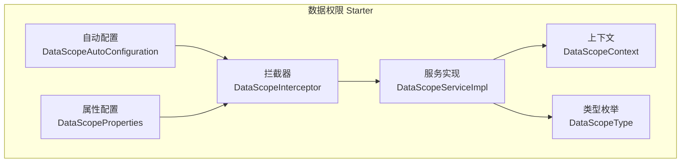
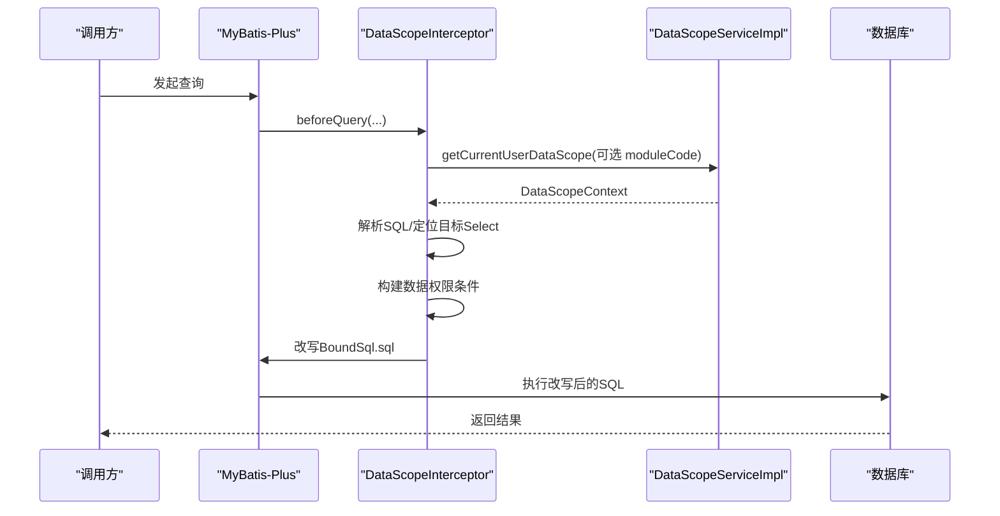
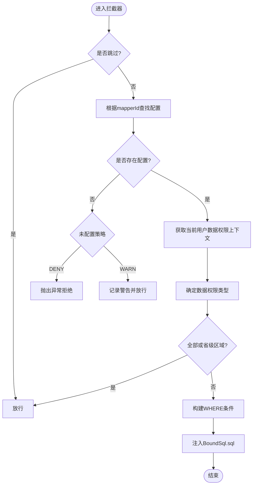
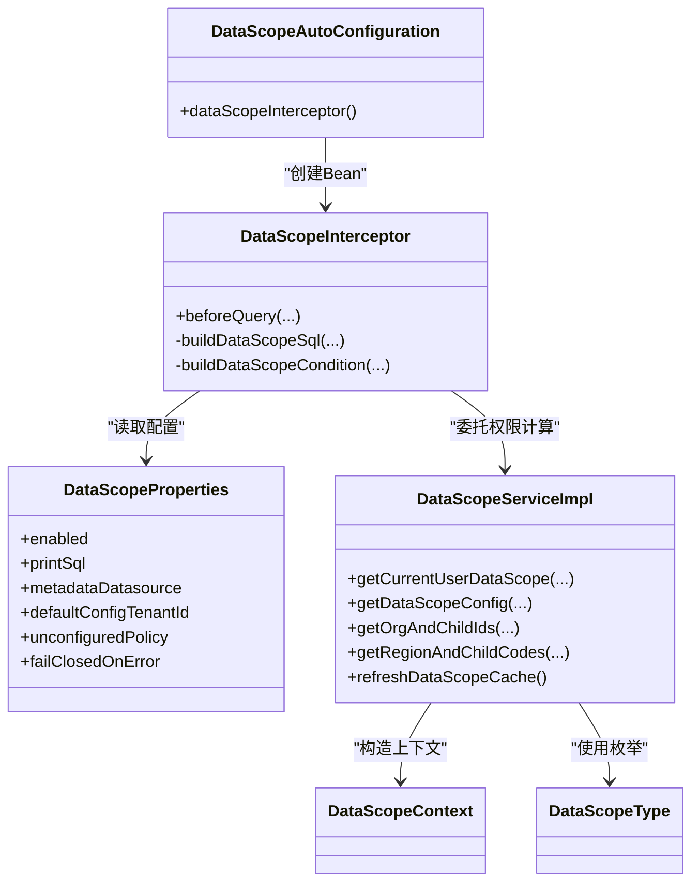

# 数据权限控制

<cite>
**本文引用的文件**
- [DataScopeAutoConfiguration.java](file://forge-server/forge-framework/forge-starter-parent/forge-starter-datascope/src/main/java/com/mdframe/forge/starter/datascope/config/DataScopeAutoConfiguration.java)
- [DataScopeProperties.java](file://forge-server/forge-framework/forge-starter-parent/forge-starter-datascope/src/main/java/com/mdframe/forge/starter/datascope/config/DataScopeProperties.java)
- [DataScopeInterceptor.java](file://forge-server/forge-framework/forge-starter-parent/forge-starter-datascope/src/main/java/com/mdframe/forge/starter/datascope/handler/DataScopeInterceptor.java)
- [DataScopeContext.java](file://forge-server/forge-framework/forge-starter-parent/forge-starter-datascope/src/main/java/com/mdframe/forge/starter/datascope/context/DataScopeContext.java)
- [DataScopeType.java](file://forge-server/forge-framework/forge-starter-parent/forge-starter-datascope/src/main/java/com/mdframe/forge/starter/datascope/enums/DataScopeType.java)
- [DataScopeServiceImpl.java](file://forge-server/forge-framework/forge-starter-parent/forge-starter-datascope/src/main/java/com/mdframe/forge/starter/datascope/service/impl/DataScopeServiceImpl.java)
</cite>

## 目录
1. [简介](#简介)
2. [项目结构](#项目结构)
3. [核心组件](#核心组件)
4. [架构总览](#架构总览)
5. [详细组件分析](#详细组件分析)
6. [依赖关系分析](#依赖关系分析)
7. [性能考虑](#性能考虑)
8. [故障排查指南](#故障排查指南)
9. [结论](#结论)
10. [附录](#附录)

## 简介
本技术文档围绕 Forge Admin 的数据权限控制系统，系统性阐述数据权限模型、注解与拦截机制、多租户隔离、动态权限计算、SQL 改写策略以及审计与可观测性。重点包括：
- 数据权限模型：部门隔离、自定义范围、行政区划、租户隔离与继承规则
- 数据权限注解与过滤：基于 Mapper 配置的数据过滤机制（含“自定义 SQL”能力）
- 多租户隔离：租户上下文注入与范围限制
- 动态权限：基于角色与模块的实时权限计算
- 拦截器原理与优化：MyBatis-Plus InnerInterceptor 实现与性能策略
- 审计日志与变更追踪：开关、失败关闭策略与未配置处理策略

## 项目结构
数据权限能力以 starter 形式提供，核心位于 forge-starter-datascope 模块，包含自动装配、属性配置、上下文、枚举、拦截器与服务实现等。

图表来源
- [DataScopeAutoConfiguration.java:1-43](file://forge-server/forge-framework/forge-starter-parent/forge-starter-datascope/src/main/java/com/mdframe/forge/starter/datascope/config/DataScopeAutoConfiguration.java#L1-L43)
- [DataScopeProperties.java:1-48](file://forge-server/forge-framework/forge-starter-parent/forge-starter-datascope/src/main/java/com/mdframe/forge/starter/datascope/config/DataScopeProperties.java#L1-L48)
- [DataScopeInterceptor.java:1-608](file://forge-server/forge-framework/forge-starter-parent/forge-starter-datascope/src/main/java/com/mdframe/forge/starter/datascope/handler/DataScopeInterceptor.java#L1-L608)
- [DataScopeContext.java:1-68](file://forge-server/forge-framework/forge-starter-parent/forge-starter-datascope/src/main/java/com/mdframe/forge/starter/datascope/context/DataScopeContext.java#L1-L68)
- [DataScopeType.java:1-91](file://forge-server/forge-framework/forge-starter-parent/forge-starter-datascope/src/main/java/com/mdframe/forge/starter/datascope/enums/DataScopeType.java#L1-L91)
- [DataScopeServiceImpl.java:1-473](file://forge-server/forge-framework/forge-starter-parent/forge-starter-datascope/src/main/java/com/mdframe/forge/starter/datascope/service/impl/DataScopeServiceImpl.java#L1-L473)

章节来源
- [DataScopeAutoConfiguration.java:1-43](file://forge-server/forge-framework/forge-starter-parent/forge-starter-datascope/src/main/java/com/mdframe/forge/starter/datascope/config/DataScopeAutoConfiguration.java#L1-L43)
- [DataScopeProperties.java:1-48](file://forge-server/forge-framework/forge-starter-parent/forge-starter-datascope/src/main/java/com/mdframe/forge/starter/datascope/config/DataScopeProperties.java#L1-L48)

## 核心组件
- 自动装配：注册数据权限拦截器 Bean，并设置最高优先级，确保在 MyBatis-Plus 拦截链中优先执行。
- 属性配置：控制是否启用、是否打印 SQL、元数据数据源、默认配置租户、未配置策略、失败关闭策略等。
- 上下文：封装当前用户、组织、角色、租户、行政区划等信息，作为权限计算的输入。
- 类型枚举：定义全部、本人、本组织、本组织及子组织、自定义、租户全部、本行政区划等数据权限范围。
- 拦截器：基于 MyBatis-Plus InnerInterceptor 在查询前解析 SQL、计算权限条件并改写 SQL。
- 服务实现：加载平台元数据到内存快照，计算当前用户的最小数据权限范围，并提供组织/区划扩展集合。

章节来源
- [DataScopeAutoConfiguration.java:1-43](file://forge-server/forge-framework/forge-starter-parent/forge-starter-datascope/src/main/java/com/mdframe/forge/starter/datascope/config/DataScopeAutoConfiguration.java#L1-L43)
- [DataScopeProperties.java:1-48](file://forge-server/forge-framework/forge-starter-parent/forge-starter-datascope/src/main/java/com/mdframe/forge/starter/datascope/config/DataScopeProperties.java#L1-L48)
- [DataScopeContext.java:1-68](file://forge-server/forge-framework/forge-starter-parent/forge-starter-datascope/src/main/java/com/mdframe/forge/starter/datascope/context/DataScopeContext.java#L1-L68)
- [DataScopeType.java:1-91](file://forge-server/forge-framework/forge-starter-parent/forge-starter-datascope/src/main/java/com/mdframe/forge/starter/datascope/enums/DataScopeType.java#L1-L91)
- [DataScopeInterceptor.java:1-608](file://forge-server/forge-framework/forge-starter-parent/forge-starter-datascope/src/main/java/com/mdframe/forge/starter/datascope/handler/DataScopeInterceptor.java#L1-L608)
- [DataScopeServiceImpl.java:1-473](file://forge-server/forge-framework/forge-starter-parent/forge-starter-datascope/src/main/java/com/mdframe/forge/starter/datascope/service/impl/DataScopeServiceImpl.java#L1-L473)

## 架构总览
数据权限在查询阶段通过 MyBatis-Plus 拦截器进行 SQL 改写，结合运行时用户上下文与平台元数据缓存，生成最终 WHERE 条件。

图表来源
- [DataScopeInterceptor.java:69-155](file://forge-server/forge-framework/forge-starter-parent/forge-starter-datascope/src/main/java/com/mdframe/forge/starter/datascope/handler/DataScopeInterceptor.java#L69-L155)
- [DataScopeServiceImpl.java:84-157](file://forge-server/forge-framework/forge-starter-parent/forge-starter-datascope/src/main/java/com/mdframe/forge/starter/datascope/service/impl/DataScopeServiceImpl.java#L84-L157)

## 详细组件分析

### 数据权限模型设计
- 部门数据隔离：支持“本组织”和“本组织及子组织”，通过组织祖先链与子组织映射快速展开。
- 自定义数据范围：当角色数据范围为“自定义”时，聚合该角色的所有自定义组织 ID 集合。
- 权限继承规则：
  - 管理员拥有全部数据权限；租户管理员拥有租户全部数据权限。
  - 普通用户无角色时默认“本人”数据权限。
  - 多角色取最小数据权限范围（更严格）。
  - 模块级覆盖：若配置了模块级数据权限，则优先使用模块级范围。
- 行政区划权限：按用户所属 regionCode 过滤，省级不限制，市级及以下匹配本级与下级编码集合。

章节来源
- [DataScopeServiceImpl.java:84-157](file://forge-server/forge-framework/forge-starter-parent/forge-starter-datascope/src/main/java/com/mdframe/forge/starter/datascope/service/impl/DataScopeServiceImpl.java#L84-L157)
- [DataScopeServiceImpl.java:171-182](file://forge-server/forge-framework/forge-starter-parent/forge-starter-datascope/src/main/java/com/mdframe/forge/starter/datascope/service/impl/DataScopeServiceImpl.java#L171-L182)
- [DataScopeServiceImpl.java:201-235](file://forge-server/forge-framework/forge-starter-parent/forge-starter-datascope/src/main/java/com/mdframe/forge/starter/datascope/service/impl/DataScopeServiceImpl.java#L201-L235)
- [DataScopeType.java:11-90](file://forge-server/forge-framework/forge-starter-parent/forge-starter-datascope/src/main/java/com/mdframe/forge/starter/datascope/enums/DataScopeType.java#L11-L90)

### 数据权限注解与数据过滤机制
- 注解说明：当前代码未直接实现 @DataScope 注解；数据权限通过 Mapper 方法级别的配置生效。
- 配置来源：系统表中的 SysDataScopeConfig 记录，支持租户级与默认配置。
- 过滤机制：
  - 拦截器根据 mapperId 查找配置，未配置时按策略放行或拒绝。
  - 对 SELECT 语句进行 AST 解析，将数据权限条件追加到 WHERE。
  - 支持简单字段与复杂 SQL 模板（以 <sql> 开头），占位符如 #{userId}、#{tenantId}、#{orgIds}、#{customOrgIds}、#{regionCode}、#{regionLevel}、#{regionAncestors}、#{regionCodes}。
  - 分页 count 查询会剥离后缀后复用原方法配置，并将条件注入内层子查询。

图表来源
- [DataScopeInterceptor.java:69-155](file://forge-server/forge-framework/forge-starter-parent/forge-starter-datascope/src/main/java/com/mdframe/forge/starter/datascope/handler/DataScopeInterceptor.java#L69-L155)
- [DataScopeInterceptor.java:176-207](file://forge-server/forge-framework/forge-starter-parent/forge-starter-datascope/src/main/java/com/mdframe/forge/starter/datascope/handler/DataScopeInterceptor.java#L176-L207)
- [DataScopeInterceptor.java:232-287](file://forge-server/forge-framework/forge-starter-parent/forge-starter-datascope/src/main/java/com/mdframe/forge/starter/datascope/handler/DataScopeInterceptor.java#L232-L287)
- [DataScopeInterceptor.java:289-426](file://forge-server/forge-framework/forge-starter-parent/forge-starter-datascope/src/main/java/com/mdframe/forge/starter/datascope/handler/DataScopeInterceptor.java#L289-L426)

章节来源
- [DataScopeInterceptor.java:69-155](file://forge-server/forge-framework/forge-starter-parent/forge-starter-datascope/src/main/java/com/mdframe/forge/starter/datascope/handler/DataScopeInterceptor.java#L69-L155)
- [DataScopeInterceptor.java:176-207](file://forge-server/forge-framework/forge-starter-parent/forge-starter-datascope/src/main/java/com/mdframe/forge/starter/datascope/handler/DataScopeInterceptor.java#L176-L207)
- [DataScopeInterceptor.java:232-287](file://forge-server/forge-framework/forge-starter-parent/forge-starter-datascope/src/main/java/com/mdframe/forge/starter/datascope/handler/DataScopeInterceptor.java#L232-L287)
- [DataScopeInterceptor.java:289-426](file://forge-server/forge-framework/forge-starter-parent/forge-starter-datascope/src/main/java/com/mdframe/forge/starter/datascope/handler/DataScopeInterceptor.java#L289-L426)

### 多租户数据隔离
- 租户上下文注入：服务实现从 TenantContextHolder 或会话中解析当前租户 ID。
- 配置隔离：SysDataScopeConfig 支持租户级配置，优先于默认配置。
- 范围限制：TENANT_ALL 类型会在 SQL 中追加 tenantId 列等值条件，确保仅访问当前租户数据。

章节来源
- [DataScopeServiceImpl.java:184-199](file://forge-server/forge-framework/forge-starter-parent/forge-starter-datascope/src/main/java/com/mdframe/forge/starter/datascope/service/impl/DataScopeServiceImpl.java#L184-L199)
- [DataScopeServiceImpl.java:420-432](file://forge-server/forge-framework/forge-starter-parent/forge-starter-datascope/src/main/java/com/mdframe/forge/starter/datascope/service/impl/DataScopeServiceImpl.java#L420-L432)
- [DataScopeInterceptor.java:270-276](file://forge-server/forge-framework/forge-starter-parent/forge-starter-datascope/src/main/java/com/mdframe/forge/starter/datascope/handler/DataScopeInterceptor.java#L270-L276)

### 动态数据权限控制
- 基于角色：根据用户角色列表，取最小数据权限范围；若为“自定义”，合并所有自定义组织 ID。
- 模块级覆盖：若存在模块级数据权限配置，优先使用模块级范围。
- 实时计算：每次查询前计算上下文，避免跨请求污染。

章节来源
- [DataScopeServiceImpl.java:84-157](file://forge-server/forge-framework/forge-starter-parent/forge-starter-datascope/src/main/java/com/mdframe/forge/starter/datascope/service/impl/DataScopeServiceImpl.java#L84-L157)
- [DataScopeServiceImpl.java:171-182](file://forge-server/forge-framework/forge-starter-parent/forge-starter-datascope/src/main/java/com/mdframe/forge/starter/datascope/service/impl/DataScopeServiceImpl.java#L171-L182)
- [DataScopeServiceImpl.java:391-400](file://forge-server/forge-framework/forge-starter-parent/forge-starter-datascope/src/main/java/com/mdframe/forge/starter/datascope/service/impl/DataScopeServiceImpl.java#L391-L400)

### 数据权限拦截器实现原理
- 前置检查：支持跳过标记（后台任务场景）、忽略特定 Mapper 包。
- 配置校验：未配置时按策略处理（WARN/DENY）。
- 上下文获取：从执行身份或会话获取登录用户信息，构造 DataScopeContext。
- 权限类型判定：ALL、SELF、ORG、ORG_AND_CHILD、CUSTOM、TENANT_ALL、REGION。
- SQL 改写：解析 AST，定位目标 Select，构建条件表达式并注入 BoundSql。
- 特殊处理：分页 count 查询剥离后缀；REGION 权限支持用户表 area_code 联合 OR 条件。

章节来源
- [DataScopeInterceptor.java:69-155](file://forge-server/forge-framework/forge-starter-parent/forge-starter-datascope/src/main/java/com/mdframe/forge/starter/datascope/handler/DataScopeInterceptor.java#L69-L155)
- [DataScopeInterceptor.java:176-207](file://forge-server/forge-framework/forge-starter-parent/forge-starter-datascope/src/main/java/com/mdframe/forge/starter/datascope/handler/DataScopeInterceptor.java#L176-L207)
- [DataScopeInterceptor.java:232-287](file://forge-server/forge-framework/forge-starter-parent/forge-starter-datascope/src/main/java/com/mdframe/forge/starter/datascope/handler/DataScopeInterceptor.java#L232-L287)
- [DataScopeInterceptor.java:462-588](file://forge-server/forge-framework/forge-starter-parent/forge-starter-datascope/src/main/java/com/mdframe/forge/starter/datascope/handler/DataScopeInterceptor.java#L462-L588)

### 数据权限审计日志与权限变更追踪
- 审计日志：拦截器在关键路径输出调试/警告/错误日志，便于问题定位。
- 变更追踪：服务实现启动时预热平台元数据至内存快照，刷新时会记录统计信息，便于观察权限配置变化影响。
- 失败关闭：当已配置数据权限的查询发生异常时，可按 failClosedOnError 配置决定是否抛出异常。

章节来源
- [DataScopeInterceptor.java:157-171](file://forge-server/forge-framework/forge-starter-parent/forge-starter-datascope/src/main/java/com/mdframe/forge/starter/datascope/handler/DataScopeInterceptor.java#L157-L171)
- [DataScopeServiceImpl.java:74-82](file://forge-server/forge-framework/forge-starter-parent/forge-starter-datascope/src/main/java/com/mdframe/forge/starter/datascope/service/impl/DataScopeServiceImpl.java#L74-L82)
- [DataScopeServiceImpl.java:237-253](file://forge-server/forge-framework/forge-starter-parent/forge-starter-datascope/src/main/java/com/mdframe/forge/starter/datascope/service/impl/DataScopeServiceImpl.java#L237-L253)

## 依赖关系分析

图表来源
- [DataScopeAutoConfiguration.java:31-41](file://forge-server/forge-framework/forge-starter-parent/forge-starter-datascope/src/main/java/com/mdframe/forge/starter/datascope/config/DataScopeAutoConfiguration.java#L31-L41)
- [DataScopeInterceptor.java:49-67](file://forge-server/forge-framework/forge-starter-parent/forge-starter-datascope/src/main/java/com/mdframe/forge/starter/datascope/handler/DataScopeInterceptor.java#L49-L67)
- [DataScopeServiceImpl.java:55-73](file://forge-server/forge-framework/forge-starter-parent/forge-starter-datascope/src/main/java/com/mdframe/forge/starter/datascope/service/impl/DataScopeServiceImpl.java#L55-L73)

章节来源
- [DataScopeAutoConfiguration.java:1-43](file://forge-server/forge-framework/forge-starter-parent/forge-starter-datascope/src/main/java/com/mdframe/forge/starter/datascope/config/DataScopeAutoConfiguration.java#L1-L43)
- [DataScopeProperties.java:1-48](file://forge-server/forge-framework/forge-starter-parent/forge-starter-datascope/src/main/java/com/mdframe/forge/starter/datascope/config/DataScopeProperties.java#L1-L48)
- [DataScopeInterceptor.java:1-608](file://forge-server/forge-framework/forge-starter-parent/forge-starter-datascope/src/main/java/com/mdframe/forge/starter/datascope/handler/DataScopeInterceptor.java#L1-L608)
- [DataScopeServiceImpl.java:1-473](file://forge-server/forge-framework/forge-starter-parent/forge-starter-datascope/src/main/java/com/mdframe/forge/starter/datascope/service/impl/DataScopeServiceImpl.java#L1-L473)

## 性能考虑
- 元数据缓存：启动时预热平台元数据到内存快照，查询时仅读内存，避免跨库访问 sys_* 表。
- 组织/区划展开：预先构建 org 与 region 的子集映射，减少运行时递归计算。
- 跳过逻辑：ALL 或省级区域直接放行，避免不必要的 SQL 解析与改写。
- 延迟初始化：拦截器通过 Supplier 延迟获取服务实例，避免启动循环依赖。
- 分页兼容：针对 count 查询剥离后缀并正确注入条件，避免重复计算。

章节来源
- [DataScopeServiceImpl.java:74-82](file://forge-server/forge-framework/forge-starter-parent/forge-starter-datascope/src/main/java/com/mdframe/forge/starter/datascope/service/impl/DataScopeServiceImpl.java#L74-L82)
- [DataScopeServiceImpl.java:237-253](file://forge-server/forge-framework/forge-starter-parent/forge-starter-datascope/src/main/java/com/mdframe/forge/starter/datascope/service/impl/DataScopeServiceImpl.java#L237-L253)
- [DataScopeServiceImpl.java:358-389](file://forge-server/forge-framework/forge-starter-parent/forge-starter-datascope/src/main/java/com/mdframe/forge/starter/datascope/service/impl/DataScopeServiceImpl.java#L358-L389)
- [DataScopeInterceptor.java:85-92](file://forge-server/forge-framework/forge-starter-parent/forge-starter-datascope/src/main/java/com/mdframe/forge/starter/datascope/handler/DataScopeInterceptor.java#L85-L92)
- [DataScopeInterceptor.java:129-137](file://forge-server/forge-framework/forge-starter-parent/forge-starter-datascope/src/main/java/com/mdframe/forge/starter/datascope/handler/DataScopeInterceptor.java#L129-L137)

## 故障排查指南
- 未配置数据权限：
  - 策略 DENY：直接抛出异常，需补充 SysDataScopeConfig 配置。
  - 策略 WARN：记录警告并放行，建议尽快补齐配置。
- 上下文缺失：
  - 未获取到用户信息：记录错误并放行或失败关闭，检查登录态与执行身份上下文。
- SQL 改写失败：
  - 非 SELECT 语句或无法定位目标 Select：记录错误并按失败关闭策略处理。
- 权限计算异常：
  - 获取上下文失败：记录错误并按失败关闭策略处理。
- 日志定位：
  - 关注拦截器的 debug/warn/error 日志，确认原始 SQL 与改写后 SQL。
  - 关注服务实现的缓存刷新日志，确认元数据加载成功。

章节来源
- [DataScopeInterceptor.java:157-171](file://forge-server/forge-framework/forge-starter-parent/forge-starter-datascope/src/main/java/com/mdframe/forge/starter/datascope/handler/DataScopeInterceptor.java#L157-L171)
- [DataScopeInterceptor.java:106-118](file://forge-server/forge-framework/forge-starter-parent/forge-starter-datascope/src/main/java/com/mdframe/forge/starter/datascope/handler/DataScopeInterceptor.java#L106-L118)
- [DataScopeInterceptor.java:176-207](file://forge-server/forge-framework/forge-starter-parent/forge-starter-datascope/src/main/java/com/mdframe/forge/starter/datascope/handler/DataScopeInterceptor.java#L176-L207)
- [DataScopeServiceImpl.java:74-82](file://forge-server/forge-framework/forge-starter-parent/forge-starter-datascope/src/main/java/com/mdframe/forge/starter/datascope/service/impl/DataScopeServiceImpl.java#L74-L82)

## 结论
Forge Admin 的数据权限体系以“配置驱动 + 运行时计算 + SQL 改写”为核心，具备以下特点：
- 灵活的范围模型：支持部门、自定义、行政区划、租户等多维度隔离。
- 强一致性与高性能：平台元数据缓存与预展开，减少运行时开销。
- 安全可控：未配置策略与失败关闭策略保障生产稳定性。
- 可扩展：支持复杂 SQL 模板与模块级覆盖，满足多样化业务需求。

## 附录
- 配置项说明（部分）：
  - forge.datascope.enabled：是否启用数据权限控制
  - forge.datascope.printSql：是否打印 SQL 改写日志
  - forge.datascope.metadataDatasource：元数据所在数据源
  - forge.datascope.defaultConfigTenantId：默认配置租户
  - forge.datascope.unconfiguredPolicy：未配置时的策略（WARN/DENY）
  - forge.datascope.failClosedOnError：已配置权限查询异常时是否失败关闭

章节来源
- [DataScopeProperties.java:1-48](file://forge-server/forge-framework/forge-starter-parent/forge-starter-datascope/src/main/java/com/mdframe/forge/starter/datascope/config/DataScopeProperties.java#L1-L48)