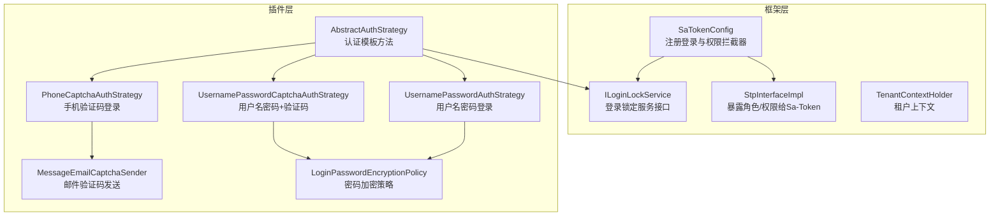
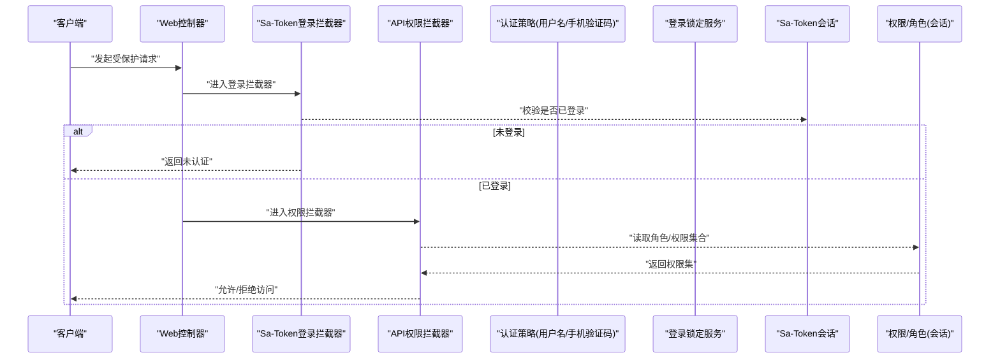
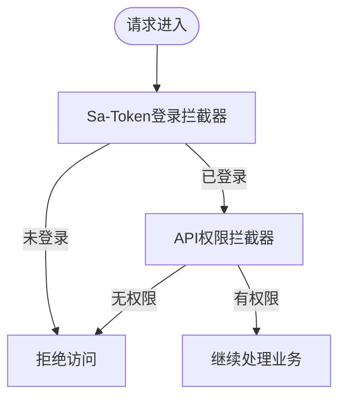
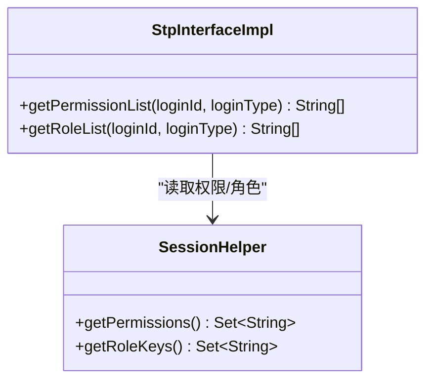
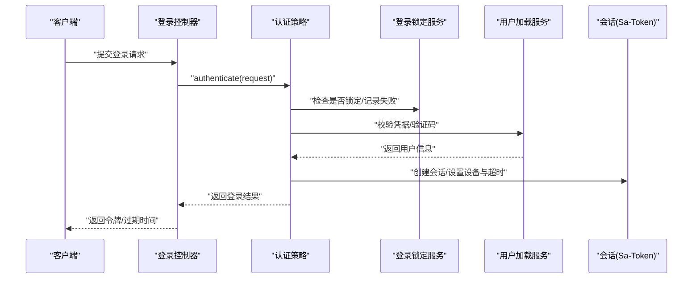
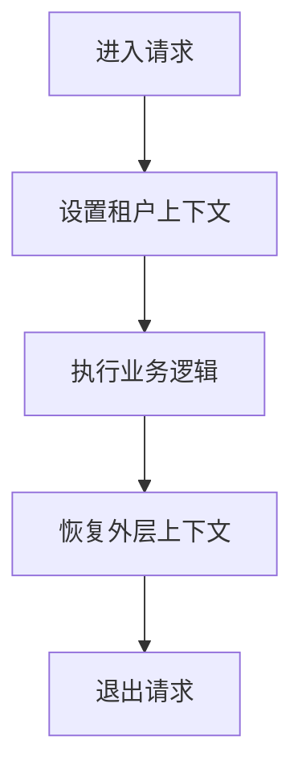
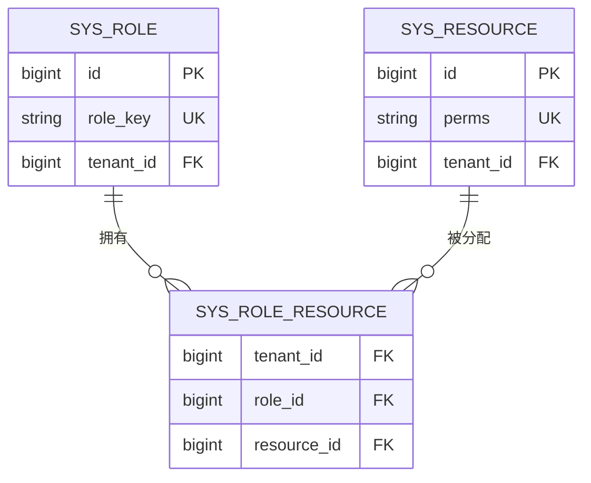
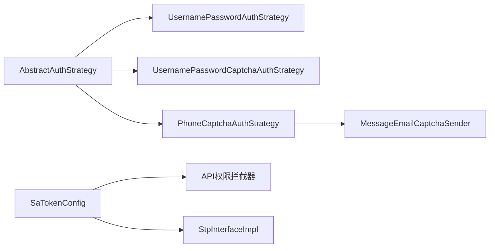

# 认证授权机制

<cite>
**本文引用的文件**
- [SaTokenConfig.java](file://forge-server/forge-framework/forge-starter-parent/forge-starter-auth/src/main/java/com/mdframe/forge/starter/auth/config/SaTokenConfig.java)
- [StpInterfaceImpl.java](file://forge-server/forge-framework/forge-starter-parent/forge-starter-auth/src/main/java/com/mdframe/forge/starter/auth/config/StpInterfaceImpl.java)
- [AbstractAuthStrategy.java](file://forge-server/forge-framework/forge-plugin-parent/forge-plugin-system/src/main/java/com/mdframe/forge/plugin/system/strategy/AbstractAuthStrategy.java)
- [PhoneCaptchaAuthStrategy.java](file://forge-server/forge-framework/forge-plugin-parent/forge-plugin-system/src/main/java/com/mdframe/forge/plugin/system/strategy/PhoneCaptchaAuthStrategy.java)
- [UsernamePasswordAuthStrategy.java](file://forge-server/forge-framework/forge-plugin-parent/forge-plugin-system/src/main/java/com/mdframe/forge/plugin/system/strategy/UsernamePasswordAuthStrategy.java)
- [UsernamePasswordCaptchaAuthStrategy.java](file://forge-server/forge-framework/forge-plugin-parent/forge-plugin-system/src/main/java/com/mdframe/forge/plugin/system/strategy/UsernamePasswordCaptchaAuthStrategy.java)
- [ILoginLockService.java](file://forge-server/forge-framework/forge-starter-parent/forge-starter-auth/src/main/java/com/mdframe/forge/starter/auth/service/ILoginLockService.java)
- [TenantContextHolder.java](file://forge-server/forge-framework/forge-starter-parent/forge-starter-tenant/src/main/java/com/mdframe/forge/starter/tenant/context/TenantContextHolder.java)
- [McpExecutionContextLifecycle.java](file://forge-server/forge-framework/forge-plugin-parent/forge-plugin-capability-parent/forge-plugin-capability-platform/src/main/java/com/mdframe/forge/plugin/capability/identity/mcp/McpExecutionContextLifecycle.java)
- [LoginPasswordEncryptionPolicy.java](file://forge-server/forge-framework/forge-plugin-parent/forge-plugin-system/src/main/java/com/mdframe/forge/plugin/system/auth/LoginPasswordEncryptionPolicy.java)
- [MessageEmailCaptchaSender.java](file://forge-server/forge-framework/forge-plugin-parent/forge-plugin-system/src/main/java/com/mdframe/forge/plugin/system/auth/MessageEmailCaptchaSender.java)
- [V1.0.85__add_business_process_start_permission.sql](file://forge-server/db/migration/V1.0.85__add_business_process_start_permission.sql)
</cite>

## 目录
1. [简介](#简介)
2. [项目结构](#项目结构)
3. [核心组件](#核心组件)
4. [架构总览](#架构总览)
5. [详细组件分析](#详细组件分析)
6. [依赖关系分析](#依赖关系分析)
7. [性能考虑](#性能考虑)
8. [故障排查指南](#故障排查指南)
9. [结论](#结论)
10. [附录](#附录)

## 简介
本技术文档围绕 Forge Admin 的认证与授权机制展开，重点说明 Sa-Token 集成配置、登录流程与会话管理、RBAC 权限模型、多租户隔离、多种认证方式（用户名密码、短信验证码、邮箱验证码、SSO）、拦截器与 API 权限校验、登录锁定策略、密码安全存储与会话安全管理等。文档面向不同技术背景的读者，提供从高层架构到代码级实现的渐进式说明，并辅以流程图与时序图帮助理解。

## 项目结构
本项目将认证与授权能力拆分为“框架层”和“插件层”：
- 框架层（starter）：提供 Sa-Token 配置、API 权限拦截器、登录锁定服务接口、租户上下文等通用能力。
- 插件层（plugin-system）：实现具体认证策略（用户名密码、手机验证码、带验证码的用户名密码）、消息通道（邮件验证码发送）、密码加密策略等。
- 数据迁移脚本：维护资源与角色权限基线数据。

图表来源
- [SaTokenConfig.java:29-100](file://forge-server/forge-framework/forge-starter-parent/forge-starter-auth/src/main/java/com/mdframe/forge/starter/auth/config/SaTokenConfig.java#L29-L100)
- [StpInterfaceImpl.java:20-33](file://forge-server/forge-framework/forge-starter-parent/forge-starter-auth/src/main/java/com/mdframe/forge/starter/auth/config/StpInterfaceImpl.java#L20-L33)
- [AbstractAuthStrategy.java:39-54](file://forge-server/forge-framework/forge-plugin-parent/forge-plugin-system/src/main/java/com/mdframe/forge/plugin/system/strategy/AbstractAuthStrategy.java#L39-L54)
- [PhoneCaptchaAuthStrategy.java:17-46](file://forge-server/forge-framework/forge-plugin-parent/forge-plugin-system/src/main/java/com/mdframe/forge/plugin/system/strategy/PhoneCaptchaAuthStrategy.java#L17-L46)
- [MessageEmailCaptchaSender.java:22-49](file://forge-server/forge-framework/forge-plugin-parent/forge-plugin-system/src/main/java/com/mdframe/forge/plugin/system/auth/MessageEmailCaptchaSender.java#L22-L49)
- [LoginPasswordEncryptionPolicy.java:24-33](file://forge-server/forge-framework/forge-plugin-parent/forge-plugin-system/src/main/java/com/mdframe/forge/plugin/system/auth/LoginPasswordEncryptionPolicy.java#L24-L33)

章节来源
- [SaTokenConfig.java:29-100](file://forge-server/forge-framework/forge-starter-parent/forge-starter-auth/src/main/java/com/mdframe/forge/starter/auth/config/SaTokenConfig.java#L29-L100)
- [StpInterfaceImpl.java:20-33](file://forge-server/forge-framework/forge-starter-parent/forge-starter-auth/src/main/java/com/mdframe/forge/starter/auth/config/StpInterfaceImpl.java#L20-L33)
- [AbstractAuthStrategy.java:39-54](file://forge-server/forge-framework/forge-plugin-parent/forge-plugin-system/src/main/java/com/mdframe/forge/plugin/system/strategy/AbstractAuthStrategy.java#L39-L54)

## 核心组件
- Sa-Token 配置与拦截器：统一注册登录校验与 API 权限校验，定义白名单路径，确保敏感接口受保护。
- 自定义权限接口：将会话中的角色与权限暴露给 Sa-Token，支持注解或表达式级别的鉴权。
- 认证策略抽象：封装账号锁定检查、用户状态校验、失败计数与成功清理等通用逻辑。
- 具体认证策略：用户名密码、用户名密码+验证码、手机验证码等。
- 登录锁定服务：记录失败次数、判断锁定、解锁与剩余时间查询。
- 租户上下文：基于 TransmittableThreadLocal 的租户隔离，支持忽略标记与嵌套恢复。
- 密码加密策略：根据配置决定是否启用前端 RSA 加密传输。
- 验证码通道：邮件验证码发送，封装消息通道调用。

章节来源
- [SaTokenConfig.java:29-100](file://forge-server/forge-framework/forge-starter-parent/forge-starter-auth/src/main/java/com/mdframe/forge/starter/auth/config/SaTokenConfig.java#L29-L100)
- [StpInterfaceImpl.java:20-33](file://forge-server/forge-framework/forge-starter-parent/forge-starter-auth/src/main/java/com/mdframe/forge/starter/auth/config/StpInterfaceImpl.java#L20-L33)
- [AbstractAuthStrategy.java:71-139](file://forge-server/forge-framework/forge-plugin-parent/forge-plugin-system/src/main/java/com/mdframe/forge/plugin/system/strategy/AbstractAuthStrategy.java#L71-L139)
- [ILoginLockService.java:9-48](file://forge-server/forge-framework/forge-starter-parent/forge-starter-auth/src/main/java/com/mdframe/forge/starter/auth/service/ILoginLockService.java#L9-L48)
- [TenantContextHolder.java:22-161](file://forge-server/forge-framework/forge-starter-parent/forge-starter-tenant/src/main/java/com/mdframe/forge/starter/tenant/context/TenantContextHolder.java#L22-L161)
- [LoginPasswordEncryptionPolicy.java:24-33](file://forge-server/forge-framework/forge-plugin-parent/forge-plugin-system/src/main/java/com/mdframe/forge/plugin/system/auth/LoginPasswordEncryptionPolicy.java#L24-L33)
- [MessageEmailCaptchaSender.java:22-49](file://forge-server/forge-framework/forge-plugin-parent/forge-plugin-system/src/main/java/com/mdframe/forge/plugin/system/auth/MessageEmailCaptchaSender.java#L22-L49)

## 架构总览
下图展示了请求进入后的认证与授权链路：先由 Sa-Token 登录拦截器进行身份校验，再由 API 权限拦截器进行资源级权限校验；认证过程通过策略模式选择具体登录方式；权限信息来自会话，由 StpInterfaceImpl 暴露给 Sa-Token。

图表来源
- [SaTokenConfig.java:29-100](file://forge-server/forge-framework/forge-starter-parent/forge-starter-auth/src/main/java/com/mdframe/forge/starter/auth/config/SaTokenConfig.java#L29-L100)
- [StpInterfaceImpl.java:20-33](file://forge-server/forge-framework/forge-starter-parent/forge-starter-auth/src/main/java/com/mdframe/forge/starter/auth/config/StpInterfaceImpl.java#L20-L33)

章节来源
- [SaTokenConfig.java:29-100](file://forge-server/forge-framework/forge-starter-parent/forge-starter-auth/src/main/java/com/mdframe/forge/starter/auth/config/SaTokenConfig.java#L29-L100)
- [StpInterfaceImpl.java:20-33](file://forge-server/forge-framework/forge-starter-parent/forge-starter-auth/src/main/java/com/mdframe/forge/starter/auth/config/StpInterfaceImpl.java#L20-L33)

## 详细组件分析

### Sa-Token 集成与拦截器配置
- 登录拦截器：对全局路由执行登录校验，排除登录、登出、验证码、静态资源、健康检查、OAuth/MCP/开放网关等特定路径。
- 权限拦截器：在登录校验之后执行，基于数据库资源表配置进行 API 级权限控制，同样排除公共与安全协商路径。
- 白名单设计：保证登录流程、密钥交换、OAuth元数据、MCP专用认证链不受通用拦截器干扰。

图表来源
- [SaTokenConfig.java:29-100](file://forge-server/forge-framework/forge-starter-parent/forge-starter-auth/src/main/java/com/mdframe/forge/starter/auth/config/SaTokenConfig.java#L29-L100)

章节来源
- [SaTokenConfig.java:29-100](file://forge-server/forge-framework/forge-starter-parent/forge-starter-auth/src/main/java/com/mdframe/forge/starter/auth/config/SaTokenConfig.java#L29-L100)

### 自定义权限接口（RBAC 对接）
- 通过实现 StpInterface，将当前会话中的角色键与权限码暴露给 Sa-Token，从而支持注解鉴权与表达式鉴权。
- 权限来源于会话，建议在登录后加载完整权限集并写入会话，避免每次请求重复计算。

图表来源
- [StpInterfaceImpl.java:20-33](file://forge-server/forge-framework/forge-starter-parent/forge-starter-auth/src/main/java/com/mdframe/forge/starter/auth/config/StpInterfaceImpl.java#L20-L33)

章节来源
- [StpInterfaceImpl.java:20-33](file://forge-server/forge-framework/forge-starter-parent/forge-starter-auth/src/main/java/com/mdframe/forge/starter/auth/config/StpInterfaceImpl.java#L20-L33)

### 认证策略与登录流程
- 抽象策略：定义 authenticate 模板方法，包含参数校验、具体认证、用户状态检查、成功处理与失败记录。
- 用户名密码登录：验证用户名与密码，必要时结合验证码；支持登录锁定与失败计数。
- 手机验证码登录：校验手机号与验证码，按租户加载用户。
- 用户名密码+验证码：在用户名密码基础上增加验证码校验。
- 登录锁定：通过 ILoginLockService 记录失败、判断锁定、获取剩余时间、成功后清除失败记录。

图表来源
- [AbstractAuthStrategy.java:39-54](file://forge-server/forge-framework/forge-plugin-parent/forge-plugin-system/src/main/java/com/mdframe/forge/plugin/system/strategy/AbstractAuthStrategy.java#L39-L54)
- [AbstractAuthStrategy.java:71-139](file://forge-server/forge-framework/forge-plugin-parent/forge-plugin-system/src/main/java/com/mdframe/forge/plugin/system/strategy/AbstractAuthStrategy.java#L71-L139)
- [PhoneCaptchaAuthStrategy.java:17-46](file://forge-server/forge-framework/forge-plugin-parent/forge-plugin-system/src/main/java/com/mdframe/forge/plugin/system/strategy/PhoneCaptchaAuthStrategy.java#L17-L46)
- [ILoginLockService.java:9-48](file://forge-server/forge-framework/forge-starter-parent/forge-starter-auth/src/main/java/com/mdframe/forge/starter/auth/service/ILoginLockService.java#L9-L48)

章节来源
- [AbstractAuthStrategy.java:39-54](file://forge-server/forge-framework/forge-plugin-parent/forge-plugin-system/src/main/java/com/mdframe/forge/plugin/system/strategy/AbstractAuthStrategy.java#L39-L54)
- [AbstractAuthStrategy.java:71-139](file://forge-server/forge-framework/forge-plugin-parent/forge-plugin-system/src/main/java/com/mdframe/forge/plugin/system/strategy/AbstractAuthStrategy.java#L71-L139)
- [PhoneCaptchaAuthStrategy.java:17-46](file://forge-server/forge-framework/forge-plugin-parent/forge-plugin-system/src/main/java/com/mdframe/forge/plugin/system/strategy/PhoneCaptchaAuthStrategy.java#L17-L46)
- [ILoginLockService.java:9-48](file://forge-server/forge-framework/forge-starter-parent/forge-starter-auth/src/main/java/com/mdframe/forge/starter/auth/service/ILoginLockService.java#L9-L48)

### 多租户认证隔离
- 租户上下文：使用 TransmittableThreadLocal 保存租户ID与忽略标记，支持异步线程传递与嵌套恢复。
- 执行上下文生命周期：在能力平台中，打开请求上下文时设置租户与执行身份，并在关闭时恢复外层上下文，确保跨线程与跨组件的隔离正确性。
- 建议：在登录成功后将租户ID写入会话，并在后续请求中通过拦截器或上下文解析注入。

图表来源
- [TenantContextHolder.java:22-161](file://forge-server/forge-framework/forge-starter-parent/forge-starter-tenant/src/main/java/com/mdframe/forge/starter/tenant/context/TenantContextHolder.java#L22-L161)
- [McpExecutionContextLifecycle.java:53-92](file://forge-server/forge-framework/forge-plugin-parent/forge-plugin-capability-parent/forge-plugin-capability-platform/src/main/java/com/mdframe/forge/plugin/capability/identity/mcp/McpExecutionContextLifecycle.java#L53-L92)

章节来源
- [TenantContextHolder.java:22-161](file://forge-server/forge-framework/forge-starter-parent/forge-starter-tenant/src/main/java/com/mdframe/forge/starter/tenant/context/TenantContextHolder.java#L22-L161)
- [McpExecutionContextLifecycle.java:53-92](file://forge-server/forge-framework/forge-plugin-parent/forge-plugin-capability-parent/forge-plugin-capability-platform/src/main/java/com/mdframe/forge/plugin/capability/identity/mcp/McpExecutionContextLifecycle.java#L53-L92)

### 多种认证方式支持
- 用户名密码登录：适用于传统账号体系，可结合验证码增强安全性。
- 手机验证码登录：通过手机号与验证码完成认证，适合移动端与快速登录场景。
- 邮箱验证码登录：通过邮件通道发送验证码，用于重置密码或邮箱绑定场景。
- SSO 单点登录：通过 /auth/sso/exchange 票据交换接口完成外部系统身份互通，该路径被登录拦截器排除，由专用认证链处理。

章节来源
- [UsernamePasswordAuthStrategy.java](file://forge-server/forge-framework/forge-plugin-parent/forge-plugin-system/src/main/java/com/mdframe/forge/plugin/system/strategy/UsernamePasswordAuthStrategy.java)
- [UsernamePasswordCaptchaAuthStrategy.java](file://forge-server/forge-framework/forge-plugin-parent/forge-plugin-system/src/main/java/com/mdframe/forge/plugin/system/strategy/UsernamePasswordCaptchaAuthStrategy.java)
- [PhoneCaptchaAuthStrategy.java:17-46](file://forge-server/forge-framework/forge-plugin-parent/forge-plugin-system/src/main/java/com/mdframe/forge/plugin/system/strategy/PhoneCaptchaAuthStrategy.java#L17-L46)
- [MessageEmailCaptchaSender.java:22-49](file://forge-server/forge-framework/forge-plugin-parent/forge-plugin-system/src/main/java/com/mdframe/forge/plugin/system/auth/MessageEmailCaptchaSender.java#L22-L49)
- [SaTokenConfig.java:39-67](file://forge-server/forge-framework/forge-starter-parent/forge-starter-auth/src/main/java/com/mdframe/forge/starter/auth/config/SaTokenConfig.java#L39-L67)

### API 权限验证与 RBAC 模型
- 资源与角色：通过数据库资源表与角色资源关联实现动态权限控制；迁移脚本为业务流程启动动作注册通用权限，并同步至管理员角色。
- 权限校验：API 权限拦截器基于资源 perms 字段进行匹配，结合会话中的权限集合判定访问是否允许。
- 扩展点：可通过新增资源与角色绑定实现细粒度控制，如模块级数据范围、按钮级权限等。

图表来源
- [V1.0.85__add_business_process_start_permission.sql:4-55](file://forge-server/db/migration/V1.0.85__add_business_process_start_permission.sql#L4-L55)

章节来源
- [V1.0.85__add_business_process_start_permission.sql:4-55](file://forge-server/db/migration/V1.0.85__add_business_process_start_permission.sql#L4-L55)
- [SaTokenConfig.java:81-100](file://forge-server/forge-framework/forge-starter-parent/forge-starter-auth/src/main/java/com/mdframe/forge/starter/auth/config/SaTokenConfig.java#L81-L100)

### 登录锁定策略与会话安全管理
- 登录锁定：通过 ILoginLockService 记录失败次数，达到阈值后锁定账号并提示剩余时间；成功后清除失败记录。
- 会话管理：Sa-Token 负责 Token 的生成、刷新与失效；可在登录后设置设备类型与超时时间，支持并发登录策略（由上层策略决定）。
- 安全建议：开启密码加密传输、限制验证码有效期、对敏感接口启用二次校验。

章节来源
- [ILoginLockService.java:9-48](file://forge-server/forge-framework/forge-starter-parent/forge-starter-auth/src/main/java/com/mdframe/forge/starter/auth/service/ILoginLockService.java#L9-L48)
- [AbstractAuthStrategy.java:71-139](file://forge-server/forge-framework/forge-plugin-parent/forge-plugin-system/src/main/java/com/mdframe/forge/plugin/system/strategy/AbstractAuthStrategy.java#L71-L139)
- [SaTokenConfig.java:29-100](file://forge-server/forge-framework/forge-starter-parent/forge-starter-auth/src/main/java/com/mdframe/forge/starter/auth/config/SaTokenConfig.java#L29-L100)

### 密码安全存储与传输
- 传输加密：LoginPasswordEncryptionPolicy 根据配置决定是否启用前端 RSA 加密传输，默认启用以保证安全。
- 存储安全：后端应使用强哈希算法存储密码（如 BCrypt），并结合盐值与迭代次数提升抗暴力破解能力。
- 最佳实践：禁用明文日志输出、限制重试次数、启用账户锁定与验证码。

章节来源
- [LoginPasswordEncryptionPolicy.java:24-33](file://forge-server/forge-framework/forge-plugin-parent/forge-plugin-system/src/main/java/com/mdframe/forge/plugin/system/auth/LoginPasswordEncryptionPolicy.java#L24-L33)

## 依赖关系分析
- 低耦合高内聚：认证策略通过抽象基类复用通用逻辑，具体策略仅关注自身校验规则。
- 横向扩展：新增认证方式只需实现 IAuthStrategy 并注册，无需修改已有流程。
- 上下文隔离：租户上下文与执行身份在请求边界内生效，避免跨请求污染。

图表来源
- [AbstractAuthStrategy.java:39-54](file://forge-server/forge-framework/forge-plugin-parent/forge-plugin-system/src/main/java/com/mdframe/forge/plugin/system/strategy/AbstractAuthStrategy.java#L39-L54)
- [PhoneCaptchaAuthStrategy.java:17-46](file://forge-server/forge-framework/forge-plugin-parent/forge-plugin-system/src/main/java/com/mdframe/forge/plugin/system/strategy/PhoneCaptchaAuthStrategy.java#L17-L46)
- [MessageEmailCaptchaSender.java:22-49](file://forge-server/forge-framework/forge-plugin-parent/forge-plugin-system/src/main/java/com/mdframe/forge/plugin/system/auth/MessageEmailCaptchaSender.java#L22-L49)
- [SaTokenConfig.java:29-100](file://forge-server/forge-framework/forge-starter-parent/forge-starter-auth/src/main/java/com/mdframe/forge/starter/auth/config/SaTokenConfig.java#L29-L100)
- [StpInterfaceImpl.java:20-33](file://forge-server/forge-framework/forge-starter-parent/forge-starter-auth/src/main/java/com/mdframe/forge/starter/auth/config/StpInterfaceImpl.java#L20-L33)

章节来源
- [AbstractAuthStrategy.java:39-54](file://forge-server/forge-framework/forge-plugin-parent/forge-plugin-system/src/main/java/com/mdframe/forge/plugin/system/strategy/AbstractAuthStrategy.java#L39-L54)
- [SaTokenConfig.java:29-100](file://forge-server/forge-framework/forge-starter-parent/forge-starter-auth/src/main/java/com/mdframe/forge/starter/auth/config/SaTokenConfig.java#L29-L100)

## 性能考虑
- 缓存权限与角色：将用户权限与角色集合缓存至会话或本地缓存，减少重复查询。
- 验证码与锁定：合理设置验证码有效期与锁定时间，避免频繁 IO 与锁竞争。
- 异步与线程池：租户上下文使用 TransmittableThreadLocal 支持异步传递，注意在任务装饰器中保持上下文一致性。
- 白名单优化：尽可能缩小需要鉴权的接口范围，降低拦截器开销。

[本节为通用指导，不直接分析具体文件]

## 故障排查指南
- 登录失败频繁导致锁定：检查 ILoginLockService 的失败记录与锁定时间，确认是否误判或存在暴力攻击。
- 权限不足：核对资源 perms 与角色资源绑定是否正确，确认会话中权限集合是否加载完整。
- 验证码发送失败：检查 MessageEmailCaptchaSender 的消息通道配置与异常处理。
- 租户上下文错乱：确认 TenantContextHolder 的设置与恢复逻辑，避免嵌套场景下覆盖外层上下文。

章节来源
- [ILoginLockService.java:9-48](file://forge-server/forge-framework/forge-starter-parent/forge-starter-auth/src/main/java/com/mdframe/forge/starter/auth/service/ILoginLockService.java#L9-L48)
- [MessageEmailCaptchaSender.java:22-49](file://forge-server/forge-framework/forge-plugin-parent/forge-plugin-system/src/main/java/com/mdframe/forge/plugin/system/auth/MessageEmailCaptchaSender.java#L22-L49)
- [TenantContextHolder.java:22-161](file://forge-server/forge-framework/forge-starter-parent/forge-starter-tenant/src/main/java/com/mdframe/forge/starter/tenant/context/TenantContextHolder.java#L22-L161)

## 结论
Forge Admin 的认证与授权体系以 Sa-Token 为核心，结合策略模式与拦截器实现了可扩展、可配置的登录与鉴权流程。通过 RBAC 资源模型与租户上下文隔离，满足多租户与细粒度权限控制需求。配合登录锁定、密码加密与验证码通道，整体具备较高的安全性与可维护性。建议在生产环境中持续完善白名单策略、缓存策略与监控告警，保障系统稳定与安全。

[本节为总结，不直接分析具体文件]

## 附录
- 相关迁移脚本：业务流程启动权限注册与角色同步。
- 前端配置项：Sa-Token 超时、活动超时、并发登录等（参考前端配置页面）。

章节来源
- [V1.0.85__add_business_process_start_permission.sql:4-55](file://forge-server/db/migration/V1.0.85__add_business_process_start_permission.sql#L4-L55)