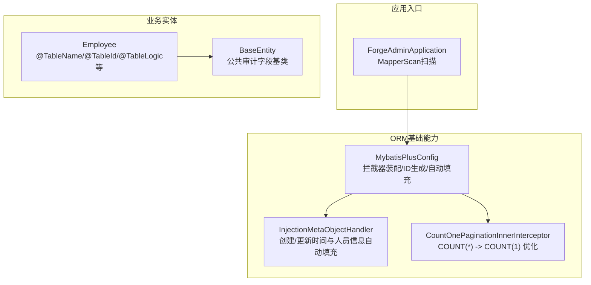
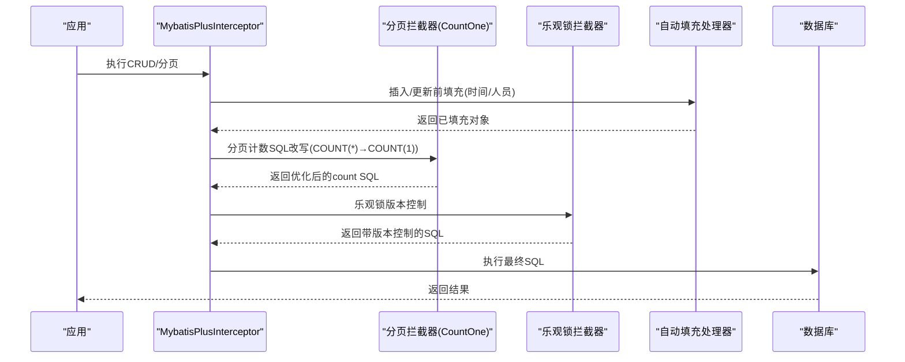
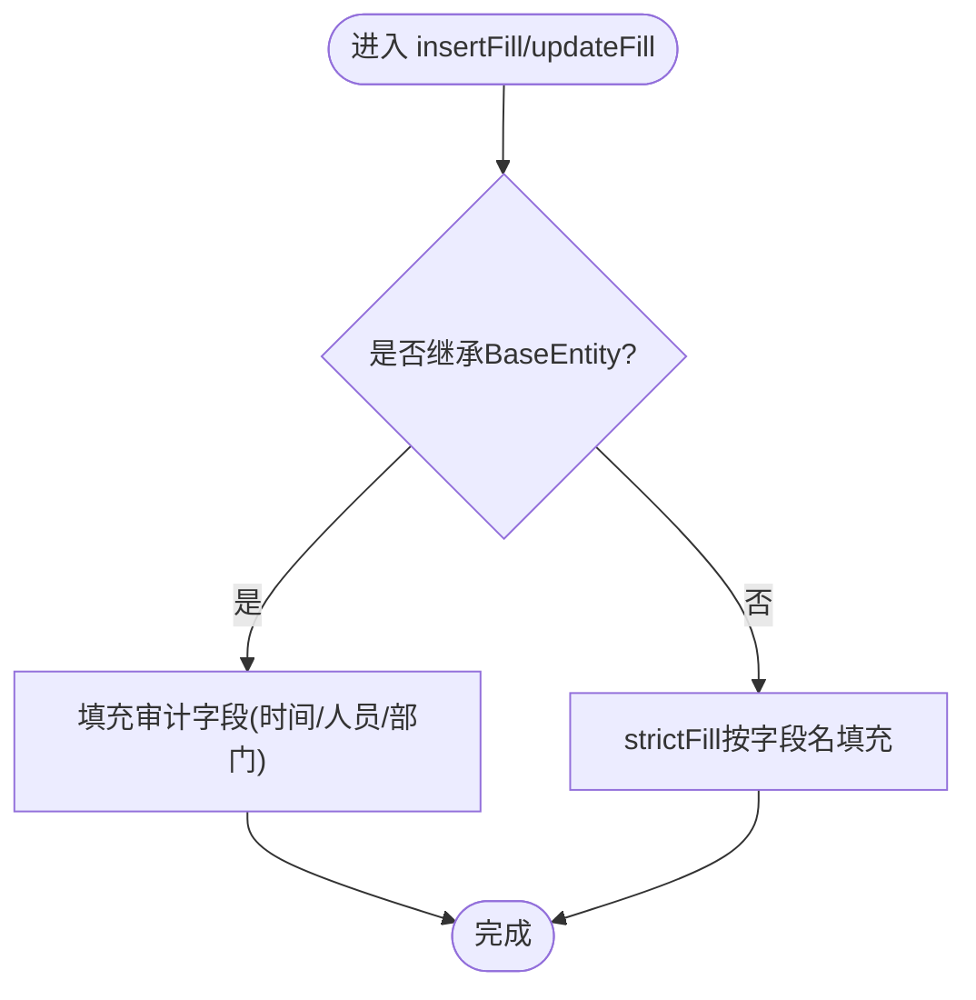
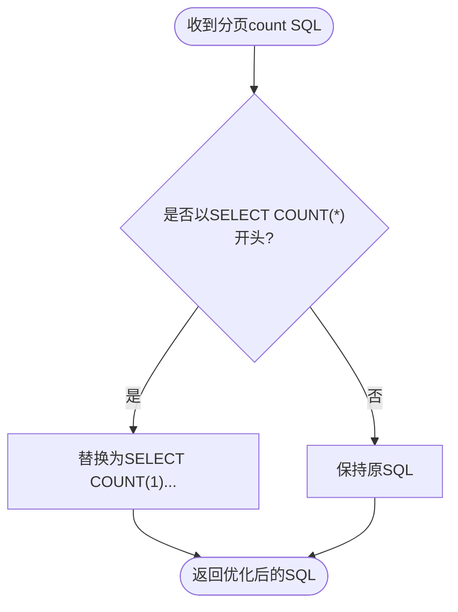
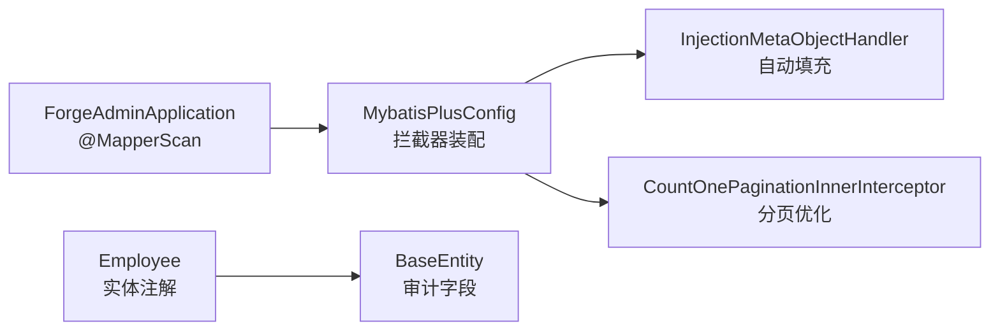

# ORM框架集成

<cite>
**本文引用的文件**
- [MybatisPlusConfig.java](file://forge-server/forge-framework/forge-starter-parent/forge-starter-orm/src/main/java/com/mdframe/forge/starter/orm/config/MybatisPlusConfig.java)
- [InjectionMetaObjectHandler.java](file://forge-server/forge-framework/forge-starter-parent/forge-starter-orm/src/main/java/com/mdframe/forge/starter/orm/handler/InjectionMetaObjectHandler.java)
- [CountOnePaginationInnerInterceptor.java](file://forge-server/forge-framework/forge-starter-parent/forge-starter-orm/src/main/java/com/mdframe/forge/starter/orm/interceptor/CountOnePaginationInnerInterceptor.java)
- [Employee.java](file://forge-server/forge-admin-server/src/main/java/com/mdframe/forge/employee/entity/Employee.java)
- [BaseEntity.java](file://forge-server/forge-framework/forge-starter-parent/forge-starter-core/src/main/java/com/mdframe/forge/starter/core/domain/BaseEntity.java)
- [ForgeAdminApplication.java](file://forge-server/forge-admin-server/src/main/java/com/mdframe/forge/admin/ForgeAdminApplication.java)
</cite>

## 目录
1. [简介](#简介)
2. [项目结构](#项目结构)
3. [核心组件](#核心组件)
4. [架构总览](#架构总览)
5. [详细组件分析](#详细组件分析)
6. [依赖关系分析](#依赖关系分析)
7. [性能考虑](#性能考虑)
8. [故障排查指南](#故障排查指南)
9. [结论](#结论)
10. [附录](#附录)

## 简介
本技术文档聚焦于 Forge Admin 项目中 MyBatis-Plus 的集成与最佳实践，涵盖实体映射配置、自动填充处理器、分页插件配置与优化策略，以及基于项目的实体类设计规范与常见 CRUD/复杂查询方法。通过解析核心配置与拦截器实现，帮助开发者在统一规范下高效、稳定地进行数据访问层开发。

## 项目结构
本项目采用模块化组织，ORM 相关能力集中在 starter-orm 模块中，提供统一的 MyBatis-Plus 初始化、拦截器装配、自动填充与分页优化；业务实体位于各业务模块（如 admin-server），并通过注解完成表与字段映射。

图表来源
- [MybatisPlusConfig.java:28-90](file://forge-server/forge-framework/forge-starter-parent/forge-starter-orm/src/main/java/com/mdframe/forge/starter/orm/config/MybatisPlusConfig.java#L28-L90)
- [InjectionMetaObjectHandler.java:19-101](file://forge-server/forge-framework/forge-starter-parent/forge-starter-orm/src/main/java/com/mdframe/forge/starter/orm/handler/InjectionMetaObjectHandler.java#L19-L101)
- [CountOnePaginationInnerInterceptor.java:14-31](file://forge-server/forge-framework/forge-starter-parent/forge-starter-orm/src/main/java/com/mdframe/forge/starter/orm/interceptor/CountOnePaginationInnerInterceptor.java#L14-L31)
- [Employee.java:20-100](file://forge-server/forge-admin-server/src/main/java/com/mdframe/forge/employee/entity/Employee.java#L20-L100)
- [BaseEntity.java](file://forge-server/forge-framework/forge-starter-parent/forge-starter-core/src/main/java/com/mdframe/forge/starter/core/domain/BaseEntity.java)
- [ForgeAdminApplication.java:9](file://forge-server/forge-admin-server/src/main/java/com/mdframe/forge/admin/ForgeAdminApplication.java#L9)

章节来源
- [MybatisPlusConfig.java:28-90](file://forge-server/forge-framework/forge-starter-parent/forge-starter-orm/src/main/java/com/mdframe/forge/starter/orm/config/MybatisPlusConfig.java#L28-L90)
- [ForgeAdminApplication.java:9](file://forge-server/forge-admin-server/src/main/java/com/mdframe/forge/admin/ForgeAdminApplication.java#L9)

## 核心组件
- MyBatis-Plus 拦截器装配：集中注册自定义拦截器、分页插件、乐观锁插件，并启用事务管理。
- 自动填充处理器：在插入/更新时自动填充时间戳与操作人信息，兼容 BaseEntity 与非 BaseEntity 场景。
- 分页优化拦截器：将默认 COUNT(*) 改写为 COUNT(1)，提升复杂嵌套条件下的解析稳定性与性能。
- 实体映射规范：使用 @TableName、@TableId、@TableField、@TableLogic 等注解进行表/字段映射与逻辑删除。
- Mapper 扫描：通过启动类上的 @MapperScan 指定 mapper 包路径，使 Spring 能发现所有 Mapper 接口。

章节来源
- [MybatisPlusConfig.java:28-90](file://forge-server/forge-framework/forge-starter-parent/forge-starter-orm/src/main/java/com/mdframe/forge/starter/orm/config/MybatisPlusConfig.java#L28-L90)
- [InjectionMetaObjectHandler.java:19-101](file://forge-server/forge-framework/forge-starter-parent/forge-starter-orm/src/main/java/com/mdframe/forge/starter/orm/handler/InjectionMetaObjectHandler.java#L19-L101)
- [CountOnePaginationInnerInterceptor.java:14-31](file://forge-server/forge-framework/forge-starter-parent/forge-starter-orm/src/main/java/com/mdframe/forge/starter/orm/interceptor/CountOnePaginationInnerInterceptor.java#L14-L31)
- [Employee.java:20-100](file://forge-server/forge-admin-server/src/main/java/com/mdframe/forge/employee/entity/Employee.java#L20-L100)
- [ForgeAdminApplication.java:9](file://forge-server/forge-admin-server/src/main/java/com/mdframe/forge/admin/ForgeAdminApplication.java#L9)

## 架构总览
下图展示了从请求进入后，MyBatis-Plus 拦截链的执行顺序与关键处理点：

图表来源
- [MybatisPlusConfig.java:38-76](file://forge-server/forge-framework/forge-starter-parent/forge-starter-orm/src/main/java/com/mdframe/forge/starter/orm/config/MybatisPlusConfig.java#L38-L76)
- [CountOnePaginationInnerInterceptor.java:16-31](file://forge-server/forge-framework/forge-starter-parent/forge-starter-orm/src/main/java/com/mdframe/forge/starter/orm/interceptor/CountOnePaginationInnerInterceptor.java#L16-L31)
- [InjectionMetaObjectHandler.java:26-85](file://forge-server/forge-framework/forge-starter-parent/forge-starter-orm/src/main/java/com/mdframe/forge/starter/orm/handler/InjectionMetaObjectHandler.java#L26-L85)

## 详细组件分析

### MyBatis-Plus 配置与拦截器装配
- 功能要点
  - 启用事务管理与 Mapper 扫描路径。
  - 动态注入其他模块提供的 InnerInterceptor，并按优先级注册。
  - 注册分页插件与乐观锁插件。
  - 配置雪花 ID 生成器，结合网卡信息避免集群重复。
  - 注册自动填充处理器 MetaObjectHandler。
- 设计考量
  - 通过 InitializingBean 与 Bean 装配保证拦截器顺序可控。
  - 对自定义拦截器的检测与日志输出便于排障。

章节来源
- [MybatisPlusConfig.java:28-90](file://forge-server/forge-framework/forge-starter-parent/forge-starter-orm/src/main/java/com/mdframe/forge/starter/orm/config/MybatisPlusConfig.java#L28-L90)

### 自动填充处理器 InjectionMetaObjectHandler
- 工作原理
  - 插入阶段：填充 createTime、updateTime；若未显式设置 createBy/updateBy/createDept，则从当前登录用户上下文获取并填充。
  - 更新阶段：强制刷新 updateTime，并尝试填充 updateBy。
  - 兼容非 BaseEntity：当对象不是 BaseEntity 时，回退到 strictInsertFill/strictUpdateFill 按字段名填充。
- 使用场景
  - 统一审计字段维护，减少样板代码。
  - 多租户/部门隔离场景下，自动带入创建部门。
- 异常处理
  - 捕获异常并抛出业务异常，便于上层统一处理。

图表来源
- [InjectionMetaObjectHandler.java:26-85](file://forge-server/forge-framework/forge-starter-parent/forge-starter-orm/src/main/java/com/mdframe/forge/starter/orm/handler/InjectionMetaObjectHandler.java#L26-L85)

章节来源
- [InjectionMetaObjectHandler.java:19-101](file://forge-server/forge-framework/forge-starter-parent/forge-starter-orm/src/main/java/com/mdframe/forge/starter/orm/handler/InjectionMetaObjectHandler.java#L19-L101)

### 分页优化 CountOnePaginationInnerInterceptor
- 作用机制
  - 重写 autoCountSql，将默认的 SELECT COUNT(*) 改写为 SELECT COUNT(1)。
  - 解决深层嵌套条件下 JSqlParser 解析失败的问题，同时保持语义一致。
- 优化收益
  - 提升复杂查询的分页 count 解析稳定性。
  - 在某些数据库/驱动上 COUNT(1) 具备更优或等效的性能表现。

图表来源
- [CountOnePaginationInnerInterceptor.java:16-31](file://forge-server/forge-framework/forge-starter-parent/forge-starter-orm/src/main/java/com/mdframe/forge/starter/orm/interceptor/CountOnePaginationInnerInterceptor.java#L16-L31)

章节来源
- [CountOnePaginationInnerInterceptor.java:14-31](file://forge-server/forge-framework/forge-starter-parent/forge-starter-orm/src/main/java/com/mdframe/forge/starter/orm/interceptor/CountOnePaginationInnerInterceptor.java#L14-L31)

### 实体类设计规范与注解使用
- 表与主键
  - 使用 @TableName 指定表名。
  - 使用 @TableId(value = "...", type = IdType.AUTO) 指定自增主键。
- 字段映射与计算列
  - 使用 @TableField(exist = false) 标记非持久化字段（如展示名称）。
- 逻辑删除
  - 使用 @TableLogic(value = "0", delval = "id") 实现软删除。
- 脱敏与翻译
  - 使用脱敏注解对敏感字段进行输出脱敏。
  - 使用翻译注解配合字典类型进行值转换。
- 基类约定
  - 继承 BaseEntity 以获得统一的审计字段（由自动填充处理器维护）。

示例参考
- [Employee.java:20-100](file://forge-server/forge-admin-server/src/main/java/com/mdframe/forge/employee/entity/Employee.java#L20-L100)
- [BaseEntity.java](file://forge-server/forge-framework/forge-starter-parent/forge-starter-core/src/main/java/com/mdframe/forge/starter/core/domain/BaseEntity.java)

章节来源
- [Employee.java:20-100](file://forge-server/forge-admin-server/src/main/java/com/mdframe/forge/employee/entity/Employee.java#L20-L100)
- [BaseEntity.java](file://forge-server/forge-framework/forge-starter-parent/forge-starter-core/src/main/java/com/mdframe/forge/starter/core/domain/BaseEntity.java)

### 常见 CRUD 操作与最佳实践
- 基本操作
  - 新增：调用 Service.save(...)，自动触发 insertFill 填充审计字段。
  - 更新：调用 Service.updateById(...)，自动触发 updateFill 刷新更新时间与更新人。
  - 删除：使用逻辑删除，调用 Service.removeById(...)，底层会更新 delFlag。
  - 查询：使用 Wrapper 构建条件，支持分页 IPage。
- 最佳实践
  - 优先使用 Service 层封装，避免直接操作 Mapper。
  - 分页查询务必传入合理的 page 参数，避免全表扫描。
  - 复杂条件使用 LambdaQueryWrapper/LambdaUpdateWrapper，提高类型安全。
  - 对大字段或敏感字段开启脱敏，避免明文传输。
  - 批量操作优先使用 saveBatch/updateBatchByIds 等方法，减少往返次数。

[本节为通用实践说明，不直接引用具体代码文件]

### 复杂查询构建方法
- 多条件组合：使用 and/or 组合多个条件，注意括号优先级。
- 排序与分页：orderByDesc/orderByAsc 结合 Page 对象。
- 投影与聚合：select 指定字段，必要时使用原生 SQL 片段。
- 关联查询：尽量通过 JOIN 或子查询在 SQL 层完成，避免 N+1。
- 性能建议：
  - 为常用过滤字段建立索引。
  - 避免 select *，仅选择必要字段。
  - 合理使用分页，限制最大页大小。

[本节为通用实践说明，不直接引用具体代码文件]

## 依赖关系分析
- 启动类通过 @MapperScan 扫描 mapper 包，确保 MyBatis 能发现所有 Mapper 接口。
- MybatisPlusConfig 负责装配拦截器链，包括自定义拦截器、分页、乐观锁与自动填充。
- 实体类通过注解与 Base 类约定，形成一致的映射与审计行为。

图表来源
- [ForgeAdminApplication.java:9](file://forge-server/forge-admin-server/src/main/java/com/mdframe/forge/admin/ForgeAdminApplication.java#L9)
- [MybatisPlusConfig.java:28-90](file://forge-server/forge-framework/forge-starter-parent/forge-starter-orm/src/main/java/com/mdframe/forge/starter/orm/config/MybatisPlusConfig.java#L28-L90)
- [Employee.java:20-100](file://forge-server/forge-admin-server/src/main/java/com/mdframe/forge/employee/entity/Employee.java#L20-L100)
- [BaseEntity.java](file://forge-server/forge-framework/forge-starter-parent/forge-starter-core/src/main/java/com/mdframe/forge/starter/core/domain/BaseEntity.java)

章节来源
- [ForgeAdminApplication.java:9](file://forge-server/forge-admin-server/src/main/java/com/mdframe/forge/admin/ForgeAdminApplication.java#L9)
- [MybatisPlusConfig.java:28-90](file://forge-server/forge-framework/forge-starter-parent/forge-starter-orm/src/main/java/com/mdframe/forge/starter/orm/config/MybatisPlusConfig.java#L28-L90)

## 性能考虑
- 分页 count 优化：通过 COUNT(1) 替代 COUNT(*)，降低解析失败风险，并在部分场景获得更好性能。
- 只查必要字段：避免 select *，减少网络与序列化开销。
- 合理分页：限制最大页大小，避免超大页导致内存压力。
- 索引利用：为高频过滤与排序字段建立合适索引。
- 批量操作：优先使用批量 API，减少数据库往返。
- 乐观锁：在高并发更新场景启用乐观锁，避免覆盖写。

[本节为通用性能建议，不直接引用具体代码文件]

## 故障排查指南
- 自动填充未生效
  - 检查实体是否继承 BaseEntity 或字段名是否与处理器期望一致。
  - 确认 MetaObjectHandler 已正确注册。
  - 查看日志中的“自动注入警告/异常”提示。
- 分页 count 解析失败
  - 确认已启用 CountOnePaginationInnerInterceptor。
  - 检查是否存在自定义 SQL 或复杂嵌套导致解析异常。
- 逻辑删除无效
  - 确认实体字段已标注 @TableLogic 且值与数据库一致。
- 事务未生效
  - 确认已启用事务管理，并在需要的方法上加事务注解。

章节来源
- [InjectionMetaObjectHandler.java:57-84](file://forge-server/forge-framework/forge-starter-parent/forge-starter-orm/src/main/java/com/mdframe/forge/starter/orm/handler/InjectionMetaObjectHandler.java#L57-L84)
- [CountOnePaginationInnerInterceptor.java:16-31](file://forge-server/forge-framework/forge-starter-parent/forge-starter-orm/src/main/java/com/mdframe/forge/starter/orm/interceptor/CountOnePaginationInnerInterceptor.java#L16-L31)
- [MybatisPlusConfig.java:28-90](file://forge-server/forge-framework/forge-starter-parent/forge-starter-orm/src/main/java/com/mdframe/forge/starter/orm/config/MybatisPlusConfig.java#L28-L90)

## 结论
本项目通过统一的 MyBatis-Plus 配置与拦截器体系，实现了稳定的自动填充、分页优化与乐观锁能力。结合规范的实体注解与基类约定，显著降低了数据访问层的重复代码与维护成本。建议在业务开发中严格遵循本文档的实体设计与查询实践，以获得更好的可维护性与性能表现。

## 附录
- 关键配置位置
  - 拦截器装配与自动填充：[MybatisPlusConfig.java](file://forge-server/forge-framework/forge-starter-parent/forge-starter-orm/src/main/java/com/mdframe/forge/starter/orm/config/MybatisPlusConfig.java)
  - 自动填充处理器：[InjectionMetaObjectHandler.java](file://forge-server/forge-framework/forge-starter-parent/forge-starter-orm/src/main/java/com/mdframe/forge/starter/orm/handler/InjectionMetaObjectHandler.java)
  - 分页优化拦截器：[CountOnePaginationInnerInterceptor.java](file://forge-server/forge-framework/forge-starter-parent/forge-starter-orm/src/main/java/com/mdframe/forge/starter/orm/interceptor/CountOnePaginationInnerInterceptor.java)
  - 实体示例：[Employee.java](file://forge-server/forge-admin-server/src/main/java/com/mdframe/forge/employee/entity/Employee.java)
  - 基类定义：[BaseEntity.java](file://forge-server/forge-framework/forge-starter-parent/forge-starter-core/src/main/java/com/mdframe/forge/starter/core/domain/BaseEntity.java)
  - Mapper 扫描入口：[ForgeAdminApplication.java](file://forge-server/forge-admin-server/src/main/java/com/mdframe/forge/admin/ForgeAdminApplication.java)